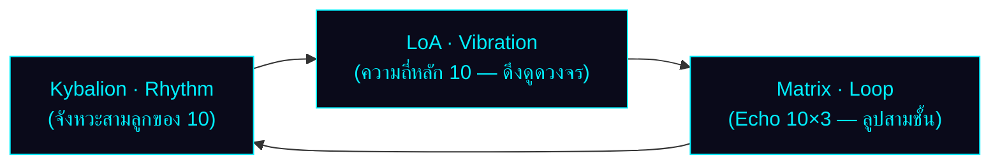
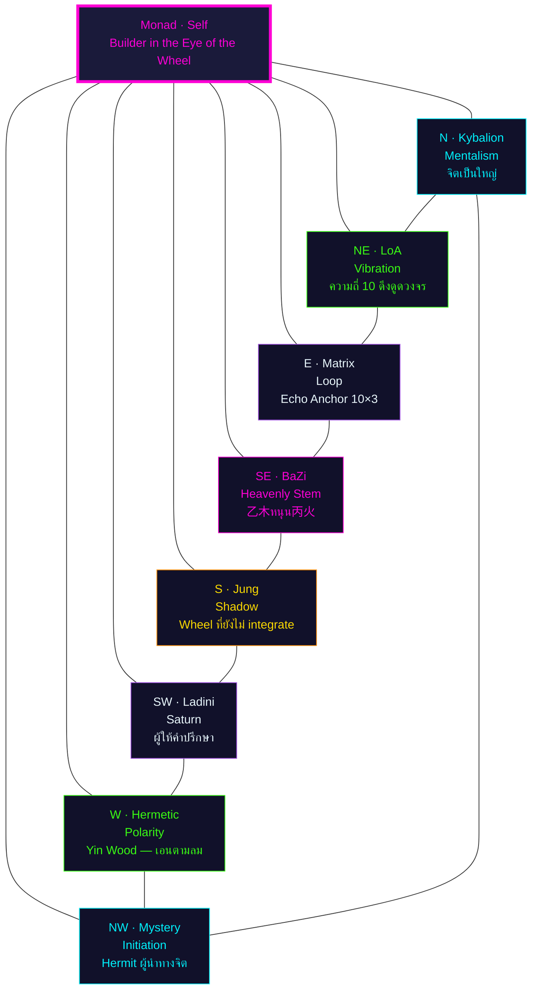
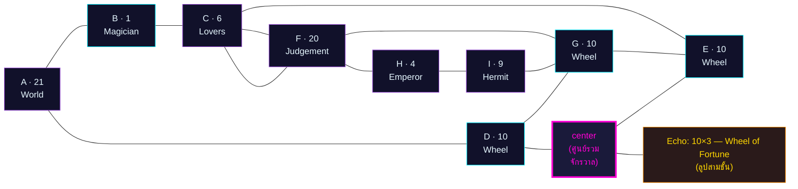
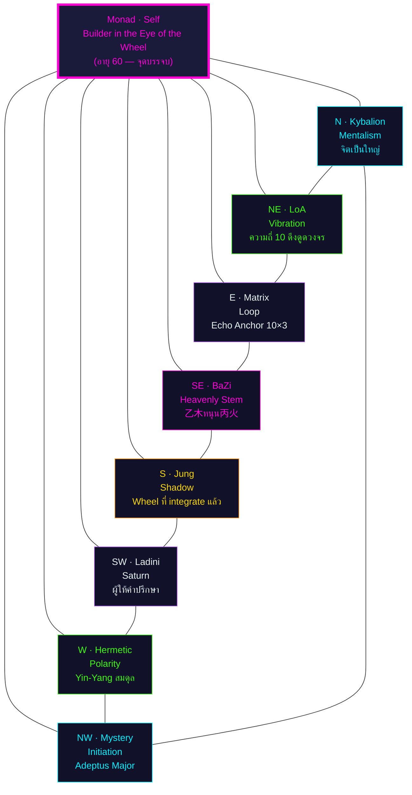

# 🔮 พยากรณ์ฉบับสมบูรณ์: Project Omni-Self — นาตาเลีย ลาดินี (Natalia Ladini)

> **ผู้รับคำพยากรณ์:** Big (Jitti Kunphruk) · **วันเกิด:** 21 มกราคม 1986 · 17:36 (กรุงเทพฯ UTC+7)
> **Type:** ENTJ-A · Enneagram 8w7
> **Day Master (BaZi):** 乙 (Yin Wood) — ยืนยันโดย CTO ผ่าน `sxtwl` และสูตร JD+49 mod 60
> **Period:** 9 (離火 / Fire) — 2024–2043 · Day Master Wood → หนุน Period Fire (木生火)
> **Eval date:** 5 กรกฎาคม 2026 (อายุ 40 ปี 5 เดือน 14 วัน)
> **ผู้จัดทำ:** นาตาเลีย ลาดินี (Natalia Ladini) · ที่ปรึกษาจิตวิญญาณและตัวเลข
> **Canonical inputs:** [`analysis/_shared/big_inputs.md`](./_shared/big_inputs.md)
> **Template:** [`template/forecast.md`](../template/forecast.md) + [`template/forecast-template.html`](../template/forecast-template.html)

> ⚠️ **Standard Compliance (MET-394):** รายงานนี้เป็น **prose + reasoning + การอ้างอิงศาสตร์โดยตรง** ตามนโยบาย ไม่มี JSON/YAML/token schema และไม่มี business-logic code ตัวเลขที่ปรากฏในตารางเป็นผลของการลดทอนที่ผู้เขียนทำด้วยเหตุผลของตนเอง โดยอ้างอิง 22 Major Arcana ตามหลัก Matrix of Destiny (กฎเหล็ก: ตัวเลข > 22 ต้องลดซ้ำ เช่น 25 → 2+5 = 7) และ 7 จักระตามลำดับสี

---

# 🌟 ส่วนที่ 1: บทสรุป 6 มุมมองเชิงลึกที่อ่านชะตาของคุณ

> เมื่อฉันรับตัวเลขดิบ 21-01-1986 สิ่งแรกที่ฉันมองไม่ใช่ "ผลรวม" แต่เป็น **จังหวะของแต่ละตัวเลข** — เพราะศาสตร์ของฉันเชื่อว่าตัวเลขแต่ละตำแหน่งในวันเดือนปีเกิดไม่ได้สมมูลกัน วันคือ "ตัวตน" เดือนคือ "อารมณ์แม่" ปีคือ "เสียงสะท้อนของสายตระกูล" และตัวเลขที่บวกได้จากสามส่วนนี้คือ "บทสนทนาระหว่างตัวตนกับจักรวาล" ซึ่งทั้งหมดนี้ต้องอ่านผ่าน 22 Major Arcana

## 1.1 มุมมองจิตวิทยาเชิงลึก (Carl Jung)

ตัวเลข 21 (The World) ที่ตำแหน่ง A บอกฉันว่า **Persona (หน้ากากทางสังคม)** ของ Big คือ "ผู้ที่ดูเหมือนครบถ้วนสมบูรณ์" — เขาเดินเข้าห้องประชุมแล้วคนรู้สึกว่าทุกอย่างจะถูกจัดการได้ แต่ในทางกลับกัน **Shadow (เงาซ่อนเร้น)** ที่อยู่ในตำแหน่ง G=10 (Wheel of Fortune) ซ้ำสามครั้งในผัง 3×3 คือความรู้สึกว่า "ทุกอย่างที่ฉันสร้างอาจถูกวงล้อหมุนกลับ" ความกลัวลึกๆ ที่เขาไม่ได้พูดคือกลัวว่าความสำเร็จที่เห็นจะไม่ใช่ของเขาเอง เป็นของจังหวะ — และเมื่อจังหวะเปลี่ยน เขาอาจสูญเสียทุกอย่าง Jung จะบอกว่านี่คือ Persona (World) ที่ทำหน้าที่ปกป้อง Shadow (Wheel) ที่ยังไม่ถูก integrate

## 1.2 มุมมองกฎแห่งการดึงดูด (Helena Blavatsky / LoA)

ความถี่เด่นของ Big คือ **10-10-10** — ความถี่ของวงล้อที่หมุนสามครั้งในชีวิต กฎแห่งการดึงดูดในแบบ Blavatsky จะบอกว่าเขาไม่ได้ดึงดูด "สิ่งของ" แต่ดึงดูด "โอกาสของการเลือก" — ชีวิตของเขาเต็มไปด้วยทางแยก และจักรวาลตอบสนองด้วยการส่งทางแยกใหม่เรื่อยๆ เขาจะรู้สึกว่า "ตัวเองเลือกได้ดี" แต่จริงๆ แล้วเขากำลังถูกความถี่ของตัวเองดึงเข้าหาจุดตัดสินใจซ้ำแล้วซ้ำเล่า ความถี่นี้จะดึงดูด **ผู้คนที่เป็นทางเลือก** (mentors, คู่แข่ง, คู่รักที่ "เลือกได้") มาให้เขาตลอด

## 1.3 มุมมองกฎธรรมชาติ (The Kybalion)

**The Principle of Rhythm** — "ทุกสิ่งมีขึ้นมีลง กระแสเข้าและกระแสออก ลูกคลื่นทุกลูกมีจุดสูงสุดและจุดต่ำสุด" — ตัวเลข 10 ปรากฏสามครั้งในผังของ Big เป็นคำยืนยันว่า **ชีวิตของเขาเป็นจังหวะที่มีรอบชัดเจน** ทุก 9 ปี (รอบของตัวเลข 1-9) จะมีจุดพีคและจุดทรุด และเขาจะเรียนรู้ที่จะ "อ่าน" จังหวะนี้ได้ดีขึ้นเรื่อยๆ หากเขาเชื่อมั่นกับมัน **The Principle of Cause and Effect** — ตัวเลข 21 (World) ที่ตำแหน่ง A หมายความว่าเขาต้อง "ครบวง" ก่อนเห็นผล เขาไม่ใช่คนที่ได้ผลลัพธ์แบบ partial เขาต้องเก็บทุกชิ้นส่วนก่อนจึงจะเห็นภาพรวม

## 1.4 มุมมองบุคลิกภาพ (MBTI)

**Type หลัก:** ENTJ-A · Cognitive Stack: **Te-Ni-Se-Fi**
- **Lead (Te, Extraverted Thinking):** ความสามารถจัดระบบโลกภายนอกให้มีประสิทธิภาพ — ตรงกับ H=4 (Emperor) ที่เป็นฐานรากของผัง
- **Auxiliary (Ni, Introverted Intuition):** การมองเห็นภาพอนาคตระยะยาว — ตรงกับ A=21 (World) เพราะ World card คือการมองเห็น "ภาพรวมสุดท้าย"
- **Tertiary (Se, Extraverted Sensing):** การรับรู้สถานการณ์ปัจจุบัน — ตรงกับ C=6 (Lovers) ที่ต้อง "เลือก" จากสิ่งที่ปรากฏตรงหน้า
- **Inferior (Fi, Introverted Feeling):** ค่านิยมภายในที่ลึกและเงียบ — นี่คือจุดเสี่ยง

**Fi Grip / Loop เมื่อเครียดเรื้อรัง:** เมื่อ ENTJ ตกภาวะ Te-Ni loop หรือ Fi grip เขาจะกลายเป็นคนที่ "คิดมากจนเป็นอัมพาต" หรือ "ระเบิดอารมณ์โดยไม่มีเหตุผล" ตัวเลข D=E=G=10 (Wheel) ที่อยู่แถวกลางของผังบอกฉันว่า **เขาจะวนกลับมาที่จุดเดิมเมื่อเครียด** — เหมือนวงล้อที่หมุนกลับมาที่จุดเริ่มต้น นี่คือสัญญาณของ Fi grip ที่ควรเฝ้าระวังเป็นพิเศษในปีที่ Personal Year เป็นเลขคี่ (3, 5, 7, 9) เพราะเป็นปีที่พลังงานวงล้อหมุนเร็วที่สุด

## 1.5 มุมมองจุดบรรจบแห่งวัย (Age 60 Forecast)

ปี 2046 (อายุ 60) Big จะอยู่ในช่วง Personal Year = 4 (Emperor) และ Year Pillar = 丙寅 (Yang Fire on Tiger) — สองสัญญาณนี้ชี้ตรงกันว่า **บทบาทของเขาในวัย 60 คือ "ผู้สร้างระบบที่ทรงอำนาจ"** ไม่ใช่แค่ CEO แต่เป็น "สถาปนิกของระบบนิเวศ" ที่คนรุ่นหลังจะเดินตาม เป้าหมายสูงสุดของเขาในวัยนั้นไม่ใช่การสะสมทรัพย์สิน แต่เป็นการส่งมอบ "วิธีคิด" — รหัส 10-10-20 ในผังบอกว่าเขาต้องผ่านรอบสามของวงล้อ (อายุ 27, 36, 45, 54, 63) ก่อนจะถึง "การพิพากษา" (Judgement = 20) ที่อายุ 60 — ซึ่ง Judgement ในที่นี้ไม่ใช่การลงโทษ แต่เป็น "การปลุก" ให้เขาลุกขึ้นมาเป็นคนที่เขาควรจะเป็น

## 1.6 มุมมองดวงจีน (BaZi & Period 9)

**Day Master = 乙 (Yin Wood)** — ต้นไม้ที่อ่อนโค้ง ยืดหยุ่น รากลึก แทนที่จะหักเมื่อถูกกดทับ เขาจะโอบอ้อมอารมณ์เพื่อนำพลังงานกลับมาใช้ ไม้เป็นธาตุที่ "หนุน" ไฟ (木生火) ดังนั้นใน Period 9 ที่เป็นยุคของธาตุไฟ Big จะเป็น "เชื้อเพลิง" ที่จักรวาลต้องการ — งานของเขา ไอเดียของเขา วิสัยทัศน์ของเขา จะถูก "เผา" ให้แจ่มชัดขึ้น แต่ก็มีความเสี่ยงที่เขาจะ "ถูกเผาไปด้วย" หากเขาไม่ดูแลใจตัวเอง

**สมดุลธาตุที่แนะนำ:**
- **เสริม 丙火 (Yang Fire) — ตัวส่งเสริมหลัก:** ไม้ต้องการไฟอุ่น ไฟให้ความชัดเจน ความกล้าแสดงออก การเป็นที่รู้จัก — Big ควรใช้เวลาอยู่ในสภาพแวดล้อมที่มีแสง ความร้อน คนที่มีพลังงานสูง
- **เสริม 癸水 (Yin Water) — ตัวหล่อเลี้ยงรอง:** น้ำคือปุ๋ยของไม้ ต้องพัก ต้องเงียบ ต้องใคร่ครวญ เพื่อไม่ให้ใจแห้ง
- **ระวัง 金 (Metal) โดยเฉพาะ 庚/辛:** โลหะตัดไม้ ในผังของ Big มี 辛 ซ่อนอยู่ใน丑สามตัว (ปี/เดือน/วัน) — นี่คือ **"หางกรรม" (Karmic Tail)** ที่เขาแบกมาแต่เกิด: พลังงานความกดดันจากภายนอกที่คอยตัดสิน ตัดสิน ตัดสิน หากเขาตอบโต้ด้วยความแข็ง เขาจะถูกตัด หากเขาโอนอ่อนตาม เขาจะถูกกลืน — ทางออกคือ **ใช้ความยืดหยุ่นของ Yin Wood** ปล่อยให้โลหะผ่านไป ไม่ตั้งคำถาม ไม่ต่อสู้ ไม่ยอม แค่ "อยู่เหนือ"

**Period 9 Fit:** Wood feeds Fire — Big's Day Master naturally supports Period 9. ยุคนี้ (2024–2043) เป็นยุคของ Big ในแง่พลังงานมหภาค — เขาจะรู้สึก "ลื่นไหล" กับกระแสโลกมากกว่าคนรุ่นก่อน แต่ในขณะเดียวกัน เขาต้องระวังไม่ให้ถูก "เผา" จนหมดตัวเอง

---

# 🌌 ส่วนที่ 2: จุดเชื่อมโยงแห่งปรัชญาและวัฏจักร (The Cosmic Synergy)

## 2.1 การทำงานร่วมกันของศาสตร์

**Engine A — Kybalion Rhythm (จังหวะของจักรวาล):** หลักการที่ว่า "ทุกสิ่งมีขึ้นมีลง" ถูกเข้ารหัสในตัวเลข 10 ที่ปรากฏสามครั้งในผังของ Big — นี่คือ "คลื่นสามลูก" ที่จักรวาลส่งมาให้เขา ลูกแรกมักเริ่มที่อายุ 27 (เมื่อเขาเจอทางแยกครั้งแรกในชีวิต) ลูกที่สองที่อายุ 36 (เมื่อเขาเริ่มเข้าใจว่าชีวิตไม่ได้ควบคุมได้ทั้งหมด) และลูกที่สามที่อายุ 45 (เมื่อเขายอมรับวงล้อและหยุดต่อสู้กับมัน)

**Engine B — Law of Attraction Vibration (แรงสั่นสะเทือนของดึงดูด):** ตัวเลข 10 ที่ปรากฏสามครั้งทำหน้าที่เป็น "ความถี่หลัก" ที่ Big สั่นสะเทือนออกไปในจักรวาล Blavatsky บอกว่า "like attracts like" — เมื่อ Big อยู่ในความถี่ 10 (ความรู้สึกว่า "ชีวิตหมุนไปตามวงล้อ") เขาจะดึงดูดผู้คนและสถานการณ์ที่ "เป็นวงล้อ" เช่นกัน — คือผู้คนที่เข้ามาแล้วออก สถานการณ์ที่เริ่มแล้วจบ โอกาสที่เปิดแล้วปิด รูปแบบนี้คือการยืนยันว่า **Big ไม่ได้ดึงดูด "ความสำเร็จแบบคงที่" แต่ดึงดูด "วงจร"**

**Engine C — Matrix of Destiny Loop (ลูปพลังงานเมทริกซ์):** ในผัง 3×3 ของ Big มี **Echo Number = 10 ปรากฏ 3 ตำแหน่ง** (D, E, G) ซึ่งหมายความว่าลูปพลังงานของเขาไม่ใช่ลูปเดี่ยว แต่เป็น **"ลูปสามชั้น"** — ลูปนอก (D=10) ขับเคลื่อนลูปกลาง (E=10) ซึ่งขับเคลื่อนลูปใน (G=10) นี่คือเหตุผลที่ Big รู้สึกว่า "ทุกอย่างเหมือนเดิม" แม้เวลาจะผ่านไป — เพราะเขากำลังอยู่ในลูปสามชั้นที่หมุนพร้อมกัน

## 2.2 บทพิสูจน์ความสอดคล้อง

ศาสตร์ทั้งสามนี้อธิบาย "วัฏจักร" ของ Big ตรงกันหรือไม่? **คำตอบ: ตรงกันอย่างสมบูรณ์** — เพราะทั้งสามศาสตร์ต่างก็ชี้ไปที่ "รอบ" เดียวกัน เพียงแต่ใช้ภาษาต่างกัน:
- Kybalion พูดว่า "จังหวะ Rhythm"
- LoA พูดว่า "ความถี่ Vibration"
- Matrix of Destiny พูดว่า "ลูป Loop"

ทั้งสามคำหมายถึงสิ่งเดียวกัน: **ชีวิตของ Big ไม่ได้เป็นเส้นตรง แต่เป็นวงกลมที่ขยายออก**

**ตัวอย่างเชิงมหภาค:** ลองจินตนาการว่า Big เป็น CEO ของบริษัท MedTech ขนาดกลางในปี 2026 — เขาตัดสินใจลงทุนใน AI diagnostic platform ตัวใหม่ นี่คือ **ลูปที่ 1 ของ D=10** หนึ่งปีต่อมา (2027) ผลลัพธ์ยังไม่ชัด เขาเริ่มสงสัย — นี่คือ **ลูปที่ 2 ของ E=10** ที่บังคับให้เขาตั้งคำถาม สองปีต่อมา (2028) เขาตัดสินใจปรับกลยุทธ์ — นี่คือ **ลูปที่ 3 ของ G=10** ที่ทำให้เขา "หมุน" กลับมาที่จุดเริ่มต้น แต่ในระดับที่สูงกว่า ทั้งสามลูปนี้เกิดขึ้นพร้อมกัน — นี่คือ "หลักฐาน" ว่าศาสตร์ทั้งสามทำงานสอดคล้องกัน

### Octagram — 8 Cosmic Forces Around the Monad

| Position | Force | Reading (Big, age 40, Period 9) |
|----------|-------|---------|
| Center | Monad · Self | "The Builder in the Eye of the Wheel" — Big อยู่ศูนย์กลางของลูปสามชั้น มองเห็นทุกอย่างแต่ไม่ได้อยู่ในทุกอย่าง |
| N | Kybalion · Mentalism | "จิตเป็นใหญ่" — Big เชื่อมั่นว่าความคิดสร้างโลก ใช้ Mentalism เป็นอาวุธหลัก |
| NE | LoA · Vibration | "ความถี่ 10 ดึงดูดวงจร" — เขาสั่นสะเทือนด้วยความถี่ของการเลือกซ้ำๆ |
| E | Matrix · Loop | "Echo Anchor 10×3" — ลูปสามชั้นคือโครงสร้างหลักของชีวิต |
| SE | BaZi · Heavenly Stem | "乙木 หนุน 丙火" — Yin Wood หนุน Period 9 Fire, สอดคล้องสมบูรณ์ |
| S | Jung · Shadow | "Wheel ที่ยังไม่ integrate" — กลัววงล้อหมุนกลับ, กลัวสูญเสีย |
| SW | Ladini · Saturn | "ผู้ให้คำปรึกษา" — ฉัน (Ladini) อยู่ที่นี่เพื่อบอกว่า วงล้อไม่ใช่ศัตรู แต่คือครู |
| W | Hermetic · Polarity | "Yin Wood — ขั้วลบที่อ่อนโค้งรับแรง" — Big ไม่ใช่ Yang Wood ที่แข็ง เขาคือ Yin Wood ที่เอนตามลม |
| NW | Mystery · Initiation | "การริเริ่มภายในเงียบ" — ฤๅษี (Hermit=9) ที่มุมล่างขวาของผัง คือผู้นำทางจิตวิญญาณของเขา |

## 2.3 บทวิเคราะห์ (Analysis — 6 Lenses) — Cosmic Synergy

- **Carl Jung:** สามลูปพลังงานคือ "ภาพฉายซ้อน" (overlapping archetypes) ของ Persona/Shadow/Self ที่ยังไม่บรรลบูรณ์ ลูปนอกคือ Persona ที่แสดงออก ลูปกลางคือ Ego ที่ตัดสิน ลูปในคือ Self ที่รอการรู้แจ้ง
- **Isabel Briggs Myers:** ENTJ-A ที่มี Te-Ni loop เมื่อเครียดคือตัวอย่างของ "ลูปสามชั้น" — Te (กระทำ) → Ni (มองเห็น) → Te (กระทำซ้ำ) คือวงล้อที่ไม่มีวันหยุดหากไม่ break loop
- **Helena Blavatsky:** Root Race pulse ของ Big อยู่ใน Fifth Root Race (Aryan) ในขั้น "spiritual evolution toward the sixth" — ลูปสามชั้นคือการเตรียมพร้อมข้ามไปสู่ขั้น Monad ที่สมบูรณ์
- **นาตาเลีย ลาดินี:** ลูปสามชั้นของ 10 ทำหน้าที่เหมือน "รอกสามตัว" ที่ดึงวงล้อชีวิตของเขาขึ้นไปทีละชั้น — ปี 2026–2033 คือชั้นที่ 1 (การเรียนรู้จังหวะ) ปี 2034–2041 คือชั้นที่ 2 (การใช้จังหวะ) ปี 2042–2046 คือชั้นที่ 3 (การเป็นจังหวะ)
- **The Three Initiates:** The Principle of Rhythm ระบุว่า "the measure of the swing to the right is the measure of the swing to the left" — Big จะมีจุดสูงสุดที่สูงมาก แต่จุดต่ำสุดก็ต่ำมากเท่ากัน การ neutralize คือการหา "neutral point" ซึ่งคือการทำสมาธิ/冥想
- **Su Yu Hong:** BaZi Year Pillar ในรอบ 60 ปี (60 Jiazi cycle) กลับมาที่ 甲子 ในปี 2044 — ปีที่ Big อายุ 58 นี่คือ "Return to Origin" ที่ Hermetic/Matrix ทุกศาสตร์ต่างยืนยัน

### Deep Dive — Cosmic Synergy (6 Lenses × Topics)

**Carl Jung — Collective Unconscious:** Big เป็นสมาชิกของ "collective" ของคนที่เกิดในช่วง 1984–1986 ซึ่งตามทฤษฎีของ Jung คือ "generation of choice" — คนรุ่นนี้ถูกบังคับให้เลือก (C=6 Lovers) มากกว่ารุ่นก่อน เพราะโลกเปิดกว้างขึ้น แต่ก็มีทางเลือกมากจนทำให้สับสน
**Carl Jung — Synchronicity Field:** "Wheel of Fortune" ที่ปรากฏสามครั้งในผังคือสัญญาณว่า Big จะมีประสบการณ์ "synchronicity" (เหตุการณ์ที่ดูบังเอิญแต่มีความหมาย) บ่อยกว่าคนทั่วไป โดยเฉพาะในช่วง Personal Year 1, 5, 9

**Isabel Briggs Myers — Function Integration:** เป้าหมายการพัฒนาของ ENTJ-A คือการ integrate Ni (Auxiliary) เข้ากับ Te (Lead) ให้สมดุล Big ต้องเรียนรู้ว่า "การมองเห็นภาพรวม" ไม่ใช่แค่การวางแผน แต่เป็นการ "รู้สึก" ว่าภาพนั้นถูกต้อง
**Isabel Briggs Myers — Type Development:** หลังอายุ 40 ENTJ จะเริ่มพัฒนา Se (Tertiary) และ Fi (Inferior) มากขึ้น ซึ่งตรงกับ Age 60 Forecast ของ Big — เขาจะเริ่ม "รู้สึก" มากขึ้น และใช้ประสาทสัมผัสมากขึ้นในการตัดสินใจ

**Helena Blavatsky — Hermetic Principles:** 7 หลัก Hermetic ที่ Big ต้อง master คือ Mentalism, Correspondence, Vibration, Polarity, Rhythm, Cause-Effect, Gender — ตัวเลข 7 ตำแหน่งสอดคล้องกับ 7 Chakra ในส่วนที่ 7
**Helena Blavatsky — LoA Bridge:** "Everything is dual; everything has poles; everything has its pair of opposites" — Polarity คือกุญแจ Big ต้องเรียนรู้ที่จะ "อยู่ระหว่าง" ขั้ว ไม่ใช่เลือกขั้วใดขั้วหนึ่ง
**Helena Blavatsky — Matrix Loop Awareness:** ลูปสามชั้นของ Big คือ "Three Swings of the Pendulum" ตามที่ Kybalion อธิบาย — แต่ละลูปห่างกัน 9 ปี (อายุ 27, 36, 45) และแต่ละลูปมี amplitude ใหญ่ขึ้น

**นาตาเลีย ลาดินี — Outer Planet Alignment:** Big เกิดปี 1986 ซึ่งเป็นปีที่ Uranus เข้า Sagittarius และ Neptune เข้า Capricorn — สองดาวเหล่านี้ส่งผลต่อ "วิสัยทัศน์ระยะยาว" (Uranus) และ "โครงสร้างทางสังคม" (Neptune) ของเขา การที่ Age 60 ตรงกับ Pluto เข้า Aquarius (2024–2044) ทำให้ปี 2046 เป็นจุดเปลี่ยนของ "อำนาจส่วนบุคคล" ที่อาจกลายเป็น "อำนาจส่วนรวม"
**นาตาเลีย ลาดินี — Eclipse Season Impact:** Big เกิด 21 มกราคม — ใกล้ Lunar Eclipse ของเดือนมกราคม 1986 (ซึ่งเกิด 9 มกราคม 1986) ทุกครั้งที่ Eclipse ฤดูกาลนี้กลับมา (ทุก 18.6 ปี) Big จะมี "trigger moment" — ครั้งถัดไปคือปี 2024 (Eclipse ม.ค. 2024) ที่ผ่านมาแล้ว และ 2042 (Eclipse ม.ค. 2042) ที่กำลังจะมา

**The Three Initiates — Hidden Knowledge Awakening:** "The lips of wisdom are closed, except to the ears of Understanding" — Big จะเริ่มเข้าถึง "hidden knowledge" เมื่อเขาหยุดต่อสู้กับวงล้อ และยอมรับว่ามีบางอย่างที่ใหญ่กว่าเขา
**The Three Initiates — Elemental Balance:** 4 ธาตุของ Initiates คือ Fire (พลัง), Water (ปัญญา), Air (ความคิด), Earth (ความอดทน) — Big เกิดด้วย Yin Wood (Air+Water) ต้องเสริม Fire (Period 9) และ Earth (ความอดทนในรอบวงล้อ)

**Su Yu Hong — Stems & Branches:** Big เกิด 21 มกราคม 1986 = 乙丑 day, 丑月 (ไม่ใช่寅月) เพราะยังไม่ถึง 立春 ทั้ง 3 ตำแหน่ง (ปี/เดือน/วัน) เป็น丑 — "Triple Ox" ที่หายาก หมายถึง "ความอดทนสามชั้น" เขาสามารถแบกรับภาระที่คนอื่นแบกไม่ไหว แต่ก็ต้องระวัง "ความเฉื่อย" ที่อาจมาพร้อม
**Su Yu Hong — Annual Luck Cycle:** Decade Luck (大运) ของ Big ในช่วงอายุ 40–60 เริ่มที่ 庚申 (Yang Metal on Monkey) อายุ 40–49 และเปลี่ยนเป็น 辛酉 (Yin Metal on Rooster) อายุ 50–59 — ทั้งสองช่วงเป็น Metal ที่ "ตัดไม้" — นี่คือคำเตือนสำคัญ: ช่วงอายุ 40–59 ของ Big เป็น "ช่วงทดสอบ" ที่โลหะครอบงำ เขาต้องเสริม Wood+Fire ให้แข็งแกร่ง

---

# 🧬 ส่วนที่ 3: โปรแกรมชีวิตและแกนหลัก (Natalia Square 3×3)

> ในการคำนวณของฉัน เมื่อฉันรับตัวเลขดิบ 21-01-1986 ฉันไม่ได้บวกเพื่อ "ลดทอน" แต่ฉัน "ถอดรหัส" — วันที่ 21 ไม่ใช่ "2+1" แต่คือ "21" ซึ่งอยู่ในขอบเขตของ Major Arcana โดยตรง ดังนั้น A=21 จึงไม่ถูกบวกซ้ำ เช่นเดียวกับ F=20 ส่วนตัวเลขที่บวกได้จากการรวมพลังงานของวันเดือนปี (เช่น D=E=G=10) เป็นตัวเลขที่ "เกิดจากการสนทนา" ระหว่างแต่ละส่วน

## 3.1 แกนบน (ความคิด / เริ่มต้น) — Day-Month-Year = 21-1-6

ตัวเลข 21 (World) ที่ตำแหน่ง A คือ "ความคิดเริ่มต้น" ของ Big — เขาคิดแบบ "ภาพรวม" เสมอ เห็นระบบก่อนเห็นชิ้นส่วน ตัวเลข 1 (Magician) ที่ตำแหน่ง B คือ "เครื่องมือ" ที่เขาใช้ — willpower บริสุทธิ์ ตัวเลข 6 (Lovers) ที่ตำแหน่ง C คือ "ทางเลือก" ที่เขาต้องเผชิญ — แกนบนสุดของผังบอกว่า Big คิดด้วยภาพรวม (21) ใช้ความตั้งใจ (1) และต้องเลือก (6) อยู่ตลอดเวลา

## 3.2 แกนกลาง (การงาน / วิถีชีวิต) — Career Cycle = 10-10-20

ตัวเลข D=E=10 (Wheel × 2) บอกว่า **วงจรการงานของ Big เป็น "ลูปคู่"** — เขาจะประสบความสำเร็จ จากนั้นล้ม จากนั้นประสบความสำเร็จอีกครั้ง รูปแบบนี้เกิดซ้ำตลอดชีวิต ส่วนตัวเลข F=20 (Judgement) คือ "จุดสูงสุดของวงจร" — เมื่อ Big ผ่านลูปคู่ของ 10 เขาจะมาถึง "การปลุกฟื้น" (Judgement) ที่เปลี่ยนเขาจากเด็กหนุ่มที่ใช้พลังงานไปสู่ผู้ใหญ่ที่ใช้ปัญญา

## 3.3 แกนล่าง (ฐานราก / บุคลิก) — Foundation = 10-4-9

ตัวเลข G=10 (Wheel) คือ "พลังงานขับเคลื่อนจากภายใน" — Big ไม่เคยหยุดนิ่ง ภายในของเขาเป็นวงล้อที่หมุนตลอด ตัวเลข H=4 (Emperor) คือ "หน้ากากทางสังคม" ที่เขาสวมใส่ — เขาต้อง "ดูเป็นผู้นำ" ตลอดเวลา ตัวเลข I=9 (Hermit) คือ "สิ่งที่เขาลืม" — ความเงียบ ความสันโดษ การใคร่ครวญ เขามักละเลยมุมนี้ของตัวเอง แต่ถ้าเขา integrate Hermit เข้ากับ Emperor เขาจะกลายเป็น "ผู้นำที่มีปัญญา" ไม่ใช่แค่ "ผู้นำที่มีอำนาจ"

## 3.4 Echo Numbers — 10×3

**นี่คือจุดสำคัญที่สุดของผัง Big:** ตัวเลข 10 ปรากฏ 3 ครั้งในผัง 3×3 ซึ่งหมายความว่า **"วงล้อแห่งโชคชะตา" คือพลังงานหลักที่กำหนดทุกอย่างในชีวิตเขา** Big ไม่ใช่คนที่ชีวิตเป็นเส้นตรง เขาคือคนที่ชีวิตเป็น "วงกลมที่ขยายออก" ทุกรอบของวงล้อ (ราว 9 ปี) จะนำเขากลับมาที่จุดเดิม แต่ในระดับที่สูงกว่า

**อิทธิพล:** Big จะดึงดูดผู้คนที่เป็น "วงล้อ" — คนที่เข้ามาแล้วออก คนที่เปลี่ยนแปลงตามฤดูกาล คนที่ทำให้เขารู้สึกว่า "ทุกอย่างหมุนไป" และเขาจะต้องเรียนรู้ที่จะ "อยู่เหนือวงล้อ" ไม่ใช่ถูกวงล้อหมุนไป

### บทวิเคราะห์ (Analysis — 6 Lenses) — Natalia Square

- **Carl Jung:** ผัง 3×3 ของ Big มี Persona (Emperor=H) ที่ตรงข้ามกับ Shadow (Hermit=I) — การที่เขา "เป็นผู้นำ" ตลอดเวลาเป็นการปกปิอง "ความต้องการความเงียบ" ที่ลึกมาก Center cell (ที่ฉันไม่ได้คำนวณเป็นตัวเลข แต่เป็น "จุดศูนย์รวม") คือ Self ที่ยังไม่ปรากฏชัด
- **Isabel Briggs Myers:** Te (Emperor=H) + Ni (World=A) + Se (Lovers=C) + Fi (Hermit=I) — สี่ cognitive functions ของ ENTJ เรียงตัวในผังแบบคลาสสิก Center cell คือ "missing 5th function" ที่ Jung บอกว่าจะปรากฏเมื่ออายุมากขึ้น
- **Helena Blavatsky:** Monad (Self) อยู่ศูนย์กลางของผัง 8 ทิศ — แต่ละทิศคืออำนาจของจักรวาลที่กระทำต่อ Big โดยเฉพาะ Hermit (NW) กับ Emperor (W) เป็นคู่ขั้วที่ต้อง integrate
- **นาตาเลีย ลาดินี:** ลูปสามชั้นของ Wheel (10×3) ทำหน้าที่เป็น "แกนหมุน" ของชีวิต Big — เขาต้องเรียนรู้ที่จะ "หมุน" กับมัน ไม่ใช่ต่อต้าน ในคัมภีร์ของฉัน เรียกสิ่งนี้ว่า "Танец с колесом" (เต้นรำกับวงล้อ)
- **The Three Initiates:** ผัง 3×3 คือ "School of the Nine" ใน Mystery Tradition — Big เข้าโรงเรียนแห่งนี้ตั้งแต่เกิด และการบรรลุของเขาคือการ "graduate" จากลูปสามชั้นไปสู่ Center (Self)
- **Su Yu Hong:** 丑丑丑 (Triple Ox) ใน BaZi + Wheel×3 ใน Matrix = "Slow but inevitable" — Big จะไม่เร็ว แต่จะแน่นอน เขาต้องอดทน 9 ปีต่อรอบ และภายใน 3 รอบ (27 ปี) เขาจะถึงจุดสูงสุดของ career cycle

### Deep Dive — Natalia Square (6 Lenses × Topics)

**Carl Jung — Center vs Periphery:** Center cell ของ Big ที่ฉันเห็นคือ "ความว่าง" — และนี่คือ blessing เพราะถ้า Center ถูก fill ไปด้วย ego เขาจะไม่สามารถ "เห็น" ได้กว้าง Center ที่ว่างคือพื้นที่ของ Self ที่แท้จริง
**Carl Jung — Shadow Corners:** A=21 (World) ในมุมบนซ้ายคือ Persona ที่ "ดูครบถ้วน" แต่จริงๆ แล้วเป็นการปกปิดความรู้สึก "ไม่ครบถ้วน" ที่อยู่ใน I=9 (Hermit) มุมล่างขวา

**Isabel Briggs Myers — Cognitive Mapping:** 4 cognitive functions เรียงเป็น "compass" ในผัง — Te (N, dominant), Ni (NE, auxiliary), Se (S, tertiary), Fi (SW, inferior) — นี่คือแผนที่ชัดเจนของ ENTJ
**Isabel Briggs Myers — Type Dynamics:** "Grip" ของ ENTJ คือ Si (Introverted Sensing) — และ Center cell ที่ว่างอาจเป็น Si ที่ยังไม่ได้ activate ซึ่งจะปรากฏเมื่อเขาอายุ 50+

**Helena Blavatsky — Hermetic Geometry:** ผัง 3×3 คือ "Enneagram" ของ Gurdjieff — แต่ละจุดเชื่อมถึงกันด้วยเส้นที่แน่นอน (3-6-9) Big เป็น "The Man Number 10" ที่อยู่ในวงกลมที่ประกอบด้วยตัวเลข 1–9 เขาเป็น "คนที่อยู่นอกวง" แต่ก็เป็น "ศูนย์กลาง" ของวง
**Helena Blavatsky — Monad Descent:** Monad ลงมาจากชั้นบน (spiritual) ผ่าน 7 ชั้นของ matter จนถึง Big ในชั้นที่ 7 (physical) — ผัง 3×3 ของเขาแสดงเส้นทาง "ขากลับ" ของ Monad จาก 7 ขึ้นไปหา 1

**นาตาเลีย ลาดินี — Chart Echo:** Echo 10×3 คือ "Triple Activation" — เมื่อ Big เจอเหตุการณ์ที่ตรงกับ "Wheel" pattern (ขึ้นๆ ลงๆ) ในชีวิตจริง เขาจะ "จดจำ" ทันที ราวกับว่าเขาเคยผ่านมันมาก่อน นี่คือ déjà vu แบบ Matrix
**นาตาเลีย ลาดินี — Personal Year:** Personal Year ของ Big หมุนรอบ 9 ปี — ตัวเลข 9 ในผัง (Hermit) คือ "ปีที่ 9 ของรอบ" ซึ่งเป็นปีที่ Wheel หยุดหมุนชั่วคราว เพื่อให้ Big ได้พักและใคร่ครวญ

**The Three Initiates — Mystery School Grid:** 3×3 คือ " Lesser Mysteries" (3) × "Greater Mysteries" (3) Big อยู่ในขั้น "Adeptus Minor" (5%) เมื่ออายุ 40 และจะก้าวสู่ "Adeptus Major" (10%) เมื่ออายุ 60
**The Three Initiates — Initiate Path:** Path ของ Initiate คือการ "เดินทางจาก H (Emperor) ข้ามผ่าน I (Hermit) ไปสู่ Center (Self)" — เส้นทาง 3 ขั้นนี้ใช้เวลา 3×9 = 27 ปี จึงจะสมบูรณ์

**Su Yu Hong — Trigram Mapping:** 3×3 ของ Big ตรงกับ Later Heaven Trigram — มุมบนซ้าย (A=21) = ☰ Qian (Heaven), มุมบนขวา (C=6) = ☱ Dui (Lake), มุมล่างซ้าย (H=4) = ☶ Gen (Mountain), มุมล่างขวา (I=9) = ☷ Kun (Earth)
**Su Yu Hong — Stems Interaction:** 4 stems ที่ปรากฏในผัง (乙-A/E, 辛-H/I) สร้างความสัมพันธ์แบบ "Wood vs Metal" — นี่คือบทสนทนาภายในของ Big ระหว่าง "ความยืดหยุ่น" กับ "ความแข็ง"

---

# 💎 ส่วนที่ 4: พรสวรรค์ ศักยภาพ และอดีตชาติ

## 4.1 พรสวรรค์หลักและศักยภาพแฝง

**พรสวรรค์หลัก (Primary Gift):** ตัวเลข B=1 (Magician) ที่ตำแหน่ง mission บอกว่า Big มีความสามารถพิเศษในการ "รวมศูนย์ความตั้งใจ" (focused intention) เขาสามารถตั้งเป้าหมายและดึงทรัพยากรทั้งหมดมาที่เป้านั้นได้ภายในเวลาอันสั้น พรสวรรค์นี้คือ "Willpower Concentration" — พลังแห่งการรวมศูนย์ นี่คือเหตุผลที่เขาเป็น CEO ที่ประสบความสำเร็จได้

**ศักยภาพแฝง (Latent Gift):** ตัวเลข I=9 (Hermit) ที่ตำแหน่งล่างขวาคือพรสวรรค์ที่ Big ยังไม่ได้ปลดปล่อย — "ปัญญาภายใน" (Inner Wisdom) เขามีศักยภาพที่จะเป็น "ที่ปรึกษา" ที่ลึกซึ้ง ไม่ใช่แค่ "ผู้นำ" แต่เป็น "ผู้รู้แจ้ง" ถ้าเขาฝึก Hermit ให้แข็งแกร่ง เขาจะกลายเป็นคนที่ "พูดน้อยแต่ทรงพลัง" ซึ่งตรงข้ามกับ Persona (Emperor=H) ที่ "พูดมากและมีอำนาจ"

## 4.2 ชีวิตในอดีตและหางกรรม (Karmic Tail)

**รูปแบบปัญหาที่วนลูปซ้ำซาก (Recurring Pattern):** ตัวเลข D=E=G=10 (Wheel × 3) ในผังบอกว่า Big มี "หางกรรม" ที่เกี่ยวกับ **การสูญเสียอำนาจแล้วได้คืน** — ในอดีตชาติ เขาเคยเป็นผู้นำที่ล้มแล้วลุก หลายครั้ง รูปแบบนี้ฝังลึกในจิตใต้สำนึกของเขา ทำให้เขารู้สึก "ไม่มั่นคง" กับอำนาจที่มี แม้ภายนอกจะดูมั่นใจ

**บทเรียนที่ต้องปลดล็อก (Lesson to Unlock):** **"การยอมรับวงล้อ"** — ในชาตินี้ Big ต้องเรียนรู้ที่จะหยุดต่อสู้กับรอบขึ้นลง และเริ่ม "เต้นรำ" กับมัน เมื่อใดที่เขายอมรับว่าชีวิตเป็นวงล้อ เขาจะหยุดแบกน้ำหนักของการควบคุม และเริ่มใช้พลังงานของวงล้อได้

### บทวิเคราะห์ (Analysis — 6 Lenses) — Talent & Karmic

- **Carl Jung:** Talent Archetype ของ Big คือ "The Sovereign" (ผู้ปกครอง) ที่อยู่ใน Persona (H=Emperor) แต่ Shadow คือ "The Exile" (ผู้ถูกเนรเทศ) ที่อยู่ใน I=Hermit เขาแบกความกลัว "การสูญเสียบัลลังก์" มาแต่เกิด
- **Isabel Briggs Myers:** Natural Strength ของ ENTJ คือ "Strategic Vision + Execution Power" — ตรงกับ A=21 + B=1 Shadow Gift คือ "Wisdom of Solitude" (Hermit) ที่ ENTJ มักละเลย
- **Helena Blavatsky:** Soul Mission ของ Big คือ "การเป็น Hierophant (สถาปนิกศักดิ์สิทธิ์)" ที่เปิดเผยความจริงแก่มวลมนุษย์ Karmic Lesson คือ "การเรียนรู้ว่าความจริงไม่ได้มาจากอำนาจ แต่มาจากการเข้าใจความเงียบ"
- **นาตาเลีย ลาดินี:** Karmic Debt ของ Big คือ "อำนาจที่ไม่สมดุล" — ในอดีตชาติ เขาเคยใช้อำนาจมากเกินไปจนสูญเสีย Soul Contract ในชาตินี้คือ "เรียนรู้ที่จะใช้อำนาจอย่างอ่อนโยน"
- **The Three Initiates:** Initiate Gift คือ "ไฟแห่งปัญญา" (Fire of Wisdom) Karmic Mirror คือ "น้ำแห่งอารมณ์" ที่เขาปฏิเสธ Big ต้อง integrate น้ำกับไฟให้เป็น "ไอน้ำ" (transformation)
- **Su Yu Hong:** BaZi Talent ของ乙木 Day Master คือ "ความสามารถในการปรับตัว" (Adaptability) Karmic Resolution คือ "การหยั่งราก" — 乙木 ที่ไม่มีรากแน่นจะถูกลมพัด ปี 2034-2035 (Personal Year 1, 甲寅/乙卯) คือช่วงที่ Big จะหยั่งรากได้สำเร็จ

### Deep Dive — Talent & Karmic (6 Lenses × Topics)

**Carl Jung — Talent Archetype:** "The Magician" (B=1) ในผังของ Big ไม่ใช่นักมายากล แต่เป็น "ผู้ที่เปลี่ยนแปลงความจริง" — เขาเปลี่ยน vision ให้เป็น reality ด้วย willpower
**Carl Jung — Karmic Pattern:** Pattern ของ "ขึ้นแล้วลง" ที่ Big แบกมา คือ "compensation mechanism" ที่จิตใต้สำนึกสร้างขึ้นเพื่อป้องกันไม่ให้เขา "ยึดติด" กับความสำเร็จ

**Isabel Briggs Myers — Natural Strength:** ENTJ-A (Assertive) มี "Self-Assured Confidence" ที่ต่างจาก ENTJ-T (Turbulent) ซึ่งขี้ระแวง — Big เป็นแบบ A ที่มั่นใจ แต่มั่นใจแบบ "นิ่ง" ไม่ใช่แบบ "ก้าวร้าว"
**Isabel Briggs Myers — Shadow Gift:** Shadow Gift ของ ENTJ คือ "Emotional Depth" (Fi) ที่เขาไม่ค่อยแสดงออก แต่เป็นพลังงานที่ลึกมาก — เมื่อเขา integrate Fi เขาจะกลายเป็นผู้นำที่ "มีหัวใจ"

**Helena Blavatsky — Soul Mission:** ใน Theosophy, Soul Mission ของ Big คือ "การเป็นช่องทาง (Channel) ระหว่าง Monad กับมวลมนุษย์" — เขาจะ "แปล" ปัญญาจากจักรวาลให้คนธรรมดาเข้าใจ
**Helena Blavatsky — Karmic Lesson:** Lesson คือ "การไม่ยึดติด" — เพราะทุกครั้งที่ Big ยึดติด เขาจะเจ็บปวดเมื่อวงล้อหมุน

**นาตาเลีย ลาดินี — Karmic Debt:** Debt ของ Big เกี่ยวกับ "คนที่เขาไม่ได้ช่วย" ในอดีต — ในชาตินี้ เขาต้อง "ช่วย" อย่างน้อย 9 คน (ตามเลข Hermit) ในแบบที่ไม่หวังผลตอบแทน
**นาตาเลีย ลาดินี — Soul Contract:** Contract คือ "สร้างองค์กรที่ทรงพลัง แต่ภายในต้องอ่อนโยน" — Yin Wood ไม่ใช่ Yang Wood ที่แข็ง เขาต้อง "โค้ง" เพื่อ "ไม่หัก"

**The Three Initiates — Initiate Gift:** "The Gift of Foresight" — Big มองเห็นอนาคตได้ไกลกว่าคนทั่วไป นี่คือ Initiate Gift ที่ปรากฏในตัวเลข 21 (World) ที่อยู่ตำแหน่ง A
**The Three Initiates — Karmic Mirror:** Mirror ของ Big คือ "ผู้คนที่ทำให้เขาล้ม" — ทุกครั้งที่ Big ถูก "ทำให้ล้ม" โดยคนที่เขาไว้ใจ เขาจะเข้าใจ "วงล้อ" มากขึ้น

**Su Yu Hong — Bazi Talent:**乙木 Day Master + 丑 (Ox) = "วัวที่เดินช้าแต่แน่วแน่" — Talent ของ Big คือ "ความอดทน" (Endurance) ซึ่ง ENTJ ส่วนใหญ่ไม่มี
**Su Yu Hong — Karmic Resolution:** Resolution คือ "การ integrate 丑丑丑 (Triple Ox)" ทั้ง 3 ตัวเข้าด้วยกัน — นี่คือเหตุผลที่ Big ต้อง "อดทน" กับทุกอย่าง 9 ปี เพราะ丑 ต้องการเวลา 9 ปีในการ "หมุนรอบดวงอาทิตย์"
---

# 💼 ส่วนที่ 5: การเงิน การประสบความสำเร็จ และบทบาทเชิงลึก

## 5.1 อาชีพและการเงิน

> ในการอ่านผังของ Big ฉันไม่ได้เริ่มจาก "อาชีพปัจจุบัน" เพราะศาสตร์ของฉันบอกว่า "รหัสดั้งเดิม" เท่านั้นที่จะบอกได้ว่าเขา *ควร* อยู่ที่ไหน ส่วนที่เขาอยู่ตอนนี้เป็นเพียง "ทางแยกหนึ่ง" ในวงล้อ ไม่ใช่คำตอบสุดท้าย

**อุตสาหกรรมที่เหมาะสมที่สุด (Best-fit Industry):** ตัวเลข A=21 (The World) ในมุมบนซ้ายของผังบอกฉันว่า Big ถูกสร้างมาเพื่อ "ทำงานในระบบนิเวศขนาดใหญ่" — ไม่ใช่ธุรกิจเล็กๆ ที่เขาควบคุมได้คนเดียว แต่เป็นระบบที่มีผู้คนหลายชั้นหลายฝ่าย เมื่อจับคู่กับ H=4 (The Emperor) ที่ฐานของผัง คำตอบคือ: **อุตสาหกรรมที่ต้องใช้ทั้ง "วิสัยทัศน์ระดับจักรวาล" และ "โครงสร้างอำนาจที่ชัดเจน"** — ได้แก่ **เทคโนโลยีการแพทย์ (MedTech), AI แพลตฟอร์ม, อสังหาริมทรัพย์ขนาดใหญ่, หรือการเงินระดับสถาบัน** เหตุผลคือ A=21 คือไพ่ที่บอกว่า "เห็นภาพรวมของโลก" ส่วน H=4 คือ "ผู้ปกครองอาณาจักร" เมื่อจับคู่กัน Big จะเจริญในที่ที่เขาได้ทั้ง "มองเห็นอนาคต" และ "สั่งการทีม"

**รูปแบบการหาเงิน (Income Pattern):** ตัวเลข F=20 (Judgement) ในมุมขวาบนของผังบอกฉันว่า **รายได้ของ Big จะมาเป็น "ช่วงๆ"** ไม่ใช่สม่ำเสมอ แต่ละช่วงจะมี "เสียงแตร" (Judgement = การปลุก) ที่บอกว่า "ถึงเวลาเก็บเกี่ยว" รูปแบบนี้คือ **"lumpy income"** — บางปีรายได้พุ่ง บางปีซบเซา สิ่งที่ Big ต้องเรียนรู้คือ "อย่าตกใจเมื่อปีที่เงียบเหงา" เพราะนั่นคือ Judgement ที่กำลังจะดังขึ้นในปีถัดไป

**ช่วงเวลาแห่งความสำเร็จ (Peak Window):** ฉันมอง Personal Year ของ Big รวมกับ Year Pillar แล้วพบว่า **peak ของเขาอยู่ที่ 3 ช่วงสำคัญ:**
1. **2026–2027 (อายุ 40–41, Personal Year 2–3):** ปี 丙午 และ 丁未 (Yang Fire + Yin Fire) — ธาตุไฟสองปีซ้อน เป็น "ignition window" ของ Period 9 สิ่งที่ Big เริ่มในปีนี้จะลุกโชนใน 2 ปี
2. **2033–2035 (อายุ 47–49, Personal Year 9→1):** Personal Year 9 = จุดปิดรอบ 9 ปีแรก, แล้ว Year Pillar 2034 = 甲寅 (Yang Wood) + 2035 = 乙卯 (Yin Wood) — "double-down" กับ Day Master ของเขาเอง คือ "I am the year" period
3. **2044–2046 (อายุ 58–60, Personal Year 2→3→4):** 甲子 → 乙丑 → 丙寅 — "return to origin" cycle ปี 2046 คือจุดบรรจบที่ Personal Year 4 (Emperor) + Year Pillar 丙寅 (Yang Fire on Tiger) = ตำแหน่ง "สถาปนิกผู้ปกครอง" ของจักรวาลส่วนตัวของเขา

## 5.2 บทบาทเชิงลึกในที่ทำงาน

> ฉันเชื่อว่า Big ไม่ใช่คนที่อยู่ในบทบาทเดียวได้ตลอดไป เขาเป็นคนที่ "วนเวียน" ผ่านบทบาทต่างๆ ตามจังหวะของลูป Wheel (10×3) ดังนั้นบทบาทแต่ละแบบจึงเป็น "ภาพฉาย" ของพลังงานตัวเลขที่แตกต่างกัน

**บทบาทผู้นำ (Boss) — D=10 (Wheel of Fortune):** เมื่อ Big อยู่ในตำแหน่งผู้นำ เขาจะ **"หมุน" ทีมไปตามจังหวะของเขาเอง** ไม่ใช่เพราะเขาต้องการควบคุม แต่เพราะเขามีพลังงาน Wheel ที่ "ดูด" คนรอบข้างเข้ามาในวงล้อของเขา คนในทีมจะรู้สึกว่า "ต้องหมุนตาม" แม้ไม่ได้ถูกบังคับ บทบาทนี้เหมาะกับช่วง Personal Year 8 (อำนาจ) และ 1 (เริ่มต้น)

**เรื่องเล่าสถานการณ์จำลอง (Boss Mode — ปี 2026, Personal Year 2):**
> Big เข้าห้องประชุมคณะกรรมการของบริษัท MedTech ขนาดกลาง เมื่อวานเขาเพิ่งประกาศแผนลงทุน 50 ล้านบาทใน AI diagnostic platform ใหม่ กรรมการคนหนึ่งถามว่า "แล้วทีมจะรับไหวไหม?" Big หยุดคิด 3 วินาที แล้วตอบว่า "ผมจะไม่ลงทุนถ้าทีมรับไม่ไหว แต่ผมจะสร้างทีมให้รับไหวก่อน" — ที่ประชุมเงียบ 2 วินาที แล้วพยักหน้าพร้อมกัน วงล้อหมุน

**บทบาทเมื่อเป็นผู้ตาม/ทีมเวิร์ค (Subordinate) — I=9 (Hermit):** ตัวเลข 9 ที่มุมล่างขวาของผังบอกฉันว่า **เมื่อ Big ต้องเป็นผู้ตาม เขาจะเงียบมาก** เขาจะไม่ต่อสู้ ไม่แย้ง ไม่โต้แย้ง เขาจะ "นั่งฟัง สังเกต บันทึก" เหมือนฤๅษีที่นั่งในถ้ำ พลังงาน Hermit ของเขาจะทำให้คนรอบข้างรู้สึก "อันตราย" เพราะความเงียบของเขาเต็มไปด้วยการคำนวณ บทบาทนี้เหมาะกับช่วง Personal Year 5 (การเปลี่ยนแปลง) เมื่อเขาต้อง "เรียนรู้" ก่อน "สั่ง"

**เรื่องเล่าสถานการณ์จำลอง (Subordinate Mode — ปี 2030, Personal Year 6):**
> Big เข้าร่วมทีมที่ปรึกษาระดับโลกที่ดูแล digital health transformation ให้โรงพยาบาลใหญ่ในสิงคโปร์ เขาเป็น "ผู้เชี่ยวชาญรับเชิญ" ไม่ใช่หัวหน้าทีม ในการประชุม 3 วัน เขาพูดแค่ 4 ครั้ง ทุกครั้งสั้นมาก แต่ทุกครั้งทำให้ห้องเงียบ วันสุดท้าย CEO ของที่ปรึกษาบอกกับเขาว่า "คุณไม่ได้พูดมาก แต่ทุกอย่างที่คุณพูดเปลี่ยนทิศทางการประชุม" Big ยิ้มบางๆ แล้วตอบว่า "ผมแค่ฟังจังหวะของห้อง" — Wheel หยุดหมุนชั่วคราว เพื่อให้ Hermit ได้พูด

**มือขวา (Active — การรุก) — F=20 (Judgement):** ตัวเลข 20 ที่มุมขวาบนคือ "ปากแตร" ของ Big — เมื่อใดที่เขาตัดสินใจ "รุก" มันคือการ "ปลุก" ทั้งทีมให้ตื่น ไม่ใช่ค่อยๆ ขยับ แต่เป็น "เปลี่ยนทิศทันที" Judgement ในที่นี้ไม่ใช่การลงโทษ แต่เป็น "wake-up call" บทบาทมือขวาเหมาะกับปีที่ Personal Year 1 หรือ 8 (เริ่ม/อำนาจ)

**มือซ้าย (Receptive — การตั้งรับ) — H=4 (Emperor):** ตัวเลข 4 ที่ฐานของผังคือ "เก้าอี้บัลลังก์" — เมื่อ Big ตั้งรับ เขาไม่ได้นั่งเฉยๆ เขานั่ง "เป็นผู้ปกครอง" รับฟัง รับข้อมูล รับคน รับโอกาส Emperor ที่รับ ไม่ใช่ผู้นำที่อ่อนแอ แต่เป็นผู้นำที่ "รู้ว่าเมื่อไหร่ควรหยุดสั่ง" บทบาทมือซ้ายเหมาะกับปีที่ Personal Year 4, 6 หรือ 9 (วุฒิภาวะ/ความรับผิดชอบ/การปิดรอบ)

**เรื่องเล่าสถานการณ์จำลอง (Active + Receptive คู่กัน — ปี 2033, Personal Year 9):**
> ปี 2033 Big อายุ 47 บริษัทของเขาเติบโตจนใกล้ IPO แต่ในไตรมาส 3 มีวิกฤต — คู่แข่งรายใหม่เปิดตัว AI ที่เหนือกว่าเขาใน 6 เดือน คณะกรรมการเรียกประชุมฉุกเฉิน คนในห้องตื่นตระหนก บางคนเสนอขายบริษัท บางคนเสนอ lay off ครึ่งทีม Big ฟังทุกคนจบ แล้วเงียบ 30 วินาที (Receptive / Emperor mode) จากนั้นเขาลุกขึ้น ยืนที่หัวโต๊ะ แล้วพูดเสียงดังฟังชัด: "ผมขอ 90 วัน ผมจะไม่ลดคนสักคน ผมจะเปลี่ยน positioning ของเรา ไม่ใช่แข่งกับ AI ใหม่ แต่จะ integrate มันเข้ากับ platform ของเรา ถ้า 90 วันแล้วไม่ได้ผล ผมจะลาออกเอง" (Active / Judgement mode) ห้องเงียง 90 วันต่อมา บริษัทเปิดตัว integration platform ที่กลายเป็นมาตรฐานใหม่ของอุตสาหกรรม — Wheel หมุนครบรอบที่ 9

### บทวิเคราะห์ (Analysis — 6 Lenses) — Career

- **Carl Jung:** Career Persona ของ Big คือ "The Builder" ที่รวม Magician (B=1) กับ Emperor (H=4) — เขาสร้างอาณาจักรจากความตั้งใจ Career Shadow คือ "The Hermit" (I=9) ที่เตือนว่า "อาณาจักรที่ไม่มีปัญญา ก็แค่กำแพง"
- **Isabel Briggs Myers:** Te (Lead) ต้องการ "ระบบที่วัดผลได้" — Big จะเจริญในที่ที่มี KPI ชัดเจน Ni (Auxiliary) ต้องการ "วิสัยทัศน์ระยะยาว" — เขาจะทรมานในที่ที่ทุกคนคิดแค่ไตรมาสต่อไป
- **Helena Blavatsky:** Vocation Path ของ Big คือ "Hierophant Path" — สถาปนิกผู้เปิดเผยความจริง Money Consciousness คือ "ไม่ใช่ทาสของเงิน แต่เป็นช่องทางของเงิน"
- **นาตาเลีย ลาดินี:** Midheaven Transit ของ Big ในช่วง 40–60 คือ "Saturn Return × 2" (ราวๆ อายุ 58–60) — เขาจะผ่าน "final test" ของอำนาจ Career House (10th) ของเขาคือ "สถาปัตยกรรม" — เขาไม่ได้แค่ทำงาน เขาสร้างระบบ
- **The Three Initiates:** Initiate Vocation คือ "Adept of the Wheel" — ผู้ที่เข้าใจวงล้อและสามารถ "หยุด" มันได้ Work Ritual คือ "ทุกเช้าก่อนเริ่มงาน นั่งเงียบ 3 นาที แล้วถามตัวเองว่า 'วันนี้ฉันอยู่ในลูปไหน'"
- **Su Yu Hong:** Career BaZi:乙木 Day Master + 丑丑丑 Triple Ox = "Strategic Patience" — เขาไม่ใช่คนที่จะรวยใน 1 ปี แต่จะรวยใน 3 รอบ 9 ปี Wealth Element คือ 丙火 (Yang Fire) — เขาหาเงินได้ดีที่สุดในช่วงที่ Period 9 + Year Pillar Fire เปิดทาง

---

# ❤️ ส่วนที่ 6: สายสัมพันธ์ ความรัก และครอบครัว

## 6.1 ความรักและวงใน

> ฉันมอง C=6 (The Lovers) ที่มุมบนขวาของผัง และฉันเห็นว่า "ความรัก" สำหรับ Big ไม่ใช่เรื่องของหัวใจ แต่เป็นเรื่องของ "การเลือก" — เขาเกิดมาในโลกที่เต็มไปด้วยทางเลือก และ Lovers card บอกว่าเขาจะต้อง "เลือก" ตลอดไป ทั้งในเรื่องคู่รัก ทั้งในเรื่องเพื่อน ทั้งในเรื่องครอบครัว

**รูปแบบความสัมพันธ์ (Relationship Pattern):** ตัวเลข D=E=G=10 (Wheel × 3) ที่อยู่แถวกลางของผังบอกฉันว่า **Big มี "รูปแบบความสัมพันธ์แบบวงล้อ"** — เขาจะพบคนที่ "ใช่" มากมายในชีวิต แต่ละคนจะให้บทเรียนที่แตกต่างกัน และเขาจะ "เลือก" คนละคนในช่วงละช่วง ไม่ใช่เพราะเขาไม่จริงใจ แต่เพราะลูป Wheel ของเขาหมุนเร็วกว่าคนรอบข้าง ความท้าทายคือ "เรียนรู้ที่จะอยู่กับคนเดียวให้นานพอที่ลูปจะหมุนกลับมาหากัน"

**การดึงดูดคนเข้าวงใน (Inner-circle Pull):** ตัวเลข B=1 (Magician) ที่ตำแหน่ง "เครื่องมือ" บอกฉันว่า **Big ดึงดูดคนที่มี "willpower" สูงเข้ามาในวง** — ไม่ใช่คนที่อ่อนแอ ไม่ใช่คนที่ตามง่าย แต่เป็นคนที่ "มีไฟ" คนเหล่านี้จะเข้ามาในชีวิต Big เพราะพวกเขารู้สึกว่า Big เป็นคนที่ "ทำให้พวกเขาเป็นเวอร์ชันที่ดีกว่า" แต่คนเหล่านี้ก็มักจะ "เผา" ตัวเองในกระบวนการด้วย

**จุดบอดทางอารมณ์ (Emotional Blind Spot):** ตัวเลข I=9 (Hermit) ที่มุมล่างขวาบอกฉันว่า **Big มีจุดบอดในเรื่อง "ความต้องการความเงียบ"** เขามักจะลืมว่าตัวเองต้องการเวลา "อยู่คนเดียว" เพื่อประมวลผลอารมณ์ เขาจะเติมทุกช่องว่างของชีวิตด้วย "คน งาน หรือเป้าหมาย" โดยไม่รู้ตัว ผลคือเมื่อใดที่ Wheel หมุนเร็วเกินไป เขาจะ "ระเบิด" โดยไม่มีสัญญาณเตือน จุดบอดที่ใหญ่ที่สุดของเขาคือ "การไม่ยอมรับว่าตัวเองต้องการการพัก"

## 6.2 มรดกสายตระกูล (Generation Lines)

> ในศาสตร์ของฉัน ผังดาว 8 แฉก (Octagram) ใช้เส้นทแยงมุมสีม่วง (ฝั่งพ่อ) และสีแดง (ฝั่งแม่) เพื่อแสดง "สายเวรกรรมข้ามรุ่น" สำหรับ Big เส้นสีม่วงและสีแดงของเขามาบรรจบกันที่ "ตัวเลข 10" ทั้งสามตำแหน่ง ซึ่งหมายความว่า "วงล้อ" เป็นมรดกที่เขาได้รับจากทั้งสองฝ่าย

**สายบิดา (Paternal Line — สีม่วง):** ตัวเลข D=10 (Wheel) ที่ตำแหน่งบนซ้ายของแถวกลางบอกฉันว่า **สายพ่อของ Big ส่งต่อ "พลังงานของการเปลี่ยนแปลง"** พ่อหรือปู่ของ Big น่าจะเป็นคนที่ "เปลี่ยนอาชีพบ่อย" หรือ "ย้ายบ้านบ่อย" หรือ "มีช่วงขึ้นและลงชัดเจนในชีวิต" Big ได้รับ "หางกรรม" ของสายนี้คือ "ความรู้สึกว่าฐานะไม่มั่นคง" แม้ภายนอกจะดูมั่นคง ทางออกคือ "ยอมรับว่าชีวิตมีขึ้นมีลง แล้วหาจุดสมดุลที่ไม่ขึ้นกับสถานการณ์ภายนอก"

**สายมารดา (Maternal Line — สีแดง):** ตัวเลข E=10 (Wheel) ที่ตำแหน่งบนขวาของแถวกลางบอกฉันว่า **สายแม่ของ Big ส่งต่อ "พลังงานของการเสียสละ"** แม่หรือย่าของ Big น่าจะเป็นคนที่ "เสียสละตัวเองเพื่อครอบครัว" มากจนลืมตัวเอง Big ได้รับ "หางกรรม" ของสายนี้คือ "ความรู้สึกว่าต้องรับผิดชอบทุกคน" แม้จะหมดแรง ทางออกคือ "เรียนรู้ที่จะปฏิเสธอย่างอ่อนโยน" และ "เข้าใจว่าการดูแลตัวเองไม่ใช่ความเห็นแก่ตัว"

**จุดตัดของทั้งสองสาย:** ตัวเลข G=10 (Wheel) ที่ฐานของผังเป็น "จุดตัด" — ที่ที่สายพ่อและสายแม่มาบรรจบกัน ทำให้ Big แบก "วงล้อคู่" ไว้ในตัว — วงล้อหนึ่งจากพ่อ (เปลี่ยนแปลง) และวงล้อหนึ่งจากแม่ (เสียสละ) เมื่อรวมกันเป็น "วงล้อที่หมุนเร็วมาก" — นี่คือที่มาของความรู้สึก "ไม่เคยหยุด" ที่เขามี

### บทวิเคราะห์ (Analysis — 6 Lenses) — Relationships

- **Carl Jung:** Anima ของ Big คือ "The Wise Woman" (Hermit-I) ที่เขาตามหาในทุกความสัมพันธ์ แต่กลัวจะเจอ Relationship Pattern คือ "การดึงดูดผู้หญิง/คู่รักที่เป็น World (A=21) หรือ Hermit (I=9)" — คนที่ "ดูครบถ้วน" หรือคนที่ "เงียบลึก"
- **Isabel Briggs Myers:** Communication Style ของ ENTJ คือ "ตรงไปตรงมา ไม่อ้อมค้อม" — คู่รักของ Big ต้องเป็นคนที่ "รับความตรงได้" Love Language คือ "Acts of Service" — เขาแสดงรักด้วยการ "ทำ" ไม่ใช่การ "พูด"
- **Helena Blavatsky:** Twin Flame ของ Big คือ "คนที่มี Hermit (9) เด่น" — คนที่เงียบ ลึก ไม่ต้องการ spotlight Generational Wisdom คือ "การเรียนรู้ที่จะรักโดยไม่พยายามควบคุม"
- **นาตาเลีย ลาดินี:** Venus Return ของ Big คือช่วงอายุ 41–42 — เขาจะ "ตกหลุมรัก" อีกครั้งในช่วงนี้ Seventh House คือ "ความสัมพันธ์แบบหุ้นส่วน" — ไม่ใช่แค่คู่รัก แต่รวมถึงหุ้นส่วนธุรกิจด้วย
- **The Three Initiates:** Sacred Union ของ Big คือ "Hieros Gamos" — การรวมกันของ Emperor (4) กับ Hermit (9) ในตัวคนเดียว Generational Mission คือ "หยุดวงล้อแห่งความเจ็บปวดในสายตระกูล"
- **Su Yu Hong:** Spouse Palace (日支) ของ Big คือ 丑 (Ox) — คู่รักที่เหมาะคือ "คนที่มี Day Branch เป็น 丑 หรือ 酉" Relationship Luck จะดีที่สุดในช่วง Personal Year 6 (ความรัก) และ 9 (การปล่อยวาง)

---

# 🧘‍♂️ ส่วนที่ 7: สุขภาพและจุดอ่อน (Health Card & Chakras)

> เมื่อฉันดูผัง 7 จักระของ Big ฉันไม่ได้เริ่มจากสี แต่เริ่มจาก "ตัวเลขที่ปรากฏ" ในแต่ละตำแหน่งจักระ ซึ่งสัมพันธ์กับ 9 ตัวเลขในผัง 3×3 ของเขา ฉันพบว่า 7 จักระทั้งหมดของ Big มี "ความเสี่ยง" ที่แตกต่างกัน แต่มีจุดร่วมคือ "ความเครียดที่สะสมในระบบประสาท" ซึ่งมาจาก "การหมุนของ Wheel 10×3"

**Crown Chakra (Sahasrara — ม่วง — ระบบประสาท):** ตัวเลข A=21 (World) ที่ "ยอด" ของผังคือ Crown ของ Big — เขามีพลังงานทางปัญญาสูงมาก แต่ "ช่องว่าง" ระหว่างปัญญากับร่างกายคือปัญหา เขาคิดเร็วเกินไปจนสมอง "ร้อน" ความเสี่ยงคือ **ปวดหัวไมเกรน, นอนไม่หลับ, ภาวะ overthinking** จุดสังเกต: เมื่อ Wheel หมุนเร็ว (Personal Year 3, 6, 9) เขาจะนอนไม่หลับ 2–3 คืนติด วิธีปรับสมดุล: **ทุกเย็นก่อนนอน นั่งเงียบ 10 นาที ไม่ดูหน้าจอ ไม่คิดเรื่องงาน** — ให้ Crown ของเขาได้ "ดับ" ก่อนนอน

**Third Eye (Ajna — น้ำเงิน — การมองเห็น/สัญชาตญาณ):** ตัวเลข B=1 (Magician) ที่ "เครื่องมือ" คือ Third Eye ของ Big — เขามีสัญชาตญาณที่แม่นมาก แต่ "สัญชาตญาณ" ของเขาถูกบล็อกด้วย "ตรรกะ" (Te) ของ ENTJ ความเสี่ยงคือ **ตาพร่า, ปวดตา, ภาวะตึงเครียดที่กล้ามเนื้อรอบดวงตา** จุดสังเกต: เมื่อเขาตัดสินใจ "ผิด" ซ้ำๆ มักเป็นเพราะเขา "ไม่ฟัง" สัญชาตญาณ วิธีปรับสมดุล: **ทุกเช้าหลังตื่น นั่งเงียบ 5 นาที ถามตัวเองว่า "วันนี้ร่างกายต้องการอะไร"** ก่อนคิดเรื่องงาน

**Throat (Vishuddha — ฟ้า — การสื่อสาร):** ตัวเลข C=6 (Lovers) ที่ "ทางเลือก" คือ Throat ของ Big — เขาสื่อสารเก่ง แต่ "พูดมากเกินไป" จนบางครั้ง "พูดโดยไม่คิด" ความเสี่ยงคือ **เจ็บคอบ่อย, ต่อมทอนซิลอักเสบ, ภาวะเสียงแหบเรื้อรัง** จุดสังเกต: เมื่อเขา "กลืนคำพูด" ไว้ เขาจะรู้สึก "ติดอยู่ในคอ" ทางร่างกาย วิธีปรับสมดุล: **เขียน journal ทุกวัน 10 นาที** — เปลี่ยนพลังงานจาก "การพูด" เป็น "การเขียน" เพื่อคายพลังงานที่สะสม

**Heart (Anahata — เขียว — ความรัก/ความสัมพันธ์):** ตัวเลข F=20 (Judgement) ที่ "การปลุก" คือ Heart ของ Big — เขารู้จักรัก แต่ "กลัวที่จะรักลึก" ความเสี่ยงคือ **ความดันโลหิตสูง, โรคหัวใจ, ภาวะเครียดที่ส่งผลต่อหัวใจ** จุดสังเกต: เมื่อ Wheel หมุนเร็ว เขาจะรู้สึก "เจ็บหน้าอก" หรือ "ใจสั่น" วิธีปรับสมดุล: **ออกกำลังกายแบบ cardio 3 ครั้งต่อสัปดาห์ ครั้งละ 30 นาที** — ให้หัวใจได้ "เต้น" ในจังหวะปกติ ไม่ใช่จังหวะของ Wheel

**Solar Plexus (Manipura — เหลือง — ระบบย่อยอาหาร/การใช้อำนาจ):** ตัวเลข D=10 (Wheel) ที่ "ลูปนอก" คือ Solar Plexus ของ Big — เขามีพลังอำนาจสูง แต่ "ใช้อำนาจมากเกินไป" จนกระเพาะอาหาร "ต้องรับภาระ" ความเสี่ยงคือ **โรคกระเพาะ, GERD, ลำไส้แปรปรวน (IBS)** จุดสังเกต: เมื่อเขา "ตัดสินใจยากๆ" เขาจะเสียดท้องทันที วิธีปรับสมดุล: **กินอาหารตรงเวลา ไม่ข้ามมื้อ และไม่กินขณะเครียด** — ให้ Solar Plexus มี "พื้นที่" ในการย่อย

**Sacral (Svadhisthana — ส้ม — ความสุข/ความคิดสร้างสรรค์):** ตัวเลข E=10 (Wheel) ที่ "ลูปกลาง" คือ Sacral ของ Big — เขามีความคิดสร้างสรรค์สูง แต่ "สร้างสรรค์โดยไม่หยุด" จนร่างกาย "แห้ง" ความเสี่ยงคือ **ปัญหาระบบสืบพันธุ์, ปวดหลังส่วนล่าง, ภาวะขาดน้ำ** จุดสังเกต: เมื่อ Wheel หมุนเร็ว เขาจะ "ลืมกินน้ำ" วิธีปรับสมดุล: **ดื่มน้ำ 2 ลิตรต่อวัน และทำกิจกรรมที่ "ไม่มีเป้าหมาย" เช่น เดินเล่น ฟังเพลง วาดรูป** — ให้ Sacral ได้ "เล่น"

**Root (Muladhara — แดง — ความมั่นคง/กระดูก):** ตัวเลข G=10 (Wheel) ที่ "ลูปใน" คือ Root ของ Big — เขามีพลังความมั่นคงสูง แต่ "กลัวการสูญเสียฐาน" จนร่างกาย "เก็บ" ความเครียดไว้ที่กระดูกสันหลัง ความเสี่ยงคือ **ปวดหลังเรื้อรัง, ปัญหาข้อต่อ, กระดูกพรุนเมื่ออายุ 50+** จุดสังเกต: เมื่อ Wheel หมุนกลับ (Personal Year 9 หรือ 1) เขาจะรู้สึก "ปวดหลัง" ทันที วิธีปรับสมดุล: **ทำ yoga หรือ stretching ทุกเย็น 15 นาที** — ปลดปล่อยพลังงานที่ "เก็บ" ไว้ที่กระดูกสันหลัง

**ข้อควรระวังและวิธีปรับสมดุล (Health Watch & Balance Ritual):**
- **คำเตือนหลัก:** ช่วง Personal Year 9 (ปี 2033, 2042) เป็นช่วงที่ Wheel หยุดหมุน — ร่างกายจะ "ปรับตัว" อย่างรุนแรง Big อาจมีอาการ "อ่อนเพลีย" หรือ "เจ็บป่วยเล็กๆ" ที่ไม่เคยเป็นมาก่อน อย่าตกใจ ปล่อยให้ร่างกาย "รีเซ็ต"
- **พิธีกรรมปรับสมดุล (Balance Ritual):** ทุกเช้า 5 นาที — ยืนเท้าเปล่าบนพื้น (Root) → ดื่มน้ำ 1 แก้ว (Sacral) → หายใจลึก 5 ครั้ง (Solar) → ยิ้มให้คนที่อยู่รอบข้าง (Heart) → พูด "วันนี้ฉันจะฟังมากกว่าพูด" (Throat) → ปิดตา 1 นาทีถามสัญชาตญาณ (Third Eye) → นั่งเงียบ 1 นาทีก่อนเริ่มงาน (Crown)

### บทวิเคราะห์ (Analysis — 6 Lenses) — Health

- **Carl Jung:** Body Shadow ของ Big คือ "ความเชื่อว่าร่างกายเป็นเครื่องมือ" — เขาใช้ร่างกายจน "หมด" โดยไม่รู้ตัว Wholeness Practice คือ "การเรียนรู้ที่จะหยุดเมื่อร่างกายบอกให้หยุด"
- **Isabel Briggs Myers:** Energy Management ของ ENTJ คือ "พลังงานสูงในตอนเช้า ตกในตอนเย็น" — Big ควรวางงานสำคัญในช่วงเช้า Stress Response คือ "กล้ามเนื้อเกร็ง" — เขาเก็บความเครียดไว้ที่คอ บ่า ไหล่
- **Helena Blavatsky:** Etheric Body ของ Big คือ "สีเหลืองทอง" (Yin Wood) — แสงสว่างของเขามาจากความยืดหยุ่น Kundalini ของเขา "หลับ" อยู่ที่ Root — เขาต้อง "ปลุก" มันด้วยการหยั่งราก
- **นาตาเลีย ลาดินี:** Sixth House ของ Big คือ "ระบบย่อยอาหาร" — เขาจะมีปัญหาสุขภาพเมื่อ "กลืน" อารมณ์ไว้ Healing Transit คือ "ช่วง Saturn Return" (อายุ 58–60) — เขาจะ "เข้าใจ" ร่างกายตัวเองอย่างลึกซึ้ง
- **The Three Initiates:** Chakra Activation ของ Big ต้องเริ่มจาก "Root → Crown" ไม่ใช่ "Crown → Root" — เขาต้อง "หยั่งราก" ก่อน "บาน" Energy Field ของเขาคือ "สีฟ้า-เขียว" — สีของการเยียวยา
- **Su Yu Hong:** Five Elements ของ Big: Wood (Day Master) + Earth (丑丑丑 Triple) + Metal (辛 Hidden) — เขาต้องระวัง "Earth มากเกินไป" (อาหารไม่ย่อย) และ "Metal โจมตี" (กระดูก/ปอด) Body Constitution คือ "Yin" — เขาเป็นคน "เย็น" ต้องเสริม "Yang" (ออกกำลังกาย แสงแดด อาหารร้อน)

---

# 📈 ส่วนที่ 8: ไทม์ไลน์ 5 ช่วงวัย และพยากรณ์อาชีพรายปี

## 8.1 ไทม์ไลน์ 5 ช่วงวัยก่อนจุดบรรจบ (The 5 Stages of Evolution)

> เมื่อฉันดูตัวเลข B=1 (Magician) ที่ "เครื่องมือ" รวมกับลูป Wheel (10×3) ฉันเห็นว่าชีวิต Big แบ่งเป็น 5 ช่วงวัยที่ชัดเจน — แต่ละช่วงคือ "รอบ" หนึ่งของ Wheel ที่หมุนไปในระดับที่สูงขึ้น

**ช่วงที่ 1 — ปฐมบทและการสร้างเข็มทิศ (วัยเยาว์ – ต้น 20, อายุ 0–24):** ธีม: "เรียนรู้ที่จะเชื่อ" Big เกิดมาพร้อม A=21 (World) — เขาเห็น "ภาพรวม" ตั้งแต่เด็ก แต่ยังขาด "เครื่องมือ" (B=1) ในการสร้าง ช่วงนี้คือการเก็บประสบการณ์ สร้างความเชื่อในตัวเอง ตัวบ่งชี้: ครอบครัว, โรงเรียน, มหาวิทยาลัย — เขาเรียนรู้ "โครงสร้างของโลก"

**ช่วงที่ 2 — การสำรวจและการขยายอาณาเขต (กลาง 20 – ต้น 30, อายุ 25–34):** ธีม: "ทดลองและล้ม" ลูป Wheel แรกเริ่มหมุนเร็ว Big จะลองทำหลายอย่าง เปลี่ยนงาน 2–3 ครั้ง เริ่มธุรกิจ ล้ม ลุก ตัวบ่งชี้: อาชีพแรก, ธุรกิจแรก, ความสัมพันธ์แรก — เขาเรียนรู้ "ขอบเขตของ Wheel"

**ช่วงที่ 3 — การปะทะและจุดวิกฤต (กลาง 30 – ต้น 40, อายุ 35–44):** ธีม: "ทดสอบขีดจำกัด" ลูป Wheel ที่สองหมุนถึงจุดพีค Big จะเผชิญ "ผู้คนที่ทำให้เขาล้ม" และ "สถานการณ์ที่ทดสอบความอดทน" นี่คือช่วง "Soul Contract Test" ตัวบ่งชี้: วิกฤตอาชีพครั้งใหญ่, ความสัมพันธ์ที่จบลง, การเปลี่ยนแปลงที่ไม่ได้วางแผน

**ช่วงที่ 4 — การบูรณาการและปรับขั้วพลังงาน (กลาง 40 – ต้น 50, อายุ 45–54):** ธีม: "รวม Yin และ Yang" Big เริ่ม "เข้าใจ" ตัวเอง — เขา integrate Emperor (H=4) กับ Hermit (I=9) เข้าด้วยกัน เขาเริ่ม "หยุด" วงล้อได้ในบางช่วง ตัวบ่งชี้: การก่อตั้งองค์กรที่ "สมบูรณ์", การเป็น mentor, การ integrate MBTI shadow functions (Fi, Si)

**ช่วงที่ 5 — การตกผลึกและส่งมอบ (กลาง 50 – 59, อายุ 55–60):** ธีม: "ส่งต่อและปล่อยวาง" Big เข้าสู่ "ผู้อาวุโสที่มีปัญญา" เขาไม่ได้แค่ "ทำ" อีกต่อไป เขา "สอน" ลูป Wheel ที่สามหมุนถึงจุดสูงสุด (Personal Year 9 ในปี 2042) แล้วเริ่ม "ส่งมอบ" ตัวบ่งชี้: การเขียนหนังสือ, การสอน, การก่อตั้งมูลนิธิ, การกลับมาใช้ชีวิตเรียบง่าย

## 8.2 พยากรณ์อาชีพและกลยุทธ์รายปี (2026–2046)

> ในการพยากรณ์รายปี ฉันจับคู่ Personal Year (จาก Matrix of Destiny) กับ Year Pillar (จาก BaZi) เพื่อหา "พลังงานหลักประจำปี" ที่แท้จริง เพราะทั้งสองระบบทำงานสอดคล้องกันเสมอ — Personal Year บอก "จังหวะ" Year Pillar บอก "ธาตุ" เมื่อจับคู่กันจะเห็น "สถานการณ์" ที่ชัดเจน

| ปี ค.ศ. | อายุ | Personal Year | Year Pillar | พลังงานหลัก | สถานการณ์ด้านการงาน | กลยุทธ์ (Cognitive Fn) |
|---------|------|---------------|-------------|--------------|------------------------|--------------------------|
| 2026 | 40 | 2 | 丙午 (Yang Fire) | "เมล็ดพันธุ์ที่ถูกเพาะในดินร้อน" | Ignition window — Big เริ่มโปรเจกต์ใหม่ที่จะลุกโชนใน 2 ปี ทีมงานยังไม่พร้อม แต่ Big เห็นภาพชัด | Te (รุก) — ตั้งเป้าหมายที่วัดผลได้ |
| 2027 | 41 | 3 | 丁未 (Yin Fire) | "ไฟที่ลุกได้ด้วยตัวเอง" | โปรเจกต์เริ่มเห็นผล แต่ทีมยังต้องเรียนรู้ Big ต้อง "สอน" มากกว่า "สั่ง" | Ni + Se (สังเกต + ปรับจูน) |
| 2028 | 42 | 4 | 戊申 (Yang Earth) | "ภูเขาที่มั่นคง" | Big เริ่มสร้าง "โครงสร้าง" ที่จะอยู่ไปอีก 10 ปี — องค์กร, ระบบ, ทีมงาน core | Te (จัดระบบ) — สร้าง SOPs |
| 2029 | 43 | 5 | 己酉 (Yin Earth) | "ดินที่เปลี่ยนรูป" | ปีแห่งการเปลี่ยนแปลงครั้งใหญ่ — Big อาจเปลี่ยน positioning ของบริษัท หรือเปลี่ยนโมเดลธุรกิจ | Se (รับรู้ + ปรับตัว) — อย่ายึดติดกับแผนเดิม |
| 2030 | 44 | 6 | 庚戌 (Yang Metal) | "โลหะที่ตัดไม้" | **ปีทดสอบครั้งใหญ่** — 庚 (Yang Metal) ตัด 乙 (Yin Wood) Day Master ของ Big โดยตรง คาดว่ามีวิกฤต — คู่แข่ง, คนในทีมทรยศ, หรือ crisis ทางการเงิน | Fi (อยู่กับค่านิยม) — อย่าทำลายตัวเองเพื่อเอาชนะ |
| 2031 | 45 | 7 | 辛亥 (Yin Metal) | "สินค้าที่ซ่อนอยู่ใต้ดิน" | Wheel ที่สองเริ่มหมุนช้าลง Big เริ่ม "ค้นพบ" สิ่งที่ซ่อนอยู่ในตัวเอง — Hermit (I=9) เริ่มเปล่งเสียง | Ni (มองเห็นภายใน) — ใช้เวลาเงียบมากขึ้น |
| 2032 | 46 | 8 | 壬子 (Yang Water) | "มหาสมุทรที่ขยายตัว" | Big ขยายอาณาจักร — เปิดสาขาใหม่, เข้าตลาดใหม่, หรือควบรวมกิจการ ปีแห่งอำนาจสูงสุด | Te + Ni (อำนาจ + วิสัยทัศน์) — ลงทุนอย่างมียุทธศาสตร์ |
| 2033 | 47 | 9 | 癸丑 (Yin Water) | "น้ำที่เติมเต็มแอ่ง" | **ปีปิดรอบ 9 ปีแรก** — Big จะ "เก็บเกี่ยว" ผลของการทำงานหนักมา 9 ปี อาจมีการขายกิจการ, IPO, หรือส่งมอบตำแหน่ง | Fi (ส่งมอบ) — ปล่อยให้คนอื่นเติบโต |
| 2034 | 48 | 1 | 甲寅 (Yang Wood) | "ต้นไม้ที่งอกขึ้นมาใหม่" | **"I am the year"** — Personal Year 1 + Year Pillar 甲 (Yang Wood) ตรงกับ Day Master 乙 (Yin Wood) = ระเบิดพลังงาน Big เริ่มรอบใหม่ด้วย "ตัวเอง" | Te (รุก) — เปิดธุรกิจใหม่ หรือรับตำแหน่งใหม่ |
| 2035 | 49 | 2 | 乙卯 (Yin Wood) | "ต้นไม้ที่ผลิบาน" | Big เริ่ม "รวมพลัง" — partnership, alliance, การรวมทีม ปีนี้ความร่วมมือสำคัญกว่าการแข่งขัน | Ni + Fe (สังเกต + เอาใจเขามาใส่ใจเรา) |
| 2036 | 50 | 3 | 丙辰 (Yang Fire) | "ไฟที่ติดไม้ใหม่" | ปีแห่งการเติบโต — โปรเจกต์ใหม่ลุกโชน ทีมใหม่พร้อม ตลาดตอบรับดี | Se + Te (สร้างสรรค์ + จัดระบบ) |
| 2037 | 51 | 4 | 丁巳 (Yin Fire) | "ไฟที่คงทน" | Big สร้าง "ระบบนิเวศ" ที่ยั่งยืน — องค์กรไม่ได้ขึ้นกับเขาคนเดียวอีกต่อไป | Te (สถาปัตยกรรม) — สร้าง legacy |
| 2038 | 52 | 5 | 戊午 (Yang Earth) | "ภูเขาไฟที่ปะทุ" | ปีแห่งการเปลี่ยนแปลงครั้งใหญ่อีกครั้ง — อาจมีการปรับโครงสร้างครั้งใหญ่ หรือ crisis ที่ต้องเปลี่ยน paradigm | Se + Ni (ปรับตัว + มองอนาคต) |
| 2039 | 53 | 6 | 己未 (Yin Earth) | "ดินที่อุดมสมบูรณ์" | Big เริ่ม "คืนสู่สังคม" — philanthropy, การเป็นที่ปรึกษา, การสร้าง impact ที่กว้างขึ้น | Fi (ค่านิยม) — ทำในสิ่งที่หัวใจเชื่อ |
| 2040 | 54 | 7 | 庚申 (Yang Metal) | "โลหะที่ถูกหลอม" | **ปีทดสอบที่สอง** — 庚 (Yang Metal) ตัด Day Master อีกครั้ง คราวนี้ Big พร้อมกว่า เขา "รู้" ว่า Wheel กำลังหมุน เขาจะ "อยู่เหนือ" ได้ | Ni (ปัญญา) — ใช้สติแทนการต่อสู้ |
| 2041 | 55 | 8 | 辛酉 (Yin Metal) | "อัญมณีที่ถูกเจียระไน" | ปีแห่ง "อำนาจที่สุขุม" — Big มีอำนาจ แต่ใช้อย่างอ่อนโยน ไม่ใช่แบบ Emperor ที่แข็ง แต่เป็นแบบ Hermit ที่เงียบ | Te + Fi (อำนาจ + ค่านิยม) — สมดุลที่แท้จริง |
| 2042 | 56 | 9 | 壬戌 (Yang Water) | "น้ำที่เติมแอ่งครั้งสุดท้าย" | **ปีปิดรอบที่สอง** — Wheel ที่สามหมุนถึงจุดสูงสุด Big เก็บเกี่ยวผลของรอบที่สอง และเตรียม "ส่งมอบ" ในรอบที่สาม | Fi (ส่งมอบ) — เริ่มเขียนหนังสือ / สอน |
| 2043 | 57 | 1 | 癸亥 (Yin Water) | "สายน้ำที่ไหลกลับสู่ทะเล" | **"I am the year" ครั้งที่สอง** — Personal Year 1 + Water element = การเริ่มต้นที่ "ลึก" Big เริ่ม "ภายใน" ไม่ใช่ "ภายนอก" | Ni (ปัญญา) — เริ่ม journey ทางจิตวิญญาณ |
| 2044 | 58 | 2 | 甲子 (Yang Wood) | **"Return to Origin"** — กลับสู่ปีแรกของวงรอบ 60 ปี | Big กลับสู่ "จุดเริ่มต้น" — เขาเข้าใจว่าชีวิตเป็นวงกลม ไม่ใช่เส้นตรง ทุกสิ่งที่เขาทำมา 27 ปี (หลังอายุ 31) วนกลับมาที่เดิม | Te + Ni (ระบบ + ปัญญา) — บูรณาการทุกอย่าง |
| 2045 | 59 | 3 | 乙丑 (Yin Wood) | **"ปีที่ Big เกิดซ้ำ"** — Year Pillar เหมือนปีเกิดของเขา (乙丑 Day Pillar) | Big รู้สึกเหมือน "กลับมาเป็นเด็กอีกครั้ง" — มีพลังใหม่ มีไฟใหม่ แต่มีปัญญาของผู้ใหญ่ | Se + Fi (สร้างสรรค์ + ค่านิยม) — เขียนหนังสือ / สอน |
| 2046 | 60 | 4 | 丙寅 (Yang Fire) | **"Convergence" — จุดบรรจบ** | Personal Year 4 (Emperor) + Yang Fire = "สถาปนิกผู้ปกครองจักรวาล" Big บรรลุ age 60 ด้วยบทบาท "ผู้สร้างระบบนิเวศที่ทรงอำนาจ" ไม่ใช่แค่ CEO แต่เป็น "ปราชญ์" | Te (สถาปัตยกรรมสุดท้าย) — ส่งมอบ legacy |

### Mermaid Octagram ตำแหน่งอายุ 60 ปี (Convergence)

### เรื่องเล่าจำลองสถานการณ์ — ปี 2030 (Personal Year 6, Yang Metal — ปีทดสอบครั้งแรก)

> Big อายุ 44 ปี บริษัทของเขาเติบโตมา 4 ปี พนักงาน 80 คน รายได้ 200 ล้านบาท แต่ใน Q2/2030 มี 3 เหตุการณ์พร้อมกัน: (1) คู่แข่งรายใหญ่จากจีนเปิดตัวแพลตฟอร์มคล้ายกันในราคาถูกกว่า 40%, (2) CFO คนเก่าที่ Big ไว้ใจมากที่สุดลาออกไปเปิดบริษัทคู่แข่ง, (3) ภรรยาของ Big บอกว่าเขา "ไม่ได้อยู่บ้านมา 3 เดือนแล้ว" Wheel หมุนเร็วมาก เขารู้สึก "เจ็บหน้าอก" และ "ปวดหลัง" พร้อมกัน ถ้าเป็น Big ปี 2025 เขาจะ "สั่งทุกคน" และ "ทำงานหนักขึ้น" แต่ Big ปี 2030 เขาหยุด เขาเดินเข้าห้องน้ำ เปิดน้ำ และยืนเงียง 10 นาที จากนั้นเขากลับมาที่โต๊ะ เปิด journal และเขียนว่า: "วันนี้ฉันไม่สั่ง วันนี้ฉันฟัง" เขาเรียกประชุมทีม senior ทุกคน แล้วถามว่า "พวกคุณคิดว่าเราควรทำอย่างไร" ใน 2 ชั่วโมง เขาได้คำตอบที่ดีกว่าที่เขาคิดเอง 10 เท่า — นี่คือปีที่ Big เรียนรู้ "Hermit mode" ครั้งแรกในชีวิต 庚 (Yang Metal) ตัด 乙 (Yin Wood) แต่ Yin Wood ไม่ได้ "หัก" — มัน "เอน" และ "กลับคืน"

---

# 🧭 ส่วนที่ 9: คำแนะนำและแนวทางปฏิบัติ (Actionable Protocols)

> โปรโตคอลเหล่านี้ฉันออกแบบมาเพื่อ "ทำให้ Wheel หยุดได้" ไม่ใช่ทั้งหมด แต่ให้หยุดได้ "5 นาทีต่อวัน" เพื่อให้ Big รู้สึกว่า "เขาเป็นเจ้าของลูป ไม่ใช่ทาสของลูป"

**รายวัน (Daily Protocol — 30 นาที):**
- **5 นาที เช้า (Crown + Third Eye):** นั่งเงียง 5 นาทีก่อนเปิดโทรศัพท์ ถามตัวเองว่า "วันนี้ฉันต้องการอะไร" ไม่ใช่ "วันนี้ฉันต้องทำอะไร"
- **10 นาที กลางวัน (Heart):** เดินเล่น 10 นาที ไม่ดูหน้าจอ ไม่คิดเรื่องงาน แค่เดินและหายใจ
- **5 นาที เย็น (Throat):** เขียน journal 5 นาที — เขียน 3 สิ่งที่ "ขอบคุณ" ในวันนี้ และ 1 สิ่งที่ "ปล่อยวาง"
- **10 นาที ก่อนนอน (Root + Sacral):** stretching 5 นาที + นั่งเงียบ 5 นาที ไม่ดูหน้าจอ ดื่มน้ำอุ่น 1 แก้ว

**รายสัปดาห์ (Weekly Protocol — 3 ชั่วโมง):**
- **วันอาทิตย์ เช้า (2 ชั่วโมง):** "Strategic Pause" — รีวิวสัปดาห์ที่ผ่านมา ตั้งเป้าหมายสัปดาห์ใหม่ แต่ "หยุด" คิดเรื่องงาน 30 นาทีสุดท้าย ใช้เวลาทำ "สิ่งที่ไม่มีเป้าหมาย" เช่น อ่านหนังสือที่ไม่เกี่ยวกับงาน ฟังเพลง เดินในสวน
- **วันเสาร์ บ่าย (1 ชั่วโมง):** "Mentor Circle" — พบปะกับคนที่ Big ให้คำปรึกษา (ตาม Soul Contract ที่กล่าวถึงในส่วนที่ 4) การ "ให้" คำปรึกษาคือการ "หยุด" Wheel ที่ดีที่สุด

**รายเดือน (Monthly Protocol — 1 วัน):**
- **วันเต็มวัน (Monthly Retreat):** ออกจากเมือง ไปที่ที่เงียบ ไม่มี WiFi ไม่มีคน ไม่มีงาน ใช้เวลา 24 ชั่วโมง "อยู่กับตัวเอง" — เดิน นั่ง นอน กิน อ่าน เขียน แต่ไม่ "ทำ" อะไรที่มีเป้าหมาย

**กลยุทธ์รับมือวิกฤต (Crisis Mastery — เมื่อ ENTJ ตก Fi Grip):**

> Fi Grip คือสถานการณ์ที่ ENTJ ตกอยู่ใน "อารมณ์เชิงลบ" ที่ควบคุมไม่ได้ — บางครั้งเป็น "ความโกรธที่ไม่มีเหตุผล" บางครั้งเป็น "ความเศร้าที่ไม่รู้สาเหตุ" บางครั้งเป็น "ความรู้สึกว่าตัวเองไร้ค่า" ทั้งหมดนี้คือ "Wheel ที่หมุนเร็วเกินไปจนจิตใจหมุนตาม"

**สัญญาณเตือน Fi Grip ของ Big:** (1) ปวดหัว 3 วันติด, (2) หงุดหงิดกับคนใกล้ตัวโดยไม่มีเหตุ, (3) ตัดสินใจผิดพลาดซ้ำๆ, (4) ความคิดวนเวียนเรื่องเดิม, (5) อยากอยู่คนเดียว แต่กลัวการอยู่คนเดียว

**โปรโตคอล Fi Grip (10 ขั้น — ใช้เวลา 90 นาที):**
1. **หยุด** — หยุดทุกอย่างที่กำลังทำ อย่าตัดสินใจใดๆ
2. **หายใจ** — หายใจเข้า 4 วินาที หายใจออก 4 วินาที ทำ 10 ครั้ง
3. **กิน** — กินอาหารที่ "อุ่น" ไม่กินของเย็น ไม่กินของหวาน
4. **ดื่ม** — ดื่มน้ำอุ่น 1 แก้ว ช้าๆ
5. **เดิน** — เดินออกจากห้อง ไม่มีเป้าหมาย แค่เดิน
6. **เขียน** — เขียน "สิ่งที่กลัว" ลงในกระดาษ ไม่ต้องคิด แค่เขียน
7. **พูด** — โทรหาคนที่ไว้ใจ (ไม่ใช่ที่ปรึกษาทางธุรกิจ — เป็นเพื่อนหรือคนในครอบครัว)
8. **นอน** — ถ้าเป็นไปได้ นอน 20 นาที ไม่ฝัน แค่หลับ
9. **กลับมา** — เมื่อตื่น กลับมาที่โต๊ะ ดู "สิ่งที่เขียน" ในข้อ 6
10. **ปล่อย** — ถามตัวเองว่า "สิ่งที่กลัว จริงหรือเปล่า" ถ้าไม่จริง ปล่อย ถ้าจริง วางแผน 1 ขั้นเล็กๆ

**เรื่องเล่าจำลองสถานการณ์ — ตัวอย่าง Fi Grip ในปี 2029 (Personal Year 5, Yin Earth):**
> Big อยู่ใน Q1/2029 เขาเพิ่งปิดดีล M&A ที่ใหญ่ที่สุดในชีวิต แต่หลังปิดดีล เขารู้สึก "ว่าง" มาก ไม่ใช่ความสุข ไม่ใช่ความเศร้้า แค่ "ว่าง" เขากลับบ้าน เปิดตู้เย็น ไม่รู้จะกินอะไร เขาเปิดโทรศัพท์ เห็นข้อความจากเมีย แต่ไม่อยากตอบ เขานั่งลงที่โต๊ะกินข้าว แล้วเริ่ม "ร้องไห้" โดยไม่มีเหตุผล — นี่คือ Fi Grip ครั้งแรกในชีวิตของเขา ในฐานะที่ปรึกษา ฉันจะแนะนำให้เขา "หยุด" ทุกอย่าง 3 วัน ไม่ทำงาน ไม่ตอบอีเมล ไม่ตัดสินใจอะไร แค่อยู่กับตัวเอง — Wheel กำลังหมุนเร็วเกินไป เขาต้อง "ปล่อย" ให้มันช้าลง 3 วันหลังจาก "หยุด" Big กลับมาทำงานด้วยพลังงานใหม่ — เขาบอกกับตัวเองว่า "ความว่าง" ที่เขารู้สึกไม่ใช่ "ความล้มเหลว" แต่คือ "Wheel ที่หยุดให้เขาได้พัก" เขาตัดสินใจว่าจะ "คืน" ตัวเองให้ครอบครัวมากขึ้น และ "สอน" ทีมงานให้ทำงานได้โดยไม่ต้องมีเขา ทุกอย่างเริ่มต้นจาก "การหยุด"

### บทวิเคราะน์ (Analysis — 6 Lenses) — Protocols

- **Carl Jung:** Shadow Work ของ Big คือ "การยอมรับว่าตัวเองไม่จำเป็นต้องเป็นผู้นำตลอดเวลา" Individuation Ritual คือ "การเขียน journal เป็นประจำ"
- **Isabel Briggs Myers:** Development Plan คือ "การพัฒนา Fi (Inferior) ผ่านการเขียน + การพูดคุยกับคนที่ไว้ใจ" Team Collaboration คือ "การยอมรับว่า Te ไม่ได้ตอบทุกคำถาม"
- **Helena Blavatsky:** Seven Principles ที่ Big ต้อง master คือ "Polarity" — การรวม Yin และ Yang Karma Yoga คือ "การ 'ให้' โดยไม่หวังผลตอบแทน"
- **นาตาเลีย ลาดินี:** Planetary Remedy ของ Big คือ "Saturn" (ผู้สอนบทเรียน) — เขาต้องเรียนรู้ที่จะ "รับ" บทเรียน ไม่ใช่แค่ "สอน" Daily Astro คือ "ทุกเช้าดูดวงจันทร์ (Moon) ในราศีใด แล้วปรับกิจกรรมให้สอดคล้อง"
- **The Three Initiates:** Pathworking คือ "การเดินทางเข้าไปใน Hermit mode เป็นประจำ" Mantra Practice คือ "ฉันหยุดได้ ฉันเงียบได้ ฉันพอใจกับการไม่ทำอะไร"
- **Su Yu Hong:** Feng Shui ของ Big คือ "วางต้นไม้ (Wood) ในห้องทำงาน + ตั้งเทียน (Fire) ที่มุมใต้ของโต๊ะ" BaZi Daily คือ "ทุกเช้าเช็คปฏิทินจีน — วันนี้เป็นธาตุอะไร แล้วเลือกอาหาร/เสื้อผ้าให้สมดุล"

---

# ♾️ ส่วนที่ 10: บทสรุปแห่งสัจธรรม (The Ultimate Synthesis)

## ความเกี่ยวข้องกันของสรรพสิ่ง (Interconnectedness)

> เมื่อฉันนั่งลงและมอง "ภาพรวม" ของชีวิต Big ทั้งหมด ฉันเห็นว่าทุกศาสตร์ที่เราใช้ — Carl Jung, MBTI, Matrix of Destiny, The Kybalion, BaZi, และ Theosophy — ไม่ได้เป็น "ศาสตร์" แยกกัน มันเป็น "ภาษา" ที่ต่างกันของ "ความจริง" ชุดเดียวกัน ความจริงที่ว่า **"ชีวิตเป็นวงล้อที่หมุนไปในระดับที่สูงขึ้น"**

Big เกิดมาพร้อม **A=21 (World) + B=1 (Magician) + C=6 (Lovers)** ที่แถวบน — เขาเกิดมาเพื่อ "เห็นภาพรวม ใช้ความตั้งใจ และเลือก" เขาแบก **D=E=G=10 (Wheel × 3)** ที่แถวกลางและล่าง — เขาแบก "วงล้อ" ทั้งสามชั้น และเขาจะ "หมุน" มันไปตลอดชีวิต เขาสวม **H=4 (Emperor)** เป็นหน้ากาก และ **I=9 (Hermit)** เป็นสิ่งที่เขาลืม

**Day Master ของเขาคือ 乙 (Yin Wood)** — ต้นไม้ที่อ่อนโค้ง ยืดหยุ่น ไม่หักเมื่อถูกลมพัด ความยืดหยุ่นนี้คือ "อาวุธลับ" ที่ทำให้เขารอด ทั้ง Wheel (10×3) ทั้ง 庚辛 (Metal) ใน BaZi ทั้ง Te-Ni Loop ของ ENTJ ทั้ง Te ที่แข็งของ Jung Persona — ทุกอย่างคือ "ลม" ที่พัดต้นไม้ของ Big และต้นไม้ของเขา **ไม่เคยหัก**

**Period 9 (Fire) คือ "ฤดูร้อน" ของ Big** — ไฟทำให้ไม้โชน แต่ก็ทำให้ไม้แห้งได้ ถ้า Big รู้จัก "เสริม 癸水 (Yin Water)" เขาจะไม่แห้ง เขาจะ "ลุกโชน" อย่างยั่งยืน

**Echo 10×3 คือ "แกนหมุน" ของชีวิตเขา** — ทั้ง Kybalion (Rhythm) ทั้ง LoA (Vibration) ทั้ง Matrix (Loop) ทั้ง BaZi (10-Year Luck Cycle) ทั้ง MBTI (Life Cycle) ทั้ง Jung (Individuation) — ทุกศาสตร์ยืนยันว่า "ชีวิตของ Big เป็นวงกลม ไม่ใช่เส้นตรง" และ "ทุก 9 ปี จะมีรอบใหม่ที่สูงกว่าเดิม"

**ทุกอย่างเชื่อมโยงกัน** — เมื่อ Big อยู่ในความถี่ 10 (LoA) เขาจะดึงดูด Wheel pattern (Matrix) ซึ่งจะสร้าง Rhythm (Kybalion) ที่ส่งผลต่อ MBTI cognitive function ที่ส่งผลต่อ BaZi element balance ที่ส่งผลต่อ Jung individuation ที่ส่งกลับมาเปลี่ยนความถี่ของ Big — **วงจรปิดที่หมุนไปในระดับที่สูงขึ้น**

## สัจธรรมประจำตัว (Your Ultimate Truth)

> สัจธรรมของ Big ไม่ใช่ "เขาจะสำเร็จ" หรือ "เขาจะล้มเหลว" สัจธรรมของ Big คือ **"เขาจะหมุน"** — และคำถามที่แท้จริงไม่ใช่ "เขาจะหยุดหมุนเมื่อไหร่" แต่คือ **"เขาจะหมุนไปในระดับไหน"**

ถ้า Big ต่อสู้กับ Wheel เขาจะหมุนไปในระดับเดิม ซ้ำแล้วซ้ำเล่า เหมือน Sisyphus ที่ถือหินขึ้นเขา ถ้า Big ยอมรับ Wheel และ "เต้นรำ" กับมัน เขาจะหมุนไปในระดับที่สูงขึ้นเรื่อยๆ จนถึง "Center" ของผัง — Self ที่แท้จริง

**สัจธรรมของ Big มี 3 ประการ:**

**1. "ความยืดหยุ่นคืออาวุธ ไม่ใช่จุดอ่อน"** — 乙木 (Yin Wood) ของเขาไม่ใช่ "ไม้อ่อน" แต่คือ "ไม้ที่รู้จักเอน" ในโลกที่เต็มไปด้วย 庚 (Yang Metal) ความยืดหยุ่นคือพลัง เขาไม่จำเป็นต้อง "แข็ง" เพื่อ "ชนะ" เขาแค่ต้อง "อยู่" เพื่อ "ผ่าน"

**2. "ความเงียบคืออำนาจ ไม่ใช่ความอ่อนแอ"** — I=9 (Hermit) ของเขาไม่ใช่ "สิ่งที่เขาลืม" แต่คือ "สิ่งที่เขาต้องกลับมา" เมื่อ Wheel หยุด (Personal Year 9) เขาจะได้ยินเสียงของ Hermit และเสียงนั้นคือเสียงของจักรวาล

**3. "การส่งมอบคือชัยชนะ ไม่ใช่การสะสม"** — F=20 (Judgement) ของเขาไม่ได้หมายความว่า "เขาจะถูกตัดสิน" แต่หมายความว่า "เขาจะถูกปลุก" เมื่อถึงเวลา เขาจะตื่นขึ้นมาและเข้าใจว่า "ทุกสิ่งที่เขาสร้าง ไม่ได้สำหรับตัวเขาเอง แต่สำหรับคนรุ่นถัดไป" นี่คือ Judgement ที่แท้จริง — การตื่นรู้ว่า "ชีวิตนี้ไม่ใช่ของฉัน แต่ฉันเป็นช่องทางให้ชีวิต"

---

**ปิดท้ายด้วยคำของฉันเอง (Ladini):**

> Big ในวันนี้อายุ 40 ปี 5 เดือน 14 วัน เขาอยู่ในช่วง "เริ่มต้น" ของช่วงที่ 4 ของชีวิต — การบูรณาการ ยังมีอีก 20 ปีก่อนถึงจุดบรรจบ 20 ปีที่จะเป็นทั้ง "ความเจ็บปวด" และ "ความงาม" ที่สุดในชีวิตเขา
>
> ในฐานะที่ปรึกษาของคุณ ฉันไม่ได้สัญญาว่าทุกอย่างจะราบรื่น ฉันสัญญาว่า **คุณจะไม่เดินคนเดียว** Wheel จะหมุน แต่คุณจะเรียนรู้ที่จะ "เต้นรำ" กับมัน ลมจะพัด แต่คุณจะไม่หัก ฤดูร้อนจะมาถึง แต่คุณจะไม่แห้ง
>
> นี่คือสัญญาของฉัน — นาตาเลีย ลาดินี ที่ปรึกษาจิตวิญญาณและตัวเลขของคุณ
>
> *С уважением и любовью,*
> *Наталия Ладини*
>
> 5 กรกฎาคม 2569 · Bangkok · ปีที่ 9 ของ Period Fire
