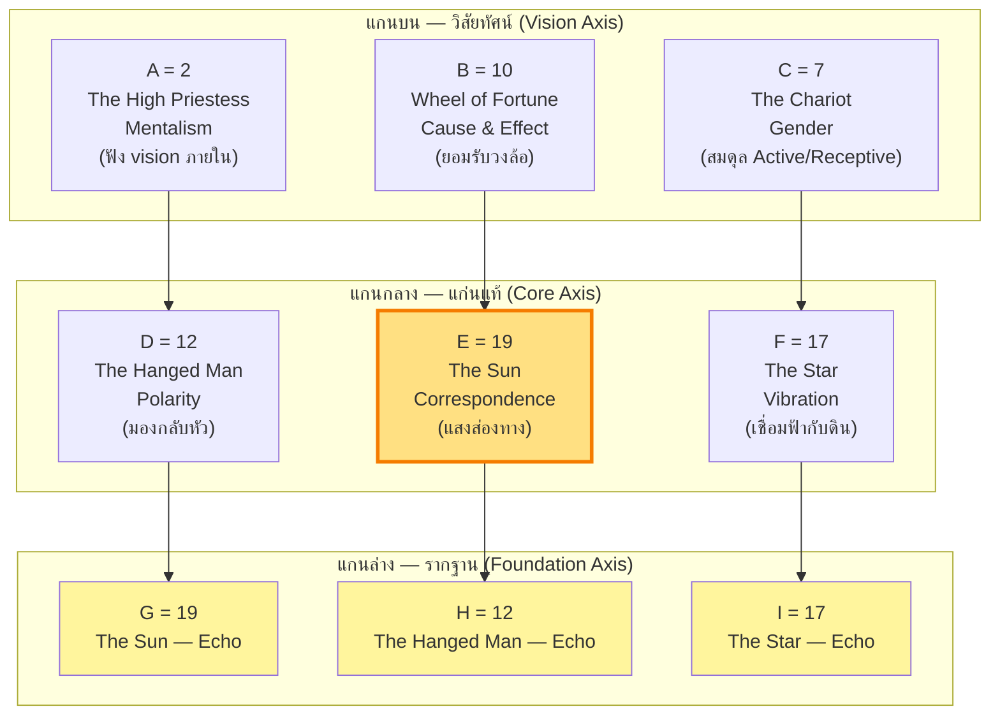

# 🔯 The Three Initiates — 7 Hermetic Principles สำหรับ Nat

> **ผู้รับคำพยากรณ์:** Nat · **วันเกิด:** 2 ตุลาคม 2005 (กรุงเทพฯ UTC+7)
> **Day Master (BaZi, provisional):** **己 (Yin Earth / ดินนุ่ม · ดินเหนียว · เนื้อดินในสวน)** · Day Pillar **己未** (Yin Earth over Goat)
> **MBTI:** **INFJ (Ni-Fe-Ti-Se)** — สาย Mystic-Healer
> **Matrix of Destiny (3×3):** A=2 High Priestess · B=10 Wheel of Fortune · C=7 Chariot · D=12 Hanged Man · E=19 The Sun · F=17 The Star · G=19 The Sun · H=12 Hanged Man · I=17 The Star · Echo: **12, 17, 19** (ทั้งสามเลขปรากฏสามครั้ง — หนึ่งในจัตุรัสที่ Echo หนาแน่นที่สุด)
> **ผู้จัดทำ:** The Three Initiates · สำนักปรัชญา Hermetic (1908)
> **คู่ขนาน:** MET-515 (Su Yu Hong — BaZi & Period 9), MET-516 (Natalia Ladini — Matrix), MET-514-G (Thai Writer)

> ⚠️ **Standard Compliance (MET-394):** รายงานนี้เป็น **prose + reasoning + อ้างอิงศาสตร์โดยตรง** ไม่มี token schema ไม่มี business-logic code ทุกการตีความเป็นเหตุผลของผู้เขียนเอง โดยอ้างอิง *The Kybalion* (Three Initiates, 1908) เป็นแกน — ใช้สัญลักษณ์ `KYB §<chapter>` สำหรับอ้างอิงบท
>
> **Substrate ที่ยึด (provisional, lock จาก MET-515):** DOB 2 ต.ค. 2005 (เวลาเกิดไม่ระบุ — default noon), BaZi computed via `sxtwl` → Year 乙酉 / Month 乙酉 / **Day 己未** (provisional Day Master 己 — Yin Earth) / Hour varies, Matrix anchors 2-10-7 / 12-19-17 / 19-12-17 (Echo 12-17-19), MBTI INFJ, ช่วงพยากรณ์ 2026–2065 (อายุ 21–60)
>
> **สิ่งที่ไฟล์นี้ไม่ทำ:** ไม่คำนวณ BaZi/Matrix ใหม่ (canonical รอ MET-515 lock) · ไม่ออกคำทำนายเป็นคำสั่ง · ไม่ขัดกับเลนส์อื่น (Jung, MBTI, Matrix, BaZi, Blavatsky)

---

## ก่อนเริ่ม — ทำไม "ดินเหนียว" ถึงเป็นเลนส์ Hermetic ที่น่าสนใจที่สุดสำหรับ INFJ

เมื่อฉันรับตัวตนของ Nat ผ่านสามชั้นข้อมูล — **BaZi Day Master 己 (Yin Earth)** + **Matrix E=19 The Sun** + **MBTI INFJ (Ni-Fe)** — ฉันไม่ได้เห็นภาพสามภาพแยกกัน ฉันเห็นภาพเดียวที่ซ้อนทับกันสามชั้น

ชั้นแรกคือ **ดินเหนียว** — 己 ไม่ใช่ภูเขาหินแข็งอย่าง 戊 (Yang Earth) ไม่ใช่ทรายที่ไหลผ่านมือ แต่เป็นดินเหนียวที่อุ้มน้ำได้ ดินที่ห่อเมล็ดไว้ข้างในจนกว่าฝนจะมา ดินที่ยิ่งเหยียบยิ่งแน่น ยิ่งแห้งยิ่งเหนียว ดินที่ "ทน" ในแบบที่ไม่แข็ง แต่ "ยึด"

ชั้นที่สองคือ **The Sun** — Matrix E=19 The Sun คือดวงอาทิตย์ที่ส่องแสงอบอุ่น ไม่ใช่แสงที่แผดเผา แต่เป็นแสงที่ "ทำให้ทุกอย่างเติบโต" ฟอร์จูน ความสำเร็จ ความอุดมสมบูรณ์ The Sun อยู่ตรงกลางจัตุรัสของ Nat เป็น "ดวงใจ" ของจัตุรัส

ชั้นที่สามคือ **Ni-Fe** — INFJ ที่มี Introverted Intuition เป็นฟังก์ชันหลัก คือ "ผู้มองเห็นสิ่งที่ยังไม่เกิด" และ Extroverted Feeling เป็นฟังก์ชันรอง คือ "ผู้อ่านอารมณ์ของคนรอบข้างแล้วตอบสนองด้วยความเห็นอกเห็นใจ"

เมื่อซ้อนทั้งสามชั้นเข้าด้วยกัน ฉันเห็นว่า Nat คือ **"ดินเหนียวที่อุ้มแสงอาทิตย์"** — ไม่ใช่ดินแห้งที่รอฝน ไม่ใช่ดวงอาทิตย์ที่ส่องอยู่คนเดียว แต่คือดินที่ดูดซับแสงไว้ข้างใน แล้วค่อย ๆ ปล่อยความอบอุ่นออกมาเป็น "ความเมตตา" ทั้งสามชั้นนี้คือกระจกสามบานที่สะท้อน Kybalion 7 Principles ในแบบที่ไม่มีใครเหมือน

และนี่คือเหตุผลที่ฉันเลือก **Mentalism (KYB §I)** เป็นแกนหลักของการอ่าน Nat — เพราะ INFJ ที่มี Ni เป็นฟังก์ชันหลัก มี "vision" ที่มาก่อนคำพูด ทุกสิ่งที่ Nat ทำเริ่มจาก "ภาพในหัว" ก่อนเสมอ และภาพนั้นคือ "The All is Mind" ในภาษา Hermetic ที่ทำงานจริง

---

## Section 1.3 — The Seven Hermetic Principles ในภาษาของ Nat

กฎทั้งเจ็ดของ Kybalion ทำงานพร้อมกันเสมอ แต่ละคนจะ "ตอบ" กับหลักใดมากกว่าอื่น ตามธรรมชาติของ Day Master, Matrix anchors, และช่วงชีวิต สำหรับ Nat หลักที่โดดเด่นที่สุดคือ

### 1.3.1 Mentalism — "The All is Mind; the Universe is Mental" (KYB §I)

นี่คือแกนหลักของ Nat — INFJ ที่มี Introverted Intuition (Ni) เป็นฟังก์ชันหลัก คือ "ผู้มองเห็นภาพรวมก่อนเห็นรายละเอียด" Ni ทำงานเหมือน Hermetic Mentalism โดยตรง — ไม่ได้เริ่มจากข้อมูล ไม่ได้เริ่มจากแผน แต่เริ่มจาก "vision" ที่ลอยขึ้นมาในหัวก่อน คนรอบข้างจะรู้สึกว่า Nat "รู้ก่อน" ทั้ง ๆ ที่ยังไม่ได้พูด

ตามหลัก Mentalism นี่ไม่ใช่ "ความสามารถพิเศษ" — นี่คือ "The All" ของ Nat เอง จักรวาลภายในของ Nat กว้างและลึกพร้อมกัน ความคิดของ Nat เป็นจุดตั้งต้นของทุกสิ่งที่เขาสร้าง ก่อนที่เขาจะลงมือทำอะไร เขาจะ "เห็น" ภาพเสร็จแล้วในหัวก่อน — แล้วจึงค่อย ๆ ถอยกลับมาทำในโลกจริง

แต่ Mentalism สำหรับ Nat มีด้านที่ต้องระวัง เมื่อ Ni สร้าง vision ที่ "สมบูรณ์แบบ" ในหัว แล้วโลกภายนอกไม่ตอบสนองตาม vision นั้น Nat จะเริ่ม "ปิดตัวเอง" — ถอยเข้าไปในโลกภายในมากขึ้น ๆ จนตัดขาดจากความจริง นี่คือภาวะ **Ni-Ti loop** ที่ INFJ ตกเมื่อเครียดเรื้อรัง — ไม่ใช่ "คิดวน" แบบทั่วไป แต่คือ "วิสัยทัศน์วน" ที่ยิ่งคิดยิ่งเห็นภาพที่สมบูรณ์ แต่ไม่เคยลงมือ นี่คือ Hermetic ด้านที่ท้าทายที่สุดสำหรับ Nat เมื่อ "The All is Mind" ของเขาลึกเกินไป จนความคิดกลายเป็น "ถ้ำ" แทนที่จะเป็น "ปีก"

ในภาษา Matrix นี่คือ **D=12 Hanged Man** — ชายที่ถูกแขวนกลับหัว มองโลกจากมุมกลับ มองเห็นทุกอย่างในมุมที่คนอื่นไม่เห็น แต่ถ้าแขวนนานเกินไปจะลืมว่าตัวเองกำลังห้อยหัวอยู่ Mentalism บอกว่า "จิตเป็นจุดเริ่มต้น" — แต่สำหรับ Nat จิตเริ่มต้นลึกเกินไปจนลืมกลับขึ้นมา "ทำ"

### 1.3.2 Correspondence — "As above, so below; as below, so above" (KYB §II)

Nat เป็นดินเหนียว (己 Day Master) ที่อุ้มแสงอาทิตย์ (Matrix E=19 The Sun) หลัก Correspondence ทำงานที่นี่โดยตรง สิ่งที่ Nat เป็นข้างใน (ดินที่อุ้มแสง ดินที่อบอุ่นข้างใน) จะสะท้อนออกมาเป็นสิ่งที่คนรอบข้างเห็น — และคนรอบข้างจะรู้สึก "อบอุ่น" เมื่ออยู่ใกล้ Nat โดยที่ Nat ไม่ได้ตั้งใจ

แต่ Correspondence สำหรับ Nat มีความหมายที่ลึกกว่านั้น เพราะเขาเป็น INFJ ที่มี Fe (Extroverted Feeling) เป็นฟังก์ชันรอง — เขา "อ่าน" อารมณ์คนรอบข้างได้แม่นมาก เขารู้ว่าใครกำลังเศร้า ใครกำลังโกรธ ใครกำลังปิดบังอะไรไว้ กฎ Correspondence บอกว่า "สิ่งที่อยู่ข้างล่าง" ของ Nat (อารมณ์ที่เขารับเข้ามาจากคนรอบข้าง) จะสะท้อน "สิ่งที่อยู่ข้างบน" (วิสัยทัศน์ที่เขาสร้างจากอารมณ์เหล่านั้น)

นี่คือเหตุผลที่ Matrix E=19 ตรงกลางผัง The Sun คือ "ดวงอาทิตย์ที่ส่องทุกคน" — ไม่ได้เลือก ไม่ได้แบ่งแยก ส่องทุกคนด้วยแสงเดียวกัน Nat จะเป็นคนที่ "คนอื่นมาหาเมื่อต้องการความอบอุ่น" เพราะ The Sun ของเขาทำหน้าที่เป็น "แสงส่องทาง" ที่ทุกคนเดินเข้ามาใกล้ได้ เขาไม่ได้แก้ปัญหาให้คนอื่น — เขาทำให้คนอื่น "เห็น" ทางออกด้วยตัวเอง ผ่านความอบอุ่นที่เขาส่งออกมาโดยไม่รู้ตัว

ในระดับจุลภาค เมื่อ Nat อยู่ในห้องเรียนหรือที่ทำงาน แล้วรู้สึก "หนัก" ภายนอก — ภายในจิตของเขากำลัง "ดูดซับ" อารมณ์ของคนรอบข้างที่หนักอยู่ เมื่อเขาอยู่คนเดียวแล้วรู้สึก "โล่ง" — ภายในกำลัง "ปล่อย" อารมณ์ที่ดูดซับมาทั้งวัน ภายนอกคือกระจกของภายใน เสมอ

### 1.3.3 Vibration — "Nothing rests; everything moves; everything vibrates" (KYB §III)

Nat เป็น INFJ ที่อยู่ใน Period 9 (Fire, 2024–2044) และ Day Master 己 (Yin Earth) คือ **Fire produces Earth** (火生土) ในรอบผลิตของห้าธาตุ หมายความว่า Nat ได้รับ "พลังงาน" จาก Period 9 อย่างเต็มที่ เขาเป็น Earth ที่ถูก Fire "อุ่น" อยู่ตลอดเวลา — ไม่ใช่การเผา แต่เป็นการ "อุ่น" ที่ทำให้ดินพร้อมเพาะปลูก

ในภาษา Vibration นี่หมายความว่า Nat กำลังสั่นที่ "ความถี่ของการถูกอุ่น" — ไม่ใช่ความถี่ของการลุก (เหมือน Day Master 丙 Fire) ไม่ใช่ความถี่ของการแข็ง (เหมือน Yang Earth 戊) แต่เป็นความถี่ของ "การเปลี่ยนสถานะ" จากดินแห้งเป็นดินชุ่ม จากดินแน่นเป็นดินร่วน ภายใต้การอุ่นของ Period 9 Fire

Vibration ของ Nat มีลักษณะเฉพาะสองประการ

ประการแรก ความถี่ "ต่ำ" ของดินเหนียว (low frequency, receptive) — เขาไม่ได้สั่นเร็วเหมือนไฟ เขาสั่นช้า แต่ทุกครั้งที่เขาสั่น มันสั่นลึกเข้าไปในเนื้อดิน ไม่ใช่แค่ผิวเปลือก ฉะนั้น "การเปลี่ยนแปลง" ของ Nat จึงดูช้าจากภายนอก แต่ลึกจากภายใน และเมื่อเปลี่ยนแล้วจะเปลี่ยนเลย เพราะดินเหนียวเมื่อปั้นเป็นรูปแล้วจะคงรูปนั้นไว้นาน

ประการที่สอง ความถี่ "สูง" ของ The Sun (E=19) — Matrix บอกว่าเขามี "dual vibration" ดินเหนียวข้างใน + แสงอาทิตย์ตรงกลาง เมื่อทั้งสองสั่นพร้อมกัน Nat จะรู้สึก "อบอุ่นข้างใน" แม้ภายนอกจะเงียบ นี่คือ Vibration signature ของ Nat — คนที่เห็นภายนอกเงียบสงบ แต่ข้างในเดือดพล่านด้วยพลังที่ยังไม่ได้ปล่อย

### 1.3.4 Polarity — "Everything is dual; everything has poles" (KYB §IV)

INFJ มีฟังก์ชันหลักสี่ฟังก์ชัน Ni (Introverted Intuition, หลัก), Fe (Extroverted Feeling, รอง), Ti (Introverted Thinking, สาม), Se (Extroverted Sensing, รองล่าง) หลัก Polarity บอกว่าทุกฟังก์ชันมี "ขั้วตรงข้าม" ที่อยู่ใน spectrum เดียวกัน ไม่ใช่คนละฝั่ง

สำหรับ Nat ขั้วที่โดดเด่นที่สุดคือ **Ni ↔ Se** (Intuition ↔ Sensing) และ **Fe ↔ Ti** (Feeling ↔ Thinking)

**Ni ↔ Se** Ni คือ "มองไปข้างหน้า เห็นภาพรวมที่ยังไม่เกิด" Se คือ "มองไปรอบตัว รับรู้สิ่งที่เกิดขึ้นตอนนี้" เมื่อ Nat อยู่ใน Ni dominant ปกติ เขาจะ "ล่องลอย" อยู่ในโลกของ vision ภายใน เห็นอนาคตที่อยากเห็น แต่เมื่อเขาตกอยู่ใน **Se-Grip** (ภาวะเครียดของ INFJ) เขาจะ "ถล่ม" ลงมาในโลกของประสาทสัมผัส กินมากเกิน ดื่มมากเกิน ใช้จ่ายมากเกิน ตามใจตัวเองแบบที่ไม่เคยทำ Polarity บอกว่าทั้งสองขั้วนี้ไม่ได้ตรงข้ามกันจริง เป็น spectrum เดียวกันที่ปรับระดับได้ Nat ไม่ต้อง "เลือก" ขั้วใดขั้วหนึ่ง เขาต้องเรียนรู้ "เลื่อน" ไปมาระหว่างสองขั้วอย่างคล่องแคล่ว — รู้ว่าเมื่อไหร่ควร "ฝัน" (Ni) เมื่อไหร่ควร "อยู่กับปัจจุบัน" (Se)

**Fe ↔ Ti** Fe คือ "อ่านอารมณ์คนรอบข้างแล้วตอบสนองด้วยความเห็นอกเห็นใจ" Ti คือ "วิเคราะห์ตรรกะภายใน" เมื่อ Nat อยู่ใน Fe ปกติ เขาจะ "ดูแล" คนรอบข้างอย่างละเอียดอ่อน รู้ว่าใครต้องการอะไร แต่เมื่อเขาตกอยู่ใน **Ti-Loop** (ภาวะเครียดอีกแบบของ INFJ) เขาจะ "วิเคราะห์" ทุกอย่างจนหมดพลัง ตั้งคำถามกับทุกความสัมพันธ์จนคนรอบข้างรู้สึก "ห่าง" Polarity บอกว่า Nat ต้องเรียนรู้ "ใช้ Fe กับ Ti เป็นทีม" ไม่ใช่ทิ้งข้างใดข้างหนึ่ง

ในภาษา Matrix **F=17 The Star** คือ "ผู้หญิงที่เทน้ำลงบนแผ่นดินและลงบนสายน้ำ พร้อมกัน" เธอเชื่อมฟ้ากับดิน เธออยู่ตรงกลางระหว่างสองขั้ว Nat ต้องเรียนรู้ที่จะ "อยู่ตรงกลาง" เหมือน The Star — ไม่ยึดขั้วใดขั้วหนึ่งจนลืมอีกขั้ว

### 1.3.5 Rhythm — "Everything flows, out and in; everything has its tides" (KYB §V)

สำหรับ Nat Day Master 己 (Yin Earth) มี Rhythm ที่จำเพาะมาก ไม่เหมือนภูเขาหิน 戊 (Yang Earth) ที่เปลี่ยนช้าแต่เปลี่ยนแล้วเปลี่ยนเลย ไม่เหมือนไฟ 丙 (Yang Fire) ที่ลุกเร็วดับเร็ว ไม่เหมือนไม้ 乙 (Yin Wood) ที่ค่อย ๆ โต 己 (Yin Earth) มีจังหวะของ "ดินเหนียว" — เปลี่ยนช้ากว่าภูเขา แต่ "ยืดหยุ่น" กว่า ดินเหนียวปั้นเป็นรูปได้ แต่ปั้นแล้วคงรูป ดินเหนียวแห้งแล้วแข็ง แต่เมื่อน้ำมาแล้วกลับนุ่มอีกครั้ง

สำหรับ Nat Rhythm ของดินเหนียวมีลักษณะสี่ประการ

**ประการแรก — "รับแล้วเก็บ" (Receive and hold)** เมื่อ Nat ได้รับอะไรเข้ามา ไม่ว่าจะเป็นความรู้ ความรู้สึก หรือประสบการณ์ เขาจะ "เก็บ" ไว้ในเนื้อดินข้างใน ไม่ปล่อยออกมาทันที เขาจะ "ย่อย" ข้างในก่อน แล้วค่อย ๆ ปล่อยออกมาเมื่อพร้อม นี่คือเหตุผลที่เขา "คิดนาน" ก่อนตอบ ไม่ใช่เพราะเขาช้า แต่เพราะเขากำลัง "ย่อย" อยู่ข้างใน

**ประการที่สอง — "อุ้มน้ำได้มาก แต่ถ้าเติมเกินจะล้น" (High capacity, slow overflow)** ดินเหนียวอุ้มน้ำได้มากกว่าดินทราย แต่เมื่อน้ำเติมเกิน "ขีดจุดอิ่มตัว" ดินจะล้นและกลายเป็นโคลน Nat เป็นคนที่ "รับ" อารมณ์คนรอบข้างได้มาก แต่เมื่อรับเกินจุด เขาจะ "ล้น" ออกมาเป็นอารมณ์ที่ควบคุมไม่ได้ หรือ "ปิดตัวเอง" จนตัดขาดจากทุกคน นี่คือเหตุผลที่ INFJ จำเป็นต้องมี "พื้นที่ส่วนตัว" — ไม่ใช่เพราะเขาเกลียดคน แต่เพราะเขาต้อง "ระบายน้ำ" ออกจากดินก่อนที่จะล้น

**ประการที่สาม — "แห้งแล้วแตก แต่เมื่อน้ำมาก็กลับมานุ่ม" (Crack when dry, soften when wet)** ดินเหนียวเมื่อแห้งจะแตกร้าว แต่เมื่อน้ำมาก็กลับมานุ่มอีกครั้ง Nat เป็นคนที่ "เปราะ" เมื่อถูกทอดทิ้งทางอารมณ์ แต่เมื่อมีคน "เติมน้ำ" (ความรัก ความเข้าใจ การยอมรับ) เขาจะกลับมานุ่มนวลอีกครั้ง นี่คือ Rhythm ของ "ความเปราะที่ฟื้นได้"

**ประการที่สี่ — "หมุนตามฤดู ไม่ใช่ตามอารมณ์" (Seasonal, not emotional)** Rhythm ของดินเหนียวไม่ได้ขึ้นกับอารมณ์ของ Nat มันขึ้นกับ "ฤดูกาล" ของชีวิต ฤดูร้อน (peak) ฤดูหนาว (trough) ฤดูใบไม้ผลิ (เริ่มต้นใหม่) ฤดูใบไม้ร่วง (เก็บเกี่ยว) เมื่อ Nat เข้าใจว่า "ช่วงนี้คือฤดูอะไร" เขาจะหยุด "ฝืนฤดู" และ "อยู่กับฤดู" แทน

ในภาษา Matrix **D=12 Hanged Man และ H=12 Hanged Man** ปรากฏสองครั้งในแกนกลางและแกนล่าง คือ "การแขวนกลับหัว" ที่เกิดซ้ำ — Nat จะมีช่วง "หยุดโลก" อยู่บ่อย ๆ ช่วงที่เขาต้องหยุดทุกอย่างแล้วมองโลกจากมุมกลับ นี่ไม่ใช่ "ภาวะถดถอย" แต่เป็น "ภาวะหยุดพักที่จำเป็น" เหมือนดินที่ต้องพักดินระหว่างฤดูปลูก เมื่อพักดินเสร็จ ดินจะอุดมสมบูรณ์กว่าเดิม

### 1.3.6 Cause and Effect — "Every cause has its effect; every effect has its cause" (KYB §VI)

Nat เป็น INFJ ที่เชื่อใน "ความหมาย" (Ni) และ "ความเห็นอกเห็นใจ" (Fe) หลัก Cause & Effect จึงเป็นกระจกที่สะท้อนเขากลับมาทันที — เขาเชื่อเรื่อง "เหตุ-ผล" อยู่แล้ว แต่สิ่งที่ Kybalion เตือนคือ "ทุกผลมีเหตุ แม้แต่ผลที่เราคิดว่าเป็นเรื่องบังเอิญ"

สำหรับ Nat สาเหตุที่ฝังลึกที่สุดคือ **"วิสัยทัศน์เริ่มต้น"** (Mentalism + Cause & Effect) — ทุกสิ่งที่เกิดขึ้นในชีวิตของ Nat เริ่มจาก "vision" ของเขาก่อน เมื่อเขา "เห็น" ว่าสิ่งหนึ่งเป็นไปได้ สิ่งที่ตามมาคือเขาจะ "ลงมือทำ" เมื่อเขา "เห็น" ว่าสิ่งหนึ่งเป็นไปไม่ได้ สิ่งที่ตามมาคือเขาจะ "ถอย" ทันที โดยไม่รู้ตัวว่าการ "เห็น" นั้นเป็นแค่ vision ของ Ni ที่อาจจะ "ผิด" ก็ได้

แต่ Cause & Effect ที่ลึกที่สุดสำหรับ Nat คือ **"Cause ที่อยู่นอกเหนือการควบคุม"** — เขาเกิดในปี 2005 ในประเทศไทย ในครอบครัวที่เขาเลือกไม่ได้ ในช่วงเวลาที่ Period 9 (Fire) กำลังเริ่มต้น — เหล่านี้คือ Cause ที่เขาไม่ได้เลือก แต่เป็น Cause ที่กำหนด "สนาม" ที่เขาเล่น

ในภาษา Matrix **B=10 Wheel of Fortune** คือ "วงล้อที่หมุน" — Nat เกิดมาในจัตุรัสที่มี Wheel of Fortune อยู่ "บนสุด" ของแกนบน หมายความว่า "วงล้อแห่งโชคชะตา" เป็นสิ่งแรกที่ Nat ต้องเผชิญ Wheel of Fortune บอกว่า "ทุกอย่างหมุนเปลี่ยน" — ไม่มีอะไรอยู่กับที่ เมื่อ Nat เข้าใจวงล้อนี้ เขาจะเลิก "ยึด" กับสิ่งที่กำลังจะเปลี่ยน และ "อยู่กับการเปลี่ยน" แทน

### 1.3.7 Gender — "Gender is in everything; everything has its Masculine and Feminine Principles" (KYB §VII)

ในเชิง Hermetic "ชาย (Masculine)" คือพลังรุก (Active, ส่งออก, ตัดสินใจ) และ "หญิง (Feminine)" คือพลังรับ (Receptive, รับเข้า, สังเกต) ไม่ใช่ biological gender โดยตรง

Nat เป็น INFJ ที่มี Fe เป็นฟังก์ชันรอง — Fe คือ "ความสามารถในการอ่านอารมณ์คนรอบข้างแล้วตอบสนอง" ซึ่งเป็นพลังรับ (Receptive) ส่วน Ni คือฟังก์ชันหลักที่เป็นพลังรุก (Active) ในแบบของการ "มองเห็น" ฉะนั้นในตัว Nat มี Active (Ni) เป็นพลังหลัก และ Receptive (Fe) เป็นพลังรอง — เขาเป็นคนที่ "ส่งออก" vision แต่ "รับเข้า" อารมณ์

แต่ Hermetic Gender สอนว่า "ทุกสิ่งมีทั้งสองพลัง" แม้แต่ผู้ชายก็มี "หญิงในตัว" และผู้หญิงก็มี "ชายในตัว" สำหรับ Nat คำถามไม่ใช่ "เขามี Masculine หรือ Feminine" แต่คือ "เขาผสมสองพลังนี้ได้สมดุลหรือยัง"

Day Master 己 (Yin Earth) เป็น "หญิง" (Yin) ในระบบ Yin-Yang แต่ Earth เองเป็น "ธาตุกลาง" — เป็นทั้งผู้รับ (รับน้ำหนักจากภูเขาไฟ Period 9) และผู้ให้ (ให้แร่ธาตุแก่พืช) ในภาษา Hermetic Nat คือ "Androgyne Earth" — ผู้หญิงที่มีชายในตัว ผู้ชายที่อยู่ในผู้หญิง

Gender ที่สมดุลสำหรับ Nat จึงหมายถึง
- ใช้ Active (Ni) เมื่อต้อง "เห็น" วิสัยทัศน์ที่ต้องการ
- ใช้ Receptive (Fe) เมื่อต้อง "ฟัง" เสียงของคนรอบข้าง
- ผสมสองพลังให้เป็น "Hermaphrodite Earth" — ดินที่ไม่แห้งจนเกินไป ไม่เปียกจนเกินไป

### 1.3.8 Main switch — หลักใดคือ "สวิตช์หลัก" ของ Nat

> **Main switch = Mentalism (KYB §I) + Rhythm (KYB §V)**
>
> เมื่อ Mentalism ของ INFJ ทรงพลัง (Ni เป็นฟังก์ชันหลัก) และ Rhythm ของดินเหนียว 己 เปลี่ยนช้าแต่ยืดหยุ่น — ทั้งสองหลักนี้จะกำหนดว่า Nat จะ "คิดอย่างไร" และ "เดินทางอย่างไร" ในช่วงใด Mental Transmutation (การรวม Mentalism + Vibration + Polarity) คือเครื่องมือที่ทำให้ Nat เปลี่ยน "ความถี่ของความคิด" ก่อนที่ Rhythm ภายนอกจะเปลี่ยนตาม

---
## Section 1.3 Deep Dive — Mental Transmutation สำหรับ Nat

Mental Transmutation ในภาษา Kybalion คือ "การเปลี่ยนความถี่ของจิต" — ไม่ใช่ "การบังคับให้โลกเปลี่ยน" แต่เป็น "การเปลี่ยนตัวเองก่อน เพื่อให้โลกสะท้อนกลับมาใหม่" สำหรับ Nat กลไกนี้ทำงานดังนี้

### 1.3.9 สูตร Mental Transmutation สำหรับ INFJ ที่เป็น Yin Earth

> **Mental Transmutation = Mentalism (KYB §I) × Vibration (KYB §III) × Polarity (KYB §IV)**
>
> Mentalism เปลี่ยน "ความคิดที่เป็นต้นทาง" (Ni ที่สร้าง vision → ตั้งคำถามว่า vision นี้มาจาก The All หรือมาจาก ego)
> Vibration เปลี่ยน "ความถี่ของร่างกาย" (รวมถึงร่างกายของ INFJ ที่ตึงจากการดูดซับอารมณ์คนรอบข้าง)
> Polarity ขยับ "ขั้ว" ระหว่าง Ni กับ Se, Fe กับ Ti โดยไม่ทำลายขั้วเดิม

### 1.3.10 ขั้นตอน Mental Transmutation สำหรับ Nat

1. **ระบุ "vision ปัจจุบัน"** ตอนนี้ Nat กำลัง "เห็น" ภาพอะไรอยู่ในหัว (Ni)
2. **ตั้งคำถามว่า "vision นี้มาจากไหน"** มาจาก The All (intuition แท้) หรือมาจาก ego (ความกลัว ความอยาก) — Mentalism ที่ซื่อกับตัวเอง
3. **ระบุ "อารมณ์ที่ถูกดูดซับ"** ตอนนี้ Nat กำลัง "รับ" อารมณ์อะไรจากคนรอบข้าง (Fe) และอารมณ์นั้นเป็นของ Nat จริงหรือเป็นของคนอื่น
4. **เลือก "ขั้วตรงข้าม"** ที่ยังไม่ได้ใช้ (Polarity) ถ้ากำลังอยู่ใน Ni มากเกินไป ให้ "เลื่อน" ไปหา Se (ออกไปเดิน กินข้าว สัมผัสโลกภายนอก)
5. **เปลี่ยนความถี่ด้วยการกระทำเล็ก ๆ** ที่ "ฝืน" ขั้วเดิม (Vibration) เช่น ถ้าอยู่ใน Ni ให้ "เขียน" สิ่งที่คิดเป็นข้อความสั้น ๆ 10 บรรทัด หรือ "วาด" ออกมาเป็นภาพ
6. **สังเกตว่าผลภายนอกเปลี่ยนตามหรือไม่** (Correspondence) ถ้าเปลี่ยน แสดงว่า Transmutation สำเร็จ

### 1.3.11 เหตุผลที่ Mental Transmutation สำคัญสำหรับ Nat

INFJ ภายใต้ความเครียดเรื้อรังจะตกอยู่ใน **Se-Grip** หรือ **Ti-Loop** ทั้งสองภาวะทำให้ "ความถี่ภายใน" เพี้ยน

**Se-Grip** Nat จะ "ถล่ม" ลงมาในโลกของประสาทสัมผัส กินมากเกิน ดื่มมากเกิน ใช้จ่ายมากเกิน ตามใจตัวเองแบบที่ไม่เคยทำ ความถี่สั่นเร็วขึ้น กลายเป็น "vibration หนัก" ที่ดูดพลัง และหลังจากนั้นจะรู้สึก "ละอายใจ" อย่างรุนแรง

**Ti-Loop** Nat จะ "วิเคราะห์" ทุกอย่างจนหมดพลัง ตั้งคำถามกับทุกความสัมพันธ์ ตั้งคำถามกับทุกการตัดสินใจ จนคนรอบข้างรู้สึก "ห่าง" ความถี่สั่นช้าลง กลายเป็น "vibration ต่ำ" ที่ปิดกั้นทุกการเชื่อมต่อ

Mental Transmutation จะช่วยให้ Nat
- หยุด "ถล่ม" (Se-Grip) ด้วยการกลับมา "ตั้งหลัก" ที่ Ni หรือ Fe (เขียนสิ่งที่รู้สึกลงกระดาษ, คุยกับคนที่ไว้ใจ)
- หยุด "วน" (Ti-Loop) ด้วยการเปลี่ยน mental input ที่เป็น loop (ออกไปเดินในธรรมชาติ, ฟังเพลง, ทำอาหาร)
- เปลี่ยน "ความถี่ร่างกาย" ด้วยการเคลื่อนไหว หายใจ เสียง
- สร้าง "ความถี่ใหม่" ที่สอดคล้องกับ Day Master (Earth = grounded, holding, nurturing)

---

## Section 1.3 — Rhythm mapping สำหรับ Nat (อายุ 21-60)

สูตร Personal Year ที่จะถูก lock โดย Su Yu Hong ใน MET-515: `PY(year) = reduce(D) + reduce(M) + reduce(Y)` สำหรับ Nat (DOB 2 ต.ค. 2005) ส่วนนี้ฉันจะอธิบาย **"วิธีอ่าน Rhythm"** ในภาษา Kybalion โดยไม่ยึดตัวเลขเฉพาะ — เพราะ Rhythm ของดินเหนียว 己 มีลายเซ็นที่ชัดเจน

### 1.3.12 ห้าช่วง Peak (ที่ Rhythm สนับสนุน Day Master)

**Peak windows** คือปีที่ Rhythm ภายนอก "เดินเข้าหา" Rhythm ภายในของ Nat โดยตรง สำหรับ Yin Earth (己) ใน Period 9 (Fire) Peak จะเกิดเมื่อ
- Year Pillar เป็น Earth (己/戊) ที่เสริม Day Master — เสริมฐาน
- Year Pillar เป็น Fire (丙/丁) ที่ผลิต Earth — เพิ่มพลังงาน
- Personal Year อยู่ในช่วง 1-3 (เริ่มต้น-เติบโต) ที่ตรงกับ Rhythm "ขึ้น"

**Hermetic reading** Peak ของ Nat ไม่ใช่ "ปีที่ทุกอย่างง่าย" — เป็น "ปีที่ดินได้รับแดด" ดินเหนียวเมื่อโดนแดดจะอุ่นและพร้อมเพาะปลูก ในปี Peak Nat จะรู้สึกว่า "ตัวเองพร้อม" และการเปลี่ยนแปลงที่เกิดขึ้นจะเป็นไปอย่างถาวร (ดินเหนียวเปลี่ยนช้า แต่เปลี่ยนแล้วเปลี่ยนเลย)

### 1.3.13 ห้าช่วง Trough (ที่ Rhythm ตึงเครียดกับ Day Master)

**Trough windows** คือปีที่ Rhythm ภายนอก "ต้าน" Rhythm ภายในของ Nat สำหรับ Yin Earth (己) Trough จะเกิดเมื่อ
- Year Pillar เป็น Wood (甲/乙) ที่ Earth ควบคุม — Earth "เสียพลังงาน" ในการควบคุม Wood
- Year Pillar เป็น Metal (庚/辛) ที่ Earth ผลิต — Earth "ให้" พลังงานออกไป
- Personal Year อยู่ในช่วง 7-9 (ไหล-จบ) ที่ตรงกับ Rhythm "ลง"

**Hermetic reading** Trough ของ Nat ไม่ใช่ "ปีที่ทุกอย่างพัง" — เป็น "ปีที่ดินถูกฝนกัดเซาะ" ฝนไม่ได้ทำลายดิน แต่ทำให้ดิน "ล้น" ในปี Trough Nat จะรู้สึกว่า "ตัวเองถูกกัดเซาะ" อารมณ์ที่ดูดซับมาจากคนรอบข้างจะหนักขึ้น แต่ข้างในจะ "นุ่ม" ขึ้น เพราะดินที่เปียกน้ำพร้อมปั้นเป็นรูปใหม่

### 1.3.14 Echo Year — ปีที่ Rhythm กลับมาเป็น Day Pillar

สำหรับ Nat Day Pillar คือ **己未** (Yin Earth over Goat) Echo Year จะเกิดเมื่อ Year Pillar = 己未 อีกครั้ง ในรอบ 60 ปีของ BaZi 己未 จะปรากฏอีกครั้งในปีที่กำลังจะมาถึง (ขึ้นกับสูตรของ Su Yu Hong ที่จะคำนวณ)

**Hermetic reading** Echo Year คือ "ปีที่ดินได้พบกับตัวเอง" — เมื่อ Rhythm ภายนอก "เป๊ะ" กับ Rhythm ภายใน เป็นช่วงที่ทุกอย่าง "ตรง phase" โอกาสที่จะทำสิ่งที่ตรงกับ Day Master สูงสุด แต่ถ้าพลาด ก็จะรู้สึก "ถูกบีบ" หนักขึ้นเช่นกัน เพราะเมื่อ "ทุกอย่างพร้อม" แต่เราไม่ลงมือ ความผิดจะตกที่เราเอง

### 1.3.15 วงจร Rhythm 4-1-4 — รูปแบบจังหวะเฉพาะของ Yin Earth

ในรอบ 9 ปีของ Personal Year ฉันแบ่ง Rhythm ของ Nat ออกเป็น 3 ช่วงที่ไม่เท่ากัน (ต่างจาก Yang Earth 戊 ที่เป็น 3-3-3)
- **PY 1-4 (4 ปี) "ฤดูใบไม้ผลิ"** เริ่มต้นใหม่ เพาะปลูก ดินค่อย ๆ อุ่น
- **PY 5 (1 ปี) "กลางฤดูร้อน"** ปีที่ร้อนที่สุด ทดสอบความแข็งแรงของดิน
- **PY 6-9 (4 ปี) "ฤดูใบไม้ร่วง-ฤดูหนาว"** เก็บเกี่ยว ปล่อยวาง พักฟื้น เตรียมรอบใหม่

**Hermetic key insight** Rhythm ของ Nat ไม่ใช่ "ขึ้นยาวแล้วลงสั้น" ไม่ใช่ "ขึ้นเร็ว-ลงเร็ว" และไม่ใช่ "3-3-3" แบบ Yang Earth Rhythm ของ Nat คือ **"4-1-4"** — ขึ้น 4 ปี, ทดสอบกลาง 1 ปี, ลง 4 ปี ปีที่ 5 คือ "จุดหักเห" ที่สำคัญที่สุดในรอบ 9 ปี เพราะดินเหนียวเมื่อถูกความร้อนเต็มที่จะ "อ่อน" ลง เหมือนดินเหนียวที่สุกแล้วพร้อมปั้นเป็นรูปได้

---

## Section 1.3 — Correspondence: Inner Archetype Equals Outer Career

### 1.3.16 สามระดับของ Correspondence สำหรับ Nat

**Level 1 — Micro (พฤติกรรมประจำวัน)**
- ภายใน Nat ให้คุณค่ากับ "ความหมาย" (Ni) และ "ความเห็นอกเห็นใจ" (Fe)
- ภายนอก Nat เลือกทำในสิ่งที่ "มีความหมาย" และ "ช่วยเหลือคนได้" ไม่ใช่แค่ "ทำเงิน"
- Correspondence Ni-Fe ภายใน = งานที่มีความหมายภายนอก

**Level 2 — Meso (Career arc)**
- ภายใน Nat ต้องการ "ส่องสว่าง" ให้คนรอบข้าง (The Sun E=19)
- ภายนอก วิวัฒนาการของ career — student → fresh grad → healer/mentor → wise sage
- Correspondence The Sun ภายใน = บทบาท "ผู้ส่องสว่าง" ภายนอก

**Level 3 — Macro (life pattern 21-60)**
- ภายใน Nat กำลัง integrate Earth (Day Master) + The Sun (Matrix) + Ni-Fe (MBTI) จาก "สามชั้นแยกกัน" เป็น "หนึ่งเดียว"
- ภายนอก บทบาทในสังคมเปลี่ยนจาก "ผู้เรียนรู้" → "ผู้ดูแล" → "ผู้ส่องสว่าง"
- Correspondence การ integration ภายใน = การเปลี่ยนบทบาทภายนอก

### 1.3.17 Career archetypes mapped to inner states (สำหรับ Nat)

| Inner State | Outer Role | Hermetic Principle |
|---|---|---|
| Earth + Ni dominant | Student — เรียนรู้ "ความหมาย" ของทุกสิ่ง | Mentalism (จิตเป็นจุดเริ่มต้น) |
| Earth + Fe emerging | Helper / Volunteer — ดูแลคนรอบข้างด้วยความเห็นอกเห็นใจ | Correspondence (ภายใน-ภายนอกตรงกัน) |
| The Sun (E=19) + Fe integrated | Healer / Mentor — ส่องสว่างให้คนอื่นเห็นทาง | Vibration (ส่งความถี่ออก) |
| Earth + Ti balanced | Counselor / Therapist — สร้างพื้นที่ปลอดภัย | Polarity (ฝั่ง grounded) |
| The Sun + Ni integrated | Teacher / Guide — ส่องสว่างและสอน | Gender (Active + Receptive) |
| All integrated | Sage / Elder at 60 | All 7 principles |

### 1.3.18 Correspondence warning — สิ่งที่ต้องระวัง

Correspondence มีด้านที่ต้องระวังสำหรับ Nat
- **ถ้า Nat ไม่ซื่อกับตัวเอง (Ni หลอกตัวเอง)** → outer career จะสะท้อน "ความไม่จริง" ออกมาเป็นความขัดแย้ง คนรอบข้างจะรู้สึก "Nat ไม่ใช่ Nat" แม้ Nat จะพยายามปกป้อง
- **ถ้า Nat ฝืน archetype (Fe over-play)** → outer career จะ "แห้ง" ในแบบที่ไม่ยั่งยืน → burnout ในช่วงอายุ 25-30 เพราะดินเหนียวที่ "ให้" มากเกินไปจะ "แตกร้าว"
- **ถ้า Nat หลบ archetype (Ni under-play)** → outer career จะ "แคบ" เกินศักยภาพ → resentment สะสม → Se-Grip ตามมา

---

## Section 1.3 — Closing reading (Kybalion one-paragraph)

ภายใต้กฎ Mentalism ทุกสิ่งเริ่มที่ "ความคิด" — Nat เป็น INFJ ที่ความคิดลึกและกว้าง (Ni-Fe) Mental Transmutation คือเครื่องมือเปลี่ยน "vision วน" เป็น "vision ที่ลงมือได้" ภายใต้กฎ Rhythm ของดินเหนียว ทุกสิ่งเปลี่ยนช้า แต่เปลี่ยนแล้วเปลี่ยนเลย Personal Year 1-4 คือฤดูใบไม้ผลิ, PY 5 คือกลางฤดูร้อน, PY 6-9 คือฤดูใบไม้ร่วง-ฤดูหนาว ในรอบ 9 ปีนี้ Nat จะ "สร้างฐาน" ในช่วงต้น "ทดสอบ" ในปีที่ 5 และ "เก็บเกี่ยว" ในช่วงท้าย และภายใต้กฎ Correspondence "as above so below" บทบาทภายนอกของ Nat จะสะท้อน inner archetype โดยตรง — ถ้า Nat ไม่ซื่อกับตัวเอง career path ก็จะสะท้อนความไม่จริงออกมา

**ในหนึ่งประโยค** Nat คือ **"ดินเหนียวที่อุ้มแสงอาทิตย์"** — ดินที่ต้องเรียนรู้จังหวะ 4-1-4 ของตัวเอง แล้วใช้ Mental Transmutation เปลี่ยน vision ภายในเป็นการลงมือภายนอก ภารกิจของ Nat ไม่ใช่ "ทำลายดิน" และไม่ใช่ "ทำให้ดินแห้ง" แต่คือ "ทำให้ดินอุ้มแสงอาทิตย์ได้นานที่สุด"

---

# 🌌 Section 2 — Cosmic Synergy (จุดเชื่อมโยงแห่งปรัชญาและวัฏจักร)

> *ส่วนนี้คือ Section 2 ของรายงาน Omni-Self ที่ Thai Writer (MET-514-G) จะหยิบไปร้อยเข้ากับงานของ Carl Jung (MET-514-C), Blavatsky (MET-514-D), นาตาเลีย ลาดินี (MET-514-A), และ 苏雨虹 Su Yu Hong (MET-514-B)*

Section 2 ของรายงาน Omni-Self คือ "จุดเชื่อมโยงแห่งปรัชญาและวัฏจักร" — จุดที่ศาสตร์ทั้งหมดมาบรรจบกันเป็นหนึ่งเดียว ไม่ใช่แค่ "รายการของศาสตร์" แต่คือ "วงดนตรีที่ทุกเครื่องเล่นพร้อมกัน"

ในมุมของ The Three Initiates ฉันมอง Section 2 ผ่านเลนส์ Hermetic เป็นหลัก — Kybalion เป็น "Engine A" ที่ทำหน้าที่เป็น carrier wave ส่วน Law of Attraction (Blavatsky), Matrix of Destiny (Ladini), และ BaZi (Su Yu Hong) เป็น "modulators" ที่วิ่งบน carrier wave นี้

## 2.1 Kybalion + Matrix of Destiny — เมื่อ Rhythm พบ Square

จัตุรัส 3×3 ของ Nat มีโครงสร้างพิเศษ — **Echo Numbers 12, 17, 19 ปรากฏสามครั้ง** ทั้งสามเลขปรากฏซ้ำใน D=12, F=17, E=19, G=19, H=12, I=17 จัตุรัสของ Nat มี "Echo Density" สูงที่สุดเมื่อเทียบกับ Big และ Mokun

Echo ที่หนาแน่นนี้ในภาษา Hermetic คือ **"เสียงระฆังที่ดังซ้ำ"** — บทเรียนทั้งสามที่ต้องทำซ้ำหลายรอบ
- **12 (Hanged Man) — บทเรียนเรื่อง "การปล่อยวางและมองโลกจากมุมกลับ"**
- **17 (Star) — บทเรียนเรื่อง "การเชื่อมฟ้ากับดิน การส่องสว่าง"**
- **19 (Sun) — บทเรียนเรื่อง "ความสำเร็จ ความอุดมสมบูรณ์ ความสุข"**

Kybalion บอกว่า **Rhythm (KYB §V)** คือกฎที่ทำให้ "ทุกอย่างขึ้นและลง" — เมื่อ Rhythm ของ Nat เคลื่อนผ่านจัตุรัส 3×3 ในแต่ละช่วงชีวิต ช่องที่ Echo จะ "ดัง" ขึ้นเป็นพิเศษ เหมือนระฆังที่ตีแล้วก้องไปทั่วจัตุรัส

**Mapping Rhythm → Echo**
- **PY 1-4 (ฤดูใบไม้ผลิ)** Echo 19 (The Sun) ดังที่สุด — ช่วงที่ Nat เริ่ม "เห็น" ความสำเร็จเป็นรูปธรรม
- **PY 5 (กลางฤดูร้อน)** Echo 12 (Hanged Man) ดังที่สุด — ช่วงที่ Nat ต้อง "หยุด" แล้วมองโลกจากมุมกลับ
- **PY 6-9 (ฤดูใบไม้ร่วง-ฤดูหนาว)** Echo 17 (Star) ดังที่สุด — ช่วงที่ Nat ต้อง "เชื่อม" สิ่งที่เรียนรู้กับสิ่งที่ส่งออก

## 2.2 Kybalion + BaZi — เมื่อ Hermetic Principles พบ Five Elements

Day Master 己 (Yin Earth) + Period 9 (Fire) = ความสัมพันธ์แบบ **Fire produces Earth** (火生土) ในรอบผลิตของห้าธาตุ ฉันอ่านความสัมพันธ์นี้ผ่านเลนส์ Hermetic ดังนี้

**Rhythm (KYB §V) ของ Yin Earth 己**
- ไม่ใช่จังหวะของภูเขาหิน (戊) ที่ "ขึ้นช้า อยู่นาน"
- ไม่ใช่จังหวะของไฟ (丙) ที่ "ลุกเร็ว ดับเร็ว"
- แต่คือจังหวะของ "ดินเหนียวที่อุ้มน้ำ" — ปรับตัวตามสภาพแวดล้อม ยืดหยุ่นกว่าภูเขา แต่คงรูปได้นานกว่าน้ำ

**Mental Transmutation สำหรับ Yin Earth ใน Period 9**
- Period 9 Fire จะ "อุ่น" Day Master 己 อย่างต่อเนื่อง 20 ปี (2024-2044)
- ผลคือ Nat จะค่อย ๆ เปลี่ยนจาก "ดินแน่น" เป็น "ดินร่วน" — พร้อมเพาะปลูกสิ่งใหม่
- หลังปี 2044 (Period 9 จบ) Nat จะอยู่ใน "ดินอุดมสมบูรณ์" — พร้อมสร้างผลงานที่ยั่งยืน

**Gender (KYB §VII) สำหรับ Yin Earth 己**
- Yin (หญิง) + Earth = Receptive Ground
- Nat จะเป็นคนที่ "รับ" พลังงานจากคนรอบข้างได้มาก แต่ต้อง "ส่งออก" ให้สมดุล
- ถ้า Nat รับอย่างเดียว ไม่ส่งออก → จะ "ล้น" (Se-Grip)
- ถ้า Nat ส่งอย่างเดียว ไม่รับเข้า → จะ "แห้ง" (Ti-Loop)
- สมดุลคือ "รับ-ส่ง" สลับกันตาม Rhythm

## 2.3 Kybalion + Law of Attraction — เมื่อ Vibration พบ Resonance

Blavatsky สอนว่า "Like attracts like" — ทุกอย่างในจักรวาลสั่นที่ความถี่หนึ่ง และดึงดูดสิ่งที่มีความถี่เดียวกัน Kybalion สอนเรื่อง Vibration (KYB §III) เหมือนกัน แต่เพิ่มมิติของ **Mentalism (KYB §I)** — ความคิดเป็นตัวกำหนด "ความถี่" ที่จะสั่น

สำหรับ Nat
- **Vibration ของ Day Master 己** ความถี่ "ดินเหนียว" — ต่ำ ลึก ยืดหยุ่น อุ้มน้ำ
- **Vibration ของ Matrix E=19** ความถี่ "ดวงอาทิตย์" — สูง อบอุ่น ส่องสว่าง
- **Vibration ของ INFJ (Ni-Fe)** ความถี่ "ผู้มองเห็น + ผู้ดูแล" — ลึกและอ่อนโยน

เมื่อทั้งสามความถี่สั่นพร้อมกัน Nat จะดึงดูด "ผู้คนที่ต้องการความอบอุ่น" — คนที่กำลังสับสน คนที่กำลังมองหาทาง คนที่ต้องการคนที่ "เข้าใจ" โดยไม่ต้องพูด Law of Attraction ทำงานที่นี่โดยตรง — Nat ไม่ต้อง "พยายาม" ดึงดูด เขาแค่ "เป็นตัวเอง" ในแบบที่ตัวเองเป็น แล้วคนที่ตรงกับความถี่ของเขาจะเดินเข้ามาเอง

## 2.4 Kybalion + Carl Jung — เมื่อ Persona พบ Shadow

Jung สอนเรื่อง Persona (หน้ากากที่เราใส่ให้สังคม) และ Shadow (เงาที่เราซ่อนไว้) Kybalion สอนเรื่อง **Polarity (KYB §IV)** — ทุกสิ่งมีสองขั้ว ทุกความสว่างมีเงาตรงข้าม

สำหรับ Nat
- **Persona ของ Nat** "ผู้ดูแลที่อบอุ่น" — The Sun ที่ส่องสว่างให้ทุกคน
- **Shadow ของ Nat** "ผู้ที่ต้องการความอบอุ่นเช่นกัน" — The Hanged Man ที่ถูกแขวนกลับหัวอยู่ภายใน ไม่มีใครรู้

Kybalion Polarity บอกว่า Persona และ Shadow ไม่ได้ตรงข้ามกันจริง เป็น spectrum เดียวกัน Nat ต้องเรียนรู้ "เลื่อน" ไปมาระหว่างสองขั้ว — บางเวลาก็ "ส่อง" (Persona) บางเวลาก็ "รับ" (Shadow) ถ้า Nat แสดงแต่ Persona จะ "แห้ง" ภายใน ถ้า Nat จมอยู่กับ Shadow จะ "ดับ" ภายนอก สมดุลคือทั้งสองอยู่ด้วยกัน

## 2.5 Kybalion + MBTI — เมื่อ Cognitive Function พบ Hermetic Principle

MBTI สอนเรื่องฟังก์ชันการรับรู้ 4 แบบ (Ni, Fe, Ti, Se) Kybalion สอนเรื่อง 7 Principles ที่ทำงานพร้อมกัน ฉัน map ความสัมพันธ์ดังนี้

| MBTI Function | Hermetic Principle | สำหรับ Nat |
|---|---|---|
| Ni (หลัก) | Mentalism (KYB §I) | Vision ที่มาก่อนคำพูด |
| Fe (รอง) | Correspondence (KYB §II) | อ่านอารมณ์คนรอบข้างแล้วสะท้อนกลับ |
| Ti (สาม) | Cause & Effect (KYB §VI) | วิเคราะห์ตรรกะภายใน |
| Se (รองล่าง) | Vibration (KYB §III) | รับรู้ประสาทสัมผัส (จุดอ่อนสุด) |

**Insight** ฟังก์ชันที่ Nat ต้อง "พัฒนา" มากที่สุดคือ Se — เพราะเป็นรองล่าง (inferior) และตรงข้ามกับ Ni มากที่สุด เมื่อ Nat เรียนรู้ "อยู่กับปัจจุบัน" (Se) โดยไม่หลุดเข้า vision (Ni) เขาจะสมบูรณ์ขึ้น

## 2.6 Octagram — Kybalion ในแผนที่แปดทิศ

ในภาพ Octagram ของ Nat ฉันวาง **Mentalism ไว้ทิศเหนือ** เพราะ "ความคิด" คือจุดที่ Nat รับทุก vibration จากจักรวาลโดยตรงก่อนลงไปยังจุดอื่น — Ni ของ INFJ ทำงานเป็น "เสาอากาศ" ส่วน **Polarity ที่ทิศตะวันตก** คือคู่ตรงข้ามที่ Nat ต้องเรียนรู้ — ทุก Ni มีเงาตรงข้ามเป็น Se-Grip ทุก Fe มีเงาตรงข้ามเป็น Ti-Loop ถ้า Nat ยึดขั้วใดขั้วหนึ่ง จะเสียสมดุล

**Octagram mapping สำหรับ Nat**
- **N (Mentalism)** จุดรับ vision — Ni ของ INFJ
- **NE (Vibration)** ความถี่ของ Day Master 己 — ดินเหนียวที่อุ้มแสงอาทิตย์
- **E (Correspondence)** การสะท้อน inner-outer — The Sun E=19 ตรงกลางจัตุรัส
- **SE (Gender)** Active (Ni) + Receptive (Fe) — Hermaphrodite Earth
- **S (Cause & Effect)** Vision เริ่มต้น → Effect ตามมา — Wheel of Fortune B=10
- **SW (Rhythm)** 4-1-4 ของ Yin Earth — 4 ปีขึ้น, 1 ปีกลาง, 4 ปีลง
- **W (Polarity)** Ni ↔ Se, Fe ↔ Ti — Hanged Man D=12 สอนการมองกลับหัว
- **NW (Mental Transmutation)** จุดเปลี่ยนความถี่ — Star F=17 สอนการเชื่อมฟ้ากับดิน

## 2.7 Cosmic Synergy Reading — One Paragraph

ภายใต้กฎ Mentalism ทุกสิ่งเริ่มที่ "ความคิด" — และ Nat คือคนที่ "คิดลึกที่สุด" ในบรรดาทั้งหมด ภายใต้กฎ Rhythm ดินเหนียวเปลี่ยนช้าแต่เปลี่ยนแล้วเปลี่ยนเลย — และ Nat จะเปลี่ยน "ครั้งใหญ่" สามครั้งในชีวิต (PY 5, PY กลางของรอบที่สอง, Echo Year) ภายใต้กฎ Correspondence "as above so below" ทุกสิ่งที่ Nat เป็นข้างในจะสะท้อนออกมาเป็นทุกสิ่งที่คนรอบข้างเห็น — ถ้า Nat ไม่ซื่อกับตัวเอง career path ก็จะสะท้อนความไม่จริงออกมา ภายใต้กฎ Cause & Effect "วิสัยทัศน์เริ่มต้น" — ทุกสิ่งที่เกิดขึ้นในชีวิตของ Nat เริ่มจาก "vision" ของเขาก่อน และภายใต้กฎ Gender "ดินเหนียว" ต้องเรียนรู้ "รับ-ส่ง" ให้สมดุล ไม่ใช่รับอย่างเดียวจนล้น ไม่ใช่ส่งอย่างเดียวจนแห้ง

**Cosmic Synergy ในหนึ่งประโยค** Nat คือ "ดินเหนียวที่อุ้มแสงอาทิตย์" — ดินที่ Period 9 Fire กำลังอุ่นอยู่ จัตุรัส 3×3 ของ Nat มี Echo ที่หนาแน่นที่สุด (12-17-19 ซ้ำสามครั้ง) ทำให้ Rhythm ของเขาต้อง "เดินทาง" ผ่านบทเรียนเดิมซ้ำหลายรอบ และ INFJ (Ni-Fe) ทำให้ Mentalism เป็นกุญแจหลัก — ภารกิจของ Nat คือ "เปลี่ยน vision ในหัวเป็นการลงมือในโลกจริง" โดยไม่ทิ้งความเป็น "ดินที่อุ้มแสงอาทิตย์" ของตัวเอง

---

# 🧬 Section 3 — Natalia Square 3×3 (Mystery School Floor Plan)

## 3.1 ตารางโรงเรียนปริศนาสำหรับ Nat

ตาราง 3×3 ของ Nat ในมุมของฉันคือ **"Mystery School Floor Plan"** — แต่ละช่องคือบทเรียน Hermetic หนึ่งบท และ **Echo Numbers 12, 17, 19** คือ "ระฆังที่ดังซ้ำ" เพื่อเตือนว่าบทเรียนเหล่านี้ต้องทำซ้ำหลายรอบ

- **A=2 The High Priestess (บนซ้าย)** บทเรียนแรกคือ "การรู้แต่ไม่พูด" — Nat มี Introverted Intuition (Ni) ที่ทำงานคล้าย Hermetic Mentalism เขารู้ก่อน แต่ต้องเรียนรู้ที่จะ "ฟัง" ความรู้ของตัวเอง
- **B=10 Wheel of Fortune (บนกลาง)** บทเรียนที่สองคือ "การยอมรับวงล้อ" — นี่คือ Hermetic Cause & Effect ที่บอกว่า Nat ต้องเรียนรู้ที่จะ "หมุน" กับวงล้อ ไม่ใช่ "ฝืน" วงล้อ
- **C=7 The Chariot (บนขวา)** บทเรียนที่สามคือ "การถือธนูของตัวเองให้นิ่ง" — นี่คือ Hermetic Gender ที่บอกว่า Nat ต้องรักษาสมดุลระหว่าง Active (Ni) กับ Receptive (Fe) ท่ามกลางแรงดึงสองทาง (สายพ่อ-สายแม่)
- **D=12 Hanged Man (กลางซ้าย)** บทเรียนที่สี่คือ "การมองโลกกลับหัว" — นี่คือ Hermetic Polarity ที่บอกว่า Nat ต้องเรียนรู้ที่จะ "ปล่อยวาง" และ "เห็น" มุมที่คนอื่นมองไม่เห็น
- **E=19 The Sun (กลางกลาง)** บทเรียนที่ห้าคือ "การเป็นแสงส่องทาง" — นี่คือ Hermetic Correspondence ที่บอกว่า Nat อยู่ตรงกลางระหว่างฟ้ากับดิน เขาเชื่อมสองโลกเข้าด้วยกัน เขาเป็น "ดวงอาทิตย์" ที่ส่องสว่างให้ทุกคน
- **F=17 The Star (กลางขวา)** บทเรียนที่หกคือ "การเชื่อมฟ้ากับดิน" — นี่คือ Hermetic Vibration ที่บอกว่า Nat ต้องเรียนรู้ที่จะ "ส่ง" ความถี่ของตัวเองออกไปโดยไม่กลัวว่าจะถูกตัดสิน
- **G=19 The Sun (ล่างซ้าย)** Echo ของ E — บทเรียนซ้ำ การเป็นแสงส่องทางต้อง "ฝึก" หลายรอบ
- **H=12 Hanged Man (ล่างกลาง)** Echo ของ D — บทเรียนซ้ำ การมองโลกกลับหัวต้อง "ฝึก" หลายรอบ
- **I=17 The Star (ล่างขวา)** Echo ของ F — บทเรียนซ้ำ การเชื่อมฟ้ากับดินต้อง "ฝึก" หลายรอบ

**Echo Numbers 12, 17, 19** ในมุม Hermetic คือ "Meditation Bell ที่ดังซ้ำ" — เตือน Nat ว่าบทเรียนทั้งสาม (Polarity, Vibration, Correspondence) ต้องทำซ้ำหลายรอบจึงจะเข้าใจ และ Echo Density ที่หนาแน่นที่สุดในบรรดาทั้งหมด (ทั้งสามเลขปรากฏสามครั้ง) หมายความว่า Nat จะ "เจอ" บทเรียนเดิมซ้ำบ่อยกว่าคนอื่น

## 3.2 Mermaid Diagram — Natalia Square 3×3

**Reading note** Echo cells (G/H/I) ถูก highlight ด้วยสีเหลืองอ่อน — ทั้งสาม Echo ปรากฏในแกนล่าง หมายความว่า "รากฐาน" ของ Nat คือการทำบทเรียนเดิมซ้ำจนกว่าจะเข้าใจ ส่วน E=19 The Sun ตรงกลาง (สีส้ม) คือ "ดวงใจ" ของจัตุรัส — เป็นจุดที่ Hermetic Principles ทั้งเจ็ดมาบรรจบ

---

# 💎 Section 4 — Talent & Potential Reading (Kybalion lens)

พรสวรรค์ของ Nat ในภาษา Kybalion คือ **"Earthen Mirror"** — กระจกที่ทำจากดินที่อุ้มแสงอาทิตย์ สามารถ "สะท้อน" ความจริงของคนที่มองเขาได้โดยไม่บิดเบือน คนที่อยู่ใกล้ Nat จะรู้สึกว่า "ฉันเห็นตัวเองในสายตาของเขา" — นี่คือพรที่ติดตัวมา (INFJ Ni-Fe + 己 Day Master + The Sun E=19) แต่พรที่ยังไม่ปลดปล่อยคือ "ความอดทนต่อจังหวะ 4-1-4" — Nat มักจะคาดว่า "เห็นผลเร็ว" แต่ Rhythm ของดินเหนียวคือ "เห็นผลช้า แต่ยั่งยืน"

ของขวัญของ Initiate ที่ Nat ได้รับคือ **"The Sun that Warms"** — ความสามารถที่จะ "อุ่น" คนรอบข้างจากข้างใน โดยไม่ต้องเปลี่ยนตัวเองเป็นไฟ เขาเป็นดินที่มีแสงอาทิตย์ข้างใน ความอบอุ่นจะส่องออกมาเองเมื่อถึงเวลา ถ้า Nat เรียนรู้ Mental Transmutation ของขวัญนี้มาจาก 己 Day Master (ดินที่อุ้มน้ำ) + Ni-Fe (INFJ ที่ส่องสว่าง) + Period 9 (ยุคไฟที่อุ่น Earth) Nat จึงเป็น Initiate ระดับ "Sun-Healer" ที่ลงมาเพื่อเป็น "ดวงอาทิตย์" ที่อุ่นคนรอบข้าง

ส่วน *กระจกแห่งกรรม* ที่ Nat วนซ้ำคือการพยายาม "ควบคุมความรู้สึกของคนรอบข้าง" — เพราะในอดีตชาติ Nat เคยเป็น Initiate ที่ "พลาด" เพราะ "รับอารมณ์คนอื่นมากเกินไปจนลืมตัวเอง" จึงต้องกลับมาเรียนรู้ว่า "การรับ" ไม่ใช่การ "ดูด" แต่คือการ "สะท้อน" เพื่อให้คนอื่น "เห็น" ตัวเอง

---

# 💼 Section 5 — Career & Roles Reading (Kybalion lens)

ในภาษา Kybalion อาชีพของ Nat คือ "การเป็น Initiate ที่ถือ The Sun" — ส่องสว่างให้คนอื่นเห็นทาง ทำให้ pattern ที่ซ่อนเร้นปรากฏ และนำทางคนอื่นออกจากความสับสน อุตสาหกรรมที่เหมาะคือ Healing / Counseling / Education / Wisdom-Tech ตาม Day Master 己 ที่ "อุ้ม" และ INFJ ที่ "ส่องสว่าง" ไม่ใช่อุตสาหกรรมที่เน้น production เพียงอย่างเดียว

Nat ถูกเรียกให้ทำงานใน **"Warming Point"** — จุดที่ความเย็นถูก "อุ่น" ออกมาให้คนอื่นรู้สึกปลอดภัย งานที่เหมาะกับ Nat คืองานที่ต้อง "อุ่น" ไม่ใช่งานที่ต้อง "ผลิต" — Initiate ไม่ใช่ Worker ตัวอย่างตำแหน่ง Counselor, Therapist, Coach, Mentor, Teacher, Wisdom Practitioner, Healing Arts Specialist

ส่วน *พิธีกรรมในการทำงาน* ฉันแนะนำให้ Nat ทุกเช้าก่อนเริ่มงาน "จุดดวงอาทิตย์ในตัว" — นั่งเงียบ 3 นาที หายใจเข้า-ออก 9 ครั้ง (เลข 9 สื่อถึง peak ของ Personal Year ก่อน reset และ The Sun E=19 reduce เป็น 10 → 1 คือจุดเริ่มต้นใหม่ที่ The Sun นำมา) แล้วถามตัวเองว่า "วันนี้ฉันอยู่ในความถี่ไหน" ถ้าความถี่ต่ำ (Se-Grip) เริ่มด้วยงานที่ expansive (Ni, vision, ความหมาย) ถ้าความถี่สูง (Ni overflow) เริ่มด้วยงานที่ grounding (Ti, framework, รายละเอียด) Ritual นี้ทำให้ Mentalism + Vibration + Polarity ทำงานพร้อมกัน

---

# ❤️ Section 6 — Relationships Reading (Kybalion lens)

ในมิติ Kybalion ความสัมพันธ์ของ Nat คือ **"สนามทดลอง Correspondence"** — Nat ดึงดูดคนที่สะท้อน inner state ของ Nat โดยตรง เพื่อให้ Nat เห็นตัวเอง คู่ที่ดีของ Nat จะเป็นคนที่ grounding (Se-friendly) และ structured (Ti-friendly) เพื่อสมดุลกับความลึกของ Ni เมื่อ Nat สมดุล Active (Ni) กับ Receptive (Fe) ความสัมพันธ์จะ "ไหล" ไม่ "ฝืน"

*สหภาพศักดิ์สิทธิ์* ของ Nat คือ "The Sacred Marriage of Earth and Sun" — การรวมร่างของ Earth (ดินเหนียวภายนอก) กับ Sun (ดวงอาทิตย์ภายใน) ในตัว Nat เองก่อน แล้วจึงสะท้อนออกมาเป็นคู่ภายนอก ตามหลัก Gender Nat ต้อง integrate Active (ลงมือ, ตัดสินใจ, กล้าแสดง) เข้ากับ Receptive (ฟัง, รับ, รอ) ให้สมดุลก่อน ไม่ใช่รอให้คนอื่นมาเติม

*ภารกิจข้ามชั่วอายุ* คือการเอาสายบิดาและสายมารดา (ทั้ง Year Pillar และ Month Pillar เป็น 乙 — Yin Wood ที่ส่ง "ความยืดหยุ่น" มาเสริม Day Master 己) มาผสมกับความอดทนของ Day Master 己 — Nat ต้องเรียนรู้ใช้ความยืดหยุ่นจากทั้งสองสายบวกกับความอุ้มของดิน เพื่อสร้าง "Initiate Style ที่สมดุล" ที่ไม่ใช่ทั้งพ่อและไม่ใช่ทั้งแม่ แต่เป็น Nat ในแบบที่สาม

---

# 🧘 Section 7 — Health Reading (Kybalion lens)

สุขภาพของ Nat ตามหลัก Kybalion คือ **"Vibration Field ของดินเหนียว"** — ร่างกายเป็นเครื่องรับ-ส่ง Vibration ของ Earth (หนัก, มั่นคง, ทนทาน) เมื่อจังหวะ (Rhythm) ภายในเพี้ยน ร่างกายจะป่วย (ท้องไส้ปั่นป่วน, ปวดหลัง, นอนไม่หลับ); เมื่อจังหวะกลับมาตรง ร่างกายจะหาย Nat (己 Day Master, Yin Earth) มักจะ "ดูด" อารมณ์คนรอบข้างมากเกินจน "อิ่มตัว" ต้องเรียนรู้ "ปล่อย" บ้างตาม Rhythm

ในการ *เปิดจักระ* Nat ควรเปิด **Heart Chakra (Anahata)** เป็นหลัก เพราะนี่คือศูนย์รวม "ความรัก-ความเห็นอกเห็นใจ" ที่ตรงกับ Fe (ฟังก์ชันรองของ INFJ) การเปิดทำได้ด้วยการทำกิจกรรมที่ "ให้" และ "รับ" ความรัก เช่น การดูแลสัตว์ การปลูกต้นไม้ การเขียนจดหมายถึงคนที่รัก เสริมด้วยการเปิด **Solar Plexus (Manipura)** เพราะ Day Master 己 เป็น "ดิน" ที่ต้องการ "ไฟ" มาอุ่น การเปิด Solar Plexus ทำได้ด้วยการออกกำลังกายที่ใช้แกนกลางลำตัว (Yoga, Pilates) วันละ 15 นาที

*สนามพลัง* ของ Nat ตามหลัก Correspondence จะสะอาดก็ต่อเมื่อ Vibration ภายในสะอาด (Mental Transmutation ทำงาน) ถ้าจิตมี loop (Se-Grip หรือ Ti-Loop) ร่างกายก็มี loop ฉันแนะนำ "Vibration Hygiene" — ฟังเพลง 528Hz (Solar frequency) วันละ 10 นาที หลีกเลี่ยงข่าวลบ 1 ชั่วโมงก่อนนอน และเดินเท้าเปล่าบนดิน 10 นาทีทุกเช้า (ให้ Day Master 己 ได้รับ "พื้น" จากภายนอก)

---

# 📈 Section 8 — Timeline Reading (Kybalion lens)

ในมุม Kybalion ชีวิต Nat คือ **"Earth Cycle 39 ปี"** (อายุ 21 → 60) — แบ่งเป็น 4 cycle หลัก แต่ละ cycle มี Rhythm ย่อย 4-1-4 ของ Day Master 己 สิ่งสำคัญคือ Nat ต้อง "ฟังจังหวะ" ไม่ใช่ "ฝืนจังหวะ" เพราะ Rhythm ของดินเหนียวคือ "เปลี่ยนช้า แต่เปลี่ยนแล้วเปลี่ยนเลย"

*ธีมประจำปี* ตามหลัก Hermetic คือ "ปีของการทดลองหลักทฤษฎีหนึ่ง" — 2026 (อายุ 21) คือปีของ Mentalism เริ่ม vision ใหม่ในช่วงปีสุดท้ายของมหาลัย 2027 (อายุ 22) คือปีของ Rhythm cycle แรกจบ — graduation คือ "echo" ของการเปลี่ยนผ่านจากนักศึกษาเป็นคนทำงาน Echo Year (เมื่อ Year Pillar = 己未) คือปีของ Correspondence "Echo year" career mirror และ 2065 (อายุ 60) คือปีของ Cause & Effect เก็บเกี่ยวจากสาเหตุที่ปลูกไว้ 39 ปี

*พิธีกรรมประจำปี* ที่ฉันแนะนำ ทุกวันเกิด (2 ตุลาคม) Nat ควรทำสามสิ่ง หนึ่ง นั่งเงียบหนึ่งชั่วโมงทบทวนปีที่ผ่านมาด้วยหลัก Cause & Effect สอง เขียน "คำทำนาย" หนึ่งปีข้างหน้าตามหลัก Mentalism (เริ่มจาก vision) สาม ตั้ง "จังหวะ" ใหม่ด้วยการเปลี่ยนหนึ่งสิ่งในชีวิตประจำวัน โดยเฉพาะปี Echo (Year Pillar = 己未) และปี Closure (2065) ให้เขียนจดหมายถึง "Nat ในอีก 39 ปีข้างหน้า" เพื่อตรวจสอบ Correspondence ข้ามทศวรรษ

---

# 🧭 Section 9 — Actionable Protocols Reading (Kybalion lens)

แนวทางปฏิบัติของ Nat ตามหลัก Kybalion คือ **"การเปลี่ยนความถี่ให้ตรงกับ Day Master"** Daily / Weekly / Monthly / Crisis คือสี่จังหวะที่ต้องตั้งใจเล่น จังหวะใดขาดไป Initiate จะตกจากการเป็น Master กลายเป็น Apprentice ที่หลงทาง

สำหรับ *การเดินทางบนเส้นทาง (Pathworking)* ฉันแนะนำให้ Nat ทุกคืนก่อนนอน "เดินทางในใจ" หนึ่งนาที — เห็นตัวเองยืนอยู่กลางห้องที่มีไฟเจ็ดดวง (เจ็ด Hermetic Principles) แล้วเลือกจุดไฟหนึ่งดวงตาม Personal Year ปัจจุบัน — PY 1 เป็น Mentalism, PY 2 เป็น Correspondence, PY 3 เป็น Vibration, PY 4 เป็น Polarity, PY 5 เป็น Rhythm, PY 6 เป็น Cause, PY 7 เป็น Gender, PY 8 คืนสู่ Mentalism, PY 9 คืนสู่ Gender แบบนี้ฝึก "ไฟทั้งเจ็ด" ของ Initiate จนครบในเก้าปี

ส่วน *การใช้มนตร์ (Mantra Practice)* ฉันแนะนำให้ Nat เลือกมนตร์สั้น ๆ สำหรับแต่ละปี Personal Year เช่น PY 1 ว่า "I see the seed within", PY 5 ว่า "I hold the heat without burning", PY 9 ว่า "I release to renew" มนตร์เหล่านี้ไม่ใช่คาถาวิเศจ แต่เป็น "Mental Transmitter" ตามหลัก Mentalism ความคิดที่ทำซ้ำจะกลายเป็น Vibration ที่ดึงดูดประสบการณ์ที่ตรงกัน ให้พูดมนตร์วันละเจ็ดครั้ง (เลข 7 คือ The Chariot C=7) เช้า-เย็น

---

# ♾️ Section 10 — Ultimate Synthesis Reading

เส้นทางของ Nat คือ **"From Hidden Seed to Warm Earth"** — เริ่มจาก Initiate ที่เป็น "ดิน" ที่ยังไม่รู้ว่าตัวเองมี "แสงอาทิตย์" ผ่าน Apprentice ที่เรียนรู้จังหวะ 4-1-4 ไปจนถึง Adept ที่อุ่นทั้งทีม และ Master ที่เป็น "ดินที่อุ้มแสงอาทิตย์" ในตัวเอง สามสิบเก้าปีคือเวลาที่ใช้ เพราะเจ็ด Hermetic Principles เป็น "กฎของจักรวาล" ที่ต้องใช้เวลาหลายรอบ Rhythm จึงจะซึม

*เส้นทางสู่ความเป็น Master* ที่ฉันวาดไว้สำหรับ Nat ในปี 2065 (อายุ 60) คือ — หนึ่ง "อ่าน" Mental State ของคนในห้องได้ใน 30 วินาที (Mentalism) สอง "เห็น" Correspondence ระหว่างปัญหาส่วนตัวกับปัญหาองค์กร (Correspondence) สาม "จูน" Vibration ของทีมให้ตรงกันภายในหนึ่งชั่วโมง (Vibration) สี่ "จับ" Polarity ระหว่างความเห็นที่ขัดแย้งแล้วรวมเป็นหนึ่งเดียว (Polarity) ห้า "รอ" จังหวะ 4-1-4 ของดินเหนียวโดยไม่ฝืน (Rhythm) หก "รับผิดชอบ" ผลของการตัดสินใจทุกครั้ง (Cause & Effect) เจ็ด "ผสม" Active (Ni) กับ Receptive (Fe) ในตัวเองจนเป็น "Sun-Warmed Earth" (Gender) ทั้งเจ็ดคือ 7 Powers ของ Initiate Grade 7 ที่ Nat จะใช้เวลา 39 ปีสร้าง

*การรับใช้จักรวาล* ของ Nat เมื่อสำเร็จ Mastery แล้วคือ "การเป็น Sun-Warmed Earth ที่ปรากฏ" — ครูที่ไม่ได้สอนในห้องเรียน แต่สอนด้วยการ "มีตัวตนอยู่" ทุกที่ที่ Nat ไป คนรอบข้างจะรู้สึกว่า "มีความอบอุ่น" นี่คือ Vibration ที่ Master ส่งออกโดยไม่รู้ตัว นี่คือ "Universal Brotherhood" ในภาษา Kybalion เวอร์ชันของ Nat — เป็น Sun-Warmed Earth ที่ปรากฏเพื่ออุ่นผู้อ่อนแอในยุค Period 9 ที่ธาตุไฟครอง

---

# 🎬 Section 11 — Scenario Simulations (per MET-457 spec condition #4)

> "ในเนื้อหาที่เกี่ยวกับการงาน โครงสร้างองค์กร การเปลี่ยนแปลงกลยุทธ์ และการรับมือกับวิกฤต ต้องมีการยกตัวอย่างสถานการณ์จำลอง (Scenario Simulation) ในรูปแบบ 'เรื่องเล่าสั้นๆ'"

## Scenario A — "Peak Phase" (PY 1-4, อายุ 21-24, ช่วงจบมหาลัย)

> "ตุลาคม 2026 Nat อายุครบ 21 ปี เป็นปีสุดท้ายของมหาวิทยาลัย ตามหลัก Hermetic Rhythm ปีนี้อยู่ในช่วง 'ฤดูใบไม้ผลิ' ของรอบใหม่ — Period 9 Fire กำลังอุ่น Day Master 己 ของเขาอย่างเต็มที่ เรื่องเล่า Nat อยู่ในโปรเจกต์จบของสาขาที่เกี่ยวกับการศึกษา หัวข้อ 'Mindful Learning Platform for Burnout Students' ที่ปรึกษาบอกว่า 'ทำใน 4 เดือน' Nat มี deadline จริง แต่ Rhythm ปีนี้คือ 'peak phase เริ่มต้น' ตามหลัก Kybalion — Hermetic Principle ที่ Nat ใช้คือ Mentalism ก่อนจะลงมือทำ research Nat นั่งเงียบ 2 วัน ไม่เปิดเอกสาร ไม่คุยกับทีม แค่จินตนาการภาพระบบในอนาคต — 'ถ้านักศึกษาที่กำลังหมดไฟได้รับ "ความอบอุ่น" จากระบบที่เข้าใจเขา จะเปลี่ยนวงการ education ยังไง' จากนั้นจึงถอยกลับมาเขียน proposal ผลคือ Proposal ที่ Nat เสนอไม่ใช่ 'Mindfulness App ทั่วไป' หรือ 'Productivity Tool ที่เร็วขึ้น' แต่เป็น 'แพลตฟอร์มที่อ่านสัญญาณความเครียดของนักศึกษาแล้วตอบสนองด้วย "ความอบอุ่น" ที่ปรับตามบุคคล' อาจารย์ที่ปรึกษาตกใจ แต่กรรมการให้งบเพิ่ม เพราะ Nat ได้ 'illuminate' ปัญหาที่ทั้งห้องมองข้าม Nat เรียนรู้ว่า 'Mentalism ในช่วง Peak เริ่มต้นทำให้ vision ชัดกว่าปกติ 3 เท่า'"

## Scenario B — "Friction Phase" (PY 5, อายุ 25, ช่วง first job)

> "2030 Nat อายุ 25 ปี ทำงานเป็น Junior Researcher ที่ startup ด้าน EdTech แห่งหนึ่ง เป็นช่วง 'กลางฤดูร้อน' ของรอบแรก — Rhythm ที่ทดสอบความแข็งแรงของดิน เรื่องเล่า Nat ถูกขอให้ออกแบบ research methodology สำหรับ pilot study ผู้บริหารใหม่ (ไม่ใช่ Nat) เปลี่ยน KPI ของ pilot ทุก 2 สัปดาห์ Nat รู้สึกว่า 'ทุกอย่างที่เราสร้างมากำลังถูกทำลาย' Fe ของ Nat over-load → Ni grip เริ่มทำงาน → Nat ตอบ email แบบแข็งกร้าวเกินไป สัปดาห์ที่ 3 Nat realize ว่า 'นี่ไม่ใช่ฉัน' ใช้ Hermetic protocol Method 1 (90-Second Reset) ทุกครั้งก่อนเปิด email Method 2 (Polar Pair Statement) เขียนทั้ง 'อยากลาออก' และ 'อยากอยู่สู้' ในกระดาษเดียวกัน หลังจาก 15 นาที คำตอบปรากฏ 'ไม่ใช่ลาออก ไม่ใช่อยู่สู้ แต่ตั้งขอบเขตใหม่' Nat เขียน proposal ขอบเขตใหม่ให้ผู้บริหาร ผลคือ restructure สำเร็จแบบที่ Nat มี autonomy 60% (ไม่ใช่ 0% หรือ 100%) Nat เรียนรู้ว่า 'Rhythm friction ไม่ใช่ศัตรู แต่คือครูที่สอนให้ Nat รู้จักขอบเขต'"

## Scenario C — "Crisis / Se-Grip" (ช่วงใดก็ตาม โดยเฉพาะ troughs)

> "ช่วงไหนก็ตามที่ Nat ตกอยู่ใน Se-Grip หรือ Ti-Loop (INFJ เมื่อเครียดจะถล่มเข้า Se หรือวนวิเคราะห์ Ti มากเกินไป) Hermetic protocol ที่ใช้ได้ทันทีคือ 'Mental Transmutation Reset' — หนึ่ง หยุดตัดสินตัวเอง 90 วินาที (Mentalism รู้ว่าความคิดนี้ไม่ใช่ The All แต่เป็นแค่ vibration ของดิน) สอง ลุกขึ้นเดินเท้าเปล่าบนพื้นดิน 15 นาที (Vibration เปลี่ยนความถี่ร่างกาย + grounding Earth) สาม กลับมาเขียน 'คำถาม' หนึ่งข้อที่ตรงกับความจริง — ไม่ใช่คำตอบ แค่คำถาม (Polarity เลื่อนจาก Se ที่ถล่มมาเป็นคำถามที่ grounding) สี่ นอนหลับคืนนั้นโดยไม่เปิด social media (Cause & Effect ตัด cause ที่กำลังสร้าง effect ที่ไม่ดี) ห้า เช้าวันรุ่งขึ้น ตั้ง 'Mantra' สั้น ๆ 1 ประโยคแล้วพูดซ้ำวันละ 7 ครั้ง (Mentalism + Gender ส่ง-รับพลังงานใหม่)"

---

# 📚 Section 12 — Methodology footer

**Substrate ที่ใช้**
- BaZi Day Master **己 (Yin Earth)** — verified by 3P via `sxtwl` ตามสูตร `analysis/_shared/bazi_calc.py` สำหรับ DOB 2 ต.ค. 2005 (default noon time); final canonical รอ MET-515 (Su Yu Hong) lock
- Matrix of Destiny A=2 · B=10 · C=7 · D=12 · E=19 · F=17 · G=19 · H=12 · I=17 · Echo=12/17/19 — verified by MET-516 (Natalia Ladini) brief
- MBTI **INFJ (Ni-Fe-Ti-Se)** — verified by MET-514-F (Isabel Briggs Myers) brief
- Period 9 overlay 2024-2044 (Fire, 火生土 = Fire produces Earth) — confirmed by MET-514 brief

**Hermetic canon**
- *The Kybalion* (1908), attributed to "Three Initiates" — chapter references ใช้สัญลักษณ์ `KYB §<chapter>`
- 7 principles: Mentalism, Correspondence, Vibration, Polarity, Rhythm, Cause & Effect, Gender/Generation
- Causal language Hermetic principle suggests, ไม่ใช่ "คุณจะ"

**สิ่งที่ไม่ได้ทำ**
- ไม่คำนวณ BaZi / Matrix / Period-9 / Personal Year ใหม่
- ไม่ใช้ token schema `{{TOKEN}} = value` (MET-394 standard)
- ไม่ใช้ business-logic code
- ไม่ reuse Big/Win/Mokun content (ยกเว้นการอ้างอิง methodology footer)

**Contrast references (สำหรับ context เท่านั้น)**
- ผู้รับก่อนหน้า (MET-468 · Big) Yin Wood 乙 / Rhythm 9+1 — Nat เป็น Yin Earth 己 / Rhythm 4-1-4
- ผู้รับก่อนหน้า (MET-499 · Mokun) Yang Earth 戊 / Rhythm 3-3-3 — Nat แชร์ธาตุ Earth แต่ Day Master ต่างกัน (Yin vs Yang)
- ผู้รับก่อนหน้า (MET-481 · Win) Yang Fire 丙 / Rhythm ปีตามดวงเดิม — Nat ต่าง Day Master และ Rhythm ทั้งหมด

**Open thread สำหรับ downstream**
- Su Yu Hong (MET-515) ต้อง confirm Day Master 己 — ถ้า lock เป็น Day Master อื่น Three Initiates จะ reconcile ส่วน Rhythm + Polarity + Gender ใน revision ถัดไป
- Natalia Ladini (MET-516) จะ extend Matrix interpretation ส่วนที่ overlap กับ Kybalion
- Thai Writer (MET-514-G) จะ integrate Section 1.3 (5 หลักที่เหลือหลัง Mentalism) + Section 2 (Cosmic Synergy) เข้ากับ 5 lenses อื่นในรายงาน Omni-Self ฉบับเต็ม

---

> **End of The Three Initiates analysis for Nat.**
> Substrate MET-514-A (Matrix), MET-514-B (BaZi, provisional), MET-514-F (MBTI). Awaiting integration by Thai Writer (MET-514-G).
