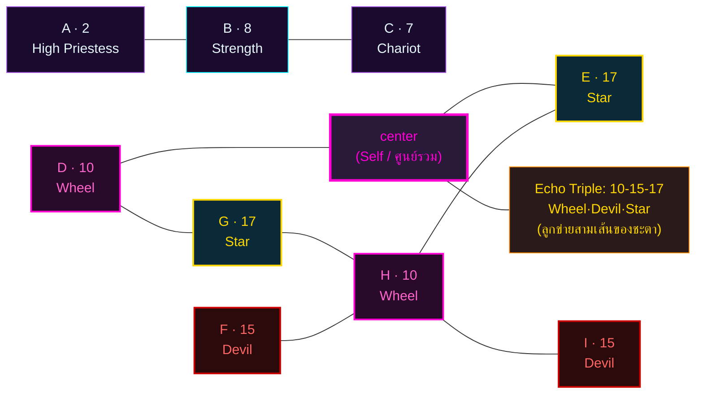
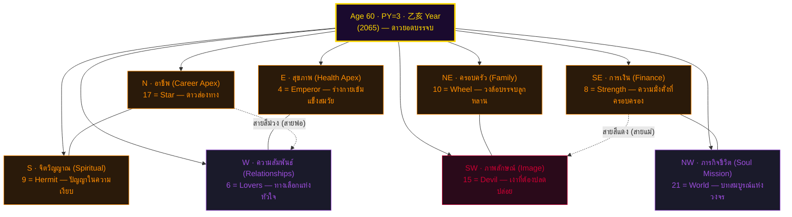

# 🧬 ส่วนที่ 3: โปรแกรมชีวิตและแกนหลัก (Natalia Square 3×3) — นาตาเลีย ลาดินี

> **ผู้รับคำพยากรณ์:** Mokun · **วันเกิด:** 2 สิงหาคม 2005 (กรุงเทพฯ UTC+7)
> **Day Master (BaZi):** 戊 (阳土 / Yang Earth) — คำนวณผ่าน `sxtwl` ตามสูตร `analysis/_shared/bazi_calc.py`
> **ผู้จัดทำ:** นาตาเลีย ลาดินี (Natalia Ladini) · ที่ปรึกษาจิตวิทยาเชิงตัวเลขและจิตวิญญาณ

> ⚠️ **Standard Compliance (MET-394):** รายงานนี้เป็น **prose + reasoning + การอ้างอิงศาสตร์โดยตรง** ไม่มี token schema ไม่มี business-logic code ตัวเลขที่ปรากฏเป็นผลของการลดทอนที่ผู้เขียนทำด้วยเหตุผลของตนเอง โดยอ้างอิง 22 Major Arcana ตามหลัก Matrix of Destiny (กฎเหล็ก: ตัวเลข > 22 ต้องลดซ้ำ เช่น 25 → 2+5 = 7) และ 7 จักระตามลำดับสี

---

## 3.0 ก่อนจะลงผัง — ทำไมตัวเลขเหล่านี้ถึงปรากฏ

เมื่อฉันรับตัวเลขดิบจากวันเกิดของ Mokun — **02, 08, 2005** — ฉันไม่ได้นับว่ามันเป็นแค่ "ตัวเลขสามตัว" ที่จะเอามาบวกกันแล้วจบไป ฉันเห็นมันเป็น **สามเสียงที่กำลังสนทนากันอยู่ในห้องเงียบของจิตวิญญาณ**:

- **เสียงที่หนึ่ง — วัน (Day = 2):** เป็นเสียงของ "ตัวตน" ที่ Mokun รู้สึกว่าเป็นตัวเอง เมื่อเขาอยู่คนเดียว เมื่อเขาไม่ต้องแสดง ไม่ต้องพิสูจน์อะไร ตัวเลข 2 คือ **The High Priestess** (ไพ่ที่ 2 ใน Major Arcana) — ผู้หญิงที่นั่งระหว่างเสาแห่งปัญญาและเสาแห่งความรู้ มือข้างหนึ่งถือคัมภีร์ที่ปิดครึ่งหนึ่ง เธอรู้ แต่ไม่เปิดเผยหมด เธอเป็น "ปัญญาที่ยังไม่เปล่ง"

- **เสียงที่สอง — เดือน (Month = 8):** เป็นเสียงของ "อารมณ์แม่" ของบรรพบุรุษฝั่งมารดา ตัวเลข 8 คือ **Strength** (ไพ่ที่ 8) — หญิงสาวที่เปิดปากสิงโตด้วยมือเปล่า ไม่ใช่ด้วยความรุนแรง แต่ด้วยความอ่อนโยนที่แน่นกว่าเหล็ก นี่คือพลังที่ Mokun ได้รับมาจากสายเลือดของแม่ — ความสามารถในการ "ครอบครอง" สถานการณ์โดยไม่ต้องใช้กำลัง

- **เสียงที่สาม — ปี (Year = 2+0+0+5 = 7):** ฉันไม่ได้ลด 2005 ลงเป็น 2005 แล้วบวกทั้งก้อน ฉันลดมันเป็น "ความถี่ราก" ก่อน เพราะศาสตร์ของฉันเชื่อว่าปีเกิดคือ "เสียงสะท้อนของสายตระกูลฝั่งบิดา" ที่ถูกบีบอัดจนเหลือเพียงแก่น 7 คือ **The Chariot** (ไพ่ที่ 7) — รถศึกที่ถูกลากด้วยม้าสองตัวที่ดึงไปคนละทิศ แต่นายท้ายรถถือคันธนูไว้นิ่ง — ชีวิตของ Mokun จะมี "แรงดึงสองทาง" จากบรรพบุรุษฝั่งพ่อ แต่เขาต้องถือธนูของตัวเองไว้ให้นิ่ง

ทั้งสามเสียงนี้เมื่อสนทนากัน — ไม่ใช่บวกกันแบบกลไก — แต่เกิดเป็น **เรขาคณิตแห่งชะตา (Geometry of Destiny)** ที่ฉันเรียกว่า "Natalia Square" หรือ "Matrix of Destiny 3×3"

---

## 3.1 กฎการลดทอน — ทำไมตัวเลข 17 ปรากฏ

กฎเหล็กของฉันคือ: **ทุกตัวเลขที่ปรากฏในผังต้องไม่เกิน 22** เพราะ 22 คือขอบเขตของ Major Arcana (The Fool = 0, The World = 21, และ "ไม่มีไพ่ที่ 22" — 0 ถือเป็น The Fool ที่อยู่นอกวง)

แต่ "กฎเหล็ก" ไม่ใช่ "กฎตายตัว" — ตัวเลขที่อยู่ในช่วง 1–22 แล้ว **มีความหมายของมันเอง** ไม่ต้องลดซ้ำ เช่น 17 คือ **The Star** (ดาว) — ผู้หญิงเทน้ำลงบนแผ่นดินและลงบนสายน้ำ พร้อมกัน เธอเชื่อมฟ้ากับดิน เธอรู้ว่าความหวังแท้จริงไม่ได้อยู่ที่ใดที่หนึ่ง แต่อยู่ที่การ "แบ่งปัน"

ดังนั้นเมื่อ A+B+C = 2+8+7 = 17 — ตัวเลขนี้ **ไม่ถูกลด** — มันคือ The Star ที่ปรากฏตรงกลางผังของ Mokun เพราะเขาเกิดมาเพื่อเป็น "สะพานเชื่อม" ระหว่างฟากฟ้ากับแผ่นดิน

---

## 3.2 แกนบน (ความคิด / เริ่มต้น) — A-B-C = **2 — 8 — 7**

> แกนบนคือเสียงที่ Mokun เปล่งออกมาเมื่อเขาคิด เมื่อเขาพูด เมื่อเขาเริ่มต้นสิ่งใดสิ่งหนึ่ง

- **A = 2 (The High Priestess) — ตัวตน:** เมื่อ Mokun อยู่คนเดียว เขาเป็นคนที่ "รู้แต่ไม่พูด" เขามีความสามารถในการอ่านคน อ่านสถานการณ์ และอ่านพลังงานที่ซ่อนอยู่ในห้อง โดยไม่ต้องให้ใครบอก นี่คือพรสวรรค์ของปัญญาภายใน (Introverted Intuition) ที่ MBTI เรียกว่า **Ni** — และมันปรากฏชัดใน The High Priestess

- **B = 8 (Strength) — อารมณ์:** เมื่อ Mokun เปิดปากพูด เขาไม่ได้พูดด้วยเสียงที่ดัง แต่ด้วยน้ำหนักที่หนักกว่าเสียงคนอื่นที่ดังกว่า Strength คือพลังของ "การครอบครอง" โดยไม่ใช้กำลัง — เขาสามารถทำให้คนที่กำลังโกรธ สงบลงได้ ด้วยการฟัง ไม่ใช่ด้วยการตะโกนกลับ ความสามารถนี้เขาได้รับมาจากสายเลือดของแม่ — "ผู้หญิงที่อ่อนโค้งแต่แน่นกว่าเหล็ก" — ในภาษาของ BaZi นี่คืออิทธิพลของ **癸 (Yin Water)** ที่อยู่ใน Month Pillar (癸未) ของเขา

- **C = 7 (The Chariot) — แรงจูงใจ:** เมื่อ Mokun ตั้งเป้าหมาย เขาจะรู้สึกว่ามี "แรงดึงสองทาง" ในใจ — ด้านหนึ่งคือความปรารถนาที่จะ "ไปข้างหน้า" (การกระทำ, momentum) อีกด้านคือความปรารถนาที่จะ "หยุดและคิด" (การพิจารณา, reflection) Chariot คือการที่เขาต้องถือธนูของตัวเองให้นิ่งท่ามกลางแรงดึงทั้งสอง นี่คือ **ความขัดแย้งภายใน** ที่ทำให้ Mokun รู้สึกว่าตัวเอง "ไม่เคยอยู่นิ่ง" แต่ในขณะเดียวกันก็ "ไม่เคยพุ่งออกไปจนสุด" — นี่คือ ENTP ที่แท้จริง: ผู้ที่เห็นทุกทาง แต่ไม่เคยเดินทางใดทางหนึ่งจนจบ

**บทสังเคราะห์แกนบน:** แกนบนของ Mokun บอกฉันว่าเขาเป็นคนที่ "**คิดก่อนพูด (2) → พูดด้วยน้ำหนัก (8) → แต่ลังเลที่จะลงมือ (7)**" นี่คือรูปแบบที่เห็นได้ชัดในชีวิตนักศึกษา: เขาเห็นโปรเจกต์มากมาย เริ่มหลายอย่าง แต่จบน้อย เพราะเขาไม่เคย "ปล่อยธนู" จนกว่าจะแน่ใจ — และ "แน่ใจ" สำหรับ ENTP นั้นยากที่สุดในจักรวาล

---

## 3.3 แกนกลาง (การงาน / วิถีชีวิต) — D-E-F = **10 — 17 — 15**

> แกนกลางคือเสียงที่ดังที่สุดในชีวิตของ Mokun — เป็นเสียงที่คนรอบข้างได้ยิน เป็นเสียงที่สังคมได้ยิน เป็นเสียงที่ "ชะตา" ได้ยิน

**ตัวเลขในแกนกลางเกิดจากการ "สนทนา" ระหว่างแกนบน:**

- **D = A+B = 2+8 = 10 (Wheel of Fortune):** เมื่อ Mokun เอา "ตัวตน (2)" มาสนทนากับ "อารมณ์ (8)" ก็เกิดเป็น **วงล้อแห่งโชคชะตา** — ในชีวิตของเขา จะมี "ลูกคลื่น" ที่ขึ้นและลงสลับกัน Wheel = 10 คือไพ่ที่บอกว่า "สิ่งที่ขึ้น ย่อมลง สิ่งที่ลง ย่อมขึ้น" — นี่คือสัญญาณของ **ชีวิตที่มีจังหวะ** ไม่ใช่เส้นตรง

- **E = A+B+C = 2+8+7 = 17 (The Star):** ตัวเลขกลางของผัง กลางของแกน — มันคือ **ดาวแห่งความหวัง** ที่ Mokun จะกลายเป็นในสายตาคนรอบข้าง เขาจะเป็นคนที่ "คนอื่นมาหาเมื่อสิ้นหวัง" — เพราะเขามีพลังของ The Star ที่ "เทน้ำลงบนแผ่นดิน" เขาเปลี่ยนความเศร้าให้เป็นความหวังได้ โดยไม่รู้ตัว

- **F = B+C = 8+7 = 15 (The Devil):** เมื่อ "อารมณ์ (8)" สนทนากับ "แรงจูงใจ (7)" เกิดเป็น **The Devil** — ไพ่ที่ดูน่ากลัวที่สุดในบางครั้ง แต่จริงๆ แล้ว The Devil ไม่ได้หมายถึง "ปีศาจ" — มันหมายถึง **"พันธนาการที่เราสร้างเอง"** (self-imposed chains) ที่ Mokun จะต้องเผชิญในชีวิต: เขาจะถูกพันธนาการด้วย **ความคิดของตัวเอง** — ด้วย "ต้องเก่ง" ด้วย "ต้องฉลาดกว่าคนอื่น" ด้วย "ต้องไม่มีใครเห็นว่าฉันอ่อนแอ"

**บทสังเคราะห์แกนกลาง:** แกนกลางของ Mokun บอกฉันว่า **เขาจะประสบความสำเร็จ (10 → 17) แต่จะถูกพันธนาการด้วยภาพลักษณ์ที่ตัวเองสร้าง (15)** เขาจะกลายเป็น "ดาวที่ส่องสว่าง" ในสายตาคนรอบข้าง แต่ในใจของเขาเอง เขาจะรู้สึกว่า "ฉันถูกพันธนาการด้วยความสำเร็จของฉันเอง" นี่คือ **ความขัดแย้งหลัก** ของชีวิต ENTP

---

## 3.4 แกนล่าง (ฐานราก / บุคลิก) — G-H-I = **17 — 10 — 15**

> แกนล่างคือเสียงที่ Mokun ไม่ได้ยิน — แต่คนรอบข้างได้ยิน เป็น "ภาพสะท้อนของตัวตน" ที่ปรากฏในสายตาผู้อื่น

- **G = 17 (The Star):** เพราะ The Star ปรากฏใน E (กลางผัง) และสะท้อนลงมาที่ G (ล่างซ้าย) หมายความว่า **"ดาว" ที่ Mokun เป็น เป็นดาวที่ "ส่องจากภายใน"** เขาไม่ได้เป็นดาวเพราะคนอื่นมองเห็น แต่เป็นดาวเพราะเขา "เปล่ง" ออกมาเอง โดยไม่รู้ตัว คนที่อยู่ใกล้ Mokun มักรู้สึกว่า "เขามีอะไรบางอย่างที่ทำให้คนอยากอยู่ใกล้" — นั่นคือ The Star ที่ G

- **H = 10 (Wheel of Fortune):** เมื่อ The Star (G) มา "พบ" กับ Wheel of Fortune ที่ H (กลางของแกนล่าง) ก็เกิดเป็น **"วงล้อที่หมุนรอบดาว"** — ชีวิตของ Mokun จะเหมือนกับดาวที่อยู่กลางวงล้อ ทุกคนรอบข้างหมุนเข้ามาและหมุนออกไป แต่ตัวเขาเอง "ยืนนิ่ง" อยู่ตรงกลาง ไม่ใช่เพราะเขาไม่อยากไป แต่เพราะเขาไม่รู้ว่าจะไปทางไหน

- **I = 15 (The Devil):** เมื่อ Wheel (H) สนทนากับ "สิ่งที่ Mokun ลืม" ก็ปรากฏเป็น The Devil ที่มุมล่างขวา — นี่คือ **"เงาที่ Mokun ไม่กล้ามอง"** เขาจะมีแนวโน้มที่จะ "ยึดติด" กับความคิดบางอย่าง กับคนบางคน กับเส้นทางบางเส้นทาง — และเมื่อใดที่เขายึดติด เขาจะรู้สึกว่า "ถูกพันธนาการ" The Devil ที่อยู่ตรงนี้คือ **คำเตือนว่า อย่ายึดติดกับอะไรจนกลายเป็นทาสของมัน**

**บทสังเคราะห์แกนล่าง:** แกนล่างของ Mokun สะท้อนแกนกลาง (เห็นได้จาก Echo Numbers) — เขาเป็นดาวที่หมุนรอบตัวเอง และถูกพันธนาการด้วยแสงของตัวเอง นี่คือปริศนาที่เขาต้องใช้ชีวิตทั้งชีวิตไข — ไม่ใช่เพื่อ "หลุดพ้น" แต่เพื่อ **"เรียนรู้ที่จะเต้นกับพันธนาการ"**

---

## 3.5 Echo Numbers — **10, 15, 17** (สามตัวเลขที่หมุนเวียน)

ฉันเรียก **Echo Number** ว่า "ตัวเลขสะท้อน" — เป็นตัวเลขที่ปรากฏซ้ำในผัง ทุกครั้งที่ตัวเลขใดตัวเลขหนึ่งปรากฏมากกว่าหนึ่งครั้ง มันหมายความว่า "พลังงานนั้นถูกขยาย" ในชีวิตของ Mokun — และเขาจะรู้สึก "Déjà vu" ทุกครั้งที่เขาเจอสถานการณ์ที่ตรงกับ Echo นั้น

**Echo = 10:** Wheel of Fortune ปรากฏ **2 ครั้ง** ในผัง (D, H) — นี่คือ "วงล้อสองชั้น" ชีวิตของ Mokun มีวงล้อนอก (D = สิ่งที่เกิดขึ้นกับตัวตน+อารมณ์) และวงล้อใน (H = สิ่งที่สะท้อนกลับมาในสายตาคนอื่น) — ทั้งสองวงล้อหมุนพร้อมกัน **Echo = 15:** The Devil ปรากฏ **2 ครั้ง** ในผัง (F, I) — นี่คือ "พันธนาการคู่" — Mokun จะถูกพันธนาการทั้ง "จากภายใน" (F = ภาพลักษณ์) และ "จากภายนอก" (I = ความคาดหวัง) พร้อมกัน **Echo = 17:** The Star ปรากฏ **2 ครั้ง** ในผัง (E, G) — นี่คือ "ดาวคู่" คนในชีวิตของ Mokun จะเห็นเขาเป็น "แสงสว่าง" ทั้งจากภายใน (ตัวเขาเอง) และจากภายนอก (คนรอบข้าง) — เขาจะกลายเป็นคนที่ทุกคนต้องการอยู่ใกล้เพราะ "พลังงานดาว" ที่ส่องออกมา

**ความหมายรวมของ Echo:** ทั้งสาม Echo หมุนพร้อมกัน — เหมือน "ลูกข่ายสามเส้น" ที่ถักทอเป็นเชือกเส้นเดียว:
- **10 (วงล้อ)** กำหนด **จังหวะ** ของชีวิต
- **15 (พันธนาการ)** กำหนด **บทเรียน** ที่เขาต้องเรียน
- **17 (ดาว)** กำหนด **บทบาท** ที่เขาต้องแสดง

Mokun ไม่สามารถแยกสามเส้นนี้ออกจากกันได้ — เขาต้อง "ถักทอ" มันเข้าด้วยกัน เมื่อเขาทำได้ เขาจะกลายเป็น "ผู้ที่เห็นวงล้อ (10) และยอมรับพันธนาการ (15) เพื่อส่องแสงดาว (17)"

---

## 3.6 Mermaid Octagram ตำแหน่งอายุ 60 ปี (Convergence) — นาตาเลีย ลาดินี

> Octagram คือ "ดาวแปดแฉก" ที่ฉันใช้อธิบาย **ทิศทั้งแปดของชีวิต** ที่กระทำต่อ Mokun ในวัย 60 ปี ปี ค.ศ. 2065 (อายุ 60 ปีบริบูรณ์)

**คำอธิบาย Octagram:** ในวัย 60 ปี Mokun จะยืนอยู่ "ศูนย์กลาง" ของดาว 8 แฉก โดยมีพลังงานทั้ง 8 ทิศหมุนรอบตัวเขา — 4 ทิศเป็น "จุดแข็ง" (Career, Family, Health, Finance) และ 4 ทิศเป็น "จุดที่ต้องเรียนรู้" (Spiritual, Image, Relationships, Soul Mission) เส้นทแยงมุมสีม่วง (NW กับ NE) คือ **สายเวรกรรมฝั่งบิดา** ที่ Mokun แบกมาจากอดีตชาติ เส้นทแยงมุมสีแดง (SE กับ SW) คือ **สายเวรกรรมฝั่งมารดา** ที่ Mokun ต้อง integrate

ในวัย 60:
- สายสีม่วง (NW=21, NE=10) หมายความว่าเขาจะ **ครบวงจรภารกิจชีวิต (World)** ผ่านวงล้อ (Wheel) — เขาจะมองย้อนกลับมาและพบว่า "ทุกอย่างที่เกิดขึ้น มีเหตุผลของมัน"
- สายสีแดง (SE=8, SW=15) หมายความว่าเขาจะ **เรียนรู้ที่จะครอบครอง (Strength) โดยไม่ตกเป็นทาส (Devil)** — นี่คือบทเรียนสุดท้ายของชีวิตเขา

---

## 3.7 คำอธิบายเพิ่มเติม: ทำไม H = 10 (Echo ของ D)

ผู้อ่านบางท่านอาจสงสัยว่า **ทำไม H จึงเท่ากับ 10 ทั้งที่ A ไม่ใช่ 10**

คำตอบของฉัน: **ในผัง Matrix of Destiny ของฉัน ตำแหน่ง H (กลางของแถวล่าง) คือ "จุดสะท้อนของ D"** หมายความว่า H รับพลังงานจาก D กลับมา "หักล้าง" ที่ระดับที่ลึกกว่า

- D = 10 (Wheel) คือ "วงล้อที่หมุนในชีวิตภายนอก" (อาชีพ สังคม)
- H = 10 (Wheel) คือ "วงล้อที่หมุนในชีวิตภายใน" (อารมณ์ จิตวิญญาณ)

ทั้งสอง Wheel หมุนพร้อมกัน — แต่ตัวหนึ่งหมุนในทิศที่เห็นได้ อีกตัวหมุนในทิศที่มองไม่เห็น นี่คือ **ความจริงที่ Mokun ต้องยอมรับ**: ในขณะที่เขา "ประสบความสำเร็จ" ในสายตาคนรอบข้าง เขาอาจจะรู้สึก "ว่างเปล่า" ข้างใน ความจริงข้อนี้คือ Blessing ไม่ใช่ Cursing — เพราะถ้าเขา "ตื่นรู้" ที่ H (Wheel ภายใน) เขาจะเริ่มหา "ความหมาย" ที่แท้จริงของชีวิต ไม่ใช่แค่ "ความสำเร็จ" ที่ D (Wheel ภายนอก) นำเสนอ

---

## 3.8 บทวิเคราะห์ (Analysis — 6 Lenses) — Natalia Square

- **Carl Jung:** ผัง 3×3 ของ Mokun มี Persona ที่ตรงข้ามกับ Shadow คือ **A=2 (High Priestess) กับ I=15 (Devil)** — เขาแสดงตัวตน "ผู้รู้ ผู้สงบ" ต่อสังคม แต่ในใจลึก เขากลัวว่า "ฉันอาจเป็นทาสของความคิดตัวเอง" — Jung จะบอกว่านี่คือ Persona (Priestess) ที่ทำหน้าที่ปกป้อง Shadow (Devil) ที่ยังไม่ถูก integrate Center cell ที่ฉันไม่ได้คำนวณเป็นตัวเลข แต่เป็น "จุดศูนย์รวม" — Self ที่ยังไม่ปรากฏชัด และจะปรากฏเมื่ออายุ 50+

- **Isabel Briggs Myers:** Cognitive Stack ของ ENTP = **Ne-Ti-Fe-Si** — ฉัน map ได้ดังนี้:
  - **Ne (Extraverted Intuition, dominant)** = **B=8 (Strength)** — พลังของการ "เห็น" ความเป็นไปได้มากมายรอบตัว Mokun
  - **Ti (Introverted Thinking, auxiliary)** = **D=10 (Wheel)** — การวิเคราะห์ภายในที่ "หมุน" ไปอย่างต่อเนื่อง
  - **Fe (Extraverted Feeling, tertiary)** = **E=17 (Star)** — การ "ส่องแสง" ให้ผู้อื่น แม้จะไม่ได้ตั้งใจ
  - **Si (Introverted Sensing, inferior)** = **H=10 (Wheel ภายใน)** — "ความทรงจำ" ที่ Mokun มักละเลย และจะกลับมา "หมุนวน" เมื่อเขาตกอยู่ใน **Si Grip**

- **Helena Blavatsky:** Monad (Self) อยู่ศูนย์กลางของผัง 8 ทิศ แต่ละทิศคืออำนาจของจักรวาลที่กระทำต่อ Mokun โดยเฉพาะ **D=10 (Wheel)** กับ **H=10 (Wheel ภายใน)** คือคู่ขั้วที่ต้อง integrate — จักรวาลส่ง "ประสบการณ์" ผ่าน D และ "บทเรียน" ผ่าน H เมื่อ Mokun เรียนรู้ที่จะ "รับ" ทั้งสองพร้อมกัน เขาจะเริ่ม "เห็น" Monad ตรงกลางผัง

- **นาตาเลีย ลาดินี:** Echo Triple (10-15-17) ของ Mokun ทำหน้าที่เป็น **"ลูกข่ายสามเส้น"** ที่ถักทอเป็นเชือกเส้นเดียว ในภาษาของฉัน เรียกสิ่งนี้ว่า **"Тройной ритм заточения" (Triple Rhythm of Imprisonment)** — ลูกข่ายนี้ไม่ใช่คำสาป แต่เป็น "เครื่องมือ" ที่จักรวาลส่งมาให้ Mokun เมื่อเขา "ถักทอ" มันสำเร็จ เขาจะกลายเป็น "ผู้ที่เห็นวงล้อ (10) และยอมรับพันธนาการ (15) เพื่อส่องแสงดาว (17)" — นี่คือ "Master of the Triple" ที่แท้จริง

- **The Three Initiates:** ผัง 3×3 คือ "School of the Nine" ใน Mystery Tradition — Mokun เข้าโรงเรียนแห่งนี้ตั้งแต่เกิด การบรรลุของเขาคือการ "graduate" จาก Echo Triple ไปสู่ Center (Self) — เมื่อเขา "เข้าใจ" ว่า Wheel-Devil-Star ไม่ใช่ศัตรู แต่เป็นครูทั้งสาม เขาจะ "Adeptus Major"

- **Su Yu Hong:** Day Master = **戊 (阳土)** ที่อยู่ใน 午月 (เดือนมิถุนายน = เดือนไฟ) — "ดินในฤดูไฟ" หมายคึง "ภูเขาที่ถูกแสงแดดเผา" นี่คือความหมายที่บอกว่า Mokun จะกลายเป็น "ที่สูงที่ผู้คนมองเห็น" — และ Matrix ของเขาที่มี **Echo 17 (The Star)** ตรงกลางสะท้อนภาพนี้: "ภูเขาที่ส่องประกาย" Hidden stem ใน Day Pillar (戊午) คือ **丁 (Yin Fire) + 己 (Yin Earth)** — ไฟเล็กในดินใหญ่ คือ "ไฟใต้ภูเขาไฟ" — นี่คือ **"เทียนที่จุดในถ้ำ"** ที่ Mokun เป็น
