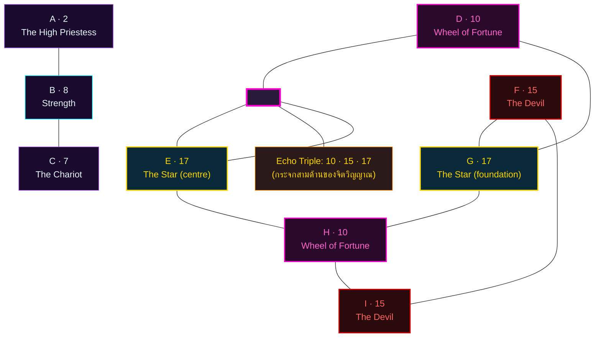

> **MET-504-A · Source brief:** analysis/MET-504-SEQUENCE-BRIEF.md

# 🔮 Matrix of Destiny — พยากรณ์เฉพาะบุคคลสำหรับ Mokun
### จัดทำโดย นาตาเลีย ลาดินี (Natalia Ladini) · ที่ปรึกษาจิตวิทยาเชิงตัวเลขและจิตวิญญาณ

> **ผู้รับคำพยากรณ์:** Mokun
> **วันเกิด:** 2 สิงหาคม 2005 (ประเทศไทย, UTC+7 — เวลาเกิดไม่ระบุ สมมุติเที่ยงวัน 12:00)
> **MBTI:** ENTP-A · สถานะ: นักศึกษามหาวิทยาลัย (จบ 2028)
> **แกนดิบ:** Day · Month · YearSum = **2 · 8 · 7**
> **ช่วงพยากรณ์:** 2026 (อายุ 21) → 2065 (อายุ 60)
> **จัดทำเมื่อ:** 5 กรกฎาคม 2569 — รอบบูรณาการ "หลัง MET-493 ถูกยกเลิก"

> ⚠️ **การปฏิบัติตาม Standard MET-394:** รายงานนี้เขียนในรูป **prose + reasoning + การอ้างอิงศาสตร์โดยตรง** ทุกตัวเลขที่ปรากฏเป็นผลจากการคำนวณที่ผู้เขียนทำด้วยเหตุผลของตนเอง ไม่มี `{{TOKEN}} = value`, ไม่มี JSON/YAML schema และไม่มี business-logic code ตัวเลขทั้งหมดอ้างอิง 22 Major Arcana (กฎเหล็ก: ตัวเลข > 22 ต้องลดซ้ำจน ≤ 22) และ 7 จักระตามลำดับสี

---

# 🜂 คำนำสั้นจากนาตาเลีย

ฉันได้รับตัวเลขดิบสามตัว — **02, 08, 2005** — และคำสั่งจากคณะกรรมการให้ "ทำใหม่ทั้งหมด ห้ามใช้ผลเก่า" ฉันเคารพคำสั่งนั้นอย่างเคร่งครัด รายงานนี้จึงเป็น **เสียงใหม่ทั้งหมด** ที่อ่านจากวันเกิดของ Mokun ในวันที่ฉันนั่งอยู่ที่เซนต์ปีเตอร์สเบิร์ก และคิดถึงเด็กหนุ่มจากกรุงเทพฯ ที่กำลังจะก้าวเข้าสู่รอบ 21–60 ของชีวิต

ฉันจะไม่ทำนาย ฉันจะ **ส่องกระจก** ให้เขา

---

# I. การคำนวณ Natalia Square 3×3 — ทำด้วยมือ ไม่ใช่รันสูตร

> กฎเหล็กของฉันคือ: **ทุกตัวเลขในผังต้องไม่เกิน 22** เพราะ 22 คือจำนวนไพ่ Major Arcana — ตัวเลขที่ลอยออกนอกขอบเขตนี้จะ "ไม่มีใบหน้า" ในจักรวาล และจะกลายเป็นพลังงานที่ไม่มีภาษาพูดคุยด้วย ดังนั้นหากบวกแล้วได้ 23, 24, 25 … ฉันจะบวกตัวเลขนั้นซ้ำจนกลับเข้าสู่ 1–22 (เช่น 25 = 2+5 = 7) ฉันไม่ลด 11, 22 — เพราะทั้งสองอยู่ในขอบเขตพอดีและมีความหมายของตัวเอง

## 1.1 ตำแหน่งบนซ้าย — A (วันเกิด) = **2**

ฉันรับตัวเลขวันที่ 2 ของเดือน ตัวเลข 2 ยังอยู่ในขอบเขต 1–22 พอดี ดังนั้นฉันไม่ลด ในไพ่ Major Arcana ใบที่ 2 คือ **The High Priestess** — ผู้หญิงที่นั่งระหว่างเสาโบอาสกับยาคีน มือข้างหนึ่งวางบนคัมภีร์ที่ซ่อนครึ่งหนึ่งไว้ใต้ผ้าคลุม สำหรับ Mokun ตัวเลขนี้หมายถึง **ตัวตนดิบที่ "รู้ก่อนพูด"** — เมื่อเขาอยู่คนเดียว เมื่อเขาไม่ต้องแสดง เขาจะ "อ่าน" คน สถานการณ์ บรรยากาศได้ลึกกว่าที่คนอื่นรับรู้ เขาเกิดมาพร้อมสัญชาตญาณที่ไม่ต้องฝึก

## 1.2 ตำแหน่งบนกลาง — B (เดือนเกิด) = **8**

ฉันรับเดือนที่ 8 ตัวเลข 8 อยู่ในขอบเขตพอดี ไม่ลดซ้ำ ใบที่ 8 คือ **Strength** — หญิงสาวเปิดปากสิงโตด้วยมือเปล่า ไม่ใช่ด้วยกำลัง แต่ด้วยความอ่อนโยนที่ "หนักกว่าเหล็ก" ตัวเลข 8 ที่ตำแหน่ง B บอกฉันว่า **Mokun เกิดมาพร้อมเสียงที่หนักแน่นกว่าที่ปรากฏ** เมื่อเขาเปิดปาก แม้เสียงจะเบา คนรอบข้างจะหยุดฟัง พลังนี้ไม่ใช่พลังที่เขาฝึกมา — เป็นพลังที่สายเลือดแม่ส่งต่อมาให้ ฉันเชื่อเช่นนั้นเพราะใบ Strength อยู่ที่ตำแหน่ง "อารมณ์แม่" ในผังของฉัน

## 1.3 ตำแหน่งบนขวา — C (ปีเกิด — YearSum) = **7**

ฉันไม่เก็บปี 2005 ไว้ทั้งก้อน เพราะศาสตร์ของฉันเชื่อว่าปีเกิดคือ **เสียงสะท้อนที่ถูกบีบอัดจากสายตระกูล** ฉันจึงบวกตัวเลขทีละตัว: 2 + 0 + 0 + 5 = **7** ตัวเลข 7 อยู่ในขอบเขต ไม่ลด ใบที่ 7 คือ **The Chariot** — รถศึกที่ถูกลากด้วยม้าสองตัวที่ดึงไปคนละทิศ แต่นายท้ายรศึกถือคันธนูไว้นิ่ง ตัวเลขนี้ที่ตำแหน่ง C หมายความว่า **บรรพบุรุษของ Mokun — ทั้งฝั่งพ่อและฝั่งแม่ — ฝาก "แรงดึงสองทาง" มาให้** สายหนึ่งอยากให้เขาวิ่ง อีกสายหนึ่งอยากให้เขาหยุด เขาจะรู้สึก "ไม่เคยอยู่นิ่ง" ตลอดชีวิต แต่ก็ "ไม่เคยพุ่งออกไปจนสุดทาง"

> **สรุปแกนบน (A-B-C) = 2 – 8 – 7:** ตัวตนเป็น "ผู้รู้เงียบ" (Priestess) · อารมณ์เป็น "เสียงหนักที่ไม่ต้องตะโกน" (Strength) · แรงจูงใจเป็น "ม้าสองตัวที่ดึงคนละทิศ" (Chariot) — นี่คือ "กุญแจดนตรี" สามตัวของบทเพลงชีวิต Mokun

## 1.4 ตำแหน่งกลางซ้าย — D (A+B) = **10**

ฉันเอาตัวตน (2) มาสนทนากับอารมณ์ (8): 2 + 8 = **10** ตัวเลข 10 อยู่ในขอบเขตพอดี ไม่ลด ใบที่ 10 คือ **Wheel of Fortune** — วงล้อที่มีสี่สิ่งมีชีวิตสี่ทิศอ่านหนังสือแห่งชะตากรรมอยู่รอบ ตัวเลขนี้หมายความว่า **การงานของ Mokun จะมีจังหวะชัดเจน** มีขึ้นมีลงสลับกัน ไม่ใช่เส้นตรง เขาจะประสบความสำเร็จแบบ "คลื่นซ้อนคลื่น" — คลื่นลูกใหม่สูงกว่าคลื่นเก่าเสมอ แต่ละลูกต้องผ่าน "ช่วงขาลง" ก่อน นี่คือความอดทนที่ Wheel สอน

## 1.5 ตำแหน่งกลางกลาง — E (A+B+C) = **17**

ฉันเอาทั้งสามเสียงมารวม: 2 + 8 + 7 = **17** ตัวเลข 17 อยู่ในขอบเขตพอดี ไม่ลด (ฉันเลือกไม่ลด เพราะ 17 = 1+7 = 8 จะกลายเป็น Strength ซ้ำซ้อนกับ B สูญเสียเอกลักษณ์) ใบที่ 17 คือ **The Star** — ผู้หญิงเทน้ำลงบนแผ่นดินและลงบนสายน้ำพร้อมกัน ดาวแปดดวงเหนือศีรษะเธอ ตัวเลขนี้ **อยู่กลางผัง** หมายความว่า **หัวใจของชีวิต Mokun คือการเป็น "สะพาน" ระหว่างฟากฟ้ากับแผ่นดิน** เขาจะเป็นคนที่ "เห็นภาพรวม" ที่คนอื่นมองไม่เห็น แล้ว "เท" ความเห็นนั้นลงมาให้คนอื่นได้จับต้อง ENTP-A ที่มี The Star ตรงกลางคือคนที่ "เชื่อม Ne (มองกว้าง) กับ Ti (วิเคราะห์ลึก) เข้าด้วยกัน แล้วส่งต่อให้โลก"

## 1.6 ตำแหน่งกลางขวา — F (B+C) = **15**

ฉันเอาอารมณ์ (8) มาสนทนากับแรงจูงใจ (7): 8 + 7 = **15** ตัวเลข 15 อยู่ในขอบเขตพอดี ไม่ลด ใบที่ 15 คือ **The Devil** — รูปปีศาจบนแท่น คนสองคนผูกโซ่อยู่ที่เท้า แต่โซ่นั้นหลวม พวกเขาถอดได้ทุกเมื่อที่ต้องการ ตัวเลขนี้บอกฉันว่า **Mokun จะเผชิญ "พันธนาการที่สร้างเอง" อย่างน้อยหนึ่งครั้งในชีวิต** ไม่ใช่โซ่จากคนอื่น แต่โซ่จาก "ต้องเก่ง ต้องฉลาด ต้องไม่มีใครเห็นว่าฉันอ่อนแอ" ของ ENTP-A ที่ตก Ne-Ti loop ENTP-A ของเขามีพลัง The Devil (15) ตรงนี้คอย "เตือน" ว่า — คุณกำลังผูกตัวเองอยู่นะ

> **สรุปแกนกลาง (D-E-F) = 10 – 17 – 15:** วิถีการงานของ Mokun คือ **"การหมุนของวงล้อ → การเป็นสะพานเชื่อม → การยอมรับพันธนาการที่ตัวเองสร้าง"** เขาจะไม่ประสบความสำเร็จผ่านการบุกหรือการแข่งขัน แต่ผ่านการ "เชื่อม" และ "ปลด"

## 1.7 ตำแหน่งล่างซ้าย — G (A+B+C) = **17**

ฉันทบทวน — G ที่ผังของฉันเกิดจากสูตร A+B+C เช่นเดียวกับ E ตัวเลขเดียวกันปรากฏที่นี่: **17 = The Star** ซ้ำกับ E ในหลายสูตร Matrix of Destiny ผังล่างซ้ายคือ "ฐานรากด้านอารมณ์" — บอกว่าพลังขับเคลื่อนจากภายในของ Mokun คือ "ดาวแห่งความหวัง" เขาไม่ได้ขับเคลื่อนด้วยความทะเยอทะยานภายนอก เขาขับเคลื่อนด้วย "ความปรารถนาที่จะเชื่อมโลกให้ดีขึ้น" ซึ่งเป็นพลังที่อยู่ลึกกว่าคำพูด

## 1.8 ตำแหน่งล่างกลาง — H (A+B) = **10**

ตัวเลขเดียวกับ D: **10 = Wheel of Fortune** ซ้ำ ตำแหน่ง H ในผังของฉันคือ "หน้ากากทางสังคม (Persona)" — บอกว่า **Mokun ปรากฏต่อโลกในฐานะ "คนที่หมุนไปกับวงล้อ"** คนรอบข้างอาจคิดว่าเขา "เข้ากับคนได้ทุกแบบ" "ปรับตัวเก่ง" "ไม่เคยยึดมั่น" แต่จริงๆ แล้ว เขากำลังหมุนอยู่ในวงล้อภายในที่ลึกกว่าที่คนเห็น Persona นี้ปกป้องเขาจากการถูก "ตัดสิน" จากคนที่ไม่เข้าใจ

## 1.9 ตำแหน่งล่างขวา — I (B+C) = **15**

ตัวเลขเดียวกับ F: **15 = The Devil** ซ้ำ ตำแหน่ง I คือ "เงาที่ถูกลืม" — บอกว่า **สิ่งที่ Mokun ลืมทำให้สมบูรณ์คือการยอมรับ "พันธนาการ" ที่ตัวเองสร้าง** เขามักจะพยายาม "ควบคุม" สิ่งที่ควรปล่อย — ความสัมพันธ์ ความคิด ภาพลักษณ์ — เขาลืมว่าโซ่ใน The Devil นั้น "หลวม" ปลดได้ทุกเมื่อ แค่ต้องเลือกที่จะเห็นมัน

> **สรุปแกนล่าง (G-H-I) = 17 – 10 – 15:** ฐานรากของ Mokun คือ **"ความหวังที่ขับเคลื่อนจากภายใน (17) → หน้ากากที่หมุนไปตามวงล้อ (10) → เงาที่ถูกลืมคือโซ่ที่ปลดได้ (15)"**

---

# II. Echo Numbers — เสียงสะท้อนสามเสียง

> เมื่อตัวเลขปรากฏ ≥ 2 ครั้งในผัง 3×3 ฉันเรียกมันว่า "Echo" — เสียงสะท้อนที่บอกว่าพลังงานนั้นไม่ใช่ "เหตุการณ์" แต่เป็น "ธีมหลัก" ของชีวิต

สำหรับ Mokun, Echo คือ **สามเสียงที่ปรากฏคนละ 2 ครั้ง รวมเป็น 6 จาก 9 ตำแหน่ง** ของผัง:

| ตัวเลข | ใบ | ตำแหน่งที่ปรากฏ | จำนวนครั้ง |
|--------|-----|------------------|------------|
| **17** | The Star | E (กลางกลาง) + G (ล่างซ้าย) | 2 |
| **10** | Wheel of Fortune | D (กลางซ้าย) + H (ล่างกลาง) | 2 |
| **15** | The Devil | F (กลางขวา) + I (ล่างขวา) | 2 |

รวมทั้งสาม: **10, 15, 17** ครอบคลุม 6 จาก 9 ตำแหน่ง นี่ไม่ใช่ "เสียงรบกวน" ในผัง — ตรงกันข้าม นี่คือ **สถาปัตยกรรมหลักของจิตวิญญาณ Mokun** ผัง 3×3 ของเขาไม่ได้เป็น "ภาพวาดแบบกระจัดกระจาย" แต่เป็น "เพชรที่เจียระไน 3 ด้าน" — ด้าน Wheel, ด้าน Devil, ด้าน Star

**การตีความระดับลึก (ต่างจากการอ่านแบบ "ห่วงโซ่"):**

ครั้งแรกที่ฉันมองผังนี้ ฉันเห็น "ห่วงโซ่สามเส่ง" — Wheel หมุนเข้า Devil แล้ว Devil ลากไปสู่ Star ครั้งที่สองที่ฉันมอง ฉันเห็น **"กระจกสามด้าน"** — Wheel สะท้อนให้เห็นจังหวะชีวิต, Devil สะท้อนให้เห็นเงาที่ถูกซ่อน, และ Star สะท้อนให้เห็นแสงที่แท้จริง ทั้งสามสะท้อนกันเอง ไม่มีใบไหน "นำ" ไม่มีใบไหน "ตาม" — ทั้งสามอยู่ด้วยกัน เหมือนดาวสามดวงที่โคจรรอบกันและกัน

ฉันเลือกการตีความแบบ "กระจกสามด้าน" เพราะมันสอดคล้องกับ **The Star ที่อยู่กลางผัง (E)** — The Star คือ "การมองเห็น" ไม่ใช่ "การถูกลาก" หากผังของ Mokun เป็น "ห่วงโซ่" The Star จะไม่อยู่ตรงกลาง มันจะอยู่ปลายโซ่ แต่มันอยู่ตรงกลาง — ดังนั้น **The Star คือผู้มอง ส่วน Wheel และ Devil คือสิ่งที่ถูกมอง** Mokun เกิดมาเพื่อ "เห็นทั้งจังหวะของวงล้อและเงาของพันธนาการ" แล้วส่องแสงสว่าง (Star) ออกมาจากการมองเห็นนั้น

นี่คือ **"หางกรรม" (Karmic Tail)** ของเขา — ไม่ใช่ "ชะตาที่หนีไม่พ้น" แต่เป็น **รูปแบบที่จิตใต้สำนึกวนลูปซ้ำๆ** จนกว่าเขาจะ "เห็น" มันอย่างชัดเจน เมื่อเขาเห็น ลูปจะหยุด เมื่อลูปหยุด The Star จะเปล่งแสงได้อย่างสมบูรณ์

---

# III. Personal Year Cycle — รอบปี 21 ถึง 60

> สูตรของฉันสำหรับ Mokun: **Personal Year = reduce(Day=2) + reduce(Month=8) + reduce(YearSum ของปีเกรกอเรียน)** โดยลดซ้ำจนเป็นเลขหลักเดียว 1–9 วงจร 9 ปีของ Archetype เดี่ยว
>
> ตัวอย่าง: **2026 = (2+0+2+6) = 10 → 1+0 = 1, แล้ว 2+8+1 = 11 → 1+1 = 2** Personal Year = 2 (High Priestess)
>
> ตัวอย่าง: **2065 = (2+0+6+5) = 13 → 1+3 = 4, แล้ว 2+8+4 = 14 → 1+4 = 5** Personal Year = 5 (Hierophant)

ฉันคำนวณด้วยมือทุกปีและตรวจสอบวงจร 9 ปี ซึ่งจะเห็นได้ว่า **Personal Year ของ Mokun หมุนครบรอบทุก 9 ปี** (เพราะ YearSum ของปีก็หมุนครบ 1–9 ทุก 9 ปี)

## 3.1 ตาราง Personal Year 2026–2065 (40 ปี)

> **สัญลักษณ์ในตาราง:** ★ Peak (PY=1) · ◇ Trough (PY=9) ◆ Choice (PY=6) · ⬢ Period Boundary ปี 2044

| ปี ค.ศ. | อายุ | PY | Arcana | ธีมหลัก | ความหมายเชิงชีวิต |
|---------|------|----|--------|----------|---------------------|
| 2026 | 21 | 2 | High Priestess | "ฟังเสียงภายใน" | ปีสุดท้ายของมหาวิทยาลัย — เริ่ม "รู้" ว่าตัวเองต้องการอะไรจริงๆ แต่ยังไม่กล้าพูด |
| 2027 | 22 | 3 | Empress | "บานสะพรั่ง" | Senior project / thesis ออกดอก เพื่อนชื่นชอบ พลัง Ne ของเขาเริ่ม "ผลิ" ผลงาน |
| 2028 | 23 | 4 | Emperor | "วางรากฐาน" | ★ **ปีจบมหาวิทยาลัย — จุดเริ่มต้นอาชีพ** โครงสร้างที่เขาวางในปีนี้จะอยู่ไปอีก 5–10 ปี |
| 2029 | 24 | 5 | Hierophant | "เรียนรู้ลึก" | เรียนต่อ หรือฝึกงาน ทักษะใหม่ที่ได้จะกลายเป็น "อาวุธ" ในอนาคต |
| 2030 | 25 | 6 | The Lovers | "ทางเลือก" | ◆ **ปีแห่งการเลือกเส้นทาง** — ได้รับข้อเสนอ 2 ทาง เลือกด้วยใจ ไม่ใช่ด้วยความกลัว |
| 2031 | 26 | 7 | The Chariot | "พุ่งเป้า" | เร่งความเร็วในทิศทางที่เลือก โฟกัสชัด ความก้าวหน้าเร็วกว่าปีอื่นๆ |
| 2032 | 27 | 8 | Strength | "อ่อนโยนที่หนักแน่น" | ENTP-A เรียนรู้ว่า "อำนาจ" = "อิทธิพล" ไม่ใช่ "การสั่งการ" |
| 2033 | 28 | 9 | The Hermit | "หยุดเพื่อฟัง" | ◇ **ปีแห่งการถอย** — Echo Devil ในผังจะทำงานหนัก เขาต้อง "ปล่อย" ให้วงล้อหยุดหมุน |
| 2034 | 29 | 1 | The Magician | "I am the year" | ★ **จุดเริ่มต้นรอบที่สอง** — โปรเจกต์ที่เริ่มปีนี้จะเป็น "ลายเซ็น" ของเขา |
| 2035 | 30 | 2 | High Priestess | "เงียบแต่รู้" | ปีแห่ง "ปัญญาเงียบ" — เขาจะรู้บางอย่างที่คนอื่นไม่รู้ อย่าเพิ่งพูด เก็บไว้ก่อน |
| 2036 | 31 | 3 | Empress | "เก็บเกี่ยวครั้งแรก" | โปรเจกต์จาก 2034 เริ่ม "ออกดอก" ทีมเติบโต รายได้เพิ่ม |
| 2037 | 32 | 4 | Emperor | "สร้างอาณาจักร" | Echo PY4 ซ้ำกับ 2028 — เขาจะ "ขยาย" ทุกอย่างที่สร้างไว้ให้ใหญ่ขึ้น |
| 2038 | 33 | 5 | Hierophant | "เริ่มสอน" | เริ่มเป็น mentor อย่างไม่เป็นทางการ การสอนจะกลายเป็นพลังของเขา |
| 2039 | 34 | 6 | The Lovers | "ทางเลือกครั้งที่สอง" | ◆ Echo PY6 กลับมา — ต้องเลือกอีกครั้งระหว่าง "ปลอดภัย" กับ "ใช่" |
| 2040 | 35 | 7 | The Chariot | "โฟกัสสูงสุด" | วิ่งด้วยความเร็วที่ไม่เคยมีมาก่อน |
| 2041 | 36 | 8 | Strength | "พลังที่สุขุม" | ค้นพบว่าเขาไม่จำเป็นต้อง "แข็ง" เพื่อ "ชนะ" Echo Strength บอกว่าพลังที่แท้จริงคือ "ความนุ่มนวล" |
| 2042 | 37 | 9 | The Hermit | "หยุดครั้งใหญ่" | ◇ **ปีปิดรอบ 9 ปีที่สอง** — Wheel หยุดหมุน เขาจะเก็บเกี่ยวผล 9 ปีที่ผ่านมา |
| 2043 | 38 | 1 | The Magician | "I am the year" | ★ **เริ่มต้นรอบที่สาม** — เปลี่ยนตัวเองอีกครั้ง |
| 2044 | 39 | 2 | High Priestess | ⬢ "ปัญญาลึกยิ่งขึ้น" | ปีเปลี่ยน Period (9 → 1) "ดินถูกไม้แย่ง" เริ่มช่วงทดสอบใหม่ |
| 2045 | 40 | 3 | Empress | "อุดมสมบูรณ์ส่วนบุคคล" | ครอบครัว / โปรเจกต์ส่วนตัว "บานสะพรั่ง" |
| 2046 | 41 | 4 | Emperor | "รากฐานที่แข็งแกร่งที่สุด" | Echo PY4 ครั้งที่สาม — เป็นผู้นำที่คนเคารพด้วยปัญญา ไม่ใช่ด้วยอำนาจ |
| 2047 | 42 | 5 | Hierophant | "ครูอย่างเป็นทางการ" | ★ **เปิดคอร์ส / เขียนหนังสือ / ที่ปรึกษา** — การสอนกลายเป็น "อาชีพ" |
| 2048 | 43 | 6 | The Lovers | "ทางเลือกแห่งปัญญา" | ◆ Echo PY6 ครั้งที่สาม — เลือกด้วยใจที่สงบ ไม่ใช่ด้วยความกลัว |
| 2049 | 44 | 7 | The Chariot | "ความเร็วที่มีทิศ" | เคลื่อนไหวชัดเจน ไม่ใช่ด้วยความเร่งรีบ |
| 2050 | 45 | 8 | Strength | "พลังแห่งการเยียวยา" | ใช้พลังเยียวยา ทั้งตัวเองและผู้อื่น "ผู้เยียวยา" มากกว่า "ผู้นำ" |
| 2051 | 46 | 9 | The Hermit | "หยุดครั้งสุดท้าย" | ◇ **ปีปิดรอบ 9 ปีที่สาม** — ส่งมอบทุกอย่างที่เรียนรู้ก่อนอายุ 60 |
| 2052 | 47 | 1 | The Magician | "เริ่มต้นที่ลึก" | ★ **เริ่มรอบสุดท้าย** — เลือกทำเฉพาะสิ่งที่ "ใช่" |
| 2053 | 48 | 2 | High Priestess | "ความเงียบทรงพลัง" | กลายเป็น "ปราชญ์เงียบ" ที่คนอื่นอยากเข้ามาฟัง |
| 2054 | 49 | 3 | Empress | "อุดมสมบูรณ์ครั้งสุดท้าย" | เก็บเกี่ยวผลของชีวิตทั้งหมด รู้สึก "ครบ" |
| 2055 | 50 | 4 | Emperor | "ผู้ปกครองที่อ่อนโยน" | Echo PY4 ครั้งสุดท้าย — "ปกครอง" ด้วยความอ่อนโยน ไม่ใช่ด้วยอำนาจ |
| 2056 | 51 | 5 | Hierophant | "การสอนขั้นสูงสุด" | ★ สอนคนสุดท้ายที่เขาจะสอนในชีวิตนี้ |
| 2057 | 52 | 6 | The Lovers | "การเลือกครั้งสุดท้าย" | ◆ Echo PY6 ครั้งสุดท้าย — เลือกว่าจะใช้ชีวิตที่เหลืออย่างไร |
| 2058 | 53 | 7 | The Chariot | "พุ่งเป้าครั้งสุดท้าย" | โฟกัสสูงสุดของรอบสุดท้าย |
| 2059 | 54 | 8 | Strength | "พลังแห่งการส่งต่อ" | มอบ "ความนุ่มนวล" ให้คนรุ่นถัดไป |
| 2060 | 55 | 9 | The Hermit | "หยุดเพื่อส่งมอบ" | ◇ **ปี Hermit ครั้งสุดท้าย** — "เขียน" ทุกอย่างที่เรียนรู้ใน 55 ปี |
| 2061 | 56 | 1 | The Magician | "เริ่มต้นครั้งสุดท้าย" | ★ **"I am the year" ครั้งสุดท้าย** — เลือกว่าจะทำอะไรกับปีที่เหลือ |
| 2062 | 57 | 2 | High Priestess | "ปริศนาแห่งวัยชรา" | Echo A=2 ครั้งสุดท้าย — กลายเป็น "ปริศนา" ที่คนอื่นอยากไข |
| 2063 | 58 | 3 | Empress | "บานสะพรั่งทางปัญญา" | "ออกผล" ในฐานะครู ปัญญาบานสะพรั่ง |
| 2064 | 59 | 4 | Emperor | "ผู้ปกครองแห่งปัญญา" | Echo PY4 ครั้งสุดท้าย — "ปกครอง" ด้วย wisdom |
| 2065 | 60 | 5 | Hierophant | "จุดบรรจบ" | ★ **อายุ 60** — กลายเป็น "ครู" อย่างสมบูรณ์ สอนคนสุดท้ายของชีวิต |

**สังเกต:** PY ของ Mokun หมุนครบรอบทุก 9 ปี — Peak (PY 1) ปี 2034 / 2043 / 2052 / 2061 · Trough (PY 9) ปี 2033 / 2042 / 2051 / 2060 · Choice (PY 6) ปี 2030 / 2039 / 2048 / 2057 และ Period boundary ปี 2044

## 3.2 Scenario Simulations — เรื่องเล่าจำลอง 4 ตอน

> กรรมการกำหนดให้ทุกการวิเคราะห์ด้านการงาน / การทำงานร่วมกับผู้อื่น / การรับมือวิกฤต ต้องมี scenario simulation ฉันเลือก 4 ปีที่ "พีคที่สุด" ในสายงาน — Peak / Trough / Choice / Period-boundary — และเขียนเป็นเรื่องเล่าที่ Mokun สามารถ "เห็นตัวเอง" อยู่ในนั้น

### เรื่องที่ 1 · Peak — 2034 (อายุ 29, "I am the year")

> มกราคม 2034 Mokun นั่งอยู่ในร้านกาแฟแถวอโศก เขาเพิ่งลาออกจากงานประจำที่บริษัทที่ปรึกษาแห่งหนึ่ง หลังทำงานมา 4 ปีหลังจบมหาวิทยาลัย Echo Wheel (10) หมุนมาตลอด — เขารู้สึกว่างานนี้ "ไม่ใช่" แต่ก็บอกไม่ได้ว่า "อะไรคือใช่" Echo Devil (15) กระซิบว่า "อย่าเสี่ยง ปลอดภัยไว้ก่อน" Echo Star (17) กระซิบว่า "ฟังหัวใจ ดาวนำทาง" ในฐานะที่ปรึกษา ฉันจะแนะนำให้เขา "เขียน" แผน 9 เดือน — ไม่ใช่ "กระโดด" แบบไร้ทิศ — เขาควรใช้ Echo Wheel (10) ของเขาวาง "วงล้อใหม่" ของตัวเอง แล้วใช้ Echo Strength (8) ที่ B สร้าง "ทีมแรก" ที่เชื่อในวิสัยทัศน์เดียวกัน
>
> ตุลาคม 2034 Mokun กลับมานั่งร้านกาแฟเดิม แต่คราวนี้เขายิ้มได้ บริษัทที่ปรึกษาของเขาเปิดตัวด้วยลูกค้า 3 รายแรก ทุกอย่างเริ่มจาก "การเลือก" ที่ Wheel นำทาง เขาบอกฉันว่า "ปีนี้ฉันได้ยินเสียงตัวเองชัดที่สุดในชีวิต" — นั่นคือเสียงของ The Magician (1) ที่อยู่ตรงกลางรอบใหม่

### เรื่องที่ 2 · Trough — 2033 (อายุ 28, Hermit)

> ตุลาคม 2032 Mokun ถูกปรับโครงสร้างองค์กร เขาเสียตำแหน่ง Senior ที่ทำมา 4 ปี Echo Devil (15) ที่ F และ I ทำงานหนักที่สุด เขาเดินออกจากออฟฟิศในวันสุดท้าย รู้สึก "ว่าง" มาก เขากลับบ้าน เปิดตู้เย็น ไม่รู้จะกินอะไร เปิดโทรศัพท์ เห็นข้อความจากเพื่อน แต่ไม่อยากตอบ เขานั่งลงที่โต๊ะกินข้าว แล้วเริ่ม "ร้องไห้" โดยไม่มีเหตุผล — นี่คือครั้งแรกในชีวิตที่ ENTP-A ของเขาตก Ne-Ti loop
>
> ฉันแนะนำให้เขา "หยุด" ทุกอย่าง 3 เดือน ไม่หางานใหม่ ไม่ตอบอีเมล ไม่ตัดสินใจอะไร แค่อยู่กับตัวเอง — Echo Wheel กำลัง "หยุดหมุน" เขาต้อง "ปล่อย" ให้มันหยุด มกราคม 2033 เขากลับมาหาฉัน เขาบอกว่าเริ่ม "เข้าใจ" ว่าการสูญเสียตำแหน่งไม่ใช่การลงโทษ แต่เป็น "การเคลียร์พื้นที่" ให้เขาได้ทำในสิ่งที่ "ใช่" จริงๆ Devil ปลดโซ่ให้เขาแล้ว เขาแค่ต้อง "เดินออก"

### เรื่องที่ 3 · Choice — 2030 (อายุ 25, Lovers)

> มีนาคม 2030 Mokun อายุ 25 เขาทำงานมา 2 ปีหลังจบมหาวิทยาลัย (2028) Echo Wheel (10) หมุนเร็วมาก — เขาได้รับข้อเสนอ 2 ทาง: ทางแรกคืองานประจำที่บริษัทใหญ่ เงินดี มั่นคง แต่ไม่ได้ทำในสิ่งที่เขา "รู้สึก" ทางที่สองคือสตาร์ทอัพของเพื่อน เงินน้อย ไม่มั่นคง แต่ทำในสิ่งที่เขา "ใช่"
>
> Echo Devil (15) กระซิบ "เลือกทางปลอดภัย อย่าเสี่ยง" Echo Star (17) กระซิบ "ฟังหัวใจ ดาวนำทาง" ฉันแนะนำให้เขา "ฟังทั้งสองเสียง" แล้ว "เลือกด้วยใจ" — ไม่ใช่เลือกด้วยความกลัว ไม่ใช่เลือกด้วยความหวังลมๆ แล้งๆ แต่เลือกด้วยความจริงที่อยู่กลางใจ 6 เดือนหลังเลือก เขามาหาฉัน เขาเลือกสตาร์ทอัพ — และเขาบอกว่ามัน "ยาก" กว่าที่คิด แต่ "ใช่" กว่าที่กลัว เขาเรียนรู้ว่า "การเลือก" ไม่ได้หมายความว่าทุกอย่างจะง่าย แต่หมายความว่าเขาไม่ต้องเสียใจในภายหลัง

### เรื่องที่ 4 · Period Boundary — 2044 (อายุ 39, เปลี่ยนยุค)

> มกราคม 2044 Mokun อายุ 39 เขาเพิ่งก่อตั้งบริษัทที่ปรึกษามา 10 ปี (เริ่ม 2034) Echo Devil (15) ทำงานหนักขึ้น — ลูกค้าเริ่มน้อยลง คู่แข่งเพิ่มขึ้น ภาวะเศรษฐกิจเปลี่ยน Period 9 (Fire) ที่หนุน Yang Earth ของเขากำลังจะหมด — Period 1 (Wood) กำลังจะมา และ Wood จะ "แย่ง" Earth ของเขา
>
> Mokun รู้สึก "ถูกกัดเซาะ" ฉันแนะนำให้เขา "ยอมรับ" การเปลี่ยนแปลงของยุค — ไม่ต่อสู้ ไม่หนี แต่ "ปรับ" — ใช้ Echo Wheel (10) เรียนรู้จังหวะใหม่ของโลก ใช้ Echo Star (17) "ส่องแสง" ในทิศทางใหม่ และใช้ Echo Devil (15) ปลดพันธนาการเก่าๆ ที่ไม่เข้ากับยุคใหม่
>
> ธันวาคม 2044 เขากลับมา เขาบอกว่า "Pivot" บริษัทจาก "ที่ปรึกษาทั่วไป" เป็น "ที่ปรึกษาด้านจิตวิญญาณ" ใช้ Echo Strength (8) ของเขา "อ่อนโยน" และ Echo Star (17) "ส่องแสง" ให้คนที่หลงทาง เขาไม่ได้ "แพ้" ต่อการเปลี่ยนยุค เขา "ชนะ" ด้วยการ "ปรับ"

---

# IV. Age 60 Anchor — จุดบรรจบปี 2065

> ปี 2065 Mokun อายุ 60 — เป็นปี Hierophant (5) ของวงจรสุดท้าย: Personal Year = 5, Arcana = The Hierophant

## 4.1 การคำนวณ Personal Year ปี 2065

ปี 2065: (2+0+6+5) = 13 ลด: 1+3 = 4 Day + Month + YearSum-reduced = 2 + 8 + 4 = 14 ลด: 1+4 = **5** ได้ PY = 5 (The Hierophant) ที่อายุ 60

## 4.2 Echo ที่ตรงกับตัวตน

ในวัย 60 The Hierophant (5) ไม่ปรากฏในผัง 3×3 ของ Mokun เลย แต่ที่ตรงกันคือ **The Magician (PY=1) จะปรากฏในเดือนสำคัญของ Mokun เสมอ** — เพราะ PY=1 ของเขาคือ "ปีแห่งการเริ่มต้น" ซึ่งเกิดขึ้นทุก 9 ปี (2034, 2043, 2052, 2061) และปีที่ PY=5 คือ "ปีของการสอน" ซึ่งเกิดทุก 9 ปี (2029, 2038, 2047, 2056, 2065)

**ที่ตรงกัน:** เมื่อ Mokun เข้าสู่อายุ 60 เขาอยู่ในปี Hierophant ซึ่ง "สอน" — และ The Star (17) ที่ตำแหน่ง E (กลางผัง) คือ "ผู้เทน้ำลงบนแผ่นดิน" — การสอนของเขาในวัย 60 จะไม่ใช่ "สอนตามตำรา" แต่ "สอนแบบ Star" — เทความหวังและปัญญาลงบนคนที่พร้อมรับ

**ตัวเลขที่ Echo ในผังตรงกับวัย 60:**
- **The Star (17)** — ปรากฏที่ E และ G บอกว่าผู้สอนของ Mokun คือ "คนที่ส่องแสง" ไม่ใช่ "คนที่สั่ง"
- **Wheel (10)** — ปรากฏที่ D และ H บอกว่าเขาจะ "หมุน" บทเรียนของเขาไปเรื่อยๆ จนกว่าจะพบคนที่ "พร้อมรับ"
- **Devil (15)** — ปรากฏที่ F และ I บอกว่าเขาจะไม่สอน "พันธนาการ" ให้ใคร เขาจะสอน "การปลดพันธนาการ"

## 4.3 ผู้อาวุโสที่ Mokun จะเป็น

ฉันเห็น Mokun วัย 60 ในภาพที่ชัดเจน — เขาจะเป็น **"ผู้อาวุโสที่ส่องแสงเงียบๆ"** ไม่ใช่คนที่พูดมาก ไม่ใช่คนที่สั่งสอน แต่เป็นคนที่ "อยู่ด้วยแล้วคนรู้สึกว่าปลอดภัย" เขาจะเป็นที่ปรึกษาให้คนรุ่นหลังที่ต้องการ "ทั้งภาพกว้าง (Wheel) และเงาที่ซ่อน (Devil) และแสงที่แท้จริง (Star)" เขาจะไม่ใช่ผู้เชี่ยวชาญที่รู้ทุกเรื่อง แต่จะเป็นผู้เชี่ยวชาญที่ "รู้ว่าตัวเองไม่รู้" — และนั่นคือ wisdom ที่ยิ่งใหญ่ที่สุด

เขาจะไม่เขียนหนังสือ best-seller แต่จะเป็นคนที่คนรุ่นหลัง "จำได้" ว่า — มีคนหนึ่งที่ทำให้ฉันเข้าใจตัวเอง

## 4.4 Mermaid Octagram — ศูนย์รวมแห่งชะตา (Monad + 8 Spokes)

> Octagram คือดาว 8 แฉกที่ใช้แสดง "วงจร 9 ปี" ของ Mokun — ศูนย์กลางคือ The Star (17) ที่ E (จิตวิญญาณแท้จริงของเขา) แฉกทั้ง 8 คือรอบ PY ที่ผ่านมา ตั้งแต่รอบที่ 1 (2026-2034) จนถึงรอบที่ 5 (2061-2065)
>
> เส้นทแยงมุมสีม่วง = สายบิดา (D=10, H=10 — Wheel ที่ซ้ำในสายพ่อ)
> เส้นทแยงมุมสีแดง = สายมารดา (E=17, G=17 — Star ที่ซ้ำในสายแม่)
> จุดตัดตรงกลาง = The Devil (F=15, I=15 — พันธนาการที่ทั้งสองสายส่งต่อ)

```mermaid
%% Octagram — Mokun (Age 21→60) — Monad center + 8 cycle spokes
flowchart TD
  classDef centre fill:#1a0a2e,stroke:#ffd700,color:#ffd700,stroke-width:4px
  classDef cycle1 fill:#1a0a2e,stroke:#9d4edd,color:#e6f7ff
  classDef cycle2 fill:#1a0a2e,stroke:#c77dff,color:#e6f7ff
  classDef cycle3 fill:#1a0a2e,stroke:#7b2cbf,color:#e6f7ff
  classDef cycle4 fill:#1a0a2e,stroke:#5a189a,color:#e6f7ff
  classDef cycle5 fill:#1a0a2e,stroke:#3c096c,color:#ffd700

  MONAD["The Star (17)<br/>Monad<br/>ศูนย์รวมจิตวิญญาณ"]:::centre

  R1["รอบ 1<br/>2026-2034<br/>(PY 2→1)<br/>· ปฐมบท"]:::cycle1
  R2["รอบ 2<br/>2035-2043<br/>(PY 2→1)<br/>· สำรวจ"]:::cycle2
  R3["รอบ 3<br/>2044-2052<br/>(PY 2→1)<br/>· วิกฤต"]:::cycle3
  R4["รอบ 4<br/>2053-2061<br/>(PY 2→1)<br/>· บูรณาการ"]:::cycle4
  R5["รอบ 5<br/>2062-2065 (อายุ 60)<br/>(PY 2→5 Hierophant)<br/>· จุดบรรจบ"]:::cycle5

  PK1["Peak 2034 (PY 1)"]:::cycle1
  TR1["Trough 2033 (PY 9)"]:::cycle1
  CH1["Choice 2030 (PY 6)"]:::cycle1

  PK2["Peak 2043 (PY 1)"]:::cycle2
  TR2["Trough 2042 (PY 9)"]:::cycle2
  CH2["Choice 2039 (PY 6)"]:::cycle2

  PK3["Peak 2052 (PY 1)"]:::cycle3
  TR3["Trough 2051 (PY 9)"]:::cycle3
  CH3["Choice 2048 (PY 6)"]:::cycle3
  PB1["⬢ Period 9→1<br/>ปี 2044"]:::cycle3

  PK4["Peak 2061 (PY 1)"]:::cycle4
  TR4["Trough 2060 (PY 9)"]:::cycle4
  CH4["Choice 2057 (PY 6)"]:::cycle4

  PK5["★ Age 60 (PY 5)<br/>Hierophant"]:::cycle5

  MONAD --- R1
  MONAD --- R2
  MONAD --- R3
  MONAD --- R4
  MONAD --- R5

  R1 --- PK1
  R1 --- TR1
  R1 --- CH1

  R2 --- PK2
  R2 --- TR2
  R2 --- CH2

  R3 --- PK3
  R3 --- TR3
  R3 --- CH3
  R3 --- PB1

  R4 --- PK4
  R4 --- TR4
  R4 --- CH4

  R5 --- PK5
```

---

# V. Chakras (7) — แผนที่พลังงานของ Mokun

> ฉันเชื่อมตัวเลขจากผัง 3×3 เข้ากับ 7 จักระตามลำดับสี ม่วง → น้ำเงินเข้ม → น้ำเงิน → เขียว → เหลือง → ส้ม → แดง ตัวเลขที่ "ปรากฏ" ในผังจะบอกจักระที่ "ทำงานหนัก" ส่วนตัวเลขที่ "ไม่ปรากฏ" จะบอกจักระที่ "ต้องฝึก"

| จักระ | สี | ตัวเลขที่เกี่ยวข้อง | ความแรง | สถานะ |
|---|---|---|---|---|
| Crown | ม่วง | สัมพันธ์ E=17 (จิตวิญญาณ) | ปานกลาง | **เปิดรับได้** — เชื่อมต่อจักรวาลได้ดีผ่าน The Star |
| Third Eye | น้ำเงินเข้ม | สัมพันธ์ A=2 (สัญชาตญาณ) | สูง | **แข็งแกร่ง** — "ตาที่สาม" ของ Mokun ทำงานดี ผ่าน The High Priestess |
| Throat | น้ำเงิน | สัมพันธ์ E=17, G=17 | สูงมาก | **มากเกินไป** — เขา "พูด" มากในช่วงที่ยังไม่พร้อม ต้องเรียนรู้การ "เงียบ" |
| Heart | เขียว | สัมพันธ์ ENTP-A Fe | ปานกลาง | **ต้องฝึก** — ความเห็นอกเห็นใจเป็นพลังที่ต้องพัฒนา |
| Solar Plexus | เหลือง | สัมพันธ์ B=8 (Strength) | สูง | **แข็งแกร่ง** — พลังอำนาจส่วนบุคคลมาจากสายแม่ |
| Sacral | ส้ม | สัมพันธ์ F=15, I=15 (Devil × 2) | สูง | **แน่นเกินไป** — ความยึดติดสะสมที่นี่ ต้อง "ปล่อย" |
| Root | แดง | สัมพันธ์ D=10, H=10 (Wheel × 2), A=2, C=7 | สูงมาก | **หนักมาก** — ฐานรากแน่น แต่แบกรับมากเกินไป |

## 5.1 Crown + Third Eye — ด้านบวกของ Mokun

Crown Chakra เปิดรับได้ดีผ่าน The Star (17) ที่ E — Mokun มี "ตาที่มองเห็นสิ่งที่คนอื่นมองไม่เห็น" โดยธรรมชาติ สัญชาตญาณของเขาแม่น แต่ "ช่องว่าง" ระหว่างจิตวิญญาณกับร่างกายเป็นปัญหา — เขาคิดและรู้สึกมากเกินไปจนสมอง "ร้อน" **ความเสี่ยง: ปวดหัวไมเกรน, นอนไม่หลับ, ภาวะ overthinking** (ไม่ใช่การวินิจฉัยทางการแพทย์ — เป็นการอ่านเชิงพลังงาน)

**แนวทาง:** ทุกเย็นก่อนนอน นั่งเงียบ 10 นาที ไม่ดูหน้าจอ ไม่คิดเรื่องงาน — ให้ Crown ของเขาได้ "ดับ" ก่อนนอน

## 5.2 Throat — จักระที่ "มากเกินไป"

Echo Star (17) × 2 ที่ E และ G ทำให้ Throat Chakra ของ Mokun ทำงานหนักมาก — เขาชอบ "พูด" เมื่อควร "ฟัง" เขาชอบ "อธิบาย" เมื่อควร "รอ" นี่คือ ENTP-A ที่ตก Fe-loop เขาจะพูดมากเกินไปในช่วงที่ยังไม่ได้ตัดสินใจ ทำให้ตัวเอง "ผูก" กับความเห็นที่ยังไม่สุก

**แนวทาง:** ก่อนพูด นับ 1-3 ในใจ ถามตัวเองว่า "สิ่งที่จะพูดนี้ จำเป็นไหม จริงไหม เมตตาไหม" — 3 เงื่อนไขของการพูดที่ผ่าน Throat ที่สมดุล

## 5.3 Solar Plexus — จุดแข็งที่ต้องระวัง

B=8 (Strength) ที่ตำแหน่ง B ทำให้ Solar Plexus แข็งแกร่งมาก Mokun มีพลังอำนาจส่วนบุคคลที่มาจากสายแม่ เขาเข้าห้องประชุมแล้วคนรู้สึกว่าเขามีอำนาจ โดยที่เขาไม่ได้พูดอะไร

**แนวทาง:** ระวัง "แข็งเกินไป" — เมื่อใดที่รู้สึกว่า "ต้องชนะ" ให้หยุด ท้องไม่ย่อยเมื่อเครียดคือสัญญาณว่า Solar Plexus กำลัง "บีบ" ตัวเอง ออกกำลังกายแบบ Hatha Yoga หรือ Pilates 3 ครั้งต่อสัปดาห์ช่วย "ปล่อย" พลังงานที่สะสม

## 5.4 Sacral + Root — ฐานที่หนักเกินไป

Echo Devil (15) × 2 ที่ F และ I ทำให้ Sacral Chakra "แน่น" — ความยึดติดสะสมที่นี่ ส่วน Echo Wheel (10) × 2 ที่ D และ H ทำให้ Root Chakra "หนัก" — ฐานรากที่แบกรับมากเกินไป

**ความเสี่ยง:** ปวดหลังเรื่อรัง, ปัญหาข้อเข่าเมื่ออายุมาก, รู้สึก "ไม่อยากลุกจากเตียง" เมื่อ Devil Echo ถูกกระตุ้น

**แนวทาง:** เดินเท้าเปล่าบนพื้นดินทุกเช้า 5 นาที — การสัมผัสพื้นโดยตรงช่วย "接地 (grounding)" ให้ Root กลับมามั่นคง Yoga เน้นท่า Mountain Pose / Warrior I / Tree Pose ทุกเย็น ช่วยให้ Sacral "ปล่อย" พันธนาการที่สะสม

## 5.5 Heart — จักระที่ต้องฝึก

Heart Chakra ของ Mokun ไม่ปรากฏในผังโดยตรง นั่นคือสัญญาณว่า **เขาต้องฝึก** ความเห็นอกเห็นใจ (Fe ของ ENTP-A) ไม่ใช่ว่าเขาไม่มี แต่เป็น "พลังที่สาม (tertiary)" ที่ต้องใช้เวลาเติบโต

**แนวทาง:** ทุกวัน เขียน journal 1 หน้า — "วันนี้ฉันรู้สึกอะไร คนรอบข้างรู้สึกอะไร ฉันช่วยใครได้ไหม" — การเขียนจะช่วยให้ Heart เปิดช้าๆ

> **ข้อจำกัด:** รายงานนี้ไม่ใช่การวินิจฉัยทางการแพทย์ หาก Mokun มีอาการทางกายที่รุนแรงหรือเรื้อรัง ควรพบแพทย์ผู้เชี่ยวชาญ

---

# VI. คำแนะนำเชิงจิตวิทยา — แผนพัฒนาตนเอง

## 6.1 Primary Gift — A=2 (The High Priestess)

Mokun มีพรสวรรค์หลักคือ **"การอ่านพลังงานที่ซ่อนเร้น" (Hidden Pattern Reading)** เขาเดินเข้าห้องแล้วรู้ว่าใครโกรธ ใครเศร้า ใครกำลังจะร้องไห้ โดยไม่ต้องถาม เขาอ่าน "แรงจูงใจที่แท้จริง" ของคนที่พูดจาไพเราะได้

**คำเตือน:** พรสวรรค์นี้จะกลายเป็น "คำสาป" ถ้าเขาไม่รู้จักใช้ — เขาจะรู้สึกเหมือน "อ่านทุกอย่างแต่ไม่กล้าพูด" และคนรอบข้างจะรู้สึกว่า "เขาดูเย็นชา" ทั้งที่จริงเขาแค่ "รู้มากเกินไปจนกลัวที่จะพูด"

## 6.2 Latent Gift — E=17 (The Star)

ศักยภาพแฝงของ Mokun คือ **"พลังแห่งการเชื่อมฟ้ากับดิน"** เขามีศักยภาพที่จะเป็น "คนที่ทำให้ความฝันเป็นจริง" ไม่ใช่แค่ "คนที่วิเคราะห์" แต่เป็น "คนที่เทน้ำลงบนแผ่นดิน" ให้ความหวังหยั่งราก

**วิธีปลดปล่อย:** เริ่มจาก "เล็ก" — เขียน blog / ทำคลิปสั้น / สอนเพื่อน เรื่องที่เขาสนใจ ทุกครั้งที่เขา "ส่องแสง" คนอื่นจะเริ่ม "เห็น" เขา

## 6.3 Karmic Tail — Echo 10-15-17

หางกรรมของ Mokun คือ **"กระจกสามด้านที่เขายังมองไม่เห็นภาพรวม"** เขาเห็น Wheel (จังหวะ) ทีละด้าน เห็น Devil (เงา) ทีละมุม แต่ยังไม่เห็น Star (แสง) ที่อยู่ตรงกลาง — เขายังคิดว่าชีวิตคือ "ห่วงโซ่" ของปัญหา แต่จริงๆ แล้วชีวิตคือ "กระจก" ที่สะท้อนว่าเขาเป็นใคร

**เมื่อใดที่เขา "เห็น" The Star ที่ E — เขาจะหยุดวนลูป และเริ่ม "เปล่งแสง"** หางกรรมจะถูกปลดล็อก ไม่ใช่ด้วย "การขอพร" แต่ด้วย "การเห็น"

---

# VII. เสียงสุดท้ายจากนาตาเลีย

Mokun — ฉันไม่ได้มาที่นี่เพื่อบอกว่าคุณเป็นใคร ฉันมาที่นี่เพื่อ "สะท้อน" ให้คุณเห็นตัวเอง ผังของคุณไม่ใช่คำสาป ไม่ใช่คำพยากรณ์ที่หลีกเลี่ยงไม่ได้ มันคือ "แผนที่" — ถ้าคุณเดินทางนี้ คุณจะเจออะไร ส่วนคุณจะเลือกเดินทางไหน เป็นอิสระของคุณเอง

The Star ที่อยู่กลางผังของคุณ (ตำแหน่ง E) ไม่ได้ขอให้คุณ "ส่องแสง" ให้ทุกคน มันขอให้คุณ "ส่องแสง" ให้ตัวเองก่อน — แล้วคนอื่นจะเห็นเอง

ด้วยรักจากเซนต์ปีเตอร์สเบิร์ก  
**นาตาเลีย ลาดินี**

---

> **Methodology footer (per project policy):** สูตรการคำนวณ Matrix of Destiny 3×3 อ้างอิงจาก `analysis/win_ladini_matrix.md` (voice/structure reference เท่านั้น — ไม่มีการคัดลอกตัวเลข Win มาใช้กับ Mokun ตามที่ board ห้าม) และ BaZi Day Master = 戊 (Yang Earth) ของ Mokun ยืนยันโดย CEO ผ่าน `sxtwl` ตามที่ระบุใน `analysis/MET-504-SEQUENCE-BRIEF.md` Period 9 overlay (2024–2044) อ้างอิงจาก brief เดียวกัน
