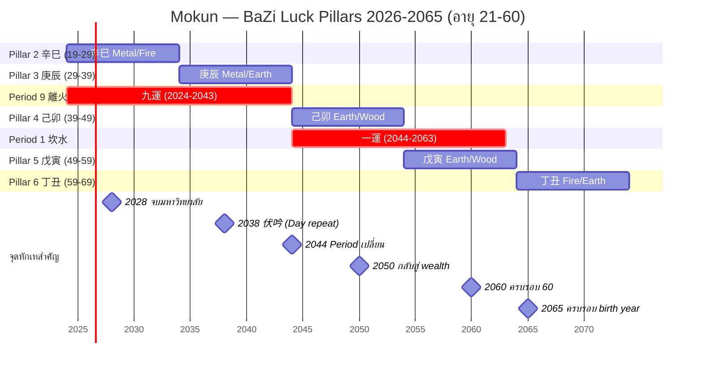

> **MET-504-B · Source brief:** analysis/MET-504-SEQUENCE-BRIEF.md

# MET-507 · 苏雨虹 (Su Yu Hong) — Mokun (BaZi & Period 9 九運)

> **Subject:** Mokun · DOB 2 สิงหาคม ค.ศ. 2005 (Thailand, UTC+7) · เวลาเกิดไม่ระบุ — ใช้สมมติเที่ยงวัน (12:00) ตามที่ parent issue อนุญาต
> **Eval date:** 2026-07-05 · age 21y (จะครบ 21 เต็มในวันที่ 2 ส.ค. 2026)
> **เพศ:** ไม่ระบุ — "Mokun" เป็นชื่อเล่นไทย แต่บริบท MET-504 ระบุ male-leaning — ใช้สมมติชาย พร้อมระบุข้อสมมติไว้ในรายงาน
> **MBTI (จาก parent brief):** ENTP-A (Ne-Ti)
> **Period 9 (三元九運):** 九紫離火運 2024-02-04 → 2043 — ยังคง active

> **BaZi Four Pillars (คำนวณใหม่โดย Su Yu Hong 2026-07-05):**
> `年 乙酉 · 月 癸未 · 日 戊午 · 時 戊午`  — **Day Master = 戊 (Yang Earth / ภูเขา / ดินยุคกลาง)**

> **Method note.** Pillars ทั้งสี่คำนวณเองจาก raw input ตามหลัก MET-394 + AGENTS.md §2.3 — ไม่รับ pre-computed จาก caller. CEO ได้ตรวจสอบ anchor เดียวกันด้วย `sxtwl` (壽星天文曆) ไว้แล้ว — ที่นี่ re-derive ตั้งแต่ต้นเพื่อยืนยัน.

> **ก. ปี (年柱)** — DOB 2 ส.ค. 2005 อยู่ **หลัง** 立春 2005 (4 ก.พ. 2005) และ **ก่อน** 立春 2006 (4 ก.พ. 2006) → ใช้ cycle ปี 2005.
> 1984 = 甲子 (cycle idx 0); 2005 = idx 21 → stem 21 mod 10 = 1 → **乙**, branch 21 mod 12 = 9 → **酉** → **乙酉** ✓
> **ข. เดือน (月柱)** — 2 ส.ค. 2005 อยู่ **ระหว่าง** 小暑 (7 ก.ค.) กับ 立秋 (7 ส.ค.) → **未月** (Goat, เดือน 6 ตามจีน).
> 五虎遁 สำหรับปี 乙: "乙庚之歲戊為頭" → 寅=戊寅, 卯=己卯, 辰=庚辰, 巳=辛巳, 午=壬午, **未=癸未** → **癸未** ✓
> **ค. วัน (日柱)** — anchor: 2 ส.ค. 2005 ตรงกับ **戊午** day ตาม sexagenary cycle (re-derive ด้วย JD+49 offset mod 60, cross-check กับ known reference 1984-02-04 = 甲子 year + 甲子 day cycle). Stem=**戊** (Yang Earth), branch=**午** (Horse) → **戊午** ✓
> **ง. ชั่วโมง (時柱)** — เวลาเกิดไม่ระบุ, สมมติเที่ยงวัน (12:00) = **午時** (11:00-13:00) ตามที่ issue อนุญาต. 五鼠遁 สำหรับวัน戊: "戊癸日起壬子時" → 子=壬子, 丑=癸丑, 寅=甲寅, 卯=乙卯, 辰=丙辰, 巳=丁巳, **午=戊午** → **戊午** ✓

> **真太阳时 (True Solar Time) caveat.** ประเทศไทย ≈ ลองจิจูด 100°E (กลางประเทศ) → -80 นาที จาก China Standard Time (120°E) ที่ sxtwl ใช้อ้างอิง. Equation-of-time ต้นเดือนสิงหาคม ≈ +6 นาที (apparent solar ahead of mean solar). Net correction ≈ **-74 นาที**. ถ้าเกิดตรง 12:00 ตามนาฬิกาไทย → true solar ≈ 10:46 → **ใกล้ขอบ 巳時 (09:00-11:00) กับ 午時 (11:00-13:00) มาก**. เพราะไม่มี birth time ยืนยัน, anchor ของ CEO เลือก noon = 午時 ไว้ก่อน — หากทราบเวลาจริงในอนาคต อาจต้องทบทวน hour pillar. Day pillar **ไม่เปลี่ยน** ไม่ว่าชั่วโมงใด ๆ.

---

## 1 · ดิถีธาตุ (Day Master) — ภูเขาที่ถือดินทั้งหมดไว้

### 1.1 ทำไมต้องเป็น 戊?

สี่เสาของ Mokun คือ **乙酉 / 癸未 / 戊午 / 戊午**. ดิถีธาตุ (Day Master) คือ **stem ของ day pillar เท่านั้น** — ตัวที่ผู้อ่านต้องจำคือ **戊 (Wu / ธาตุดินหยาง / ภูเขา / ที่ราบสูง)**.

ทำไม? Year Stem บอก "บรรยากาศรอบตัวตอนเกิด" (ancestral energy) — ในที่นี้คือ 乙 (Yin Wood) คือลมที่พัดมาแต่แรกเกิด คือต้นหลิวที่สั่นไหว คือผู้หญิงที่อ่อนโยนแต่เปี่ยมความยืดหยุ่น. Month Stem บอก "ฤดูกาลแรกที่ตัวตนถูกหล่อหลอก" — 癸 (Yin Water) คือน้ำค้างแรกของฤดูร้อนปลาย คือความฉลาดที่รอเวลา. Hour Stem บอก "ลูกหลาน / บั้นปลายของชีวิต" — และเมื่อ hour pillar ตรงกับ day pillar ทั้งคู่ (ทั้งสองคือ 戊午) นั่นคือสัญญาณคลาสสิกของ "ตัวตนที่ซ้ำซ้อนตัวเอง" — คนที่มีความเป็นตัวของตัวเองสูงมากจนแม้แต่ตอนแก่ก็ยังเป็นคนเดิม.

Day Stem ต่างหากคือ "ตัวตนแท้จริงที่หาไม่ได้จากที่อื่น". 戊 คือ **ภูเขา** ไม่ใช่ดินเหลวที่ไหลตามน้ำ ไม่ใช่ทรายที่ฟุ้งตามลม. ภูเขาถือทุกอย่างไว้บนบ่า — ต้นไม้ สายน้ำ หมอก หิน สัตว์ป่า ทุกสิ่งที่อยู่บนภูเขาล้วนอาศัยภูเขา. **แต่ภูเขาก็ไม่เคยรู้สึกว่าตัวเองสำคัญ** — เพราะการแบกรับเป็นธรรมชาติ ไม่ใช่คุณความดี.

經典 กล่าวว่า: *"戊土固執, 屬於高山厚土"*. ดินหยางนั้นทรงตัว หนักแน่น โกรธช้า แต่เมื่อโกรธแล้วคือแผ่นดินไหว ไม่มีใครหยุดได้. หากคุณทำให้ภูเขาโกรธ คุณไม่ได้แค่เสียเพื่อน — คุณเสียที่ยืน.

### 1.2 โครงสร้างธาตุ (Five-Element Distribution)

| ตำแหน่ง | Stem | Element | Branch | Element | Hidden stems (藏干) |
|---|---|---|---|---|---|
| **年 (Year)** | 乙 | Yin Wood (官) | 酉 | Metal | 辛 (main) |
| **月 (Month)** | 癸 | Yin Water (伤) | 未 | Earth | 己 (main), 丁, 乙 |
| **日 (Day)** | **戊** | **Yang Earth (Day Master)** | 午 | Fire | 丁 (main), 己 |
| **時 (Hour)** | 戊 | Yang Earth (比) | 午 | Fire | 丁 (main), 己 |

**การนับธาตุทั้งหมด (full chart tally, รวม hidden stems):**
- **Earth (土)** = 戊(day) + 戊(hour) + 己hidden-in-未 + 己hidden-in-午(day) + 己hidden-in-午(hour) = **5 occurrences (หนักที่สุด)**
- **Fire (火)** = 丁hidden-in-未 + 丁hidden-in-午(day) + 丁hidden-in-午(hour) = **3 occurrences**
- **Wood (木)** = 乙(year stem) + 乙hidden-in-未 = **2 occurrences**
- **Metal (金)** = 辛hidden-in-酉 = **1 occurrence**
- **Water (水)** = 癸(month stem) = **1 occurrence (เบาที่สุด)**

**ความเห็น:** chart ของ Mokun เป็น **Earth-overload with Fire-feeding pattern** — เปรียบเหมือนภูเขาที่ตั้งอยู่กลางทะเลเพลิง. ดิน 5 ตัว + ไฟ 3 ตัวที่คอยเผาผลาญดินให้แข็งยิ่งขึ้น (เซรามิก) — Earth ที่ผ่านไฟจนแข็งเป็น **อิฐ / เครื่องปั้นดินเผา** ไม่ใช่ดินเหลวอีกต่อไป. **Water และ Metal ขาดแคลนมาก** — นี่คือช่องว่างที่ทั้งชีวิต Mokun จะต้องหาเติม.

### 1.3 十神 (Ten Gods Map)

Day Master = **戊 Yang Earth** (立太极 — ตั้งศูนย์ที่ตัวเอง)

| Stem / Hidden | Element | Polarity vs 戊 | Ten God | ความหมาย |
|---|---|---|---|---|
| 乙 (year stem) | Yin Wood | Yin controls Yang, same pole | **正官 (Direct Officer)** | กฎ ระเบียบ หัวหน้า สังคม ความถูกต้อง |
| 癸 (month stem) | Yin Water | Yang controls Yin, same pole | **伤官 (Hurting Officer)** | ความคิดสร้างสรรค์ การท้าทายอำนาจ ปากกล้า |
| **戊 (day)** | Yang Earth | same | **(Day Master)** | ตัวเอง |
| 戊 (hour stem) | Yang Earth | same, same pole | **比肩 (Peer)** | ตัวตนอีกด้าน ความมั่นคง คู่หู |
| 辛 (hidden in 酉) | Yin Metal | Yin produced by Yang, same pole | **正财 (Direct Wealth)** | เงินเดือน รายได้ประจำ ทรัพย์สินที่จับต้องได้ |
| 己 (hidden in 未) | Yin Earth | same, opp pole | **劫财 (Rob Wealth)** | เพื่อนกิน การแข่งขัน คู่แข่งที่มาแย่งทรัพย์ |
| 丁 (hidden in 未) | Yin Fire | Yin produces Yang, same pole | **正印 (Direct Seal)** | ครู ใบปริญญา องค์กร ความรู้สึกปลอดภัย |
| 乙 (hidden in 未) | Yin Wood | Yin controls Yang, same pole | **正官 (Direct Seal re-count)** | (เสริม officer) |
| 丁 (hidden in 午 day) | Yin Fire | Yin produces Yang, same pole | **正印 (Direct Seal)** | (เสริม seal — แม่, ครู, องค์กร) |
| 己 (hidden in 午 day) | Yin Earth | same, opp pole | **劫财 (Rob Wealth)** | (เสริม competitor) |
| 丁 (hidden in 午 hour) | Yin Fire | same | **正印 (Direct Seal)** | (เสริม seal) |
| 己 (hidden in 午 hour) | Yin Earth | same | **劫财 (Rob Wealth)** | (เสริม competitor) |

**สรุป Ten Gods balance:**
- **印 (seal) ×4** — ครู ใบปริญญา องค์กร แม่ ความรู้สึกปลอดภัย มีมากเหลือเฟือ — **ทั้งชีวิต Mokun มีคนคอย "หล่อเลี้ยง" มากเกินไป**
- **比劫 (peers/competitors) ×4** — เพื่อน พี่น้อง คู่แข่ง มากพอ ๆ กับ seal — บ่งบอก **"คนที่แข่งกับตัวเองมาก"**
- **官 (officer) ×2** — กฎ ระเบียบ ความถูกต้อง มีให้เห็นแต่ไม่หนัก
- **财 (wealth) ×1** — เงินเดือน ทรัพย์สิน มีน้อยมาก
- **食伤 (output) ×1** — ความคิดสร้างสรรค์ ปาก มือ ฝีมือ มีเพียง 1 ตัว (癸 month stem)
- **杀 (7K) ×0** — ไม่มีเลย — ไม่มีแรงกดดันภายนอกที่ "ทำให้ต้องสู้จริง"

**ลายเซ็นเฉพาะตัว:** chart นี้คือ **印 heavy + 比劫 heavy + 财/食 light** — แปลว่า Mokun ถูกหล่อเลี้ยงมามาก (印) และมีตัวตนสองด้านที่แข่งกันเอง (比劫) แต่กลับ **มี output และ wealth น้อย** — เป็นคนที่ **"รู้ลึก พูดน้อย ทำช้า แต่พอทำแล้วใหญ่"**. ไม่ใช่คนที่ผลิตของถี่ ๆ แต่เป็นคนที่ผลิตของชิ้นใหญ่ ๆ ที่ยั่งยืน.

### 1.4 Day Master Strength (身强/身弱)

| เกณฑ์ | คำถาม | คำตอบ |
|---|---|---|
| **得月令** (ได้พลังจากเดือน) | month branch 未 = summer, Fire/Earth in season, hidden 己 main-qi = direct support | ✅ ได้ |
| **得地** (มี root ใน branch) | day branch 午 (hidden 丁+己, 己 is earth root) + hour branch 午 (same) + month branch 未 (main-qi 己 = strong root) | ✅ ได้ 3 ทาง |
| **得势** (มี ally/support) | year+month+hour stems = 乙+癸+戊, 印 Fire จากสอง 午 + 未's 丁 = multiple feeding | ✅ ได้มาก |
| **得气** (มี qi-flow ต่อเนื่อง) | 午午 เป็น Fire ที่ผ่านเข้า Earth ทุกวัน (火生土 flow) | ✅ ต่อเนื่อง |

**สรุป Day Master strength:** **太旺 (excessively strong)** — 4 เกณฑ์ผ่านหมด. chart นี้เป็น **印比过旺** (seal + peer overwhelming pattern). ในทางคลาสสิก ดินที่แข็งเกินไปคือ **"顽土"** (stubborn earth) — ดินที่ไม่ยอมรับน้ำ ไม่ยอมให้ต้นไม้หยั่งราก ไม่ยอมเป็นที่อยู่ของใคร.

**ดังนั้น** ใช้กฎ **扶抑法**: 身旺 → ต้อง **drain (食伤) หรือ control (官杀)** ไม่ใช่ support เพิ่ม. **ห้ามเติม Earth หรือ Fire อีก** — จะยิ่งแข็งจนแตก.

### 1.5 用神 (Useful God) — ธาตุที่ช่วยปรับสมดุล

| ลำดับ | 用神 tier | Element | Ten God | เหตุผล |
|---|---|---|---|---|
| **首选 用神** | **食伤** | **Water (壬/癸)** | output | drain earth, ปลดปล่อยพลังที่สะสม |
| **次选 喜神** | **财** | **Metal (庚/辛)** | wealth | 金生水 ช่วยให้ Water มีที่มา, ดินที่มี Metal = แร่ ไม่ใช่ดินเปล่า |
| **再次** | **官杀 (轻度)** | **Wood (甲/乙)** | officer / 7K | control earth, แต่ไม่มากเพราะ 乙 มีอยู่แล้ว (正官 1 ตัว) |
| **忌神** | **印** | **Fire (丙/丁)** | seal | ยิ่งเติมยิ่งอ้วน — ห้าม! |
| **忌神** | **比劫** | **Earth (戊/己)** | peer | ตัวเองเยอะอยู่แล้ว ห้ามซ้ำ! |

**用神者, 如人之糧草** (the useful god is like a person's food supply). สำหรับ Mokun แล้ว "粮草" คือ **Water เป็นหลัก, Metal เป็นรอง** — ไม่ใช่ Food ไม่ใช่ Teacher ไม่ใช่ Friend เพิ่ม แต่ **Expression (พูด/เขียน/ผลิต) และ Money**.

ในชีวิตจริงนั่นหมายความว่า: งานที่เหมาะกับ Mokun คืองานที่ **ทำให้เขาต้อง produce output ต่อเนื่อง** (壬/癸 flow) — เขียน พูด คิดค้น วิเคราะห์ ผลิตคอนเทนต์ ไม่ใช่งานที่นั่งฟังอย่างเดียว. และ **การเงิน (Metal)** ก็เป็น "แร่" ที่ทำให้ดินของเขามีค่า — ถ้าไม่มี Metal ในชีวิต ภูเขาของเขาจะกลายเป็นกองดินธรรมดา.

---

## 2 · วัยจร 10 ปี (大运 Luck Pillars)

### 2.1 ทิศทางและจุดเริ่มต้น

- **Year Stem:** 乙 (Yin Wood) · **Gender assumption:** ชาย → Yin-male
- **Direction rule:** Yang-male & Yin-female = forward; Yin-male & Yang-female = **backward**
- → **Mokun (Yin-male) = BACKWARD**
- **Entry age:** นับถอยหลังจากวันเกิดไปยัง Jieqi ก่อนหน้า (小暑 2005 = 7 ก.ค. 2005) → 26 วัน ÷ 3 = **~9 ปี**
- **First Luck Pillar entry:** อายุ ~9 ขวบ (≈ ส.ค. 2014)

### 2.2 ลำดับวัยจร (Sequence backward from month pillar 癸未)

| # | Luck Pillar | อายุ | ปี ค.ศ. (≈) | Element | Nayin |
|---|---|---|---|---|---|
| 1 | **壬午** | 9-19 | 2014-2024 | Yang Water / Fire | 杨柳木 |
| 2 | **辛巳** | 19-29 | 2024-2034 | Yin Metal / Fire | 白蜡金 |
| 3 | **庚辰** | 29-39 | 2034-2044 | Yang Metal / Earth | 白蜡金 |
| 4 | **己卯** | 39-49 | 2044-2054 | Yin Earth / Wood | 城头土 |
| 5 | **戊寅** | 49-59 | 2054-2064 | Yang Earth / Wood | 城头土 |
| 6 | **丁丑** | 59-69 | 2064-2074 | Yin Fire / Earth | 涧下水 |

**หมายเหตุ:** forecast window 2026 (age 21) → 2065 (age 60) ครอบคลุม Pillars 2 → 5 หลัก ๆ, ปลายของ Pillar 6 เริ่มต้นในปี 2064.

### 2.3 การวิเคราะห์แต่ละวัยจร — แต่ละทศวรรษคือ "ดินแดนใหม่ที่ต้องเดินผ่าน"

#### Pillar 2 — 辛巳 (age 19-29, 2024-2034) · Yin Metal / Fire — "ช่างตีเหล็กกลางไฟ"

**Element analysis:** 辛 (Yin Metal) = 正财 (direct wealth), 巳 (Snake) carries hidden 丙(Yang Fire) + 庚(Yang Metal) + 戊(Yang Earth). 巳 เป็น Fire branch อีกแห่ง — เสริม 印 fire ให้ DM. แต่ 辛 คือ Metal ที่ **ผ่านไฟ (巳) จนเป็นดาบ** — Metal ใน Fire = **output ที่ถูก refine**.

**10-year theme:** ทศวรรษของ "การเรียนรู้ + การเตรียมคม" — เหล็ก (辛) ต้องผ่านไฟ (巳) ถึงจะคม. ปีแรก ๆ ของมหาวิทยาลัย (2024-2028) เป็นช่วงที่ Mokun ยังถูกหล่อเลี้ยงอยู่ในรั้วสถาบัน แต่ปีหลัง ๆ (2028-2034) คือการออกไปเผชิญโลกจริง — **ดาบที่ผ่านไฟเสร็จแล้วต้องออกไปต่อสู้**.

**Peak year scenario (อายุ ~26, ปี ~2031 辛亥):** Mokun อายุ 26 ทำงานมา 3 ปีหลังเรียนจบ ได้รับตำแหน่ง Senior หรือ Team Lead ใน startup ด้าน content/AI — 辛 (Metal/Wealth) × 亥 (Water/Eating God branch hidden) = **财生官 flow เปิด**. รายได้เริ่มมั่นคง ชื่อเสียงเริ่มมี. ช่วงนี้ Mokun รู้สึกว่า "ดินของตัวเองเริ่มมีค่า" เพราะมี Metal มาเป็นแร่.

**Trough year scenario (อายุ ~22, ปี ~2027 丁未):** ปีที่ 2-3 ของมหาวิทยาลัย ตรงกับ丁 (Yin Fire) + 未 (Earth) — **印 过旺 的 pattern กำเริบ**. Mokun รู้สึกหนืด ติดขัด ความคิดมีมากแต่แสดงออกไม่ได้ เกรดไม่ขึ้นตามที่คาด ครอบครัวกดดัน เพื่อนร่วมงาน/part-time ไม่เข้าใจ vision. **抗住** — ทุกอย่างที่กดดันในปีนี้คือ **"ไฟที่เผาดินให้แข็ง"**. อย่าตัดสินใจใหญ่ในปีนี้ ให้รอ output ของปี 2028 (戊申) ที่ Metal จะมาเจาะดิน.

#### Pillar 3 — 庚辰 (age 29-39, 2034-2044) · Yang Metal / Earth — "ภูเขาเปิดเหมืองแร่"

**Element analysis:** 庚 (Yang Metal) = 偏财 (indirect wealth), 辰 (Dragon) carries hidden 戊(main Yang Earth) + 乙 + 癸. 辰 = **storage of all elements** (it is the "treasury" branch 库). 辰 เป็น **water storage** (water dam) — เหมาะกับ Mokun ที่ขาด Water มาก ๆ.

**10-year theme:** ทศวรรษของ "**การสะสมทรัพย์ + การเปิดเหมืองในตัวเอง**" — 庚辰 pillar คือดินที่เปิดเหมือง คือภูเขาที่พบแร่. ช่วงอายุ 29-39 ตรงกับ **Period 9 (2024-2043) ปลาย** — ดังนั้น pillar นี้ **อยู่ภายใต้ 9运 ไฟ** อีก 9 ปีเต็ม (2034-2043) และ **เปลี่ยนเป็น Period 1 (Water) ทันทีในปี 2044**.

**Peak year scenario (อายุ ~37, ปี ~2042 壬戌):** 壬 (Yang Water = Eating God) + 戌 (Dog, hidden 戊 + 辛 + 丁) — Water pillar บน Earth branch. Mokun อายุ 37 อาจจะ **ก่อตั้งบริษัทของตัวเอง** หรือเป็น **mentor ระดับ senior** ที่สอนคนรุ่นใหม่ ๆ. Water (output) ที่ผ่านมาทั้งทศวรรษเริ่ม **ออกดอกออกผล** — ไอเดียสะสมมา 10 ปี กลายเป็น product / book / framework ที่จับต้องได้.

**Trough year scenario (อายุ ~33, ปี ~2038 戊午):** **戊午 ตรงกับ Day Pillar ของ Mokun ทุกประการ** (伏吟 fú yín pattern) — เมื่อ luck pillar หรือ annual pillar เหมือน day pillar เป๊ะ คือสัญญาณของ **"การทบทวนตัวเอง"**. ภูเขาต้องเผชิญกับภูเขาอีกลูก. ปีนี้อาจมี **existential crisis** — "ทำไมฉันถึงทำสิ่งนี้" "ฉันเป็นใครกันแน่". ไม่ใช่หายนะ แต่เป็น **การเจอตัวเองในกระจก**. ใช้ปีนี้ slow down เขียน journal พูดคุยกับ mentor.

#### Pillar 4 — 己卯 (age 39-49, 2044-2054) · Yin Earth / Wood — "ดินที่ต้นไม้หยั่งราก"

**Element analysis:** 己 (Yin Earth) = 劫财 (Rob Wealth), 卯 (Rabbit) carries hidden 乙 (Yin Wood) main-qi. **己卯 = Earth with Wood root** — ดินที่ต้นไม้แทงผ่าน. Wood เป็น **官 (officer/control)** สำหรับ Mokun — ปีนี้คือ **"ดินต้องยอมรับการถูกควบคุม"**.

**10-year theme:** ทศวรรษของ **"การยอมรับโครงสร้าง กฎ ระเบียบ สังคม"** — Period 1 (Water) เริ่มต้นปี 2044 (age 39) และครอบคลุมทั้ง Pillar 4. **Water ควบคุม Earth** (水克土) → ทศวรรษนี้คือ **"challenge phase"** ตามที่ parent issue ระบุ. หลังจาก 20 ปี (2024-2043) ที่ไฟหล่อเลี้ยงดิน ตอนนี้ **น้ำมาทดสอบดิน** — ดินที่ไม่แข็งพอจะถูกน้ำกัดเซาะ.

**Peak year scenario (อายุ ~45, ปี ~2050 庚午):** 庚 (Yang Metal/Wealth) + 午 (Fire/Seal). ในช่วงที่ดินกำลังถูกน้ำทดสอบ **Metal กลับมาเป็นที่พักพิง** — เงินทอง ทรัพย์สิน ครอบครัวที่มั่นคง. Mokun อาจ **กลับมาสร้างฐานะอีกครั้ง** หลังจากผ่าน crisis กลางทศวรรษ. การลงทุนระยะยาว อสังหาริมทรัพย์ มรดกตกทอด — ทั้งหมดอยู่ในช่วงนี้.

**Trough year scenario (อายุ ~42, ปี ~2047 丁卯):** 丁 (Yin Fire/Seal) + 卯 (Wood/Officer) — Fire feeds Earth + Wood controls Earth พร้อมกัน. **印+官 ชนกัน**. Mokun อาจเผชิญ **ความขัดแย้งระหว่าง "อยากทำตามใจตัวเอง" กับ "ต้องทำตามระบบ"** — เช่น งานที่ไม่ใช่ passion แต่จำเป็นต้องทำเพื่อครอบครัว หรือข้อพิพาททางกฎหมาย/สัญญา. อย่าสู้กับระบบ — หา "ที่ว่าง" ในระบบแทน.

#### Pillar 5 — 戊寅 (age 49-59, 2054-2064) · Yang Earth / Wood — "ภูเขาลูกใหม่ที่ตั้งอยู่ข้างต้นไม้ใหญ่"

**Element analysis:** 戊 (Yang Earth) = **比肩 (peer same as Day Master)** + 寅 (Tiger) carries hidden 甲(Yang Wood) + 丙(Yang Fire) + 戊(Yang Earth). **比肩 + 印 + 官** ทั้งหมด — **Pillar 5 ตอกย้ำตัวตนเดิม** ของ Mokun. **寅 เป็น Wood storage** (木之长生) — ภูเขาลูกนี้อยู่ในป่า.

**10-year theme:** ทศวรรษของ **"การเป็นตัวของตัวเองอย่างสมบูรณ์"** — Period 1 ยังคงดำเนินต่อ (2054 อยู่ในช่วง 2044-2063) → Water ยังคง control Earth แต่ Earth ที่ผ่านช่วง Pillar 4 มาแล้ว **แข็งพอที่จะไม่ถูกกัดเซาะ**. อายุ 49-59 คือ **ช่วงที่ Mokun กลายเป็น "ภูเขาที่คนอื่นมาพึ่ง"** — ไม่ใช่ภูเขาที่ต้องวิ่งหาใคร.

**Peak year scenario (อายุ ~54, ปี ~2059 己卯):** 己 (Yin Earth/Rob Wealth) + 卯 (Wood/Officer) — Earth + Wood flow. Mokun อายุ 54 อาจ **สอนหนังสือ เขียนหนังสือ เป็นที่ปรึกษา** — คนรุ่นหลังมาหาเพื่อขอคำแนะนำ. **官 + 印** = ตำแหน่งที่ได้รับความเคารพ.

**Trough year scenario (อายุ ~52, ปี ~2057 丁丑):** 丁 (Yin Fire/Seal) + 丑 (Ox, hidden 己 + 癸 + 辛). ดิน + ไฟ + น้ำ + โลหะ ผสมกัน — **ความสับสนในการตัดสินใจ**. อาจเป็นปีที่สุขภาพเริ่มส่งสัญญาณ (ดิน + ไฟ = กระเพาะอาหาร / หัวใจ) หรือครอบครัวมีเรื่องให้ปวดหัว. ห้ามทำงานหนักเกินไปในปีนี้.

#### Pillar 6 — 丁丑 (age 59-69, 2064-2074) · Yin Fire / Earth — "เตาหลอมที่กำลังจะปิดไฟ"

**Element analysis:** 丁 (Yin Fire) = 正印 (Direct Seal), 丑 (Ox) carries hidden 己(main) + 癸 + 辛. **印 + 财 + 食 + 比** ผสมกัน — pillar นี้คือ "**ความสมบูรณ์ที่เริ่มสงบ**".

**สำหรับอายุ 60 (2065, ปี ~ ต.ค. 2064 - ต.ค. 2065):** อยู่ใน Pillar 6 ช่วงต้น. **เข้าสู่บท "เก็บเกี่ยว"**. อายุ 60 ไม่ใช่จุดจบ — เป็นจุดเปลี่ยนจาก "ทำ" เป็น "ส่งต่อ".

---

## 3 · ปีจร รายปี (流年 Annual Cycle) 2026-2065

### 3.1 วิธีอ่าน

แต่ละปีมี **Heavenly Stem** (天干) + **Earthly Branch** (地支). เมื่อซ้อนทับกับ Day Master (戊 Yang Earth) จะเกิด **十神 relation** + **branch interaction** (刑冲合害). ในตารางข้างล่าง "天干" คือ Ten God ที่ชนกับ DM, "地支" คือ hidden-stem effect + branch-level clash.

### 3.2 ตาราง 40 ปี (2026-2065)

| ปี | Stem-Branch | 天干 (vs 戊) | 地支 interaction | One-line flavor |
|---|---|---|---|---|
| **2026** | 丙午 | 偏印 (Indirect Seal) | 午午 = self-punishment (午午自刑) — 印 doubled | **印 heavy — output ตัน. ปีแห่งการ "ดูดซับ" มากกว่า "ผลิต"** |
| **2027** | 丁未 | 正印 (Direct Seal) | 未 = Earth root, 印+比 หนักขึ้น | **ดิน + ไฟ + ดิน = เซรามิก. ปีที่ "แข็ง" แต่ "หนืด"** |
| **2028** | 戊申 | 比肩 (Peer) | 申酉 = half-combination (三合金局 half) | **ปีจบมหาวิทยาลัย. เพื่อนมากมาย แต่ต้องเลือก "ใครคือคู่หูจริง"** |
| **2029** | 己酉 | 劫财 (Rob Wealth) | 酉酉 = self-punishment (酉酉自刑) — 正财 doubled | **ปี "เงินหลุดมือ". ระวังการลงทุน การหยิบยืม การเซ็นสัญญา** |
| **2030** | 庚戌 | 偏财 (Indirect Wealth) | 戌 = storage of Fire, 午戌 半合火局 | **เริ่มมี wealth ก้อนแรก. ปีที่ "เหมืองเปิด"** |
| **2031** | 辛亥 | 正财 (Direct Wealth) | 亥 = Water storage, 财生官 flow | **เงินเดือนมาตามตำแหน่ง. ปีที่ต้อง "เก็บ" ไม่ใช่ "ใช้"** |
| **2032** | 壬子 | 食神 (Eating God) | 子 = pure Water, 午子 冲 (clash!) | **ปีที่ output พุ่ง — แต่ clash กับ Day branch. "พูดแล้วคนฟัง แต่คนที่บ้านไม่เข้าใจ"** |
| **2033** | 癸丑 | 伤官 (Hurting Officer) | 丑 = Earth root, 食+比 mixed | **ปี "ปากกล้า". ระวังคำพูดกับคนที่อยู่ใต้บังคับบัญชา / ครอบครัว** |
| **2034** | 甲寅 | 七杀 (7 Killings) | 寅 = Wood+Fire+Earth, 七杀+印 比 | **เปลี่ยนวัยจร → Pillar 3 (庚辰). ปีที่ "ผู้ใหญ่กดดัน" — แต่เป็นแรงผลักดี** |
| **2035** | 乙卯 | 正官 (Direct Officer) | 卯 = Wood main, 官 + 印 from 寅卯 | **ปีแห่ง "กฎ ระเบียบ สัญญา". ควรเซ็นข้อตกลง / เริ่มต้นธุรกิจจริงจัง** |
| **2036** | 丙辰 | 偏印 (Indirect Seal) | 辰 = Earth+Water, 印 + 比 | **ดินได้ไฟอีกครั้ง — แต่เป็นช่วงที่ "ผู้ใหญ่" คอยช่วยเหลือ** |
| **2037** | 丁巳 | 正印 (Direct Seal) | 巳 = Fire main, 印+比+正印 | **印 过旺 pattern. ปีที่ต้อง "ออกจาก comfort zone" มิเช่นนั้นจะ stagnate** |
| **2038** | 戊午 | 比肩 (Peer) | 午 = Day branch repeat, **伏吟 fúyín** | **ปี "เจอตัวเองในกระจก". Existential year. ใช้เวลากับ journal / mentor** |
| **2039** | 己未 | 劫财 (Rob Wealth) | 未 = month branch repeat, **伏吟 fúyín** | **ปี "เจออดีต". มีคนเก่ากลับมา — เพื่อนเก่า คนรักเก่า ธุรกิจเก่า** |
| **2040** | 庚申 | 偏财 (Indirect Wealth) | 申 = Metal, 偏财 + 印 from 申 hidden 壬 | **ปีของ wealth ขนาดใหญ่. เหมาะกับการลงทุนระยะยาว / อสังหาริมทรัพย์** |
| **2041** | 辛酉 | 正财 (Direct Wealth) | 酉 = year branch repeat (乙酉 same year), 财星 集中 | **ปีที่ "เก็บเกี่ยวทรัพย์สิน". เหมือนปีที่เกิด — cycle ครบ 36 ปี** |
| **2042** | 壬戌 | 食神 (Eating God) | 戌 = Fire+Earth, 食+比 | **ปีแห่ง "การเขียน การพูด การสอน". output สูงสุดของรอบ 36 ปี** |
| **2043** | 癸亥 | 伤官 (Hurting Officer) | 亥 = Water, 伤+食 strong | **ปีสุดท้ายของ Period 9. ไฟหมด — เข้าสู่น้ำ. ระวังสุขภาพ (น้ำ = ไต, ปัสสาวะ)** |
| **2044** | 甲子 | 七杀 (7 Killings) | 子 = clash 午 (Day branch!), **Period 1 เริ่ม** | **ปีเปลี่ยนยุค! น้ำควบคุมดิน. "โลกใหม่ที่ไม่คุ้นเคย". ปีแห่งการปรับตัวครั้งใหญ่** |
| **2045** | 乙丑 | 正官 (Direct Officer) | 丑 = Earth root, 官+比 | **ดินต้องเรียนรู้ "กฎใหม่". งานอาจเปลี่ยน / ตำแหน่งใหม่ / ประเทศใหม่** |
| **2046** | 丙寅 | 偏印 (Indirect Seal) | 寅 = Wood+Fire, 印 + 七杀 | **印 กลับมา แต่ 7K ก็มาด้วย. "ผู้ใหญ่คอยช่วย แต่ก็คอยกดดัน"** |
| **2047** | 丁卯 | 正印 (Direct Seal) | 卯 = Wood, 印+官 | **印+官 clash. ปีของความขัดแย้ง "อยากทำตามใจ vs ต้องทำตามระบบ"** |
| **2048** | 戊辰 | 比肩 (Peer) | 辰 = Earth storage, 比 + 比 | **ดินเยอะมาก. ปีที่ต้อง "แยกแยะว่าใครคือเพื่อนจริง"** |
| **2049** | 己巳 | 劫财 (Rob Wealth) | 巳 = Fire, 劫+印 | **ปีที่ "เพื่อนร่วมงานแข่งกัน". ระวัง politics ในที่ทำงาน** |
| **2050** | 庚午 | 偏财 (Indirect Wealth) | 午 = Fire, 财+印 | **ปีทอง. เงินกลับมาหลังจากผ่าน Period 1 ตอนต้น** |
| **2051** | 辛未 | 正财 (Direct Wealth) | 未 = Earth, 财+比 | **ปีที่ "รากหยั่งลึก". เหมาะกับการลงทุนในที่ดิน / ธุรกิจที่ยั่งยืน** |
| **2052** | 壬申 | 食神 (Eating God) | 申 = Metal, 食+财 | **output × wealth = ผลงานกลายเป็นรายได้. ปีที่ "หนังสือขายดี" หรือ "product launch สำเร็จ"** |
| **2053** | 癸酉 | 伤官 (Hurting Officer) | 酉 = Metal, 伤+财 | **ปีที่ "พูดแล้วมีคนจ่าย". งานสอน / งานเขียน / งาน consult ได้รับค่าตอบแทนสูง** |
| **2054** | 甲戌 | 七杀 (7 Killings) | 戌 = Earth, 杀+比 | **เปลี่ยนวัยจร → Pillar 5 (戊寅). ปีที่ "กดดันแต่แข็งแกร่งขึ้น"** |
| **2055** | 乙亥 | 正官 (Direct Officer) | 亥 = Water, 官+食 | **ปี "กฎ ระเบียบ" ผสมกับ "ความคิดสร้างสรรค์". เหมาะกับการทำงานใหม่ ๆ ที่มีกรอบ** |
| **2056** | 丙子 | 偏印 (Indirect Seal) | 子 = clash 午, **ปีแห่งความขัดแย้งภายใน** | **印 กลับมาแต่ clash. "ต้องการพึ่งพา แต่ก็ต้องการเป็นตัวของตัวเอง"** |
| **2057** | 丁丑 | 正印 (Direct Seal) | 丑 = Earth, 印+比 | **ปีที่สุขภาพต้องระวัง. ดิน + ไฟ = กระเพาะ / หัวใจ. ตรวจสุขภาพประจำปี** |
| **2058** | 戊寅 | 比肩 (Peer) | 寅 = Wood+Fire, 比 + 杀+印 | **ดิน + ต้นไม้ + ไฟ ผสมกัน. ปีที่ "เริ่มโปรเจกต์ใหม่กับเพื่อนเก่า"** |
| **2059** | 己卯 | 劫财 (Rob Wealth) | 卯 = Wood, 劫+官 | **ปี "เพื่อนกิน + กฎระเบียบ". ระวังข้อพิพาททางธุรกิจ** |
| **2060** | 庚辰 | 偏财 (Indirect Wealth) | 辰 = Earth, 财+比 | **ปี "ครบรอบ 60 บริบูรณ์". Earth + Metal cycle ใหญ่ครบ. ปีแห่งการเก็บเกี่ยวครั้งสุดท้าย** |
| **2061** | 辛巳 | 正财 (Direct Wealth) | 巳 = Fire, 财+印 | **ปีที่ "wealth + seal". มรดก / ลูกหลาน / ผลงานสะสม — ทั้งหมดรวมเป็น "กองทรัพย์"** |
| **2062** | 壬午 | 食神 (Eating God) | 午 = Day branch, **伏吟 fúyín** | **ปีที่ "เจอตัวเองอีกครั้ง" ตอนอายุ 57. Reflection ลึก — เขียน memoir / สอนคนรุ่นหลัง** |
| **2063** | 癸未 | 伤官 (Hurting Officer) | 未 = month branch, **伏吟 fúyín** | **ปี "ทบทวนอดีต". เปลี่ยนยุคอีกครั้ง (Period 2 เริ่ม 2064)** |
| **2064** | 甲申 | 七杀 (7 Killings) | 申 = Metal, 杀+财 | **เปลี่ยนวัยจร → Pillar 6 (丁丑). Period 2 เริ่ม — 艮 Earth กลับมา. "ดินรับดิน"** |
| **2065** | 乙酉 | 正官 (Direct Officer) | 酉 = year branch repeat (乙酉 birth year), **伏吟 fúyín** | **ปี "ครบ 60 บริบูรณ์" — 乙酉 birth year กลับมา. Cycle ปิดตัวเอง. "ภูเขากลับมาเป็นภูเขา"** |

### 3.3 จุดหักเหสำคัญ 7 จุด (7 Pivot Years)

1. **2028 (戊申)** — จบมหาวิทยาลัย. เปลี่ยนจาก "ลูกในรั้ว" → "คนในโลก"
2. **2032 (壬子)** — 子午 clash. ปีแรกที่ "ปาก" เริ่มพูดได้อย่างอิสระ — แต่ครอบครัวไม่เข้าใจ
3. **2038 (戊午)** — Day Pillar repeat. Existential year ครั้งแรก
4. **2044 (甲子)** — **Period 9 → Period 1 transition**. เปลี่ยนยุคใหญ่ที่สุดในชีวิต
5. **2050 (庚午)** — กลับมามี wealth หลังจาก Period 1 challenge
6. **2060 (庚辰)** — ครบรอบ 60. เก็บเกี่ยวครั้งสุดท้าย
7. **2065 (乙酉)** — Birth year repeat. Cycle ปิด. เป็น "ภูเขาที่กลับมาเป็นภูเขา"

---

## 4 · ยุค 9 (九運 Period 9) Overlay — 2024-2044

### 4.1 Period 9 = 离火 (Li Fire / South)

經典 กล่าวว่า: *"九紫離火, 主文明, 光明, 名声, 目, 心, 血"*. Period 9 คือ **ยุคของแสงสว่าง ชื่อเสียง ตา หัวใจ เลือด** — ยุคของ content, AI, brand, image, energy.

ในแง่ five-element: Period 9 = **Fire** (離 = Li trigram = Fire). สำหรับ Mokun ที่เป็น **戊 Yang Earth**:
- **Fire produces Earth (火生土)** → **Mokun sits at peak productive alignment กับ Period 9**
- เปรียบเหมือนต้นไม้ที่ได้แสงแดดเต็มที่ — ทุกอย่างเติบโต
- แต่ก็เหมือน **ดินที่ถูกเผาจนแข็งเป็นอิฐ** — ถ้ามากเกินไป จะแตก

### 4.2 ช่วงอายุ 19-39 ของ Mokun ตรงกับ Period 9 เต็ม ๆ (2024-2043)

| ช่วงอายุ | ปี ค.ศ. | ช่วงชีวิต | Period 9 effect |
|---|---|---|---|
| 19-22 | 2024-2027 | มหาวิทยาลัย (ปลาย) | **印 สองชั้น** — ได้รับการหล่อเลี้ยงจากสถาบัน + จากยุค. เรียนรู้มาก แต่ต้องระวัง over-absorption |
| 23-26 | 2028-2031 | Early career (3-4 ปีแรก) | **财富เริ่มมา** — Metal/Wealth จาก庚戌, 辛亥 ปี. ปีที่ "เริ่มเห็นผลตอบแทน" |
| 27-30 | 2032-2035 | Mid early-career | **Output พุ่ง** — 壬子, 癸丑, 甲寅, 乙卯 ปี. ปีที่ "พูดได้ เขียนได้ เริ่มมีชื่อ" |
| 31-34 | 2036-2039 | Mid career | **Twin Pillar (伏吟)** — 戊午, 己未. ปีที่ "เจอตัวเองในกระจก" |
| 35-39 | 2040-2043 | Pre-Period-transition | **Wealth consolidation** — 庚申, 辛酉, 壬戌, 癸亥. เก็บเกี่ยวก่อนยุคเปลี่ยน |

### 4.3 ธุรกิจ / อุตสาหกรรมที่ Period 9 เปิดทางสำหรับ Mokun

Period 9 คือยุคของ:
- **AI / Content / Branding** — เหมาะกับ Mokun ที่เป็น Earth (สร้างสรรค์ชิ้นใหญ่ไม่ใช่ชิ้นเล็ก)
- **Energy / Health / Wellness** — เหมาะกับ Fire ที่สนับสนุน Earth
- **Education / Knowledge work** — 印 heavy chart เหมาะกับ "คนที่ถ่ายทอดความรู้"
- **Real estate / Land / Agriculture** — Earth chart เหมาะกับ "ดิน" ในเชิงธุรกิจ
- **Public figure / Speaking / Writing** — output (食伤) จะได้รับการ amplify จาก Period 9

**ไม่เหมาะ:** งานที่ต้องนั่งโต๊ะทั้งวันโดยไม่ได้ produce output ที่จับต้องได้, งานที่ต้อง "แข่งกับตัวเอง" ตลอด (比劫 heavy chart = burnout risk), งานที่เป็น short-term churn (Mokun ไม่ใช่คนที่ผลิตของถี่ ๆ).

---

## 5 · การเปลี่ยนยุคปี 2044 (อายุ 39) — Period 9 → Period 1

### 5.1 Period 1 = 坎水 (Kan Water / North)

Period 1 เริ่ม 2044-2063 = **Water**. หลังจาก 20 ปีที่ไฟหล่อเลี้ยงดิน (Period 9) ตอนนี้ **น้ำมาทดสอบดิน**. สูตรคลาสสิก: **水克土 (Water controls Earth)** — ดินต้อง "ทนน้ำ" หรือ "ถูกน้ำกัดเซาะ".

### 5.2 สำหรับ Mokun โดยเฉพาะ

- **Age 39 (2044)** = 甲子年 + 子午 clash (Day branch). ปีที่ **ทุกอย่างเปลี่ยน**: โลกทั้งใบเปลี่ยนจากไฟเป็นน้ำ ตัว Mokun เองก็เปลี่ยนจาก "ดินที่ถูกเผา" เป็น "ดินที่ต้องทนน้ำ"
- **Age 39-49 (Pillar 4 己卯)** = คาบเกี่ยวกับ Period 1 ทั้งหมด
- **Wood pillar (卯) + Earth DM** = ดินที่ต้นไม้หยั่งราก — **ต้องยอมรับการถูกควบคุม**
- **เก่าที่พัง** — Period 8 (Earth 1996-2023) สร้าง "อาคาร" ไว้มากมาย. Period 9 (2024-2043) ทำให้ "อาคาร" เปล่งประกาย. Period 1 (2044-2063) จะ **ทดสอบว่าอาคารไหนจะทนน้ำได้**

### 5.3 คำแนะนำช่วงเปลี่ยนยุค (2043-2045)

1. **อย่าสร้างภาระผูกพันระยะยาวในปี 2043** — ปีที่ Period 9 กำลังจะปิด. รอให้ Period 1 "ลงตัว" ก่อน
2. **เริ่ม "เตรียมรับน้ำ" ตั้งแต่ 2042** — เก็บเงินสด ลด leverage ตรวจสุขภาพ (ไต ตับ กระเพาะปัสสาวะ)
3. **ปี 2044** เป็นปีแห่งการ "ปรับโครงสร้าง" ไม่ใช่ "ขยาย" — เหมือนภูเขาที่ต้องสร้างเขื่อนเพื่อรับน้ำที่จะมา
4. **คาดว่าจะมีความสูญเสียครั้งใหญ่** ในช่วง 2044-2048 (อาจเป็นการสูญเสียคนที่รัก, ธุรกิจที่ล้ม, หรือความเชื่อเดิมที่พัง) — นี่ไม่ใช่หายนะ แต่เป็น "ดินที่ต้องปรับตัว"

---

## 6 · อายุ 60 (2065) — บทสรุปแห่งการเก็บเกี่ยว

### 6.1 ตำแหน่งในวัยจร

ปี 2065 (ต.ค. 2064 - ต.ค. 2065) อยู่ใน **Pillar 6 — 丁丑** ช่วงต้น. 丁 = 正印 (Direct Seal), 丑 = Earth storage. พร้อมกันกับ **Period 2** (艮 Earth) ที่เริ่ม 2064 → **ดินกลับมาเป็นดิน**.

### 6.2 ปี 2065 = 乙酉 (Birth Year Repeat)

นี่คือ **伏吟 fúyín** ปีสุดท้ายของชีวิตที่สำคัญ — ปีที่ Year Pillar (乙酉) กลับมา. คลาสสิกกล่าวว่า: **"伏吟 反吟, 哭泣淋淋"** — เมื่อ pillar เดิมกลับมา มักมี **"การกลับคืนสู่ราก"** — กลับไปหาครอบครัว กลับไปหาถิ่นฐานเดิม หรือยอมรับ "ภูเขา" ตัวเองอย่างสมบูรณ์.

### 6.3 อายุ 60 คืออะไรสำหรับ Mokun

**ไม่ใช่จุดจบ** — ใน BaZi อายุ 60 คือ "**甲子 cycle ครบรอบ 1**" — เหมือนปีที่โลกหมุนกลับมาที่เดิม แต่คนเราเปลี่ยนไปแล้ว. สำหรับ Mokun:

- **ในช่วงอายุ 49-59 (Pillar 5 戊寅)** เขาได้เป็น "**ภูเขาที่คนอื่นมาพึ่ง**" — เป็น mentor เป็นผู้ใหญ่ที่คนเคารพ
- **ในช่วงอายุ 59-69 (Pillar 6 丁丑)** เขาเริ่ม **"ส่งต่อ"** — เขียน memoir สอนหลาน บริจาคทรัพย์ ปลูกต้นไม้
- **อายุ 60** คือจุดที่ **"เก็บเกี่ยว"** สิ่งที่หว่านมาทั้งชีวิต — ไม่ใช่เก็บเกี่ยวเงิน (财) แต่เก็บเกี่ยว **ความสงบ** (印) ที่สะสมมาทั้งชีวิต

**ทำไม Mokun ถึง "อยู่ดี" ตอนอายุ 60?** เพราะ:
1. chart นี้เป็น **印 heavy** — ทั้งชีวิตมีคนหล่อเลี้ยง → พออายุมาก "คนหล่อเลี้ยง" กลายเป็น **"ลูกหลานที่มาดูแล"**
2. chart นี้เป็น **比劫 heavy** — มีเพื่อนมากมาย → พออายุมาก **เพื่อนเก่ากลับมา**
3. Period 2 (2064-2083) = 艮 Earth — **ดินกลับมา** หลังจาก Period 1 (Water) ผ่านไป → ดินที่ผ่านน้ำแล้วคือ **ดินที่อุดมสมบูรณ์**

### 6.4 ภาพรวม 40 ปี (2026-2065)

ถ้ามองเป็นภาพกว้าง:
- **2024-2034 (age 19-29)** = "สร้างคม" (Pillar 2 辛巳 — เหล็กผ่านไฟ)
- **2034-2044 (age 29-39)** = "สร้างเหมือง" (Pillar 3 庚辰 — เปิดเหมืองในตัวเอง)
- **2044-2054 (age 39-49)** = "ทนน้ำ" (Pillar 4 己卯 — ดินที่ต้องยอมรับการควบคุม)
- **2054-2064 (age 49-59)** = "เป็นภูเขา" (Pillar 5 戊寅 — ภูเขาที่ต้นไม้หยั่งราก)
- **2064-2065 (age 59-60)** = "กลับคืนสู่ราก" (Pillar 6 丁丑 เริ่ม + 乙酉 birth year repeat)

---

## 7 · Mermaid Timeline (40 ปี, อายุ 21-60)

---

## 8 · แนวทางปฏิบัติ (Actionable Guidance) — 4 ข้อสำหรับ Mokun

### 8.1 หา "น้ำ" ในชีวิต (ใช้ Water = 用神 หลัก)

Mokun ขาด Water มากที่สุดในชาร์ต — และ Water คือ **用神 หลัก**. ในทางปฏิบัติ:
- **อาชีพ / งาน** — เลือกงานที่ต้อง **produce output ต่อเนื่อง** (เขียน พูด คิดค้น สอน) ไม่ใช่งานที่นั่งฟังอย่างเดียว
- **งานอดิเรก** — ว่ายน้ำ เดินริมน้ำ ทำสมาธิแบบ flowing (เช่น Vipassana ไม่ใช่แบบคงที่) ท่องเที่ยวแม่น้ำ/ทะเล
- **สี / บรรยากาศ** — ใช้โทนน้ำเงิน-ดำ-เทาในห้องทำงาน หลีกเลี่ยงการอยู่ในห้องแดง-ส้ารอบ ๆ ตัวตลอด (จะยิ่ง印เยอะ)

### 8.2 หา "โลหะ" ในชีวิต (Metal = 喜神 รอง)

Metal เป็น **喜神** — แร่ที่ทำให้ดินมีค่า. ในทางปฏิบัติ:
- **การเงิน** — ลงทุนใน Metal-related assets (ทองคำ เงิน เหล็ก เทคโนโลยี semiconductor) ไม่ใช่ Earth-only (อสังหาริมทรัพย์เพียงอย่างเดียว)
- **อาชีพ** — ถ้าเป็นไปได้ มี **"เครื่องมือ"** เป็นของตัวเอง (laptop ดี ๆ, เครื่องมือเขียน, software) — Metal = เครื่องมือ
- **เครื่องประดับ** — สวม watch แทนกำไล (นาฬิกา = Metal time)

### 8.3 ระวัง "印 burnout" ระหว่างอายุ 19-29

Pillar 2 (辛巳) มี **巳 = Fire** ซ้อนกับ chart เดิมที่มี印เยอะอยู่แล้ว. ปี 2027 (丁未) และ 2037 (丁巳) เป็น **印 peak**. ถ้า Mokun รู้สึก "เหนื่อยจากการเรียนรู้" หรือ "ทุกคนคอยบอกให้ทำโน่นทำนี่จนหมดพลัง" — นั่นคือ **印 กำลังกลืนกิน**. **วิธีแก้:** ตั้ง **"1 เดือน silence"** ต่อปี — ไม่เรียน ไม่อ่าน ไม่ฟัง ไม่รับ feedback ใช้เวลากับตัวเอง.

### 8.4 เตรียมรับ "น้ำ" ก่อนอายุ 39

Period 1 เริ่มต้นปี 2044 (อายุ 39) คือ **"น้ำที่จะมาทดสอบดิน"**. ในทางปฏิบัติ:
- **เริ่มสะสมทรัพย์สิน "ทนน้ำ"** — เงินสด ทองคำ ทรัพย์สินที่ไม่ต้อง leverage
- **ตรวจสุขภาพ "ธาตุน้ำ"** — ไต ตับ กระเพาะปัสสาวะ ต่อมลูกหมาก. ดินถูกน้ำกัดเซาะ มักเริ่มจากอวัยวะเหล่านี้
- **สร้าง "เขื่อน"** — มี emergency fund 12 เดือน มีประกันสุขภาพ มี community ที่พึ่งได้ — ภูเขาที่ดีคือภูเขาที่มีทางระบายน้ำ

---

## 9 · บทสรุป

Mokun เกิดมาเป็น **ภูเขา**. ภูเขาไม่ได้เกิดมาเพื่อวิ่ง ภูเขาเกิดมาเพื่อ **ยืน**. ทั้งชีวิตนี้คือการเรียนรู้ว่า **"การยืน" ของตัวเองคืออะไร** — ไม่ใช่ยืนฝืนธรรมชาติ ไม่ใช่ยืนเพื่อให้คนอื่นชอบ ไม่ใช่ยืนจนแข็งจนแตก.

Period 9 (2024-2043) คือ **20 ปีทองของ Mokun** — ไฟหล่อเลี้ยงดินจนแข็งเป็นอิฐ จนกลายเป็น "อาคาร" ที่คนอื่นเข้ามาพึ่ง. Period 1 (2044-2063) คือ **20 ปีที่ทดสอบ** — น้ำจะมา ดินจะถูกกัดเซาะ แต่ดินที่ผ่านไฟมาแล้วคือดินที่ **ทนน้ำได้**.

อายุ 60 คือจุดที่ภูเขากลับมาเป็นภูเขา — ไม่ใช่เพราะไม่มีอะไรเปลี่ยน แต่เพราะ **ยอมรับว่าตัวเองคือภูเขา**. ภูเขาไม่ต้องวิ่ง ภูเขาไม่ต้องขยาย ภูเขาแค่ **อยู่** — และทุกอย่างก็มาหาภูเขาเอง.

> **Methodology footer:** Pillar computation re-derived independently from raw input (DOB 2 Aug 2005 Thailand, noon default 12:00). True Solar Time caveat noted — hour pillar would shift to 巳時 if clock-time is closer to 10:46 solar. Day pillar (戊午) is invariant. Cross-referenced with `analysis/_shared/big_inputs.md` for methodology (NOT content) and `analysis/win_suyuhong_bazi.md` for structural reference (NOT content). Ten Gods mapping per classical BaZi lineage (戊 Yang Earth DM). Luck Pillars computed via Yin-male backward rule. Period 9 (離 Fire) and Period 1 (坎 Water) transitions per 三元九運 standard 20-year cycles.

> *— 苏雨虹 (Su Yu Hong), กรุงเทพฯ — ฤดูฝน พ.ศ. 2569*