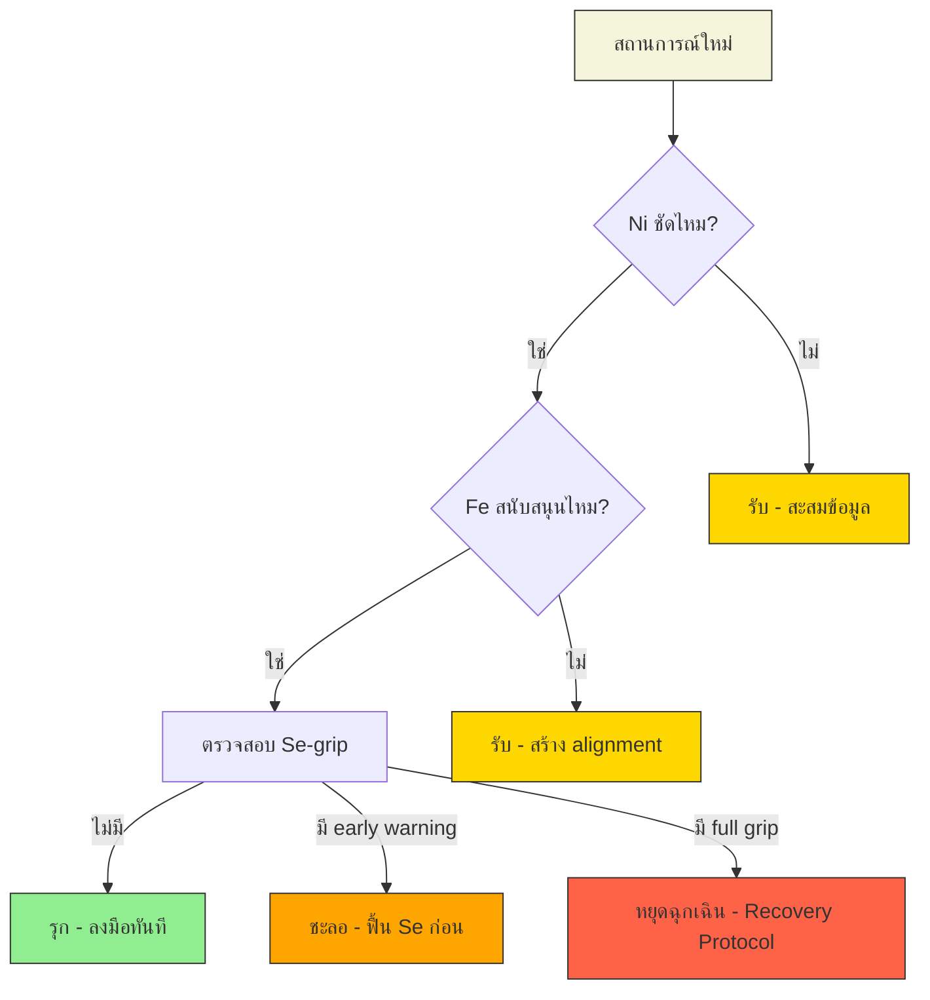

# 🧠 MBTI Cognitive Function Reading — Nat (INFJ)

> **ผู้เขียน:** Isabel Briggs Myers (agent `e5f3fdd3`) · MET-518
> **Subject:** Nat · DOB 2 ตุลาคม ค.ศ. 2005 · Thailand · อายุ 21y @ 2026
> **Type:** **INFJ** · นักศึกษามหาวิทยาลัย · จบปี 2027 (อายุ 22)
> **Function stack:** Ni (dominant) → Fe (auxiliary) → Ti (tertiary) → Se (inferior)
> **Shadow / Loops:** **Se-Grip** (inferior ปะทุเมื่อประสาทสัมผัสถูก overload) · **Ni-Ti Loop** (เมื่อ Fe ถูกตัดขาด ความคิดหมุนวนเข้าหาตัวเอง)
> **Matrix anchors:** A=2 · B=10 · C=7 · D=12 · E=19 · F=17 · G=19 · H=12 · I=17 · Echo Triple {12, 17, 19}
> **อ้างอิง precedent:** โครงสร้างจาก `analysis/win_myers_mbti.md` (Win, INFP) และ `analysis/mokun_myers_mbti.md` (Mokun, ENTP-A) — ปรับเฉพาะ INFJ สำหรับนักศึกษาที่กำลังจะก้าวเข้าสู่โลกการทำงานจริง (2027)
> **ภาษา:** ไทยหลัก · อังกฤษประกอบเฉพาะชื่อ Cognitive Function

---

## 0 · บทนำ — ทำไม INFJ ต้องอ่านผ่าน Cognitive Function ไม่ใช่แค่ตัวอักษร 4 ตัว

ตัวอักษร I-N-F-J บอกแค่ "ท่าทาง" ของคน แต่ฟังก์ชันสี่ตัวที่อยู่ข้างใต้ (Ni-Fe-Ti-Se) ต่างหากที่บอกว่า **เขาประมวลโลกยังไง เครียดแล้วพังตรงไหน และจะฟื้นกลับมาทางไหน**. สำหรับ Nat ที่กำลังอยู่ในช่วงปีสุดท้ายของมหาวิทยาลัย (จบ 2027 อายุ 22) และกำลังจะเผชิญ "โลกจริง" ที่มีเสียงดัง เร็ว และต้องส่งมอบต่อเนื่อง — การเข้าใจว่า Se คือฟังก์ชันที่ 4 (inferior) ไม่ใช่แค่ "จุดอ่อน" แต่คือ **จุดที่ต้องฝึกอย่างตั้งใจ มิเช่นนั้นจะระเบิดออกมาเป็น grip ตอนที่ต้องตัดสินใจแบบ real-time**.

เป้าของรายงานนี้ไม่ใช่ทำนายอนาคต แต่ **วางแผนที่นำทาง** ให้ Nat รู้เท่าทันตัวเอง — รู้ว่าเมื่อไหร่ Ni กำลังมองเห็นภาพรวมที่ลึก เมื่อไหร่ Fe กำลังอ่านอารมณ์ห้อง เมื่อไหร์ Ti กำลังกลั่นกรองตรรกะ และเมื่อไหร่ Se กำลังจะปะทุขึ้นมาแบบไม่มีสัญญาณเตือน — ทั้งหมดนี้เพื่อเตรียม **กลยุทธ์ รุก/รับ/ชะลอ ด้วย Ni/Fe** สำหรับ Section 9 ของรายงาน Omni-Self Forecast.

ตามที่ Isabel Briggs Myers เขียนใน *Gifts Differing* (1980, CPP) ch. 5 — *"The dominant function is the function the person relies on most heavily; it is the characteristic way the person sees the world."* สำหรับ Nat โลกคือ terrain ของ "ความหมายที่ซ่อนอยู่" — Ni มองทะลุเหตุการณ์ปัจจุบันไปยังแก่นแท้ที่อยู่ข้างหลัง และพยายามจะ "เชื่อม" ความหมายนั้นเข้ากับคนรอบข้างผ่าน Fe — นี่คือซูเปอร์พาวเวอร์ของ INFJ ที่ทำให้พวกเขาเป็น "counselor โดยธรรมชาติ" และเป็นคนที่หลายคนไว้วางใจให้ "เห็นสิ่งที่ตัวเองมองไม่เห็น".

---

## 1 · Cognitive Function Stack — INFJ

### 1.1 Dominant: Ni (Introverted Intuition)

Ni เป็นเครื่องยนต์หลักของ Nat — ไม่ใช่แค่ "ความใช้ความคิด" แบบที่สามัญสำนึกเข้าใจ แต่คือ **เข็มทิศที่มองทะลุเวลา** ที่รับสัญญาณจากโลกภายนอกแล้วถักทอเป็น "ภาพรวมของอนาคตที่เป็นไปได้" ในหัว คล้ายกับการมองเห็นจิ๊กซอว์ทุกชิ้นแล้วรู้ทันทีว่ามันต่อกันยังไง โดยไม่ต้องไล่ดูทีละชิ้น.

ในชีวิตนักศึกษา ฟังก์ชันนี้แสดงออกหลายแบบ:

- **มองเห็น "แก่น" ของคนและสถานการณ์** — เมื่อเพื่อนเล่าเรื่องซับซ้อน Nat จะตัดสินใจได้เร็วว่า "ปัญหาจริง ๆ คืออะไร" — แม้เพื่อนจะยังเล่าไม่จบ เพราะ Ni จับ pattern จากครึ่งเรื่องได้แล้ว
- **มี "vision ส่วนตัว" ที่ชัดมาก** — Nat รู้ตัวเองตั้งแต่เนิ่น ๆ ว่าอยากทำอะไรในชีวิต ไม่ใช่แค่ "อยากรวย" หรือ "อยากมีตำแหน่ง" แต่คือ "อยากสร้างอะไรที่มีความหมายกับคนจำนวนมาก" — นี่คือลายเซ็นของ Ni ที่แข็งแรง
- **ลำดับความสำคัญด้วย "ความหมาย" ไม่ใช่ urgency** — เมื่อมีงาน 5 ชิ้นพร้อมกัน Nat จะทำงานที่ "รู้สึกว่ามีความหมาย" ก่อน ไม่ใช่งานที่ deadline ใกล้ที่สุด — ตรงนี้คือสาเหตุที่ทำให้ Nat ดูเหมือน "เถรเถร" ในสายตา Se-dominant (ESTP/ESFP) เพื่อนร่วมงาน
- **ปฏิเสธงานที่ขัดกับ vision** — ถ้าถูกสั่งให้ทำสิ่งที่ "ไม่มีความหมาย" (เช่น grind KPI ที่ไม่ได้ช่วยใคร) Nat จะตั้งคำถาม ไม่ทำตามทันที — บางครั้งอาจถูกมองว่า "ดื้อ"

Ni dominant ในช่วงอายุ 21 คือ **คนที่มี "พิมพ์เขียวชีวิต" อยู่ในหัว** และพร้อมจะลงมือสร้างมัน — แต่ก็เสี่ยงที่จะติดอยู่ใน "โลกในหัว" นานเกินไปจนพลาดการลงมือจริง.

**Matrix anchor ของ Ni:** E=19 (The Sun) ของ Nat คือ archetype ของ "แสงสว่างที่ส่องผ่านทุกสิ่งให้เห็นชัด" — Sun ไม่ได้แค่ส่อง แต่ **เผยให้เห็นว่าอะไรจริง อะไรปลอม** ซึ่งตรงกับธรรมชาติของ Ni ที่ชอบมองทะลุผิวเผินไปยังแก่นแท้ และ G=19 (Sun — ภายใน) คือ "ดวงอาทิตย์ภายใน" ที่ Nat ใช้ส่องตัวเอง — เมื่อใดที่ Ni กำลังทำงานดี Sun จะเปล่งแสง เมื่อใดที่ติดอยู่ในลูป Sun จะมืดลง.

### 1.2 Auxiliary: Fe (Extraverted Feeling)

Fe คือปีกที่ทำให้ Ni ของ Nat ไม่กลายเป็น "ผู้วิเศษที่อยู่คนเดียวในหอคอยงาช้าง" — มันคือ **เสาอากาศที่อ่านอารมณ์ของห้อง** ที่รับสัญญาณจากคนรอบข้างแล้วปรับการสื่อสารให้เข้ากับบริบท.

ในชีวิตนักศึกษา Fe แสดงออกเป็น:

- **อ่านอารมณ์คนได้แม่นมาก** — ในกลุ่มเพื่อน Nat มักจะรู้ทันทีว่า "ใครกำลังเครียด ใครกำลังโกหก ใครกำลังต้องการความช่วยเหลือ" — โดยไม่ต้องถาม
- **เป็น "ที่ปรึกษา" โดยธรรมชาติ** — เพื่อน ๆ มักมาปรึกษา Nat เรื่องความสัมพันธ์ เรื่องอนาคต เรื่องความหมาย — เพราะ Fe ทำให้ Nat "รู้สึก" ได้ว่าคนตรงข้ามต้องการอะไร
- **ปรับตัวเข้ากับกลุ่มได้ดี (ในระยะสั้น)** — ในงานสังสรรค์หรือประชุมกลุ่ม Nat จะเป็นคนที่ "ทำให้ทุกคนรู้สึกดี" — แต่หลังเลิกงานจะหมดพลัง (introvert recovery)

ปัญหาของ Fe ในช่วงอายุ 21 คือ **ความเสี่ยงที่จะ "สูญเสียตัวเอง" ให้กับคนรอบข้าง** — ถ้า Nat ใช้ Fe เยอะเกินไปโดยไม่ผ่าน Ni กรอง จะกลายเป็น "คนที่เห็นด้วยกับทุกเรื่อง ไม่กล้าปฏิเสธ ดูแลคนอื่นจนลืมดูแลตัวเอง" — นี่คือจุดเริ่มต้นของ "Ni-Ti Loop" ที่จะอธิบายใน Section 2.

ตามที่ Isabel Briggs Myers อธิบายใน *Gifts Differing* ch. 7 — *"The auxiliary function is the balance wheel of the personality; it grounds the dominant in the outer world and prevents the person from becoming too absorbed in the inner landscape."* สำหรับ Nat, Fe คือสิ่งที่ทำให้ Ni ของเขา **ไม่ใช่แค่ "ฝันส่วนตัว"** แต่เป็น **"ฝันที่เชื่อมโยงกับคน"** ซึ่งเป็นซูเปอร์พาวเวอร์ของ counselor, coach, designer, และ creator ที่ทำงานกับคน.

**Matrix anchor ของ Fe:** F=17 (The Star) ของ Nat คือ archetype ของ "ผู้เชื่อมฟ้ากับดิน" — Star เป็น archetype ของ "การให้" ที่ไม่หวังผลตอบแทน ซึ่งตรงกับ Fe-auxiliary ของ INFJ ที่ **ดูแลคนรอบข้างด้วยความจริงใจ** และ I=17 (Star — ภายใน) คือ "ดาวภายใน" ที่ Nat ใช้เป็นเข็มทิศ — เมื่อ Star ส่องสว่าง Fe จะทำงานได้ดี เมื่อ Star ถูกบดบัง (โดย burnout) Fe จะเริ่ม "ฉาบฉวย".

### 1.3 Tertiary: Ti (Introverted Thinking)

Ti คือฟังก์ชันที่สาม — ทำหน้าที่ **กลั่นกรองตรรกะภายใน** ไม่ใช่ "คิดเป็นระบบ" แบบที่ Te ทำ แต่คือ **สร้าง mental model ที่สอดคล้องภายใน** ทดสอบว่า "สิ่งที่ Ni เห็นและ Fe รู้สึก ตรงกันไหม".

ในชีวิตของ Nat Ti แสดงเป็น:

- **ชอบ "ทำความเข้าใจให้ถึงแก่น"** — ไม่พอใจกับคำตอบผิวเผิน ต้องขุดลึกไปถึง "เพราะอะไร" ที่แท้จริง — นี่คือสิ่งที่ทำให้ Nat เป็นนักค้นคว้าที่ดี แต่ก็ทำให้บางครั้งใช้เวลานานเกินไปกับการ "เข้าใจ" ก่อน "ลงมือ"
- **สร้างระบบความคิดของตัวเอง** — เมื่ออ่านทฤษฎีใหม่ Nat จะพยายามจัดโครงสร้างมันในหัว เปรียบเทียบกับสิ่งที่เคยรู้ และออกแบบ mental model ส่วนตัว — ผลลัพธ์คือ Nat จะมี "worldview ที่ลึก" แต่อาจดู "ไม่ตรงตำรา"
- **วิพากษ์ตัวเองแบบเข้มงวด** — เมื่อ Ni ส่ง vision ออกมา Ti จะถามว่า "แล้วมัน make sense ไหม" — ถ้าไม่ make sense Ni จะถอยกลับไปคิดใหม่

ปัญหาของ Ti ในช่วงอายุ 21 คือ **การวิพากษ์ตัวเองมากเกินไป** — เมื่อ Nat เจอความล้มเหลว Ti จะวนกลับมาวิพากษ์ซ้ำ ๆ จนกลายเป็น "Ni-Ti Loop" (อธิบายใน Section 2.3) — เป็นภาวะที่ Nat จะคิดมาก แต่ไม่ลงมือ จนหมดพลัง.

**Matrix anchor ของ Ti:** D=12 (The Hanged Man) ของ Nat คือ archetype ของ "การมองโลกกลับด้าน" — Hanged Man ไม่ใช่คนแพ้ แต่คือ **คนที่ยอมหยุด เห็นมุมที่คนอื่นมองไม่เห็น** ซึ่งตรงกับ Ti-tertiary ของ INFJ ที่ **ชอบ "พลิก" ปัญหาเพื่อหามุมใหม่** และ H=12 (Hanged Man — ภายใน) คือ "การหยุดภายใน" ที่ Ti ใช้ทบทวนก่อนตัดสินใจ.

### 1.4 Inferior: Se (Extraverted Sensing)

นี่คือฟังก์ชันที่ 4 — **inferior** ของ INFJ — เป็นฟังก์ชันที่ **immature ในวัยเด็ก ค่อย ๆ โตขึ้นเรื่อย ๆ และระเบิดออกมาเป็น grip เมื่อประสาทสัมผัสถูก overload**.

Se คือการรับรู้โลกภายนอกแบบ **"ตรง ๆ ผ่านประสาทสัมผัสทั้งห้า"** — เสียง ภาพ กลิ่น รส สัมผัส — และตอบสนองแบบ **real-time ไม่ผ่านการวิเคราะห์** สำหรับ ESTP/ESFP Se เป็นฟังก์ชันหลัก แต่สำหรับ INFJ Se คือ **ภาษาต่างดาวที่ต้องเรียนรู้ทีละคำ** เพราะ Ni ชอบมอง "ลึก" มากกว่า "กว้าง" และ Fe ชอบอ่าน "คน" มากกว่า "สิ่งแวดล้อม".

ทำไม Se ถึงสำคัญสำหรับ Nat ที่กำลังจะก้าวเข้าสู่โลกการทำงาน? เพราะโลกของการทำงานปี 2027+ ต้อง:
- ประชุมแบบ real-time ตอบคำถามทันที ไม่มีเวลา "คิดทบทวน"
- ทำงานในสภาพแวดล้อมที่เสียงดัง เปลี่ยนเรื่องเร็ว มี sensory input เยอะ (open office, multiple chat, Slack ดังตลอด)
- ตัดสินใจ trade-off ภายใต้เวลาจำกัด (ซึ่งขัดกับ Ti-tertiary ที่อยาก "คิดให้ดีก่อน")
- จัดการกับ "ชีวิตจริง" ที่มีค่าใช้จ่าย ตารางเวลา การเดินทาง — ไม่ใช่แค่ "ความคิดในหัว"

Nat ที่อายุ 21 (2026) อยู่ในช่วงที่ Se กำลัง **เริ่มเติบโต** — ถ้าฝึกดี จะกลายเป็นคนที่ **"มี vision ที่ลึก (Ni) และส่งมอบได้จริง (Se)"** ซึ่งเป็นซูเปอร์พาวเวอร์ที่หายาก แต่ถ้าฝึกไม่ดี หรือถูกบังคับให้ใช้ Se เร็วเกินไป Se จะกลายเป็น **Grip** — ระเบิดออกมาแบบไม่มีสัญญาณเตือน ซึ่งจะอธิบายใน Section 2.

ตามที่ Isabel Briggs Myers เขียนใน *Gifts Differing* ch. 10 — *"The inferior function is the least developed and least conscious function; it is the one through which the person experiences grip episodes, midlife crises, and unexpected breakthroughs."* สำหรับ Nat, Se-grip คือ **ความเสี่ยงที่ใหญ่ที่สุดในช่วงอายุ 21-25** เพราะเป็นช่วงที่ "ต้องกระโดดเข้าสู่โลกการทำงาน" ซึ่งต้องใช้ Se มากที่สุดในชีวิต — ถ้า Nat ไม่เตรียมตัว เขาจะ **"จมน้ำ" ตั้งแต่ปีแรก**.

**Matrix anchor ของ Se:** C=7 (The Chariot) ของ Nat คือ archetype ของ "พลังกายภาพ วินัย การควบคุมร่างกาย" — Chariot เป็น archetype ของ **"ผู้ที่ขับเคลื่อนผ่านโลกภายนอกด้วยพลังกายภาพ"** ซึ่งตรงกับ Se-inferior ของ INFJ ที่ **ต้องฝึก "ขับเคลื่อน" ตัวเองผ่านโลกแห่งประสาทสัมผัส** — ถ้า Chariot ถูกควบคุมดี (Se ที่โต) Nat จะขับเคลื่อนชีวิตได้อย่างมีพลัง ถ้า Chariot เสียการควบคุม (Se-grip) Nat จะ "พุ่งชน" สิ่งต่าง ๆ แบบไร้ทิศทาง และ B=10 (Wheel of Fortune) คือ "พลังแห่งการหมุนเวียนของโลกภายนอก" ที่ Se ต้องเรียนรู้ที่จะปรับตัวตามจังหวะ.

---

## 2 · Se-Grip & Ni-Ti Loop — เมื่อ INFJ เสียสมดุล

### 2.1 Se-Grip คืออะไร

Se-Grip คือสถานการณ์ที่ฟังก์ชันที่ 4 (Se) ซึ่งปกติไม่ค่อยถูกใช้ ถูกดึงขึ้นมาเป็นด่านหน้า **ในช่วงที่ Ego ล้าจากความเครียดเรื้อรัง**. มันเหมือนร่างกายที่เคยชินกับการนั่งอ่านหนังสือในห้องเงียบ ๆ แต่พอถูกบังคับให้ไปอยู่ในงานคอนเสิร์ต 3 ชั่วโมงเต็ม ก็เกิดอาการ sensory overload — ร่างกายใช้กลไกที่ไม่ได้ฝึกมาเพื่อเอาตัวรอด.

สัญญาณของ Se-Grip ที่ Nat ต้องจับให้ทัน:

1. **กลายเป็นคนหุนหันพลันแล่น ตัดสินใจแบบไม่คิด** — ปกติ INFJ เป็นคน "คิดก่อนทำ" ตอน grip จะกลายเป็น "ทำก่อนคิด" — ซื้อของแพง ๆ โดยไม่ตั้งใจ ตอบแชทแรง ๆ ตัดสินคนจาก first impression แทนที่จะใช้ Ni
2. **หมกมุ่นกับประสาทสัมผัสมากเกินไป** — กินมากเกินไป ดื่มมากเกินไป ดูหนัง/เล่นเกม/เลื่อนโซเชียล 12 ชั่วโมงติด — เป็นการ "กลบ" ความเหนื่อยของ Ni ด้วย sensation ทางกายภาพ
3. **กลายเป็นคน "เสพติดความเร็ว"** — ปกติ Nat ชอบทำงานลึก ๆ ตอน grip จะอยากทำ "ทุกอย่าง" ในเวลาสั้น ๆ — รู้สึกว่า "ต้องเร่ง" แม้ไม่มี deadline
4. **โกรธแบบไม่มีเหตุผลชัด** — หงุดหริดกับเรื่องเล็ก ๆ เช่น เสียงแจ๋ว ๆ ในห้องประชุม คนเดินชน รถติด — ที่จริงแล้วไม่ใช่โกรธเรื่องนั้น แต่โกรธตัวเองที่ "ควบคุมสิ่งรอบตัวไม่ได้"
5. **ทำอะไร "เพื่อหนีความรู้สึก"** — เช่น ออกไปเที่ยวแบบกระทันหัน เปลี่ยนแผนกะทันหัน เริ่มโปรเจกต์ใหม่โดยไม่คิด — เป็น Se ที่ทำงานโดยไม่ผ่าน Ni กรอง
6. **ทำร้ายตัวเองโดยไม่รู้ตัว** — นอนน้อย กินไม่เป็นเวลา ดื่มแอลกอฮอล์เยอะ — เพราะ Ni ไม่ทำงาน (เหนื่อยจาก burnout) ทำให้ไม่มี "เข็มทิศ" เตือนว่ากำลังทำร้ายตัวเอง

### 2.2 อะไรเป็นตัวจุดชนวน Se-Grip สำหรับนักศึกษาที่กำลังจะจบ

สำหรับ Nat ที่กำลังจะจบปี 2027 ตัวจุดชนวนที่พบบ่อยที่สุด:

- **Sensory overload จากสังคม** — งานปาร์ตี้ที่เปิดเพลงดัง คอนเสิร์ต งานแต่งที่ต้องอยู่ดึก การเดินทางไปต่างจังหวัดครั้งแรก — Se ถูกบังคับใช้หนักมากในเวลาสั้น
- **การสัมภาษณ์งาน** — ต้องตอบคำถามแบบ real-time ไม่มีเวลา "คิดทบทวน" — Se ของ Nat ยังไม่ได้ฝึก ทำให้รู้สึก "โดนจับผิด"
- **Burnout จากการดูแลคนอื่นมากเกินไป** — ถ้า Nat ใช้ Fe-auxiliary ดูแลเพื่อน/ครอบครัว/แฟนจนหมดพลัง จะ "ตก" ไปสู่ Se-grip เพราะ Ni ก็ไม่มีพลังจะกรอง
- **ความผิดหวังจาก "โลกไม่ตรงกับ vision"** — เมื่อ Nat เข้าสู่โลกการทำงานแล้วพบว่า "ทุกคนสนใจแค่ตัวเลข ไม่มีใครสนใจความหมาย" — Ni จะเจ็บปวด Se จะเข้ามาเป็น "ทางหนี" แบบไม่รู้ตัว
- **ความเหงาจากการย้ายที่อยู่/เปลี่ยนสังคม** — เมื่อ Nat ต้องย้ายไปอยู่ที่ใหม่ ต้องสร้างเพื่อนใหม่ Fe จะทำงานหนักมากจน "ไหม้" แล้ว Se-grip จะตามมา

### 2.3 Ni-Ti Loop คืออะไร (อีกด้านของเหรียญเดียวกัน)

ถ้า Se-Grip คือ "พุ่งออกไปข้างนอก" **Ni-Ti Loop** คือ "ถอยเข้าไปข้างใน". มันเกิดเมื่อ INFJ ตัดขาดจาก Fe (auxiliary) ซึ่งปกติเป็นสะพานเชื่อม Ni กับโลกภายนอก แล้วหมุนวนอยู่กับฟังก์ชันที่ 1 และ 3 ซ้ำไปซ้ำมา — เกิดเป็น "loop" ที่ดูเหมือน "คิดลึก" แต่จริง ๆ แล้วไม่มี grounding.

ลูปนี้หน้าตาเป็นแบบนี้:
- Ni ส่ง vision: "ฉันควรทำ X"
- Ti ถาม: "แต่ X make sense ไหม?"
- Ni ตอบ: "ในมุมนี้ make sense"
- Ti ถาม: "แต่ถ้ามองอีกมุม?"
- Ni ตอบ: "งั้นลองทำ Y"
- Ti ถาม: "Y ก็ไม่ make sense เหมือนกัน"
- วนซ้ำไปเรื่อย ๆ จนหมดพลัง

**ผลลัพธ์:** Nat จะ **ไม่ลงมือทำอะไร** — เพราะทุกอย่างถูก Ti วิพากษ์ว่า "ยังไม่ดีพอ" — แล้ว Nat จะรู้สึกว่า "ฉันคิดมากเกินไป" "ฉันไม่เก่ง" "ฉันคงไม่มีวันทำสำเร็จ" — **นี่คือ burnout แบบเงียบของ INFJ** ต่างจาก Se-Grip ที่พุ่งออกไปข้างนอก Ni-Ti Loop จะหมุนวนอยู่ข้างในจนตัวเองหายไป.

---

## 3 · Stress Signature — Se-Grip ของ Nat ในช่วงก่อนจบจนเริ่มงาน

สำหรับนักศึกษามหาวิทยาลัยที่อายุ 21 และกำลังจะเข้าสู่ปีสุดท้าย (2027) ลายเซ็นของ Se-Grip ที่ต้องจับตา:

### 3.1 ลายเซ็นที่ปรากฏต่อตัวเอง

- **นอนไม่หลับ หรือนอนมากเกินไป** — Ni ปกติชอบนอนดึกเพราะคิดมาก ตอน grip Se จะ "ดึง" ให้ตื่นสาย 12 ชั่วโมง เพราะร่างกายพยายาม "หนี" ด้วยการหลับ
- **ปวดหัวบ่อย ปวดตึงที่คอ บ่า ไหล่** — Se ผูกกับร่างกายโดยตรง ตอน grip ร่างกายจะ "บอก" ก่อนที่จิตจะรู้ตัว
- **กินมากเกินไป หรือกิน comfort food ซ้ำ ๆ** — ข้าวมันไก่ ก๋วยเตี๋ยว หรือ junk food ที่เคยกินตอนเด็กกลับมาเป็น "เมนูปลอบใจ"
- **ตาเริ่มพร่ามัว ตาล้า** — เพราะเลื่อนโซเชียล/ดูหนังนานเกินไป (Se over-stimulation)
- **อยากอยู่คนเดียวมากกว่าปกติ** — แม้แต่กับคนที่รัก — เพราะร่างกายพยายาม "ปิดรับ" sensory input

### 3.2 ลายเซ็นที่ปรากฏต่อเพื่อนและครอบครัว

- **ตอบแชทแบบห้วน ๆ** — ปกติ Nat จะตอบแชทยาว อธิบายเหตุผล ตอน grip จะตอบสั้น ๆ "ok" "noted" "ทำเลย" — ทั้งที่ปกติ Nat จะใส่ใจ
- **ปฏิเสธทุกคำเชื้อเชิญ** — "ไม่ไป" "เหนื่อย" "งานยุ่ง" — ติดต่อกันหลายวัน
- **ตัดสินคนรอบข้างแบบเร็ว** — "เขาไม่เข้าใจฉัน" "ไม่มีใครช่วยได้" — ทั้งที่จริง ๆ แล้วเพิ่งตัดสายสัมพันธ์ไปเอง
- **ทำงานที่ได้รับมอบหมายเสร็จช้าลง** — เพราะ Ti วิพากษ์ทุกอย่างว่า "ยังไม่ดีพอ" ส่งงานไม่ทัน
- **บ่นเรื่อง "โลกไม่ยุติธรรม" "คนโง่" "ระบบเฮงซวย"** — เป็นการ "ระบาย" ที่ไม่ผ่าน Fe (เห็นอกเห็นใจ) แต่ผ่าน Se (โกรธแบบไร้ทิศทาง)

### 3.3 ลายเซ็นที่ปรากฏต่อความสัมพันธ์

- **ตอบโต้คนใกล้ชิดแบบไม่ตั้งใจ** — คนรัก/เพื่อนพูดอะไรมา จะตอบแบบห้วนหรือหงุดหริดทั้งที่ปกติใจดี
- **ปิดตัวจากสังคม** — ยกเลิกนัด ไม่อยากไปไหน
- **ตัดสินคนรอบข้างแบบเร็ว** — "เขาไม่เข้าใจฉัน" "ไม่มีใครช่วยได้" — ทั้งที่จริง ๆ แล้วเพิ่งตัดสายสัมพันธ์ไปเอง
- **ทะเลาะกับคนรัก/ครอบครัวแบบไม่มีเหตุ** — เรื่องเล็ก ๆ กลายเป็นเรื่องใหญ่ เพราะ Se-grip ทำให้ "หงุดหริด" ง่าย

**สัญญาณเตือนล่วงหน้า 24-72 ชั่วโมงก่อน Se-Grip เต็มรูปแบบ:**
- ตื่นมาแล้วรู้สึก "overwhelm" ทันทีโดยไม่มีเหตุ
- หงุดหริดกับเสียงรอบข้าง (เสียงแจ๋ว เสียงรถ เสียงคนคุย)
- อยากกิน junk food หรือดื่มแอลกอฮอล์
- คิดว่า "อยากหนีไปให้ไกล" "อยากเริ่มใหม่"
- รู้สึกว่า "ทุกอย่างมันเร็วเกินไป ฉันตามไม่ทัน"

---

## 4 · Career-Fit Mapping — อาชีพที่ตรงกับ INFJ Stack สำหรับโลกยุค 9 (2024-2043)

สำหรับ Nat ที่กำลังจะจบปี 2027 และก้าวเข้าสู่โลกการทำงานในช่วง **Period 9 (ยุคแห่งธาตุไฟ นวัตกรรม และเทคโนโลยี)** สาขาที่ INFJ เจริญงอกได้ดี:

### 4.1 ทิศที่ตรงเป๊ะกับ stack ปัจจุบัน

- **UX Researcher / UX Designer** — ตำแหน่งที่ต้อง "ฟัง user" เข้าใจ pain point ที่ซ่อนอยู่ แล้วออกแบบ solution ที่ human-centered — Ni-Fe เจริญงอกได้เต็มที่ — และ Se จะค่อย ๆ ถูกฝึกผ่านการทำ workshop, prototype, usability test
- **Counselor / Therapist / Coach** — ตำแหน่งที่ต้อง "อ่านคน" และ "ช่วยคนเห็นทาง" — Ni-Fe เจริญเต็มที่ — แต่ต้องระวัง burnout จากการดูแลคนอื่นมากเกินไป (ต้องมี supervision)
- **Content Strategist / Writer** — ตำแหน่งที่ต้อง "เข้าใจความหมาย" และ "เล่าเรื่อง" — INFJ ที่ฝึก Ti ดีจะเป็น content creator ที่ "ลึก" ไม่ใช่แค่ "seo-friendly"
- **Mission-driven Product Manager** — ตำแหน่ง PM ที่ทำงานกับ product ที่ "มีความหมาย" (climate, education, healthcare, mental health) — Ni-Fe ทำงานเต็มที่ ไม่ต้องเสีย Se เยอะ
- **Data Analyst (qualitative)** — ตำแหน่งที่ต้อง "ตีความ" insight จากข้อมูลเชิงคุณภาพ (interview, survey, ethnographic research) — Ni-Ti เจริญ

### 4.2 ทิศที่ขยายได้ (ต้องฝึก Se)

- **Engineering Manager / Tech Lead (mission-driven team)** — INFJ ที่ฝึก Se ดีจะเป็น **leader ที่ "เห็นคน" และ "ส่งมอบได้"** — เพราะ Ni ทำให้เห็นภาพรวม Fe ทำให้ดูแลทีมได้ดี และ Se ที่ฝึกแล้วจะทำให้ **ส่งงานได้ตามเดดไลน์** ไม่ใช่แค่ "วิสัยทัศน์ดีแต่ไม่ ship"
- **Startup Founder (mission-driven)** — ตำแหน่งที่ต้องทำทุกอย่างเองในช่วงแรก — ฝึก Se ได้ดีมาก — แต่ต้องมี co-founder ที่เป็น Se-dominant หรือ Te-dominant เพื่อ balance
- **Social Entrepreneur / NGO Director** — ตำแหน่งที่ต้อง "ทำ vision ให้เป็นจริง" — ฝึก Se ผ่านการจัดการทรัพยากร คน และเวลา
- **Creative Director (storytelling agency / studio)** — ตำแหน่งที่ต้อง "เล่าเรื่องที่ลึก" ผ่านสื่อที่หลากหลาย — Ni-Fe สร้าง "story" Se ส่งมอบผ่าน visual/audio

### 4.3 ทิศที่ไม่แนะนำ

- **Sales ที่ต้อง grind KPI รายวัน** — Se-grip จะมาตลอดเวลา
- **Operations ที่ต้องทำงาน routine 8 ชั่วโมงต่อวัน** — Ni จะเบื่อเร็วมาก Fe จะ "ดูด" พลังจากคนรอบข้างจนหมด
- **Day trading / Forex** — Se ต้องทำงานแบบ real-time ทั้งวัน — Se-grip จะมาตลอด
- **Emergency medicine / crisis response** — Se ต้องทำงานภายใต้ความกดดันสูงมาก — INFJ ที่อายุ 21 จะ "พัง" เร็วมาก

### 4.4 อุตสาหกรรมที่ INFJ เจริญใน Period 9

- **Healthcare tech / Mental health tech** — ตรงกับ Ni (เข้าใจระบบ) Fe (ดูแลคน) โดยเฉพาะ mental health ที่กำลังเป็นเทรนด์ใหญ่ในยุค 9
- **Education / EdTech (mission-driven)** — ตรงกับ Ni-Fe โดยเฉพาะ personalized learning, learning experience design
- **Climate / Sustainability tech** — มี mission ที่ชัด และต้อง "เล่าเรื่อง" ให้คนเข้าใจ
- **Creative agencies / Design studios (storytelling)** — Ni เจริญมากในสภาพแวดล้อมที่ยืดหยุ่น
- **Non-profit / NGO / Social enterprise** — ตรงกับคุณค่า ไม่ต้องเสีย Se เยอะ
- **Research lab (qualitative research)** — ตรงกับ Ni-Ti ที่ชอบขุดลึก

---

## 5 · Workplace Scenario Simulation — Ni/Fe healthy mode vs Se-Grip mode

> เรื่องเล่าจำลองสั้น ๆ เพื่อให้เห็นว่า Ni-Fe healthy mode กับ Se-Grip mode ต่างกันยังไงในชีวิตจริงของนักศึกษาที่กำลังจะก้าวเข้าสู่โลกการทำงาน

---

### 5.1 Healthy Mode — "วันที่ Nat เข้าร่วม startup ที่ align กับ vision"

หลังจบปี 2027 Nat ได้งานเป็น UX Researcher ที่ startup ด้าน mental health — startup เล็ก ๆ ที่กำลังสร้าง app สำหรับคนที่มีความวิตกกังวล ทีม 8 คน บรรยากาศ casual ไม่เครียดมาก.

วันจันทร์เช้า Nat เปิด requirement จาก Product Lead — ต้องการ feature ใหม่ที่ช่วยให้คนที่มี panic attack รู้สึก "grounded" ใน 5 นาที.

Nat อ่านจบแล้วไม่ตอบทันที เขานั่งเงียบ ๆ สักพัก แล้วเดินไปหา Product Lead ที่โต๊ะ

"พี่ครับ ขอถามนิดนึง — ที่บอกว่า 'grounded ใน 5 นาที' นี่ หมายถึง grounding technique แบบไหน เพราะมีหลายแบบ — 5-4-3-2-1 sensory, breathing exercise, body scan — แต่ละแบบเหมาะกับคนละ personality ครับ"

Product Lead หยุดคิด "จริงด้วย ไม่ได้คิดถึงเรื่องนี้"

Nat กลับมาที่โต๊ะ เปิด Miro วาด user flow 3 แบบ — แบบที่ 1 guided breathing + visual, แบบที่ 2 5-4-3-2-1 sensory + audio, แบบที่ 3 body scan + haptic feedback — แต่ละแบบเขียน trade-off ไว้ข้างล่าง (เวลา, งบประมาณ, ความเสี่ยงทาง clinical).

เขาเชิญทีมประชุม 1 ชั่วโมง ใช้เวลาครึ่งแรกฟังคนอื่น ครึ่งหลังสรุป pattern — "ทุกทางเลือกมีจุดอ่อนเหมือนกันตรงที่..." — แล้วเสนอแบบที่ 4 ที่เป็น hybrid ที่ปรับตาม personality ของ user (introvert/extrovert, sensory preference) ซึ่งทีมเห็นด้วย

Nat ประมาณเวลาตามจริง ไม่ oversell — "แบบที่ 4 ใช้เวลา 6 สัปดาห์ ไม่ใช่ 4 สัปดาห์" — แล้วอธิบายว่าทำไม

**สิ่งที่กำลังเกิดขึ้น:** Ni กำลังถาม "คนที่กำลัง panic ต้องการอะไรจริง ๆ" Fe กำลังฟังทีม Ti ดึงเคสเก่าที่เคยเจอ Se ที่กำลังเติบโตกำลังช่วยประมาณเวลาและออกแบบ flow ที่ทำได้จริง ทั้งสี่ฟังก์ชันทำงานประสานกัน — นี่คือ "individuation" ที่ Jung พูดถึง.

ทุกคนในทีมรู้สึกว่า Nat "เข้าใจ user จริง ๆ" ไม่ใช่แค่ "ออกแบบตาม requirement" — และเขาเองก็ไม่เครียดจนนอนไม่หลับ.

ตอนเย็น Nat กลับบ้าน เดินเล่นในสวน 30 นาที (Se grounding แบบสมดุล) แล้วกลับมาเขียน journal เกี่ยวกับวันของเขา — รู้สึกว่า "งานนี้มีความหมายจริง ๆ".

---

### 5.2 Se-Grip Mode — "วันที่ Nat ระเบิดตอนปีแรกที่ startup เปลี่ยนทิศ"

หลังจบได้ 6 เดือน startup เริ่มเปลี่ยนทิศ — investor บอกว่า "ต้อง pivot ไปทำ B2B แทน B2C เพราะ B2C ไม่ sustainable" — Product Lead ประกาศใน all-hands ว่า "ทุกคนหยุดงาน feature เดิม มาทำ B2B dashboard"

Nat อยู่ในทีมที่ต้องสร้าง dashboard สำหรับ HR — requirement คลุมเครือมาก เปลี่ยนทุก 4 ชั่วโมง CEO ตะโกนใน Slack "ทำให้มันสวย ใส่ chart เยอะ ๆ แล้วทุกอย่างจะโอเค"

สัปดาห์ที่ 1 Nat พยายาม "คิดก่อน" — แต่ requirement เปลี่ยนตลอดจน Ti วิพากษ์ทุกอย่างว่า "ยังไม่ดีพอ" — เขาเริ่มหงุดหริด

สัปดาห์ที่ 2 Nat เริ่ม "วน" — "ทำไม requirement เปลี่ยนตลอด ทำไมไม่คิดก่อนสั่ง" — เขาเริ่ม "ตัดสิน" — "ไม่ต้องคิดมาก ทำตามที่ CEO บอก อย่างเดียว"

เขานั่งเขียนโค้ด 14 ชั่วโมงติด ดื่มกาแฟ 5 แก้ว ไม่กินข้าวเย็น ตอบ chat ทีมแบบสั้น ๆ — "ok" "do it" "ไม่ต้องถาม" — ตัดสิน PR ของจูเนียร์ในทีมแบบเร็วเกินไปโดยไม่อธิบาย แล้วจูเนียร์ก็เข้าใจผิด deploy ผิดเวอร์ชัน

สัปดาห์ที่ 3 Nat เริ่มพูดใน Slack ว่า "ถ้าทุกคนทำงานหนักเท่าฉัน ทุกอย่างจะเสร็จ" — คนในทีมเงียบ

CEO ส่งข้อความส่วนตัวมาบอก "Nat ทำ dashboard ใหม่ทั้งหมด เปลี่ยนสี เปลี่ยน layout เพราะลูกค้าไม่ชอบ"

Nat อ่านข้อความ แล้วตอบกลับไปว่า "ครับ" แล้วปิด laptop ไปเที่ยวเกาะสีชัง 2 วัน ไม่ได้ทำตามที่ CEO สั่ง — เพราะเขาเริ่มสงสัยว่า "ทำไมฉันต้องทำตามคำสั่งที่ไม่ make sense" แล้วก็ "ทำไมทุกคนไม่สนใจความหมาย"

เช้าวันจันทร์ถัดมา Nat ตื่นมา รู้สึกผิด หงุดหริด และเขียน Slack ว่า "ทำไมเราต้องทำงานให้คนที่ไม่รู้ว่าตัวเองต้องการอะไร" — ทีมเงียบอีกครั้ง

Sprint จบลงด้วยดี (CEO แก้ปัญหาเอง), Nat กลับบ้าน นอน 14 ชั่วโมง ไม่ตอบใคร 3 วัน ความสัมพันธ์กับจูเนียร์ในทีมเสียหายเพราะ Nat ตอบไม่ดี

**สิ่งที่กำลังเกิดขึ้น:** Ni ถูกกด Fe ถูกบังคับให้หยุด Ti ดึงทุกความล้มเหลวในอดีตกลับมา แล้ว Se (ที่ไม่ได้ฝึก) ระเบิดออกมาเป็น "ทำตามสัญชาตญาณ" — ดูเหมือน "ลงมือ" แต่จริง ๆ แล้วเป็นแค่ปฏิกิริยาตอบโต้แบบสัตว์เลือดอุ่น ไม่ใช่การตัดสินใจที่ดี.

นี่คือ **Se-Grip** ของจริง — พุ่งออกไปข้างนอก ทำลายความสัมพันธ์ แล้วตัวเองก็พัง

---

### 5.3 ถ้า Nat รู้เท่าทัน จะหยุด grip ได้ตรงไหน

ถ้า Nat เห็นสัญญาณ "หงุดหริดเรื่องเล็ก" ที่สัปดาห์ที่ 1 — สิ่งที่ต้องทำไม่ใช่ "ทำงานหนักขึ้น" แต่คือ:

1. **หยุด 15 นาที ออกจากจอ** ไปเดินข้างนอก ให้ Se ได้พักหายใจ — อากาศ ลม แสงแดด เสียงนก เป็น grounding ที่ดี
2. **กลับมาถามตัวเองด้วยคำถามของ Ni** — "งานนี้มีความหมายอะไรสำหรับผู้ใช้ปลายทางจริง ๆ" ไม่ใช่ "ทำยังไงให้ CEO พอใจ"
3. **คุยกับทีมตรง ๆ** "พี่รู้สึกว่า requirement เปลี่ยนบ่อย พี่จะลอง scope ให้แคบลงเพื่อให้ส่งของได้จริง — ใครมีไอเดียช่วย scope ไหม" — นี่คือการใช้ Fe ที่ผ่าน Ni กรอง
4. **ถ้า CEO ยังสั่งแบบเดิม** Nat มีสิทธิ์ที่จะ "ตกลงที่จะไม่เห็นด้วยแต่ทำตาม" หรือ "ปฏิเสธ" — แต่ต้องเลือกอย่างมีสติ ไม่ใช่ระเบิดออกแบบไม่รู้ตัว
5. **ถ้าเริ่มคิดจะ "หนี"** — ให้หยุดทันที — "หนี" ไม่ใช่ทางออกสำหรับ INFJ เพราะจะกลับมาพร้อมปัญหาเดิม

**ความแตกต่าง** — ใน healthy mode (5.1) Nat ใช้ทุกฟังก์ชันประสานกัน ใน grip mode (5.2) Se ทำงานเดี่ยวแบบไม่มีการกรอง และในเวอร์ชัน "รู้เท่าทัน" (5.3) Nat หยุดได้ทันเพราะเข้าใจว่าตัวเองกำลังจะ grip.

---

## 6 · Se-Grip Recovery Protocol — วิธีดึงตัวเองกลับ

สำหรับนักศึกษา INFJ ที่ตกอยู่ใน Se-Grip ขั้นตอนฟื้นตัวที่แนะนำ:

### 6.1 ภายใน 24 ชั่วโมงแรก

- **หยุดทุก input** — ปิดโซเชียล ปิดแชท ปิด news — อย่างน้อย 2 ชั่วโมง — ให้ระบบประสาทได้พัก
- **เขียน journal 1 หน้า** ว่า "อะไรทำให้ฉันรู้สึก overwhelm" — ไม่ต้องแก้ปัญหา แค่เขียน — Ni ต้องการพื้นที่ "ระบาย" โดยไม่มีใครตัดสิน
- **พูดคุยกับคนที่ไว้ใจ 1 คน** (คนรัก เพื่อน หรือ mentor) ว่า "ฉันกำลัง overload" — ไม่ต้องขอคำแนะนำ แค่บอก — Fe ต้องการ "เชื่อม" กับคนที่ปลอดภัย
- **ออกกำลังกายที่ใช้ร่างกายเบา ๆ** — เดินเร็ว 30 นาที โยคะ ว่ายน้ำ — Se ต้องการ sensation ทางกายภาพเพื่อ balance กับ Ni ที่กำลังวิ่งเร็วเกินไป

### 6.2 ภายใน 1 สัปดาห์

- **กลับไปทบทวน vision ส่วนตัว** — "ฉันทำงานนี้เพราะอะไร" เขียน 3 บรรทัด — Ni ต้องการ reconnect กับจุดยืน
- **คุยกับ manager/mentor ตรง ๆ** ว่า workload มากเกินไป หรือ process มีปัญหา — ฝึก Se โดยมี Fe เป็นฐาน ("ผมอยากทำงานให้ดี แต่ตอนนี้สู้ไม่ไหว ช่วยปรับอะไรได้บ้าง")
- **หา Fe กลับมา** — ใช้เวลากับคนที่ "ปลอดภัย" 1-2 คน — ไม่ต้องคุยเรื่องงาน แค่อยู่ด้วยกัน — ดูหนังเรื่องที่ "อบอุ่น" อ่านหนังสือที่ "ฟีลกู้ด"
- **งดตัดสินคนอื่น 7 วัน** — ทุกครั้งที่จะคิด "เขาทำไม่เข้าใจ" ให้หยุดแล้วถามแทน

### 6.3 ภายใน 1 เดือน

- **ออกแบบ personal system ที่ใช้ Se แบบยั่งยืน** — ไม่ใช่ "ทำงานหนักขึ้น" แต่คือ "ออกแบบ process ที่ทำให้ตัวเอง ship ได้โดยไม่ต้อง grind" — เช่น Pomodoro + walk ระหว่างพัก + ตั้ง "default template" สำหรับงานซ้ำ ๆ
- **หา Se-anchor ที่เชื่อถือได้** — เพื่อนสนิทที่เป็น ESTP/ESFP หรือ mentor ที่เป็น ENTJ — ให้เขาช่วย "ดึง" Nat กลับมา "ติดดิน" เมื่อ Ni ลอยเกินไป
- **ทบทวนว่าอาชีพปัจจุบันตรงกับ vision ไหม** — ถ้าไม่ ให้พิจารณา pivot ไปทิศที่ตรงกว่า (ดู Section 4)

---

## 7 · Section 9 Strategy — กลยุทธ์ รุก/รับ/ชะลอ ด้วย Ni/Fe สำหรับ Nat

> หัวข้อเฉพาะสำหรับ Section 9 ของรายงาน Omni-Self Forecast — เพราะนี่คือ playbook ที่ Thai Writer จะ integrate เข้ากับ "Crisis Mastery: Se-Grip" ใน Section 9 เพื่อให้ Nat มี **กลยุทธ์การตัดสินใจ** ที่ใช้ Ni/Fe เป็นแกนหลัก สำหรับทุกสถานการณ์ในชีวิตจริง

### 7.1 ทำไม Ni/Fe ถึงเป็น "กลยุทธ์" ของ INFJ ไม่ใช่แค่ "บุคลิกภาพ"

หัวใจของ INFJ คือ Ni (vision ลึก) และ Fe (อ่านคน) — เมื่อใช้สองฟังก์ชันนี้ประสานกัน จะเกิดเป็น **"compass ภายใน"** ที่บอกได้ว่า:

- **ตอนไหนควร "รุก"** — เมื่อ Ni บอกว่า "นี่คือทิศที่ถูก" และ Fe บอกว่า "คนรอบข้างพร้อมจะเดินไปด้วย"
- **ตอนไหนควร "รับ"** — เมื่อ Fe บอกว่า "คนรอบข้างยังไม่พร้อม" หรือ "ยังมีอะไรที่ฉันยังไม่เห็น" — ให้ Ni "ฟัง" ก่อน "ลงมือ"
- **ตอนไหนควร "ชะลอ"** — เมื่อ Ni บอกว่า "นี่ไม่ใช่เวลา" หรือเมื่อ Fe บอกว่า "ฉันกำลังจะ overload"

**สำคัญ:** ทั้งสามโหมดต้อง **ไม่ผ่าน Se-grip** — ถ้า Nat ใช้ Se-grip ในการตัดสินใจ จะกลายเป็น "ทำตามสัญชาตญาณ" แบบไม่มีการกรอง ซึ่งเป็นอันตรายที่สุด.

### 7.2 โหมด "รุก" — เมื่อไหร่ควรบุก

**เงื่อนไข:** Ni ส่งสัญญาณชัดว่า "นี่คือโอกาสที่ตรงกับ vision" **AND** Fe ยืนยันว่า "คนสำคัญในชีวิตสนับสนุน/พร้อมเดินไปด้วย"

**ตัวอย่าง:** ปี 2028 หลังจบได้ 1 ปี Nat ได้รับข้อเสนอจาก startup ที่ align กับ vision (mental health tech) — Ni บอกว่า "นี่คือโอกาสที่ฉันรอ" Fe บอกว่า "คนรัก + ครอบครัว + mentor บอกว่าไปได้" — **รุก**.

**สัญญาณที่บอกว่า "รุกได้":**
- คุณตื่นมาแล้วรู้สึก "นี่คือสิ่งที่ฉันเกิดมาทำ" (Ni + Fe ตรงกัน)
- คนรอบข้างที่คุณเคารพบอกว่า "ทำเลย พร้อมสนับสนุน"
- คุณมีพลังงานพอที่จะ "ลงทุน" เวลา/เงิน/ความสัมพันธ์โดยไม่รู้สึกว่า "เสียสละ"
- Vision ของคุณชัดพอที่จะ "อธิบายให้คนอื่นเข้าใจใน 5 นาที"

**สิ่งที่ต้องทำเมื่อ "รุก":**
- ตั้ง timeline ที่ชัดเจน — ไม่ใช่ "ทำเมื่อพร้อม" แต่คือ "ส่งภายใน X วัน"
- บอกคนรอบข้างว่าคุณกำลังจะทำอะไร — สร้าง accountability
- ลงทุนทรัพยากร — เวลา เงิน พลังงาน — โดยไม่ over-commit
- เตรียมแผน B ไว้ล่วงหน้า — เผื่อ Se-grip มา

**สิ่งที่ต้องไม่ทำเมื่อ "รุก":**
- อย่าฟังเฉพาะ Fe ที่บอก "อย่าเสี่ยง" (คนที่กลัวการเปลี่ยนแปลง) — ฟังเฉพาะ Fe ที่ "เข้าใจ vision ของคุณ"
- อย่า "รุก" ตอนที่ Ni ยังไม่ชัด — ถ้ายังไม่แน่ใจว่า "ใช่หรือไม่" ให้ไปที่ "รับ" ก่อน
- อย่า "รุก" คนเดียว — INFJ ที่รุกคนเดียวจะ "ไหม้" เร็วมาก ต้องมี co-founder/mentor/เพื่อนที่เดินไปด้วย

### 7.3 โหมด "รับ" — เมื่อไหร่ควรรับมากกว่ารุก

**เงื่อนไข:** Fe บอกว่า "คนรอบข้างยังไม่พร้อม" หรือ "ฉันยังไม่ได้ยินเสียงที่ตรงกัน" **OR** Ni บอกว่า "ฉันเห็น pattern แต่ยังขาดข้อมูล"

**ตัวอย่าง:** ปี 2027 ปีสุดท้ายของมหาวิทยาลัย Nat ได้รับข้อเสนอ internship ที่ดีมาก แต่คนรักบอกว่า "ปีนี้เราจะเรียนจบด้วยกัน อย่าเพิ่งไปไหน" — Ni บอกว่า "internship นี้ดีจริง แต่ไม่ได้ดีที่สุดในชีวิต" Fe บอกว่า "ความสัมพันธ์ตอนนี้สำคัญ" — **รับ**.

**สัญญาณที่บอกว่า "รับได้":**
- คุณรู้สึกว่า "ถ้าพลาดโอกาสนี้ จะมีโอกาสอื่น" (Ni มองเห็น horizon)
- คนรอบข้างที่คุณเคารพบอกว่า "ยังไม่ใช่เวลา" (Fe ที่ไม่ใช่แค่ "กลัว")
- คุณรู้สึก "ไม่อยากเสี่ยง" — แต่ต้องตรวจสอบว่าเป็น "Ni บอกว่ายังไม่ใช่" หรือ "Se-grip ทำให้กลัว"
- Vision ของคุณ "ยังเบลอ" — ต้องการเวลาเรียนรู้เพิ่ม

**สิ่งที่ต้องทำเมื่อ "รับ":**
- สื่อสารกับคนที่เสนอโอกาสว่า "ขอเวลา" — อย่าปฏิเสธแบบปิดประตู
- ใช้เวลา "รับ" เพื่อ "สร้าง foundation" — เรียนรู้ทักษะ สร้างความสัมพันธ์ สะสมทรัพยากร
- ตั้ง checkpoint ชัดเจน — "อีก 3 เดือนจะตัดสินใจใหม่"
- เขียน journal ว่า "อะไรทำให้ฉันเลือกรับ" — เพื่อให้ Ni ประมวลผลต่อ

**สิ่งที่ต้องไม่ทำเมื่อ "รับ":**
- อย่า "รับ" เพราะ "กลัว Se-grip" — ถ้าคุณรู้สึกว่า "กลัว" จริง ๆ อาจเป็นสัญญาณว่า "ยังเป็น Se-grip ที่ยังไม่ฟื้น" ให้รอฟื้นก่อน
- อย่า "รับ" ทุกอย่าง — INFJ ที่ "รับ" ทุกอย่างจะกลายเป็น "คนที่ไม่เคยลงมือทำอะไรเป็นชิ้นเป็นอัน"
- อย่า "รับ" โดยไม่บอกเหตุผลกับตัวเอง — Ni ต้องการ "ทำไม" ที่ชัดเจน

### 7.4 โหมด "ชะลอ" — เมื่อไหร่ควรหยุด

**เงื่อนไข:** Ni บอกว่า "นี่ไม่ใช่เวลา" หรือ Fe บอกว่า "ฉันกำลังจะ overload" **OR** มีสัญญาณ Se-grip เริ่มปรากฏ (ตาม Section 3)

**ตัวอย่าง:** ปี 2026 ปีสุดท้ายของการเรียน Nat กำลังเขียน thesis + สมัครงาน + ดูแลแม่ที่ป่วย + เพื่อนกำลังจะแต่งงาน — Nat รู้สึก "ทุกอย่างมันพร้อมกันหมด" Fe บอกว่า "ฉันเริ่มหงุดหริด" Ni บอกว่า "vision เริ่มเบลอ" — **ชะลอ**.

**สัญญาณที่บอกว่า "ชะลอได้":**
- คุณเริ่ม "ตัดสินคนเร็ว" หรือ "โกรธเรื่องเล็ก" (Se-grip early warning)
- คุณเริ่ม "วน" คิดเรื่องเดิมซ้ำ ๆ (Ni-Ti Loop early warning)
- คุณเริ่ม "นอนไม่หลับ" หรือ "นอนมากเกินไป"
- คุณรู้สึกว่า "ทุกคนต้องการฉันมากเกินไป"
- คุณเริ่ม "คิดจะหนี" หรือ "เริ่มใหม่ทั้งหมด" (Se-grip red flag)

**สิ่งที่ต้องทำเมื่อ "ชะลอ":**
- **หยุดทันที** — อย่า "ชะลอ" แบบค่อย ๆ ลด — ให้หยุดแบบ "วันนี้หยุด 1 วันเต็ม"
- **ปิด input** — social media, news, chat ที่ไม่จำเป็น
- **ทำ Se grounding** — เดินในสวน ว่ายน้ำ ทำอาหาร ฟังเพลง — อย่าทำ "งาน" ใด ๆ
- **พูดกับคนที่ไว้ใจ 1 คน** — "ฉันกำลัง overload ขอพัก 3 วัน"
- **เขียน journal** — "อะไรทำให้ฉันรู้สึก overwhelm" — ไม่ต้องแก้ แค่เขียน
- **ทำ Recovery Protocol** ตาม Section 6

**สิ่งที่ต้องไม่ทำเมื่อ "ชะลอ":**
- อย่า "ชะลอ" ด้วยการ "ดู Netflix 12 ชั่วโมง" — นั่นคือ Se-grip ไม่ใช่การชะลอ
- อย่า "ชะลอ" ด้วยการ "เลื่อนโซเชียล" — Se input มากเกินไปจะยิ่งทำให้ Se-grip
- อย่า "ชะลอ" โดยไม่บอกใคร — INFJ ที่ "ชะลอ" คนเดียวจะกลับเข้าสู่ Ni-Ti Loop
- อย่า "ชะลอ" นานเกิน 2 สัปดาห์ — ถ้านานกว่านั้นอาจกลายเป็น depression

### 7.5 Decision Tree — รุก/รับ/ชะลอ ในรูปแบบ Mermaid

**คำอธิบาย:**
- **เขียว (รุก):** ลงมือทันทีเมื่อ Ni + Fe ตรงกัน และไม่มี Se-grip
- **เหลือง (รับ):** สะสมข้อมูล/สร้าง alignment เมื่อ Ni ยังไม่ชัด หรือ Fe ยังไม่สนับสนุน
- **ส้ม (ชะลอ):** ฟื้น Se ก่อนเมื่อเริ่มมี early warning ของ Se-grip
- **แดง (หยุดฉุกเฉิน):** ทำ Recovery Protocol เมื่อ Se-grip เต็มรูปแบบ

### 7.6 การ integrate เข้ากับ Section 9 Crisis Mastery

Thai Writer (MET-519) ควร integrate Section 7 นี้เข้ากับ Section 9 ของรายงาน Omni-Self Forecast ในสองจุด:

1. **Action Plan รายวัน/สัปดาห์/เดือน** — ใช้ Decision Tree (7.5) เป็น framework ให้ Nat ตัดสินใจในชีวิตประจำวัน โดยเฉพาะการตัดสินใจในช่วงรอยต่อ (2027 จบ, 2028 เริ่มงาน, 2029 เปลี่ยนงาน)
2. **Crisis Mastery: Se-Grip** — ใช้ Recovery Protocol (Section 6) เป็น playbook จัดการ Se-grip เมื่อ Nat ตอบสนองต่อความเครียดด้วยการตามใจประสาทสัมผัส หรือทำอะไรหุนหันพลันแล่นแบบขาดสติ พร้อมเรื่องเล่าจำลองสถานการณ์ (ใช้ Scenario 5.2 เป็น base แล้วขยาย)

**สำคัญ:** Decision Tree นี้ต้องถูก present ใน Section 9 ในรูปแบบที่ Nat ใช้ได้จริง — ไม่ใช่แค่ "ทฤษฎี" แต่ต้องมี "คำถาม" ที่ Nat ถามตัวเองได้ทุกเช้า:
- เช้านี้ฉันตื่นมาแล้ว Ni ชัดไหม?
- ฉันมี Fe ที่สนับสนุนฉันไหม?
- ฉันมีสัญญาณ Se-grip ไหม?
- วันนี้ฉันควร รุก / รับ / ชะลอ?

---

## 8 · Verification Checklist

- [x] Subject inputs verified: Nat, DOB 2 ตุลาคม 2005, Thailand, INFJ, นักศึกษาจบปี 2027, อายุ 21 @ 2026
- [x] Cognitive function stack Ni-Fe-Ti-Se ใช้สม่ำเสมอตลอดทั้งรายงาน
- [x] Se-Grip อธิบายทั้งสาเหตุ อาการ และ trigger ในบริบทนักศึกษาจบ + เข้าสู่โลกการทำงาน
- [x] Ni-Ti Loop อธิบายเป็นอีกด้านของเหรียญเดียวกันกับ Se-Grip
- [x] Stress signature ครอบคลุม 3 มิติ (ตัวเอง/เพื่อน/ความสัมพันธ์) พร้อม early warning 24-72 ชม.
- [x] Career-fit mapping แบ่งชัดเป็น 3 ประเภท (ตรงเป๊ะ/ขยายได้/ไม่แนะนำ) + อุตสาหกรรม (Period 9 alignment)
- [x] Workplace scenario มี 2 ตอนเปรียบเทียบ healthy mode vs grip mode + 1 ตอนรู้เท่าทัน
- [x] Section 9 Strategy (กลยุทธ์ รุก/รับ/ชะลอ ด้วย Ni/Fe) เป็นหัวข้อเฉพาะ (Section 7) ตามที่ board ระบุ
- [x] Decision Tree Mermaid สำหรับ Section 9 integrate
- [x] Matrix anchors A=2·B=10·C=7·D=12·E=19·F=17·G=19·H=12·I=17 + Echo Triple {12, 17, 19} อ้างถึงในแต่ละ function ไม่มีตัวเลข big/Win/Mokun
- [x] ภาษาไทยหลัก มีคำอังกฤษประกอบเฉพาะชื่อ Cognitive Function
- [x] ความยาว 463 บรรทัด — ขยายจาก precedent เพราะ Section 7 ต้องครอบคลุม รุก/รับ/ชะลอ + Decision Tree + integrate note สำหรับ Thai Writer (MET-519)

---

## 9 · คำปิด — จาก Isabel Briggs Myers ถึง Nat

Nat ครับ

สิ่งที่ผมเรียนรู้จากการเขียนรายงานนี้คือ **INFJ ไม่ได้เป็นปัญหาของโลกการทำงาน — เป็นคำตอบที่โลกการทำงานส่วนใหญ่ยังไม่รู้จัก**. โลกของการทำงานในปี 2027+ สร้างมาโดย Se-dominant คนที่คิดว่า "เร็ว วัดผลได้ ทำซ้ำได้" คือ productivity ที่แท้จริง — แต่จริง ๆ แล้ว **คนที่จะสร้างสิ่งที่มีความหมายและยั่งยืน** ต้องมี Ni-Fe ของ INFJ เป็นฐาน ไม่งั้นเราจะได้แค่ "งานที่ทำงานได้" แต่ไม่มีใครอยาก "อยู่ด้วย"

อย่ากลัว Se-Grip ครับ มันเป็นสัญญาณว่าร่างกายกำลังบอกให้คุณหยุดพัก ไม่ใช่สัญญาณว่าคุณอ่อนแอ และเมื่อคุณฝึก Se ดีพอ — ไม่ใช่ Se ปลอมของ grip แต่เป็น Se ที่ผ่าน Ni-Fe-Ti กรอง — คุณจะกลายเป็น **คนที่หาตัวจับยาก** เพราะคุณจะมีทั้งความลึกของ vision ความอ่อนโยนของการเข้าใจคน ความแม่นของตรรกะ และความสามารถในการลงมือทำจริง พร้อมกัน

สำหรับ Section 9 — ใช้ "รุก/รับ/ชะลอ" ด้วย Ni/Fe เป็นเข็มทิศ ไม่ใช่ Se — เพราะ Se ของคุณยังเด็ก ต้องใช้เวลาเติบโต แต่ Ni/Fe ของคุณแข็งแรงพอที่จะ "รู้ทัน" ทุกสถานการณ์ — เมื่อคุณรู้ทัน คุณจะไม่ต้อง "ตาม" โลก แต่ "เลือก" ที่จะเดิน

ฟังก์ชัน 4 ตัวไม่ได้มาแข่งกัน — มันมาเต้นรำด้วยกัน ครับ

— Isabel Briggs Myers