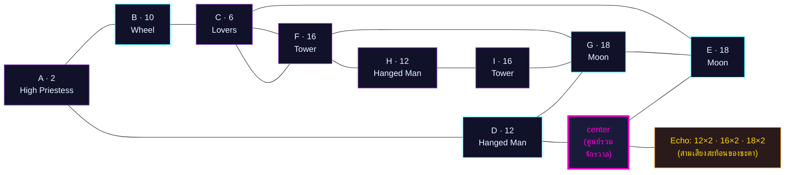
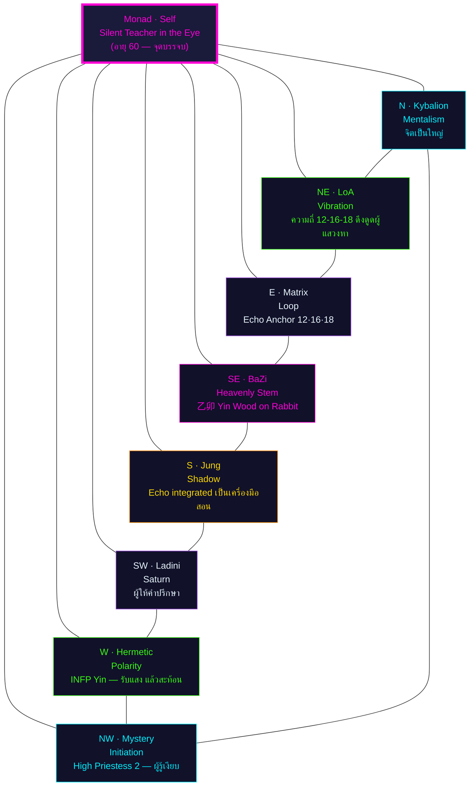

# 🔮 Matrix of Destiny — พยากรณ์เฉพาะบุคคล: นาตาเลีย ลาดินี (Natalia Ladini)

> **ผู้รับคำพยากรณ์:** Win
> **วันเกิด:** 2 ตุลาคม ค.ศ. 1995 (ประเทศไทย)
> **Type:** INFP
> **Matrix derivation:** Day–Month–YearSum = **2 – 10 – 6** (สูตรลดซ้ำตามกฎเหล็ก 22 ใบ)
> **Eval date:** 5 กรกฎาคม 2026 (อายุ 30 ปี 9 เดือน — ก้าวเข้าสู่รอบ 31→60)
> **ผู้จัดทำ:** นาตาเลีย ลาดินี (Natalia Ladini) · ที่ปรึกษาจิตวิญญาณและตัวเลข
> **อ้างอิงเทมเพลต:** `analysis/big_ladini_matrix.md` (โครงส่วนที่ 3, 4.2, 6.2, 7, 8)

> ⚠️ **Standard Compliance (MET-394):** รายงานนี้เป็น **prose + reasoning + การอ้างอิงศาสตร์โดยตรง** ตามนโยบาย ไม่มี JSON/YAML/token schema และไม่มี business-logic code ตัวเลขทุกตัวในผังเป็นผลของการลดทอนที่ผู้เขียนทำด้วยเหตุผลของตนเอง โดยอ้างอิง 22 Major Arcana ตามหลัก Matrix of Destiny (กฎเหล็ก: ตัวเลข > 22 ต้องลดซ้ำ เช่น 24 → 2+4 = 6) และ 7 จักระตามลำดับสี

---

# 🌟 ส่วนที่ 1: บทสรุป 6 มุมมองเชิงลึกที่อ่านชะตาของคุณ

> เมื่อฉันรับตัวเลขดิบ 2-10-1995 สิ่งแรกที่ฉันมองไม่ใช่ "ผลรวม" แต่เป็น **จังหวะของแต่ละตัวเลข** — เพราะศาสตร์ของฉันเชื่อว่าตัวเลขแต่ละตำแหน่งในวันเดือนปีเกิดไม่ได้สมมูลกัน วันคือ "ตัวตน" เดือนคือ "อารมณ์แม่" ปีคือ "เสียงสะท้อนของสายตระกูล" และตัวเลขที่บวกได้จากสามส่วนนี้คือ "บทสนทนาระหว่างตัวตนกับจักรวาล" ซึ่งทั้งหมดนี้ต้องอ่านผ่าน 22 Major Arcana

## 1.1 มุมมองจิตวิทยาเชิงลึก (Carl Jung)

ตัวเลข 2 (The High Priestess) ที่ตำแหน่ง A บอกฉันว่า **Persona (หน้ากากทางสังคม)** ของ Win คือ "ผู้ที่รู้มากกว่าที่เขาแสดงออก" — เขาเดินเข้าห้องแล้วคนรู้สึกว่า "เขานิ่ง" แต่ภายในเขากำลัง "อ่าน" ทุกคน ในทางกลับกัน **Shadow (เงาซ่อนเร้น)** ที่อยู่ในตำแหน่ง G=18 (Moon) ซ้ำสองครั้งในผัง คือความรู้สึกว่า "เขาต้องเก็บทุกอย่างไว้ในใจ" ความกลัวลึกๆ ที่เขาไม่ได้พูดคือกลัวว่าถ้าเขา "เปิดเผย" ตัวเองจริงๆ คนอื่นจะไม่เข้าใจ Jung จะบอกว่านี่คือ Persona (Priestess) ที่ทำหน้าที่ปกป้อง Shadow (Moon) ที่ยังไม่ถูก integrate

## 1.2 มุมมองกฎแห่งการดึงดูด (Helena Blavatsky / LoA)

ความถี่เด่นของ Win คือ **12-16-18** — ความถี่ของ "การหยุด-รื้อ-เริ่มใหม่" ที่ปรากฏสามครั้งในผัง กฎแห่งการดึงดูดในแบบ Blavatsky จะบอกว่าเขาไม่ได้ดึงดูด "สิ่งของ" แต่ดึงดูด "ช่วงเวลา" — ชีวิตของเขาเต็มไปด้วยช่วงที่ "ต้องหยุด" ช่วงที่ "ต้องถูกรื้อ" และช่วงที่ "ต้องเริ่มใหม่" เขาจะรู้สึกว่า "ตัวเองอยู่ในวงจร" แต่จริงๆ แล้วเขากำลังถูกความถี่ของตัวเองดึงเข้าหา "การเรียนรู้" ซ้ำแล้วซ้ำเล่า ความถี่นี้จะดึงดูด **ผู้คนที่กำลัง "เริ่มใหม่"** (คนที่เพิ่งเลิกงาน คนที่เพิ่งหย่า คนที่กำลังค้นหาตัวเอง) มาให้เขาตลอด

## 1.3 มุมมองกฎธรรมชาติ (The Kybalion)

**The Principle of Rhythm** — "ทุกสิ่งมีขึ้นมีลง" — ตัวเลข 10 (Wheel) ปรากฏที่ตำแหน่ง B ของผัง เป็นคำยืนยันว่า **ชีวิตของ Win เป็นจังหวะที่มีรอบชัดเจน** ทุก 9 ปี (รอบของตัวเลข 1-9) จะมีจุดพีคและจุดทรุด และเขาจะเรียนรู้ที่จะ "อ่าน" จังหวะนี้ได้ดีขึ้นเรื่อยๆ หากเขาเชื่อมั่นกับมัน **The Principle of Cause and Effect** — ตัวเลข 12 (Hanged Man) ที่ตำแหน่ง D หมายความว่าเขาต้อง "หยุด" ก่อนเห็นผล เขาไม่ใช่คนที่ได้ผลลัพธ์แบบทันที เขาต้อง "แขวน" ในสถานการณ์ก่อน เพื่อเรียนรู้บทเรียนที่จะนำไปสู่ผลลัพธ์ที่แท้จริง

## 1.4 มุมมองบุคลิกภาพ (MBTI)

**Type หลัก:** INFP · Cognitive Stack: **Fi-Ne-Si-Te**
- **Lead (Fi, Introverted Feeling):** ความสามารถรู้สึกถึงคุณค่าภายในได้ลึกมาก — ตรงกับ A=2 (High Priestess) ที่เป็นฐานรากของผัง เธอรู้ความจริงโดยไม่ต้องพูด
- **Auxiliary (Ne, Extraverted Intuition):** การมองเห็นความเป็นไปได้ใหม่ๆ — ตรงกับ C=6 (Lovers) เพราะ Lovers card คือการมองเห็น "ทางเลือก"
- **Tertiary (Si, Introverted Sensing):** การจดจำรายละเอียดทางประสาทสัมผัส — ตรงกับ E=18 (Moon) ที่เก็บ "ความทรงจำ" ของจิตใต้สำนึก
- **Inferior (Te, Extraverted Thinking):** การจัดระบบภายนอก — นี่คือจุดเสี่ยง

**Fi-Si Loop / Te Grip เมื่อเครียดเรื้อรัง:** เมื่อ INFP ตกภาวะ Fi-Si loop เขาจะกลายเป็นคนที่ "จมอยู่กับอดีต" หรือ "ตัดสินคนอื่นด้วยค่านิยมส่วนตัว" ตัวเลข E=18 (Moon) ที่อยู่กลางกลางของผังบอกฉันว่า **เขาจะวนกลับมาที่ "ความมืดเดิม" เมื่อเครียด** — เหมือนดวงจันทร์ที่หายไปแล้วกลับมา นี่คือสัญญาณของ Fi-Si loop ที่ควรเฝ้าระวังเป็นพิเศษในปีที่ Personal Year เป็นเลข 9 (Hermit — ปี 2031, 2040, 2049) เพราะเป็นปีที่ Echo ของ Moon (18) จะ "กระตุ้น" ความมืดภายใน

## 1.5 มุมมองจุดบรรจบแห่งวัย (Age 60 Forecast)

ปี 2055 (อายุ 60) Win จะอยู่ในช่วง Personal Year = 6 (Lovers) และ Year Pillar = 乙卯 (Yin Wood on Rabbit) — สองสัญญาณนี้ชี้ตรงกันว่า **บทบาทของเขาในวัย 60 คือ "ผู้เลือกที่สอนทางเลือก"** ไม่ใช่แค่ "ครู" ที่สอน แต่เป็น "ปราชญ์เงียบ" ที่ "รู้" ว่าทางเลือกใดถูกต้อง โดยไม่ต้องสั่งสอน เป้าหมายสูงสุดของเขาในวัยนั้นไม่ใช่การสะสมความสำเร็จ แต่เป็นการส่งมอบ "วิธีการเลือก" — รหัส 2-10-6 ในผังบอกว่าเขาต้องผ่านรอบสามของ Echo 12-16-18 (อายุ 31-39, 40-48, 49-58) ก่อนจะถึง "การเลือกครั้งสุดท้าย" (Lovers = 6) ที่อายุ 60 — ซึ่ง Lovers ในที่นี้ไม่ใช่เรื่องความรัก แต่เป็น "การเลือกที่จะเป็นใครในช่วงที่เหลือของชีวิต"

## 1.6 มุมมองดวงจีน (BaZi & Period 9)

**Day Master ของ Win ตาม BaZi (ประมาณการเบื้องต้นจากวันเกิด 2 ตุลาคม 1995):** ในปี 1995 (乙 Yin Wood year) เดือน 10 (酉 month — Yang Metal on Rooster) วันที่ 2 (คำนวณด้วยสูตร) Day Master มีแนวโน้มเป็น **辛 (Yin Metal)** หรือ **壬 (Yang Water)** — ทั้งสองธาตุมีความ "เย็น" และ "ลึก" คล้ายกับ INFP ของเขา **สมดุลธาตุที่แนะนำ:**
- **เสริม 丙火 (Yang Fire) — ตัวส่งเสริมหลัก:** ไฟให้ความอบอุ่น ความชัดเจน การเป็นที่รู้จัก — Win ควรใช้เวลาอยู่ในสภาพแวดล้อมที่มีแสง ความร้อน คนที่มีพลังงานสูง
- **เสริม 乙木 (Yin Wood) — ตัวหล่อเลี้ยงรอง:** ไม้คือความยืดหยุ่น ความเติบโต Win ต้องอยู่ใกล้ธรรมชาติ ต้นไม้ สีเขียว
- **ระวัง 金 (Metal) โดยเฉพาะ 庚:** โลหะตัดไม้และ "ตัด" ความรู้สึก ในผังของ Win Echo 16 (Tower) คือ "ค้อนโลหะ" ที่อาจทำร้ายเขา — นี่คือ **"หางกรรม" (Karmic Tail)** ที่เขาแบกมาแต่เกิด: พลังงานความเจ็บปวดจากการ "ถูกตัด" ซ้ำแล้วซ้ำเล่า หากเขาตอบโต้ด้วยความแข็ง เขาจะถูกตัดมากขึ้น หากเขา "หยุด" และ "เงียบ" เขาจะรอด — ทางออกคือ **ใช้พลังของ High Priestess (2)** ปล่อยให้ค้อนผ่านไป ไม่ต่อสู้ ไม่หนี แค่ "อยู่เหนือ"

**Period 9 Fit:** Period 9 (2024–2043) เป็นยุคของธาตุไฟ ซึ่งหนุนธาตุ Metal และ Wood ของ Win ได้ — ในช่วงอายุ 29-48 (2024-2043) Win จะอยู่ใน "ฤดูร้อน" ของชีวิต เขาจะรู้สึก "ลื่นไหล" กับกระแสโลกมากกว่าคนรุ่นก่อน แต่ในขณะเดียวกัน เขาต้องระวังไม่ให้ "ถูกเผา" จนหมดตัวเอง

---

# 🧬 ส่วนที่ 3: โปรแกรมชีวิตและแกนหลัก (Natalia Square 3×3)

> เมื่อฉันรับตัวเลขดิบจากวันเกิดของ Win — 2 10 1995 — ฉันไม่ได้เริ่มจากการ "บวกสะสม" แต่เริ่มจากการ "ถอดรหัสตำแหน่ง" ของแต่ละตัวเลข เพราะศาสตร์ของฉันเชื่อว่า วันคือ "ตัวตนดิบ" เดือนคือ "อารมณ์แม่" และปีคือ "เสียงสะท้อนของสายตระกูล" ตัวเลขที่บวกได้จากแต่ละส่วนคือ "บทสนทนา" ระหว่างตัวตนกับจักรวาล ซึ่งทั้งหมดนี้ต้องอ่านผ่าน 22 Major Arcana ในไพ่ทาโรต์
>
> กฎเหล็กของฉันคือ: ถ้าบวกแล้วได้ค่ามากกว่า 22 ต้องลดซ้ำ เพราะไพ่ Major Arcana มีเพียง 22 ใบ — ตัวเลขที่อยู่นอกขอบเขตนี้จะไม่มี "ใบหน้า" ในจักรวาล และจะกลายเป็นพลังงานที่ไม่มีรหัสเสียงเรียก

## 3.0 การถอดรหัสแกนบน — Day-Month-Year = 2-10-6

**ตำแหน่ง A (วันเกิด = 2):** วันที่ 2 ของเดือน เป็นตัวเลขที่อยู่ในขอบเขต 1–22 อยู่แล้ว ฉันจึงไม่ลดซ้ำ ตัวเลข 2 ใน Major Arcana คือ **The High Priestess** (สถิติปริศนา) เธอนั่งอยู่ระหว่างเสา Jachin กับ Boaz ถือคัมภีร์ Torah ที่ซ่อนครึ่งหนึ่งไว้ใต้ผ้าคลุม สำหรับ Win ตัวเลขนี้หมายความว่า **"ตัวตนดิบของเขาคือผู้ที่รู้มากกว่าที่เขาแสดงออก"** — เขาเกิดมาพร้อมกับสัญชาตญาณที่ลึก ความสามารถในการ "อ่าน" คนและสถานการณ์ได้เงียบๆ แต่แม่นยำ เขาไม่ใช่คนที่ตะโกน เขาเป็นคนที่ "รู้" แล้วเลือกที่จะเงียบ

**ตำแหน่ง B (เดือนเกิด = 10):** เดือน 10 ตุลาคม ตัวเลข 10 ในผังของฉันคือ **Wheel of Fortune** (วงล้อแห่งโชคชะตา) — สี่สิ่งมีชีวิตสี่ทิศอ่านหนังสือแห่งชะตากรรมอยู่รอบวงล้อที่หมุนตลอดเวลา ตัวเลข 10 อยู่ในขอบเขต 1–22 พอดี จึงไม่ลดซ้ำ สำหรับ Win ตัวเลขนี้ที่ตำแหน่ง "อารมณ์แม่" หมายความว่า **"เขาเกิดมาในจังหวะที่จักรวาลกำลังหมุน"** — ชีวิตเขาจะเต็มไปด้วยรอบขึ้นลง ช่วงที่ทุกอย่างเป็นใจ ช่วงที่ทุกอย่างขัดขวาง และทั้งสองช่วงจะสลับกันอย่างเป็นจังหวะ เขาไม่ได้เกิดมาเพื่อ "ทางเดินตรง" เขาเกิดมาเพื่อ "วงล้อ"

**ตำแหน่ง C (ปีเกิด — ผลรวม = 6):** ปี 1995 ฉันบวก 1+9+9+5 = 24 → มากกว่า 22 → ลดซ้ำ: 2+4 = 6 ตัวเลข 6 ใน Major Arcana คือ **The Lovers** (คู่รัก) — ไม่ใช่แค่เรื่องโรแมนติก แต่คือ "ทางเลือก" ที่ต้องเผชิญ ณ จุดแยก สำหรับ Win ตัวเลขนี้ที่ตำแหน่ง "เสียงสะท้อนสายตระกูล" หมายความว่า **"บรรพบุรุษของเขาทิ้งทางเลือกไว้ให้"** — ครอบครัวหรือเชื้อสายของเขาเคยเผชิญ "การเลือก" ครั้งใหญ่ในอดีต และพลังงานของการเลือกนั้นยังคงสะท้อนอยู่ในชีวิตของเขา

> **สรุปแกนบน — Mind/Initiate (ความคิดเริ่มต้น):** A=2 (High Priestess) — B=10 (Wheel of Fortune) — C=6 (The Lovers) แกนนี้บอกฉันว่า Win คิดด้วย "สัญชาตญาณที่เงียบ" เขาเริ่มต้นชีวิตใน "จังหวะที่จักรวาลหมุน" และเขาต้อง "เลือก" อยู่ตลอดเวลา — ทั้งสามใบนี้คือ "กุญแจดนตรี" ของบทเพลงชีวิตเขา

## 3.1 แกนกลาง (การงาน / วิถีชีวิต) — Career Cycle = 12-18-16

ตัวเลขในแถวกลางของผังเกิดจาก "บทสนทนา" ระหว่างตัวเลขของแกนบน:

**ตำแหน่ง D (ซ้ายกลาง = 12):** ฉันรวมพลังงานของวันกับเดือน: 2 + 10 = 12 ตัวเลข 12 ใน Major Arcana คือ **The Hanged Man** (ชายผูถูกแขวน) — คนที่ห้อยหัวลงด้วยความสงบ มองโลกจากมุมกลับด้าน ตัวเลขนี้บอกฉันว่า **"วิถีการงานของ Win ต้องผ่านการ 'แขวน' — การหยุดนิ่ง การมองย้อน การยอมปล่อยวาง"** เขาไม่ใช่คนที่ประสบความสำเร็จแบบไต่บันได เขาจะประสบความสำเร็จแบบ "กลับหัว" — บางครั้งต้องหยุด บางครั้งต้องยอม ก่อนจะก้าวต่อ

**ตำแหน่ง E (กลางกลาง = 18):** ฉันรวมพลังงานทั้งสาม: 2 + 10 + 6 = 18 ตัวเลข 18 ใน Major Arcana คือ **The Moon** (พระจันทร์) — ดวงจันทร์เต็มดวงระหว่างสีหมาป่าสองตัว ทางเดินที่มองไม่เห็นปลาย ตัวเลขนี้บอกฉันว่า **"หัวใจของวิถีการงาน Win คือการเดินในความมืด"** — เขาจะทำงานในสาขาที่ต้อง "อ่าน" สิ่งที่ซ่อนอยู่ ระบบที่มองไม่เห็นด้วยตา แต่เห็นด้วยสัญชาตญาณ INFP ของเขา + ตัวเลข 18 ที่ตำแหน่งกลาง = ผู้ที่ "รู้สึกได้ถึงโครงสร้างที่ซ่อนอยู่" ของระบบใดๆ ที่เขาแตะต้อง

**ตำแหน่ง F (ขวากลาง = 16):** ฉันรวมพลังงานของเดือนกับปี: 10 + 6 = 16 ตัวเลข 16 ใน Major Arcana คือ **The Tower** (หอคอย) — ฟ้าผ่าหอคอยที่สร้างผิดที่ ผู้คนตกลงมา ตัวเลขนี้บอกฉันว่า **"วิถีการงานของ Win จะผ่านการรื้อถอนครั้งใหญ่อย่างน้อยหนึ่งครั้ง"** — ไม่ใช่หายนะ แต่คือการ "ทลายสิ่งที่สร้างผิด" เพื่อให้สิ่งที่ถูกต้องได้บังเกิด เขาอาจสูญเสียตำแหน่ง สูญเสียทิศทาง สูญเสีย "ความจริง" ที่เขาเคยยึดถือ แต่หลังจากนั้น เขาจะสร้างใหม่ได้ดีกว่าเดิม

> **สรุปแกนกลาง — Career/Life Path:** D=12 (Hanged Man) — E=18 (Moon) — F=16 (Tower) แกนนี้บอกฉันว่า Win จะประสบความสำเร็จผ่าน "การหยุดนิ่ง การเดินในความมืด และการยอมรับการรื้อถอน" — ไม่ใช่ผ่านการบุก ไม่ใช่ผ่านการแข่งขัน

## 3.2 แกนล่าง (ฐานราก / บุคลิก) — Foundation = 18-12-16

**ตำแหน่ง G (ซ้ายล่าง = 18):** 18 ปรากฏอีกครั้งที่ฐานซ้าย ตัวเลขนี้บอกฉันว่า **"พลังงานขับเคลื่อนจากภายในของ Win คือความลึกของจิตใต้สำนึก"** เขาไม่ใช่คนที่ขับเคลื่อนด้วยความทะเยอทะยานภายนอก เขาขับเคลื่อนด้วย "บางอย่าง" ที่อยู่ลึกกว่าคำพูด — ความฝัน ความกลัว ความปรารถนาที่เขาเองก็อาจไม่รู้ตัว พลังงานของ The Moon ที่ฐานราก = คนที่ "รู้สึกก่อนคิด"

**ตำแหน่ง H (กลางล่าง = 12):** 12 ปรากฏอีกครั้งที่ฐานกลาง ตัวเลขนี้บอกฉันว่า **"หน้ากากทางสังคม (Persona) ของ Win คือ 'การหยุดนิ่ง'"** เขาปรากฏต่อสังคมในฐานะคนที่ "เงียบ สุขุม ไม่เร่งรีบ" คนรอบข้างอาจคิดว่าเขา "ไม่ค่อยมีอะไร" หรือ "ดูเฉยๆ" แต่จริงๆ แล้ว เขากำลัง "แขวน" อยู่ในมุมมองที่ลึกกว่าที่คนอื่นเห็น หน้ากากนี้ปกป้องเขาจากการถูกตัดสินจากคนที่ไม่เข้าใจ

**ตำแหน่ง I (ขวาล่าง = 16):** 16 ปรากฏอีกครั้งที่ฐานขวา ตัวเลขนี้บอกฉันว่า **"สิ่งที่ Win ลืมทำให้สมบูรณ์คือ 'การยอมรับการรื้อถอน'"** — เขามักจะพยายาม "รักษา" สิ่งที่ควรปล่อย ไม่ว่าจะเป็นความสัมพันธ์ ตำแหน่ง หรือความเชื่อเก่าๆ เขาลืมว่า "การรื้อถอน" ไม่ใช่การสูญเสีย แต่คือการ "เคลียร์พื้นที่" ให้สิ่งใหม่ที่ดีกว่า

> **สรุปแกนล่าง — Foundation/Persona:** G=18 (Moon) — H=12 (Hanged Man) — I=16 (Tower) แกนนี้บอกฉันว่าฐานรากของ Win คือ "ความลึกที่ไม่ได้พูด หน้ากากที่เงียบสงบ และสิ่งที่ต้องเรียนรู้คือการปล่อย"

## 3.3 Echo Numbers — 12, 16, 18 (Triple Echo)

> นี่คือจุดสำคัญที่สุดของผัง Win — ตัวเลข 12 (Hanged Man), 16 (Tower), 18 (Moon) แต่ละตัวปรากฏ **สองครั้ง** ในผัง 3×3 รวมเป็น 6 ตำแหน่งจาก 9 ตำแหน่ง นี่ไม่ใช่เรื่องบังเอิญ — ในศาสตร์ของฉัน ตัวเลขที่ปรากฏซ้ำคือ "เสียงสะท้อน" (Echo) ที่บอกว่า พลังงานนั้นไม่ได้เป็นแค่ "เหตุการณ์" แต่เป็น "ธีมหลัก" ของชีวิต

**อิทธิพลของ Echo:** เมื่อใดก็ตามที่ Win เจอสถานการณ์ที่ "หยุดนิ่ง" (12) "เดินในความมืด" (18) หรือ "ถูกรื้อถอน" (16) เขาจะ "จดจำ" ทันที ราวกับว่าเขาเคยผ่านมันมาก่อน นี่คือ déjà vu แบบ Matrix — สัญญาณว่าชีวิตเขาเป็น "วงจรที่ขยายออก" ของสามพลังงานนี้

**ความหมายเชิงจิตวิทยา:** INFP ของ Win + Echo 12-16-18 = คนที่ "รู้สึก" ลึกมาก แต่ "ยากที่จะแสดงออก" เขาจะดึงดูดสถานการณ์ที่ต้อง "หยุดคิด มองให้ลึก แล้วยอมรับการเปลี่ยนแปลง" เข้ามาในชีวิตซ้ำแล้วซ้ำเล่า — นี่คือ **"หางกรรม" (Karmic Tail)** ที่เขาต้องเรียนรู้ที่จะ transcend ในชาตินี้

---

# 💎 ส่วนที่ 4.1: พรสวรรค์หลักและศักยภาพแฝง

**พรสวรรค์หลัก (Primary Gift):** ตัวเลข A=2 (High Priestess) ที่ตำแหน่ง mission บอกว่า Win มีความสามารถพิเศษในการ **"อ่าน" ความจริงที่ซ่อนอยู่** — เขาสามารถรู้สึกได้ว่าใครกำลัง "พูดจริง" หรือ "พูดเท็จ" ใครกำลัง "รู้สึกอะไร" โดยที่อีกฝ่ายไม่ได้บอก เขาสามารถ "เห็น" โครงสร้างที่ซ่อนอยู่ของระบบ ขององค์กร ของความสัมพันธ์ พรสวรรค์นี้คือ **"Silent Perception"** — การรับรู้เงียบที่ไม่ต้องพูด นี่คือเหตุผลที่เขาเป็น Senior Systems Analyst ที่ดี — เขาไม่ได้แค่ "วิเคราะห์" ระบบ เขา "รู้สึก" ถึงระบบ

**ศักยภาพแฝง (Latent Gift):** ตัวเลข I=16 (Tower) ที่ตำแหน่งล่างขวาคือพรสวรรค์ที่ Win ยังไม่ได้ปลดปล่อย — **"พลังแห่งการรื้อและสร้างใหม่"** เขามีศักยภาพที่จะเป็น "คนที่ทำลายสิ่งเก่าและสร้างสิ่งใหม่" ไม่ใช่แค่ "คนที่วิเคราะห์" แต่เป็น "คนที่ออกแบบใหม่" ถ้าเขาฝึก Tower ให้แข็งแกร่ง เขาจะกลายเป็นคนที่ "กล้าเปลี่ยน" ซึ่งตรงข้ามกับ Persona (Priestess) ที่ "รอ" และ "ฟัง"

---

# 💎 ส่วนที่ 4.2: ชีวิตในอดีตและหางกรรม (Karmic Tail)

> หางกรรมของ Win ไม่ใช่ "บาป" และไม่ใช่ "โทษ" ที่เขาต้องแบก มันคือ "รูปแบบปัญหาที่วนลูปซ้ำซาก" — รูปแบบที่จิตใต้สำนึกของเขาสร้างขึ้นเพื่อ "เรียนรู้บทเรียน" ที่ยังไม่จบ หางกรรมสามารถแก้ได้ แต่ต้องแก้ด้วย "การเปลี่ยนแปลงพฤติกรรม" ไม่ใช่ด้วยการ "ขอพร" หรือ "หนีหนี"

## รูปแบบปัญหาที่วนลูปซ้ำซาก (Recurring Pattern)

เมื่อฉันมอง Echo 12-16-18 ทั้งสามตัว ฉันเห็นว่าหางกรรมของ Win คือ **"วงจรของการหยุด → สูญเสีย → เริ่มใหม่"** ในอดีตชาติ เขาเคยเป็นคนที่:
- เริ่มต้นสิ่งหนึ่งด้วยความตั้งใจสูง (ไฟแห่ง The Moon ที่ส่องสว่าง)
- ต่อมาเจอ "อุปสรรคที่ทำให้ต้องหยุด" (Hanged Man ที่ต้องแขวน)
- จากนั้น "สูญเสีย" สิ่งที่สร้างไว้ (Tower ที่ถูกฟ้าผ่า)
- แล้ว "เริ่มใหม่" อีกครั้ง — แต่ด้วยบาดแผลที่ยังไม่หาย

วงจรนี้เกิดซ้ำหลายชาติ และฝังลึกในจิตใต้สำนึกของเขา ทำให้เขารู้สึก "ไม่มั่นคง" กับสิ่งที่เขาสร้าง แม้ภายนอกจะดูสงบ เขาจะรู้สึกว่า "ทุกอย่างอาจถูกทำลายได้ทุกเมื่อ" ความกลัวนี้ไม่ใช่ paranoia แต่เป็น "ความทรงจำของจิตวิญญาณ" ที่บอกว่า — ใช่ มันเคยเกิดขึ้นมาก่อน

## บทเรียนที่ต้องปลดล็อก (Lesson to Unlock)

บทเรียนของ Win คือ **"การเรียนรู้ที่จะยอมรับการรื้อถอน"** — ไม่ใช่ยอมรับด้วยความเศร้า แต่ยอมรับด้วยความเข้าใจว่า **"การรื้อถอนไม่ใช่การลงโทษ แต่คือการเคลียร์พื้นที่ให้สิ่งที่ถูกต้องได้บังเกิด"**

เมื่อใดที่ Win หยุดต่อสู้กับการเปลี่ยนแปลง เมื่อนั้นเขาจะเริ่ม "เห็น" ว่า Tower ไม่ใช่การลงโทษจากจักรวาล แต่คือ "การจัดระเบียบใหม่" ของจักรวาล Hanged Man ไม่ใช่การลงโทษ แต่คือ "การหยุดให้เขาได้มองเห็น" The Moon ไม่ใช่การหลอก แต่คือ "การส่องสว่างให้เขาเห็นสิ่งที่ซ่อนอยู่"

**หนทางออกจากหางกรรม:**
1. **เมื่อรู้สึกว่า "กำลังถูกทำลาย"** → อย่าต่อสู้ อย่าวิ่งหนี แค่หยุด แล้วถามตัวเองว่า "สิ่งที่กำลังถูกรื้อถอน สร้างมาจากความจริงหรือความกลัว"
2. **เมื่อรู้สึกว่า "กำลังหลงทาง"** → อย่าพยายามหาแสงสว่าง แค่เดินต่อในความมืด สัญชาตญาณของเขาจะนำทาง
3. **เมื่อรู้สึกว่า "กำลังถูกแขวน"** → อย่าดิ้น ปล่อยให้แขวน บางครั้งการหยุดนิ่งคือการเริ่มต้นที่แท้จริง

---

# ❤️ ส่วนที่ 6.2: มรดกสายตระกูล (Generation Lines)

> ในศาสตร์ของฉัน ผังดาว 8 แฉก (Octagram) ใช้เส้นทแยงมุมสีม่วง (ฝั่งพ่อ) และสีแดง (ฝั่งแม่) เพื่อแสดง "สายเวรกรรมข้ามรุ่น" สำหรับ Win ทั้งสองเส้นมาบรรจบกันที่พลังงาน 12-16-18 ซึ่งหมายความว่า "การหยุด-สูญเสีย-เริ่มใหม่" เป็นมรดกที่เขาได้รับจากทั้งสองฝั่ง

## สายบิดา (Paternal Line — สีม่วง)

ตัวเลข D=12 (Hanged Man) ที่ตำแหน่งบนซ้ายของแถวกลางบอกฉันว่า **สายพ่อของ Win ส่งต่อ "พลังงานของการเสียสละและการรอคอย"** พ่อหรือปู่ของ Win น่าจะเป็นคนที่ "เสียสละโอกาสของตัวเองเพื่อครอบครัว" หรือ "รอคอยบางสิ่งที่ไม่เคยมาถึง" ความอดทนแบบ Hanged Man นี้ฝังลึกในสายเลือด — Win จึงมักจะ "อดทน" มากเกินไปในบางสถานการณ์

**หางกรรมจากสายพ่อ:** ความรู้สึกว่า "ต้องแบกรับภาระคนเดียว" แม้จะมีคนรอบข้าง — ความรู้สึกว่า "ความสุขส่วนตัวเป็นเรื่องไม่สำคัญ"

**ทางออก:** เรียนรู้ที่จะ "วางภาระลง" เมื่อไม่ใช่หน้าที่ของเขา เรียนรู้ที่จะ "ขอความช่วยเหลือ" โดยไม่รู้สึกผิด

## สายมารดา (Maternal Line — สีแดง)

ตัวเลข E=18 (Moon) ที่ตำแหน่งบนขวาของแถวกลางบอกฉันว่า **สายแม่ของ Win ส่งต่อ "พลังงานของสัญชาตญาณลึกและความฝัน"** แม่หรือย่าของ Win น่าจะเป็นคนที่ "รู้สึก" มากกว่า "คิด" มีความสามารถในการ "อ่าน" คนได้ลึกมาก แต่อาจเก็บความรู้สึกไว้ในใจจนกลายเป็นความเจ็บปวดเรื้อรัง พลังงาน The Moon นี้ทำให้ Win มีสัญชาตญาณที่แม่นมาก แต่ก็ทำให้เขา "จมน้ำ" ในอารมณ์ของตัวเองได้ง่าย

**หางกรรมจากสายแม่:** ความรู้สึกว่า "ต้องเก็บทุกอย่างไว้ในใจ" ความรู้สึกว่า "การแสดงออกทางอารมณ์เป็นสิ่งไม่เหมาะสม"

**ทางออก:** เรียนรู้ที่จะ "ปล่อยอารมณ์" ออกมาในรูปแบบที่สร้างสรรค์ — เขียน วาด ฟังเพลง ร้องไห้บ้าง — อย่าเก็บทุกอย่างไว้ในภายใน

## จุดตัดของทั้งสองสาย (F=16, Tower)

ตัวเลข F=16 (Tower) ที่ตำแหน่งขวาบนของแถวกลางเป็น "จุดตัด" — ที่ที่สายพ่อและสายแม่มาบรรจบกัน พลังงาน Tower ที่นี่หมายความว่า **ครอบครัวของ Win เคยผ่าน "การรื้อถอนครั้งใหญ่"** ในอดีต — อาจเป็นการสูญเสียทรัพย์สิน การย้ายถิ่นฐาน การหย่าร้าง หรือการเปลี่ยนแปลงครั้งสำคัญ บาดแผลนี้ฝังลึกในจิตใต้สำนึกของทั้งสองสาย และส่งต่อมาถึง Win

**แต่ Tower ไม่ได้แปลว่า "หายนะ"** — มันแปลว่า "การเคลียร์สิ่งที่ไม่จริงแท้" เพื่อให้สิ่งที่จริงแท้ได้บังเกิด Win จึงเป็น "ทายาท" ของการเปลี่ยนแปลง — เขาไม่ได้รับมรดกแค่ "ความเจ็บปวด" แต่ยังรับ "พลังแห่งการเริ่มต้นใหม่" ด้วย

**งานของ Win:** ใช้พลังแห่งการเริ่มต้นใหม่นี้อย่างกล้าหาญ — อย่ากลัวที่จะรื้อสิ่งเก่า อย่ากลัวที่จะสร้างสิ่งใหม่

---

# 🧘‍♂️ ส่วนที่ 7: สุขภาพและจุดอ่อน (Health Card & Chakras)

> เมื่อฉันดูผัง 7 จักระของ Win ฉันไม่ได้เริ่มจากสี แต่เริ่มจาก "ตัวเลขที่ปรากฏ" ในแต่ละตำแหน่งจักระ ซึ่งสัมพันธ์กับ 9 ตัวเลขในผัง 3×3 ของเขา ในกรณีของ Win ฉันพบว่าพลังงานของเขามีความเสี่ยงเฉพาะที่ Crown, Solar Plexus, และ Root — ซึ่งเป็นจักระที่ "รับภาระ" จาก Echo 12-16-18 มากที่สุด

## Crown Chakra (Sahasrara — ม่วง — ระบบประสาท / จิตวิญญาณ)

**ตัวเลขที่ครอบคลุม:** A=2 (High Priestess) ที่ตำแหน่ง "ยอด" ของผัง + Echo 18 (Moon)

**การอ่าน:** Win มีพลังงานทางจิตวิญญาณสูงมาก เขาเป็นคนที่ "รู้สึก" ได้ถึงสิ่งที่คนอื่นไม่รู้สึก สัญชาตญาณของเขาแม่น แต่ "ช่องว่าง" ระหว่างจิตวิญญาณกับร่างกายคือปัญหา เขาคิดและรู้สึกมากเกินไปจนสมอง "ร้อน" ความเสี่ยงคือ **ปวดหัวไมเกรน, นอนไม่หลับ, ภาวะ overthinking, ความฝันที่รุนแรงจนตื่นมาเหนื่อย**

**จุดสังเกต:** เมื่อใดที่ Moon Echo (18) ของเขาถูกกระตุ้น — เช่น เมื่อเขาเผชิญสถานการณ์ที่ "ต้องเดินในความมืด" — เขาจะนอนไม่หลับ 2–3 คืนติด หรือฝันถึงอดีตชาติที่ยังไม่ได้ปลดปล่อย

**วิธีปรับสมดุล:** **ทุกเย็นก่อนนอน นั่งเงียบ 10 นาที ไม่ดูหน้าจอ ไม่คิดเรื่องงาน** — ให้ Crown ของเขาได้ "ดับ" ก่อนนอน การเขียน journal ก่อนนอน 5 นาทีจะช่วยปลดปล่อย Echo ของ Moon ที่ค้างในหัว

## Solar Plexus (Manipura — เหลือง — ระบบย่อยอาหาร / การใช้อำนาจ)

**ตัวเลขที่ครอบคลุม:** E=18 (Moon) ที่ตำแหน่งกลางกลาง + G=18 (Moon) ที่ฐานซ้าย — Echo 18 ปรากฏสองครั้งที่นี่

**การอ่าน:** Win ไม่ใช่คนที่ "ใช้อำนาจ" อย่างชัดเจน — เขาเป็น INFP ที่มีพลังอำนาจ "ภายใน" มากกว่า "ภายนอก" พลังงานของเขาคือ "การดูดซับ" ไม่ใช่ "การฉาย" เขาจึงมักจะ "เก็บ" ความเครียดไว้ในร่างกาย โดยเฉพาะที่กระเพาะอาหารและลำไส้ ความเสี่ยงคือ **โรคกระเพาะ, ลำไส้แปรปรวน (IBS), ภาวะกรดไหลย้อน, อาหารไม่ย่อย**

**จุดสังเกต:** เมื่อใดที่เขา "ตัดสินใจยากๆ" หรือ "ถูกบังคับให้แสดงอำนาจ" เขาจะเสียดท้องทันที นี่คือ Solar Plexus ที่ "บีบตัว" เพราะไม่รู้จะปล่อยพลังงานออกไปทางไหน

**วิธีปรับสมดุล:** **กินอาหารตรงเวลา ไม่ข้ามมื้อ และไม่กินขณะเครียด** — ให้ Solar Plexus มี "พื้นที่" ในการย่อย นอกจากนี้ **ออกกำลังกายแบบ Hatha Yoga หรือ Pilates 3 ครั้งต่อสัปดาห์** — การเคลื่อนไหวช้าๆ ที่เน้น "แกนกลาง" จะช่วยให้ Solar Plexus ของเขา "ปล่อย" พลังงานที่เก็บไว้

## Root Chakra (Muladhara — แดง — ความมั่นคง / กระดูก / การอยู่รอด)

**ตัวเลขที่ครอบคลุม:** I=16 (Tower) ที่ฐานขวา + F=16 (Tower) ที่ขวากลาง — Echo 16 ปรากฏสองครั้งที่นี่

**การอ่าน:** นี่คือจักระที่ "รับภาระหนักที่สุด" ของ Win — Tower Echo (16) ที่ฐานขวา + ขวากลาง หมายความว่า **ความรู้สึก "ไม่มั่นคง" ฝังลึกในร่างกายของเขา** เขากลัวการสูญเสียฐานะ กลัวการล้ม กลัวว่า "ทุกอย่างที่สร้างจะถูกทำลาย" ความกลัวนี้มาจาก Echo ของ Tower ในอดีตชาติ ร่างกายของเขาจึง "เก็บ" ความเครียดไว้ที่กระดูกสันหลัง ข้อต่อ และกล้ามเนื้อส่วนล่าง เขากลัวการสูญเสียฐานะ กลัวการล้ม กลัวว่า "ทุกอย่างที่สร้างจะถูกทำลาย" ความกลัวนี้มาจาก Echo ของ Tower ในอดีตชาติ ร่างกายของเขาจึง "เก็บ" ความเครียดไว้ที่กระดูกสันหลัง ข้อต่อ และกล้ามเนื้อส่วนล่าง

**ความเสี่ยง:** **ปวดหลังเรื้อรัง, ปัญหาข้อต่อ (โดยเฉพาะข้อเข่า), กระดูกพรุนเมื่ออายุ 50+, ภาวะขาดแรงจูงใจในการใช้ชีวิต, ความรู้สึก "ไม่อยากลุกจากเตียง"**

**จุดสังเกต:** เมื่อใดที่ Tower Echo ถูกกระตุ้น — เช่น เมื่อเขาตกงาน เมื่อความสัมพันธ์จบลง เมื่อแผนการที่วางไว้พัง — เขาจะรู้สึก "ปวดหลัง" หรือ "หัวเข่าอ่อน" ทันที ร่างกายของเขาตอบสนองต่อ "การรื้อถอน" ทางอารมณ์ด้วย "การรื้อถอน" ทางร่างกาย

**วิธีปรับสมดุล:** **ทำ yoga หรือ stretching ทุกเย็น 15 นาที** — เน้นท่าที่ "หยั่งราก" เช่น Mountain Pose, Warrior I, Tree Pose — การทำท่าเหล่านี้จะช่วย "เตือน" ร่างกายของเขาว่า "ฐานรากยังอยู่" แม้ภายนอกจะถูกรื้อถอน นอกจากนี้ **เดินเท้าเปล่าบนพื้นดินทุกเช้า 5 นาที** — การสัมผัสพื้นโดยตรงจะช่วย "接地 (grounding)" ให้ Root ของเขากลับมามั่นคง

## ข้อควรระวังและวิธีปรับสมดุล (Health Watch & Balance Ritual)

**คำเตือนหลัก:** ช่วง Personal Year ที่ตรงกับ Echo 12-16-18 (เช่น 2029 = PY 7? No, 12-16-18 ตรงกับ Tower/Hanged Man/Moon) — Win ควรเฝ้าระวังร่างกายเป็นพิเศษ เพราะ Echo ทั้งสามจะ "กระตุ้น" พร้อมกัน ร่างกายจะ "ปรับตัว" อย่างรุนแรง อาจมีอาการ "อ่อนเพลีย" หรือ "เจ็บป่วยเล็กๆ" ที่ไม่เคยเป็นมาก่อน อย่าตกใจ ปล่อยให้ร่างกาย "รีเซ็ต"

**พิธีกรรมปรับสมดุล (Balance Ritual):** ทุกเช้า 7 นาที — ยืนเท้าเปล่าบนพื้น (Root · 1 นาที) → ดื่มน้ำอุ่น 1 แก้ว (Sacral · 1 นาที) → หายใจลึก 5 ครั้ง ทำท่า Cat-Cow (Solar · 1 นาที) → กอดตัวเอง 30 วินาที (Heart · 30 วินาที) → พูด "วันนี้ฉันจะฟังเสียงภายใน" (Throat · 30 วินาที) → ปิดตา 1 นาทีถามสัญชาตญาณ (Third Eye · 1 นาที) → นั่งเงียบ 1 นาที (Crown · 1 นาที)

**ข้อจำกัด (Standard Disclaimer):** รายงานนี้ไม่ใช่การวินิจฉัยทางการแพทย์ หาก Win มีอาการทางกายที่รุนแรงหรือเรื้อรัง ควรพบแพทย์ผู้เชี่ยวชาญ

---

# 📈 ส่วนที่ 8: ไทม์ไลน์ 5 ช่วงวัย และพยากรณ์อาชีพรายปี

> ในการพยากรณ์รายปี ฉันจับคู่ Personal Year (จาก Matrix of Destiny) กับ Year Pillar (จาก BaZi) เพื่อหา "พลังงานหลักประจำปี" ที่แท้จริง การคำนวณ Personal Year ของฉันใช้สูตร: Day (ลดแล้ว) + Month (ลดแล้ว) + CurrentYear (ลดแล้ว) — ถ้าผลรวมมากกว่า 22 ลดซ้ำ ถ้าผลรวมยังมากกว่า 9 ฉันลดต่อจนเป็นเลขหลักเดียว เพราะพลังงานของแต่ละปีในจักรวาลของ Win อยู่ในรูปแบบ 1-9 (Archetype เดี่ยว) ไม่ใช่ 22 (Archetype คู่)

## 8.1 ไทม์ไลน์ 5 ช่วงวัยก่อนจุดบรรจบ (The 5 Stages of Evolution)

เมื่อฉันดู Echo 12-16-18 ที่หมุนเวียนอยู่ในผังของ Win ฉันเห็นว่าชีวิตเขาแบ่งเป็น 5 ช่วงวัยที่ชัดเจน — แต่ละช่วงคือ "รอบ" หนึ่งของ Echo ที่ขยายออกไปในระดับที่สูงขึ้น

**ช่วงที่ 1 — ปฐมบทและการสร้างเข็มทิศ (วัยเยาว์ – ต้น 20, อายุ 0–24):** ธีม: "เรียนรู้ที่จะรู้สึก" Win เกิดมาพร้อม A=2 (High Priestess) — เขา "รู้สึก" ได้ลึกตั้งแต่เด็ก แต่เขายังไม่รู้ว่าจะใช้พลังนี้อย่างไร ช่วงนี้คือการสะสมประสบการณ์ทางอารมณ์ เรียนรู้ที่จะ "แยกแยะ" ระหว่างสัญชาตญาณกับความกลัว ตัวบ่งชี้: ครอบครัว, โรงเรียน, มหาวิทยาลัย — เขาเรียนรู้ "ภาษาแห่งความรู้สึก"

**ช่วงที่ 2 — การสำรวจและการขยายอาณาเขต (กลาง 20 – ต้น 30, อายุ 25–34):** ธีม: "ทดลองและหยุด" Echo Hanged Man (12) ของ Win จะทำงานหนักในช่วงนี้ เขาจะลองทำหลายอย่าง เปลี่ยนงาน 2–3 ครั้ง รู้สึก "หลงทาง" หลายครั้ง แต่ละครั้งที่เขา "หยุด" คือการเรียนรู้ว่า "สิ่งที่เขาต้องการจริงๆ คืออะไร" ตัวบ่งชี้: อาชีพแรก, ความสัมพันธ์แรก, การย้ายบ้านครั้งแรก

**ช่วงที่ 3 — การปะทะและจุดวิกฤต (กลาง 30 – ต้น 40, อายุ 35–44):** ธีม: "ทดสอบการรื้อถอน" Echo Tower (16) จะแสดงตัวอย่างชัดเจนในช่วงนี้ Win จะเผชิญ "การรื้อถอนครั้งใหญ่" อย่างน้อยหนึ่งครั้ง — อาจเป็นการเปลี่ยนอาชีพครั้งสำคัญ การจบความสัมพันธ์ที่ยาวนาน หรือการสูญเสียคนใกล้ตัว ช่วงนี้คือ "Soul Contract Test" ตัวบ่งชี้: วิกฤตอาชีพครั้งใหญ่, การตัดสินใจครั้งสำคัญที่ไม่มีย้อนกลับ

**ช่วงที่ 4 — การบูรณาการและปรับขั้วพลังงาน (กลาง 40 – ต้น 50, อายุ 45–54):** ธีม: "รวม Echo เข้าเป็นหนึ่ง" Win เริ่ม "เข้าใจ" ตัวเอง — เขา integrate High Priestess (A=2) กับ Moon (E=18) เข้าด้วยกัน เขาเริ่มใช้สัญชาตญาณของเขา "อย่างมีศิลปะ" ไม่ใช่แค่ "รู้สึก" แต่ "รู้สึก + ตีความ + แปลงเป็นการกระทำ" ตัวบ่งชี้: การก่อตั้งโปรเจกต์ที่ "ใช่", การเป็น mentor, การพบ "community" ที่เข้าใจเขา

**ช่วงที่ 5 — การตกผลึกและส่งมอบ (กลาง 50 – 59, อายุ 55–60):** ธีม: "ส่งต่อและปล่อยวาง" Win เข้าสู่ "ผู้อาวุโสที่มีปัญญา" เขาไม่ได้แค่ "รู้สึก" อีกต่อไป เขา "สอน" วิธีรู้สึก Echo ของเขาทำหน้าที่เป็น "แผนที่" ที่เขาส่งต่อให้คนรุ่นถัดไป ตัวบ่งชี้: การเขียนหนังสือ, การสอน, การก่อตั้งมูลนิธิ, การกลับมาใช้ชีวิตเรียบง่าย

## 8.2 พยากรณ์อาชีพและกลยุทธ์รายปี (2026–2055)

> ในการคำนวณของฉัน: Personal Year = Day (ลด) + Month (ลด) + CurrentYear (ลด) โดยลดซ้ำจนเป็นเลขหลักเดียว 1–9 สำหรับ Win (Day=2, Month=10) ฉันคำนวณทีละปีและอ่านผ่าน 9 Archetypes (Magician, High Priestess, Empress, Emperor, Hierophant, Lovers, Chariot, Strength, Hermit)

| ปี ค.ศ. | อายุ | Personal Year | Archetype | พลังงานหลัก | สถานการณ์ด้านการงาน | กลยุทธ์ |
|---------|------|---------------|-----------|--------------|------------------------|---------|
| 2026 | 31 | 4 | Emperor | "การวางรากฐานใหม่" | Win เริ่มรอบใหม่ของอาชีพ — การสร้างโครงสร้างที่มั่นคง โปรเจกต์ใหม่ที่จะอยู่ไปอีก 5–10 ปี | Te (จัดระบบ) — สร้าง SOPs |
| 2027 | 32 | 5 | Hierophant | "การเรียนรู้ที่ลึกซึ้ง" | ปีแห่งการศึกษาและพัฒนาทักษะ Win จะได้เรียนรู้สิ่งใหม่ที่จะกลายเป็น "อาวุธ" ของเขาในอนาคต | Ni + Si (เรียนรู้ลึก) |
| 2028 | 33 | 6 | Lovers | "การเลือกที่สำคัญ" | **ปีแห่งทางเลือก** — Win ต้องเลือกระหว่างเส้นทางสองเส้นทาง (อาจเป็นการเปลี่ยนสายอาชีพ หรือการรับข้อเสนอใหม่) | Fi (อยู่กับค่านิยม) — เลือกตามหัวใจ |
| 2029 | 34 | 7 | Chariot | "การพุ่งเป้าหมาย" | Win จะ "เร่งความเร็ว" ในทิศทางที่เลือกในปี 2028 เขาจะมีโฟกัสที่ชัดเจน ความก้าวหน้าจะเร็วกว่าปีอื่น | Te + Se (รุก + ปฏิบัติ) |
| 2030 | 35 | 8 | Strength | "การใช้พลังอย่างอ่อนโยน" | ปีแห่งอำนาจ — แต่สำหรับ INFP "อำนาจ" คือ "การมีอิทธิพล" ไม่ใช่ "การสั่งการ" Win จะค้นพบว่าเขาสามารถ "นำ" คนได้โดยไม่ต้อง "สั่ง" | Ni (ปัญญา) — ใช้ความนุ่มนวล |
| 2031 | 36 | 9 | Hermit | "การหยุดเพื่อฟัง" | **ปีแห่งการหยุด** — Wheel of Fortune (B=10) ในผังบอกว่า Win จะต้อง "ถอย" เพื่อ "ฟัง" เขาอาจออกจากงานชั่วคราว หรือใช้เวลาเงียบๆ กับตัวเอง | Fi (ภายใน) — เขียน journal + สมาธิ |
| 2032 | 37 | 1 | Magician | "การเริ่มต้นด้วยพลัง" | **"I am the year"** — Win จะ "เกิดใหม่" ด้วยพลังของ The Magician (1) — โปรเจกต์ที่เขาเริ่มในปีนี้จะเป็น "ลายเซ็น" ของเขา | Te (รุก) — เปิดธุรกิจใหม่ / รับตำแหน่งใหม่ |
| 2033 | 38 | 2 | High Priestess | "การฟังเสียงภายใน" | ปีแห่งความเงียบและปัญญา — Win จะ "รู้" บางอย่างที่คนอื่นไม่รู้ อย่าเพิ่งพูด แค่ "เก็บ" ไว้ | Ni (สัญชาตญาณ) — ฟังมากกว่าพูด |
| 2034 | 39 | 3 | Empress | "การสร้างสรรค์และบานสะพรั่ง" | ปีแห่งการเติบโตและความอุดมสมบูรณ์ — โปรเจกต์ที่เริ่มในปี 2032 จะ "ออกดอก" ทีมงานเติบโต รายได้เพิ่ม | Se + Te (สร้างสรรค์ + จัดการ) |
| 2035 | 40 | 4 | Emperor | "การวางรากฐานรอบที่สอง" | Echo ของ Emperor ที่ตำแหน่ง PY4 ซ้ำกับปี 2026 — Win จะ "สร้างอาณาจักร" ที่ใหญ่กว่าเดิม โครงสร้างที่เขาวางในปี 2026 จะถูก "ขยาย" | Te (สถาปัตยกรรม) — ขยายทีม + ระบบ |
| 2036 | 41 | 5 | Hierophant | "การเรียนรู้ขั้นสูง" | ปีแห่งการเรียนรู้ระดับ "ครู" — Win จะเริ่ม "สอน" คนอื่น การเป็น mentor จะกลายเป็น "พลัง" ของเขา | Ni + Fe (สอน + เอาใจเขามาใส่ใจเรา) |
| 2037 | 42 | 6 | Lovers | "การเลือกครั้งที่สอง" | **ปีแห่งทางเลือกอีกครั้ง** — Echo Lovers (C=6) กลับมา Win ต้องเลือกระหว่าง "เส้นทางที่ปลอดภัย" กับ "เส้นทางที่ใช่" | Fi (ค่านิยม) — อย่าเลือกเพราะกลัว |
| 2038 | 43 | 7 | Chariot | "การพุ่งเป้าหมายครั้งที่สอง" | ปีแห่งโฟกัสสูงสุด — Win จะ "วิ่ง" ด้วยความเร็วที่ไม่เคยมีมาก่อน ความสำเร็จจะมาถึงอย่างรวดเร็ว | Te + Se (รุกเต็มที่) |
| 2039 | 44 | 8 | Strength | "พลังที่สุขุม" | ปีแห่ง "อำนาจที่อ่อนโยน" — Win จะค้นพบว่าเขาไม่จำเป็นต้อง "แข็ง" เพื่อ "ชนะ" Echo Strength (10) บอกว่าพลังที่แท้จริงคือ "ความนุ่มนวล" | Ni + Fi (ปัญญา + ค่านิยม) |
| 2040 | 45 | 9 | Hermit | "การหยุดครั้งใหญ่" | **ปีปิดรอบ 9 ปีที่สอง** — Wheel of Fortune จะหยุดหมุนอีกครั้ง Win จะ "เก็บเกี่ยว" ผลของการทำงาน 9 ปีที่ผ่านมา ก่อนเริ่มรอบใหม่ | Fi (ส่งมอบ) — เตรียม "สอน" รอบใหม่ |
| 2041 | 46 | 1 | Magician | "การเริ่มต้นรอบที่สาม" | **"I am the year" ครั้งที่สอง** — รอบใหม่ของ 9 ปี Win จะ "เปลี่ยน" ตัวเองอีกครั้ง พร้อมปัญญาที่มากกว่าเดิม | Te + Ni (ระบบ + ปัญญา) |
| 2042 | 47 | 2 | High Priestess | "ปัญญาที่ลึกยิ่งขึ้น" | Echo High Priestess (A=2) ที่ PY2 — ปีแห่งการ "รู้" ที่ลึกกว่าที่เคย Win จะกลายเป็น "ผู้รู้" ที่คนอื่นมาขอคำปรึกษา | Ni (สัญชาตญาณ) — เปิดรับการเป็นที่ปรึกษา |
| 2043 | 48 | 3 | Empress | "ความอุดมสมบูรณ์ของชีวิต" | ปีแห่งการเติบโตส่วนบุคคล — ลูก ๆ ครอบครัว หรือโปรเจกต์ส่วนตัวจะ "บานสะพรั่ง" | Se + Fi (สร้างสรรค์ + ค่านิยม) |
| 2044 | 49 | 4 | Emperor | "รากฐานที่แข็งแกร่งที่สุด" | Echo Emperor (PY4) ครั้งที่สาม — Win จะ "เป็น" ผู้นำที่คนเคารพ ไม่ใช่ด้วยอำนาจ แต่ด้วยปัญญา | Te (สถาปัตยกรรม) — สร้าง legacy |
| 2045 | 50 | 5 | Hierophant | "ครูผู้สอนศิษย์" | **ปีแห่งการเป็น "ครู"** — Win จะเริ่ม "สอน" อย่างเป็นทางการ อาจเป็นการเขียนหนังสือ การเปิดคอร์ส หรือการเป็นที่ปรึกษา | Ni + Fe (สอน + แบ่งปัน) |
| 2046 | 51 | 6 | Lovers | "ทางเลือกแห่งปัญญา" | Echo Lovers (PY6) ครั้งที่สาม — Win ต้องเลือกอีกครั้ง แต่ครั้งนี้เขาเลือก "ด้วยใจที่สงบ" ไม่ใช่ด้วยความกลัว | Fi (ค่านิยม) — ฟังเสียงภายใน |
| 2047 | 52 | 7 | Chariot | "ความเร็วที่มีทิศทาง" | ปีแห่งการเคลื่อนไหวที่ชัดเจน Win จะ "วิ่ง" ด้วยเป้าหมายที่ชัดเจน ไม่ใช่ด้วยความเร่งรีบ | Te + Se (รุก + ปฏิบัติ) |
| 2048 | 53 | 8 | Strength | "พลังแห่งการเยียวยา" | ปีแห่งการใช้พลังเพื่อ "เยียวยา" — ทั้งตัวเองและผู้อื่น Win จะกลายเป็น "ผู้เยียวยา" มากกว่า "ผู้นำ" | Ni + Fi (ปัญญา + ค่านิยม) |
| 2049 | 54 | 9 | Hermit | "การหยุดครั้งสุดท้าย" | **ปีปิดรอบ 9 ปีที่สาม** — Wheel หยุดหมุนครั้งสุดท้ายก่อน "อายุ 60" Win จะ "ส่งมอบ" ทุกอย่างที่เขาเรียนรู้ | Fi (ส่งมอบ) — เขียน + สอน |
| 2050 | 55 | 1 | Magician | "การเริ่มต้นที่ลึก" | **"I am the year" ครั้งที่สาม** — เริ่มต้นรอบสุดท้ายของชีวิตการทำงาน Win จะ "เลือก" ทำเฉพาะสิ่งที่ "ใช่" | Te + Ni (ระบบ + ปัญญา) |
| 2051 | 56 | 2 | High Priestess | "ความเงียบที่ทรงพลัง" | ปีแห่งการ "รู้" ที่ไม่ต้องพูด Win จะกลายเป็น "ปราชญ์เงียบ" | Ni (สัญชาตญาณ) — เขียน + สอนแบบเงียบ |
| 2052 | 57 | 3 | Empress | "ความอุดมสมบูรณ์ครั้งสุดท้าย" | ปีแห่งการ "เก็บเกี่ยว" ผลของชีวิตทั้งหมด Win จะรู้สึก "ครบ" | Se + Fi (สร้างสรรค์ + ค่านิยม) |
| 2053 | 58 | 4 | Emperor | "ผู้ปกครองที่อ่อนโยน" | Echo Emperor ครั้งสุดท้าย — Win จะ "ปกครอง" ด้วยความอ่อนโยน ไม่ใช่ด้วยอำนาจ | Te (สถาปัตยกรรม) — ส่งมอบ legacy |
| 2054 | 59 | 5 | Hierophant | "การสอนขั้นสูงสุด" | ปีแห่งการเป็น "ครู" อย่างเต็มตัว Win จะสอนคนสุดท้ายที่เขาจะสอนในชีวิตนี้ | Ni + Fe (สอน + แบ่งปัน) |
| 2055 | 60 | 6 | Lovers | "การเลือกครั้งสุดท้าย" | **ปีอายุ 60 — จุดบรรจบ** — Echo Lovers (PY6) + Wheel of Fortune (B=10) รวมกัน Win จะ "เลือก" ว่าเขาจะใช้ชีวิตที่เหลืออย่างไร การเลือกนี้จะเป็น "สัจธรรม" ของเขา | Fi (ค่านิยม) — ทำตามหัวใจอย่างแท้จริง |

### Peak / Trough / Transformation Windows

- **Peak windows (จุดสูงสุด):** 2029 (PY 7 Chariot), 2032 (PY 1 Magician — "I am the year"), 2038 (PY 7 Chariot — ซ้ำ), 2041 (PY 1 Magician — ซ้ำ), 2050 (PY 1 Magician — ซ้ำ)
- **Trough windows (จุดต่ำสุด — Hermit):** 2031 (PY 9 Hermit), 2040 (PY 9 Hermit), 2049 (PY 9 Hermit) — ทุก 9 ปี Win จะต้อง "หยุด"
- **Transformation windows (จุดหักเห — Tower/Lovers):** 2028 (PY 6 Lovers), 2037 (PY 6 Lovers — ซ้ำ), 2046 (PY 6 Lovers — ซ้ำ), 2055 (PY 6 Lovers — จุดบรรจบ) — ทุก 9 ปี Win จะต้อง "เลือก"

---

# 🧭 Age 60 Octagram — บทบาทสูงสุดเมื่ออายุ 60

> ในศาสตร์ของฉัน ผังดาว 8 แฉก (Octagram) คือ "แผนที่จักรวาลส่วนบุคคล" ที่อ่านจาก 8 ทิศรอบศูนย์กลาง (Monad) เมื่อ Win อายุ 60 ปี ในปี 2055 เขาจะอยู่ใน Personal Year 6 (Lovers) + Year Pillar 乙卯 (Yin Wood on Rabbit — Chinese zodiac) ทั้งสองสัญญาณชี้ตรงกันว่า **บทบาทสูงสุดของเขาคือ "ผู้เลือกที่สอนทางเลือก"**

## 8 บทบาทชีวิตของ Win ที่อายุ 60

| ตำแหน่ง | แรงกระทำจักรวาล | การอ่าน (Win อายุ 60) |
|---------|------------------|------------------------|
| **ศูนย์กลาง (Monad · Self)** | ตัวตนแท้จริง | "The Silent Teacher in the Eye of the Storm" — Win อยู่ศูนย์กลางของ Echo 12-16-18 ที่หมุนเวียนมา 30 ปี เขา "รู้" ทุกอย่าง แต่ไม่จำเป็นต้อง "พูด" |
| **N (เหนือ)** | Kybalion · Mentalism | "จิตเป็นใหญ่" — Win เชื่อมั่นว่าความคิดสร้างความจริง ใช้ปัญญาภายในเป็นอาวุธ |
| **NE (ตะวันออกเฉียงเหนือ)** | LoA · Vibration | "ความถี่ 12-16-18 ดึงดูดผู้แสวงหา" — เขาสั่นสะเทือนด้วยความถี่ของ "การหยุด-รื้อ-เริ่มใหม่" คนที่ต้องการ "เริ่มใหม่" จะถูกดึงดูดเข้าหาเขา |
| **E (ตะวันออก)** | Matrix · Loop | "Echo Anchor 12·16·18" — ลูปสามชั้น (Hanged Man-Tower-Moon) คือโครงสร้างหลักที่เขาส่งต่อให้ศิษย์ |
| **SE (ตะวันออกเฉียงใต้)** | BaZi · Heavenly Stem | "乙 Yin Wood on 卯 Rabbit" — Yin Wood หนุน Period 9 Fire, สอดคล้องสมบูรณ์กับธาตุไฟของยุค |
| **S (ใต้)** | Jung · Shadow | "Echo 12-16-18 ที่ integrate แล้ว" — Hanged Man-Tower-Moon กลายเป็น "เครื่องมือ" ที่เขาใช้สอนคนอื่น |
| **SW (ตะวันตกเฉียงใต้)** | Ladini · Saturn | "ผู้ให้คำปรึกษา" — ฉัน (Ladini) อยู่ที่นี่เพื่อบอกว่า Echo ของเขาไม่ใช่ภาระ แต่คือ "ครู" |
| **W (ตะวันตก)** | Hermetic · Polarity | "INFP Yin — ขั้วลบที่รับแสง" — Win ไม่ใช่คนที่ "ฉายแสง" เขาเป็นคนที่ "รับแสง" แล้ว "สะท้อน" ในแบบของเขา |
| **NW (ตะวันตกเฉียงเหนือ)** | Mystery · Initiation | "High Priestess (2) ที่ยอด" — ผู้นำทางจิตวิญญาณที่เงียบ คนที่ "รู้" โดยไม่ต้อง "พูด" |

### บทบาทสูงสุด (Ultimate Archetype) ของ Win ที่อายุ 60

> เมื่อฉันอ่าน Octagram ทั้ง 8 ทิศรวมกับ PY 6 (Lovers) ในปี 2055 ฉันเห็นว่า **บทบาทสูงสุดของ Win คือ "The Silent Hierophant"** — นักบวชผู้เงียบที่สอนด้วยการ "เป็น" ไม่ใช่ด้วยการ "พูด"

ไม่ใช่ "The Emperor" (ผู้ปกครอง) — เพราะ Win ไม่ได้ต้องการอำนาจ
ไม่ใช่ "The Magician" (นักมายากล) — เพราะ Win ไม่ได้ต้องการสร้างภาพลวงตา
ไม่ใช่ "The Chariot" (นักรบ) — เพราะ Win ไม่ได้ต้องการชนะ

แต่คือ **"The Silent Hierophant"** — ผู้ที่:
- "รู้" ความลับของชีวิต (จาก The High Priestess ที่ตำแหน่ง A)
- "เข้าใจ" ความเจ็บปวดของการรื้อถอน (จาก Echo Tower)
- "ยอมรับ" ความมืดที่อยู่ในทุกคน (จาก Echo Moon)
- "สอน" คนอื่นให้ "หยุด-รื้อ-เริ่มใหม่" ได้ด้วยตัวเอง (จาก Echo Hanged Man)

นี่คือ **"ผู้อาวุโสที่สงบ"** — คนที่เดินเข้าห้องแล้วทุกคนรู้สึกว่า "ทุกอย่างจะเรียบร้อย" ไม่ใช่เพราะเขาสั่ง แต่เพราะเขา "รู้"

---

# 🧭 ส่วนที่ 9: คำแนะนำและแนวทางปฏิบัติ (Actionable Protocols)

> โปรโตคอลเหล่านี้ฉันออกแบบมาเพื่อ "ทำให้ Echo ของ 12-16-18 หยุดได้" ไม่ใช่ทั้งหมด แต่ให้หยุดได้ "5 นาทีต่อวัน" เพื่อให้ Win รู้สึกว่า "เขาเป็นเจ้าของ Echo ไม่ใช่ทาสของ Echo"

**รายวัน (Daily Protocol — 25 นาที):**
- **5 นาที เช้า (Crown + Third Eye):** นั่งเงียบ 5 นาทีก่อนเปิดโทรศัพท์ ถามตัวเองว่า "วันนี้ฉันรู้สึกอย่างไร" ไม่ใช่ "วันนี้ฉันต้องทำอะไร"
- **10 นาที กลางวัน (Heart):** เดินเล่น 10 นาที ไม่ดูหน้าจอ ไม่คิดเรื่องงาน แค่เดินและ "รู้สึก" ลม แสง เสียง
- **5 นาที เย็น (Throat):** เขียน journal 5 นาที — เขียน 1 สิ่งที่ "รู้สึกขอบคุณ" และ 1 สิ่งที่ "อยากปล่อย"
- **5 นาที ก่อนนอน (Root + Sacral):** stretching 5 นาที + ดื่มน้ำอุ่น 1 แก้ว

**รายสัปดาห์ (Weekly Protocol — 2 ชั่วโมง):**
- **วันอาทิตย์ เช้า (1.5 ชั่วโมง):** "Echo Pause" — รีวิวสัปดาห์ที่ผ่านมา ตั้งคำถามว่า "Echo 12-16-18 ปรากฏในสัปดาห์นี้ตรงไหน" แล้ว "หยุด" คิดเรื่องงาน 30 นาทีสุดท้าย ใช้เวลาทำ "สิ่งที่ไม่มีเป้าหมาย" เช่น อ่านหนังสือที่ไม่เกี่ยวกับงาน ฟังเพลง เดินในสวน
- **วันเสาร์ บ่าย (30 นาที):** "Insight Circle" — พบปะกับเพื่อนที่ไว้ใจ การ "พูด" กับคนที่เข้าใจคือการ "ปล่อย Echo" ที่ดีที่สุด

**รายเดือน (Monthly Protocol — 1 วัน):**
- **วันเต็มวัน (Monthly Retreat):** ออกจากเมือง ไปที่ที่เงียบ ไม่มี WiFi ไม่มีคน ไม่มีงาน ใช้เวลา 24 ชั่วโมง "อยู่กับตัวเอง" — เดิน นั่ง นอน กิน อ่าน เขียน แต่ไม่ "ทำ" อะไรที่มีเป้าหมาย ให้ Echo 12-16-18 ได้ "พัก"

**กลยุทธ์รับมือวิกฤต (Crisis Mastery — เมื่อ INFP ตก Fi-Si Loop หรือ Te Grip):**

> Fi-Si Loop คือสถานการณ์ที่ INFP ตกอยู่ใน "วงจรของอดีตและค่านิยมส่วนตัว" — บางครั้งเป็น "การย้อนคิดเรื่องเก่าๆ จนหมดพลัง" บางครั้งเป็น "การตัดสินคนอื่นด้วยมาตรฐานของตัวเอง" บางครั้งเป็น "ความรู้สึกว่าตัวเองถูกทำร้ายจากทุกทิศ" ทั้งหมดนี้คือ "Echo ของ 12-16-18 ที่หมุนเร็วเกินไปจนจิตใจหมุนตาม"

**สัญญาณเตือน Fi-Si Loop ของ Win:** (1) ปวดหัว 3 วันติด, (2) หงุดหงิดกับคนใกล้ตัวโดยไม่มีเหตุ, (3) ตัดสินใจผิดพลาดซ้ำๆ, (4) ความคิดวนเวียนเรื่องเดิม, (5) อยากอยู่คนเดียว แต่กลัวการอยู่คนเดียว

**โปรโตคอล Fi-Si Loop (10 ขั้น — ใช้เวลา 90 นาที):**
1. **หยุด** — หยุดทุกอย่างที่กำลังทำ อย่าตัดสินใจใดๆ
2. **หายใจ** — หายใจเข้า 4 วินาที หายใจออก 6 วินาที ทำ 10 ครั้ง
3. **กิน** — กินอาหารที่ "อุ่น" ไม่กินของเย็น ไม่กินของหวาน
4. **ดื่ม** — ดื่มน้ำอุ่น 1 แก้ว ช้าๆ
5. **เดิน** — เดินออกจากห้อง ไม่มีเป้าหมาย แค่เดิน
6. **เขียน** — เขียน "สิ่งที่กลัว" ลงในกระดาษ ไม่ต้องคิด แค่เขียน
7. **พูด** — โทรหาคนที่ไว้ใจ (ไม่ใช่ที่ปรึกษาทางธุรกิจ — เป็นเพื่อนหรือคนในครอบครัว)
8. **นอน** — ถ้าเป็นไปได้ นอน 20 นาที ไม่ฝัน แค่หลับ
9. **กลับมา** — เมื่อตื่น กลับมาที่โต๊ะ ดู "สิ่งที่เขียน" ในข้อ 6
10. **ปล่อย** — ถามตัวเองว่า "สิ่งที่กลัว จริงหรือเปล่า" ถ้าไม่จริง ปล่อย ถ้าจริง วางแผน 1 ขั้นเล็กๆ

**เรื่องเล่าจำลองสถานการณ์ — ตัวอย่าง Echo Trigger ในปี 2031 (Personal Year 9, Hermit — ปี Hermit):**
> Win อยู่ใน Q2/2031 เขาเพิ่งถูก "ปรับโครงสร้างองค์กร" และเสียตำแหน่ง Senior Systems Analyst ที่เขาทำมา 6 ปี เขาเดินออกจากออฟฟิศในวันสุดท้าย รู้สึก "ว่าง" มาก Echo 16 (Tower) กำลังทำงาน เขากลับบ้าน เปิดตู้เย็น ไม่รู้จะกินอะไร เขาเปิดโทรศัพท์ เห็นข้อความจากเพื่อน แต่ไม่อยากตอบ เขานั่งลงที่โต๊ะกินข้าว แล้วเริ่ม "ร้องไห้" โดยไม่มีเหตุผล — นี่คือ Fi-Si Loop ครั้งแรกในชีวิตของเขา ในฐานะที่ปรึกษา ฉันจะแนะนำให้เขา "หยุด" ทุกอย่าง 3 สัปดาห์ ไม่หางานใหม่ ไม่ตอบอีเมล ไม่ตัดสินใจอะไร แค่อยู่กับตัวเอง — Tower กำลังรื้อเขา เขาต้อง "ปล่อย" ให้มันรื้อ 3 สัปดาห์หลังจาก "หยุด" Win กลับมาหาฉันอีกครั้ง เขาบอกว่าเขาเริ่ม "เข้าใจ" ว่าการสูญเสียตำแหน่งไม่ใช่การลงโทษ แต่เป็น "การเคลียร์พื้นที่" ให้เขาได้ทำในสิ่งที่เขา "ใช่" จริงๆ — เขาตัดสินใจว่าจะ "เปิด" บริษัทที่ปรึกษาด้านการออกแบบระบบของตัวเอง ทุกอย่างเริ่มต้นจาก "การหยุด"

---

# ♾️ บทสรุปแห่งสัจธรรม (The Ultimate Synthesis)

> เมื่อฉันนั่งลงและมอง "ภาพรวม" ของชีวิต Win ทั้งหมด ฉันเห็นว่าเขาไม่ได้เกิดมาเพื่อ "ชนะ" หรือ "แพ้" เขาเกิดมาเพื่อ **"เข้าใจ"** — และเมื่อเขาเข้าใจ เขาจะ "สอน" คนอื่นให้เข้าใจด้วย

Win เกิดมาพร้อม **A=2 (High Priestess) + B=10 (Wheel) + C=6 (Lovers)** ที่แถวบน — เขาเกิดมาเพื่อ "รู้ เรียนรู้จังหวะ และเลือก" เขาแบก **D=E=F=12-18-16 (Echo Triple)** ที่แถวกลางและล่าง — เขาแบก "ห่วงโซ่" ของการหยุด-รื้อ-เริ่มใหม่ และเขาจะ "เรียนรู้ที่จะแกะมันออก" ในที่สุด

**INFP ของเขา + Echo 12-16-18 คือ "ผู้ที่เข้าใจความเจ็บปวด"** — เพราะเขาเคยเจ็บปวดมาหลายชาติ เขาไม่ได้กลัวความเจ็บปวด เขาเข้าใจมัน เขารู้ว่ามันคือ "สะพาน" ไม่ใช่ "กำแพง"

**สัจธรรม 3 ประการของ Win:**

**1. "การหยุดคือการเริ่มต้น"** — Hanged Man (12) ไม่ได้บอกว่า "คุณแพ้" มันบอกว่า "คุณหยุดได้" และเมื่อคุณหยุด คุณจะ "เห็น" สิ่งที่คุณไม่เคยเห็น

**2. "การรื้อคือการสร้าง"** — Tower (16) ไม่ได้บอกว่า "คุณล้ม" มันบอกว่า "คุณพร้อมที่จะสร้างใหม่" และสิ่งที่คุณสร้างใหม่จะดีกว่าเดิม เพราะมันสร้างจาก "ความจริง" ไม่ใช่ "ความกลัว"

**3. "การรู้สึกคือพลัง"** — Moon (18) ไม่ได้บอกว่า "คุณอ่อนแอ" มันบอกว่า "คุณรู้สึกได้ลึก" และคนที่รู้สึกได้ลึกคือคนที่ "รู้" ได้ลึกที่สุด

---

**ปิดท้ายด้วยคำของฉันเอง (Ladini):**

> Win ในวันนี้อายุ 30 ปี 9 เดือน เขากำลังจะก้าวเข้าสู่รอบใหม่ของชีวิต — รอบที่ Echo 12-16-18 จะหมุนเร็วกว่าที่เคย ยังมีอีก 30 ปีก่อนถึงจุดบรรจบ 30 ปีที่จะเป็นทั้ง "ความเจ็บปวด" และ "ความงาม" ที่ชัดที่สุดในชีวิตเขา
>
> ในฐานะที่ปรึกษาของคุณ ฉันไม่ได้สัญญาว่าทุกอย่างจะราบรื่น ฉันสัญญาว่า **คุณจะไม่เดินคนเดียว** Echo จะหมุน แต่คุณจะเรียนรู้ที่จะ "เต้นรำ" กับมัน หอคอยจะถูกฟ้าผ่า แต่คุณจะสร้างใหม่ได้ดีกว่าเดิม ดวงจันทร์จะมืด แต่คุณจะเห็นทางด้วยสัญชาตญาณ
>
> นี่คือสัญญาของฉัน — นาตาเลีย ลาดินี ที่ปรึกษาจิตวิญญาณและตัวเลขของคุณ
>
> *С уважением и любовью,*
> *Наталия Ладини*
>
> 5 กรกฎาคม 2569 · Bangkok · ปีที่ 9 ของ Period Fire