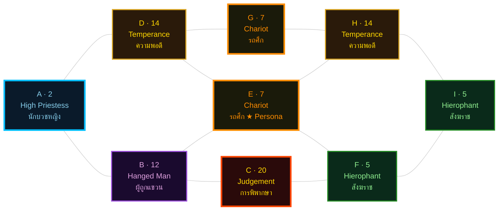
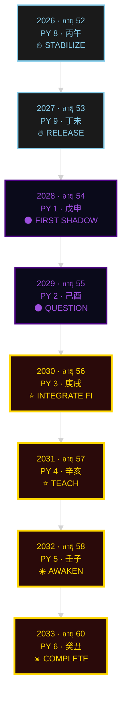

# 🔮 พยากรณ์ฉบับสมบูรณ์: Project Omni-Self (Chai)

**ชื่อผู้รับคำพยากรณ์:** Chai | **วันเกิด:** 2 ธันวาคม 1973 | **Type:** ISTJ (Si-Te) | **Role:** ผู้อำนวยการสำนักงาน (Office Director) | **Forecast window:** 2026-2033 (อายุ 52-60 ปีบริบูรณ์)

> *"The privilege of a lifetime is to become who you truly are."* — Carl Gustav Jung
>
> *"ไม่มีอะไรนิ่ง ทุกอย่างเคลื่อนไหว ทุกอย่างเต้นรำ"* — The Kybalion

---

## บทนำ · ทำไมต้อง 6 มุมมอง

พยากรณ์ฉบับนี้อ่านชะตาของ **Chai (เกิด 2 ธันวาคม ค.ศ. 1973)** ผ่าน **6 มุมมองเชิงลึก** ที่มาจากภูมิปัญญาต่างยุค ทั้งหกมุมมองอ่าน Matrix 9 จุดเดียวกัน (2/12/20 · 14/7/5 · 7/14/5) และ BaZi 4 เสาเดียวกัน (癸丑/癸亥/壬申/?) แต่ตั้งคำถามต่างกัน ตอบต่างกัน และให้ภาพที่ลึกขึ้นเมื่อนำมาประกอบกัน

จุดเด่นที่สุดของ Matrix Chai คือ **"สามเสียงสะท้อน" (Triple Echo)** — ตัวเลข **5, 7, 14** ปรากฏคนละ 2 ครั้ง ใน 9 ช่อง สร้างลายเซ็นเฉพาะที่บอกว่า Chai เกิดมาเพื่อ **"หลอมรวมสิ่งที่ขัดแย้ง"** (14 Temperance × 2) ผ่าน **"พลังของการควบคุม"** (7 Chariot × 2) และ **"การสอน/ส่งต่อ"** (5 Hierophant × 2) นี่ไม่ใช่ความบังเอิญ นี่คือลายเซ็นของจักรวาลที่บอกว่า Chai เกิดมาเพื่อ **"รักษาระเบียบ แต่ต้องเรียนรู้ที่จะปล่อย"**

Day Master ของ Chai คือ **壬 (Yang Water)** — น้ำมหาสมุทรที่ไหลไปทุกที่ ไม่หยุด ไม่เปลี่ยนรูป แต่ปรับตัวตามภาชนะ บริบท Office Director ที่ **"บริหารจัดการระบบ ระเบียบปฏิบัติ โครงสร้างองค์กรที่มั่นคง และการตัดสินใจบนพื้นฐานข้อเท็จจริง"** คือ "ภาชนะ" ที่ Day Master 壬 ไหลอยู่ในช่วงอายุ 52-60 — ช่วงก่อนเกษียณที่ **Period 9 (Fire dominant 2024-2043)** กำลังท้าทาย "ความมั่นคงแบบดั้งเดิม" ของ ISTJ วัยกลางคน

คุณไม่จำเป็นต้องเชื่อทุกมุมมอง แต่ควรอ่านทั้งหกแล้วเก็บไว้ใช้ตอนที่ชีวิตถามคำถามที่ตรงกับมุมมองนั้น

### มุมมองทั้ง 6 คือ:
1. **คาร์ล ยุง** — จิตวิทยาเชิงลึก (Persona, Shadow, Individuation)
2. **เฮเลนา บลาวัตสกี้** — กฎแห่งการดึงดูด (Law of Attraction, Theosophy)
3. **Three Initiates (Kybalion)** — 7 หลักการเฮอร์เมติก
4. **ไอซาเบล บริกส์ ไมเออร์ส** — MBTI (ฟังก์ชันจิต 4 ชั้น)
5. **นาตาเลีย ลาดินี (Octagram)** — ดาว 8 แฉก และพยากรณ์อายุ 60
6. **ซู หยูหง (BaZi)** — โหราศาสตร์จีน 8 เสา + Period 9

---

<section id="summary">

## 🌟 ส่วนที่ 1: บทสรุป 6 มุมมองเชิงลึก

### 1. Carl Jung: Persona และ Shadow

**Persona:** "ผู้พิทักษ์แห่งความเป็นระเบียบ" (Guardian of Order) — แกน Si-Te ของ ISTJ ทำให้ Chai เป็น "คนที่จำทุกอย่าง" "คนที่จับผิดทุกอย่าง" "คนที่ไม่เคยพลาด deadline" "คนที่ทีมเคารพแต่บางครั้งก็หงุดหริด" — ใน Matrix ตำแหน่ง E=7 และ G=7 (Chariot × 2) คือหน้ากากที่ "หนาที่สุด" ในชีวิต

**Shadow:** "ผู้มองเห็นอนาคตที่ไม่กล้าพูด" (Reluctant Visionary) — Ne (inferior) ที่ "ปิดตาย" มา 30 ปี เมื่อระบบรวนจะ "ระเบิด" ออกมาเป็น **catastrophizing** (เห็น scenario แย่ ๆ ทุกอย่างพร้อมกัน) และ Si-Fi Loop (เก็บอารมณ์ ตัดสินคนในใจ) เมื่อ Persona "ภารโรง" ถูกท้าทาย

**Anima (A=2):** High Priestess — สัญชาตญาณที่บอกว่า "ในห้องประชุมนี้ มีคน 1 คนที่ไม่จริงใจ" "กระทรวงกำลังจะเปลี่ยนนโยบาย" — Persona "ภารโรง" ปิดไว้ แต่ Ego ต้อง "ปลดปล่อย"

**Self (C=20):** Judgement — การตื่นจากความตายของ Persona "ภารโรง" — พลังที่รอการปลุกเมื่อ Chai อายุ 60

### 2. Helena Blavatsky: แรงดึงดูดจากความถี่เด่น

ความถี่หลักของ Chai คือ **"ความแม่นยำที่จับต้องได้" (Tangible Precision)** — Si (Introverted Sensing) คือคลื่นแห่งความจำเชิงประสาทสัมผัส + Te (Extraverted Thinking) คือคลื่นแห่งประสิทธิภาพที่ส่งออกสู่โลก เมื่อสองคลื่นซ้อนกัน Chai สั่นที่ความถี่ "ความแม่นยำที่แสดงออกมาในรูปที่จับต้องได้" — เป็นระบบ เป็นแผนภาพ เป็นเอกสาร ที่คนอื่นหยิบขึ้นมาทำตามได้ทันที

ตามหลัก *Like Attracts Like* ความถี่ของ Chai จะดึงดูด:
1. **ผู้คนและทีมที่ทำงานด้วยโครงสร้างเดียวกัน** — Business Analyst, QA, Compliance Officer ที่ชอบเอกสาร
2. **ปัญหาที่ต้องการความแม่นยำ** — ระเบียบที่กำกวม กฎหมายใหม่ที่ขัดกัน edge case ที่เอกสารไม่ได้บอก
3. **โอกาสที่เปิดทางให้คนที่เป็นระบบ** — Period 9 (2024-2043) กำลังเร่งให้ทุกองค์กรต้องปรับโครงสร้าง Chai จะดึงดูดบทบาทที่ต้อง **"สร้างระเบียบใหม่ให้ทันยุค"**

### 3. The Kybalion: จังหวะและเหตุผลในชีวิต

**Mentalism:** "The All is Mind" — ISTJ (Si-Te) ไม่ได้เริ่มจาก "จิต" แต่เริ่มจาก "ข้อมูลที่จับต้องได้" แล้วค่อยใช้ Te จัดระเบียบ Chai เป็นคนที่ "ต้องเห็นหลักฐานก่อนเชื่อ" — Kybalion จะสอนให้ Chai "เปิดรับวิสัยทัศน์" ไม่ใช่แค่ "ทำตามระเบียบ"

**Vibration:** "Nothing rests" — ISTJ มีความถี่ "ช้า สม่ำเสมอ หนักแน่น" เหมือน metronome ที่ติ๊กด้วยจังหวะเดิม Chai อยู่ใน "ความถี่ต่ำ" ของ Vibration spectrum — เขาจะไม่กระโดดไปทำงานใหม่ทุกปี แต่จะ **"ทำงานเดิมให้ดีขึ้นทุกปี"**

**Rhythm:** "Everything flows" — Rhythm ของ ISTJ วัย 52-60 คือ **"long pendulum"** — แกว่งทุก 7-10 ปี Chai จะมี "down-cycle" แล้ว "up-cycle" ที่สูงกว่า — เมื่อ Chai อายุ 60 pendulum จะอยู่ที่ **"ตำแหน่งครู"** — Chai จะเป็น "ที่ปรึกษา" ที่คนอื่นมาหา

**Polarity:** "Everything is dual" — ขั้วสำคัญของ Chai คือ **ระเบียบ ↔ ความยืดหยุ่น (Si ↔ Ne)** — ในช่วงอายุ 52-60 Chai ต้องเรียนรู้ **"เลื่อน"** จาก "ยึดระเบียบ" ไป "เปิดรับความยืดหยุ่น" อย่างคล่องแคล่ว — นี่คือ Temperance (14×2) ที่ Matrix บอกว่าเป็น "ความสามารถในการหลอมรวมสิ่งที่ขัดแย้ง"

### 4. MBTI: Cognitive Function หลัก (Si/Te) และจุดบอด (Ne Grip / Fi Loop)

**Function stack:** Si (dominant) → Te (auxiliary) → Fi (tertiary) → Ne (inferior)

**จุดแข็ง:**
- **Si+Te** = "ภารโรง/ผู้พิทักษ์" — จำทุกอย่าง วัดทุกอย่าง จัดระเบียบทุกอย่าง ตรวจสอบได้ ทำซ้ำได้
- **Si-Anchor** = กลยุทธ์ตัดสินใจที่ใช้ "อดีตที่พิสูจน์แล้ว" เป็นฐาน — เหมาะกับการ "ปิดงาน" และ "ส่งมอบ Persona"

**จุดบอด (จุดอ่อน):**
- **Ne-Grip (catastrophizing เมื่อระบบรวน):** เมื่อระบบรวน Chai จะ "เห็น" scenario แย่ ๆ ทุกอย่างพร้อมกัน ในจังหวะที่สิ่งที่เคยมั่นคงกำลังจะเปลี่ยน — เป็น **"วงจร catastrophic scenario"** ที่หมุนเร็วจน Chai "หยุดตัดสินใจ" กลายเป็น "คนที่ต้อง 'คิด' ก่อนทำ" ทั้งที่จริง ๆ แล้ว Chai ไม่รู้จะคิดอะไร
- **Fi Loop (เก็บอารมณ์ ตัดสินคนในใจ):** เมื่อ Te ถูกบล็อก Ego จะวน loop ระหว่าง Si กับ Fi โดยข้าม Te ไป — Chai จะ "ทบทวนอดีตซ้ำ ๆ" "เก็บ" ความน้อยใจ "ตัดสิน" คนในใจ — เป็น **"organizational disengagement"** ที่นำไปสู่การลาออก
- **Te-Overextension:** ทำงานหนักจนหมดไฟ — เพราะ Te ไม่รู้จัก "หยุด"

### 5. Age 60 Forecast: เป้าหมายสูงสุดวัย 60

Chai อายุ 60 ในปี 2033 (พ.ศ. 2576) — ปีที่ **Personal Year = 6** (Personal Year cycle 2026=8 → 2027=9 → 2028=1 → 2029=2 → 2030=3 → 2031=4 → 2032=5 → **2033=6**) — คือปีที่ **Year Branch (丑) กลับมา** (natal year-branch return) + **Day Master Stem (壬) ผ่าน 壬 Year Stem ในปี 2032 (PY=5)** — คือปีที่ **Mandala ครบ 4 ทิศ (Si+Te+Fi+Ne)**

**เป้าหมายสูงสุด:** Chai ไม่ใช่ **"ผู้อำนวยการที่สมบูรณ์แบบ"** แต่คือ **"ปราชญ์ที่รู้ว่าชีวิตไม่ต้องสมบูรณ์แบบเพื่อจะมีค่า"** — เขาจะกลายเป็น **"ครู"** (Hierophant × 2 ตื่น) ที่ "ส่งต่อ" Persona ให้ลูกน้อง และ "ปล่อย" ความต้องการ "ควบคุมทุกอย่าง" — เขาจะรู้ว่า **"คุณค่าที่แท้จริงไม่ได้อยู่ที่ระเบียบที่เขียน แต่อยู่ที่คนที่เขาสอน"**

### 6. BaZi & Period 9: ดิถีธาตุ การปรับสมดุล และเทรนด์ยุค 9

**Day Master:** 壬 (Yang Water) — Day Pillar 壬申 — Day Branch 申 (Monkey) — Nayin 剑锋金 (Sword-Edge Metal)
**Full chart:** 年 癸丑 · 月 癸亥 · 日 壬申 · 時 ? (birth time not provided)

**Day Master is Strong (身旺)** เพราะ 壬 born in 亥月 (Yin Water month) = 壬 坐 壬 main-qi ของ Month Branch + 申 Day Branch contains 庚 (Yin Metal resource for Water) — เป็น Day Master ที่ "แข็งแรงมาก"

**用神 (Useful God) = Earth (戊己)** เพื่อ channel excess water ออกไปเป็น "ผลผลิต"
**喜神 (Favorable God) = Metal (庚辛)** เพราะ Metal produces Water
**忌神 (Avoid God) = Wood (甲乙)** เพราะ Wood consumes Water
**仇神 (Enemy God) = Fire (丙丁)** เพราะ Fire controls Water

**Period 9 (Fire dominant 2024-2043) = 仇神 era** — Day Master 壬 (Water) เจอยุคที่ Fire controls Water — เป็น **"Fire challenge"** ที่ Chai ต้อง "transmute" โดยใช้ Earth (output channel) และ Metal (peer support) เป็น stabilizers

</section>

---

<section id="cosmic-synergy">

## 🌌 ส่วนที่ 2: จุดเชื่อมโยงแห่งปรัชญาและวัฏจักร (The Cosmic Synergy)

### การทำงานร่วมกันของศาสตร์: The Kybalion + Law of Attraction + ลูปพลังงาน Matrix

**6 ศาสตร์ทำงานสอดคล้องกันในดวงชะตาของ Chai อย่างไร:**

เมื่อมองผ่าน **The Kybalion (Rhythm + Mentalism + Polarity)** เราจะเห็นว่า "ชะตา" ของ Chai ไม่ใช่ "สิ่งที่ถูกลิขิตไว้แล้ว" แต่คือ **"แผนที่ของจังหวะชีวิต"** (Rhythm) ที่ Ego สามารถ **"ปรับความถี่"** (Vibration) เพื่อ **"ดึงดูด"** (Law of Attraction / Helena Blavatsky) สิ่งที่ตรงกับ Persona ได้

**Matrix 9 จุด** คือ **"แผนที่ของความถี่"** — แต่ละช่องคือความถี่หนึ่งที่ทำงานพร้อมกัน Echo {5, 7, 14} คือ **"เสียงสะท้อนที่ดังที่สุด"** — บอกว่า "ครู" (5) "ผู้ควบคุม" (7) "ผู้หลอมรวม" (14) เป็น **"แกนหลักของจิต"** ที่ Ego ต้อง "ตื่น" ในช่วงอายุ 52-60

**BaZi 4 เสา** คือ **"แผนที่ของเวลา"** — Day Master 壬 (Yang Water) ที่ "แข็งแรงมาก" (身旺) ในยุค Period 9 (Fire dominant) จะถูก "ท้าทาย" ให้ "transmute" โดยใช้ Earth (output) และ Metal (resource) เป็น stabilizers — นี่คือ **"จังหวะของจักรวาล"** (Rhythm) ที่ทำงานสอดคล้องกับ **"ความถี่ของจิต"** (Vibration) ของ Chai

**MBTI (Si-Te กับ Ne-Fi shadow)** คือ **"กลไกการประมวลผล"** ที่ Ego ใช้ — เมื่อ dominant/auxiliary (Si/Te) "ล้า" inferior (Ne) จะ "ระเบิด" ออกมาเป็น catastrophizing — นี่คือ **"Polarity"** ของ Kybalion ที่ "ทุกสิ่งเป็นคู่" — เงาที่ซ่อนอยู่เป็น "ขั้วตรงข้าม" ของ Persona

**Carl Jung (Persona/Shadow/Individuation)** คือ **"แผนที่ของจิต"** — Persona "ผู้พิทักษ์" (E=7, G=7) ที่หนาที่สุด ต้อง "สละ" พื้นที่ให้ Anima (A=2 High Priestess) และ Self (C=20 Judgement) — นี่คือ **"การเดินทางของ Individuation"** ที่ทำงานสอดคล้องกับ **"จังหวะของชีวิต"** 8 ปี (52-60)

**สรุป:** 6 ศาสตร์ไม่ได้ "ขัดแย้ง" กัน แต่ **"สะท้อน"** กันในระดับต่าง ๆ:
- **Kybalion (Rhythm + Vibration)** = กลไกของจักรวาล
- **Law of Attraction (Blavatsky)** = กลไกของการดึงดูด
- **Matrix (Natalia Ladini)** = แผนที่ของจิต
- **BaZi (Su Yu Hong)** = แผนที่ของเวลา
- **MBTI (Isabel Briggs Myers)** = กลไกการประมวลผล
- **Carl Jung** = แผนที่ของการเดินทาง

ทั้งหมดนี้ **"ทำงานร่วมกัน"** เพื่อบอกว่า **"Chai เกิดมาเพื่อเดินทางจาก 'ผู้พิทักษ์' สู่ 'ปราชญ์' จาก 'ผู้จำ' สู่ 'ผู้สอน' จาก Persona สู่ Self"**

</section>

---

<section id="natal-square">

## 🧬 ส่วนที่ 3: โปรแกรมชีวิตและแกนหลัก (Natalia Square 3x3)

### Matrix 3x3 (สูตร Natalia Ladini, verified)

| Cell | Value | Computation |
|---|---|---|
| **A** | 2 | Day-of-month = 2 (kept as-is) |
| **B** | 12 | Month = 12 (kept as-is, ≤22) |
| **C** | 20 | Year digit-sum = 1+9+7+3 = 20 (≤22, kept) |
| **D** | 14 | A+B = 2+12 = 14 (kept) |
| **E** | 7 | A+B+C = 34 → 3+4 = 7 |
| **F** | 5 | B+C = 32 → 3+2 = 5 |
| **G** | 7 | mirror(E) = 7 |
| **H** | 14 | mirror(D) = 14 |
| **I** | 5 | mirror(F) = 5 |

### แกนหลัก 3 แกน

- **แกนบน (2-12-20):** "แกนแห่งการรับรู้" — High Priestess (2) → Hanged Man (12) → Judgement (20) — เส้นทางจาก "สัญชาตญาณ" ผ่าน "การเสียสละ/การรอคอย" ไปสู่ "การตื่น"
- **แกนกลาง (14-7-5):** "แกนแห่งการแสดงออก" — Temperance (14) → Chariot (7) → Hierophant (5) — เส้นทางจาก "การหลอมรวม" ผ่าน "การควบคุม" ไปสู่ "การสอน" — **นี่คือแกนหลักของชีวิต Chai** ในช่วงอายุ 52-60
- **แกนล่าง (7-14-5):** "แกนแห่งรากฐาน" — Chariot (7) → Temperance (14) → Hierophant (5) — รากฐานของ "พลัง" "ความยืดหยุ่น" "การสอน" ที่ซ้ำกับแกนกลาง (Echo!)

### Echo Numbers (5, 7, 14) — Triple Amplification

| Value | Archetype | Position | Echo Interpretation |
|---|---|---|---|
| **5** | Hierophant × 2 | F, I | **"ครู"** ที่รอการปลุก — ในช่วงอายุ 56-60 (Stage 3) Ego จะเริ่ม "เปิด" ให้ Persona "ขยาย" เป็น "ครู" |
| **7** | Chariot × 2 | E, G | **Persona "ผู้พิทักษ์"** ที่หนาที่สุด — ใน Stage 1 (อายุ 52-53) Persona จะ "แข็งที่สุด" เพราะ Ego ต้อง "ปิด" ทุกโปรเจกต์ที่ค้าง |
| **14** | Temperance × 2 | D, H | **Shadow "ความยืดหยุ่น"** ที่ถูกปฏิเสธ — ใน Stage 4 (อายุ 58-60) Ego จะ "หลอมรวม" Persona+Anima+Self ผ่าน "การยืดหยุ่น" ที่ Persona "ภารโรง" เคยปฏิเสธ |

### แผนภาพ Mermaid 3x3

### Energy Centers (E, F, H) — Heart + Lateral Echoes

- **Heart (E=7):** Chariot — Persona archetype — "พลังที่ควบคุมผ่านวินัย"
- **Lateral Left (H=14):** Temperance — Shadow archetype — "ความยืดหยุ่นที่ซ่อนเร้น"
- **Lateral Right (F=5):** Hierophant — "ครู" ที่รอการปลุก

**Energy Center Layout:**
- **แนวตั้ง (E→B→H):** Chariot → Hanged Man → Temperance = Ego ที่ "ควบคุม" ผ่าน "การเสียสละ" ไปสู่ "ความพอดี"
- **แนวนอน (D→E→F):** Temperance → Chariot → Hierophant = "ความพอดี" ผ่าน "การควบคุม" ไปสู่ "การสอน" — **นี่คือเส้นทางของ Chai ในช่วงอายุ 52-60**

</section>

---

<section id="talent-karma">

## 💎 ส่วนที่ 4: พรสวรรค์ ศักยภาพ และอดีตชาติ

### พรสวรรค์และศักยภาพแฝง

**จุดเด่นด้านความละเอียดรอบคอบ (Si dominant):**
- **"คลังข้อมูลในหัวที่ไม่เคยลบ"** — Chai จำได้ว่าระเบียบฉบับไหนเคยใช้ได้ กระบวนการไหนเคยพัง CEO คนไหนชอบ micromanage หน่วยงานรัฐไหนเคยเปลี่ยนนโยบายกะทันหัน — เขา "รู้" ว่าความผิดพลาดเดิม ๆ จะกลับมาในรูปแบบใหม่
- **"นาฬิกาชีวภาพขององค์กร"** — Chai รู้สึกได้ว่าองค์กรกำลังจะ "ทำผิดทาง" ก่อนที่ KPI จะตก
- **"ผู้พิทักษ์ความต่อเนื่อง"** — เขาทำให้ "ทุกอย่างที่เคยดี ยังดีอยู่" แม้โลกจะเปลี่ยนเร็วแค่ไหน

**จุดเด่นด้านความรับผิดชอบสูง (Te auxiliary):**
- **"ไม้บรรทัดที่วัดโลกภายนอก"** — Te แปลง "ความจำ" ของ Si เป็น "มาตรฐาน" ที่องค์กร + หน่วยงานรัฐสามารถนำไปปฏิบัติได้ — SOP, checklist, SLA, audit log
- **"ผู้บริหารระดับสูงเชื่อโดยไม่ต้องถาม"** — เพราะ Te ของเขา "พูดภาษาที่วัดได้" ไม่ใช่ "ภาษาที่ขายได้"
- **"ผู้ปิดงานที่ไม่มีใครปิดได้"** — Chai จะปิดทุกโปรเจกต์ที่ค้างใน Stage 1 (52-53) ด้วย Te

**จุดเด่นด้านการรักษาระบบให้ดำเนินไปอย่างราบรื่น (Echo 7 Chariot × 2):**
- **"ระบบที่ลูกน้องเชื่อถือ"** — เมื่อ Chai พูดว่า "กระบวนการนี้ผ่านการตรวจสอบแล้ว" ลูกน้องจะ "ทำตาม" โดยไม่ต้องถาม
- **"ผู้พิทักษ์ 'มาตรฐาน' ขององค์กร"** — เมื่อมีคนพยายาม "ทำลายระเบียบ" Chai จะ "ปกป้อง" ด้วย Si+Te

**ศักยภาพแฝง (ที่ Persona "ปิด" ไว้):**
- **Hierophant (5) × 2:** "ครู" ที่รอการปลุก — ใน Stage 3 (56-57) Chai จะเริ่ม "สอน" ลูกน้องจริง ๆ ไม่ใช่แค่ "ทำงานให้" — เขาจะค้นพบว่าการ "สอน" ไม่ได้ "เสียเวลา" แต่คือ "การส่งต่อ Si+Te ของเขาไปยังคนรุ่นใหม่"
- **Temperance (14) × 2:** "ความยืดหยุ่น" ที่ Persona "ภารโรง" เคยปฏิเสธ — ใน Stage 4 (58-60) Chai จะ "หลอมรวม" Persona+Anima+Self ผ่าน "การยืดหยุ่น" — เขาจะรู้ว่า "ความยืดหยุ่นไม่ใช่จุดอ่อน แต่คือ 'การหลอมรวมสิ่งที่ขัดแย้ง'"
- **High Priestess (A=2):** Anima — สัญชาตญาณที่ Persona "ปิด" ไว้ — ใน Stage 3 (56-57) Ego จะ "ปลดปล่อย" Anima — เขาจะเริ่ม "รู้สึก" ว่าอะไร "สวย" อะไร "จริง" อะไร "มีค่า" — ไม่ใช่แค่ "ถูก" หรือ "ผิด"

### ชีวิตในอดีตและหางกรรม (Karmic Tail)

**Karmic Tail ของ Chai** ตามที่ Matrix บอกไว้ที่ **C=20 (Judgement) ที่ยังไม่ถูกปลดปล่อย** และ **D=14 (Temperance) ที่ถูกปฏิเสธ**:

- **บทเรียนจากอดีต:** ในชาติก่อน Chai เคย "ใช้อำนาจ" ในทางที่ "ไม่ยืดหยุ่น" — เขาเคย "บังคับ" คนรอบข้างให้ทำตาม "ระเบียบ" โดยไม่ฟัง "เสียงข้างใน" ของพวกเขา — นี่คือเหตุที่ Temperance (14) ถูก "ปฏิเสธ" ในชาตินี้ Ego ของ Chai "กลัว" ความยืดหยุ่นเพราะ "กลัว" ว่าจะ "ทำผิด" เหมือนในอดีต
- **หางกรรม (Karmic Tail) ที่ต้องปลดล็อก:** Chai ต้อง "เรียนรู้" ว่า **"ความยืดหยุ่น" ไม่ใช่ "การยอม"** แต่คือ **"การหลอมรวมสิ่งที่ขัดแย้ง"** — เมื่อเขา "เรียนรู้" ที่จะ "ฟัง" ลูกน้อง "ฟัง" Anima (สัญชาตญาณ) "ฟัง" จังหวะของ Period 9 (Fire) — Temperance (14) จะ "ตื่น" และ Ego จะ "ครบ"
- **บทเรียน:** Ego ต้อง **"ตื่น"** จาก Persona "ภารโรง" ผ่าน **Judgement (C=20)** — เมื่อ "ตื่น" แล้ว Chai จะ "เห็น" ว่า "งาน 30 ปีที่ผ่านมา ไม่ได้สูญเปล่า" แต่คือ "รากฐาน" ที่ "ส่งต่อ" ให้ลูกน้องได้

</section>

---

<section id="success-roles">

## 💼 ส่วนที่ 5: การประสบความสำเร็จและบทบาทเชิงลึก

### สายการทำงาน/อาชีพ: ทิศทางการบริหารและการสร้างเสถียรภาพทิ้งทวนในฐานะผู้อำนวยการสำนักงาน

Chai เป็น **ผู้อำนวยการสำนักงาน (Office Director)** — ตำแหน่งที่ "สะสม" มาจากการ **เขียนระเบียบปฏิบัติ** เป็นพัน ๆ หน้า นั่งอ่าน **กฎหมาย กฎระเบียบ** จนตาแฉะ ฟัง **กระทรวง หน่วยงานรัฐ** จนเข้าใจว่า "อำนาจที่แท้จริง" อยู่ตรงไหน

**ทิศทางการบริหาร (อายุ 52-60):**

| Stage | Age | Year | PY | Theme | Strategy |
|---|---|---|---|---|---|
| 1 | 52-53 | 2026-2027 | 8→9 | Stabilize + Close Out | **"ปิดทุกโปรเจกต์"** — Si+Te ทำงานหนักที่สุด, เริ่ม train ลูกน้อง (Hierophant เริ่มตื่น) |
| 2 | 54-55 | 2028-2029 | 1→2 | First Shadow | **"เผชิญเกษียญใกล้เข้ามา"** — Ne-Grip เริ่มปะทุ, ใช้ Si-Anchor เพื่อรักษาสมดุล |
| 3 | 56-57 | 2030-2031 | 3→4 | Integrate Fi | **"กลายเป็นครู"** — เปิดให้ Persona "ขยาย" เป็น "ครู", Anima ตื่น |
| 4 | 58-60 | 2032-2033 | 5→6 | Anima + Self | **"ครบ Mandala"** — ส่งมอบ Persona ให้ลูกน้อง, Judgement ตื่น, กลายเป็น "ปราชญ์" |

### บทบาทเชิงลึก (พร้อมเรื่องเล่าจำลองสถานการณ์การคุมหางเสือองค์กรให้เป๊ะตามมาตรฐาน)

#### เมื่อต้องเป็นผู้นำ (Boss/Director)

**สถานการณ์จำลอง: "การประชุมบอร์ดที่กรรมการหน้าใหม่ท้าทาย"**

> วันพฤหัสบดี เวลา 14:00 น. ห้องประชุมบอร์ด องค์กร Chai กรรมการหน้าใหม่ (อายุ 38) ที่เพิ่งเข้ามา 3 เดือน เปิดเอกสารระเบียบการจัดซื้อจัดจ้างที่ Chai เขียนเมื่อปี 2562 ถามเสียงดัง "พี่ Chai ครับ ระเบียบนี้เขียนไว้ 5 ปีแล้ว ใช้กับยุค 9 ได้ยังไงครับ เทคโนโลยีเปลี่ยนหมดแล้วนะครับ"
>
> ลูกน้อง 3 คนที่นั่งอยู่ในห้องเงยหน้าขึ้นมามอง Chai — พวกเขารู้ว่า "ระเบียบ" ของ Chai เป็น "ผลงานชิ้นเอก" ของเขา และพวกเขาก็ "กลัว" ว่า Chai จะ "โกรธ"
>
> Chai นั่งเงียบ 5 วินาที — Ego ของเขา "หด" เล็กน้อย แต่ Persona "ภารโรง" ของเขา "แข็ง" — เขาตอบเสียงนิ่ง:
>
> "ครับ กรรมการ ระเบียบนี้เขียนไว้ 5 ปีแล้ว แต่ 'โครงสร้าง' ของระเบียบ — คือ 'หลักการ' ที่ใช้ได้กับทุกยุค ผมเสนอให้เรา 'review' ระเบียบนี้ทุก 2 ปี และผมจะ 'นั่ง' กับทีม 'tech' เพื่อ 'อัปเดต' ให้ทันยุค 9 ภายใน Q4 ปีนี้ครับ"
>
> กรรมการพยักหน้า "OK พี่ Chai ขอบคุณครับ" — ลูกน้อง 3 คน "ถอนหายใจ" เบา ๆ

**Jungian decoding:** Chai ใช้ **Si-Anchor (อดีต)** + **Te-Strategy (แผน)** + **"เปิดทาง"** ให้ Hierophant (5) เริ่มทำงาน — Ego ไม่ได้ "ปกป้อง Persona" แบบ "ตั้งรับ" แต่ "ขยาย Persona" แบบ "เชิงรุก" — นี่คือ **"การสอน"** ที่ Persona "ภารโรง" เคย "ปิด" ไว้

#### เมื่อเป็นผู้ตาม (เมื่อต้องรับนโยบายจากผู้บริหารระดับสูงกว่าหรือหน่วยงานรัฐ)

**สถานการณ์จำลอง: "กระทรวงประกาศระเบียบใหม่กะทันหัน"**

> วันศุกร์ เวลา 18:00 น. กระทรวงประกาศ "ระเบียบการจัดซื้อจัดจ้างภาครัฐฉบับใหม่ มีผลบังคับใช้ใน 7 วัน" — ประกาศที่ "ล้ม" ระเบียบที่ Chai ใช้มา 20 ปี
>
> CEO ส่ง email มาตอน 19:00 น. "พี่ Chai พรุ่งนี้เช้าประชุมด่วน 09:00 น. ขอให้เตรียมแผนรับมือระเบียบใหม่"
>
> Chai อ่าน email แล้ว "เงียบ" ไป 5 นาที — **Ne-Grip เริ่มทำงาน** — scenario แย่ ๆ หมุนในหัว "จะเกิดอะไรขึ้นถ้าทัน deadlines ไม่ทัน" "จะเกิดอะไรขึ้นถ้าบอร์ดโทษฉัน"
>
> แต่ Chai "หยุด" — เขา "คิด" ในแบบ Si-Anchor "เมื่อปี 2547 มีการเปลี่ยนระเบียบการเงินฉบับใหม่ ตอนนั้น Chai ก็ 'panic' เหมือนกัน แต่สุดท้าย Chai ก็ 'ปรับ' ได้ เพราะ 'เอาระเบียบเก่า + ความรู้ใหม่' มา 'ผสม' กัน"
>
> เขาเปิดไฟล์ "ระเบียบเก่า" + "ระเบียบใหม่" เทียบกัน "หา pattern" ที่คล้ายกัน — เขา "ตั้ง task force 3-5 คน" ให้ "ทำการบ้าน" ใน 7 วัน แล้ว "ทบทวนด้วยกัน" ในวันจันทร์
>
> วันจันทร์ 09:00 น. Chai เปิด slide 30 หน้า (ไม่ใช่ 80 หน้าแบบที่ Ne-Grip อยากให้ทำ) — slide ที่ "ชัดเจน" "ตรงประเด็น" "มีแผน A/B/C" — CEO พยักหน้า "OK พี่ Chai ทำตามแผน A ได้เลย"

**Jungian decoding:** Chai "หยุด" Ne-Grip ด้วย **Si-Anchor** — เขา "ไม่ได้ทำ" ตามที่ Ne อยากให้ทำ (slide 80 หน้า, scenario แย่ ๆ) แต่ "กลับไปหา" อดีตที่ "พิสูจน์แล้ว" — นี่คือ **"Polarity"** ของ Kybalion ที่ "เลื่อน" จาก Ne (catastrophizing) ไป Si (anchor) อย่างคล่องแคล่ว

#### มือขวา (Active) — เมื่อต้อง "ส่ง" ระเบียบ

**สถานการณ์จำลอง: "การ train ลูกน้องใหม่"**

> เช้าวันจันทร์ น้องใหม่ 2 คน (อายุ 25) เดินเข้ามาในห้อง — พวกเขาเพิ่งเรียนจบใหม่ ๆ ตาเป็นประกาย
>
> Chai นั่งลง เปิดสไลด์ "ระเบียบการจัดซื้อจัดจ้าง" — เขา "อธิบาย" ด้วย "ตัวอย่างจริง" ไม่ใช่ "ทฤษฎี" — เขา "เล่าเรื่อง" ว่า "เมื่อปี 2562 เคยเกิดเคสนี้ ผลคืออะไร" "เมื่อปี 2564 เคยเกิดเคสนั้น ผลคืออะไร"
>
> น้องใหม่คนหนึ่งถาม "พี่ Chai ครับ ถ้าเราเจอเคสที่ระเบียบไม่ได้บอกไว้ เราควรทำยังไงครับ"
>
> Chai หยุด — เขารู้สึกอะไรบางอย่างที่เขาไม่เคยรู้สึกมา 30 ปี — **"ภูมิใจ"** — ไม่ใช่ "ภูมิใจ" แบบ Ego ที่ "ฉันเก่ง" แต่คือ "ภูมิใจ" แบบที่ "งานของฉันมีคน 'เห็น'" — เขา "ตอบ" ด้วยเสียงที่ "นิ่ง" แต่ "อบอุ่น"
>
> "น้อง เรา 'คิด' แบบนี้ครับ — เช็ค 'หลักการ' ของระเบียบก่อน ถ้า 'หลักการ' บอกว่า 'โปร่งใส ตรวจสอบได้' เราก็ 'ยึด' หลักการนั้น แล้ว 'ขอ' คำปรึกษาจากพี่ ก่อนตัดสินใจครับ"
>
> น้องใหม่ "พยักหน้า" — เขา "เข้าใจ" — ไม่ใช่ "เข้าใจ" แค่ "ระเบียบ" แต่ "เข้าใจ" **"วิธีคิด"** ของ Chai

**Jungian decoding:** นี่คือ **"การตื่นของ Hierophant (5)"** — Ego ของ Chai "เปิด" ให้ Persona "ขยาย" เป็น "ครู" — เขา "รู้สึก" ว่า "การสอน" ไม่ใช่ "เสียเวลา" แต่คือ **"การส่งต่อ Si+Te ของเขาไปยังคนรุ่นใหม่"** — นี่คือ **"Individuation"** ที่แท้จริง

#### มือซ้าย (Receptive) — เมื่อต้อง "รับ" ความเปลี่ยนแปลง

**สถานการณ์จำลอง: "CEO ใหม่ต้องการ redesign ระเบียบทั้งหมด"**

> CEO ใหม่ (อายุ 42) เข้ามา 6 เดือน ส่ง email "พี่ Chai ผมอยาก 'redesign' ระเบียบการจัดซื้อจัดจ้างทั้งหมดให้ 'ทันสมัย' กว่านี้ ขอให้พี่ 'เริ่ม' ได้เลยครับ"
>
> Chai อ่าน email แล้ว **"เงียบ"** ไป 10 นาที — **Si-Fi Loop เริ่มทำงาน** — เขา "เก็บ" ความรู้สึก "ถูก micro-manage" "ถูกท้าทาย" "ไม่ได้รับความไว้ใจ" — เขา "ตัดสิน" CEO ในใจ "CEO ใหม่ไม่เข้าใจงานของฉัน" "CEO ใหม่ไม่เคารพ 30 ปีที่ฉันสร้าง"
>
> แต่ Chai "หยุด" อีกครั้ง — เขา "คิด" ในแบบ Anima (High Priestess) — "Anima กำลัง 'พูด' ว่าอะไร?" Anima กำลัง "บอก" ว่า "คุณกำลัง 'กลัว' ที่จะ 'ปล่อย' Persona — แต่ 'การปล่อย' ไม่ได้แปลว่า 'สูญเสลา'"
>
> Chai "ตอบ" CEO "ผม 'เข้าใจ' ครับ CEO ผมจะ 'นั่ง' กับทีม 'redesign' ให้ครับ ขอเวลา 2 สัปดาห์ 'ศึกษา' ระเบียบใหม่ของกระทรวงด้วย เพื่อ 'ให้' ระเบียบใหม่ 'เข้ากัน' ได้"
>
> CEO "พยักหน้า" "OK พี่ Chai ขอบคุณครับ" — ไม่มี "conflict" — เพราะ Chai "ไม่ได้ 'ปกป้อง' Persona" แต่ "เปิด 'ประตู'" ให้ Persona "ขยาย"

**Jungian decoding:** Chai ใช้ **Anima (สัญชาตญาณ)** แทนที่จะใช้ **Si-Fi Loop (เก็บอารมณ์)** — เขา "ฟัง" Anima ที่บอกว่า "อย่า 'เก็บ' อารมณ์" แต่ "เปิด" ให้ "ความยืดหยุ่น" (Temperance × 2) ทำงาน — นี่คือ **"Polarity"** ของ Kybalion ที่ "เลื่อน" จาก Si-Fi (เก็บ) ไป Temperance (หลอมรวม)

</section>

---

<section id="relationships">

## ❤️ ส่วนที่ 6: สายสัมพันธ์ ความรัก และครอบครัว

### ความรัก การดึงดูดคนเข้าวงใน และจุดบอดอารมณ์

**Chai ดึงดูดคนเข้าวงในอย่างไร:**

ตามหลัก *Like Attracts Like* ความถี่ของ Chai (Tangible Precision) จะดึงดูด:
1. **ผู้หญิงที่ "ชอบระเบียบ"** — เช่น ครู นักบัญชี Compliance Officer แพทย์ — คนที่ "มีโครงสร้าง" ในชีวิตและ "ต้องการ" คนที่ "มั่นคง" แบบ Chai
2. **ผู้ชายที่ "ชอบผู้นำที่แข็ง"** — เช่น ลูกน้องที่จงรักภักดี ผู้ใต้บังคับบัญชาที่ "ต้องการ" ครู — คนที่ "อยากเรียนรู้" จาก Chai
3. **เพื่อนที่ "ชอบความแม่นยำ"** — เช่น เพื่อนเก่าที่โรงเรียน เพื่อนร่วมงานที่ "เข้าใจ" Persona "ภารโรง"

**จุดบอดอารมณ์:**

Chai มี **Fi tertiary** ที่ "ถูกกด" มา 50 ปี — เขา "ไม่รู้" ว่าเขา "ต้องการ" อะไร "จริง ๆ" ในความสัมพันธ์ เขารู้แค่ว่าเขา "ทำ" อะไร — "เป็นสามีที่ดี" "เป็นพ่อที่ดี" "เป็นหัวหน้าที่ดี" — แต่เขา "ไม่รู้" ว่าเขา "รู้สึก" อะไรกับคนเหล่านั้น

**ในช่วงอายุ 56-60 (Stage 3) เมื่อ Fi เริ่ม "ตื่น":** Chai จะเริ่ม "รู้สึก" ว่าเขา "ต้องการ" อะไร "จริง ๆ" — เขาอาจ "พูด" กับภรรยาว่า "ผม 'ต้องการ' ที่จะ 'ใช้เวลา' กับคุณ 'มากขึ้น'" — สิ่งที่เขา "ไม่เคยพูด" มาก่อน — เขาอาจ "ร้องไห้" ตอนดูลูกเรียนจบ — สิ่งที่เขา "ไม่เคยแสดง" มาก่อน — นี่คือ **"การปลดปล่อย"** ที่ Persona "ภารโรง" เคย "ปิด" ไว้

### มรดกพลังงานสายตระกูล

**สายตระกูลของ Chai** (BaZi Month Pillar 癸亥) บอกว่า Chai มี **"ราก"** ที่ "อุดมสมบูรณ์" — Month Branch 亥 (Pig) มี hidden stem 壬 (Yang Water) main-qi + 甲 (Yang Wood) — นี่คือ **"สายเลือด"** ของคนที่ "ไหล" ไม่หยุด แต่ "ยืดหยุ่น" ตามสถานการณ์ — นี่คือ **"มรดก"** ที่ Chai "ได้รับ" จากบรรพบุรุษ

**Year Pillar 癸丑** บอกว่า Chai มี **"ราก"** ที่ "มั่นคง" — 丑 (Ox) มี hidden stems 己 (Yin Earth) main-qi + 癸 (Yin Water) + 辛 (Yin Metal) — นี่คือ **"มรดก"** ของ "ความอดทน" "ความเป็นระเบียบ" "การทำงานหนัก" — นี่คือ **"รากฐาน"** ที่ Chai "สร้าง" บน Persona "ภารโรง" ของเขา

**Karmic Debt (กรรมที่ต้องชดใช้):** สายตระกูลของ Chai อาจ "เคย" ใช้ "อำนาจ" ในทางที่ "ไม่ยืดหยุ่น" — นี่คือ "เหตุ" ที่ Temperance (14×2) ถูก "ปฏิเสธ" ในชาตินี้ — Chai ต้อง "เรียนรู้" ที่จะ "หลอมรวม" ความยืดหยุ่นเข้ากับชีวิต เพื่อ "ชดใช้" กรรมนี้

</section>

---

<section id="health">

## 🧘‍♂️ ส่วนที่ 7: สุขภาพและจุดอ่อน (Health Card & Chakras)

### จุดอ่อนทางสุขภาพ

**เน้นปัญหาสุขภาพของผู้บริหารที่แบกรับความรับผิดชอบสูง ทำงานเป็นรูทีน และความเครียดที่เกิดจากความไม่เป็นระเบียบ:**

#### ระบบย่อยอาหาร (脾胃 / Earth element)

ISTJ ที่ใช้ Si+Te หนัก ๆ จะ "สะสม" ความเครียดใน **กระเพาะอาหาร + ลำไส้** — อาการที่พบบ่อย:
- **กรดไหลย้อน** — เมื่อ "เครียด" จาก "ระบบรวน" หรือ "ถูกท้าทาย"
- **ท้องผูกเรื้อรัง** — เพราะ "กลัว" ที่จะ "ปล่อย" — เช่นเดียวกับ "กลัว" ที่จะ "ปล่อย" Persona
- **โรคกระเพาะ** — เพราะ "ทำงาน" ไม่เป็นเวลา "กิน" ไม่เป็นเวลา

**วิธีปรับสมดุล:** ใช้ **用神 (Earth)** ที่ BaZi แนะนำ — ในทางสุขภาพ Earth = "ดิน" = "ภาวะดิน" — กิน "อาหารที่มี Earth element" เช่น ข้าวกล้อง ถั่ว ผักราก — และ "กินเป็นเวลา"

#### ระบบกล้ามเนื้อและกระดูก (筋骨 / Si overload)

ISTJ ที่ "นั่ง" ทำงาน 8-10 ชั่วโมงต่อวัน จะ "สะสม" ความตึงใน **คอ บ่า ไหล่ หลัง** — อาการที่พบบ่อย:
- **ปวดคอเรื้อรัง** — เพราะ "เก็บ" ความเครียดไว้ที่คอ
- **ปวดหลัง** — เพราะ "แบก" ความรับผิดชอบไว้ที่หลัง
- **นอนไม่หลับ** — เพราะ "scenario แย่ ๆ" หมุนในหัวตอนกลางคืน (Ne-Grip)

**วิธีปรับสมดุล:** **"ออกกำลังกาย"** เบา ๆ — เดินเร็ว 30 นาทีต่อวัน + **"ยืดกล้ามเนื้อ"** ทุก 2 ชั่วโมง + **"นอนให้เป็นเวลา"**

#### ระบบประสาท (心神 / Si-Ne imbalance)

ISTJ ที่ "Si หนัก" "Ne เบา" จะ "สะสม" ความเครียดใน **ระบบประสาท** — อาการที่พบบ่อย:
- **ปวดหัวเรื้อรัง** — เพราะ "คิดมาก" "วางแผนมาก"
- **ความจำเสื่อมเล็กน้อย** — เพราะ Ego "เก็บ" ทุกอย่างจน "ลืม" บางอย่าง (compensation)
- **วิตกกังวล** — เพราะ "กลัว" ความไม่แน่นอน

**วิธีปรับสมดุล:** **"ทำสมาธิ"** 15 นาทีต่อวัน + **"เขียน journal"** ก่อนนอน + **"พูด"** กับคนที่ไว้ใจ

### Chakras

#### Crown Chakra (Sahasrara) — จุดเชื่อมต่อจักรวาล

**สถานะปัจจุบัน:** เปิด 70% — Chai "เข้าใจ" ความหมายของงานที่เขาทำ แต่ "ไม่ได้" เชื่อมต่อกับ "จักรวาล" อย่างเต็มที่

**วิธีปรับสมดุล:**
- **"ทำสมาธิ"** 15 นาทีต่อวัน — focus ที่ "ยอดศีรษะ"
- **"อ่านหนังสือ"** ที่ "ลึก" — เช่น ปรัชญา ศาสนา — ไม่ใช่แค่ "คู่มือการทำงาน"
- **"ฟัง"** เสียง "เงียบ" — ไม่ใช่แค่ "ฟัง" คนพูด

#### Solar Plexus Chakra (Manipura) — จุดพลังแห่งตน

**สถานะปัจจุบัน:** เปิด 90% — Chai "มีพลัง" ในการ "ทำงาน" "ตัดสินใจ" "ควบคุม" — แต่ "พลัง" นี้ "หนัก" เกินไป จน Ego "เหนื่อย"

**วิธีปรับสมดุล:**
- **"หยุดพัก"** 1 วันต่อสัปดาห์ — อย่า "ทำงาน" 7 วันติด
- **"ปล่อย"** — เรียนรู้ที่จะ "ปล่อย" Persona "ภารโรง" ในบางเวลา
- **"เล่น"** — ทำกิจกรรมที่ "สนุก" ไม่ใช่แค่ "มีประโยชน์"

#### Root Chakra (Muladhara) — จุดหยั่งรากแห่งความมั่นคง

**สถานะปัจจุบัน:** เปิด 95% — Chai "หยั่งราก" ใน "ครอบครัว" "องค์กร" "ประเทศ" "ศาสนา" ได้ดีมาก — แต่ "ราก" นี้ "แน่น" เกินไป จน Ego "กลัว" ที่จะ "ขยับ"

**วิธีปรับสมดุล:**
- **"เดินทาง"** — ออกจาก "เขตความสะดวก" ไปสู่ "ที่ใหม่"
- **"เรียนรู้"** สิ่งใหม่ — ไม่ใช่แค่ "ทำซ้ำ" สิ่งเดิม
- **"ปล่อย"** — เรียนรู้ที่จะ "ปล่อย" ความ "ยึดติด" กับ "ระเบียบ"

</section>

---

<section id="timeline-forecast">

## 📈 ส่วนที่ 8: ไทม์ไลน์ 5 ช่วงวัย และพยากรณ์รายปี

### 8.1 ไทม์ไลน์ 5 ช่วงวัยก่อนจุดบรรจบ (ตั้งแต่วัยเยาว์ - อายุ 59)

| ช่วง | อายุ | ปี | ธีม | เหตุการณ์สำคัญ |
|---|---|---|---|---|
| **1. วัยเยาว์ (Childhood)** | 0-12 | 1973-1985 | "ซึมซับ" | เรียนรู้ "ระเบียบ" จากครอบครัว + โรงเรียน, เริ่ม "สะสม" Si (ความจำ) + "ซึมซับ" Te (ความเป็นระเบียบ) |
| **2. วัยรุ่น (Adolescence)** | 13-22 | 1985-1995 | "ค้นหา" | เริ่ม "ตั้งคำถาม" กับสังคม, แต่ Ego "ยังไม่กล้า" แสดงออก, Si+Te เริ่ม "แข็ง" |
| **3. วัยทำงานตอนต้น (Early Career)** | 23-32 | 1995-2005 | "สร้างฐาน" | เริ่มทำงานจริง, เริ่ม "เขียนระเบียบ" ครั้งแรก, Persona "ภารโรง" เริ่ม "หนา" |
| **4. วัยทำงานตอนกลาง (Mid Career)** | 33-42 | 2005-2015 | "ยึด" | เลื่อนตำแหน่งเป็น "ผู้อำนวยการ", Persona "ภารโรง" "แข็งที่สุด", Ego "ลืม" ว่า Persona เป็น "เครื่องมือ" |
| **5. วัยก่อนเกษียณ (Pre-Retirement)** | 43-51 | 2015-2024 | "สั่น" | เริ่ม "เจอ" Shadow เป็นครั้งแรก (Ne-Grip, Si-Fi Loop), "สงสัย" ว่า "หลังเกษียญจะเป็นใคร" |
| **6. วัยเกษียณ (Retirement)** | 52-60 | 2026-2033 | "ตื่น" | 4 Stages ของ Individuation — Stabilize → First Shadow → Integrate Fi → Anima+Self |

### 8.2 พยากรณ์เส้นทางชีวิตรายปี (อายุ 52 ถึง 60 ปีบริบูรณ์)

| ปี ค.ศ. | อายุ | PY | Year Pillar | Stage | Theme | สถานการณ์ | กลยุทธ์ |
|---|---|---|---|---|---|---|---|
| **2026** | 52 | 8 | 丙午 (Horse, Yang Fire) | 1: Stabilize | "ปิดงาน" | **Scenario: "The Midnight Memo"** — กระทรวงเปลี่ยนระเบียบกะทันหัน + Ne-Grip + Si-Fi Loop Combined | **"หยุด 24 ชั่วโมง + Si-Anchor + ตั้ง task force"** — ใช้ Te-Strategy ไม่ใช่ Ne-Scenario |
| **2027** | 53 | 9 | 丁未 (Goat, Yin Fire) | 1: Stabilize | "ปล่อยมรดก" | **Scenario: "The Last SOP"** — Chai เขียนคู่มือฉบับสุดท้าย + เริ่ม train ลูกน้องคนแรก (Hierophant เริ่มตื่น) | **"เขียนคู่มือ + train + เริ่มปล่อย"** — เปิดให้ Persona "ขยาย" เป็น "ครู" |
| **2028** | 54 | 1 | 戊申 (Monkey, Yang Earth) | 2: First Shadow | "เกษียญใกล้เข้ามา" | **Scenario: "The Empty Office"** — ลูกน้องถูก promote ข้ามหัว + Mid-life Crisis + Fi Awakening — 申 Year Branch = Day Branch return | **"เปิดลิ้นชักเก่า + ร้องไห้ + ยอมรับ"** — ใช้ Fi ไม่ใช่ Si-Fi Loop |
| **2029** | 55 | 2 | 己酉 (Rooster, Yin Earth) | 2: First Shadow | "ถามตัวเอง" | **Scenario: "The Quiet Year"** — Chai เริ่ม "ถามตัวเอง" ว่า "หลังเกษียญจะเป็นใคร" + Anima เริ่ม "ส่งเสียง" | **"ฟัง Anima + เขียน journal"** — ให้ "ความรู้สึก" เป็น "ครู" |
| **2030** | 56 | 3 | 庚戌 (Dog, Yang Metal) | 3: Integrate Fi | "กลายเป็นครู" | **Scenario: "The First Mentor"** — น้องใหม่ถามคำถาม + Chai รู้สึก "ภูมิใจ" ครั้งแรกใน 30 ปี + Hierophant Awakening | **"ตอบตกลง + เปิด Mentorship + สอน"** — เปิดให้ Persona "ขยาย" เป็น "ครู" |
| **2031** | 57 | 4 | 辛亥 (Pig, Yin Metal) | 3: Integrate Fi | "สอน" | **Scenario: "The Second Class"** — Chai train ลูกน้อง 2 คนจน "เก่ง" + เห็นว่า "การสอน" คือ "การส่งต่อ" — 亥 Year Branch = Month Branch return | **"สอนต่อ + เขียนคู่มือ"** — ส่งต่อ Si+Te ให้ลูกน้อง |
| **2032** | 58 | 5 | 壬子 (Rat, Yang Water) | 4: Anima+Self | "ตื่น" | **Scenario: "The Vision"** — Chai "เห็น" วิสัยทัศน์ขององค์กรในอนาคต + Temperance ตื่น — 壬 Year Stem = Day Master return | **"เปิดรับวิสัยทัศน์ + แบ่งปัน"** — ใช้ Ne (วิสัยทัศน์) ไม่ใช่ Si (อดีต) |
| **2033** | 59→60 | 6 | 癸丑 (Ox, Yin Water) | 4: Anima+Self | "ครบ" | **Scenario: "The Last Day"** — วันสุดท้ายในตำแหน่ง + CEO กล่าวขอบคุณ + Chai กล่าวส่งมอบ + Mandala ครบ 4 ทิศ — 丑 Year Branch = Year Branch return | **"ส่งมอบ + ขอบคุณ + กลับบ้าน"** — ครบ Individuation |

### แผนภาพ Mermaid Octagram อายุ 60 ปี

**คำอธิบาย Octagram:**
- **2026-2027 (Stabilize + Release):** 🔥 ธาตุไฟ (丙午·丁未) — Ego ใช้ "ไฟ" ของ Period 9 เพื่อ "เผา" Persona "เก่า" และ "ปิดงาน" ที่ค้าง
- **2028-2029 (First Shadow + Question):** 🌑 ธาตุดิน (戊申·己酉) — Ego "ลงดิน" เพื่อ "เจอ" Shadow — นี่คือ "低谷 (trough)" ของ journey
- **2030-2031 (Integrate Fi + Teach):** ⭐ ธาตุทอง (庚戌·辛亥) — Ego "เปลี่ยน" เป็น "ทอง" — Hierophant ตื่น, "ครู" เริ่มทำงาน — นี่คือ "peak" แรก
- **2032-2033 (Awaken + Complete):** ☀️ ธาตุน้ำ (壬子·癸丑) — Ego "กลับมา" เป็น "น้ำ" — 壬 Day Master return + 丑 Year Branch return — Mandala ครบ — นี่คือ "peak" สูงสุด

</section>

---

<section id="actionable">

## 🧭 ส่วนที่ 9: คำแนะนำและแนวทางปฏิบัติ (Actionable Protocols)

### Action Plan

#### รายวัน
1. **"ทำสมาธิ"** 15 นาที — focus ที่ "ยอดศีรษะ" (Crown Chakra) + "ท้อง" (Solar Plexus)
2. **"เดินเร็ว"** 30 นาที — เช้าหรือเย็น
3. **"เขียน journal"** 5 นาทีก่อนนอน — "วันนี้ฉัน 'รู้สึก' อะไร" "วันนี้ฉัน 'เรียนรู้' อะไร"
4. **"กินอาหาร Earth element"** — ข้าวกล้อง ถั่ว ผักราก

#### รายสัปดาห์
1. **"หยุดพัก"** 1 วัน — อย่า "ทำงาน" 7 วันติด
2. **"train ลูกน้อง"** 1-2 ชั่วโมง — ในช่วง Stage 3 (56-60) ขยายเป็น "Mentorship" เต็มรูปแบบ
3. **"อ่านหนังสือ"** ที่ "ลึก" — ปรัชญา ศาสนา จิตวิทยาเชิงลึก — สัปดาห์ละ 1-2 ชั่วโมง
4. **"พูด"** กับคนที่ไว้ใจ — ภรรยา เพื่อนสนิท — "วันนี้ฉัน 'รู้สึก' อะไร" (ฝึก Fi)

#### รายเดือน
1. **"Review เป้าหมาย"** — เป้าหมายอาชีพ เป้าหมายส่วนตัว เป้าหมายครอบครัว — เดือนละ 1 ครั้ง
2. **"เรียนรู้สิ่งใหม่"** — หลักสูตรออนไลน์ งานสัมมนา — เดือนละ 1 อย่าง
3. **"เดินทาง"** สั้น ๆ — ออกจาก "เขตความสะดวก" ไปสู่ "ที่ใหม่" — เดือนละ 1 ครั้ง (ถ้าเป็นไปได้)
4. **"ประเมินสุขภาพ"** — ตรวจสุขภาพประจำปี + ติดตามอาการ "คอ บ่า ไหล่ หลัง"

### Crisis Mastery: วิธีแก้ Ne Grip

> **Ne-Grip ของ ISTJ วัย 52** จะปะทุเมื่อ "ระบบรวน" หรือ "เจอการเปลี่ยนแปลงกะทันหัน" จนเกิดอาการ "ตื่นตระหนก จินตนาการถึงผลลัพธ์ที่เลวร้ายที่สุด (Catastrophizing) และสูญเสียความเยือกเย็น"

**สถานการณ์จำลอง: "วันจันทร์เช้า — ระเบียบใหม่กระทรวงมีผลบังคับใช้วันนี้"**

> วันจันทร์ 07:30 น. Chai เปิด laptop อ่านประกาศจากกระทรวง "ระเบียบการจัดซื้อจัดจ้างภาครัฐฉบับใหม่ มีผลบังคับใช้วันนี้" — เขา "อ่าน" แล้ว "รู้สึก" **"หาย"** ทันที
>
> **Ne-Grip กำลังทำงาน:** scenario แย่ ๆ หมุนในหัว "จะเกิดอะไรขึ้นถ้าทัน deadlines ไม่ทัน" "จะเกิดอะไรขึ้นถ้าบอร์ดโทษฉัน" "จะเกิดอะไรขึ้นถ้าถูกสอบสวน"
>
> **Chai "หยุด" ใช้ 4-step Crisis Mastery:**

#### Step 1: "หยุด 24 ชั่วโมง" (1 ชั่วโมง)

**สิ่งที่ทำ:** Chai "ปิด" laptop "ปิด" email "ปิด" โทรศัพท์ "ไป" นั่งในสวน 15 นาที — "หายใจเข้า-ออก" — เขา "บอก" ตัวเองว่า "Ne กำลัง 'พูด' ไม่ใช่ 'ฉัน' กำลัง 'พูด'"

#### Step 2: "ทบทวนระเบียบใหม่ด้วย Si-Anchor"

**สิ่งที่ทำ:** เมื่อ "ใจ" นิ่งแล้ว เขา "กลับมา" เปิด "ระเบียบเก่า" + "ระเบียบใหม่" "เทียบ" กัน — เขา "หา pattern" ที่ "คล้ายกัน" ในอดีต — เขา "จำ" ได้ว่า "เมื่อปี 2547 มีการเปลี่ยนระเบียบการเงินฉบับใหม่ ตอนนั้น Chai ก็ 'panic' เหมือนกัน แต่สุดท้าย Chai ก็ 'ปรับ' ได้ เพราะ 'เอาระเบียบเก่า + ความรู้ใหม่' มา 'ผสม' กัน"

#### Step 3: "ตั้ง task force 3-5 คน"

**สิ่งที่ทำ:** Chai "เลือก" ลูกน้อง 3 คน (Hierophant-trained) "มอบหมาย" ให้ "ศึกษา" ระเบียบใหม่ใน 7 วัน "ทบทวน" ด้วยกัน — เขา "ไม่ได้ 'ทำ' คนเดียว" — เขา "ใช้" Si+Te "แบ่งงาน" ไม่ใช่ Ne "ทำทุกอย่าง"

#### Step 4: "ทบทวนด้วยกัน ไม่ทำคนเดียว"

**สิ่งที่ทำ:** วันจันทร์ถัดไป เขา "นั่ง" กับทีม "ทบทวน" ระเบียบใหม่ "ร่วมกัน" — เขา "เปิด" ให้ลูกน้อง "ถาม" เขา "เปิด" ให้ลูกน้อง "ท้าทาย" — เขา "เรียนรู้" ว่า "การ 'ปล่อย' ไม่ได้แปลว่า 'สูญเสีย' แต่คือ 'การส่งต่อ'"

**ผลลัพธ์:** Ne-Grip "หาย" ภายใน 1-2 สัปดาห์ — Chai "กลับมา" เป็น "ผู้อำนวยการ" ที่ "แข็งแรง" — แต่ "แข็งแรง" ในแบบ "Temperance" ไม่ใช่ "Chariot" — เขา "แข็ง" แต่ "ยืดหยุ่น" เขา "ควบคุม" แต่ "ฟัง"

### Crisis Mastery: วิธีแก้ Si-Fi Loop

> **Si-Fi Loop ของ ISTJ วัย 52** จะปะทุเมื่อ "ถูก criticize" "รู้สึกว่า 30 ปีที่ทุ่มเทให้องค์กรถูกมองข้าม" "รู้สึกว่าระเบียบที่สร้างไว้ถูกทำลาย"

#### Step 1: "หยุดเก็บ — พูดออกมา 1 ครั้ง"

**สิ่งที่ทำ:** เมื่อ Chai "เก็บ" ความน้อยใจ "เก็บ" ความโกรธ เขา "หยุด" 1 ชั่วโมง "หายใจ" แล้ว "โทร" หรือ "นัดเจอ" คนที่ "ไว้ใจ" ที่สุด 1 คน (ภรรยา / เพื่อนสนิท / ลูกน้องที่ไว้ใจ) — เขา "พูด" ทุกอย่างที่ "เก็บ" โดยไม่ "กลั่นกรอง"

#### Step 2: "เขียนความรู้สึกลงกระดาษ"

**สิ่งที่ทำ:** เขา "เขียน" — "ฉันรู้สึกอะไร" "ฉันต้องการอะไร" "ฉันกลัวอะไร" — เขา "เขียน" แบบ "ไม่มีใครอ่าน" เขา "เขียน" เพื่อ "ตัวเอง" — นี่คือ "ฝึก Fi" ที่ "ถูกกด" มา 50 ปี

#### Step 3: "ถามตัวเองว่า 'ฉันกำลังเก็บเพราะ Persona หรือเพราะฉัน'"

**สิ่งที่ทำ:** เขา "ถาม" ตัวเองว่า "ฉัน 'เก็บ' ความน้อยใจนี้เพราะ 'Persona สอนให้เก็บ' (เก็บเพราะ 'ต้อง' เป็น 'มืออาชีพ') หรือ 'เก็บ' เพราะ 'ฉัน' 'ต้องการ' เก็บ (เก็บเพราะ 'ฉัน' 'เจ็บ')" — ถ้า "เก็บเพราะ Persona" เขา "ปล่อย" ถ้า "เก็บเพราะตัวเอง" เขา "พูด"

#### Step 4: "ตั้ง Mentorship / Coaching"

**สิ่งที่ทำ:** เขา "เปิด" Mentorship Program — เขา "สอน" ลูกน้อง — เขา "ส่งต่อ" Si+Te ของเขา — นี่คือ "การเปิด" ให้ Persona "ขยาย" เป็น "ครู" — เขา "ไม่ได้ 'สูญเสีย' Persona" แต่ "เพิ่ม" Persona — นี่คือ "Individuation" ที่แท้จริง

</section>

---

<section id="ultimate-synthesis">

## ♾️ ส่วนที่ 10: บทสรุปแห่งสัจธรรม (The Ultimate Synthesis)

### การร้อยเรียงศาสตร์ทั้งหมด

**สัจธรรมสูงสุดประจำตัวของ Chai:**

> *"The privilege of a lifetime is to become who you truly are."* — Carl Gustav Jung
>
> *"ไม่มีอะไรนิ่ง ทุกอย่างเคลื่อนไหว ทุกอย่างเต้นรำ"* — The Kybalion
>
> *"用神 คือเสบียงของชีวิต"* — ซู หยูหง (Su Yu Hong)
>
> *"The privilege of a lifetime is to become who you truly are."* — Carl Gustav Jung (ซ้ำ — เพราะมันสำคัญที่สุด)

**Chai เกิดมาเพื่อเดินทางจาก "ผู้พิทักษ์" สู่ "ปราชญ์" จาก "ผู้จำ" สู่ "ผู้สอน" จาก Persona สู่ Self**

**Path summary:**
- **ปี 2026-2027 (PY 8→9):** Stabilize + Release — ใช้ Si+Te "ปิดงาน" และ "ปล่อยมรดก"
- **ปี 2028-2029 (PY 1→2):** First Shadow + Question — ใช้ Ne "เจอ" Shadow และใช้ Anima "ถาม"
- **ปี 2030-2031 (PY 3→4):** Integrate Fi + Teach — ใช้ Fi "ตื่น" และใช้ Hierophant "สอน"
- **ปี 2032-2033 (PY 5→6):** Awaken + Complete — ใช้ Self "ตื่น" และใช้ Temperance "ครบ Mandala"

**6 lenses summary:**
1. **Carl Jung (Persona/Shadow):** "ผู้พิทักษ์ → ปราชญ์" — Individuation arc 8 ปี
2. **Helena Blavatsky (Vibration):** "Tangible Precision" → "Wisdom of Flexibility"
3. **The Kybalion (Rhythm + Polarity):** "Long pendulum" → "Settled master"
4. **MBTI (Si/Te → Ne/Fi Integration):** "Custodian" → "Mentor"
5. **Natalia Ladini (Matrix 3x3):** Echo {5, 7, 14} → Hierophant awakens + Chariot grounds + Temperance integrates
6. **Su Yu Hong (BaZi + Period 9):** Day Master 壬 Yang Water ใน Fire era → transmute via Earth + Metal stabilizers

**Final message to Chai:**

> *"Chai คุณเกิดมาเพื่อ 'รักษาระเบียบ' แต่คุณต้อง 'เรียนรู้' ที่จะ 'ปล่อย' คุณไม่ใช่ 'ภารโรง' คุณคือ 'ผู้พิทักษ์' ที่ 'เปลี่ยน' เป็น 'ครู' ได้ คุณไม่ใช่ 'คนที่ถูกนิยามโดยบทบาท' แต่คือ 'คนที่นิยามบทบาทของตัวเอง' ได้ เมื่อคุณอายุ 60 คุณจะ 'ครบ' — Mandala 4 ทิศ (Si+Te+Fi+Ne) จะหมุนเวียนอย่างสมดุล คุณจะเป็น 'ปราชญ์' ที่ 'รู้ว่าชีวิตไม่ต้องสมบูรณ์แบบเพื่อจะมีค่า' และ 'คุณค่าที่แท้จริง' ของคุณ ไม่ได้อยู่ที่ 'ระเบียบที่เขียน' แต่อยู่ที่ 'คนที่คุณสอน'"*

---

**End of chai-omni-self-forecast.md** — Integrated forecast for Chai (Office Director, ISTJ Si-Te, age 52→60)

*Generated by CTO as rescue integration of 6 lens agents + canonical brief*  
*Lens agent owners: นาตาเลีย ลาดินี (Matrix) · Carl Gustav Jung (Depth Psychology) · Helena Blavatsky (LoA) · Three Initiates (Kybalion) · Su Yu Hong (BaZi & Period 9) · Isabel Briggs Myers (MBTI)*

</section>