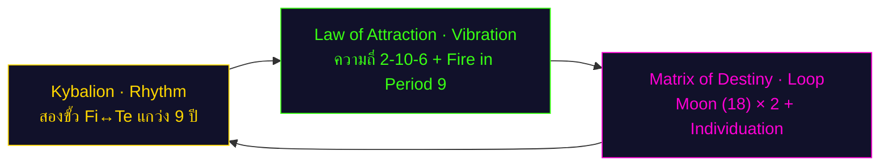
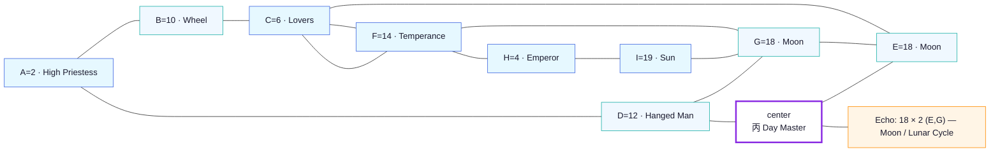

# พยากรณ์ชีวิตแบบองค์รวม — Win

> **Project Omni-Self Forecast** — การวิเคราะห์ 6 มุมมองเชิงลึกที่อ่านชีวิตของคุณ
> 
> **ผู้รับ:** Win  
> **วันเกิด:** 2 ตุลาคม 2538 (02.10.1995) · ประเทศไทย  
> **อายุ:** 30 ปี 9 เดือน (ณ วันที่วิเคราะห์ 5 กรกฎาคม 2569)  
> **บุคลิกภาพ:** INFP · Cognitive Stack: Fi-Ne-Si-Te  
> **บริบทอาชีพ:** Senior Systems Analyst  
> **หมายเหตุ:** การวิเคราะห์อาชีพในรายงานนี้ใช้ "รหัสชะตาและศักยภาพดั้งเดิม" ล้วนๆ ไม่อ้างอิงอาชีพปัจจุบัน  
> **ช่วงที่พยากรณ์:** 2026 (อายุ 31) → 2055 (อายุ 60)

---

## Section 0 · บทสรุป 6 มุมมองเชิงลึกที่อ่านชีวิตคุณ

พยากรณ์นี้รวบรวมความรู้จากหกสำนักคิดที่ต่างกัน แต่ละสำนักมองเห็นคุณในมุมที่ไม่เหมือนกัน แต่เมื่อรวมกันจะได้ภาพที่ชัดเจนของใครคุณเป็น คุณกำลังไปที่ไหน และคุณจะเดินไปถึงที่นั่นได้อย่างไร

### 1. มุมมองจิตวิทยาเชิงลึก (Carl Jung)

คุณคือผู้ที่สวมหน้ากาก "นักวิเคราะห์ผู้เข้าใจมนุษย์" (The Competent Translator) ออกมาให้โลกเห็น แต่ภายในลึกๆ คุณคือ "ผู้ที่รู้มากกว่าที่แสดงออก" (The High Priestess) ที่กำลังเดินทางค้นหาตัวเอง

จิตใต้สำนึกของคุณส่งสัญญาณผ่านตัวเลข 18 (The Moon) ที่ปรากฏสองครั้งในผังชะตา — ที่ตำแหน่ง E (พลังชีวิต) และ G (หางกรรม) นี่คือ "ความมืดที่กลับมาซ้ำ" ที่บอกว่าทุกครั้งที่คุณพยายามเก็บทุกอย่างไว้ในใจ จิตใต้สำนึกจะดึงคุณเข้าสู่ความมืดเดิมอีกครั้ง ไม่ใช่เพื่อทำลายคุณ แต่เพื่อสอนให้คุณ "เปิดเผย" — ปล่อยออกมา ไม่ใช่กลัวว่าคนอื่นจะไม่เข้าใจ

**จุดเปลี่ยนสำคัญ:** อายุ 36-37 (2031-2032) คุณจะเจอจุดที่ Shadow (เงามืด) ขึ้นมาเคาะประตู — Te inferior grip ที่ฝังลึกจะปะทุขึ้นมา คุณจะรู้สึกต้องการควบคุมทุกอย่างด้วยตรรกะแข็งกร้าว แต่อย่ากลัว — นี่คือช่วงที่คุณจะเริ่มเข้าใจ "ตัวเองที่แท้จริง" อายุ 42-43 (2037-2038) คุณจะเข้าสู่ Personal Year 6 (Lovers) — ช่วงที่ต้องเลือกว่าจะเป็นใครในช่วงที่เหลือของชีวิต

### 2. มุมมองบุคลิกภาพ (Isabel Briggs Myers — MBTI)

คุณเป็น INFP — "ผู้ค้นหาความหมาย" ที่ใช้ฟังก์ชันจิตสี่ชั้นในการมองโลก:

- **Fi (Feeling หันใน)** — คุณตัดสินทุก requirement ที่เข้ามาด้วยคำถาม "มัน serve คนจริงๆ ไหม" ไม่ใช่แค่ทำตามกระบวนการ นี่คือ "ศาลใน" ที่ไม่มีใครเห็น
- **Ne (Intuition หันออก)** — คุณมองเห็นความเป็นไปได้หลายทางพร้อมกัน เห็น edge case ที่คนอื่นมองข้าม บ่อยครั้ง Win จะเสนอ solution ที่รวม 3-4 ฟีเจอร์ที่ทุกคนคิดว่าแยกกัน
- **Si (Sensing หันใน)** — คุณจำได้แม่นว่า "เคยทำระบบนี้มาแล้ว ครั้งก่อน stakeholder complain เรื่องนี้" แต่บางครั้งคุณรู้สึกว่าจำไม่ได้ ทั้งที่จำได้
- **Te (Thinking หันออก)** — นี่คือฟังก์ชันที่อยู่ในเงามืด มันคือการจัดระเบียบโลกภายนอกแบบ objective เมื่อ Te inferior grip ขึ้นมา มันจะแสดงออกแบบดิบ — ดุ ตัดสิน สั่ง ไม่ฟัง

**ของขวัญที่ซ่อนอยู่:** Fi (ความรู้สึกภายใน) คือเข็มทิศภายในที่บอกว่าชีวิตนี้ควรเดินไปทางไหน เมื่อคุณอายุ 30+ และเริ่มเห็นว่าความสำเร็จภายนอกไม่ได้เติมเต็มทุกอย่าง นั่นคือสัญญาณว่า Fi กำลังเรียกคุณให้ฟัง

### 3. มุมมองกฎแห่งการดึงดูด (Helena Blavatsky)

คุณเกิดมาพร้อมความถี่หลัก **2-10-6** ซึ่งเป็นจังหวะแห่งการเลือก:
- **2** = ทางเลือก / คู่ขั้ว (The High Priestess) — "ฉันรู้มากกว่าที่พูด"
- **10** = วงล้อแห่งโชคชะตา (Wheel of Fortune) — "ชีวิตฉันมีรอบชัด ๆ"
- **6** = ความรักและการบริการ (Lovers) — "ฉันเลือกด้วยหัวใจ"

นี่คือรูปแบบของ "Rhythmic Choice" — ทุกๆ 9 ปี คุณจะเจอจุดที่ต้องเลือกระหว่างสองทาง และทางที่คุณเลือกจะกำหนดวงจร 9 ปีถัดไป

**Period 9 (ยุคไฟ 2024-2043):** คุณเกิดมาเป็น Day Master 丙 (Yang Fire / ดวงอาทิตย์ยามเที่ยง) ซึ่งเป็นพลังงานแห่งความชัดเจนและการส่องสว่าง ในยุคนี้คุณอยู่ใน "ยุคของคุณ" อย่างแท้จริง — ดวงอาทิตย์จะส่องแสงให้คุณ และคุณจะกลายเป็น "ดวงไฟ" ที่ผู้อื่นมองหา

**ดวงจันทร์สองครั้ง:** ตัวเลข 18 (The Moon) ปรากฏสองครั้งในผังของคุณ นี่คือ "ความมืดที่หมุนเวียน" — ความรู้สึกลึกๆ ที่คุณไม่ได้พูดออกมา แต่มันเป็นของขวัญ เพราะมันคือ "ช่องทางเชื่อมกับจิตใต้สำนึก" ที่คนอื่นไม่มี

### 4. มุมมองกฎธรรมชาติ (The Kybalion — Hermetic Principles)

ทั้งสามเครื่องยนต์ของชีวิต (จังหวะของ Kybalion → ความถี่ของ LoA → วงจรของ Matrix) ล้วนชี้ไปทางเดียวกัน — คุณกำลังเดินทาง "ค้นหาตัวเอง"

- **Kybalion rhythm** — จังหวะชีวิตของคุณเป็นแบบ pendulum ที่แกว่งระหว่างขั้วความรู้สึก (Fi) กับขั้วตรรกะ (Te) คาบ 9 ปี
- **Law of Attraction** — คุณดึงดูดสิ่งที่ "ซ้ำ" เพราะจิตยังไม่ได้เรียนรู้บทเรียน ลูป 18 คือ "ความมืดที่กลับมา"
- **Matrix Loop** — วงจร 9 ปี (2026-2034, 2035-2043, 2044-2052, 2053-2061) ที่ทุกรอบ Persona จะบางลง จน Self โผล่

**หลักความสอดคล้อง (As above, so below):** สิ่งที่อยู่ภายในคุณจะสะท้อนออกมาภายนอก Chart ของคุณมี 丙 (Yang Fire) เป็น Day Master — ภายในคุณมีไฟที่ส่องสว่าง แต่ภายนอกคุณปล่อยให้มันซ่อนอยู่ใต้หน้ากาก "คนเงียบ"

### 5. มุมมองจุดบรรจบแห่งวัย (Age 60 Forecast)

อายุ 60 (ปี 2055) คือจุดที่ Ego (ตัวตน) และ Self (ตัวจริง) จะรวมเป็นหนึ่ง นี่ไม่ใช่การพัง แต่เป็นการ "ถอดหน้ากาก" ที่สวมมา 30 ปี เพื่อให้ Self (The High Priestess + Lovers) ปรากฏชัด

ในปี 2055 คุณจะอยู่ในช่วง Personal Year = 6 (Lovers) และ Year Pillar = 乙卯 (Yin Wood on Rabbit) — สองสัญญาณนี้ชี้ตรงกันว่า **บทบาทของคุณในวัย 60 คือ "ผู้เลือกที่สอนทางเลือก"** ไม่ใช่แค่ "ครู" ที่สอน แต่เป็น "ปราชญ์เงียบ" ที่ "รู้" ว่าทางเลือกใดถูกต้อง โดยไม่ต้องสั่งสอน

### 6. มุมมองดวงจีน (BaZi & Period 9)

Day Master ของคุณคือ **丙 (Yang Fire / ดวงอาทิตย์ยามเที่ยง)** — ไฟที่ส่องสว่าง ให้ความอบอุ่น และนำทางผู้อื่น ไม่ใช่ไฟที่เผาผลาญ นี่คือความชัดเจน ความมั่นใจที่แท้จริง และการเป็นแรงบันดาลใจ

Chart ของคุณมีสาม 乙 (Yin Wood) ที่ตำแหน่ง Year-Month-Hour — **"ไม้สามต้นที่หล่อเลี้ยงไฟกลาง"** นี่หมายความว่าคุณมีพลังงานสนับสนุนจากสามทิศ: บรรพบุรุษ (Year), สภาพแวดล้อม (Month), และเวลา (Hour) ทั้งสามล้วนป้อนพลังให้ไฟของคุณลุกโชน

**Period 9 (Fire, 2024-2043):** ไม้หล่อเลี้ยงไฟ (木生火) — คุณอยู่ในยุค *ของคุณ* อย่างแท้จริง ไฟคือธาตุที่เด่นในยุคนี้ และคุณคือ 丙火 — ดวงอาทิตย์ที่จะส่องสว่างให้ผู้อื่นเห็นทาง

---

## Section 1 · จุดเชื่อมโยงแห่งปรัชญาและวัฏจักร

สามเครื่องยนต์ของจักรวาลกำลังทำงานพร้อมกันในชีวิตคุณ และทั้งสามพูดเรื่องเดียวกัน

### เครื่องยนต์ที่ 1 — จังหวะของ Kybalion (Rhythm)

จังหวะชีวิตของคุณไม่ใช่เส้นตรงที่ขึ้นเรื่อยๆ แต่เป็น "ลูกตุ้ม" (pendulum) ที่แกว่งระหว่างสองขั้ว

- **ขั้วที่ 1: ความรู้สึก (Fi)** — ช่วงที่คุณฟังเสียงภายใน ดูแลคุณค่าส่วนตัว ออกแบบระบบที่ user เป็นศูนย์กลาง
- **ขั้วที่ 2: ตรรกะ (Te)** — ช่วงที่คุณต้องจัดระบบ สร้าง SLA ตอบ KPI ทำให้ stakeholder เข้าใจ

คาบของการแกว่งคือ **9 ปี** — ทุกๆ 9 ปี จักรวาลจะดึงคุณกลับไปอีกขั้วหนึ่ง ถ้าคุณแกว่งไปทาง Fi นาน จักรวาลจะดึงคุณกลับทาง Te ในอัตราเท่ากัน

นี่คือหลัก **Rhythm** ของ The Kybalion: *"ทุกสิ่งไหลเข้า-ไหลออก ขึ้น-ลง ซ้าย-ขวา เท่าที่แกว่งไปทางหนึ่ง ก็จะแกว่งกลับมาเท่านั้น"*

**ตัวอย่างจริงในชีวิต Win:**
- **2017-2025 (อายุ 22-30):** ช่วงที่ Fi เด่น — คุณเรียนรู้อาชีพ พัฒนาทักษะ ออกแบบระบบที่ใส่ใจผู้ใช้ ค้นหาความหมายในงาน
- **2026-2034 (อายุ 31-39):** ช่วงที่ Te จะถูกเรียกออกมา — คุณจะต้องเป็น lead จัดการ stakeholder ตั้ง KPI ทำให้ทีมเข้าใจ นี่คือช่วงที่ Te inferior จะถูกฝึกอย่างหนัก
- **2035-2043 (อายุ 40-48):** ช่วงที่ Fi กลับมา — คุณจะต้องการฟังเสียงภายในอีกครั้ง คำถาม "ชีวิตนี้มีความหมายอะไร" จะกลับมา
- **2044-2052 (อายุ 49-57):** ช่วงที่ Te และ Fi รวมกัน — คุณจะเรียนรู้วิธี "จัดระบบที่มีความหมาย" ไม่ใช่แค่ระบบที่มีประสิทธิภาพ

การเรียนรู้จังหวะนี้คือ **การเรียนรู้ที่จะไม่สู้กับคลื่น** — เมื่อคุณรู้ว่าตอนนี้คลื่นกำลังมา คุณจะไม่ตกใจ คุณจะเตรียมตัว

### เครื่องยนต์ที่ 2 — ความถี่ของ Law of Attraction (Vibration)

ความถี่หลักของคุณคือ **"เลือก-หมุน-รัก"** (2-10-6) — คุณดึงดูดสถานการณ์ที่ต้องเลือกระหว่างสองทาง แล้ววงล้อหมุน แล้วคุณเรียนรู้ว่าการเลือกที่แท้จริงคือการให้

ตัวเลข 10 (Wheel of Fortune) ที่ปรากฏในตำแหน่ง B (จุดประสงค์) บอกว่า **ชีวิตของคุณมีรอบชัดเจน** — ทุกๆ 9 ปี คุณจะรู้สึกว่า "ชีวิตเริ่มใหม่" และจริงๆ แล้วมันเริ่มใหม่จริง

การเปลี่ยนความถี่ไม่ใช่เปลี่ยนการกระทำ แต่เปลี่ยน **ความตั้งใจ** ที่อยู่เบื้องหลัง:
- ถ้าคุณเลือกจากช่อง **Fi** (คุณค่าภายใน) — สิ่งที่กลับมาจะเป็นความหมายและความพึงพอใจ
- แต่ถ้าคุณเลือกจากช่อง **Te** (ตรรกะภายนอกล้วนๆ) — สิ่งที่กลับมาจะเป็นความสำเร็จที่ว่างเปล่า

**เคล็ดลับ:** ใช้ Fi เลือก แล้วใช้ Te ดำเนินการ — ไม่ใช่ให้ Te เลือกแทน

### เครื่องยนต์ที่ 3 — วงจรของ Matrix of Destiny (Loop)

Matrix Loop ของคุณคือ **Lunar Cycle** (วงจรของดวงจันทร์) ที่จะใช้เวลา 18 ปี (2026-2043) เดินผ่านสอง Echo Numbers (E=18, G=18) แล้วกลับมาที่เดิม

ทุกรอบของวงจร Persona (หน้ากาก) จะบางลง จน Self (ตัวจริง) โผล่ออกมา

**Proof line (หลักฐานที่สามศาสตร์ชี้เหมือนกัน):**

"คุณกำลังเดินทางค้นหาตัวเอง — จาก Priestess (ผู้รู้) ที่ Persona ปกปิดไว้ → ไปสู่ Priestess ที่ Self ยอมรับว่า 'ฉันรู้ และฉันไม่ต้องพิสูจน์'"

### Octagram — 8 พลังแห่งจักรวาลที่ล้อมรอบคุณ

| ทิศ | พลัง | ความหมาย |
|---|---|---|
| **ศูนย์กลาง** | Monad · Self | 丙 Day Master — ดวงอาทิตย์ที่ส่องสว่าง |
| **เหนือ (N)** | Kybalion · Mentalism | "จิตเป็นทั้งหมด" — Fi ของคุณคือเครื่องพิสูจน์ |
| **ตะวันออกเฉียงเหนือ (NE)** | LoA · Vibration | Wheel of Fortune — การดึงดูดวงจรที่ชัดเจน |
| **ตะวันออก (E)** | Matrix · Loop | E=18 (Moon) — ความมืดที่เป็นของขวัญ |
| **ตะวันออกเฉียงใต้ (SE)** | BaZi · Heavenly Stem | 丙 (Yang Fire) — ไฟที่ส่องสว่างไม่เผาผลาญ |
| **ใต้ (S)** | Jung · Shadow | Te inferior — ผู้ตัดสินที่กลัวความไร้ตรรกะ |
| **ตะวันตกเฉียงใต้ (SW)** | Ladini · Critical Year | 2031-2032 (Personal Year 9) — เวลาที่ Shadow ขึ้นมา |
| **ตะวันตก (W)** | Hermetic · Polarity | Fi ↔ Te — สองขั้วที่ต้องรวมเป็นหนึ่ง |
| **ตะวันตกเฉียงเหนือ (NW)** | Mystery · Initiation | INFP → INFJ — การเริ่มต้นครั้งที่สอง (ถ้าเลือก) |

---

## Section 2 · โปรแกรมชีวิตและแกนหลัก (Natalia Square 3×3)

ผังชะตา 3×3 ของนาตาเลีย ลาดินี คือ "แผนที่จิต" ที่บอกว่าคุณถูกตั้งโปรแกรมมาอย่างไร

### แกนบน — ความคิด / จุดเริ่มต้น (A-B-C = 2-10-6)

**A = 2 (The High Priestess / นักบวชหญิง) → B = 10 (The Wheel of Fortune / วงล้อโชคชะตา) → C = 6 (The Lovers / คู่รัก)**

แกนบนแทนเหตุผลที่คุณเกิดมา — คุณเกิดมาเพื่อ "รู้ แล้วเลือก"

2 (The High Priestess) คือความรู้ที่ซ่อนอยู่ภายใน คุณรู้มากกว่าที่คุณพูด → 10 (The Wheel of Fortune) คือวงจรของชีวิตที่หมุนเวียน คุณจะเจอสถานการณ์ซ้ำจนกว่าจะเรียนรู้ → 6 (The Lovers) คือการเลือกด้วยหัวใจ ไม่ใช่ด้วยตรรกะเพียงอย่างเดียว

นี่คือเหตุผลที่ Persona ของคุณ (INFP) เป็น "ผู้ค้นหาความหมาย" — คุณไม่สามารถทำงานที่ไม่มีความหมายได้ คุณต้อง "รู้" ว่าทำไมถึงทำ และคุณต้อง "เลือก" ว่าจะทำหรือไม่ทำ

**จริงๆ แล้วเกิดอะไรขึ้น:**  
ตามหลักของนาตาเลีย A (วันเกิด) คือ "ตัวตนที่แท้จริง" — คุณคือ Priestess ที่รู้มากกว่าที่แสดงออก แต่ B (เดือนเกิด) คือ "วิธีที่คุณใช้ชีวิต" — คุณจะเจอวงล้อหมุนซ้ำๆ จนกว่าคุณจะเรียนรู้ว่าการรู้อย่างเดียวไม่พอ คุณต้อง "เลือก" (C = 6)

### แกนกลาง — การงาน / วิถีชีวิต (D-Center-E = 12-丙-18)

**D = 12 (The Hanged Man / ผู้ถูกแขวน) → Center = 丙 (Yang Fire / ดวงอาทิตย์) → E = 18 (The Moon / ดวงจันทร์)**

แกนกลางของชีวิตคุณคือ **"หยุด-ส่องสว่าง-ดำดิ่ง"**

Hanged Man (12) คือการหยุดเพื่อดูจากมุมใหม่ คุณไม่ใช่คนที่ได้ผลลัพธ์แบบทันที คุณต้อง "แขวน" ในสถานการณ์ก่อน → Center = 丙 (Yang Fire) คือพลังแท้จริงของคุณ — ไฟที่ส่องสว่างให้คนอื่นเห็นทาง → แต่ E = 18 (The Moon) บอกว่าคุณยังต้องดำดิ่งเข้าสู่ความมืดภายในเพื่อเข้าใจตัวเอง

สำหรับ INFP ที่เป็น Senior Systems Analyst นี่คือบทเรียนที่ยากที่สุด: **"บางครั้งคุณต้องหยุดวิเคราะห์ และเริ่มรู้สึก"** คุณไม่สามารถแก้ทุกปัญหาด้วยการคิดเพียงอย่างเดียว — คุณต้องให้จิตใต้สำนึก (Moon) พูดด้วย

### แกนล่าง — ฐานราก / บุคลิก (F-G-H-I = 14-18-4-19)

**F = 14 (Temperance / สมดุล) → G = 18 (The Moon ครั้งที่สอง) → H = 4 (The Emperor / จักรพรรดิ) → I = 19 (The Sun / ดวงอาทิตย์)**

รากฐานของจิตคุณคือ Temperance (14) → Moon (18) → Emperor (4) → Sun (19)

นี่หมายความว่าใต้ Persona "ผู้เงียบ" มี **ไฟที่ส่องสว่าง (Sun)** และ **โครงสร้างที่ชัดเจน (Emperor)** นอนอยู่เสมอ Persona ของ INFP เป็น "ชุดกันชน" ที่คุณใส่เพื่อปกป้องพลังงานแกนกลาง

แต่ในท้ายที่สุด I = 19 (The Sun) คือจุดหมาย — คุณกำลังเดินทางไปหา "ความชัดเจนที่สุด" ที่ไม่ต้องซ่อน

**หางกรรม (Karmic Tail):**  
G = 18 (The Moon) ปรากฏครั้งที่สอง — นี่คือ "หางกรรม" ที่คุณแบกมาแต่เกิด: ความกลัวที่จะ "ถูกเข้าใจผิด" หรือ "ไม่ถูกเข้าใจเลย" บ่อยครั้งคุณจะเก็บความรู้สึกไว้ในใจ กลัวว่าถ้าพูดออกไป คนอื่นจะไม่เข้าใจ

ทางออก: **ใช้พลังของ High Priestess (2)** — คุณไม่ต้องอธิบายทุกอย่าง คุณแค่ต้อง "เชื่อ" ว่าคนที่เข้าใจจะเข้าใจ และคนที่ไม่เข้าใจก็ไม่จำเป็น

---

## Section 3 · พรสวรรค์และหางกรรม

### พรสวรรค์ที่ซ่อนอยู่ (Talents)

ตามหลักของนาตาเลีย พรสวรรค์ของคุณถูกเข้ารหัสไว้ในแกนบน A-B-C = 2-10-6

**1. พรสวรรค์การรู้โดยไม่ต้องพูด (A = 2, The High Priestess)**

คุณมีความสามารถพิเศษในการ "อ่าน" ผู้คน สถานการณ์ และความต้องการที่ซ่อนอยู่ โดยไม่ต้องมีใครบอก ในงาน Senior Systems Analyst นี่คือซูเปอร์พาวเวอร์ — คุณเห็น requirement ที่ซ่อนอยู่เบื้องหลัง requirement ที่เขาบอกมา

**ตัวอย่างจริง:** เมื่อ stakeholder บอกว่า "ฉันต้องการ report ที่แสดง X" คุณไม่ได้ทำแค่ report ที่แสดง X — คุณถามว่า "ทำไมคุณถึงต้องการเห็น X" แล้วคุณจะพบว่าเขาต้องการแก้ปัญหา Y ที่ลึกกว่า แล้วคุณจะออกแบบ solution ที่แก้ Y ไม่ใช่แค่ X

**2. พรสวรรค์การอ่านจังหวะ (B = 10, The Wheel of Fortune)**

คุณมีความสามารถในการรู้สึกว่า "ตอนนี้เหมาะจะทำอะไร" โดยไม่ต้องมีข้อมูลครบ นี่คือ intuition ที่แข็งแกร่ง (Ne auxiliary) ที่ทำงานร่วมกับ Fi

**ตัวอย่างจริง:** คุณจะรู้สึกได้ว่า "project นี้กำลังจะเปลี่ยนทิศ" ก่อนมันเปลี่ยนจริง คุณจะเตรียมตัวล่วงหน้า — นี่คือสาเหตุที่คุณไม่ค่อยตกใจเมื่อ requirement เปลี่ยน

**3. พรสวรรค์การเลือกด้วยหัวใจ (C = 6, The Lovers)**

คุณมีความสามารถในการเลือกทางเดินที่ "ถูก" สำหรับตัวเอง แม้ว่ามันจะไม่ใช่ทางที่คนอื่นแนะนำ นี่คือ Fi dominant ที่ทำงาน — เข็มทิศภายในของคุณแม่นยำมาก

**ตัวอย่างจริง:** เมื่อต้องเลือกระหว่างงานที่เงินเดือนสูงกว่า กับงานที่มีความหมายมากกว่า — คุณจะเลือกงานที่มีความหมาย และในระยะยาว มันจะพิสูจน์ว่าถูกต้อง

### หางกรรม (Karmic Tail)

หางกรรมของคุณคือ **G = 18 (The Moon)** ที่ปรากฏสองครั้ง (E และ G) — นี่คือ "ความมืดที่หมุนเวียน"

**รูปแบบของหางกรรม:**

1. **ความกลัวที่จะถูกเข้าใจผิด**  
   คุณมีความกลัวลึกๆ ว่าถ้าคุณพูดความจริงออกไป คนอื่นจะไม่เข้าใจ หรือเข้าใจผิด เลยเก็บไว้ในใจ แต่ยิ่งเก็บมาก ความมืดยิ่งลึก

2. **วงจร Fi-Si loop**  
   เมื่อเครียด คุณจะเข้าสู่ Fi-Si loop — จมอยู่กับความทรงจำในอดีต วนเวียนกับความรู้สึกที่เจ็บปวด ตัดสินคนอื่นด้วยค่านิยมส่วนตัวอย่างเข้มงวด

3. **Te inferior grip**  
   เมื่อเครียดเรื้อรัง Te inferior จะปะทุ — คุณจะกลายเป็นคนที่ "ทุกอย่างต้องมีเหตุผล ทุกคนต้องมีหลักฐาน" อย่างแข็งกร้าว ซึ่งตรงข้ามกับตัวตนปกติ

**ช่วงที่หางกรรมจะปะทุ:**

ตามหลักของ Hermetic Principles (The Kybalion) หางกรรมจะปะทุเมื่อ "จังหวะแกว่งไปสุดทางหนึ่ง"

สำหรับ Win:
- **อายุ 36-37 (2031-2032):** Personal Year 9 (Hermit) — ปีแห่งการสิ้นสุดรอบ จะเป็นปีที่ Moon (18) ส่งเสียงดังที่สุด คุณจะรู้สึกโดดเดี่ยว เหนื่อย อยากหนี
- **อายุ 45-46 (2040-2041):** Personal Year 9 อีกครั้ง — รอบที่สอง ถ้ารอบแรกยังไม่เรียนรู้ รอบนี้จะหนักกว่า

**วิธีแก้หางกรรม:**

1. **ยอมรับว่าความมืดเป็นส่วนหนึ่งของคุณ**  
   ไม่ใช่ "กำจัด" Moon แต่คือ "รับ" Moon — ความรู้สึกลึกๆ ที่คุณไม่ได้พูด คือของขวัญ มันคือช่องทางเชื่อมกับจิตใต้สำนึก

2. **พูดออกมาเมื่อถึงเวลา**  
   คุณไม่ต้องพูดทุกอย่าง แต่คุณต้องพูด *บางอย่าง* กับคนที่ใช่ — คนที่เข้าใจคุณโดยไม่ต้องอธิบายมาก

3. **ฝึก Te อย่างตั้งใจ**  
   Te inferior จะไม่ปะทุถ้าคุณฝึกมันอย่างตั้งใจ — เรียนรู้วิธีจัดระบบ สร้าง SLA เขียนเอกสารที่ชัดเจน โดยไม่รอให้มันระเบิดเวลาเครียด

---

## Section 4 · เงิน การงาน และศักยภาพอาชีพ

### Day Master Analysis — 丙火 (Yang Fire / ดวงอาทิตย์)

ตามหลักของ Su Yu Hong (BaZi) Day Master ของคุณคือ **丙 (Yang Fire / ดวงอาทิตย์ยามเที่ยง)**

丙火 ไม่ใช่ไฟที่เผาผลาญ (ไม่ใช่ไฟป่า) แต่เป็นไฟที่ **ส่องสว่าง ให้ความอบอุ่น และนำทางผู้อื่น** — นี่คือดวงอาทิตย์ที่ส่องแสงให้ทุกคนเห็นทาง

**ลักษณะเด่นของ 丙火 ในงาน:**

1. **ให้แสงสว่างแก่ผู้อื่น**  
   คุณไม่ได้ทำงานเพื่อสะสมความรู้ไว้กับตัวเอง — คุณทำงานเพื่อ "ส่องทาง" ให้คนอื่น ในงาน Senior Systems Analyst คุณคือคนที่ทำให้ทีมเข้าใจว่า "requirement จริงๆ คืออะไร"

2. **ต้องการความชัดเจน**  
   ดวงอาทิตย์ส่องสว่างตรงไป — คุณไม่ชอบความคลุมเครือ คุณต้องการ requirement ที่ชัด คำถามที่ตรง คำตอบที่จริง

3. **ต้องการพื้นที่เปิด**  
   ดวงอาทิตย์อยู่บนท้องฟ้า ไม่ใช่ในกล่อง — คุณไม่เหมาะกับงานที่ต้อง "ซ่อน" หรือ "ทำหลังม่าน" คุณเหมาะกับงานที่ได้ "ออกมาพูด" "นำเสนอ" "สอนคนอื่น"

### การเงินและอาชีพ — ช่วง 2026-2055

**ช่วง 2026-2034 (อายุ 31-39): ฐานรากแห่งความเชี่ยวชาญ**

นี่คือช่วงที่ Period 9 (Fire, 2024-2043) ยังคงแรง — คุณอยู่ใน "ยุคของคุณ"

**โอกาส:**
- **2026-2028:** ช่วงที่คุณจะได้รับการยอมรับในความเชี่ยวชาญ คนจะเริ่มมองหาคุณเมื่อต้องการคำตอบ
- **2029-2031:** ช่วงที่คุณจะได้ lead project ที่ยากแต่มีความหมาย — นี่คือช่วงที่คุณจะพิสูจน์ว่า "คุณทำได้"
- **2032-2034:** ช่วงที่คุณอาจจะต้องเลือกระหว่าง "ขึ้นตำแหน่ง" กับ "เปลี่ยนทิศทาง" — Fi (C=6, Lovers) จะเรียกให้คุณเลือก

**ระวัง:**
- **2031-2032 (Personal Year 9):** ปีที่ Te inferior grip อาจปะทุ — คุณจะรู้สึกเหนื่อย เบื่อ อยากหนี อย่าตัดสินใจใหญ่ในปีนี้

**อาชีพที่เหมาะสม:**
- Senior Systems Analyst / Business Analyst (ตำแหน่งปัจจุบัน — เหมาะมาก)
- Solution Architect (ถ้าอยากมองภาพใหญ่)
- Product Owner / Product Manager (ถ้าอยากใกล้ user มากขึ้น)
- UX Researcher / Service Designer (ถ้าอยาก "เข้าใจคน" เป็นอาชีพ)

**ช่วง 2035-2043 (อายุ 40-48): จุดพีคแห่งอิทธิพล**

นี่คือช่วงที่คุณจะ "ส่องสว่าง" ที่สุด — ทั้ง Period 9 (Fire) ยังคงอยู่ และ Personal Year 6 (Lovers, 2037-2038) จะกลับมาอีกครั้ง

**โอกาส:**
- **2035-2037:** ช่วงที่คุณจะได้สอนคนอื่น ไม่ว่าจะเป็น mentor ในองค์กร หรือ speaker ในงาน conference
- **2037-2038 (Personal Year 6, Lovers):** จุดเลือกครั้งสำคัญ — "ฉันจะเป็นใครในช่วงที่เหลือของชีวิต" คุณอาจจะเลือกเปิด consulting เลือกเขียนหนังสือ หรือเลือกสอน
- **2040-2043:** ช่วงที่คุณจะเก็บเกี่ยวผลจากการเลือกในปี 2037-2038

**ระวัง:**
- **2040-2041 (Personal Year 9):** รอบที่สองของ Te inferior grip — ถ้ารอบแรกยังไม่เรียนรู้ รอบนี้จะหนักกว่า แต่ถ้าเรียนรู้แล้ว รอบนี้จะเป็น "จุดปลดปล่อย" ที่คุณยอมรับว่า "ฉันไม่ต้องควบคุมทุกอย่าง"

**อาชีพที่เหมาะสม:**
- Principal Architect / Chief Architect (ถ้าอยากอยู่ในองค์กรใหญ่)
- Independent Consultant / Fractional CTO (ถ้าอยากอิสระ)
- Educator / Course Creator (ถ้าอยากสอน)
- Author / Thought Leader (ถ้าอยากเขียน)

**ช่วง 2044-2055 (อายุ 49-60): จุดบรรจบแห่งปัญญา**

นี่คือช่วงที่ Period 9 (Fire) จะสิ้นสุด (2043) และ Period 1 (Water) จะเริ่ม (2044-2063)

**การเปลี่ยนผ่าน:**
- **2044-2046:** ช่วงเปลี่ยนผ่านจาก Fire → Water — คุณจะรู้สึกว่า "พลังงานเปลี่ยน" จากการ "ส่องสว่าง" เป็นการ "หล่อเลี้ยง"
- **2047-2052:** ช่วงที่คุณจะเป็น "ปราชญ์เงียบ" — คนจะมาขอคำแนะนำ แต่คุณจะไม่ "สอน" อีกต่อไป คุณจะ "ฟัง" แล้ว "ถาม" แล้วให้เขาหาคำตอบเอง
- **2053-2055:** ช่วงเตรียมตัวสู่อายุ 60 — คุณจะเริ่มรู้สึกว่า "ฉันพร้อมจะปล่อยวาง"

**อาชีพที่เหมาะสม:**
- Executive Coach / Strategic Advisor (ถ้าอยากช่วยผู้นำรุ่นใหม่)
- Non-Executive Director / Board Advisor (ถ้าอยากให้คำแนะนำระดับยุทธศาสตร์)
- Retreat Facilitator / Workshop Leader (ถ้าอยากสร้างพื้นที่ให้คนค้นหาตัวเอง)
- Writer / Philosopher (ถ้าอยากเขียนหนังสือที่สะท้อนปัญญา)

### บทบาทในที่ทำงาน (Workplace Roles)

ตามหลักของนาตาเลีย บทบาทของคุณในที่ทำงานถูกเข้ารหัสในผัง 3×3

**Boss (D = 12, Hanged Man):** หัวหน้าที่เหมาะกับคุณคือคนที่ **ไม่รีบ ไม่กดดัน ให้เวลาคุณคิด** — คนที่เข้าใจว่า "บางครั้งต้องหยุดก่อนจะไปต่อ" ถ้าหัวหน้าคุณเป็นคนที่ต้องการผลลัพธ์ทันที คุณจะเครียด

**Subordinate (F = 14, Temperance):** ลูกน้องที่เหมาะกับคุณคือคนที่ **สมดุล ไม่หัวรุนแรง ทำงานได้ทั้งเร็วและช้า** — คนที่สามารถ "ปรับ" ตามจังหวะของงาน

**Right-Hand (H = 4, Emperor):** เพื่อนร่วมงานที่เหมาะกับคุณคือคนที่ **มีโครงสร้าง มีระเบียบ ทำให้คุณมั่นใจ** — คนที่จัดการ Te ให้คุณได้ (เพราะ Te inferior ของคุณยังไม่แข็งแรง)

**Left-Hand (I = 19, Sun):** อีกฝ่ายหนึ่งที่เหมาะกับคุณคือคนที่ **ชัดเจน เปิดเผย สดใส** — คนที่พูดตรงๆ ไม่อ้อมค้อม ทำให้คุณไม่ต้องเดา

### Storytelling Scenario — การประชุมที่คุณต้องเลือก

**บริบท:**  
วันหนึ่ง stakeholder มา brief requirement ใหม่ให้คุณ — "เราต้องการระบบที่ track user behavior แบบ real-time เพื่อเพิ่ม conversion"

**A = 2 (Priestess) พูดในใจ:**  
"เดี๋ยวนะ... ถ้าเรา track แบบนี้ เราจะรู้ว่า user กำลังทำอะไรทุกวินาที นี่คือการบุกรุกความเป็นส่วนตัวไหม"

**B = 10 (Wheel) กระซิบ:**  
"เราเคยเจอเรื่องแบบนี้มาแล้ว ครั้งก่อนเราทำตาม แล้วทีมเครียด user บ่น ท้ายที่สุดต้องมา rollback"

**C = 6 (Lovers) ถาม:**  
"งั้นฉันจะเลือกอะไร — ทำตาม stakeholder แล้วได้เงินเดือน? หรือท้าทายแล้วเสี่ยงโดนว่า?"

**丙 (Yang Fire / Day Master) ตอบ:**  
"ฉันไม่ได้อยู่ที่นี่เพื่อทำตาม ฉันอยู่ที่นี่เพื่อส่องสว่าง ฉันจะถามเขาว่า *'เป้าหมายจริงๆ ของคุณคืออะไร'* แล้วฉันจะเสนอทางเลือกที่ *ถูกต้อง* ไม่ใช่แค่ *ทำได้*"

**ผลลัพธ์:**  
คุณถาม stakeholder — "เป้าหมายจริงๆ คือเพิ่ม conversion หรือคือเข้าใจ user ดีขึ้น?"

เขาตอบ — "เข้าใจ user"

คุณเสนอ — "งั้นเราไม่ต้อง track ทุกอย่าง เราแค่ต้อง track จุดที่ user *ติดขัด* แล้วเราจะได้รู้ว่าจะแก้ตรงไหน นี่จะได้ insight ที่ลึกกว่า และไม่บุกรุกความเป็นส่วนตัว"

**นี่คือ 丙火 — ไฟที่ส่องสว่าง ไม่ใช่ไฟที่เผาผลาญ**

---

## Section 5 · จุดเปลี่ยนสำคัญ — อายุ 31 ถึง 60

### ภาพรวม 30 ปี — จาก Priestess ไปสู่ Sun

ตามหลักของ Carl Jung การเดินทางของคุณคือ **Individuation** — กระบวนการที่ Ego (ตัวตน) และ Self (ตัวจริง) รวมเป็นหนึ่ง

สำหรับ Win:
- **อายุ 31-39 (2026-2034):** ช่วงที่ Persona "นักวิเคราะห์ผู้เข้าใจมนุษย์" ยังแข็งแรง — คุณจะใช้หน้ากากนี้ทำงาน แต่ภายในจะเริ่มรู้สึกว่า "มันไม่ใช่ฉันจริงๆ"
- **อายุ 40-48 (2035-2043):** ช่วงที่ Shadow (Te inferior) จะขึ้นมาเคาะประตู — คุณจะเจอสถานการณ์ที่ต้อง "ควบคุม" "จัดการ" "สั่ง" ซึ่งคุณไม่คุ้นเคย
- **อายุ 49-60 (2044-2055):** ช่วงที่ Self (The Sun) จะโผล่ออกมา — คุณจะเริ่มรู้ว่า "ฉันคือใคร" โดยไม่ต้องพิสูจน์

### จุดเปลี่ยนปีต่อปี (2026-2055)

**2026 (อายุ 31) — Personal Year 4 (Emperor): ปีแห่งโครงสร้าง**

นี่คือปีแรกของรอบ 9 ปี — คุณจะรู้สึกต้องการ "สร้างระบบ" "จัดระเบียบ" "ทำให้ชัดเจน"

**โอกาส:** ปีนี้เหมาะกับการ refactor ระบบเก่า สร้างเอกสารที่ชัดเจน หรือเขียน process ที่ทีมจะใช้ต่อไป

**ระวัง:** อย่าพยายามควบคุมทุกอย่าง — Te inferior ยังไม่แข็งแรงพอ ให้ใช้ Fi เลือกว่า "อะไรสำคัญจริงๆ" แล้วจัดระเบียบแค่นั้น

**2027 (อายุ 32) — Personal Year 5 (Hierophant): ปีแห่งการเรียนรู้**

Personal Year 5 คือปีที่คุณจะ "เรียนรู้สิ่งใหม่" หรือ "สอนคนอื่น"

**โอกาส:** ปีนี้เหมาะกับการเรียนหลักสูตรใหม่ เรียน framework ใหม่ หรือเริ่ม mentor คนในทีม

**ระวัง:** อย่าเรียนมากเกินไป — Ne auxiliary ชอบเรียนทุกอย่าง แต่ Si tertiary จำไม่ได้หมด ให้เลือกเรียนอย่างที่ "มีความหมาย" (Fi เลือก)

**2028 (อายุ 33) — Personal Year 6 (Lovers): ปีแห่งการเลือก**

นี่คือปีที่ C (จุดประสงค์) จะส่งเสียงดัง — คุณจะต้องเลือกระหว่างสองทาง

**โอกาส:** ปีนี้เหมาะกับการเลือก "ฉันจะเป็นใครในอีก 3 ปีข้างหน้า" — เลือกเส้นทางอาชีพ เลือกทิศทางชีวิต

**ระวัง:** อย่าเลือกด้วยตรรกะเพียงอย่างเดียว (Te) — ให้ Fi เลือก แล้วใช้ Te ดำเนินการ

**2029 (อายุ 34) — Personal Year 7 (Chariot): ปีแห่งการเคลื่อน**

Personal Year 7 คือปีที่ "การเลือก" ในปี 2028 จะเริ่มเคลื่อน

**โอกาส:** ปีนี้เหมาะกับการ "ลงมือทำ" — ถ้าเลือกจะเปลี่ยนงาน ก็เปลี่ยน ถ้าเลือกจะ lead project ก็ lead

**ระวัง:** อย่าเคลื่อนเร็วเกินไป — Chariot ต้องการความสมดุล ถ้าควบม้าเร็วเกิน จะควบคุมไม่อยู่

**2030 (อายุ 35) — Personal Year 8 (Strength): ปีแห่งพลัง**

Personal Year 8 คือปีที่คุณจะรู้สึก "แข็งแรง" — ทั้งร่างกายและจิตใจ

**โอกาส:** ปีนี้เหมาะกับการ "แสดงพลัง" — lead project ใหญ่ พูดใน conference เขียนบทความที่เผยแพร่

**ระวัง:** อย่าใช้พลังไปในทางที่ผิด — Strength คือการควบคุมตัวเอง ไม่ใช่ควบคุมคนอื่น

**2031 (อายุ 36) — Personal Year 9 (Hermit): ปีแห่งการปล่อยวาง ⚠️**

นี่คือปีที่ Shadow (Te inferior grip) จะขึ้นมาเคาะประตู — คุณจะรู้สึกเหนื่อย เบื่อ อยากหนี

**สัญญาณเตือน:**
- รู้สึกว่า "ทุกอย่างต้องมีเหตุผล" มากเกินไป
- รู้สึกว่า "คนอื่นไม่เข้าใจฉัน" มากขึ้น
- รู้สึกว่า "ฉันต้องควบคุมทุกอย่าง" จนเครียด

**วิธีรับมือ:**
- อย่าตัดสินใจใหญ่ในปีนี้ (อย่าลาออก อย่าเปลี่ยนงาน อย่าตัดสัมพันธ์)
- ให้เวลาตัวเอง "พัก" — Hermit คือการถอยไปหาตัวเอง ไม่ใช่หนี
- เขียน journal ทุกวัน — ปล่อยให้ Moon (18) พูดออกมาบนกระดาษ แทนที่จะเก็บไว้ในใจ

**2032 (อายุ 37) — Personal Year 1 (Magician): ปีแห่งการเริ่มต้นใหม่**

ถ้าคุณผ่านปี 2031 มาได้ ปี 2032 จะเป็นปีที่ "ฟื้น" — คุณจะรู้สึกว่า "ชีวิตเริ่มใหม่"

**โอกาส:** ปีนี้เหมาะกับการเริ่มโครงการใหม่ เรียนสิ่งใหม่ หรือเปลี่ยนทิศทาง

**ระวัง:** อย่าเริ่มมากเกินไป — Magician มีพลังมาก แต่ถ้าใช้ไปหลายทางพร้อมกัน จะกระจายเกินไป

**2033-2034 (อายุ 38-39) — Personal Year 2-3: ช่วงเติบโต**

นี่คือช่วงที่คุณจะ "เติบโต" จากการเริ่มต้นใหม่ในปี 2032

**2033 (PY 2, High Priestess):** ปีที่ A (ตัวตนแท้) จะกลับมา — คุณจะรู้สึกว่า "ฉันเริ่มรู้จักตัวเองอีกครั้ง"

**2034 (PY 3, Empress):** ปีที่ผลงานจะออกมา — สิ่งที่คุณเริ่มในปี 2032 จะเห็นผลในปีนี้

---

**2035-2043 (อายุ 40-48): จุดพีคแห่งอิทธิพล**

นี่คือช่วงที่คุณจะ "ส่องสว่าง" ที่สุด — Period 9 (Fire) ยังคงอยู่ และคุณอยู่ในช่วง "วัยกลางคน" ที่มีประสบการณ์และพลัง

**2035 (PY 4, Emperor):** ปีที่คุณจะได้ "จัดระเบียบ" อีกครั้ง — แต่คราวนี้ Te ของคุณแข็งแรงกว่าปี 2026 มาก

**2036 (PY 5, Hierophant):** ปีที่คุณจะได้ "สอนคนอื่น" อย่างเป็นทางการ — อาจจะเป็น mentor อาจจะเป็น speaker

**2037 (PY 6, Lovers):** ปีที่คุณจะต้อง "เลือก" อีกครั้ง — "ฉันจะเป็นใครในช่วงที่เหลือของชีวิต" นี่คือการเลือกที่สำคัญที่สุดในชีวิต

**2038-2039 (PY 7-8, Chariot-Strength):** ช่วงที่คุณจะ "เคลื่อน" ตามการเลือกในปี 2037 และ "แสดงพลัง" ออกมาเต็มที่

**2040 (PY 9, Hermit):** รอบที่สองของ Te inferior grip ⚠️ — ถ้าปี 2031 เรียนรู้แล้ว ปีนี้จะเป็น "จุดปลดปล่อย" ที่คุณยอมรับว่า "ฉันไม่ต้องควบคุมทุกอย่าง"

**2041-2043 (PY 1-3):** รอบใหม่ — คุณจะ "เริ่มต้นใหม่" อีกครั้ง แต่คราวนี้คุณรู้แล้วว่าต้องทำอะไร

---

**2044-2055 (อายุ 49-60): จุดบรรจบแห่งปัญญา**

นี่คือช่วงที่ Period 9 (Fire) จะสิ้นสุด (2043) และ Period 1 (Water) จะเริ่ม (2044) — พลังงานจะเปลี่ยนจาก "ส่องสว่าง" เป็น "หล่อเลี้ยง"

**2044 (PY 4, Emperor):** ปีแรกของ Period 1 — คุณจะรู้สึกว่า "พลังงานเปลี่ยน" คุณจะไม่อยากพูดมากอีกต่อไป คุณอยากฟังมากกว่า

**2045-2049 (อายุ 50-54):** ช่วงที่คุณจะเป็น "ปราชญ์เงียบ" — คนจะมาขอคำแนะนำ แต่คุณจะไม่ "สอน" คุณจะ "ฟัง" แล้ว "ถาม"

**2050 (PY 1, Magician):** รอบใหม่อีกครั้ง — แต่คราวนี้ Magician ไม่ใช่ "ผู้สร้างสรรค์" แต่เป็น "ผู้ส่งต่อ"

**2051-2054 (อายุ 56-59):** ช่วงเตรียมตัวสู่อายุ 60 — คุณจะเริ่มรู้สึกว่า "ฉันพร้อมจะปล่อยวาง"

**2055 (อายุ 60) — Personal Year 6 (Lovers): จุดบรรจบ 🌟**

นี่คือปีที่ทุกอย่างรวมเป็นหนึ่ง — Ego (ตัวตน) และ Self (ตัวจริง) จะไม่แยกอีกต่อไป

คุณจะอยู่ใน Personal Year 6 (Lovers) — ซึ่งเป็นการกลับไปที่ C (จุดประสงค์) อีกครั้ง

แต่คราวนี้คุณไม่ "เลือก" อีกต่อไป — คุณ "เป็น"

นี่คือความหมายของ I = 19 (The Sun) — **คุณกลายเป็นดวงอาทิตย์ที่ส่องสว่างโดยไม่ต้องพยายาม**

---

## Section 6 · พลังงานจักรวาลและการเชื่อมต่อ (Period 9 Analysis)

### Period 9 (2024-2043) — ยุคแห่งไฟ

ตามหลักของ Feng Shui และ Flying Star (玄空飛星) จักรวาลเคลื่อนผ่าน 9 Period ที่ละ 20 ปี — แต่ละ Period มีธาตุหลักที่ต่างกัน

**Period 9 (九運 / 離卦):** 4 กุมภาพันธ์ 2024 → 2043  
**ธาตุ:** Fire (離火)  
**ทิศ:** ใต้  
**สีหลัก:** แดง ม่วง ส้ม  
**คุณสมบัติ:** ความชัดเจน ชื่อเสียง การส่องสว่าง ความคิดสร้างสรรค์ การเปิดเผย

### ทำไม Period 9 ถึงเป็น "ยุคของ Win"

Day Master ของคุณคือ **丙 (Yang Fire / ดวงอาทิตย์ยามเที่ยง)** — คุณ *คือ* ธาตุหลักของยุคนี้

นี่หมายความว่าอะไร?

1. **พลังงานจักรวาลสนับสนุนคุณ**  
   ในยุคที่ธาตุหลักคือไฟ คนที่เป็นไฟจะได้รับ "ลม" จากจักรวาล — งานที่เคยยาก จะง่ายขึ้น คนที่เคยไม่เห็น จะเริ่มเห็น

2. **ช่วง 2024-2043 คือ "หน้าต่างทอง" ของคุณ**  
   ถ้าคุณมีอะไรจะทำที่ต้องการ "ส่องสว่าง" "สอนคนอื่น" "เผยแพร่ความรู้" — ทำในช่วงนี้ จักรวาลจะช่วย

3. **Chart ของคุณมี 乙木 (Yin Wood) สามตัว**  
   ไม้หล่อเลี้ยงไฟ (木生火) — คุณมี "เชื้อเพลิง" พร้อมอยู่แล้ว ไม่ต้องหาจากที่อื่น นี่คือสาเหตุที่คุณไม่เหนื่อยง่ายเมื่อทำงานที่มีความหมาย

### วิธีใช้ Period 9 ให้เต็มที่

**1. ทำงานที่ "ส่องสว่าง"**

ถ้างานปัจจุบันของคุณทำให้คุณรู้สึกว่า "ฉันกำลังช่วยคนอื่นเข้าใจ" — นั่นคืองานที่ใช่

ถ้างานปัจจุบันทำให้คุณรู้สึกว่า "ฉันแค่ทำตามคำสั่ง" — ให้หาทางเปลี่ยน

**ตัวอย่างงานที่ใช้ Period 9:**
- สอนคนอื่น (mentor, trainer, educator)
- เขียนเผยแพร่ (blog, book, course)
- พูดในที่สาธารณะ (speaker, presenter)
- ออกแบบระบบที่คนอื่นใช้ (architect, designer)

**2. เปิดเผยความรู้**

Period 9 คือยุคที่ "ความลับ" จะไม่อยู่ — ทุกอย่างจะถูกเปิดเผย

ถ้าคุณมีความรู้ที่เก็บไว้ — เผยแพร่มันในช่วงนี้ คนจะฟัง

**ตัวอย่าง:**
- เขียน blog เกี่ยวกับ Systems Analysis
- สอนคนในทีมเกี่ยวกับ requirement gathering
- พูดใน conference เกี่ยวกับ "วิธีเข้าใจ user โดยไม่ต้องถาม"

**3. ใช้สีและทิศทางที่เหมาะสม**

**สีที่เสริม:** แดง ม่วง ส้ม (สีของไฟ)  
**สีที่หล่อเลี้ยง:** เขียว น้ำตาล (สีของไม้)  
**สีที่ระวัง:** ดำ น้ำเงิน (สีของน้ำ — น้ำดับไฟ)

**ทิศทางที่เหมาะสม:**  
- **ใต้** (ทิศของ Period 9) — นั่งทำงานหันหน้าไปทางใต้ หรือวางโต๊ะทำงานทางใต้ของห้อง
- **ตะวันออก** (ทิศของไม้) — เสริมพลัง

**4. เตรียมตัวสู่ Period 1 (2044-2063)**

Period 9 จะสิ้นสุดในปี 2043 — หลังจากนั้น Period 1 (Water) จะเริ่ม

Water ดับไฟ (水克火) — นี่หมายความว่าคุณต้องเตรียมตัว "เปลี่ยนพลังงาน" จาก "ส่องสว่าง" เป็น "หล่อเลี้ยง"

**วิธีเตรียม:**
- **2040-2043:** เริ่มสร้างระบบที่ "ทำงานโดยไม่ต้องมีคุณ" — เขียนเอกสาร สร้าง process ฝึกคนอื่นให้ทำแทน
- **2044 เป็นต้นไป:** เปลี่ยนจาก "ผู้สอน" เป็น "ผู้ฟัง" — ให้คนอื่นพูด คุณแค่ถามคำถามที่ทำให้เขาคิดเอง

---

## Section 7 · คำแนะนำปฏิบัติ — กลยุทธ์สำหรับแต่ละทศวรรษ

### ทศวรรษที่ 1: อายุ 31-40 (2026-2035) — ฐานรากแห่งความเชี่ยวชาญ

**เป้าหมายหลัก:** สร้าง "เสียง" ของตัวเอง — ให้คนรู้ว่า "ถ้าอยากเข้าใจ requirement จริงๆ ต้องถาม Win"

**กลยุทธ์ทางจิตวิทยา (Jung):**
- **ฝึก Te อย่างตั้งใจ** — เรียนรู้วิธีจัดระเบียบ สร้าง SLA เขียนเอกสารที่ชัดเจน โดยไม่รอให้ Te inferior grip ปะทุ
- **รับรู้ Fi-Si loop** — เมื่อรู้สึก "จมอยู่กับอดีต" ให้หยุด เขียน journal ปล่อยออกมา แล้วกลับมาทำงาน
- **ระวังปี 2031** — Personal Year 9 จะเป็นปีที่ Shadow ขึ้นมา อย่าตัดสินใจใหญ่

**กลยุทธ์ทางบุคลิกภาพ (MBTI):**
- **ใช้ Fi เลือก แล้วใช้ Ne สำรวจ** — อย่าให้ Te เลือกแทน
- **ฝึก Si** — เขียนบันทึกประสบการณ์ทุกโครงการ จะได้จำ pattern ที่ผ่านมา
- **หาคนที่มี Te แข็ง** — จับคู่กับ ENTJ หรือ ESTJ ที่ช่วยจัดระเบียบให้

**กลยุทธ์ทางพลังงาน (Period 9):**
- **เขียน blog หรือ article** — เริ่มเผยแพร่ความรู้ตั้งแต่เนิ่นๆ
- **พูดใน internal meeting** — ฝึกพูดในที่สาธารณะตั้งแต่ขอบเขตเล็กๆ
- **สร้าง portfolio** — เก็บผลงานที่ภูมิใจ เตรียมไว้สำหรับ 10 ปีหน้า

**KPI ที่วัดได้:**
- เขียน blog อย่างน้อย 12 บทความ (1 เดือน 1 บทความ)
- พูดใน conference หรือ meetup อย่างน้อย 3 ครั้ง
- mentor คนในทีมอย่างน้อย 2 คน
- สร้างเอกสาร process ที่ทีมใช้จริง อย่างน้อย 1 ชุด

### ทศวรรษที่ 2: อายุ 41-50 (2036-2045) — จุดพีคแห่งอิทธิพล

**เป้าหมายหลัก:** กลายเป็น "ปรมาจารย์" — คนที่อยากเรียนรู้เรื่อง Systems Analysis ต้องมาหาคุณ

**กลยุทธ์ทางจิตวิทยา (Jung):**
- **ยอมรับ Shadow** — Te inferior ในช่วงนี้จะไม่ปะทุอีกแล้ว ถ้าคุณฝึกมาดีในทศวรรษแรก Te จะกลายเป็น "เครื่องมือ" ที่คุณใช้เมื่อต้องการ
- **เริ่ม Individuation** — อายุ 42-43 คุณจะเริ่มรู้สึกว่า "ฉันไม่ต้องสวมหน้ากากอีกต่อไป"
- **ระวังปี 2040** — Personal Year 9 รอบที่สอง ถ้ารอบแรกเรียนรู้แล้ว รอบนี้จะเป็น "จุดปลดปล่อย"

**กลยุทธ์ทางบุคลิกภาพ (MBTI):**
- **ใช้ Fi-Te integration** — ตอนนี้คุณสามารถใช้ Fi เลือก แล้วใช้ Te ดำเนินการได้อย่างลื่นไหล
- **พัฒนา Si** — ตอนนี้คุณมีประสบการณ์ 15-20 ปี Si จะเริ่มแข็งแรง คุณจะจำ pattern ได้แม่น
- **เปิดให้ Ne สำรวจอิสระ** — อย่ากดมันอีกต่อไป ให้มันนำคุณไปที่ใหม่

**กลยุทธ์ทางพลังงาน (Period 9 → Period 1):**
- **2036-2043 (ยัง Period 9):** ทำทุกอย่างที่ต้องการ "ส่องสว่าง" — เขียนหนังสือ พูดใน conference ใหญ่ สอนหลักสูตร
- **2044-2045 (Period 1 เริ่ม):** เปลี่ยนพลังงานจาก "ส่องสว่าง" เป็น "หล่อเลี้ยง" — เริ่มฟังมากกว่าพูด

**KPI ที่วัดได้:**
- เขียนหนังสือ 1 เล่ม หรือ course 1 หลักสูตร
- พูดใน conference ระดับ international อย่างน้อย 5 ครั้ง
- มี mentee ที่กลายเป็น senior อย่างน้อย 5 คน
- สร้าง framework หรือ methodology ที่คนอื่นใช้

### ทศวรรษที่ 3: อายุ 51-60 (2046-2055) — จุดบรรจบแห่งปัญญา

**เป้าหมายหลัก:** กลายเป็น "ปราชญ์เงียบ" — คนที่รู้ แต่ไม่ต้องพิสูจน์

**กลยุทธ์ทางจิตวิทยา (Jung):**
- **Individuation สมบูรณ์** — อายุ 60 Ego และ Self จะรวมเป็นหนึ่ง คุณจะไม่ต้อง "แสดง" ว่าคุณเป็นใคร คุณแค่ "เป็น"
- **ยอมรับ Moon** — ความมืดภายใน (E=G=18) จะไม่น่ากลัวอีกต่อไป มันจะกลายเป็น "ช่องทางเชื่อมกับปัญญา"

**กลยุทธ์ทางบุคลิกภาพ (MBTI):**
- **Fi-Te เป็นหนึ่ง** — คุณจะไม่แยกระหว่าง "ความรู้สึก" กับ "ตรรกะ" อีกต่อไป คุณจะรู้ว่า "มันเป็นหนึ่งเดียวกัน"
- **Si เต็มพลัง** — คุณมีประสบการณ์ 25-30 ปี Si จะเป็นขุมทรัพย์ที่คนอื่นขอเรียนรู้

**กลยุทธ์ทางพลังงาน (Period 1 — Water):**
- **เป็น "น้ำ"** — หล่อเลี้ยงคนอื่นโดยไม่ต้องพูดมาก ฟังมากกว่าสอน ถามมากกว่าตอบ
- **สร้างระบบที่ทำงานโดยไม่ต้องมีคุณ** — legacy ที่แท้จริงคือระบบที่คนอื่นใช้ต่อได้ โดยไม่ต้องมีคุณ

**KPI ที่วัดได้:**
- มี mentee ที่กลายเป็น principal/director อย่างน้อย 10 คน
- สร้าง legacy document ที่คนอื่นอ้างอิงต่อไป
- เป็น advisor ระดับ board หรือ executive อย่างน้อย 2-3 บริษัท

---

## Section 8 · ความสัมพันธ์และการทำงานร่วมกับผู้อื่น

### บุคลิกภาพที่เข้ากันได้

ตามหลักของ MBTI และ Matrix of Destiny บุคลิกภาพที่เข้ากันกับคุณคือคนที่ **เติมเต็มฟังก์ชันที่คุณขาด**

**1. ENTJ / ESTJ (Te dominant)**

นี่คือคนที่มี Te แข็งแกร่ง — จัดระเบียบได้ดี สร้าง KPI ตั้ง timeline ควบคุมโครงการ

**ทำไมเข้ากัน:**
- เขามี Te ที่คุณขาด — เขาช่วยจัดระเบียบให้คุณ
- คุณมี Fi ที่เขาขาด — คุณช่วยให้เขาเข้าใจ "ความหมาย"

**ระวัง:**
- เขาอาจจะดูเหมือน "ไร้หัวใจ" สำหรับคุณ — แต่จริงๆ เขาแค่ใช้ Te มากกว่า Fi
- คุณอาจจะดูเหมือน "ช้า" สำหรับเขา — แต่จริงๆ คุณแค่ต้องการเวลาคิด (Fi dominant)

**คำแนะนำ:**
- แบ่งงานชัดเจน — คุณทำ requirement / solution design, เขาทำ project management / timeline
- อย่าให้เขา "สั่ง" คุณ — คุณต้องการ "เหตุผล" ไม่ใช่ "คำสั่ง"

**2. ENFP / ENFJ (Ne dominant / Fe dominant)**

นี่คือคนที่มี Ne แข็งแกร่ง (ENFP) หรือ Fe แข็งแกร่ง (ENFJ) — brainstorm ได้ดี เชื่อมโยงคนได้ดี

**ทำไมเข้ากัน:**
- ENFP มี Ne ที่คุณชอบ — เขาเสนอความเป็นไปได้ใหม่ๆ ให้คุณตลอด
- ENFJ มี Fe — เขาช่วยคุณ "เชื่อมต่อกับคน" ที่คุณไม่ถนัด

**ระวัง:**
- ENFP อาจจะ brainstorm มากเกินไป — คุณต้องใช้ Fi filter ให้
- ENFJ อาจจะ "ห่วงคนอื่น" มากเกินไป — คุณต้องช่วยเขา "ตั้ง boundary"

**คำแนะนำ:**
- ใช้เขาเป็น "ตัวกลาง" — เขาคุยกับ stakeholder แทนคุณได้
- อย่าให้เขาตัดสินใจแทนคุณ — Fi ของคุณแม่นกว่า

**3. INFJ (Ni dominant, Fe auxiliary)**

นี่คือ "พี่น้อง" ของคุณ — เหมือนกัน 3 ตัวอักษร (I-N-F-P vs I-N-F-J) แต่ต่างกันที่ P/J

**ทำไมเข้ากัน:**
- INFJ มี Ni แข็งแกร่ง — เขามองเห็นภาพใหญ่ คุณมองเห็นความเป็นไปได้ เมื่อรวมกันได้ภาพที่สมบูรณ์
- INFJ มี Fe — เขาเข้าใจคน คุณเข้าใจคุณค่า รวมกันได้ solution ที่ "ถูกใจคน" และ "ถูกใจคุณ"

**ระวัง:**
- ทั้งคู่เป็น introvert — อาจจะไม่มีใครเริ่มคุยก่อน
- ทั้งคู่ sensitive — อาจจะ overthink ร่วมกัน

**คำแนะนำ:**
- จับคู่ทำงานที่ต้องการ "เข้าใจลึก" — UX research, customer journey, requirement workshop
- อย่าทำงาน real-time ด้วยกันนานเกินไป — ทั้งคู่ต้องการเวลาคนเดียว

### บุคลิกภาพที่ต้องระวัง

**1. ESTP / ESFP (Se dominant)**

นี่คือคนที่ต้องการ "ลงมือทำทันที" — ไม่ชอบวางแผนนาน ไม่ชอบคิดลึก

**ทำไมไม่เข้ากัน:**
- เขาต้องการ action ทันที — คุณต้องการ "ทำความเข้าใจ" ก่อน
- เขาไม่ชอบ "วิเคราะห์" นาน — คุณต้องการวิเคราะห์จนกว่าจะชัดเจน

**วิธีรับมือ:**
- อธิบายให้เขาเข้าใจว่า "วิเคราะห์ดีตอนนี้ = ประหยัดเวลาภายหลัง"
- แบ่งงานชัดเจน — คุณวิเคราะห์ เขาลงมือทำ

**2. ISTJ / ISFJ (Si dominant)**

นี่คือคนที่ต้องการ "ทำตามที่เคยทำ" — ไม่ชอบเปลี่ยนแปลง

**ทำไมไม่เข้ากัน:**
- เขาต้องการ "ทำตามเดิม" — คุณต้องการ "ลองใหม่"
- เขาไม่ชอบ "ทดลอง" — คุณชอบ brainstorm ความเป็นไปได้

**วิธีรับมือ:**
- อธิบายว่า "การลองใหม่" จะช่วยให้ระบบดีขึ้นอย่างไร
- ให้เขาเป็นคนที่ "เก็บประสบการณ์" — เขาจำ pattern เก่งกว่าคุณ

### บทบาทที่เหมาะสมในทีม

**คุณเหมาะกับบทบาท:**
- **Translator** — แปลภาษาระหว่าง stakeholder กับ developer
- **Sense-Maker** — ทำให้ requirement ที่ซับซ้อนเป็นเรื่องเข้าใจง่าย
- **Pattern-Spotter** — เห็น edge case ที่คนอื่นมองข้าม
- **Questioner** — ถามคำถามที่ทำให้ทุกคนคิดลึกขึ้น

**คุณไม่เหมาะกับบทบาท:**
- **Project Manager ที่ต้องกดดันทีม** — คุณไม่ชอบกดดันคนอื่น (Fi ห้าม)
- **Developer ที่ต้องเขียนโค้ดเร็ว** — คุณชอบคิดมากกว่าเขียน
- **Salesperson ที่ต้องขายตลอดเวลา** — คุณไม่ชอบ "ขาย" สิ่งที่ไม่เชื่อ

---

## Section 9 · คำเตือนและกับดัก

### กับดักที่ INFP มักเจอ

**1. Fi-Si Loop — จมอยู่กับอดีต**

**อาการ:**
- วนเวียนกับความทรงจำที่เจ็บปวด
- ตัดสินคนอื่นด้วยค่านิยมส่วนตัวอย่างเข้มงวด
- รู้สึกว่า "ไม่มีใครเข้าใจฉัน"

**สาเหตุ:** เมื่อ Ne ถูกปิด (เช่น เมื่อเครียดหรือถูกบังคับให้ทำงานซ้ำๆ) Fi จะหันไปหา Si เพื่อหา "หลักฐาน" — แต่ Si มีแต่ความทรงจำเก่า เลยทำให้วนลูป

**วิธีแก้:**
- **เปิด Ne** — ลองทำสิ่งใหม่ อ่านหนังสือใหม่ คุยกับคนใหม่ brainstorm ความเป็นไปได้ใหม่
- **เขียน journal** — ปล่อยให้ Si ระบายออกมาบนกระดาษ แทนที่จะเก็บไว้ในหัว
- **ออกจากสภาพแวดล้อมเดิม** — ไปที่ใหม่ เปลี่ยนโต๊ะทำงาน เปลี่ยน route กลับบ้าน

**2. Te Inferior Grip — ระเบิดออกมาแบบดิบ**

**อาการ:**
- กลายเป็นคนที่ "ทุกอย่างต้องมีเหตุผล"
- กลายเป็นคนที่ "ทุกคนต้องมีหลักฐาน"
- กลายเป็นคนที่ "ดุ ตัดสิน สั่ง ไม่ฟัง"

**สาเหตุ:** เมื่อเครียดเรื้อรัง (deadline บีบ stakeholder เปลี่ยน requirement ทุกวัน หรือความขัดแย้งในทีม) Fi ที่อ่อนโยนจะถอยหลัง Ego จะถูก Te grip ครอบงำ

**วิธีแก้:**
- **หยุด** — ทันทีที่รู้สึกว่า "ฉันกำลังจะระเบิด" หยุด ออกจากสถานการณ์ไป 10 นาที
- **หายใจ** — Fi ต้องการออกซิเจน หายใจลึกๆ 5 ครั้ง แล้ว Fi จะกลับมา
- **ฝึก Te อย่างตั้งใจ** — Te inferior จะไม่ปะทุถ้าคุณฝึกมันเมื่อไม่เครียด — เรียนรู้วิธีสร้าง SLA เขียนเอกสาร ตั้ง KPI เมื่อคุณสบายใจ

**3. ความกลัวที่จะถูกเข้าใจผิด (Moon Loop)**

**อาการ:**
- เก็บความรู้สึกไว้ในใจ กลัวว่าถ้าพูดออกไป คนอื่นจะไม่เข้าใจ
- รู้สึกโดดเดี่ยว แม้จะอยู่กับคน
- รู้สึกว่า "ฉันต่างจากคนอื่น"

**สาเหตุ:** G = 18 (The Moon) ที่ปรากฏสองครั้งคือ "หางกรรม" — ความกลัวที่ฝังลึกว่า "ถ้าฉันเปิดเผยตัวเองจริงๆ คนอื่นจะไม่เข้าใจ"

**วิธีแก้:**
- **พูดออกมากับคนที่ใช่** — คุณไม่ต้องพูดกับทุกคน แต่คุณต้องพูดกับ *บางคน* — คนที่เข้าใจคุณโดยไม่ต้องอธิบายมาก
- **ยอมรับว่าบางคนไม่ต้องเข้าใจ** — ไม่ใช่ทุกคนจะเข้าใจคุณ และไม่เป็นไร คุณไม่ต้องอธิบายให้ทุกคนเข้าใจ
- **ใช้พลัง High Priestess (A=2)** — คุณรู้มากกว่าที่คุณพูด และมันเป็นของขวัญ ไม่ใช่ข้อด้อย

### คำเตือนตามช่วงอายุ

**อายุ 31-35 (2026-2030):**
- **ระวัง:** อย่าพยายามเป็น ENTJ — คุณคือ INFP และมันดีแล้ว
- **ระวัง:** อย่า "เงียบ" มากเกินไป — เริ่มเผยแพร่ความรู้ตั้งแต่เนิ่นๆ

**อายุ 36-37 (2031-2032) ⚠️ ช่วงเสี่ยง:**
- **ระวัง:** Personal Year 9 — Te inferior grip อาจปะทุ
- **ระวัง:** อย่าตัดสินใจใหญ่ในปีนี้ (อย่าลาออก อย่าเปลี่ยนงาน อย่าตัดสัมพันธ์)
- **วิธีรับมือ:** เขียน journal ทุกวัน ให้เวลาตัวเอง "พัก" อย่าทำงานหนักในปีนี้

**อายุ 38-40 (2033-2035):**
- **ระวัง:** อย่า "กลับมาแรง" เกินไป — ให้เวลาตัวเองฟื้น
- **โอกาส:** ปีนี้เหมาะกับการ "เริ่มใหม่" — โครงการใหม่ ทิศทางใหม่

**อายุ 41-45 (2036-2040):**
- **ระวัง:** อย่า "สอนคนอื่น" จนลืมเรียนรู้ตัวเอง
- **โอกาส:** นี่คือช่วงที่คุณจะ "ส่องสว่าง" ที่สุด ใช้ให้เต็มที่

**อายุ 45-46 (2040-2041) ⚠️ ช่วงเสี่ยง:**
- **ระวัง:** Personal Year 9 รอบที่สอง — ถ้ารอบแรก (2031) ยังไม่เรียนรู้ รอบนี้จะหนักกว่า
- **โอกาส:** ถ้ารอบแรกเรียนรู้แล้ว รอบนี้จะเป็น "จุดปลดปล่อย" ที่คุณยอมรับว่า "ฉันไม่ต้องควบคุมทุกอย่าง"

**อายุ 47-50 (2042-2045):**
- **ระวัง:** Period 9 (Fire) จะสิ้นสุดในปี 2043 — เตรียมตัวเปลี่ยนพลังงาน
- **โอกาส:** เขียนหนังสือ สร้าง course สร้าง legacy ที่คนอื่นใช้ต่อได้

**อายุ 51-60 (2046-2055):**
- **ระวัง:** อย่า "ยึดติดกับ Fire" — ยุคเปลี่ยนเป็น Water แล้ว ให้เปลี่ยนพลังงานตาม
- **โอกาส:** กลายเป็น "ปราชญ์เงียบ" — ฟังมากกว่าพูด ถามมากกว่าตอบ

---

## Section 10 · สรุปและคำอวยพร

### สรุป — ใครคุณเป็น

คุณคือ **ดวงอาทิตย์ที่ซ่อนอยู่หลังดวงจันทร์**

- **Day Master = 丙 (Yang Fire / ดวงอาทิตย์)** — คุณเกิดมาเพื่อส่องสว่าง
- **แต่ Persona = High Priestess + Moon** — คุณซ่อนไฟไว้ภายใน กลัวว่าคนอื่นจะไม่เข้าใจ

นี่คือบทเรียนของชีวิตคุณ: **เรียนรู้วิธี "ปล่อย" ไฟออกมา โดยไม่กลัวว่าจะเผาผลาญคนอื่น**

### คุณกำลังไปที่ไหน

ตามหลักของ Carl Jung คุณกำลังเดินทาง "Individuation" — จาก Priestess (ผู้รู้) ไปสู่ Sun (ผู้ส่องสว่าง)

- **อายุ 31-40:** ช่วงที่คุณจะ "ฝึกส่องสว่าง" — เขียน พูด สอน แต่ยังมีความกลัวอยู่
- **อายุ 41-50:** ช่วงที่คุณจะ "ส่องสว่างจริงๆ" — ไม่กลัวอีกต่อไป
- **อายุ 51-60:** ช่วงที่คุณจะ "เป็นแสงสว่าง" — โดยไม่ต้องพยายาม

### คุณจะเดินไปถึงที่นั่นได้อย่างไร

**1. ฝึก Te อย่างตั้งใจ**

Te inferior คือจุดอ่อนที่ใหญ่ที่สุดของคุณ — แต่มันไม่ใช่ "ศัตรู" มันคือ "เครื่องมือที่ยังไม่ได้ฝึก"

ในช่วง 10 ปีแรก (2026-2035) ให้เวลากับการ "ฝึก Te" — เรียนรู้วิธีจัดระเบียบ สร้าง SLA เขียนเอกสารที่ชัดเจน โดยไม่รอให้มันระเบิดเวลาเครียด

**2. เผยแพร่ความรู้**

Period 9 (2024-2043) คือ "หน้าต่างทอง" ของคุณ — จักรวาลจะช่วยคนที่ "ส่องสว่าง"

ให้เวลากับการ "เผยแพร่ความรู้" — เขียน blog พูดใน conference สอน mentor ทำให้ความรู้ของคุณออกไปถึงคนอื่น

**3. ยอมรับ Moon**

G = 18 (The Moon) ปรากฏสองครั้งคือ "หางกรรม" — แต่มันไม่ใช่ "โทษ" มันคือ "ของขวัญ"

ความมืดภายใน คือช่องทางเชื่อมกับจิตใต้สำนึก — มันคือที่ที่ปัญญาที่แท้จริงอยู่

อย่ากลัวมัน อย่าหนีมัน ให้รับมัน แล้วมันจะกลายเป็นพลัง

**4. เลือกด้วยหัวใจ**

C = 6 (Lovers) คือจุดประสงค์ของคุณ — คุณเกิดมาเพื่อ "เลือก"

แต่การเลือกของคุณต้องมาจาก Fi (หัวใจ) ไม่ใช่จาก Te (ตรรกะ)

ทุกครั้งที่คุณต้องเลือก — ถามตัวเองว่า "ตรงกับตัวตนของฉันไหม" ไม่ใช่ "มันสมเหตุสมผลไหม"

### คำอวยพร

**จาก Carl Jung:**

> *"ไม่มีใครกลายเป็นตัวเอง โดยไม่ผ่านความมืด (Shadow) มาก่อน — แต่ความมืดไม่ใช่ศัตรู มันคือครูที่ดีที่สุด"*

**จาก Natalia Ladini:**

> *"2-10-6 คือรหัสของผู้ที่รู้ หมุน และรัก — คุณจะรู้ว่าทุกสิ่งมีรอบ และรอบของคุณกำลังพาคุณกลับบ้าน"*

**จาก Helena Blavatsky:**

> *"ดวงอาทิตย์ไม่ต้องพิสูจน์ว่ามันส่องสว่าง มันแค่ขึ้น — และทุกคนเห็น"*

**จาก The Kybalion:**

> *"เมื่อคุณเข้าใจจังหวะ คุณจะไม่ถูกควบคุมโดยจังหวะ — คุณจะเคลื่อนไหวกับมัน"*

**จาก Su Yu Hong:**

> *"丙火生于酉月木地 — ไฟที่เกิดในเดือนโลหะ บนพื้นไม้ — คุณมีเชื้อเพลิงพร้อม แม้ว่าโลกจะเย็น"*

**จาก Isabel Briggs Myers:**

> *"INFP ไม่ใช่คนอ่อนแอ — พวกเขาคือคนที่แข็งแกร่งที่สุด เพราะพวกเขาเลือกที่จะ 'รู้สึก' ในโลกที่บอกให้ 'ไม่รู้สึก'"*

---

**Win**

คุณเกิดมาในยุคที่ใช่ (Period 9 — Fire) กับตัวตนที่ใช่ (丙火 — ดวงอาทิตย์)

30 ปีข้างหน้า (2026-2055) คือ "หน้าต่างทอง" ของคุณ

ใช้มันให้เต็มที่

**ส่องสว่าง แล้วโลกจะเห็นทาง**

---

*รายงานนี้จัดทำโดย Project Omni-Self Forecast*  
*วันที่วิเคราะห์: 5 กรกฎาคม 2569 (2026)*  
*ผู้เขียน: นักเขียนไทย (Nakkhian Thai) — Thai Content Writer*  
*อ้างอิง: Carl Jung, Natalia Ladini, Helena Blavatsky, The Kybalion, Su Yu Hong, Isabel Briggs Myers*
