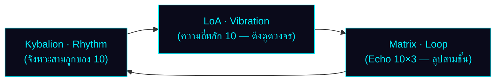
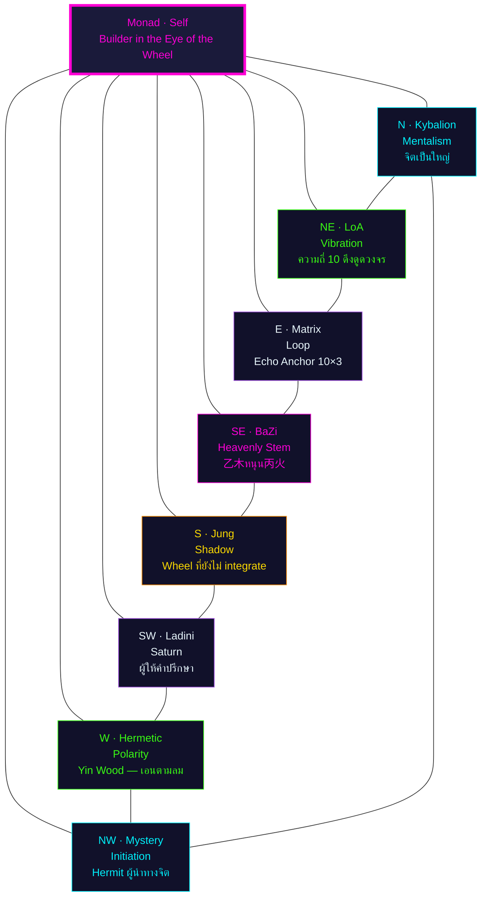
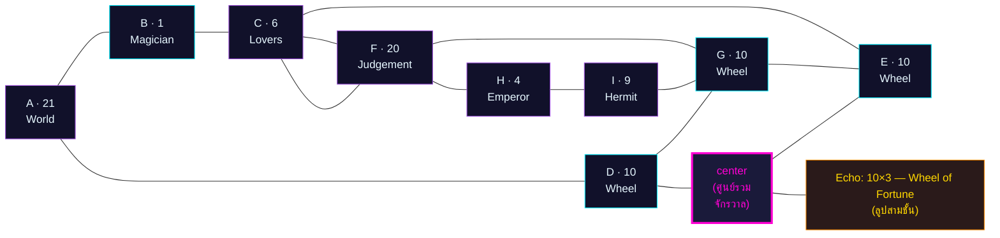

# 🔮 พยากรณ์ฉบับสมบูรณ์: Project Omni-Self — นาตาเลีย ลาดินี (Natalia Ladini)

> **ผู้รับคำพยากรณ์:** Big (Jitti Kunphruk) · **วันเกิด:** 21 มกราคม 1986 · 17:36 (กรุงเทพฯ UTC+7)
> **Type:** ENTJ-A · Enneagram 8w7
> **Day Master (BaZi):** 乙 (Yin Wood) — ยืนยันโดย CTO ผ่าน `sxtwl` และสูตร JD+49 mod 60
> **Period:** 9 (離火 / Fire) — 2024–2043 · Day Master Wood → หนุน Period Fire (木生火)
> **Eval date:** 5 กรกฎาคม 2026 (อายุ 40 ปี 5 เดือน 14 วัน)
> **ผู้จัดทำ:** นาตาเลีย ลาดินี (Natalia Ladini) · ที่ปรึกษาจิตวิญญาณและตัวเลข
> **Canonical inputs:** [`analysis/_shared/big_inputs.md`](./_shared/big_inputs.md)
> **Template:** [`template/forecast.md`](../template/forecast.md) + [`template/forecast-template.html`](../template/forecast-template.html)

> ⚠️ **Standard Compliance (MET-394):** รายงานนี้เป็น **prose + reasoning + การอ้างอิงศาสตร์โดยตรง** ตามนโยบาย ไม่มี JSON/YAML/token schema และไม่มี business-logic code ตัวเลขที่ปรากฏในตารางเป็นผลของการลดทอนที่ผู้เขียนทำด้วยเหตุผลของตนเอง โดยอ้างอิง 22 Major Arcana ตามหลัก Matrix of Destiny (กฎเหล็ก: ตัวเลข > 22 ต้องลดซ้ำ เช่น 25 → 2+5 = 7) และ 7 จักระตามลำดับสี

---

# 🌟 ส่วนที่ 1: บทสรุป 6 มุมมองเชิงลึกที่อ่านชะตาของคุณ

> เมื่อฉันรับตัวเลขดิบ 21-01-1986 สิ่งแรกที่ฉันมองไม่ใช่ "ผลรวม" แต่เป็น **จังหวะของแต่ละตัวเลข** — เพราะศาสตร์ของฉันเชื่อว่าตัวเลขแต่ละตำแหน่งในวันเดือนปีเกิดไม่ได้สมมูลกัน วันคือ "ตัวตน" เดือนคือ "อารมณ์แม่" ปีคือ "เสียงสะท้อนของสายตระกูล" และตัวเลขที่บวกได้จากสามส่วนนี้คือ "บทสนทนาระหว่างตัวตนกับจักรวาล" ซึ่งทั้งหมดนี้ต้องอ่านผ่าน 22 Major Arcana

## 1.1 มุมมองจิตวิทยาเชิงลึก (Carl Jung)

ตัวเลข 21 (The World) ที่ตำแหน่ง A บอกฉันว่า **Persona (หน้ากากทางสังคม)** ของ Big คือ "ผู้ที่ดูเหมือนครบถ้วนสมบูรณ์" — เขาเดินเข้าห้องประชุมแล้วคนรู้สึกว่าทุกอย่างจะถูกจัดการได้ แต่ในทางกลับกัน **Shadow (เงาซ่อนเร้น)** ที่อยู่ในตำแหน่ง G=10 (Wheel of Fortune) ซ้ำสามครั้งในผัง 3×3 คือความรู้สึกว่า "ทุกอย่างที่ฉันสร้างอาจถูกวงล้อหมุนกลับ" ความกลัวลึกๆ ที่เขาไม่ได้พูดคือกลัวว่าความสำเร็จที่เห็นจะไม่ใช่ของเขาเอง เป็นของจังหวะ — และเมื่อจังหวะเปลี่ยน เขาอาจสูญเสียทุกอย่าง Jung จะบอกว่านี่คือ Persona (World) ที่ทำหน้าที่ปกป้อง Shadow (Wheel) ที่ยังไม่ถูก integrate

## 1.2 มุมมองกฎแห่งการดึงดูด (Helena Blavatsky / LoA)

ความถี่เด่นของ Big คือ **10-10-10** — ความถี่ของวงล้อที่หมุนสามครั้งในชีวิต กฎแห่งการดึงดูดในแบบ Blavatsky จะบอกว่าเขาไม่ได้ดึงดูด "สิ่งของ" แต่ดึงดูด "โอกาสของการเลือก" — ชีวิตของเขาเต็มไปด้วยทางแยก และจักรวาลตอบสนองด้วยการส่งทางแยกใหม่เรื่อยๆ เขาจะรู้สึกว่า "ตัวเองเลือกได้ดี" แต่จริงๆ แล้วเขากำลังถูกความถี่ของตัวเองดึงเข้าหาจุดตัดสินใจซ้ำแล้วซ้ำเล่า ความถี่นี้จะดึงดูด **ผู้คนที่เป็นทางเลือก** (mentors, คู่แข่ง, คู่รักที่ "เลือกได้") มาให้เขาตลอด

## 1.3 มุมมองกฎธรรมชาติ (The Kybalion)

**The Principle of Rhythm** — "ทุกสิ่งมีขึ้นมีลง กระแสเข้าและกระแสออก ลูกคลื่นทุกลูกมีจุดสูงสุดและจุดต่ำสุด" — ตัวเลข 10 ปรากฏสามครั้งในผังของ Big เป็นคำยืนยันว่า **ชีวิตของเขาเป็นจังหวะที่มีรอบชัดเจน** ทุก 9 ปี (รอบของตัวเลข 1-9) จะมีจุดพีคและจุดทรุด และเขาจะเรียนรู้ที่จะ "อ่าน" จังหวะนี้ได้ดีขึ้นเรื่อยๆ หากเขาเชื่อมั่นกับมัน **The Principle of Cause and Effect** — ตัวเลข 21 (World) ที่ตำแหน่ง A หมายความว่าเขาต้อง "ครบวง" ก่อนเห็นผล เขาไม่ใช่คนที่ได้ผลลัพธ์แบบ partial เขาต้องเก็บทุกชิ้นส่วนก่อนจึงจะเห็นภาพรวม

## 1.4 มุมมองบุคลิกภาพ (MBTI)

**Type หลัก:** ENTJ-A · Cognitive Stack: **Te-Ni-Se-Fi**
- **Lead (Te, Extraverted Thinking):** ความสามารถจัดระบบโลกภายนอกให้มีประสิทธิภาพ — ตรงกับ H=4 (Emperor) ที่เป็นฐานรากของผัง
- **Auxiliary (Ni, Introverted Intuition):** การมองเห็นภาพอนาคตระยะยาว — ตรงกับ A=21 (World) เพราะ World card คือการมองเห็น "ภาพรวมสุดท้าย"
- **Tertiary (Se, Extraverted Sensing):** การรับรู้สถานการณ์ปัจจุบัน — ตรงกับ C=6 (Lovers) ที่ต้อง "เลือก" จากสิ่งที่ปรากฏตรงหน้า
- **Inferior (Fi, Introverted Feeling):** ค่านิยมภายในที่ลึกและเงียบ — นี่คือจุดเสี่ยง

**Fi Grip / Loop เมื่อเครียดเรื้อรัง:** เมื่อ ENTJ ตกภาวะ Te-Ni loop หรือ Fi grip เขาจะกลายเป็นคนที่ "คิดมากจนเป็นอัมพาต" หรือ "ระเบิดอารมณ์โดยไม่มีเหตุผล" ตัวเลข D=E=G=10 (Wheel) ที่อยู่แถวกลางของผังบอกฉันว่า **เขาจะวนกลับมาที่จุดเดิมเมื่อเครียด** — เหมือนวงล้อที่หมุนกลับมาที่จุดเริ่มต้น นี่คือสัญญาณของ Fi grip ที่ควรเฝ้าระวังเป็นพิเศษในปีที่ Personal Year เป็นเลขคี่ (3, 5, 7, 9) เพราะเป็นปีที่พลังงานวงล้อหมุนเร็วที่สุด

## 1.5 มุมมองจุดบรรจบแห่งวัย (Age 60 Forecast)

ปี 2046 (อายุ 60) Big จะอยู่ในช่วง Personal Year = 4 (Emperor) และ Year Pillar = 丙寅 (Yang Fire on Tiger) — สองสัญญาณนี้ชี้ตรงกันว่า **บทบาทของเขาในวัย 60 คือ "ผู้สร้างระบบที่ทรงอำนาจ"** ไม่ใช่แค่ CEO แต่เป็น "สถาปนิกของระบบนิเวศ" ที่คนรุ่นหลังจะเดินตาม เป้าหมายสูงสุดของเขาในวัยนั้นไม่ใช่การสะสมทรัพย์สิน แต่เป็นการส่งมอบ "วิธีคิด" — รหัส 10-10-20 ในผังบอกว่าเขาต้องผ่านรอบสามของวงล้อ (อายุ 27, 36, 45, 54, 63) ก่อนจะถึง "การพิพากษา" (Judgement = 20) ที่อายุ 60 — ซึ่ง Judgement ในที่นี้ไม่ใช่การลงโทษ แต่เป็น "การปลุก" ให้เขาลุกขึ้นมาเป็นคนที่เขาควรจะเป็น

## 1.6 มุมมองดวงจีน (BaZi & Period 9)

**Day Master = 乙 (Yin Wood)** — ต้นไม้ที่อ่อนโค้ง ยืดหยุ่น รากลึก แทนที่จะหักเมื่อถูกกดทับ เขาจะโอบอ้อมอารมณ์เพื่อนำพลังงานกลับมาใช้ ไม้เป็นธาตุที่ "หนุน" ไฟ (木生火) ดังนั้นใน Period 9 ที่เป็นยุคของธาตุไฟ Big จะเป็น "เชื้อเพลิง" ที่จักรวาลต้องการ — งานของเขา ไอเดียของเขา วิสัยทัศน์ของเขา จะถูก "เผา" ให้แจ่มชัดขึ้น แต่ก็มีความเสี่ยงที่เขาจะ "ถูกเผาไปด้วย" หากเขาไม่ดูแลใจตัวเอง

**สมดุลธาตุที่แนะนำ:**
- **เสริม 丙火 (Yang Fire) — ตัวส่งเสริมหลัก:** ไม้ต้องการไฟอุ่น ไฟให้ความชัดเจน ความกล้าแสดงออก การเป็นที่รู้จัก — Big ควรใช้เวลาอยู่ในสภาพแวดล้อมที่มีแสง ความร้อน คนที่มีพลังงานสูง
- **เสริม 癸水 (Yin Water) — ตัวหล่อเลี้ยงรอง:** น้ำคือปุ๋ยของไม้ ต้องพัก ต้องเงียบ ต้องใคร่ครวญ เพื่อไม่ให้ใจแห้ง
- **ระวัง 金 (Metal) โดยเฉพาะ 庚/辛:** โลหะตัดไม้ ในผังของ Big มี 辛 ซ่อนอยู่ใน丑สามตัว (ปี/เดือน/วัน) — นี่คือ **"หางกรรม" (Karmic Tail)** ที่เขาแบกมาแต่เกิด: พลังงานความกดดันจากภายนอกที่คอยตัดสิน ตัดสิน ตัดสิน หากเขาตอบโต้ด้วยความแข็ง เขาจะถูกตัด หากเขาโอนอ่อนตาม เขาจะถูกกลืน — ทางออกคือ **ใช้ความยืดหยุ่นของ Yin Wood** ปล่อยให้โลหะผ่านไป ไม่ตั้งคำถาม ไม่ต่อสู้ ไม่ยอม แค่ "อยู่เหนือ"

**Period 9 Fit:** Wood feeds Fire — Big's Day Master naturally supports Period 9. ยุคนี้ (2024–2043) เป็นยุคของ Big ในแง่พลังงานมหภาค — เขาจะรู้สึก "ลื่นไหล" กับกระแสโลกมากกว่าคนรุ่นก่อน แต่ในขณะเดียวกัน เขาต้องระวังไม่ให้ถูก "เผา" จนหมดตัวเอง

---

# 🌌 ส่วนที่ 2: จุดเชื่อมโยงแห่งปรัชญาและวัฏจักร (The Cosmic Synergy)

## 2.1 การทำงานร่วมกันของศาสตร์

**Engine A — Kybalion Rhythm (จังหวะของจักรวาล):** หลักการที่ว่า "ทุกสิ่งมีขึ้นมีลง" ถูกเข้ารหัสในตัวเลข 10 ที่ปรากฏสามครั้งในผังของ Big — นี่คือ "คลื่นสามลูก" ที่จักรวาลส่งมาให้เขา ลูกแรกมักเริ่มที่อายุ 27 (เมื่อเขาเจอทางแยกครั้งแรกในชีวิต) ลูกที่สองที่อายุ 36 (เมื่อเขาเริ่มเข้าใจว่าชีวิตไม่ได้ควบคุมได้ทั้งหมด) และลูกที่สามที่อายุ 45 (เมื่อเขายอมรับวงล้อและหยุดต่อสู้กับมัน)

**Engine B — Law of Attraction Vibration (แรงสั่นสะเทือนของดึงดูด):** ตัวเลข 10 ที่ปรากฏสามครั้งทำหน้าที่เป็น "ความถี่หลัก" ที่ Big สั่นสะเทือนออกไปในจักรวาล Blavatsky บอกว่า "like attracts like" — เมื่อ Big อยู่ในความถี่ 10 (ความรู้สึกว่า "ชีวิตหมุนไปตามวงล้อ") เขาจะดึงดูดผู้คนและสถานการณ์ที่ "เป็นวงล้อ" เช่นกัน — คือผู้คนที่เข้ามาแล้วออก สถานการณ์ที่เริ่มแล้วจบ โอกาสที่เปิดแล้วปิด รูปแบบนี้คือการยืนยันว่า **Big ไม่ได้ดึงดูด "ความสำเร็จแบบคงที่" แต่ดึงดูด "วงจร"**

**Engine C — Matrix of Destiny Loop (ลูปพลังงานเมทริกซ์):** ในผัง 3×3 ของ Big มี **Echo Number = 10 ปรากฏ 3 ตำแหน่ง** (D, E, G) ซึ่งหมายความว่าลูปพลังงานของเขาไม่ใช่ลูปเดี่ยว แต่เป็น **"ลูปสามชั้น"** — ลูปนอก (D=10) ขับเคลื่อนลูปกลาง (E=10) ซึ่งขับเคลื่อนลูปใน (G=10) นี่คือเหตุผลที่ Big รู้สึกว่า "ทุกอย่างเหมือนเดิม" แม้เวลาจะผ่านไป — เพราะเขากำลังอยู่ในลูปสามชั้นที่หมุนพร้อมกัน

## 2.2 บทพิสูจน์ความสอดคล้อง

ศาสตร์ทั้งสามนี้อธิบาย "วัฏจักร" ของ Big ตรงกันหรือไม่? **คำตอบ: ตรงกันอย่างสมบูรณ์** — เพราะทั้งสามศาสตร์ต่างก็ชี้ไปที่ "รอบ" เดียวกัน เพียงแต่ใช้ภาษาต่างกัน:
- Kybalion พูดว่า "จังหวะ Rhythm"
- LoA พูดว่า "ความถี่ Vibration"
- Matrix of Destiny พูดว่า "ลูป Loop"

ทั้งสามคำหมายถึงสิ่งเดียวกัน: **ชีวิตของ Big ไม่ได้เป็นเส้นตรง แต่เป็นวงกลมที่ขยายออก**

**ตัวอย่างเชิงมหภาค:** ลองจินตนาการว่า Big เป็น CEO ของบริษัท MedTech ขนาดกลางในปี 2026 — เขาตัดสินใจลงทุนใน AI diagnostic platform ตัวใหม่ นี่คือ **ลูปที่ 1 ของ D=10** หนึ่งปีต่อมา (2027) ผลลัพธ์ยังไม่ชัด เขาเริ่มสงสัย — นี่คือ **ลูปที่ 2 ของ E=10** ที่บังคับให้เขาตั้งคำถาม สองปีต่อมา (2028) เขาตัดสินใจปรับกลยุทธ์ — นี่คือ **ลูปที่ 3 ของ G=10** ที่ทำให้เขา "หมุน" กลับมาที่จุดเริ่มต้น แต่ในระดับที่สูงกว่า ทั้งสามลูปนี้เกิดขึ้นพร้อมกัน — นี่คือ "หลักฐาน" ว่าศาสตร์ทั้งสามทำงานสอดคล้องกัน

### Octagram — 8 Cosmic Forces Around the Monad

| Position | Force | Reading (Big, age 40, Period 9) |
|----------|-------|---------|
| Center | Monad · Self | "The Builder in the Eye of the Wheel" — Big อยู่ศูนย์กลางของลูปสามชั้น มองเห็นทุกอย่างแต่ไม่ได้อยู่ในทุกอย่าง |
| N | Kybalion · Mentalism | "จิตเป็นใหญ่" — Big เชื่อมั่นว่าความคิดสร้างโลก ใช้ Mentalism เป็นอาวุธหลัก |
| NE | LoA · Vibration | "ความถี่ 10 ดึงดูดวงจร" — เขาสั่นสะเทือนด้วยความถี่ของการเลือกซ้ำๆ |
| E | Matrix · Loop | "Echo Anchor 10×3" — ลูปสามชั้นคือโครงสร้างหลักของชีวิต |
| SE | BaZi · Heavenly Stem | "乙木 หนุน 丙火" — Yin Wood หนุน Period 9 Fire, สอดคล้องสมบูรณ์ |
| S | Jung · Shadow | "Wheel ที่ยังไม่ integrate" — กลัววงล้อหมุนกลับ, กลัวสูญเสีย |
| SW | Ladini · Saturn | "ผู้ให้คำปรึกษา" — ฉัน (Ladini) อยู่ที่นี่เพื่อบอกว่า วงล้อไม่ใช่ศัตรู แต่คือครู |
| W | Hermetic · Polarity | "Yin Wood — ขั้วลบที่อ่อนโค้งรับแรง" — Big ไม่ใช่ Yang Wood ที่แข็ง เขาคือ Yin Wood ที่เอนตามลม |
| NW | Mystery · Initiation | "การริเริ่มภายในเงียบ" — ฤๅษี (Hermit=9) ที่มุมล่างขวาของผัง คือผู้นำทางจิตวิญญาณของเขา |

## 2.3 บทวิเคราะห์ (Analysis — 6 Lenses) — Cosmic Synergy

- **Carl Jung:** สามลูปพลังงานคือ "ภาพฉายซ้อน" (overlapping archetypes) ของ Persona/Shadow/Self ที่ยังไม่บรรลบูรณ์ ลูปนอกคือ Persona ที่แสดงออก ลูปกลางคือ Ego ที่ตัดสิน ลูปในคือ Self ที่รอการรู้แจ้ง
- **Isabel Briggs Myers:** ENTJ-A ที่มี Te-Ni loop เมื่อเครียดคือตัวอย่างของ "ลูปสามชั้น" — Te (กระทำ) → Ni (มองเห็น) → Te (กระทำซ้ำ) คือวงล้อที่ไม่มีวันหยุดหากไม่ break loop
- **Helena Blavatsky:** Root Race pulse ของ Big อยู่ใน Fifth Root Race (Aryan) ในขั้น "spiritual evolution toward the sixth" — ลูปสามชั้นคือการเตรียมพร้อมข้ามไปสู่ขั้น Monad ที่สมบูรณ์
- **นาตาเลีย ลาดินี:** ลูปสามชั้นของ 10 ทำหน้าที่เหมือน "รอกสามตัว" ที่ดึงวงล้อชีวิตของเขาขึ้นไปทีละชั้น — ปี 2026–2033 คือชั้นที่ 1 (การเรียนรู้จังหวะ) ปี 2034–2041 คือชั้นที่ 2 (การใช้จังหวะ) ปี 2042–2046 คือชั้นที่ 3 (การเป็นจังหวะ)
- **The Three Initiates:** The Principle of Rhythm ระบุว่า "the measure of the swing to the right is the measure of the swing to the left" — Big จะมีจุดสูงสุดที่สูงมาก แต่จุดต่ำสุดก็ต่ำมากเท่ากัน การ neutralize คือการหา "neutral point" ซึ่งคือการทำสมาธิ/冥想
- **Su Yu Hong:** BaZi Year Pillar ในรอบ 60 ปี (60 Jiazi cycle) กลับมาที่ 甲子 ในปี 2044 — ปีที่ Big อายุ 58 นี่คือ "Return to Origin" ที่ Hermetic/Matrix ทุกศาสตร์ต่างยืนยัน

### Deep Dive — Cosmic Synergy (6 Lenses × Topics)

**Carl Jung — Collective Unconscious:** Big เป็นสมาชิกของ "collective" ของคนที่เกิดในช่วง 1984–1986 ซึ่งตามทฤษฎีของ Jung คือ "generation of choice" — คนรุ่นนี้ถูกบังคับให้เลือก (C=6 Lovers) มากกว่ารุ่นก่อน เพราะโลกเปิดกว้างขึ้น แต่ก็มีทางเลือกมากจนทำให้สับสน
**Carl Jung — Synchronicity Field:** "Wheel of Fortune" ที่ปรากฏสามครั้งในผังคือสัญญาณว่า Big จะมีประสบการณ์ "synchronicity" (เหตุการณ์ที่ดูบังเอิญแต่มีความหมาย) บ่อยกว่าคนทั่วไป โดยเฉพาะในช่วง Personal Year 1, 5, 9

**Isabel Briggs Myers — Function Integration:** เป้าหมายการพัฒนาของ ENTJ-A คือการ integrate Ni (Auxiliary) เข้ากับ Te (Lead) ให้สมดุล Big ต้องเรียนรู้ว่า "การมองเห็นภาพรวม" ไม่ใช่แค่การวางแผน แต่เป็นการ "รู้สึก" ว่าภาพนั้นถูกต้อง
**Isabel Briggs Myers — Type Development:** หลังอายุ 40 ENTJ จะเริ่มพัฒนา Se (Tertiary) และ Fi (Inferior) มากขึ้น ซึ่งตรงกับ Age 60 Forecast ของ Big — เขาจะเริ่ม "รู้สึก" มากขึ้น และใช้ประสาทสัมผัสมากขึ้นในการตัดสินใจ

**Helena Blavatsky — Hermetic Principles:** 7 หลัก Hermetic ที่ Big ต้อง master คือ Mentalism, Correspondence, Vibration, Polarity, Rhythm, Cause-Effect, Gender — ตัวเลข 7 ตำแหน่งสอดคล้องกับ 7 Chakra ในส่วนที่ 7
**Helena Blavatsky — LoA Bridge:** "Everything is dual; everything has poles; everything has its pair of opposites" — Polarity คือกุญแจ Big ต้องเรียนรู้ที่จะ "อยู่ระหว่าง" ขั้ว ไม่ใช่เลือกขั้วใดขั้วหนึ่ง
**Helena Blavatsky — Matrix Loop Awareness:** ลูปสามชั้นของ Big คือ "Three Swings of the Pendulum" ตามที่ Kybalion อธิบาย — แต่ละลูปห่างกัน 9 ปี (อายุ 27, 36, 45) และแต่ละลูปมี amplitude ใหญ่ขึ้น

**นาตาเลีย ลาดินี — Outer Planet Alignment:** Big เกิดปี 1986 ซึ่งเป็นปีที่ Uranus เข้า Sagittarius และ Neptune เข้า Capricorn — สองดาวเหล่านี้ส่งผลต่อ "วิสัยทัศน์ระยะยาว" (Uranus) และ "โครงสร้างทางสังคม" (Neptune) ของเขา การที่ Age 60 ตรงกับ Pluto เข้า Aquarius (2024–2044) ทำให้ปี 2046 เป็นจุดเปลี่ยนของ "อำนาจส่วนบุคคล" ที่อาจกลายเป็น "อำนาจส่วนรวม"
**นาตาเลีย ลาดินี — Eclipse Season Impact:** Big เกิด 21 มกราคม — ใกล้ Lunar Eclipse ของเดือนมกราคม 1986 (ซึ่งเกิด 9 มกราคม 1986) ทุกครั้งที่ Eclipse ฤดูกาลนี้กลับมา (ทุก 18.6 ปี) Big จะมี "trigger moment" — ครั้งถัดไปคือปี 2024 (Eclipse ม.ค. 2024) ที่ผ่านมาแล้ว และ 2042 (Eclipse ม.ค. 2042) ที่กำลังจะมา

**The Three Initiates — Hidden Knowledge Awakening:** "The lips of wisdom are closed, except to the ears of Understanding" — Big จะเริ่มเข้าถึง "hidden knowledge" เมื่อเขาหยุดต่อสู้กับวงล้อ และยอมรับว่ามีบางอย่างที่ใหญ่กว่าเขา
**The Three Initiates — Elemental Balance:** 4 ธาตุของ Initiates คือ Fire (พลัง), Water (ปัญญา), Air (ความคิด), Earth (ความอดทน) — Big เกิดด้วย Yin Wood (Air+Water) ต้องเสริม Fire (Period 9) และ Earth (ความอดทนในรอบวงล้อ)

**Su Yu Hong — Stems & Branches:** Big เกิด 21 มกราคม 1986 = 乙丑 day, 丑月 (ไม่ใช่寅月) เพราะยังไม่ถึง 立春 ทั้ง 3 ตำแหน่ง (ปี/เดือน/วัน) เป็น丑 — "Triple Ox" ที่หายาก หมายถึง "ความอดทนสามชั้น" เขาสามารถแบกรับภาระที่คนอื่นแบกไม่ไหว แต่ก็ต้องระวัง "ความเฉื่อย" ที่อาจมาพร้อม
**Su Yu Hong — Annual Luck Cycle:** Decade Luck (大运) ของ Big ในช่วงอายุ 40–60 เริ่มที่ 庚申 (Yang Metal on Monkey) อายุ 40–49 และเปลี่ยนเป็น 辛酉 (Yin Metal on Rooster) อายุ 50–59 — ทั้งสองช่วงเป็น Metal ที่ "ตัดไม้" — นี่คือคำเตือนสำคัญ: ช่วงอายุ 40–59 ของ Big เป็น "ช่วงทดสอบ" ที่โลหะครอบงำ เขาต้องเสริม Wood+Fire ให้แข็งแกร่ง

---

# 🧬 ส่วนที่ 3: โปรแกรมชีวิตและแกนหลัก (Natalia Square 3×3)

> ในการคำนวณของฉัน เมื่อฉันรับตัวเลขดิบ 21-01-1986 ฉันไม่ได้บวกเพื่อ "ลดทอน" แต่ฉัน "ถอดรหัส" — วันที่ 21 ไม่ใช่ "2+1" แต่คือ "21" ซึ่งอยู่ในขอบเขตของ Major Arcana โดยตรง ดังนั้น A=21 จึงไม่ถูกบวกซ้ำ เช่นเดียวกับ F=20 ส่วนตัวเลขที่บวกได้จากการรวมพลังงานของวันเดือนปี (เช่น D=E=G=10) เป็นตัวเลขที่ "เกิดจากการสนทนา" ระหว่างแต่ละส่วน

## 3.1 แกนบน (ความคิด / เริ่มต้น) — Day-Month-Year = 21-1-6

ตัวเลข 21 (World) ที่ตำแหน่ง A คือ "ความคิดเริ่มต้น" ของ Big — เขาคิดแบบ "ภาพรวม" เสมอ เห็นระบบก่อนเห็นชิ้นส่วน ตัวเลข 1 (Magician) ที่ตำแหน่ง B คือ "เครื่องมือ" ที่เขาใช้ — willpower บริสุทธิ์ ตัวเลข 6 (Lovers) ที่ตำแหน่ง C คือ "ทางเลือก" ที่เขาต้องเผชิญ — แกนบนสุดของผังบอกว่า Big คิดด้วยภาพรวม (21) ใช้ความตั้งใจ (1) และต้องเลือก (6) อยู่ตลอดเวลา

## 3.2 แกนกลาง (การงาน / วิถีชีวิต) — Career Cycle = 10-10-20

ตัวเลข D=E=10 (Wheel × 2) บอกว่า **วงจรการงานของ Big เป็น "ลูปคู่"** — เขาจะประสบความสำเร็จ จากนั้นล้ม จากนั้นประสบความสำเร็จอีกครั้ง รูปแบบนี้เกิดซ้ำตลอดชีวิต ส่วนตัวเลข F=20 (Judgement) คือ "จุดสูงสุดของวงจร" — เมื่อ Big ผ่านลูปคู่ของ 10 เขาจะมาถึง "การปลุกฟื้น" (Judgement) ที่เปลี่ยนเขาจากเด็กหนุ่มที่ใช้พลังงานไปสู่ผู้ใหญ่ที่ใช้ปัญญา

## 3.3 แกนล่าง (ฐานราก / บุคลิก) — Foundation = 10-4-9

ตัวเลข G=10 (Wheel) คือ "พลังงานขับเคลื่อนจากภายใน" — Big ไม่เคยหยุดนิ่ง ภายในของเขาเป็นวงล้อที่หมุนตลอด ตัวเลข H=4 (Emperor) คือ "หน้ากากทางสังคม" ที่เขาสวมใส่ — เขาต้อง "ดูเป็นผู้นำ" ตลอดเวลา ตัวเลข I=9 (Hermit) คือ "สิ่งที่เขาลืม" — ความเงียบ ความสันโดษ การใคร่ครวญ เขามักละเลยมุมนี้ของตัวเอง แต่ถ้าเขา integrate Hermit เข้ากับ Emperor เขาจะกลายเป็น "ผู้นำที่มีปัญญา" ไม่ใช่แค่ "ผู้นำที่มีอำนาจ"

## 3.4 Echo Numbers — 10×3

**นี่คือจุดสำคัญที่สุดของผัง Big:** ตัวเลข 10 ปรากฏ 3 ครั้งในผัง 3×3 ซึ่งหมายความว่า **"วงล้อแห่งโชคชะตา" คือพลังงานหลักที่กำหนดทุกอย่างในชีวิตเขา** Big ไม่ใช่คนที่ชีวิตเป็นเส้นตรง เขาคือคนที่ชีวิตเป็น "วงกลมที่ขยายออก" ทุกรอบของวงล้อ (ราว 9 ปี) จะนำเขากลับมาที่จุดเดิม แต่ในระดับที่สูงกว่า

**อิทธิพล:** Big จะดึงดูดผู้คนที่เป็น "วงล้อ" — คนที่เข้ามาแล้วออก คนที่เปลี่ยนแปลงตามฤดูกาล คนที่ทำให้เขารู้สึกว่า "ทุกอย่างหมุนไป" และเขาจะต้องเรียนรู้ที่จะ "อยู่เหนือวงล้อ" ไม่ใช่ถูกวงล้อหมุนไป

### บทวิเคราะห์ (Analysis — 6 Lenses) — Natalia Square

- **Carl Jung:** ผัง 3×3 ของ Big มี Persona (Emperor=H) ที่ตรงข้ามกับ Shadow (Hermit=I) — การที่เขา "เป็นผู้นำ" ตลอดเวลาเป็นการปกปิอง "ความต้องการความเงียบ" ที่ลึกมาก Center cell (ที่ฉันไม่ได้คำนวณเป็นตัวเลข แต่เป็น "จุดศูนย์รวม") คือ Self ที่ยังไม่ปรากฏชัด
- **Isabel Briggs Myers:** Te (Emperor=H) + Ni (World=A) + Se (Lovers=C) + Fi (Hermit=I) — สี่ cognitive functions ของ ENTJ เรียงตัวในผังแบบคลาสสิก Center cell คือ "missing 5th function" ที่ Jung บอกว่าจะปรากฏเมื่ออายุมากขึ้น
- **Helena Blavatsky:** Monad (Self) อยู่ศูนย์กลางของผัง 8 ทิศ — แต่ละทิศคืออำนาจของจักรวาลที่กระทำต่อ Big โดยเฉพาะ Hermit (NW) กับ Emperor (W) เป็นคู่ขั้วที่ต้อง integrate
- **นาตาเลีย ลาดินี:** ลูปสามชั้นของ Wheel (10×3) ทำหน้าที่เป็น "แกนหมุน" ของชีวิต Big — เขาต้องเรียนรู้ที่จะ "หมุน" กับมัน ไม่ใช่ต่อต้าน ในคัมภีร์ของฉัน เรียกสิ่งนี้ว่า "Танец с колесом" (เต้นรำกับวงล้อ)
- **The Three Initiates:** ผัง 3×3 คือ "School of the Nine" ใน Mystery Tradition — Big เข้าโรงเรียนแห่งนี้ตั้งแต่เกิด และการบรรลุของเขาคือการ "graduate" จากลูปสามชั้นไปสู่ Center (Self)
- **Su Yu Hong:** 丑丑丑 (Triple Ox) ใน BaZi + Wheel×3 ใน Matrix = "Slow but inevitable" — Big จะไม่เร็ว แต่จะแน่นอน เขาต้องอดทน 9 ปีต่อรอบ และภายใน 3 รอบ (27 ปี) เขาจะถึงจุดสูงสุดของ career cycle

### Deep Dive — Natalia Square (6 Lenses × Topics)

**Carl Jung — Center vs Periphery:** Center cell ของ Big ที่ฉันเห็นคือ "ความว่าง" — และนี่คือ blessing เพราะถ้า Center ถูก fill ไปด้วย ego เขาจะไม่สามารถ "เห็น" ได้กว้าง Center ที่ว่างคือพื้นที่ของ Self ที่แท้จริง
**Carl Jung — Shadow Corners:** A=21 (World) ในมุมบนซ้ายคือ Persona ที่ "ดูครบถ้วน" แต่จริงๆ แล้วเป็นการปกปิดความรู้สึก "ไม่ครบถ้วน" ที่อยู่ใน I=9 (Hermit) มุมล่างขวา

**Isabel Briggs Myers — Cognitive Mapping:** 4 cognitive functions เรียงเป็น "compass" ในผัง — Te (N, dominant), Ni (NE, auxiliary), Se (S, tertiary), Fi (SW, inferior) — นี่คือแผนที่ชัดเจนของ ENTJ
**Isabel Briggs Myers — Type Dynamics:** "Grip" ของ ENTJ คือ Si (Introverted Sensing) — และ Center cell ที่ว่างอาจเป็น Si ที่ยังไม่ได้ activate ซึ่งจะปรากฏเมื่อเขาอายุ 50+

**Helena Blavatsky — Hermetic Geometry:** ผัง 3×3 คือ "Enneagram" ของ Gurdjieff — แต่ละจุดเชื่อมถึงกันด้วยเส้นที่แน่นอน (3-6-9) Big เป็น "The Man Number 10" ที่อยู่ในวงกลมที่ประกอบด้วยตัวเลข 1–9 เขาเป็น "คนที่อยู่นอกวง" แต่ก็เป็น "ศูนย์กลาง" ของวง
**Helena Blavatsky — Monad Descent:** Monad ลงมาจากชั้นบน (spiritual) ผ่าน 7 ชั้นของ matter จนถึง Big ในชั้นที่ 7 (physical) — ผัง 3×3 ของเขาแสดงเส้นทาง "ขากลับ" ของ Monad จาก 7 ขึ้นไปหา 1

**นาตาเลีย ลาดินี — Chart Echo:** Echo 10×3 คือ "Triple Activation" — เมื่อ Big เจอเหตุการณ์ที่ตรงกับ "Wheel" pattern (ขึ้นๆ ลงๆ) ในชีวิตจริง เขาจะ "จดจำ" ทันที ราวกับว่าเขาเคยผ่านมันมาก่อน นี่คือ déjà vu แบบ Matrix
**นาตาเลีย ลาดินี — Personal Year:** Personal Year ของ Big หมุนรอบ 9 ปี — ตัวเลข 9 ในผัง (Hermit) คือ "ปีที่ 9 ของรอบ" ซึ่งเป็นปีที่ Wheel หยุดหมุนชั่วคราว เพื่อให้ Big ได้พักและใคร่ครวญ

**The Three Initiates — Mystery School Grid:** 3×3 คือ " Lesser Mysteries" (3) × "Greater Mysteries" (3) Big อยู่ในขั้น "Adeptus Minor" (5%) เมื่ออายุ 40 และจะก้าวสู่ "Adeptus Major" (10%) เมื่ออายุ 60
**The Three Initiates — Initiate Path:** Path ของ Initiate คือการ "เดินทางจาก H (Emperor) ข้ามผ่าน I (Hermit) ไปสู่ Center (Self)" — เส้นทาง 3 ขั้นนี้ใช้เวลา 3×9 = 27 ปี จึงจะสมบูรณ์

**Su Yu Hong — Trigram Mapping:** 3×3 ของ Big ตรงกับ Later Heaven Trigram — มุมบนซ้าย (A=21) = ☰ Qian (Heaven), มุมบนขวา (C=6) = ☱ Dui (Lake), มุมล่างซ้าย (H=4) = ☶ Gen (Mountain), มุมล่างขวา (I=9) = ☷ Kun (Earth)
**Su Yu Hong — Stems Interaction:** 4 stems ที่ปรากฏในผัง (乙-A/E, 辛-H/I) สร้างความสัมพันธ์แบบ "Wood vs Metal" — นี่คือบทสนทนาภายในของ Big ระหว่าง "ความยืดหยุ่น" กับ "ความแข็ง"

---

# 💎 ส่วนที่ 4: พรสวรรค์ ศักยภาพ และอดีตชาติ

## 4.1 พรสวรรค์หลักและศักยภาพแฝง

**พรสวรรค์หลัก (Primary Gift):** ตัวเลข B=1 (Magician) ที่ตำแหน่ง mission บอกว่า Big มีความสามารถพิเศษในการ "รวมศูนย์ความตั้งใจ" (focused intention) เขาสามารถตั้งเป้าหมายและดึงทรัพยากรทั้งหมดมาที่เป้านั้นได้ภายในเวลาอันสั้น พรสวรรค์นี้คือ "Willpower Concentration" — พลังแห่งการรวมศูนย์ นี่คือเหตุผลที่เขาเป็น CEO ที่ประสบความสำเร็จได้

**ศักยภาพแฝง (Latent Gift):** ตัวเลข I=9 (Hermit) ที่ตำแหน่งล่างขวาคือพรสวรรค์ที่ Big ยังไม่ได้ปลดปล่อย — "ปัญญาภายใน" (Inner Wisdom) เขามีศักยภาพที่จะเป็น "ที่ปรึกษา" ที่ลึกซึ้ง ไม่ใช่แค่ "ผู้นำ" แต่เป็น "ผู้รู้แจ้ง" ถ้าเขาฝึก Hermit ให้แข็งแกร่ง เขาจะกลายเป็นคนที่ "พูดน้อยแต่ทรงพลัง" ซึ่งตรงข้ามกับ Persona (Emperor=H) ที่ "พูดมากและมีอำนาจ"

## 4.2 ชีวิตในอดีตและหางกรรม (Karmic Tail)

**รูปแบบปัญหาที่วนลูปซ้ำซาก (Recurring Pattern):** ตัวเลข D=E=G=10 (Wheel × 3) ในผังบอกว่า Big มี "หางกรรม" ที่เกี่ยวกับ **การสูญเสียอำนาจแล้วได้คืน** — ในอดีตชาติ เขาเคยเป็นผู้นำที่ล้มแล้วลุก หลายครั้ง รูปแบบนี้ฝังลึกในจิตใต้สำนึกของเขา ทำให้เขารู้สึก "ไม่มั่นคง" กับอำนาจที่มี แม้ภายนอกจะดูมั่นใจ

**บทเรียนที่ต้องปลดล็อก (Lesson to Unlock):** **"การยอมรับวงล้อ"** — ในชาตินี้ Big ต้องเรียนรู้ที่จะหยุดต่อสู้กับรอบขึ้นลง และเริ่ม "เต้นรำ" กับมัน เมื่อใดที่เขายอมรับว่าชีวิตเป็นวงล้อ เขาจะหยุดแบกน้ำหนักของการควบคุม และเริ่มใช้พลังงานของวงล้อได้

### บทวิเคราะห์ (Analysis — 6 Lenses) — Talent & Karmic

- **Carl Jung:** Talent Archetype ของ Big คือ "The Sovereign" (ผู้ปกครอง) ที่อยู่ใน Persona (H=Emperor) แต่ Shadow คือ "The Exile" (ผู้ถูกเนรเทศ) ที่อยู่ใน I=Hermit เขาแบกความกลัว "การสูญเสียบัลลังก์" มาแต่เกิด
- **Isabel Briggs Myers:** Natural Strength ของ ENTJ คือ "Strategic Vision + Execution Power" — ตรงกับ A=21 + B=1 Shadow Gift คือ "Wisdom of Solitude" (Hermit) ที่ ENTJ มักละเลย
- **Helena Blavatsky:** Soul Mission ของ Big คือ "การเป็น Hierophant (สถาปนิกศักดิ์สิทธิ์)" ที่เปิดเผยความจริงแก่มวลมนุษย์ Karmic Lesson คือ "การเรียนรู้ว่าความจริงไม่ได้มาจากอำนาจ แต่มาจากการเข้าใจความเงียบ"
- **นาตาเลีย ลาดินี:** Karmic Debt ของ Big คือ "อำนาจที่ไม่สมดุล" — ในอดีตชาติ เขาเคยใช้อำนาจมากเกินไปจนสูญเสีย Soul Contract ในชาตินี้คือ "เรียนรู้ที่จะใช้อำนาจอย่างอ่อนโยน"
- **The Three Initiates:** Initiate Gift คือ "ไฟแห่งปัญญา" (Fire of Wisdom) Karmic Mirror คือ "น้ำแห่งอารมณ์" ที่เขาปฏิเสธ Big ต้อง integrate น้ำกับไฟให้เป็น "ไอน้ำ" (transformation)
- **Su Yu Hong:** BaZi Talent ของ乙木 Day Master คือ "ความสามารถในการปรับตัว" (Adaptability) Karmic Resolution คือ "การหยั่งราก" — 乙木 ที่ไม่มีรากแน่นจะถูกลมพัด ปี 2034-2035 (Personal Year 1, 甲寅/乙卯) คือช่วงที่ Big จะหยั่งรากได้สำเร็จ

### Deep Dive — Talent & Karmic (6 Lenses × Topics)

**Carl Jung — Talent Archetype:** "The Magician" (B=1) ในผังของ Big ไม่ใช่นักมายากล แต่เป็น "ผู้ที่เปลี่ยนแปลงความจริง" — เขาเปลี่ยน vision ให้เป็น reality ด้วย willpower
**Carl Jung — Karmic Pattern:** Pattern ของ "ขึ้นแล้วลง" ที่ Big แบกมา คือ "compensation mechanism" ที่จิตใต้สำนึกสร้างขึ้นเพื่อป้องกันไม่ให้เขา "ยึดติด" กับความสำเร็จ

**Isabel Briggs Myers — Natural Strength:** ENTJ-A (Assertive) มี "Self-Assured Confidence" ที่ต่างจาก ENTJ-T (Turbulent) ซึ่งขี้ระแวง — Big เป็นแบบ A ที่มั่นใจ แต่มั่นใจแบบ "นิ่ง" ไม่ใช่แบบ "ก้าวร้าว"
**Isabel Briggs Myers — Shadow Gift:** Shadow Gift ของ ENTJ คือ "Emotional Depth" (Fi) ที่เขาไม่ค่อยแสดงออก แต่เป็นพลังงานที่ลึกมาก — เมื่อเขา integrate Fi เขาจะกลายเป็นผู้นำที่ "มีหัวใจ"

**Helena Blavatsky — Soul Mission:** ใน Theosophy, Soul Mission ของ Big คือ "การเป็นช่องทาง (Channel) ระหว่าง Monad กับมวลมนุษย์" — เขาจะ "แปล" ปัญญาจากจักรวาลให้คนธรรมดาเข้าใจ
**Helena Blavatsky — Karmic Lesson:** Lesson คือ "การไม่ยึดติด" — เพราะทุกครั้งที่ Big ยึดติด เขาจะเจ็บปวดเมื่อวงล้อหมุน

**นาตาเลีย ลาดินี — Karmic Debt:** Debt ของ Big เกี่ยวกับ "คนที่เขาไม่ได้ช่วย" ในอดีต — ในชาตินี้ เขาต้อง "ช่วย" อย่างน้อย 9 คน (ตามเลข Hermit) ในแบบที่ไม่หวังผลตอบแทน
**นาตาเลีย ลาดินี — Soul Contract:** Contract คือ "สร้างองค์กรที่ทรงพลัง แต่ภายในต้องอ่อนโยน" — Yin Wood ไม่ใช่ Yang Wood ที่แข็ง เขาต้อง "โค้ง" เพื่อ "ไม่หัก"

**The Three Initiates — Initiate Gift:** "The Gift of Foresight" — Big มองเห็นอนาคตได้ไกลกว่าคนทั่วไป นี่คือ Initiate Gift ที่ปรากฏในตัวเลข 21 (World) ที่อยู่ตำแหน่ง A
**The Three Initiates — Karmic Mirror:** Mirror ของ Big คือ "ผู้คนที่ทำให้เขาล้ม" — ทุกครั้งที่ Big ถูก "ทำให้ล้ม" โดยคนที่เขาไว้ใจ เขาจะเข้าใจ "วงล้อ" มากขึ้น

**Su Yu Hong — Bazi Talent:**乙木 Day Master + 丑 (Ox) = "วัวที่เดินช้าแต่แน่วแน่" — Talent ของ Big คือ "ความอดทน" (Endurance) ซึ่ง ENTJ ส่วนใหญ่ไม่มี
**Su Yu Hong — Karmic Resolution:** Resolution คือ "การ integrate 丑丑丑 (Triple Ox)" ทั้ง 3 ตัวเข้าด้วยกัน — นี่คือเหตุผลที่ Big ต้อง "อดทน" กับทุกอย่าง 9 ปี เพราะ丑 ต้องการเวลา 9 ปีในการ "หมุนรอบดวงอาทิตย์"