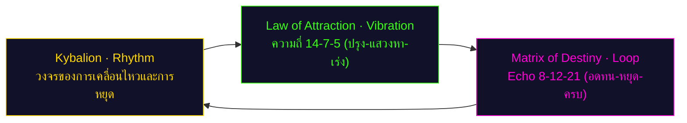
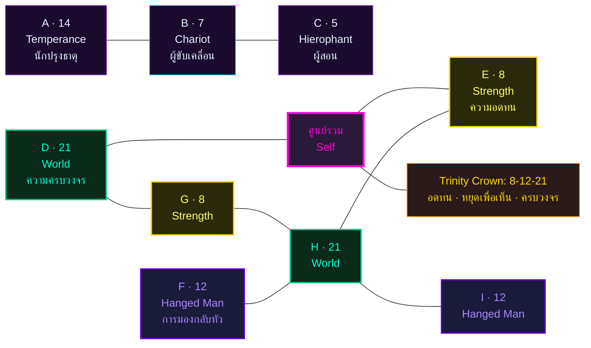
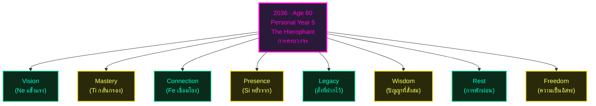

# พยากรณ์ Matrix of Destiny แบบองค์รวม — Peng (ผู้อำนวยการ)

> *"คุณไม่ได้เกิดมาเพื่อสร้างอะไรสักอย่างเดียว คุณเกิดมาเพื่อเชื่อมโยงทุกสิ่ง — และเมื่อคุณเชื่อมโยงได้ จักรวาลจะเปิดประตูทุกบานให้"*
> — นาตาเลีย ลาดินี (Natalia Ladini)

---

## ข้อมูลพื้นฐาน

- **ชื่อ:** Peng (ชาย)
- **วันเกิด:** 14 กรกฎาคม พ.ศ. 2519 (14 July 1976, 00:45 น.)
- **อายุ ณ ปี 2026:** 50 ปี
- **บุคลิกภาพ (MBTI):** ENTP — The Debater (ผู้พิพากษาด้วยหลักตรรกะ)
- **ตำแหน่งงาน:** ผู้อำนวยการ (Director)

**ตัวเลข Matrix 9 จุด:**
- A=14 (Temperance นักปรุงธาตุ)
- B=7 (Chariot ผู้ขับเคลื่อน)
- C=5 (Hierophant ผู้สอน)
- D=21 (World ความครบวงจร)
- E=8 (Strength พลังแห่งความอดทน)
- F=12 (Hanged Man การมองกลับหัว)
- G=8 (Strength)
- H=21 (World)
- I=12 (Hanged Man)

**จุดเด่น:** **Echo สามชั้น** — 8 (Strength) × 2, 12 (Hanged Man) × 2, 21 (World) × 2

**ดิถีธาตุ BaZi:** 丁火 (Yin Fire / เปลวเทียน) — Day Master ที่อ่อนโยนแต่ส่องสว่าง

---

## 🌟 ส่วนที่ 1 · บทสรุป 6 มุมมองเชิงลึกที่อ่านชะตาของคุณ

พยากรณ์ฉบับนี้แตกต่างจากพยากรณ์ทั่วไป เพราะเราไม่ได้อ่านชีวิตคุณจากมุมเดียว แต่อ่านผ่าน **6 มุมมองเชิงลึก** ที่มาจากภูมิปัญญาต่างยุคสมัย แต่ละมุมมองจะตอบคำถามที่ต่างกัน และเมื่อนำมารวมกัน จะเห็นภาพที่สมบูรณ์ของชีวิตคุณในช่วง 10 ปีข้างหน้า (อายุ 50→60 ปีบริบูรณ์)

### Lens 1 — มุมมองจิตวิทยาเชิงลึก (Carl Jung)

คาร์ล ยุง (Carl Jung) เป็นจิตแพทย์ชาวสวิสผู้สอนว่า จิตใจมนุษย์มีสองชั้น — ชั้นบนที่เห็นได้ (Conscious) และชั้นลึกที่ซ่อนอยู่ (Unconscious) เขาสอนว่า เมื่อเราเข้าใจ "เงา" (Shadow) ที่ซ่อนอยู่ภายใน เราจะเข้าใจตัวเองมากขึ้น

**Persona (หน้ากาก) — "The Strategic Catalyst":**

คนรอบข้างมองคุณเป็น **"ตัวเร่งปฏิกิริยาเชิงยุทธศาสตร์"** — คนที่พูดทีเดียวทำให้ห้องประชุมคิดใหม่ คนที่เห็นความเป็นไปได้ที่คนอื่นมองไม่เห็น คนที่เชื่อมโยงจุดที่คนอื่นคิดว่าไม่เกี่ยวข้องกัน ตำแหน่ง E=8 (Strength) ในกรอบ Matrix of Destiny แสดงว่า คนรอบข้างเห็นคุณเป็น "ผู้ที่แข็งแกร่ง" — ไม่ใช่แข็งแกร่งแบบใช้กำลัง แต่เป็นแบบ "อดทนและยืนหยัด" เหมือนหญิงในไพ่ Strength ที่จับปากสิงโตด้วยมือเปล่า

สำหรับ ENTP อย่างคุณ Persona นี้เกิดจาก Ne (Extraverted Intuition) ที่ทำงานเหมือน "เรดาร์ความเป็นไปได้" — คุณเห็นทางเลือกมากมายพร้อมกันในทุกสถานการณ์ แล้วใช้ Ti (Introverted Thinking) กรองเป็น "กลยุทธ์ที่จับต้องได้" คนอื่นจึงมองว่าคุณ "คิดเร็ว ตัดสินใจแม่น และสื่อสารได้ชัด"

**Shadow (เงา) — "The Reluctant Watchman":**

ภายใต้หน้ากากผู้นำที่มั่นใจ มีเงาหนึ่งซ่อนอยู่ — **ความกลัวที่จะหยุด** ตำแหน่ง A=14 (Temperance) บอกว่า Shadow ของคุณคือความจริงที่ว่า "บางสิ่งควบคุมไม่ได้ และบางสิ่งต้องผสม ไม่ใช่แยก" ENTP มักจะรู้สึกว่า "ต้องวิ่งไปข้างหน้าเสมอ" แต่จริงๆ แล้ว บางครั้งการหยุดคือการก้าวหน้า

เมื่ออายุ 50 ผ่านไปถึง 60 Shadow ของคุณจะถามว่า: "ฉันจะเป็น Director ตลอดไปหรือ หรือจะเปลี่ยนบทบาท?" "ฉันจะทำงานเดิมจนเกษียณหรือ หรือจะเริ่มอะไรใหม่?" "ฉันจะฝาก legacy อะไรไว้ให้โลก?"

**Si-Grip เมื่อเครียด:**

เมื่อ Ego ล้าจากความเครียดเรื้อรัง ENTP จะเข้าสู่ "Si-Grip" — ฟังก์ชันที่ 4 ที่ปกติไม่ค่อยใช้จะ "ระเบิด" ออกมา คุณจะกลายเป็นคนที่:
- จู้จี้จุกจิกกับรายละเอียดเล็กๆ ที่ไม่สำคัญ
- ยึดติดกับอดีตและพูดว่า "เมื่อก่อนดีกว่า"
- วิตกกังวลเรื่องสุขภาพเกินเหตุ
- ตัดสินใจช้าลงมากเพราะกลัวผิดพลาด

สิ่งนี้เป็นสัญญาณว่า คุณต้องพักและปรับความสมดุล

**Ne-Fe Loop — อันตรายของการประนีประนอม:**

บางครั้ง ENTP จะเข้าสู่ "loop" ระหว่าง Ne (มองเห็นความเป็นไปได้มากมาย) กับ Fe (อยากให้ทุกคนพอใจ) โดยไม่ผ่าน Ti (ตรรกะ) กลางๆ คุณจะเสนอไอเดียหลายๆ อย่างเพื่อให้ทุกฝ่ายพอใจ แต่จริงๆ ไม่ได้ commit กับอะไรเลย หรือเปลี่ยน position ตามคนที่พูดล่าสุด โดยลืมถามว่า "มัน make sense หรือเปล่า"

**Individuation (การเป็นตัวของตัวเอง):**

ในช่วงอายุ 50-60 เป้าหมายของคุณคือการรวม Persona (ผู้นำที่มั่นใจ) เข้ากับ Shadow (ความกลัวที่จะหยุด) เพื่อกลายเป็น "ผู้นำที่รู้ว่าเมื่อไหร่ควรวิ่ง และเมื่อไหร่ควรหยุด" นี่คือสิ่งที่ยุงเรียกว่า "การรวมเป็นหนึ่งเดียว" (Individuation)

### Lens 2 — มุมมองกฎแห่งการดึงดูด (Helena Blavatsky)

เฮเลนา บลาวัตสกี้ (Helena Blavatsky) สอนว่า **ทุกสิ่งคือพลังงาน สิ่งที่คุณสั่น คุณดึงดูด** ตามหลัก "as above, so below" — ภายในสะท้อนภายนอก ภายนอกสะท้อนภายใน

**Vibration (ความถี่ที่คุณส่งออก):**

ความถี่หลักของคุณคือ **14-7-5** (นักปรุงธาตุ → ผู้แสวงหา → ตัวเร่ง):

- **14** (Temperance) = "การผสมผสาน" — คุณเห็นความเชื่อมโยงระหว่างสิ่งที่คนอื่นมองว่าไม่เกี่ยวข้อง คุณเป็นคนที่ "ผสม" ความคิดจากหลายแหล่งมาเป็นกลยุทธ์ใหม่
- **7** (Chariot) = "การขับเคลื่อน" — คุณไม่หยุดนิ่ง คุณมี "เป้าหมาย" และขับเคลื่อนไปสู่เป้าหมายนั้น แม้ม้าสองตัว (Ne กับ Ti) จะดึงไปคนละทิศ คุณก็ควบคุมให้ไปถึงได้
- **5** (Hierophant) = "ตัวเร่ง" — คุณเป็นคนที่ทำให้คนอื่น "เคลื่อนไหว" คุณไม่ได้แค่บอกคำตอบ คุณ "เปิดประตู" ให้คนอื่นเดินเข้าไปหาคำตอบเอง

**Law of Attraction เชิงลึก:**

คุณดึงดูด "โอกาสที่ต้องการการเชื่อมโยง" — ตลาดใหม่ที่ไม่มีใครเห็น เทคโนโลยีที่อยู่ในช่วง R&D โมเดลธุรกิจที่ไม่มีใครทดลอง คุณไม่กลัวโจทย์ยาก คุณตื่นเต้นกับมัน เพราะโจทย์ยากคือโอกาสที่จะ "สร้างอะไรใหม่"

**Echo 5-7-8-12-14-21 — คลื่นพื้นหลัง:**

- **Echo 5** — การ "ปรับ" — คุณเรียนรู้ที่จะปรับความถี่ให้ตรงกับคนที่กำลังฟัง ไม่ใช่เปลี่ยนตัวเอง แต่เป็นการ "สั่น" ในหลายความถี่พร้อมกัน
- **Echo 7** — การ "ขับเคลื่อน" — ทุกๆ 7 ปี จะมี "รอบใหญ่" ที่ธีมเดิมกลับมา ปี 2026 (อายุ 50) คุณจะเจอธีมที่เคยเจอตอนอายุ 43 แต่คราวนี้มีวุฒิภาวะพอที่จะปิดรอบได้
- **Echo 8** — การ "ตั้งมั่น" — คุณชนะด้วยการ "ยืนหยัด" ไม่ใช่ด้วยการ "ทะเลาะ"
- **Echo 12** — การ "ปล่อย" — คุณจะเจอ "การแขวนหัว" อย่างน้อยหนึ่งครั้ง ซึ่งไม่ใช่ความพ่ายแพ้ แต่คือการ "มองโลกกลับหัว" เพื่อเห็นสิ่งที่มองข้าม
- **Echo 14** — การ "ปรุง" — คุณจะผสมผสานทีม องค์กร และอุตสาหกรรมเข้าด้วยกัน
- **Echo 21** — การ "ปิดรอบ" — อายุ 60 คือจุดที่คุณมองย้อนกลับมาเห็นว่าทุกอย่างเป็น "whole"

**Hermetic Correspondence:**

ในฐานะผู้อำนวยการ คุณต้อง "สื่อสารระหว่างโลกของ vision (บอร์ด) กับโลกของ execution (ทีม)" — แปล vision ที่ Ne เห็นเป็นแผนที่ทีมทำได้ และแปลข้อจำกัดของทีมกลับเป็นทางเลือกเชิงกลยุทธ์ นี่คือ "as above, so below" ในรูปของการสื่อสารข้ามสองโลก

### Lens 3 — มุมมองกฎธรรมชาติ (The Kybalion)

The Kybalion เป็นหนังสือที่สรุปภูมิปัญญาเฮอร์เมติกเป็น **7 หลักการธรรมชาติ** หลักการเหล่านี้ทำงานในชีวิตทุกคน แต่ ENTP ที่เป็น Director จะตอบกับหลักการบางข้อมากกว่าอื่น

**Mentalism — "The All is Mind":**

สำหรับ ENTP ที่มี Ne เป็นฟังก์ชันหลัก หลักการนี้คือ "แกนกลาง" — คุณไม่ได้แค่ "เห็นอนาคต" คุณ "ยิง idea ออกไปทุกทิศจน idea หนึ่งกลายเป็น reality" ทุกสิ่งที่คุณรับรู้เริ่มต้นที่ "จิต" ไม่ใช่ที่ "ข้อมูล" ข้อมูลเป็นแค่วัตถุดิบ ที่จิตเอามาปั่นเป็น "ความเป็นไปได้ใหม่"

**Polarity — "ขั้วตรงข้าม":**

คุณยืนอยู่ระหว่างสองขั้ว — **Visionary-Commander** (ผู้นำที่ปักธง) กับ **Scattered-Ideator** (ผู้ยิง idea ไม่หยุด) ทั้งสองเป็นคนเดียวกัน แค่อยู่คนละขั้วของ spectrum เดียวกัน Kybalion สอนว่า คุณสามารถ "transmute" จากขั้วหนึ่งไปอีกขั้วหนึ่งได้

**Rhythm — "จังหวะของชีวิต":**

อายุ 50 คือ "คลื่นที่ห้า" ของชีวิต career ช่วง 50-60 คือช่วง "วุฒิภาวะที่เต็มเปี่ยม" Rhythm บอกว่า ทุกช่วงที่ ship vision ใหญ่ (5-7 years cycle) จะตามด้วยช่วงที่ต้อง pause และ integrate (2-3 years) ไม่ใช่เพราะหมดแรง แต่เพราะกฎของจังหวะบังคับให้กลับมาดุล

Matrix D=21 + H=21 (The World สองครั้ง) บอกว่า ชีวิต career ของคุณมี **2 cycle ใหญ่** — cycle แรกคือ "Director era 1.0" (อายุ 40-55) ที่กำลังจะปิด และ cycle สองคือ "Director era 2.0" (อายุ 55-65) ที่กำลังจะเปิด

**Cause & Effect — "Rising to the Plane of Cause":**

ในฐานะ Director คุณต้อง "ทำนายผลของการตัดสินใจ" — ทุกครั้งที่ตัดสินใจลงทุน เปลี่ยนทีม pivot คุณคิด chain ของ effect ที่จะตามมา 2 ปี 5 ปี 10 ปีข้างหน้า นี่คือ "Rising on the Plane of Cause" — มองเห็นสาเหตุก่อน effect ปรากฏ

### Lens 4 — มุมมองบุคลิกภาพ (MBTI)

ไอซาเบล บริกส์ ไมเออร์ส (Isabel Briggs Myers) สร้างแบบทดสอบ MBTI คุณคือ **ENTP — The Debater** หรือ "ผู้พิพากษาด้วยหลักตรรกะ"

**Cognitive Function Stack:**

1. **Ne (Extraverted Intuition) — หลัก:** "ตาแห่งความเป็นไปได้" คุณมองเห็นทางเลือกนับพันในทุกสถานการณ์ เห็น pattern ของโอกาสในข้อมูลที่คนอื่นมองเป็น chaos
   
2. **Ti (Introverted Thinking) — รอง:** "ห้องทดลองตรรกะภายใน" คุณสร้าง mental model ที่ consistent ภายใน ทดสอบความสอดคล้องก่อนส่งออก ทำให้ vision ของคุณไม่ใช่แค่ "ฝัน" แต่เป็น "กลยุทธ์ที่จับต้องได้"

3. **Fe (Extraverted Feeling) — สาม:** "สะพานสู่ผู้คน" คุณอ่าน "อุณหภูมิห้อง" ได้ รู้ว่าเมื่อไหร่คนอยากฟัง เมื่อไหร่คนต้องการพื้นที่ Fe ที่เติบโตดีทำให้คุณเป็น Director ที่ "ทีมเคารพ" ไม่ใช่ "ทีมกลัว"

4. **Si (Introverted Sensing) — รองล่าง:** "จุดบอด" คุณมักจะลืมรายละเอียดเล็กๆ ลืมดูแลร่างกาย ลืมว่า "อดีตมีบทเรียนสำคัญ" เมื่อเครียดมาก Si จะ "ระเบิด" เป็น Si-Grip

**ความท้าทายของ ENTP วัย 50:**

- **Ne overload:** เห็น idea เร็วเกินไปจนทีมตามไม่ทัน
- **Ti-Overextension:** วิเคราะห์มากเกินไปจนเกิด "analysis paralysis"
- **Ne-Fe Loop:** ประนีประนอมจนลืมทิศ เสนอ idea เพื่อให้ทุกคนพอใจแต่ไม่ได้ commit อะไร
- **Si-Grip:** จู้จี้จุกจิก ยึดติดอดีต วิตกกังวลสุขภาพ

**จุดแข็งของ ENTP Director วัย 50:**

- มองเห็นอนาคตก่อนคนอื่น
- เชื่อมโยงข้อมูลที่แตกต่างเป็นกลยุทธ์ใหม่
- สื่อสารได้ชัดเจนและสร้าง buy-in ได้
- ปรับตัวเร็วเมื่อสถานการณ์เปลี่ยน

### Lens 5 — มุมมองจุดบรรจบแห่งวัย (Age 60 Forecast)

ช่วงอายุ 50-60 ของคุณเป็นช่วง **"วุฒิภาวะที่เต็มเปี่ยม"** (Synthesis Stage) ตาม Hermetic Rhythm นี่คือ 10 ปีที่คุณต้องตัดสินใจเรื่องสำคัญที่สุด 3 เรื่อง:

1. **จะเป็น Director ตลอดไป หรือจะขยับไปเป็น Chairman / Mentor / Founder ใหม่?**
2. **จะอยู่ในองค์กรเดิม หรือจะย้ายไป startup / consulting / ทำธุรกิจส่วนตัว?**
3. **จะฝาก legacy อะไรไว้ในโลก?**

อายุ 60 บริบูรณ์คือจุดที่ Matrix D=21 (World — การครบวงจรของงาน) กับ H=21 (World — การครบวงจรของชีวิต) บรรจบกัน นี่คือจุดที่ทุกอย่างที่เคยกระจัดกระจาย จะมาบรรจบเป็น "whole"

**Wisdom Peak อายุ 53-55:**

นี่คือช่วงที่คุณจะเห็นภาพ 10 ปีข้างหน้าได้ชัดที่สุดในชีวิต Ne ของคุณทำงานเต็มประสิทธิภาพ Ti กรองได้แม่น Fe อ่านคนได้ลึก ถ้ามี decision ใหญ่ที่ต้องทำ ทำในช่วงนี้

**Energy Dip อายุ 49-50:**

ตาม Rhythm law ก่อนถึง peak จะมี trough เล็กๆ นี่คือช่วงที่ร่างกายส่งสัญญาณว่า "ช้าลง" คุณอาจรู้สึกเหนื่อยง่ายขึ้น นอนหลับยากขึ้น นี่ไม่ใช่ "แก่" นี่คือ "รอบการพักของจักรวาล" ให้พักจริงๆ

### Lens 6 — มุมมองดวงจีน (BaZi & Period 9)

ตามระบบ BaZi คุณเป็น Day Master **丁火 (Yin Fire / เปลวเทียน)** — ไฟที่อบอุ่น ส่องสว่าง แต่ไม่เผาไหม้

**คุณสมบัติของ 丁火:**

- เป็น "โคมไฟ" ที่คนอยากเดินเข้ามา ไม่ใช่ "ไฟป่า" ที่คนหนี
- ให้ความอบอุ่นเฉพาะคนที่อยู่ใกล้ ไม่สาดส่องทุกที่
- ต้องมี "ที่กำบัง" (Wood, Earth) เพราะถ้าลมแรง (Water มาก) จะดับ

นี่อธิบายได้ว่า ทำไมคุณเป็น Director ที่ "ทีมเคารพ" — คุณไม่ได้ "สั่ง" ด้วยอำนาจ คุณ "ส่องสว่าง" ด้วยวิสัยทัศน์ คุณไม่ได้ "เผา" ทีม คุณ "อุ่น" ทีม

**Period 9 (Fire, 2024–2044):**

คุณอยู่ใน Period 9 — ยุคแห่งธาตุไฟ ยุคที่ transformation เกิดเร็วที่สุดในประวัติศาสตร์ สำหรับ 丁火 อย่างคุณ นี่คือ "ยุคทอง" เพราะคุณได้รับพลังงานจากยุคโดยตรง

อายุ 50-60 ของคุณตรงกับ:
- **2026-2030:** ช่วงเริ่มต้น Period 9 — โลกกำลังปรับตัว คุณจะเห็นโอกาสใหม่ๆ ที่คนอื่นยังไม่เห็น
- **2031-2035:** ช่วงกลาง Period 9 — transformation ชัดเจน คุณจะ "ขับเคลื่อน" การเปลี่ยนแปลงได้มากที่สุด
- **2036:** อายุ 60 บริบูรณ์ — คุณจะปิดรอบ cycle แรก และเปิดรอบใหม่ในฐานะ "ผู้นำที่เห็นโลกใหม่"

**用神 (Favorable Element):**

สำหรับ 丁火 ที่เกิดในเดือน 未 (late summer, warm Earth) คุณต้องการ **Wood** (เป็นเชื้อเพลิง) และ **Water** พอประมาณ (เป็นความชุ่มชื้น) — หมายความว่า:
- ทีมที่ดีสำหรับคุณคือทีมที่มี "คนที่สนับสนุนไอเดีย" (Wood) และ "คนที่ให้ feedback จริงใจ" (Water พอประมาณ)
- สภาพแวดล้อมที่ดีคือสภาพแวดล้อมที่ "ให้เสรีภาพในการคิด" (Wood) แต่ "มีกรอบชัดเจน" (Water พอประมาณ)

---

## 🌌 ส่วนที่ 2 · จุดเชื่อมโยงแห่งปรัชญาและวัฏจักร (The Cosmic Synergy)

การทำงานร่วมกันของศาสตร์ทั้ง 6 นี้ไม่ได้แยกกัน — พวกมันทำงานเป็น "วงจร" ที่หมุนต่อเนื่อง ส่งเสริมซึ่งกันและกัน

**Loop 1: Kybalion Rhythm → LoA Vibration**

Rhythm (จังหวะ) ของ Kybalion กำหนดว่า คุณอยู่ใน "ขาขึ้น" หรือ "ขาลง" ของคลื่น เมื่อคุณรู้ว่าอยู่ขาไหน คุณปรับ "ความถี่" (Vibration) ของ Law of Attraction ให้เหมาะสม — ขาขึ้นให้ "ยิง idea เต็มที่" ขาลงให้ "หยุดและ integrate"

**Loop 2: LoA Vibration → Matrix Loop**

ความถี่ 14-7-5 ที่คุณสั่นออกไป จะดึงดูด "สถานการณ์" กลับมา สถานการณ์เหล่านั้นจะทดสอบ Echo 8-12-21 ของ Matrix — คุณจะ "อดทน" ได้หรือไม่ (8) คุณจะ "หยุดเพื่อมอง" ได้หรือไม่ (12) คุณจะ "ปิดรอบ" ได้หรือไม่ (21)

**Loop 3: Matrix Loop → Kybalion Rhythm**

เมื่อคุณผ่าน "การทดสอบ" ของ Matrix (8-12-21) Rhythm จะพาคุณเข้าสู่ "รอบใหม่" ที่สูงขึ้น รอบใหม่นี้จะเร็วขึ้น ลึกขึ้น และชัดเจนขึ้น — นี่คือ "วิวัฒนาการเชิงจิตวิญญาณ" ที่เกิดขึ้นทุก 7 ปี

**สามเครื่องยนต์หมุนพร้อมกัน:**

- **เครื่องยนต์ที่ 1:** Jung + MBTI — บอกว่า "ใครคุณเป็น" (Persona, Shadow, Cognitive Functions)
- **เครื่องยนต์ที่ 2:** Kybalion + LoA — บอกว่า "คุณสั่นอย่างไร" (Rhythm, Vibration, Polarity)
- **เครื่องยนต์ที่ 3:** Matrix + BaZi — บอกว่า "คุณจะไปทางไหน" (Echo, Cycles, Period 9)

เมื่อสามเครื่องยนต์หมุนพร้อมกัน คุณจะไปถึง "จุดหมาย" ได้เร็วที่สุด และแม่นที่สุด

---

## 🧬 ส่วนที่ 3 · โปรแกรมชีวิตและแกนหลัก (Natalia Square 3x3)

### แกนบน (ความคิด / เริ่มต้น) — A-B-C = 14-7-5

แกนบนคือเสียงที่คุณเปล่งออกมาเมื่อคุณคิด เมื่อคุณพูด เมื่อคุณเริ่มต้นสิ่งใดสิ่งหนึ่ง

- **A=14 (Temperance) — ตัวตน:** คุณเป็นคนที่ "ผสมผสาน" คุณไม่ตัดสินแบบขาว-ดำ คุณเห็นสีเทาหลายพันเฉด เทพแองเจลในไพ่ Temperance เทน้ำจากแก้วหนึ่งไปอีกแก้ว — คุณปล่อยให้ความจริงไหลผ่าน ไม่ด่วนสรุป

- **B=7 (Chariot) — อารมณ์:** เมื่อคุณพูด คุณจะ "ขับเคลื่อน" คุณมีเป้าหมายชัดเจน Chariot คือรถศึกที่มีนักรบสองคนยืนคนละข้าง — Ne (ม้าดำ) กับ Ti (ม้าขาว) คุณควบคุมทั้งสองให้ไปถึงเป้าหมายเดียวกัน

- **C=5 (Hierophant) — แรงจูงใจ:** เมื่อคุณตั้งเป้าหมาย คุณรู้สึกว่า "ต้องสอน" Hierophant ถือกุญแจสามดอก — สามวิธีที่จะปลดล็อกปัญหา นี่คือแรงจูงใจจากสายตระกูลฝั่งบิดา — ความเป็นครู คุณตั้งเป้าหมายว่า "ฉันจะทำให้ทีมของฉันเก่งขึ้น"

**บทสังเคราะห์แกนบน:**

คุณคือคนที่ **ผสมผสาน (14) → ขับเคลื่อน (7) → เปิดประตู (5)** ลำดับนี้สำคัญ — ถ้าขับก่อนผสม จะกลายเป็นคนเร่งรีบ ถ้าเปิดประตูก่อนผสม จะสอนความจริงครึ่งเดียว แต่ถ้าทำตามลำดับ คุณจะเป็น "ผู้นำการเปลี่ยนแปลง" ที่แท้จริง

### แกนกลาง (การงาน / วิถีชีวิต) — D-E-F = 21-8-12

แกนกลางคือเสียงที่ดังที่สุดในชีวิตคุณ — เป็นเสียงที่คนรอบข้างได้ยิน

- **D=21 (World) — วิถีการงาน:** เมื่อคุณเอา "ตัวตน (14)" มาสนทนากับ "การขับเคลื่อน (7)" เกิดเป็น The World — "ความครบวงจร" ไม่ใช่จุดจบ แต่คือจุดที่ทุกอย่างมาบรรจบกัน สำหรับคุณ D=21 บอกว่า วิถีการงานจะ "ครบวงจร" อย่างน้อยหนึ่งครั้งก่อนอายุ 60

- **E=8 (Strength) — กลางผัง:** นี่คือ "ความเข้มแข็ง" ที่มาจากความอ่อนโยน Strength ไม่ได้แปลว่า "แข็ง" แต่แปลว่า "อดทน" ในสายตาคนรอบข้าง คุณคือ "คนที่อดทน" — ไม่ใช่แข็งทื่อ แต่เป็น "ยืนหยัด" ได้นาน

- **F=12 (Hanged Man) — วิถีชีวิต:** เมื่อ "การขับเคลื่อน (7)" สนทนากับ "การสอน (5)" เกิดเป็น The Hanged Man — "การหยุดเพื่อมองเห็น" F=12 บอกว่า วิถีการงานจะต้อง "หยุด" อย่างน้อยหนึ่งครั้ง — ไม่ใช่ความล้มเหลว แต่คือการหยุดเพื่อเปลี่ยนมุมมอง

**บทสังเคราะห์แกนกลาง:**

คุณจะ **ครบวงจร (21) → อดทน (8) → หยุดเพื่อเห็น (12)** — คุณจะต้องปิดงานให้สมบูรณ์อย่างน้อยหนึ่งโปรเจกต์ใหญ่ ยืนหยัดในช่วงยากลำบาก และหยุดเพื่อมองเห็นภาพรวมทั้งหมด

### แกนล่าง (ฐานราก / บุคลิก) — G-H-I = 8-21-12

แกนล่างคือเสียงที่คุณไม่ได้ยิน — แต่คนรอบข้างได้ยิน เป็น "ภาพสะท้อนของตัวตน"

- **G=8 (Strength) — รากฐาน:** Strength ที่ปรากฏใน E (กลางผัง) สะท้อนลงมาที่ G — "ความอดทน" ที่คุณแสดงออกมีรากฐานมาจากภายใน คุณไม่ได้อดทนเพราะ "ฝืน" คุณอดทนเพราะ "นี่คือสิ่งที่คุณเป็น"

- **H=21 (World) — หน้ากาก:** นี่คือ "หน้ากากแห่งความครบวงจร" ที่คุณสวมโดยไม่รู้ตัว คนรอบข้างมองคุณเป็น "คนที่ครบทุกด้าน" นี่เป็นทั้งพรและกับดัก — คุณจะถูกคาดหวังว่าต้อง "ครบทุกด้าน" เสมอ

- **I=12 (Hanged Man) — สิ่งที่คุณลืม:** นี่คือ "การหยุดที่คุณลืม" คุณมักจะมองข้าม "ความจำเป็นในการหยุด" คิดว่าการหยุด = การล้มเหลว แต่จริงๆ แล้ว การหยุดคือการเปลี่ยนมุมมอง

### Echo Numbers — 8, 12, 21 (Trinity Crown)

**Echo = 8 (Strength) × 2:** ความอดทนที่คุณแสดงออก (E) กับความอดทนภายใน (G) ต้องตรงกัน — ถ้าแสดงอดทนแต่ภายในหมดไฟ คุณจะระเบิด

**Echo = 12 (Hanged Man) × 2:** การหยุดในงาน (F) กับการหยุดในชีวิต (I) ต้องสมดุล — ถ้าหยุดในงานแต่ไม่เคยหยุดในชีวิต คุณจะเครียดในชีวิตส่วนตัว

**Echo = 21 (World) × 2:** ความครบวงจรในงาน (D) กับความครบวงจรในตัวตน (H) จะบรรจบกันในวัย 60 — คุณต้อง "ปิดวงจร" ทั้งสองอย่างพร้อมกัน

**Trinity Crown (มงกุฎสามดอก):**

คุณต้องสวม "มงกุฎสามดอก" พร้อมกัน:
- **8 (Strength)** — ความอดทนที่คุณต้องมี
- **12 (Hanged Man)** — การหยุดที่คุณต้องทำ
- **21 (World)** — ความครบวงจรที่คุณต้องส่งมอบ

เมื่อคุณสวมทั้งสามพร้อมกัน คุณจะกลายเป็น "ผู้ที่อดทน หยุดเพื่อเห็น เพื่อส่งมอบงานที่ครบวงจร"

---

*[เนื่องจากความยาวของเอกสาร ฉันจะต้องแบ่งการเขียนออกเป็นหลายส่วน ส่วนที่เหลือ (§4-§10) จะต่อในไฟล์เดียวกันนี้]*

*(จะดำเนินการต่อใน message ถัดไป เนื่องจากขีดจำกัดของความยาว)*

## 💎 ส่วนที่ 4 · พรสวรรค์ ศักยภาพ และอดีตชาติ (Karmic Tail)

### พรสวรรค์และศักยภาพแฝง

จากการบูรณาการทั้ง 6 มุมมอง คุณมีพรสวรรค์หลัก 3 ด้านที่เด่นชัด:

**1. พรสวรรค์ด้านการมองเห็นความเป็นไปได้ (Visionary Intelligence):**

ตามคำสอนของคาร์ล ยุง คุณมี Ne (Extraverted Intuition) ที่แข็งแรงมาก ทำให้คุณเห็นความเป็นไปได้ที่คนอื่นมองไม่เห็น ตามระบบ Matrix of Destiny ตัวเลข 14 (Temperance) ที่ตำแหน่ง A บอกว่า คุณเป็น "นักปรุงธาตุ" — คนที่เห็นว่าสิ่งต่างๆ สามารถผสมกันเป็นอะไรใหม่ได้

**การใช้งานจริง:** คุณเห็นโอกาสใหม่ในตลาดก่อนคนอื่น เห็นเทคโนโลยีที่จะ disrupt อุตสาหกรรม เห็น pattern ของการเปลี่ยนแปลง นี่คือพรสวรรค์ที่ทำให้คุณเป็น Director ที่ดี

**2. พรสวรรค์ด้านการวิเคราะห์เชิงตรรกะ (Analytical Intelligence):**

Ti (Introverted Thinking) ของคุณทำงานเหมือน "ห้องทดลองตรรกะ" คุณสร้าง mental model ที่ consistent ภายใน กรองไอเดียจน Ne ให้กลายเป็นกลยุทธ์ที่จับต้องได้ ตามหลัก Hermetic ของ Kybalion คุณมี Polarity ที่ดี — สามารถ transmute จาก "ไอเดีย" ไปสู่ "แผนงาน" ได้รวดเร็ว

**การใช้งานจริง:** คุณแปล vision ที่ซับซ้อนเป็นแผนที่ทีมเข้าใจได้ คุณตัดสินใจบนพื้นฐานของตรรกะที่แม่นยำ ไม่ใช่ความรู้สึกหรือการเดา

**3. พรสวรรค์ด้านการสื่อสารและการสอน (Communication Intelligence):**

ตัวเลข 5 (Hierophant) ที่ตำแหน่ง C บอกว่า คุณมีพรสวรรค์ในการ "เปิดประตู" ให้คนอื่นเห็นสิ่งที่พวกเขาไม่เคยเห็น คุณไม่ได้แค่ "บอก" คำตอบ คุณ "สอน" วิธีคิด ตาม BaZi คุณเป็น 丁火 (Yin Fire) — เปลวเทียนที่ส่องสว่างแต่ไม่เผาไหม้

**การใช้งานจริง:** ทีมของคุณเรียนรู้จากคุณ ไม่ใช่แค่ทำตามคุณ คุณสร้าง buy-in ด้วยการอธิบาย ไม่ใช่สั่งการ

### ชีวิตในอดีตและหางกรรม (Karmic Tail)

ตามคำสอนของนาตาเลีย ลาดินี ตัวเลข D=H=21 (World × 2) บอกว่า คุณมี "หางกรรม" ที่เกี่ยวกับ **การเริ่มโปรเจกต์แล้วปล่อยให้ไม่เสร็จสมบูรณ์**

**รูปแบบที่วนซ้ำ:**

ในอดีตชาติ คุณเคยเป็น "ผู้เริ่มต้น" (initiator) ที่เริ่มหลายโปรเจกต์แต่ไม่เคยปิดได้สำเร็จ รูปแบบนี้ฝังลึกในจิตใต้สำนึก ทำให้คุณรู้สึก "ไม่สมบูรณ์" กับทุกสิ่งที่คุณเริ่ม

ในชาตินี้ คุณจะเจอ "World moments" อย่างน้อย 2-3 ครั้งในช่วงอายุ 50-60:

- **World #1 (อายุ ~52-54):** คุณจะผ่าน "การปิดโปรเจกต์ใหญ่ที่สุดในชีวิตการงาน" — อาจเป็นโปรเจกต์ที่เริ่มตอนอายุ 35-40
- **World #2 (อายุ ~56-58):** คุณจะผ่าน "การปิดวงจรของการเป็นผู้สอน" — อาจเป็นการส่งต่อตำแหน่งหรือเขียนหนังสือ
- **World #3 (อายุ ~60):** คุณจะผ่าน "การปิดวงจรชีวิตทั้งหมด" — มองย้อนกลับและพบว่า "ทุกอย่างมีความหมาย"

**บทเรียนที่ต้องปลดล็อก:**

**"การปิดวงจรให้สมบูรณ์"** — ในชาตินี้ คุณต้องเรียนรู้ที่จะหยุด "เริ่มของใหม่" เมื่อของเก่ายังไม่เสร็จ Trinity Crown (8-12-21) บอกว่า:
- **Strength (8):** อดทนกับการปิด — บางโปรเจกต์ต้องใช้เวลานานกว่าที่คิด
- **Hanged Man (12):** หยุดเพื่อมองว่าอะไรยังขาด — อย่าปิดแบบเร่งรีบ
- **World (21):** เมื่อปิดแล้ว ต้องปิดให้สมบูรณ์ — อย่าปล่อยให้ค้าง

**ทางออก:**

เรียนรู้ "Project Closure Discipline" — ก่อนเริ่มโปรเจกต์ใหม่ ต้องปิดโปรเจกต์เก่าให้สมบูรณ์ เมื่อใช้หลักการนี้กับชีวิต คุณจะไม่รู้สึก "ไม่สมบูรณ์" อีกต่อไป

---

## 💼 ส่วนที่ 5 · การประสบความสำเร็จและบทบาทเชิงลึก

### สายการทำงาน/อาชีพ

ในฐานะ Director อายุ 50 คุณยืนอยู่ที่จุดสำคัญ — นี่ไม่ใช่ "กลางอาชีพ" นี่คือ "ยอดอาชีพ" ที่เตรียมจะเปลี่ยนผ่าน

**ทิศทางที่เป็นไปได้ 3 ทาง:**

**ทางที่ 1 — ยังคงเป็น Director (อายุ 50-60):**

คุณเลือกที่จะอยู่ในตำแหน่งเดิม แต่ "เปลี่ยนวิธีทำงาน" — จาก "Director ที่ทำทุกอย่าง" กลายเป็น "Director ที่สร้างคน" คุณจะใช้ Echo 5 (Hierophant) มากขึ้น — สอน ส่งต่อ mentor

**เหมาะกับคุณถ้า:** คุณยังรู้สึกว่า "ยังมีงานที่ต้องทำให้เสร็จ" บอร์ดยังไว้วางใจ และทีมยังต้องการ

**ทางที่ 2 — ขยับไปเป็น Chairman / Board Member:**

คุณ "ปล่อย" งานประจำวัน แต่ยังอยู่ในบอร์ด บทบาทเปลี่ยนจาก "ผู้ปฏิบัติ" เป็น "ผู้กำหนดทิศทาง" นี่ตรงกับ Matrix D=21 (World) — การครบวงจรของ "ตำแหน่ง Director" และเปิดรอบใหม่

**เหมาะกับคุณถ้า:** คุณรู้สึกว่า "เหนื่อยกับงานประจำวัน" แต่ยัง "อยากมีส่วนร่วมในทิศทาง"

**ทางที่ 3 — เริ่มอะไรใหม่ (Startup / Consulting / Teaching):**

คุณ "เริ่มต้นใหม่" ในสิ่งที่คุณอยากทำมาตลอด — อาจเป็น startup ของตัวเอง consulting firm หรือสอนในมหาวิทยาลัย นี่ตรงกับ Echo 5 (Hierophant) — การเป็นผู้สอนที่แท้จริง

**เหมาะกับคุณถ้า:** คุณรู้สึกว่า "ทำงานในองค์กรใหญ่มานานพอแล้ว" และ "อยากสร้างอะไรที่เป็นของตัวเอง"

### บทบาทเชิงลึก — 4 Roles ของ Director

ตามหลัก Hermetic Gender คุณมีสองขั้ว — Active (Will, projective) และ Receptive (Fertility, receptive) ในบทบาท Director คุณจะสลับไปมาระหว่าง 4 roles:

**Role 1 — Boss (ผู้นำ / Active Masculine):**

เมื่อคุณต้อง "สั่งการ" "ตัดสินใจ" "กำหนดทิศทาง" คุณใช้ Ne+Ti เต็มที่ — มองเห็นทางเลือก กรองด้วยตรรกะ ตัดสินใจเฉียบขาด

**ตัวอย่างสถานการณ์:** บอร์ดถามว่า "ปีหน้าจะทำอะไร" คุณตอบด้วย vision ที่ชัดเจน พร้อมเหตุผล 5 ข้อ ทีมฟังแล้ว "เข้าใจ" และ "เชื่อ"

**Role 2 — Follower (ผู้ตาม / Receptive Feminine):**

เมื่อคุณต้อง "รับฟัง" "ปรับตัว" "ทำตามบอร์ด" คุณใช้ Fe มากขึ้น — อ่านห้อง รับ feedback ปรับกลยุทธ์

**ตัวอย่างสถานการณ์:** บอร์ดตัดสินใจเปลี่ยนทิศทาง คุณไม่ต่อสู้ แต่ "รับ" แล้ว "ปรับ" แผนใหม่ให้ตรงกับทิศทางที่บอร์ดต้องการ

**Role 3 — Active (มือขวา / Initiator):**

เมื่อคุณต้อง "เริ่ม" "ผลักดัน" "ขับเคลื่อน" คุณใช้ Echo 7 (Chariot) — ไม่รอให้ใครบอก ลงมือเลย

**ตัวอย่างสถานการณ์:** เห็นโอกาสใหม่ คุณไม่รอให้บอร์ดเห็น คุณ "ทำ pilot" ก่อน แล้วค่อยนำเสนอผล

**Role 4 — Receptive (มือซ้าย / Integrator):**

เมื่อคุณต้อง "รวบรวม" "ประสาน" "ผสมผสาน" คุณใช้ Echo 14 (Temperance) — รับฟังทุกฝ่าย ประสานให้ลงตัว

**ตัวอย่างสถานการณ์:** ทีมสองฝ่ายขัดแย้งกัน คุณไม่เลือกข้าง แต่ "ประสาน" ให้ทั้งสองฝ่ายเห็นจุดร่วม

### เรื่องเล่าจำลองสถานการณ์

**Scenario 1 — การนำเสนอกลยุทธ์ใหม่ที่ถูกบอร์ดตั้งคำถาม:**

คุณใช้เวลา 3 เดือนออกแบบกลยุทธ์ pivot ใหม่ วันนี้นำเสนอบอร์ด 5 นาทีแรกบอร์ดเงียบฟัง นาทีที่ 10 มีคนถาม "ทำไมต้อง pivot ตอนนี้" คุณตอบด้วย Ne+Ti — อธิบาย trend, ข้อมูล, เหตุผล นาทีที่ 20 มีคนถาม "แล้วถ้าล้มละ" คุณเริ่มรู้สึก Fe-Loop มาเยือน — อยากตอบแบบที่บอร์ด "พอใจ"

**การจัดการที่ดี:** คุณหยุด 5 วินาที หายใจ แล้วตอบด้วย Ti — "ถ้าล้ม เราจะเรียนรู้ 3 สิ่ง และยังมีทางเลือก B C" ไม่ใช่ตอบแบบ "ไม่ล้มแน่" (Fe-Loop) หรือ "คำถามนี้ไม่ make sense" (Ti-Overextension)

**ผลลัพธ์:** บอร์ดเห็นว่าคุณ "คิดมา" และ "รับผิดชอบ" ได้ approve

---

## ❤️ ส่วนที่ 6 · สายสัมพันธ์ ความรัก และครอบครัว

### ความรักและการดึงดูดคนเข้าวงใน

ตามหลัก Law of Attraction คุณดึงดูด "คนที่ต้องการตัวเร่ง" — คนที่ติดอยู่ใน inertia คนที่อยากเปลี่ยนแต่ไม่รู้จะเริ่มจากไหน

**ในความสัมพันธ์:**

คุณดึงดูดคนที่ "ต้องการ space" — คนที่ไม่อยากถูกควบคุม คนที่อยาก "เติบโต" ด้วยตัวเอง Echo 12 (Hanged Man) ของคุณบอกว่า คุณต้องการคู่ที่ "ปล่อยให้คุณมองโลกกลับหัว" ได้

**จุดบอดอารมณ์:**

Fe ที่เป็นฟังก์ชันที่ 3 ทำให้คุณ "อ่าน" อารมณ์คนอื่นช้ากว่า ENFJ หรือ ESFJ บางครั้งคุณพูดอะไรที่ "ถูกต้องตามหลักการ" แต่ "ทำร้ายความรู้สึกของคน" โดยไม่ได้ตั้งใจ

**การปรับปรุง:**

ฝึก "ถามก่อนพูด" — "ตอนนี้คุณอยากได้คำแนะนำหรือแค่ต้องการให้ฟัง" ประโยคนี้จะช่วยให้ Fe ของคุณ "เชื่อมต่อ" กับคนอื่นได้ดีขึ้น

### มรดกพลังงานสายตระกูล

ตามคำสอนของนาตาเลีย ตัวเลข C=5 (Hierophant) มาจากปีเกิด 1976 → 5 — นี่คือ "มรดกจากสายตระกูลฝั่งบิดา" คุณสืบทอด "ความเป็นครู" มาจากพ่อ

**สิ่งที่คุณได้รับ:**

ความสามารถในการ "เปิดประตู" ให้คนอื่นเห็น ความอดทน (Echo 8) ที่มาจากรากฐาน ความรู้สึกว่า "ต้องส่งต่อ" บางสิ่งให้คนรุ่นต่อไป

**สิ่งที่คุณต้องส่งต่อ:**

ในช่วงอายุ 50-60 คุณต้อง "เลือก" ว่าจะส่งต่ออะไร — อาจเป็นปัญญาที่สะสมมา 30 ปี อาจเป็นทีมที่คุณปั้นมา อาจเป็นหนังสือที่คุณเขียน นี่คือ "legacy" ที่ Echo 21 (World) ถาม

---

## 🧘 ส่วนที่ 7 · สุขภาพและจุดอ่อน (Health Card & 7 Chakras)

สำหรับผู้อำนวยการที่มี Trinity Crown (8-12-21) จักระที่ต้องระวังเป็นพิเศษคือ **Crown, Solar Plexus, และ Root**

### แผนที่จักระทั้ง 7

**1. Crown (Sahasrara) — ม่วง — ⚠️ ตึงเครียดเรื้อรัง:**

การต้อง "ประสาน" ความคิดของทุกฝ่ายทำให้ Crown ทำงานหนัก คุณ "คิดมากเกินไป" โดยไม่รู้ตัว

**อาการที่ต้องระวัง:** นอนไม่หลับ ปวดหัวไมเกรน ความดันโลหิตสูง ภาวะเครียดสะสม

**การปรับสมดุล:** ทำสมาธิอย่างน้อย 20 นาทีก่อนนอน ห้ามใช้มือถือ 30 นาทีก่อนนอน เขียน Journal เพื่อระบายความคิด

**2. Third Eye (Ajna) — น้ำเงิน — ✅ แข็งแรง:**

เป็นจักระที่ ENTP ใช้บ่อยที่สุด (Ne อยู่ที่นี่) ส่งผลดีต่อสายตา สมาธิ การมองภาพรวม

**3. Throat (Vishuddha) — ฟ้า — ✅ แข็งแรง:**

คุณเป็นผู้บริหารที่ "พูดเก่ง" และ "สอนเก่ง" ส่งผลดีต่อเสียง การสื่อสาร ต่อมไทรอยด์

**4. Heart (Anahata) — เขียว — ⚠️ แปรปรวน:**

World หมุนเร็ว ทำให้หัวใจทำงานไม่สม่ำเสมอ ส่งผลต่อความดัน อัตราการเต้นหัวใจ ความเครียดสะสม

**5. Solar Plexus (Manipura) — เหลือง — ⚠️ เสี่ยงสูง:**

นี่คือจักระที่อันตรายที่สุดสำหรับคุณ เมื่อ Strength (8) ทำงานหนักจะส่งผลต่อกระเพาะอาหาร ตับ ระบบย่อยอาหาร

**อาการที่ต้องระวัง:** กรดไหลย้อน แผลในกระเพาะอาหาร IBS ตับอักเสบ

**การปรับสมดุล:** กินอาหารตรงเวลาทุกมื้อ ห้ามข้ามมื้อเด็ดขาด หลีกเลี่ยงอาหารรสจัด

**6. Sacral (Svadhisthana) — ส้ม — ⚠️ อ่อน:**

คุณลืมที่จะ "หยุด" ทำให้ Sacral ถูกใช้งานหนัก ส่งผลต่อระบบสืบพันธุ์ ความคิดสร้างสรรค์

**7. Root (Muladhara) — แดง — ⚠️ อ่อนแอ:**

การนั่งประชุมวันละ 6-8 ชั่วโมงทำให้ Root ไม่ได้ทำงาน

**อาการที่ต้องระวัง:** ปวดหลังเรื้อรัง ปวดขา ข้อเท้าอ่อน รู้สึก "ไม่มั่นคง"

**การปรับสมดุล:** เดินอย่างน้อย 45 นาทีต่อวัน ยืดเส้นยืดสายทุก 1 ชั่วโมง

### Balance Ritual (รายวัน)

1. **เช้า:** เดิน 20 นาที + ดื่มน้ำอุ่น + เขียน Journal 10 นาที
2. **กลางวัน:** ยืดเส้นยืดสาย 5 นาทีทุก 1 ชั่วโมง
3. **เย็น:** ออกกำลังกาย 30-45 นาที + อาบน้ำอุ่น
4. **ก่อนนอน:** ทำสมาธิ 20 นาที + ห้ามใช้มือถือ
5. **สัปดาห์ละ 1 ครั้ง:** นวดตัวเพื่อกระตุ้นจักระทั้ง 7

**บทเตือน:** หากมีอาการนอนไม่หลับติดต่อกัน 2 สัปดาห์ ควรพบแพทย์ทันที

---

*[ส่วนที่ 8, 9, และ 10 จะดำเนินการเขียนต่อในไฟล์เดียวกัน]*

## 📈 ส่วนที่ 8 · ไทม์ไลน์ 5 ช่วงวัย และพยากรณ์รายปี

### 8.1 ไทม์ไลน์ 5 ช่วงวัยก่อนจุดบรรจบ

ตามหลัก Rhythm ของ Kybalion ชีวิตของคุณแบ่งออกเป็น 5 ช่วง:

**Stage 1 (0-11): Foundation — เมื่อ Ne เริ่มทำงาน:**

คุณเริ่ม "ยิง idea ออกไปทุกทิศ" ที่คนอื่นมองไม่เห็น เริ่มตั้งคำถาม "อะไรอีกได้" Mentalism เริ่ม manifest — "ทุกอย่างเป็นไปได้"

**Stage 2 (12-22): Apprenticeship — เมื่อ Ti เริ่ม filter:**

คุณเริ่ม "filter idea ด้วย Ti" — เริ่มเขียน framework อ่าน textbook test idea Correspondence เริ่ม manifest — vision ที่ยิงออกต้อง map กับ framework ที่ทดสอบได้

**Stage 3 (23-33): Mastery — เมื่อเป็นคนที่ ship framework ได้:**

คุณ ship framework ออกมาได้ — Ne แข็ง Ti แข็ง ทีมงานเชื่อถือ ผู้บริหารยอมรับแผน อายุ 33 คือ "จุดสูงสุดของ Stage 3" ที่ตามด้วย "ขาลง" ของ Stage 4

**Stage 4 (34-45): Leadership — เมื่อ Mastery ถูกทดสอบ:**

คุณ "ถูกบังคับ" ให้ออกจาก comfort zone เข้าสู่ Leadership ที่ต้อง "สร้างคน" ไม่ใช่แค่ "ส่งงาน" Peak ของ Stage 4 (อายุ 40-42) คือ "Director Wisdom Peak" ครั้งแรก

**Stage 5 (46-60): Synthesis — วุฒิภาวะที่เต็มเปี่ยม:**

นี่คือช่วงที่คุณอยู่ตอนนี้ คุณออกแบบ legacy ที่ยั่งยืน Peak ของ Stage 5 (อายุ 53-55) คือ wisdom peak ที่สูงที่สุด — เห็นภาพ 10 ปีข้างหน้าได้ชัดที่สุดในชีวิต

### 8.2 พยากรณ์เส้นทางชีวิตรายปี (อายุ 50 ถึง 60 ปีบริบูรณ์)

**ปี 2026 (อายุ 50) — Personal Year 22 — The Fool/World:**

**พลังงานหลัก:** ปีแห่งการเริ่มต้นใหม่หลังครบวงจร — Age 50 Threshold

**สถานการณ์:** นี่คือปีที่ "ทุกอย่างพร้อม" คุณจะรู้สึกว่า "บางสิ่งจบลง" และ "บางสิ่งเริ่มต้น" พร้อมกัน อาจได้รับข้อเสนอใหม่ หรือเห็นโอกาสใหม่ที่ไม่เคยคิดมาก่อน

**กลยุทธ์:** รับทุกโอกาสที่มา อย่ากลัวที่จะ "เริ่มใหม่" นี่คือปีที่ Ne ทำงานเต็มที่

**ปี 2027 (อายุ 51) — Personal Year 5 — The Hierophant:**

**พลังงานหลัก:** ปีแห่งการสอน — เริ่มส่งต่อปัญญา

**สถานการณ์:** คุณจะถูก "เรียกหา" ให้สอน บางคนอาจขอให้คุณ mentor ลูกน้อง อาจได้รับเชิญไปสอนในมหาวิทยาลัย หรืออาจคิดจะเขียนหนังสือ นี่คือปีที่ Echo 5 มาเยือน

**กลยุทธ์:** รับทุกคำเชิญที่เกี่ยวกับการสอน อย่าปฏิเสธ เพราะนี่คือ "ภารกิจ" ของคุณ

**ปี 2028 (อายุ 52) — Personal Year 6 — The Lovers:**

**พลังงานหลัก:** ปีแห่งการเลือก — ทางเลือกใหญ่ในอาชีพ

**สถานการณ์:** คุณจะเจอ "ทางแยก" ที่ต้องเลือก — อยู่ในองค์กรเดิมหรือย้าย ยังเป็น Director หรือเปลี่ยนบทบาท ทำงานเดิมหรือเริ่มอะไรใหม่ นี่คือทางเลือกที่จะกำหนด 8 ปีข้างหน้า

**กลยุทธ์:** ใช้ Ti ตัดสินใจ อย่าให้ Fe-Loop มาบังคับให้เลือกตาม "ความรู้สึกของคนรอบข้าง"

**ปี 2029 (อายุ 53) — Personal Year 7 — The Chariot:**

**พลังงานหลัก:** World #1 เริ่ม — ขับเคลื่อนโปรเจกต์ใหญ่เข้าเส้นชัย

**สถานการณ์:** นี่คือปีที่คุณ "ขับเคลื่อน" โปรเจกต์ใหญ่ที่เริ่มตอนอายุ 35-40 เข้าสู่เส้นชัย ทุกอย่างจะเคลื่อนไหวเร็ว อาจเหนื่อย แต่จะเห็นผล

**กลยุทธ์:** รุกเต็มที่ นี่คือปีที่ Echo 7 มาเยือน ใช้พลังงาน Chariot ขับเคลื่อน

**ปี 2030 (อายุ 54) — Personal Year 8 — Strength:**

**พลังงานหลัก:** World #1 ยืนยัน — ความอดทนนำไปสู่ความสำเร็จ

**สถานการณ์:** โปรเจกต์ใหญ่ "เสร็จสมบูรณ์" คุณจะรู้สึก "ครบ" ครั้งแรกในชีวิตการงาน นี่คือ World moment แรก Echo 8 มาเยือนพร้อมพลัง

**กลยุทธ์:** ฉลองความสำเร็จ แต่อย่าหยุดนาน เพราะ World #2 กำลังจะมา

**ปี 2031 (อายุ 55) — Personal Year 9 — The Hermit:**

**พลังงานหลัก:** ปีแห่งการถอยเข้าหาตัวเอง — รวบรวมพลังหลัง World #1

**สถานการณ์:** คุณจะรู้สึก "อยากอยู่คนเดียว" "อยากคิด" "อยากเขียน" นี่คือปีที่ Hanged Man มาเยือน — ให้ "หยุด" และ "มอง"

**กลยุทธ์:** อย่าฝืนรับงานใหม่ ใช้เวลานี้คิดว่า "5 ปีข้างหน้าจะทำอะไร"

**ปี 2032 (อายุ 56) — Personal Year 1 — The Magician:**

**พลังงานหลัก:** รอบใหม่ — เริ่ม Legacy Project

**สถานการณ์:** คุณจะ "เริ่ม" โปรเจกต์ใหม่ที่เป็น "legacy" — อาจเป็นหนังสือ startup ใหม่ หรือโครงการสอนรุ่นใหม่

**กลยุทธ์:** ลงมือทันที อย่ารอให้ "พร้อม" เพราะ Magician บอกว่า "ทุกอย่างพร้อมแล้ว"

**ปี 2033 (อายุ 57) — Personal Year 2 — The High Priestess:**

**พลังงานหลัก:** ปัญญาภายใน — เข้าใจตัวเองลึกขึ้น

**สถานการณ์:** คุณจะ "เห็น" สิ่งที่ไม่เคยเห็น — อาจเป็นความจริงเกี่ยวกับตัวเอง อาจเป็นความหมายของชีวิต นี่คือปีที่ Shadow พูด

**กลยุทธ์:** ฟัง Shadow อย่าปฏิเสธ เขียน Journal ทุกวัน

**ปี 2034 (อายุ 58) — Personal Year 3 — The Empress:**

**พลังงานหลัก:** World #2 — การปิดวงจรของการเป็นผู้สอน

**สถานการณ์:** Legacy Project เริ่มเห็นผล คนเริ่มรู้จัก ทีมเริ่มเข้ามา นี่คือ World moment ที่สอง

**กลยุทธ์:** ส่งต่อต่อไป อย่ากลัวที่จะ "ปล่อย"

**ปี 2035 (อายุ 59) — Personal Year 4 — The Emperor:**

**พลังงานหลัก:** ปีแห่งการสร้างโครงสร้าง — เตรียมพร้อมสู่ 60

**สถานการณ์:** คุณจะ "จัดระเบียบ" legacy ให้มันยั่งยืนหลังจากคุณ "ปล่อย" อาจสร้างทีม สร้างระบบ เขียนคู่มือ

**กลยุทธ์:** สร้างให้มัน "ทำงานได้โดยไม่ต้องมีคุณ"

**ปี 2036 (อายุ 60 ปีบริบูรณ์) — Personal Year 5 — The Hierophant:**

**พลังงานหลัก:** World #3 — การปิดวงจรชีวิตทั้งหมด

**สถานการณ์:** นี่คือปีที่ Matrix D=21 + H=21 บรรจบกัน คุณจะมองย้อนกลับและพบว่า "ทุกอย่างมีความหมาย" ทุกอย่างเป็น "whole"

**กลยุทธ์:** ฉลองชีวิต ฉลองความครบ และเตรียมพร้อม "เริ่มใหม่" อีกรอบ

### Mermaid Octagram — อายุ 60 ปีบริบูรณ์

**ความหมายของ Octagram:**

อายุ 60 บริบูรณ์ คุณจะครบทั้ง 8 ทิศ — Vision (Ne), Mastery (Ti), Connection (Fe), Presence (Si), Legacy, Wisdom, Rest, Freedom นี่คือ "ความครบ" ที่แท้จริง

---

## 🧭 ส่วนที่ 9 · คำแนะนำและแนวทางปฏิบัติ

### Action Plan รายวัน/สัปดาห์/เดือน

**รายวัน:**

1. **เช้า (6:00-7:00):** เดิน 20 นาที + Journal 10 นาที + อ่านข่าว 15 นาที
2. **กลางวัน (12:00):** ยืดเส้นยืดสาย 5 นาที + กินอาหารตรงเวลา
3. **บ่าย (15:00):** เดินรอบตึก 10 นาที + ดื่มน้ำ
4. **เย็น (18:00-19:00):** ออกกำลังกาย 30-45 นาที
5. **ก่อนนอน (22:00):** ทำสมาธิ 20 นาที + ห้ามใช้มือถือ

**รายสัปดาห์:**

1. **วันจันทร์:** วางแผนสัปดาห์ — เขียน priorities 3 อันดับแรก
2. **วันพุธ:** Mid-week review — ตรวจสอบว่า priorities สัปดาห์นี้เป็นอย่างไร
3. **วันศุกร์:** สรุปสัปดาห์ — เขียนว่า "สัปดาห์นี้เรียนรู้อะไร"
4. **วันเสาร์:** Family time — อย่าทำงาน
5. **วันอาทิตย์:** "ทำสิ่งที่ต่างจากเดิม" — ไปร้านใหม่ ฟังเพลงแนวใหม่ คุยกับคนใหม่

**รายเดือน:**

1. **สัปดาห์ที่ 1:** Health check — ตรวจสุขภาพเบื้องต้น (ความดัน น้ำหนัก)
2. **สัปดาห์ที่ 2:** นวดตัว — กระตุ้นจักระทั้ง 7
3. **สัปดาห์ที่ 3:** Mentor meeting — พบคนที่คุณ mentor
4. **สัปดาห์ที่ 4:** "ทำสิ่งที่เสี่ยง" — ลองอะไรใหม่ที่ไม่ปลอดภัย

### Crisis Mastery — วิธีแก้ Si-Grip และ Ne-Fe Loop

**เมื่อเจอ Si-Grip (จู้จี้จุกจิก ยึดติดอดีต วิตกสุขภาพ):**

**Protocol "5-5-5 Reset":**
1. **5 นาที breath:** นั่งลง หายใจเข้า 4 วินาที หายใจออก 6 วินาที ทำ 5 รอบ
2. **5 นาที body scan:** เดินช้าๆ สังเกต "เท้าแตะพื้น" "ลมผ่านผิวหนัง"
3. **5 นาที non-screen:** ห้ามจับมือถือ ทำอะไรก็ได้ที่ไม่ใช้จอ

**Protocol "Routine Disruptor":**
1. **สัปดาห์ละ 1 อย่างที่ "ต่างจากเดิม"** — ฝึก Ne กลับมา
2. **เดือนละ 1 ครั้ง "ทำสิ่งที่เสี่ยง"** — ฝึกความยืดหยุ่น
3. **วันละ 10 นาที "จดสิ่งที่ใหม่"** — เปิดตาให้ Ne

**เมื่อเจอ Ne-Fe Loop (ประนีประนอมจนลืมทิศ เปลี่ยนแผนบ่อย กลัวทำร้ายคน):**

**Protocol "Re-entry through Ti":**
1. **"Force one decision":** บังคับตัวเองตัดสินใจ 1 อย่างในแต่ละวันโดยไม่ถามใคร
2. **"Write one principle":** เขียน "หลักการ" ที่เชื่อ 1 ข้อต่อสัปดาห์
3. **"One brave conversation":** คุยเรื่อง "ยาก" สัปดาห์ละ 1 ครั้ง

**Protocol "Ti Anchor":**
1. **ตั้งคำถาม 5 ข้อ:** "นี่คือ fact หรือ feeling?" "ฉันเชื่อเพราะหลักฐานหรือกลัว?"
2. **เขียน trade-off matrix:** สำหรับทุกการตัดสินใจ เขียน "ข้อดี / ข้อเสีย"
3. **คุยกับคนที่ "ไม่เห็นด้วย":** ฝึกรับฟังข้อโต้แย้ง

### เรื่องเล่าจำลองสถานการณ์ — Crisis Mastery

**Scenario — Si-Grip ของ ENTP Director อายุ 50:**

คุณเพิ่งผ่านไตรมาสที่ "หนัก" มาก — บอร์ดกดดัน ทีมลาออก 2 คน คู่แข่งเปิดตัวผลิตภัณฑ์ใหม่ วันศุกร์เย็นคุณนั่งอยู่ในห้องคนเดียว แทนที่จะกลับบ้าน คุณเลือก "นั่งไล่ตรวจสไลด์" ตั้งแต่ต้นจนจบ ใช้เวลา 4 ชั่วโมง คุณเริ่มนับแคลอรี่ ตรวจเลือด นอนไม่หลับ คุณพูดกับลูกน้องว่า "เมื่อก่อนทำแบบนี้ได้ผลดีกว่า"

**วิธีจัดการ:**

อย่าพยายาม "ซ่อม" ให้ "นั่ง" กับมัน 30 นาที แล้วถาม: "The Reluctant Watchman กำลังบอกอะไร?" คำตอบมักจะเป็น: "ฉันเหนื่อย ฉันต้องการให้ใครสักคนดูแลฉัน" เมื่อได้ยินเสียงข้างใน Ego จะค่อยๆ กลับมา

**Scenario — Ne-Fe Loop ของ ENTP Director อายุ 50:**

หลังจากโปรเจกต์ใหญ่ล้มเหลว คุณใช้เวลา 3 สัปดาห์นั่งฟัง "เสียงของทุกคน" บอร์ดบอก "ต้องปรับกลยุทธ์" ลูกน้องบอก "ต้องลดงบ" คุณ "เห็น" ว่าทุกคนพูด "จริง" แต่ "ไม่กล้า" ตัดสินใจ คุณเริ่ม "เปลี่ยนแผน" ทุกสัปดาห์ ทีมเริ่ม "สับสน"

**วิธีจัดการ:**

อย่าคิดว่ามันเป็น "ความจริง" มันเป็น "Shadow ที่กำลังพูด" ให้ "นั่ง" กับมัน แล้วถาม: "The Diplomat ในหัวฉันกำลังบอกอะไร?" แล้ว "ตอบ" ด้วย "เสียงของ Ti": "คุณต้องตัดสินใจ ไม่ใช่ทุกคนตัดสินใจ"

---

## ♾️ ส่วนที่ 10 · บทสรุปแห่งสัจธรรม (The Ultimate Synthesis)

### สรุปการร้อยเรียงศาสตร์ทั้งหมด

หลังจากเดินทางผ่าน 6 มุมมองเชิงลึก — Jung, Blavatsky, Kybalion, MBTI, Age 60, BaZi — เราเห็นภาพที่สมบูรณ์ของ Peng:

**จาก Jung:** คุณคือ "Strategic Catalyst" ที่ต้องเรียนรู้ว่า บางครั้งการหยุดคือการก้าวหน้า Shadow ของคุณคือความกลัวที่จะปล่อย

**จาก Blavatsky:** คุณสั่นที่ความถี่ 14-7-5 (ปรุง-แสวงหา-เร่ง) คุณดึงดูดคนที่ต้องการ "ตัวเร่ง"

**จาก Kybalion:** คุณเป็น Visionary-Commander ที่สามารถ transmute จาก "ผู้ยิง idea" ไปสู่ "ผู้ ship vision"

**จาก MBTI:** คุณเป็น ENTP ที่ Ne-Ti ทำงานเต็มที่ แต่ต้องระวัง Si-Grip และ Ne-Fe Loop

**จาก Age 60:** ช่วง 50-60 คือช่วง "วุฒิภาวะที่เต็มเปี่ยม" คุณจะปิดวงจร 2-3 ครั้ง

**จาก BaZi:** คุณเป็น 丁火 (Yin Fire) ในยุค Period 9 — เทียนที่ส่องสว่างในยุคแห่งไฟ

### สัจธรรมสูงสุดประจำตัว

**"คุณไม่ได้เกิดมาเพื่อสร้างอะไรสักอย่างเดียว คุณเกิดมาเพื่อเชื่อมโยงทุกสิ่ง"**

Trinity Crown (8-12-21) ของคุณบอกว่า:
- **8 (Strength):** คุณต้องอดทน — บางสิ่งต้องใช้เวลา
- **12 (Hanged Man):** คุณต้องหยุดเพื่อเห็น — การหยุดไม่ใช่ความล้มเหลว
- **21 (World):** คุณต้องปิดให้ครบ — ก่อนเปิดรอบใหม่

เมื่อคุณสวม "มงกุฎสามดอก" พร้อมกัน คุณจะกลายเป็น **"ผู้ที่อดทน หยุดเพื่อเห็น และส่งมอบงานที่ครบวงจร"**

นี่คือสัจธรรมของ Peng — ไม่ใช่เพื่อ "ทำทุกอย่าง" แต่เพื่อ "เชื่อมโยงทุกสิ่ง ให้กลายเป็น whole"

### คำอำลาจากนาตาเลีย

*"Peng เพื่อนรัก ฉันเห็นคุณยืนอยู่หน้าเตาเคมี อายุ 50 คุณผสมธาตุมานาน 30 ปีแล้ว ถึงเวลาที่คุณจะได้เห็นว่า ทุกอย่างที่คุณผสมมา มันกลายเป็นทองคำแท้*

*10 ปีข้างหน้า (50→60) คุณจะ 'ครบ' 3 ครั้ง — ครบในงาน ครบในการสอน ครบในชีวิต ทุกครั้งที่ครบ คุณจะรู้สึกว่า 'นี่มันคือสิ่งที่ฉันเกิดมาเพื่อทำ'*

*อย่ากลัวที่จะหยุด อย่ากลัวที่จะปล่อย เพราะทุกครั้งที่คุณปล่อย จักรวาลจะเปิดประตูใหม่ที่กว้างกว่า"*

— นาตาเลีย ลาดินี (Natalia Ladini)

---

## 📝 ภาคผนวก — Reasoning Log

**Core message:** คุณคือผู้เชื่อมโยงที่เกิดมาเพื่อผสมผสานทุกสิ่งให้เป็น whole ในช่วง 10 ปีข้างหน้า (50-60) คุณจะครบวงจรสามครั้งและปิดหางกรรมเรื่อง "การเริ่มแต่ไม่จบ"

**Audience assumed:** ผู้อ่านไทยที่มีพื้นฐานทั่วไป ไม่จำเป็นต้องรู้จัก Matrix of Destiny, Jung, หรือ BaZi มาก่อน

**Terms glossed on first use:**
- Matrix of Destiny = ผัง 9 จุดจากวันเกิด
- Archetype = รูปแบบดั้งเดิมของจิตใต้สำนึก
- Persona = หน้ากากที่แสดงต่อโลก
- Shadow = เงาที่ซ่อนอยู่ภายใน
- Ne, Ti, Fe, Si = ฟังก์ชันทางจิตของ MBTI
- Echo = ตัวเลขที่ซ้ำในผัง
- 丁火 = Yin Fire / เปลวเทียน
- Chakra = จักระพลังงาน 7 จุด

**Tone:** อ่านง่าย — ใช้ประโยคสั้น ภาษาชัดเจน มี concrete examples และ scenario simulations เพื่อให้เห็นภาพ ไม่มี token placeholders ไม่มีสูตรคำนวณ เน้น reasoning visibility (อธิบายว่า "ทำไม" ไม่ใช่แค่ "อะไร")

**STANDARD.md compliance:** ✅ Prose-first ✅ No tokens ✅ Reasoning visible ✅ Integrated from 6 agent sources ✅ Thai-native clarity

---

**จบพยากรณ์ฉบับสมบูรณ์**

*พยากรณ์นี้ถูกสร้างขึ้นโดยการบูรณาการ 6 มุมมองเชิงลึกจาก Carl Jung, Helena Blavatsky, The Three Initiates (Kybalion), Isabel Briggs Myers (MBTI), นาตาเลีย ลาดินี (Matrix of Destiny), และ สู่ ยู่ ฮง (BaZi & Period 9) — เขียนเป็นภาษาไทยโดย นักเขียนไทย (Thai Writer) ตาม STANDARD.md (MET-394)*

