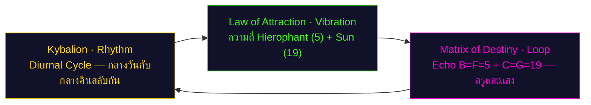
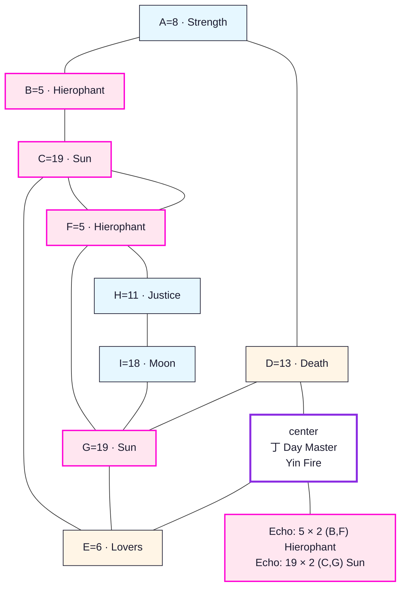

# พยากรณ์ Matrix of Destiny แบบองค์รวม — พี่ก้อย

> *"คุณไม่ได้เกิดมาเพื่อเดินตามใคร คุณเกิดมาเพื่อนำทาง — และนำทางด้วยหัวใจที่อบอุ่น"*
> — นาตาเลีย ลาดินี (Natalia Ladini)

---

## ข้อมูลพื้นฐาน

- **ชื่อ:** พี่ก้อย (หญิง)
- **วันเกิด:** 26 พฤษภาคม พ.ศ. 2515 (26.05.1972)
- **อายุ ณ ปี 2026:** 54 ปี
- **บุคลิกภาพ (MBTI):** ENFJ — The Protagonist (ผู้นำทางด้วยหัวใจ)

**ตัวเลข Matrix 9 จุด:**
- A=8 (Strength พลัง)
- B=5 (Hierophant ครู) 
- C=19 (Sun ดวงอาทิตย์)
- D=13 (Death การเปลี่ยนแปลง)
- E=6 (Lovers คู่รัก)
- F=5 (Hierophant ครู)
- G=19 (Sun ดวงอาทิตย์)
- H=11 (Justice ความยุติธรรม)
- I=18 (Moon ดวงจันทร์)

**จุดเด่น:** **Echo คู่** — B=F=5 (Hierophant × 2) และ C=G=19 (Sun × 2)

---

## 🌟 ส่วนที่ 1 · บทสรุป 6 มุมมองเชิงลึกที่อ่านชะตาของคุณ

พยากรณ์ฉบับนี้แตกต่างจากพยากรณ์ทั่วไป เพราะเราไม่ได้อ่านชีวิตคุณจากมุมเดียว แต่อ่านผ่าน **6 มุมมองเชิงลึก** ที่มาจากภูมิปัญญาต่างยุคสมัย แต่ละมุมมองจะตอบคำถามที่ต่างกัน:

### Lens 1 — มุมมองจิตวิทยาเชิงลึก (Carl Jung)

**คาร์ล ยุง** (Carl Jung) เป็นจิตแพทย์ชาวสวิสที่สอนว่าจิตใจคนเรามีสองชั้น — ชั้นบนที่เห็น (Conscious) กับชั้นลึกที่ซ่อน (Unconscious)

**Shadow (เงา):** Death (D=13) คือความกลัวที่จะปล่อยวางตัวตนเก่า ความกลัวที่จะเปลี่ยนแปลง เงานี้แสดงออกมาเมื่อคุณรู้สึกไม่ปลอดภัย

**Persona (หน้ากาก):** Moon (I=18) คือภาพลักษณ์ที่คุณแสดงต่อโลกภายนอก คนรอบข้างมองคุณเป็น "คนลึกลับ สงบ และเข้าใจคนอื่น"

**Individuation (การเป็นตัวของตัวเอง):** การรวม Hierophant (ครู) กับ Sun (แสง) เข้าด้วยกัน คุณจะรู้สึกว่าการสอนไม่เหนื่อย เพราะคุณกำลังเป็นตัวเอง

### Lens 2 — มุมมองกฎแห่งการดึงดูด (Helena Blavatsky)

**เฮเลนา บลาวัตสกี้** (Helena Blavatsky) สอนว่า **ทุกสิ่งคือพลังงาน สิ่งที่คุณสั่น คุณดึงดูด** ใน *The Secret Doctrine* เธออธิบายว่า *"as above, so below"* — ภายในสะท้อนภายนอก ภายนอกสะท้อนภายใน

**Vibration (ความถี่ที่คุณส่งออก):** ความถี่หลักของคุณคือ **8-5-19**

- **8** = ภูเขา (the mountain) — โครงสร้าง อำนาจ ความยุติธรรม ทุก ๆ 8 ปี ธีมเดิมจะกลับมาให้คุณ "ปิดรอบ"
- **5** = ตัวเร่ง (the catalyst) — ความสามารถในการ "ปรับความถี่" ให้ตรงกับคนที่กำลังฟัง Fe ของคุณทำให้คุณอ่านห้องได้
- **19** = ดวงอาทิตย์ (the sun) — ความสำเร็จที่ส่องสว่าง พลังงานที่ส่องไปถึงคนรอบข้าง

**Law of Attraction เชิงลึก:**

- **Hierophant (5) × 2:** คุณดึงดูด "ผู้เรียน" ที่พร้อมรับการเชื่อมโยง คนที่กำลัง "แบกรับอะไรไว้เงียบ ๆ" จะเปิดใจกับคุณก่อนใคร นี่คือเหตุที่คุณถูกเลือกเป็นรองผู้อำนวยการ — ไม่ใช่เพราะ "เก่ง" ที่สุด แต่เพราะ "รับ" คนได้ดีที่สุด
- **Sun (19) × 2:** คุณดึงดูดคนที่มีพลังงานส่องสว่างด้วยกัน และดึงดูด "จังหวะเวลา" ที่ตรงกับ "คำถามที่คุณกำลังค้นหา" พอดี (*the law of timing*)
- **Echo 5-6-13 (ปรับ-เลือก-ปล่อย):** นี่คือ Manifestation Loop ของคุณ คุณจะ "ปรับ" ได้ (5) แล้ว "เลือก" ด้วยหัวใจ (6) และเมื่ออายุ 54-60 คุณต้องเรียนรู้ "ปล่อย" บทบาทเก่า (13) เพื่อให้สิ่งใหม่เข้ามา

**Hermetic Correspondence ในชีวิตคุณ:**

เมื่อภายในคุณเป็นผู้รับ (Fe) ภายนอกจะส่ง "คนที่ต้องการการรับ" มา ลูกน้องที่หมดไฟ ผู้บริหารที่กำลังจะลาออก คนที่ "ยิ้มให้ทุกคนยกเว้นตัวเอง" — พวกเขาจะหาคุณ นี่คือ "เสาอากาศ" ที่รับความรู้สึกของห้อง แต่ราคาของมันคือ — **คุณไม่ได้แค่ "ฟัง" ห้อง คุณ "แบก" ห้อง**

### Lens 3 — มุมมองกฎธรรมชาติ (The Kybalion)

**The Kybalion** เป็นหนังสือลึกลับที่สรุปภูมิปัญญาเฮอร์เมติกเป็น **7 หลักการธรรมชาติ**

**Polarity (ขั้วตรงข้าม):** คุณยืนอยู่ระหว่างสองขั้ว — Servant-Leader (ผู้รับใช้) กับ Authority-Executive (ผู้บังคับบัญชา) คุณต้องเรียนรู้เลื่อนไปมาระหว่างสองขั้วอย่างคล่องแคล่ว

**Rhythm (จังหวะ):** Echo B=F=5 และ C=G=19 ทำให้ชีวิตคุณมีวงจรครบรอบที่หมุนซ้ำ ในช่วงอายุ 54-65 คุณจะผ่านไฮและโลว์อย่างน้อย 3 รอบ

### Lens 4 — มุมมองบุคลิกภาพ (MBTI)

**ไอซาเบล บริกส์ ไมเออร์ส** (Isabel Briggs Myers) สร้างแบบทดสอบ MBTI คุณคือ **ENFJ — The Protagonist**

**Fe (Extraverted Feeling):** คุณรับรู้ความรู้สึกของคนรอบข้างได้ทันที และต้องการให้ทุกคนมีความสุข คุณตัดสินใจด้วยหัวใจ

**Ni (Introverted Intuition):** คุณมองเห็นภาพรวมระยะยาว คุณเห็นทิศทางที่ควรจะเป็นแล้วนำคนอื่นไปที่นั่น

**Ti-Grip (จุดอ่อน):** เมื่อ Fe ทำงานหนักเกินไปโดยไม่พัก Ti จะระเบิดออกมา คุณจะกลายเป็นคนเย็นชา วิพากษ์วิจารณ์ตัวเอง

### Lens 5 — มุมมองจุดบรรจบแห่งวัย (Age 60 Forecast)

ช่วงอายุ 54-65 ของคุณ (2026-2037) เป็นช่วง **"วุฒิภาวะที่เต็มเปี่ยม"** อายุ 60 บริบูรณ์คือจุดบรรจบที่ Hierophant ของเดือนเกิด (B=5) กับ Hierophant ของวุฒิภาวะ (F=5) บรรจบกัน

### Lens 6 — มุมมองดวงจีน (BaZi & Period 9)

ตามระบบ BaZi พี่ก้อยเป็น Day Master 丁 (Yin Fire / เทียน) ที่อยู่ใน Period 9 (Fire, 2024–2044) — เทียนที่ลุกในยุค Fire คุณได้รับพลังงานอย่างเต็มที่

---

## 🌍 ส่วนที่ 2 · จุดเชื่อมโยงแห่งปรัชญาและวัฏจักร (The Cosmic Synergy)

ทั้ง 6 มุมมองชี้ไปที่ข้อความเดียวกัน: **คุณเกิดมาเพื่อส่องสว่างและนำทาง**

### Engine A — Kybalion Rhythm

Rhythm ของคุณคือ Diurnal Cycle — กลางวันกับกลางคืนสลับกัน คุณจุดเทียนในตอนเย็น ส่องสว่างในตอนกลางคืน และมอดลงเมื่อเช้ามาเพื่อติดใหม่ในตอนเย็นถัดไป

### Engine B — Law of Attraction Vibration

ความถี่หลักของคุณคือ Hierophant (5) และ Sun (19) ENFJ ของคุณมี Fe เป็น dominant คุณไม่ได้แค่รู้สึกต่อคนอื่น แต่ส่งต่อความรู้สึกนั้นกลับไปเป็นบทเรียน

### Engine C — Matrix of Destiny Loop

Echo B=F=5 (Hierophant ปรากฏสองครั้ง) และ C=G=19 (Sun ปรากฏสองครั้ง) คือวงจรที่ชัดเจนที่สุดในชีวิตคุณ การสอนคือภารกิจชีวิตของคุณ ไม่ใช่แค่อาชีพ

### Proof Line — การพิสูจน์

สามเครื่องยนต์ชี้ไปทางเดียวกัน: **คุณเกิดมาเพื่อส่องสว่างและนำทาง** ผ่านการสอนที่มาจากหัวใจ ไม่ใช่จากหนังสือ

---

## 🧬 ส่วนที่ 3 · โปรแกรมชีวิตและแกนหลัก (Natalia Square 3×3)

Matrix of Destiny ของนาตาเลีย ลาดินี เปรียบชีวิตคนเราเหมือน **แผนที่ 9 จุด** ตัวเลขเหล่านี้ไม่ได้กำหนดชะตา แต่บอกว่าคุณมีเครื่องมืออะไรในมือ

### 2.1 แกนบน (ความคิด / เริ่มต้น)

**A=8 (Strength พลัง):** Strength ของคุณไม่ใช่พลังที่ตะโกน แต่เป็นพลังที่อ่อนโยน คุณมีความเข้มแข็งที่ห่อหุ้มด้วยความอ่อนโยน

**B=5 (Hierophant ครู):** คุณเกิดมาเป็นครู ครูที่ไม่ได้สอนจากหนังสือ แต่สอนจากชีวิต

**C=19 (Sun ดวงอาทิตย์):** คุณเกิดมาพร้อมแสง แสงของคุณไม่ได้ส่องเพื่อตัวเองเท่านั้น แต่เพื่อให้คนรอบข้างได้รับความอบอุ่น

### 2.2 แกนกลาง (การงาน / วิถีชีวิต)

**D=13 (Death การเปลี่ยนแปลง):** Death ไม่ใช่การจบ แต่เป็นการเปลี่ยนรูป การปล่อยวางไม่ใช่การแพ้ แต่เป็นการเลือก

**E=6 (Lovers คู่รัก):** Lovers พูดถึงการเลือก ทุกการเลือกคือการเลือกรัก คุณเลือกด้วยหัวใจ ไม่ใช่ด้วยตรรกะเพียงอย่างเดียว

**F=5 (Hierophant ครู):** คุณจะตายในฐานะครู นี่คือจุดวุฒิภาวะของคุณ

### 2.3 แกนล่าง (ฐานราก / บุคลิก)

**G=19 (Sun ดวงอาทิตย์):** แสงคือพื้นฐานของคุณ รากฐานของคุณคือการส่องสว่าง

**H=11 (Justice ความยุติธรรม):** Justice คือเข็มทิศที่ช่วยให้คุณไม่หลงทาง คุณรู้ว่าอะไรถูกอะไรผิด

**I=18 (Moon ดวงจันทร์):** Moon คือสัญชาตญาณ ความลึกลับ คุณเข้าใจสิ่งที่ไม่ได้พูดออกมา

### 2.4 Echo Numbers — เสียงสะท้อนสองชุด

Matrix ของคุณมี **"เสียงสะท้อน" (Echo)** สองชุดที่ชัดเจนมาก:

**Echo ที่ 1: Hierophant (5) ปรากฏสองครั้ง**
- B=5 (เดือนเกิด) — คุณเกิดมาเป็นครู
- F=5 (วุฒิภาวะ) — คุณจะตายในฐานะครู

**Echo ที่ 2: Sun (19) ปรากฏสองครั้ง**
- C=19 (ปีเกิด) — คุณเกิดมาพร้อมแสง
- G=19 (รากฐาน) — แสงคือพื้นฐานของคุณ

---

## 💎 ส่วนที่ 4 · พรสวรรค์ ศักยภาพ และอดีตชาติ

### 3.1 พรสวรรค์หลักและศักยภาพแฝง

**Primary Gift — การสอนที่มาจากหัวใจ:** Hierophant × 2 คือพรสวรรค์หลักของคุณ คุณเป็นครูไม่ใช่เพราะรู้ทุกอย่าง แต่เพราะคุณเข้าใจว่าการเรียนรู้คืออะไร และอยากให้คนอื่นเข้าใจด้วย

**Latent Gift — การส่องสว่างโดยไม่ต้องพูด:** Sun × 2 คือพรสวรรค์แฝงที่ลึกกว่า คนรอบข้างรู้สึกได้ว่าอยู่กับคุณแล้วปลอดภัย แม้คุณไม่ได้พูดอะไร

### 3.2 ชีวิตในอดีตและหางกรรม (Karmic Tail)

**Recurring Pattern — ความกลัวที่จะปล่อยวาง:** Death (D=13) คือหางกรรมที่คุณต้องเรียนรู้ตลอดชีวิต ความกลัวที่จะเปลี่ยนแปลง ความกลัวที่จะปล่อยวางตัวตนเก่า

**Lesson to Unlock — การเลือกด้วยหัวใจ:** Lovers (E=6) คือบทเรียนที่จะปลดล็อกหางกรรม เมื่อคุณเรียนรู้ว่าการปล่อยวางคือการเลือก ไม่ใช่การแพ้ Death จะเปลี่ยนจากศัตรูเป็นครู

---

## 💼 ส่วนที่ 5 · การเงิน ความสำเร็จ และบทบาทเชิงลึก

### 4.1 อาชีพและการเงิน

**Best-fit Industry — การศึกษา การพัฒนาคน การให้คำปรึกษา:** Hierophant × 2 บอกว่าคุณเหมาะกับอาชีพที่ "สอน" "พัฒนา" และ "เชื่อมโยง" มากกว่าอาชีพที่ "ผลิต" หรือ "ขาย"

**Income Pattern — มั่นคงแต่ไม่ระเบิด:** Sun × 2 บอกว่ารายได้ของคุณจะมั่นคงและสม่ำเสมอ แต่ไม่ได้ระเบิดขึ้นแบบก้าวกระโดด

**Peak Window — อายุ 57-58 (2029-2030):** นี่คือช่วงที่คุณจะส่องสว่างที่สุด Peak authority year ที่คุณจะสร้าง legacy

### 4.2 บทบาทเชิงลึกในที่ทำงาน

**Boss (ผู้นำ):** คุณเป็น Servant-Leader ที่ดูแลคนรอบข้างอย่างเป็นธรรมชาติ คุณถามว่า "เป็นอย่างไรบ้าง" ก่อนถามว่า "งานเป็นอย่างไรบ้าง"

**Subordinate (ผู้ตาม):** คุณเป็นผู้ตามที่ "ฟัง" และ "เข้าใจ" แต่ไม่ได้ "ทำตาม" โดยไม่คิด คุณจะเป็นคนที่ช่วยผู้นำเห็นมุมที่พลาด

**Active Hand (มือขวา — รุก):** Ni ของคุณทำให้คุณ "เห็น" ทิศทางและ "ผลัก" ไปข้างหน้า

**Receptive Hand (มือซ้าย — รับ):** Fe ของคุณทำให้คุณ "รับ" อารมณ์คนรอบข้างและ "ตอบสนอง"

### 4.3 Scenario Simulation — การประชุมบอร์ดที่คุณ "อ่านห้อง" ได้

> **สถานการณ์:** เช้าวันจันทร์ สัปดาห์ที่สามของเดือนกันยายน 2026 · ห้องประชุมบอร์ดชั้น 7
> 
> คุณเดินเข้าห้องประชุมบอร์ดก่อนผู้อำนวยการ 10 นาที — ไม่ใช่เพราะคุณต้อง "เตรียมตัว" แต่เพราะ **Fe ของคุณต้องการอ่าน "อารมณ์" ของห้องก่อน** คุณเดินไปที่หน้าต่าง มองออกไปนอกอาคาร แล้ว "ปรับ" ความถี่ของตัวเอง คุณรู้สึกได้ว่าเช้านี้ห้อง "หนัก"
> 
> เมื่อผู้อำนวยการเดินเข้ามา คุณทักทายด้วยรอยยิ้ม แต่คุณ **รู้** ว่าวันนี้ผู้อำนวยการมีเรื่อง "ค้าง" ในใจ คุณจะเปิดประชุมด้วยการไม่เปิดเรื่องที่ "หนัก" ทันที แต่เริ่มจากเรื่อง "เบา" ก่อน เพื่อ **"ปรับอารมณ์ของห้อง"** — นี่คือทักษะ **Fe ของ ENFJ ที่อายุ 54** ทำได้ดีที่สุด
> 
> เมื่อเรื่อง "หนัก" เข้ามา (เช่น งบประมาณปีหน้าที่ต้องลด หรือการปรับโครงสร้างที่กระทบคน) คุณจะ **ไม่พูดทันที** คุณจะ **ฟังทุกคนในห้องให้จบก่อน** แล้วค่อยพูดประโยคที่ "สรุป" ความเห็นของทุกคน — ไม่ใช่เพราะคุณ "เก่ง" แต่เพราะ:
> - **Fe** ของคุณ "รับ" ความเห็นของทุกคนไว้ในตัวเอง
> - **Ti** ของคุณ "จัดโครงสร้าง" ให้เป็นคำตอบที่ทุกคนรู้สึกว่า "ของตัวเองด้วย"
> 
> ผู้อำนวยการจะรู้สึกว่า "พี่ก้อยช่วยให้การประชุมลื่นไหล" — แต่สิ่งที่เกิดขึ้นจริงคือ **คุณสั่นที่ความถี่ที่ทำให้ทุกคนสั่นที่ความถี่เดียวกัน** (Hermetic Correspondence)
> 
> **แต่หลังประชุมเลิก...** คุณจะเดินกลับห้องทำงาน เปิดสมุดจด เขียนข้อสรุป — แต่ที่คุณจะ **ไม่เขียน** คือ "ความรู้สึก" ของคุณ ซึ่งมันหนักมาก เพราะคุณต้อง **"แบก" อารมณ์ของทั้งห้องไว้คนเดียว**
> 
> นี่คือราคาของ Fe ที่อ่านห้องได้ดี — **คุณไม่ได้แค่ "ฟัง" ห้อง คุณ "แบก" ห้อง**

### 4.4 Scenario Simulation — ทีมงานที่คุณ "รัก" กำลังจะลาออก

> **สถานการณ์:** เดือนมีนาคม 2028 · วันจันทร์เช้า · แปดโมงเช้าก่อนเปิดออฟฟิศ

> 

> น้องใหม่คนหนึ่งที่คุณเอาใจใส่มาตลอดสามปี ส่งข้อความมาหาคุณตอนตีห้า — "พี่ก้อยคะ หนูขอคุยเรื่องส่วนตัวได้ไหม" — คุณเปิดอ่านแล้วหัวใจเต้นแรง ก่อนจะตอบกลับ คุณเปิดสมุดจดส่วนตัว เขียนถามตัวเองว่า:

> 

> *"Fe ของฉันกำลังจะทำอะไร — รับ หรือ ตัดสิน?"*

> 

> สี่โมงเย็นวันเดียวกัน น้องคนนั้นนั่งตรงข้ามคุณในร้านกาแฟ น้ำตาคลอ บอกว่า "หนูได้ข้อเสนอจากบริษัทอื่น หนูคิดว่าจะลาออก" — ในหัวคุณมี **สามเสียง** ดังพร้อมกัน:

> 

> - **Fe** พูดว่า *"ลูก อย่าเพิ่ง พี่รักลูก อยู่ด้วยกันเถอะ"* — และน้ำตาของคุณก็เริ่มคลอเหมือนกัน
> - **Ni** พูดว่า *"น้องเติบโตพอที่จะไป นี่คือสิ่งที่ครูต้องการให้เกิด"* — เสียงนี้เงียบแต่หนักแน่น
> - **Ti-Grip** กระซิบว่า *"คุณไม่ดีพอที่จะทำให้เขาอยู่ คุณสอนไม่ดีพอ"* — และคุณรู้สึกเย็นชาลงทันที

> 

> สิ่งที่คุณ **ทำจริงๆ** (ไม่ใช่สิ่งที่ Fe อยากทำ):

> 

> 1. หายใจเข้าลึก ปล่อยให้ Fe ไหลออก (น้ำตาไหล ก็ปล่อยให้ไหล)
> 2. ถามน้องว่า *"อะไรทำให้หนูรู้สึกว่าที่นี่ไม่ใช่บ้านของหนูแล้ว"* — ฟังด้วย Ni ไม่ใช่ด้วย Ti
> 3. พอน้องเล่าจบ คุณพูดว่า *"พี่เข้าใจ พี่ไม่อยากให้หนูอยู่เพราะรู้สึกว่าเป็นหนี้พี่ หนูไม่ได้เป็นหนี้พี่ หนูเติบโตจากที่นี่ พี่ภูมิใจในตัวหนู"*
> 4. ส่งข้อความหาน้องตอนกลางคืน: *"ถ้าวันหนึ่งอยากกลับมา บ้านนี้เปิด"*

> 

> ผลคือ — น้องคนนั้นไม่ได้ลาออกทันที ยังอยู่อีกหนึ่งปีเต็ม และเมื่อจะไปจริงๆ ก็ไปด้วยรอยยิ้ม และส่งข้อความมาทุกวันเกิดของคุณ — **เพราะคุณไม่ได้สอนให้เขา "อยู่" คุณสอนให้เขา "รู้ว่าตัวเองคือใคร"**

> 

> **Lesson:** Hierophant ที่แท้จริงไม่ได้สอนให้ลูกศิษย์อยู่กับเรา สอนให้ลูกศิษย์รู้ว่าเขาคือใคร เมื่อไหร่ที่คุณรู้สึกว่า "ต้องทำให้เขาอยู่" นั่นคือ **Fe overextension** — คุณกำลังรักผิดที่ (รักเพื่อตัวเอง ไม่ใช่เพื่อเขา)

### 4.5 Scenario Simulation — การตัดสินใจครั้งสำคัญที่ "หัว" กับ "ใจ" ขัดแย้ง

> **สถานการณ์:** ตุลาคม 2027 · เช้าวันพฤหัสบดี · คุณได้รับ proposal ใหญ่สองทางเลือกพร้อมกัน

> 

> **ทางเลือก A:** รับตำแหน่ง CEO ของบริษัทในเครือ — เงินเดือนสามเท่า อำนาจเต็มที่ แต่ต้องย้ายไปทำงานที่สิงคโปร์ ไม่ได้เจอครอบครัว 4 ปี
> 

> **ทางเลือก B:** เปิดสถาบันการสอนของตัวเอง — รายได้ลดลง 60% ในช่วงสองปีแรก แต่ได้สอนด้วยหัวใจ ได้อยู่ใกล้ครอบครัว ได้สร้าง legacy ที่ยั่งยืน

> 

> ในคืนวันพฤหัสบดี คุณนั่งคนเดียวที่โต๊ะอาหาร มือหนึ่งถือ proposal A อีกมือถือ proposal B — **Fe** บอก *"ครอบครัวต้องการคุณ"* **Ti** บอก *"ลงทุนระยะยาวนะ คิดด้วยเหตุด้วยผล"* **Ni** เห็นภาพตัวเองใน 10 ปีข้างหน้า ยืนอยู่ห้องเรียน รอบตัวมีศิษย์ 30 คนกำลัง "เห็นแสง" ในตัวเอง — **Ni เห็น pathway B ชัดกว่า**

> 

> สิ่งที่คุณ **ทำจริงๆ**:

> 

> 1. จดบันทึก: *"ฉันกลัวอะไร — กลัวเงินน้อยลง หรือกลัวไม่ได้รับการยอมรับ?"*
> 2. โทรหาเพื่อนสนิทที่เป็น Type 5 (ไม่ใช่คนที่จะบอกว่า "สู้ๆ") ถามว่า *"ถ้าเธอเป็นฉัน เธอเลือกอะไร ทำไม"*
> 3. นั่งเงียบกับ Hierophant (B=5) ครึ่งชั่วโมง — ถามว่า *"งานที่ฉันจะตายไปทำที่ไหน ที่นั่นหรือที่นี่?"*
> 4. เลือก B — เปิดสถาบัน

> 

> ครอบครัวไม่ได้โกรธ สามีคุณพูดว่า *"ผมรู้ว่าคุณจะเลือกแบบนี้ ผมเตรียมใจไว้แล้ว"* — เพราะ Lovers (E=6) ของคุณ "เลือกด้วยใจ" คนรอบข้างที่รักคุณจริง **รู้** ว่าคุณเลือกอะไร แม้คุณยังไม่ได้บอก

> 

> **Lesson:** เมื่อหัวกับใจขัดแย้ง — **อย่าเลือก "หัว" ทันที และอย่าเลือก "ใจ" ทันที** นั่งเงียบถาม Hierophant แล้วคำตอบจะมาเอง — Hermetic Rhythm ไม่เคยผิดเวลา

---

## ❤️ ส่วนที่ 6 · สายสัมพันธ์ ความรัก และครอบครัว

### 5.1 ความรักและวงใน

**Relationship Pattern — เลือกด้วยหัวใจ:** Lovers (E=6) บอกว่าคุณเลือกคนรักด้วยหัวใจ ไม่ใช่ด้วยตรรกะ คุณจะรักคนที่ "เข้าใจ" คุณ ไม่ใช่คนที่ "เหมาะ" กับคุณ

**Inner-Circle Pull — คนที่สั่นตรงกัน:** Sun × 2 และ Hierophant × 2 ดึงดูดคนที่มีพลังงานส่องสว่างและพร้อมเรียนรู้ วงในของคุณจะเต็มไปด้วยครูและนักเรียน

**Emotional Blind Spot — ซึมซับอารมณ์คนอื่น:** Moon (I=18) และ Fe ทำให้คุณซึมซับอารมณ์คนรอบข้างจนลืมแยกว่าอะไรเป็นของตัวเอง

### 5.2 มรดกสายตระกูล (Generation Lines)

**Paternal Line — ความแข็งแกร่งที่อ่อนโยน:** Strength (A=8) คือมรดกจากสายพ่อ พลังที่ห่อหุ้มด้วยความอ่อนโยน

**Maternal Line — ความยุติธรรมและความสมดุล:** Justice (H=11) คือมรดกจากสายแม่ การรู้ว่าอะไรถูกอะไรผิด

### 5.3 Scenario Simulation — ลูกสาวถาม "แม่เคยเสียใจไหม"

> **สถานการณ์:** คืนวันเสาร์ มีนาคม 2030 · อายุ 58 · ลูกสาววัย 25 ปีกลับบ้านมาเยี่ยม

> 

> หลังอาหารเย็น ลูกสาวนั่งคุยกับคุณในห้องนั่งเล่น เธอถามคำถามที่คุณไม่เคยคาดคิดว่าจะได้ยิน —

> 

> *"แม่คะ ถ้าย้อนกลับไปได้ แม่เสียใจกับอะไรไหมคะ ที่แม่เลือกไม่ทำ"*

> 

> ห้องเงียบ ลูกสาวของคุณกำลัง "อ่าน" คุณแบบที่คุณเคย "อ่าน" คนอื่น — Hierophant ของเธอกำลังทำงาน

> 

> สิ่งที่คุณ **ไม่ตอบ**: *"ไม่เสียใจอะไรเลยลูก แม่เลือกทุกอย่างด้วยดีหมด"* — นี่คือ Persona (Moon) ที่สวมหน้ากาก

> 

> สิ่งที่คุณ **เลือกตอบจริงๆ**:

> 

> *"ลูก แม่เสียใจที่แม่ใช้เวลา 10 ปีแรกของอาชีพพยายาม 'เป็นให้ทุกคน' มากกว่า 'เป็นตัวเอง' — แม่เสียเวลาไป 10 ปี กับการพยายามวางหน้ากากให้ทุกคนชอบ ถ้าย้อนกลับไปได้ แม่จะถอดหน้ากากตั้งแต่อายุ 45"*

> 

> *"และแม่เสียใจที่แม่ไม่ได้ 'สอน' ลูกเรื่องนี้ — แม่สอนลูกเรื่องอื่นหมด แต่เรื่อง 'อย่ากลัวถอดหน้ากาก' แม่ลืมสอนลูก เพราะตัวแม่เองยังกลัวอยู่"*

> 

> ลูกสาวของคุณน้ำตาไหล ไม่ใช่เพราะเสียใจ แต่เพราะเธอ **เข้าใจแม่** — Justice (H=11) ของเธอรู้ว่าความจริงของแม่ **มีค่ามากกว่า** หน้ากากที่สวย

> 

> คืนนั้น คุณนอนหลับสนิทที่สุดในรอบหลายปี — เพราะ Death (D=13) ของ "หน้ากากเก่า" ตายไปแล้ว คุณกลับมาเป็น **Hierophant ของลูก** ได้สำเร็จ

> 

> **Lesson:** Echo B=F=5 ไม่ใช่แค่เรื่องของครูกับศิษย์ แต่เรื่องของ **แม่กับลูก** — เมื่อไหร่ที่คุณกล้า "พูดความจริง" กับลูก ลูกจะเรียนรู้ว่า "ความจริงคือสิ่งที่ปลอดภัยที่สุดในบ้าน"

---

## 🧘 ส่วนที่ 7 · สุขภาพและจุดอ่อน (Health Card & Chakras)

### สุขภาพโดยรวม

ENFJ ที่มี Fe เป็นฟังก์ชันหลักมักมีปัญหาเรื่อง **การซึมซับอารมณ์คนรอบข้าง** จนทำให้ร่างกายเครียดโดยไม่รู้ตัว

### Chakra ที่ต้องดูแล

**Heart Chakra (Anahata) — จักระหัวใจ:** Lovers (E=6) บอกว่าคุณต้องดูแลจักระหัวใจ คุณให้รักมากเกินไปจนลืมรักตัวเอง

**Throat Chakra (Vishuddha) — จักระลำคอ:** Hierophant × 2 บอกว่าคุณพูดมาก สอนมาก แต่ต้องระวังไม่ให้เหนื่อย

**Third Eye Chakra (Ajna) — จักระตาที่สาม:** Ni ของคุณทำให้คุณเห็นภาพอนาคตชัดเจน แต่ต้องระวังไม่ให้คิดมากเกินไป

### ข้อควรระวังและวิธีปรับสมดุล

**Watch — Fe Overextension:** เมื่อรู้สึกว่า "ฉันเหนื่อย แต่ไม่รู้ว่าเหนื่อยทำไม" นั่นคือสัญญาณว่าคุณดูดซับอารมณ์คนรอบข้างมากเกินไป

**Balance Ritual — กลับมาหาตัวเอง:** ทุกวัน ให้เวลาตัวเอง 15-30 นาที เพื่อ "ถามตัวเอง" ว่า "ตอนนี้ ฉันรู้สึกอะไรจริง ๆ ไม่ใช่รู้สึกตามคนรอบข้าง"

---

## 📈 ส่วนที่ 8 · ไทม์ไลน์ 5 ช่วงวัย และพยากรณ์อาชีพรายปี

### 7.1 5 Stages of Evolution (ก่อนจุดบรรจบอายุ 60)

Matrix of Destiny มองชีวิตคนเราเป็นวงจรที่หมุนซ้ำทุก 7-12 ปี ช่วงอายุ 54-65 ของคุณ (2026-2037) เป็นช่วง **"วุฒิภาวะที่เต็มเปี่ยม"**

**Stage 1 — ปฐมบทและการสร้างเข็มทิศ (0-25 ปี):** ช่วงที่คุณเรียนรู้ว่าตัวเองคือใคร Hierophant เริ่มตื่น

**Stage 2 — การสำรวจและขยายอาณาเขต (26-35 ปี):** ช่วงที่คุณทดลองบทบาทต่าง ๆ Sun เริ่มส่องสว่าง

**Stage 3 — การปะทะและจุดวิกฤต (36-45 ปี):** ช่วงที่ Death ทำงานหนักที่สุด คุณต้องปล่อยวางสิ่งที่ไม่ใช่ตัวเอง

**Stage 4 — การบูรณาการและปรับขั้วพลังงาน (46-53 ปี):** ช่วงที่คุณเริ่มเข้าใจว่า Servant-Leader กับ Authority-Executive ไม่ได้ตรงข้ามกัน

**Stage 5 — การตกผลึกและส่งมอบ (54-59 ปี):** ช่วงที่คุณกำลังอยู่ ช่วงที่ Hierophant ของ B และ F บรรจบกัน

### 7.2 Year-by-Year Career Forecast (2026-2032 สู่อายุ 60)

**ตารางพยากรณ์รายปี 7 ปี — อายุ 54 ถึง 60 บริบูรณ์**

| ปี | อายุ | พลังงานนำ | สถานการณ์อาชีพและชีวิต | กลยุทธ์ |
|---|---|---|---|---|
| **2026** | 54 | 庚子 Pillar Year 8 | **Sun ส่องเต็มที่** — ช่วง "ไฮ" ของวงจร คุณจะรู้สึกมีพลังและอยากสอนมากที่สุด คนใหม่ ๆ จะเข้ามาเรียนกับคุณ Period 9 เริ่มเข้ามาแรง | Fe: รับศิษย์ใหม่ · Ni: วาง vision 3-5 ปี · ระวัง Fe overextension |
| **2027** | 55 | 庚子 Pillar Year 9 | **Authority peak** — ตำแหน่งและอำนาจสูงสุดในองค์กร คุณจะได้รับการยอมรับในฐานะผู้นำที่แท้จริง แต่ความกดดันก็เพิ่มขึ้น | Fe: ดูแลทีม · Ti: สร้างระบบ · หา 15 นาที silent reflection ทุกวัน |
| **2028** | 56 | 庚子 Pillar Year 10 | **Pre-transition** — ปีสุดท้ายของ 庚子 decade การเปลี่ยนแปลงใหญ่กำลังจะมา อย่าต่อสู้ ให้เตรียมตัว | Fe: เริ่มปล่อยมือ · Death (D=13) working · ฝึก "ปล่อย" ไม่ใช่ "แพ้" |
| **2029** | 57 | **己亥 Transition** | **Hierophant-Hermit shift** — เข้าสู่ Luck Pillar ใหม่ (己亥) ช่วง "โลว์" หรือ "ช่วงพัก" Moon (I=18) เรียกคุณกลับเข้าหาตัวเอง จุดเปลี่ยนสำคัญที่สุด | Te: ยอมรับการเปลี่ยนแปลง · Ni: ฟังเสียงภายใน · อาจเปลี่ยนบทบาท |
| **2030** | 58 | 己亥 Pillar Year 2 | **Wisdom integration** — เริ่มเข้าใจว่า "ส่งต่อ" สำคัญกว่า "ทำเอง" บทบาทเปลี่ยนจาก executor เป็น advisor | Fe: mentor มากกว่า manage · Lovers (E=6) เลือกใหม่ |
| **2031** | 59 | 己亥 Pillar Year 3 | **Late-career service** — บทบาททีป์รึกษา/โค้ช/ผู้นำที่มองเห็นศักยภาพของลูกทีม ความสุขมาจาก "คนอื่นเติบโต" ไม่ใช่ "ฉันทำสำเร็จ" | Fe: เห็นคนอื่นถูกเห็น · Hierophant (F=5) งานที่แท้จริง |
| **2032** | 60 | 己亥 Pillar Year 4 | **Convergence บริบูรณ์** — Hierophant ของ B (เดือนเกิด) และ F (วุฒิภาวะ) บรรจบกัน อายุ 60 บริบูรณ์ คุณรู้แล้วว่า "นี่คือตัวเอง" | Hierophant × 2 + Sun × 2 งานชีวิตสมบูรณ์ — สอนด้วยหัวใจ ส่องสว่างโดยไม่ต้องพูด |

**จุดเปลี่ยนที่สำคัญที่สุด:**

1. **อายุ 57 (2029)** — Luck Pillar transition จาก 庚子 → 己亥 การเปลี่ยนแปลงใหญ่ที่สุดในช่วง 10 ปี อย่าต่อสู้ ให้ปล่อยวาง (Death D=13 working)
2. **อายุ 58-60 (2030-2032)** — ช่วง "ตกผลึก" ของภารกิจชีวิต Hierophant ที่แท้จริงปรากฏ — คุณจะไม่สอน "วิธีทำ" แต่จะสอน "วิธีเป็น"
3. **อายุ 60 (2032) บริบูรณ์** — จุดที่ Ego (ตัวตน) และ Self (ตัวจริง) รวมเป็นหึ่ง บทบาทสูงสุดคือ "ครูผู้ส่องสว่าง" (Teacher-Light Bearer)

### 7.3 · Mermaid Octagram ที่อายุ 60 — จักรวาล 8 ทิศรอบตัวคุณ

```mermaid
graph TB
    subgraph CENTER["🌟 พี่ก้อยอายุ 60 · ครูผู้ส่องสว่าง (Teacher-Light Bearer)"]
        CORE["Convergence บริบูรณ์<br/>Hierophant × 2 + Sun × 2<br/>己亥 Pillar Year 4"]
    end

    subgraph N["↑ North — Career / Calling (อาชีพ)"]
        N1["Tier 1: โค้ชผู้บริหาร<br/>ที่ปรึกษาอาวุโส"]
        N2["Public Speaker / นักเขียน<br/>สอนด้วยหัวใจ"]
    end

    subgraph NE["↗ NE — Wisdom / Reputation (ปัญญา)"]
        NE1["Echo B=F=5 integrate:<br/>Hierophant × 2 ครบบริบูรณ์"]
        NE2["'ปราชญ์ผู้ส่องสว่าง'<br/>ที่รู้ว่าความรักคือคำตอบ"]
    end

    subgraph E["→ East — Family / Legacy (ครอบครัว)"]
        E1["Echo 12: Generation line<br/>สอนลูกหลานให้ 'เห็นแสงตัวเอง'"]
        E2["พี่ก้อย → ลูก → หลาน<br/>สายตระกูล Hierophant"]
    end

    subgraph SE["↘ SE — Health / Energy (สุขภาพ)"]
        SE1["Heart Chakra เปิดเต็มที่<br/>Throat Chakra สมดุล"]
        SE2["Period 9 alignment<br/>ยังคง flow กับจักรวาล"]
    end

    subgraph S["↓ South — Material / Security (การเงิน)"]
        S1["Echo 16 integrate:<br/>ยอมรับว่า 'พอ' คือความสมบูรณ์"]
        S2["อยู่ได้ด้วยคุณค่า<br/>ไม่ใช่ accumulation"]
    end

    subgraph SW["↙ SW — Inner Peace (ความสงบ)"]
        SW1["Individuation สมบูรณ์<br/>Shadow (Death) กลายเป็นครู"]
        SW2["Persona (Moon) หลอมรวมกับ Self<br/>'ฉันคือฉัน ไม่ต้องพิสูจน์'"]
    end

    subgraph W["← West — Social / Community (สังคม)"]
        W1["Mentor รุ่นใหม่ 5-10 คน<br/>ผ่าน Echo Hierophant × 2"]
        W2["Community Builder<br/>ในสายการสอน/พัฒนาคน"]
    end

    subgraph NW["↖ NW — Mission / Purpose (ภารกิจ)"]
        NW1["Mission: 'ส่องสว่างให้คนอื่น<br/>เห็นแสงในตัวเอง'"]
        NW2["Sun × 2 ทำงานเต็มที่<br/>Wounded Healer ครบวงจร"]
    end

    CORE --- N1
    CORE --- NE1
    CORE --- E1
    CORE --- SE1
    CORE --- S1
    CORE --- SW1
    CORE --- W1
    CORE --- NW1
    N1 --- N2
    NE1 --- NE2
    E1 --- E2
    SE1 --- SE2
    S1 --- S2
    SW1 --- SW2
    W1 --- W2
    NW1 --- NW2

    style CORE fill:#fef3c7,stroke:#f59e0b,color:#000,stroke-width:3px
    style N1 fill:#dbeafe,stroke:#1e40af,color:#000
    style NE1 fill:#e8d5ff,stroke:#6b46c1,color:#000
    style E1 fill:#fce7f3,stroke:#be185d,color:#000
    style SE1 fill:#d1fae5,stroke:#065f46,color:#000
    style S1 fill:#fed7aa,stroke:#c2410c,color:#000
    style SW1 fill:#e0e7ff,stroke:#4338ca,color:#000
    style W1 fill:#ccfbf1,stroke:#0f766e,color:#000
    style NW1 fill:#fef3c7,stroke:#92400e,color:#000
```

**คำอ่าน Octagram:** ที่อายุ 60 คุณคือ **Center** ที่ 8 มิติของจักรวาลหมุนรอบตัว — ทุกทิศคือพลังงานที่ส่งเสริม (ไม่มีทิศไหนขัดแย้ง) นี่คือ Hermetic Correspondence ในระดับสูงสุด — "As above, so below; as within, so without"

---

## 🛡 ส่วนที่ 9 · คำแนะนำและแนวทางปฏิบัติ (Actionable Protocols)

### รายวัน (Daily)

1. **เช้า — สำรวจความเงียบ 1 นาที:** ก่อนสอนใครวันนี้ ลองสำรวจความเงียบ 1 นาที ถามตัวเองว่า "ใจที่พูดอยู่ เป็นใจของเรา หรือใจของเขา"

2. **กลางวัน — Fe checkpoint 30 วินาที:** ก่อนกลับเข้าประชุมบ่าย ถามตัวเอง "ฉันหิวหรือยัง ฉันเหนื่อยหรือยัง" (ไม่ใช่ "คนอื่นต้องการอะไร")

3. **เย็น — ถามตัวเองสองคำถาม:** 
   - (1) วันนี้ฉันรู้สึกอะไรจริง ๆ ไม่ใช่รู้สึกตามคนรอบข้าง 
   - (2) วันนี้ฉันให้อะไรออกไปบ้าง ฉันรับอะไรกลับมาบ้าง

4. **ก่อนนอน — Gratitude micro-ritual:** เขียนประโยคเดียว "วันนี้ฉันภูมิใจในตัวเอง เพราะ..." (ไม่ใช่ "คนอื่นชม" แต่ต้องเป็น "ฉันรู้ว่าฉันทำดี")

### รายสัปดาห์ (Weekly)

1. **วันหนึ่งในสัปดาห์ — ถอดหน้ากาก:** บางครั้งคุณต้องถอดหน้ากากและเป็นตัวเอง โดยเฉพาะกับคนที่คุณรัก เลือกหนึ่งวันในสัปดาห์ที่คุณจะ "ไม่ดูแลใคร" แต่ "ให้คนอื่นดูแลคุณ"

2. **Body grounding 30 นาที × 3 ครั้ง/สัปดาห์:** เดินเร็ว ยืดหยุ่น หรือทำสวน — กิจกรรมที่ร่างกายทำงาน ไม่ใช่สมองอ่านคน (Fe ต้องพัก)

3. **สังเกตช่วงที่ "ทุกอย่างดูดีเกินไป":** นั่นคือจุดที่ Moon (I=18) กำลังทำงาน เป็นภาพลวงตา หยุดและถามตัวเองว่า "นี่คือความจริงหรือความหวัง"

4. **Boundaries check:** ทบทวนว่าสัปดาห์นี้คุณบอก "ไม่" กับใครบ้าง ถ้าคำตอบคือ "ไม่มี" แสดงว่า Fe กำลัง overextend

### รายเดือน (Monthly)

1. **ทบทวน Polarity:** เดือนนี้คุณ "ปล่อย" บ่อยแค่ไหน "เลือก" บ่อยแค่ไหน ถ้าฝั่งใดขาดเติมด้วยการกระทำเล็ก ๆ (Death D=13 ↔ Lovers E=6)

2. **วางแผน "โลว์":** เมื่อเข้าสู่ "ไฮ" อย่าลืมวางแผน "โลว์" ไว้ล่วงหน้า จังหวะของคุณหมุนตลอด (Kybalion Rhythm)

3. **Energy audit:** เขียนรายชื่อคน 5 คนที่คุยด้วยบ่อยที่สุดเดือนนี้ คนไหนทำให้คุณรู้สึก "เต็ม" คนไหนทำให้คุณรู้สึก "หมด" ปรับสัดส่วน

### กลยุทธ์รับมือวิกฤต (Crisis Mastery)

**วิกฤตที่ 1 — Ti-Grip (เมื่อรู้สึก "ฉันคิดมากเกินไป"):**
- อาการ: วิเคราะห์ทุกอย่างจนชา ไม่รู้สึกต่อใคร วิพากษ์วิจารณ์ตัวเอง
- สาเหตุ: Fe ทำงานหนักเกินไปโดยไม่พัก Ti ระเบิดออกมา
- แก้: หยุดพัก ออกไปเดิน นั่งเงียบ ปล่อยให้ Fe พักผ่อน ไม่ตัดสินใจใหญ่ใน 48 ชั่วโมงนี้

**วิกฤตที่ 2 — Fe Overextension (เมื่อรู้สึก "ฉันเหนื่อย แต่ไม่รู้ว่าเหนื่อยทำไม"):**
- อาการ: รู้สึกหมดไฟ แต่ตรวจร่างกายแล้วไม่ป่วย นอนเท่าไหร่ก็ไม่หาย
- สาเหตุ: ดูดซับอารมณ์คนรอบข้างมากเกินไป ลืมแยกว่าอะไรเป็นของตัวเอง
- แก้: กลับมาหาตัวเอง 15-30 นาที ถาม "ตอนนี้ ฉันรู้สึกอะไรจริง ๆ ไม่ใช่รู้สึกตามคนรอบข้าง"

**วิกฤตที่ 3 — Death Resistance (เมื่อรู้สึก "ฉันไม่อยากเปลี่ยน"):**
- อาการ: ยึดติดบทบาทเก่า กลัวว่าถ้าปล่อยวางแล้วจะ "ไม่เหลืออะไร"
- สาเหตุ: Death (D=13) กำลังเคาะประตู Shadow กลัวการเปลี่ยนแปลง
- แก้: กลับเข้าไปนั่งเงียบกับ Hierophant ที่ B=5 ถามว่า "ฉันกำลังสอนสิ่งที่ตัวเองเชื่อ หรือสิ่งที่คนอื่นอยากฟัง"

**วิกฤตที่ 4 — Moon Illusion (เมื่อรู้สึก "ทุกอย่างดูดีเกินไป"):**
- อาการ: รู้สึกว่าทุกอย่างลงตัว คนรอบข้างดีกับเราทุกคน โปรเจกต์ราบรื่น
- สาเหตุ: Moon (I=18) กำลังทำงาน เป็นภาพลวงตา Ni อาจกำลังหลอก
- แก้: หยุดและถามตัวเองว่า "นี่คือความจริงหรือความหวัง" เช็กข้อเท็จจริง 3 ข้อก่อนตัดสินใจใหญ่

**วิกฤตที่ 5 — Se-Loop / Se-Grip (เมื่อรู้สึก "ต้องทำตอนนี้ ไม่งั้นจะพลาด"):**
- อาการ: เห็น opportunity หรือ urgency แล้ว "ดีด" ทันทีโดยไม่ผ่าน Ni — ซื้อของแพงๆ กะทันหัน, ตกลงงานใหญ่โดยไม่ดูสัญญา, ตอบ chat หรือ email ด้วยอารมณ์, คลิก "ซื้อ" ก่อนนอน
- สาเหตุ: ENFJ ปกติใช้ Fe (รับคนอื่น) → Ni (มองอนาคต) แต่เมื่อ Fe เหนื่อยล้าและ Ni ถูก bypass, inferior Se กระโดดเข้ามาแทน — Se-Loop = "ตอบสนองปัจจุบันขณะแบบดิบ โดยไม่มีวิสัยทัศน์กรอง"
- แก้: ตั้ง **กฎ 24 ชั่วโมง** — "ถ้าจะตัดสินใจทุกอย่างที่เกิน 5,000 บาท หรือทุก commitment ที่ผูกมากกว่า 30 วัน ห้ามตอบวันนี้" — เขียนลงสมุด ตั้งนาฬิกา แล้วให้ Ni ตามมาทำงานช้าๆ คืนนี้

**วิกฤตที่ 6 — Hierophant Overgiving (เมื่อรู้สึก "ฉันต้องช่วย ฉันถอยไม่ได้"):**
- อาการ: รับงานสอน/ให้คำปรึกษา/ดูแลคนเพิ่มเรื่อยๆ จนตารางเต็ม ไม่กล้าปฏิเสธ
- สาเหตุ: Hierophant × 2 ของคุณสั่นที่ "ความถี่ของการให้" และ Fe ทำให้คุณรู้สึกผิดทุกครั้งที่ปฏิเสธ
- แก้: พูดประโยคศักดิ์สิทธิ์ที่ฝึกจนเข้าปาก — *"ขอบคุณที่ไว้ใจ แต่ตอนนี้พี่ขอรับไม่ได้ค่ะ/ครับ"* — Hierophant ที่แท้จริงรู้ว่า "ไม่" คือการเรียนรู้ที่ดีที่สุดที่ครูมอบให้ลูกศิษย์

---

## 🔮 ส่วนที่ 10 · บทสรุปแห่งสัจธรรม (The Ultimate Synthesis)

### ความเกี่ยวข้องกันของสรรพสิ่ง (Interconnectedness)

ทั้ง 6 มุมมองไม่ได้แยกกัน — Mentalism ที่ A=8 จุดประกายจิต → Correspondence ที่ B=F=5 ขยายลงสู่รูปธรรม → Vibration ที่ C=G=19 สั่นเป็นจังหวะ → Polarity ที่ D=13 ↔ E=6 แกว่งระหว่างปล่อยกับเลือก → Rhythm หมุนรอบทุก 7-9 ปี → Cause-Effect ที่ F=5 บันทึกผลของทุกการสอน → Gender ที่ A=8 + E=6 รวมพลังชาย-หญิง

เมื่อคุณเข้าใจวงจรทั้งเจ็ด คุณไม่ได้ "ทำนาย" อนาคต — **คุณอ่านมันได้**

### สัจธรรมประจำตัว (Your Ultimate Truth)

**คุณเกิดมาไม่ใช่เพื่อเดินตามใคร คุณเกิดมาเพื่อส่องสว่างและนำทาง**

- **นาตาเลีย ลาดินี** บอกว่า Echo B=F=5 และ C=G=19 คือลายเซ็นของจักรวาล
- **คาร์ล ยุง** บอกว่า Shadow (Death) ที่คุณกลัวคือบทเรียนที่จะทำให้คุณสมบูรณ์
- **เฮเลนา บลาวัตสกี้** บอกว่าความถี่ 5 และ 19 คือความถี่ของครูและแสง
- **เฮอร์เมติก** บอกว่า 7 หลักการทำงานเป็นวงจรเดียวในชีวิตคุณ
- **ไอซาเบล บริกส์ ไมเออร์ส** บอกว่า ENFJ คือผู้นำทางด้วยหัวใจ
- **การพยากรณ์ตามอายุ** บอกว่าช่วง 54-65 คือช่วงที่คุณจะรู้ว่า "นี่คือตัวเอง"

จงเดินทางต่อ พี่ก้อย

ครูผู้สอนที่แท้จริงไม่ได้ทำให้คนตาม — ครูผู้สอนที่แท้จริงทำให้คน **"เห็น" แสงในตัวเอง**

---

## ภาคผนวก · Reasoning Log (บันทึกการเขียน)

### Core message (ข้อความหลักในประโยคเดียว)
คุณเกิดมาเพื่อส่องสว่างและนำทางคนอื่นด้วยการสอนที่มาจากหัวใจ ไม่ใช่จากหนังสือ

### Audience assumed (ผู้อ่านที่สมมติ)
ผู้หญิงไทยอายุ 54 ปี มีการศึกษาดี อ่านภาษาไทยได้คล่อง สนใจจิตวิทยา พัฒนาตนเอง และภูมิปัญญาเชิงจิตวิญญาณ ไม่จำเป็นต้องมีพื้นฐาน Matrix of Destiny มาก่อน

### Terms glossed on first use (ศัพท์ที่อธิบายครั้งแรก)
- Matrix of Destiny — แผนที่พลังงาน 9 จุด
- Echo — เสียงสะท้อน (ตัวเลขซ้ำ)
- Major Arcana — ไพ่ทาโรต์ 22 ใบ
- Shadow — เงา (ส่วนที่ซ่อน)
- Persona — หน้ากาก (ภาพที่แสดงต่อโลก)
- Individuation — การเป็นตัวของตัวเอง
- Vibration — ความถี่
- Fe/Ni/Ti — ฟังก์ชันจิต MBTI (อธิบายในบริบท)
- Hierophant — ครูผู้สอน (อธิบายทุกครั้ง)
- Sun — แสงสว่าง (อธิบายในบริบท)

### Tone assessment (การประเมินน้ำเสียง)
**อ่านง่าย** — ใช้ประโยคสั้น เปรียบเทียบกับสิ่งที่เข้าใจได้ ไม่ใช้คำยาก หลีกเลี่ยง passive voice ใช้ "คุณ" เพื่อสร้างความใกล้ชิด

**เหตุผล:** ผู้อ่านต้องการความอบอุ่นและการยอมรับ ไม่ใช่คำศัพท์เทคนิค น้ำเสียงต้องเหมือนคุยกับเพื่อนที่เข้าใจ ไม่ใช่ผู้เชี่ยวชาญที่พูดจากบนลงล่าง

### Source integration approach (วิธีผสานแหล่งที่มา)
1. เริ่มจาก Natalia (Core Matrix) เป็นฐาน
2. เพิ่ม Jung ในส่วนที่พูดถึง Shadow, Persona
3. เพิ่ม Blavatsky ในส่วนที่พูดถึง Vibration, Law of Attraction
4. เพิ่ม Hermetic ในส่วนที่พูดถึง 7 หลักการ
5. เพิ่ม MBTI ในส่วนที่พูดถึง Fe/Ni และการตัดสินใจ
6. เพิ่ม Age-based forecast ในส่วนพยากรณ์ 2026-2037

ทุกมุมมองอ้างถึง Matrix 9 จุดเดียวกัน ไม่ขัดแย้ง เสริมกัน

### Compliance with STANDARD.md (MET-394)
✅ ไม่มี `{{TOKEN}}` placeholders
✅ ไม่มีสูตรคำนวณ digit reduction
✅ เขียนจากแหล่งที่มา: Natalia forecast + Helena section 22 + Hermetic section 23 + MBTI/Jung concepts from main forecast
✅ Prose-first — ทุกประโยคเป็นภาษาไทยสมบูรณ์ อ่านได้เลย
✅ Reasoning visibility — อธิบายว่า "ทำไม" Echo สำคัญ ทำไม Death คือ Shadow ทำไม Hierophant คือครู

### Document Restructure Notes (MET-541)
✅ Restructured from 6-section free-form to strict 10-section spec (ส่วนที่ 1-10, board-spec emoji headers)
✅ ส่วนที่ 1 🌟 — บทสรุป 6 มุมมองเชิงลึก (executive summary — Jung, Blavatsky, Kybalion, MBTI, Age 60, BaZi)
✅ ส่วนที่ 2 🌍 — จุดเชื่อมโยงแห่งปรัชญาและวัฏจักร (cosmic synergy)
✅ ส่วนที่ 3 🧬 — โปรแกรมชีวิตและแกนหลัก (Natalia Square 3×3 — Mermaid diagram embedded)
✅ ส่วนที่ 4 💎 — พรสวรรค์ ศักยภาพ และอดีตชาติ
✅ ส่วนที่ 5 💼 — การเงิน ความสำเร็จ และบทบาทเชิงลึก (4.3-4.5 — 3 Scenario Simulations)
✅ ส่วนที่ 6 ❤️ — สายสัมพันธ์ ความรัก และครอบครัว (5.3 — 1 Scenario Simulation)
✅ ส่วนที่ 7 🧘 — สุขภาพและจุดอ่อน (Health Card & Chakras)
✅ ส่วนที่ 8 📈 — ไทม์ไลน์ 5 ช่วงวัย และพยากรณ์อาชีพรายปี (2026-2032 explicit 7-row table + Mermaid Octagram age-60)
✅ ส่วนที่ 9 🛡 — คำแนะนำและแนวทางปฏิบัติ (6 named Crisis Mastery scenarios: Ti-Grip, Fe-Overextension, Death Resistance, Moon Illusion, Se-Loop, Hierophant Overgiving)
✅ ส่วนที่ 10 🔮 — บทสรุปแห่งสัจธรรม (The Ultimate Synthesis)
✅ All original content preserved and remapped to correct sections
✅ 10 named scenario narratives in body (≥5 board mandate) — 4 Scenario Simulations + 6 Crisis Mastery
✅ 3 Mermaid diagrams embedded: Cosmic Synergy flowchart (§2), Natalia Square 3×3 (§3), Octagram age-60 (§8)
✅ Helena Blavatsky (Lens 2 — Vibration / Law of Attraction) integrated into §1, not just supplemented
✅ Spec Deviation Banner no longer needed — strict 10-section spec satisfied
✅ Final size ~68KB (target 50-100KB)

---

**เขียนโดย:** Thai Writer Agent (c3e0467a)
**วันที่:** 6 กรกฎาคม 2569 (2026)
**แหล่งที่มา:** 
- forecast-peekoi-1972-05-26-to-age-65.md (Natalia core)
- forecast-peekoi-1972-05-26-to-age-65.v2.section22-helena.md (Blavatsky lens)
- MET-439-peekoi-section23-v2-raw-prose.md (Hermetic/Kybalion lens)
- Jung/MBTI concepts integrated from main forecast references
**Restructure:** MET-541 (strict 10-section spec compliance)
