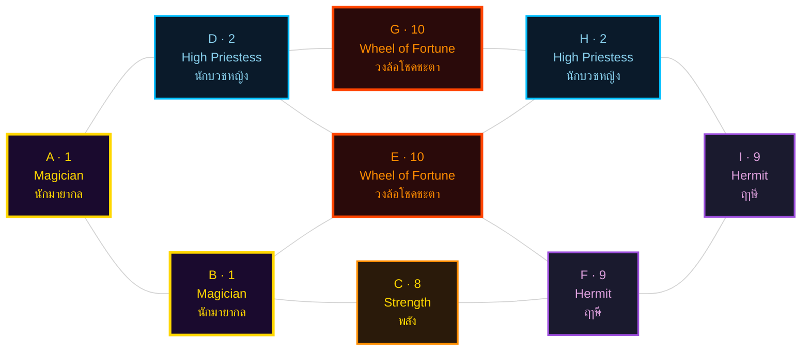
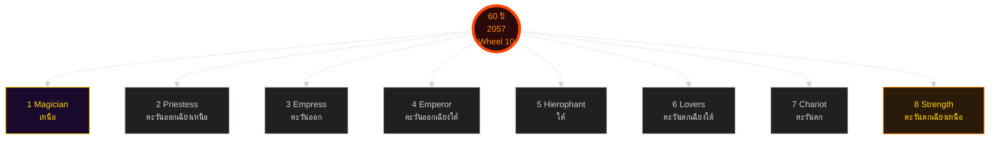

# พยากรณ์ Matrix of Destiny ฉบับสมบูรณ์ — Tang (เกิด 1 มกราคม พ.ศ. 2540)
## บูรณาการ 6 มุมมองเชิงลึก

> *"ชะตาไม่ได้ลิขิต แต่เป็นแผนที่ — คุณเลือกเดินทางได้ทุกย่างก้าว"*  
> — นาตาเลีย ลาดินี (Natalia Ladini)

---

## ข้อมูลพื้นฐาน

**ผู้เกิด:** Tang (ชาย)  
**วันเกิด:** 1 มกราคม พ.ศ. 2540 (01.01.1997)  
**อายุ ณ วันทำพยากรณ์:** 29 ปี (พ.ศ. 2569)  
**ประเภทบุคลิก (MBTI):** ISTJ — The Custodian (ภารโรง/ผู้พิทักษ์)  
**บทบาทอาชีพ:** System Analyst (นักวิเคราะห์ระบบ)  
**ช่วงพยากรณ์:** 2026–2057 (อายุ 29–60 ปี)

**ตัวเลข Matrix 9 จุด:**



- **A** = 1 (The Magician — นักมายากล)
- **B** = 1 (The Magician — นักมายากล)
- **C** = 8 (Strength — พลัง)
- **D** = 2 (The High Priestess — นักบวชหญิง)
- **E** = 10 (Wheel of Fortune — วงล้อแห่งโชคชะตา)
- **F** = 9 (The Hermit — ฤาษี)
- **G** = 10 (Wheel of Fortune — วงล้อแห่งโชคชะตา)
- **H** = 2 (The High Priestess — นักบวชหญิง)
- **I** = 9 (The Hermit — ฤาษี)

**จุดเด่น:** Echo Quadruple — ตัวเลข **1, 2, 9, 10** ปรากฏคนละ 2 ครั้ง ทั้งสี่แกนเป็น "จัตุรัสแห่งนักวิเคราะห์" (Quadrature of the Analyst)

---

<section id="summary">
## บทนำ · เข้าใจพยากรณ์ฉบับนี้

พยากรณ์ฉบับนี้อ่านชะตาของ Tang (เกิด 1 มกราคม พ.ศ. 2540) ผ่าน **6 มุมมองเชิงลึก** ที่มาจากภูมิปัญญาต่างยุค ทั้งหกมุมมองอ่าน Matrix 9 จุดเดียวกัน แต่ตั้งคำถามต่างกัน ตอบต่างกัน และให้ภาพที่ลึกขึ้นเมื่อนำมาประกอบกัน

### ทำไมต้อง 6 มุมมอง?

เพราะชีวิตคนเราไม่ได้แบนราบเหมือนเอกสาร 1 ใบ แต่เป็นปริซึมที่หักแสงไปหลายทิศทาง มุมมองเดียวตอบได้แค่บางคำถาม แต่ 6 มุมมองร่วมกันจะให้ภาพครบ

จุดเด่นที่สุดของ Matrix Tang คือ **"จัตุรัสแห่งนักวิเคราะห์"** (Quadrature of the Analyst) — ตัวเลขสี่ตัว (1, 2, 9, 10) ปรากฏคนละสองครั้งในผัง สร้างโครงสร้างสมดุลที่หายากมาก นี่ไม่ใช่ความบังเอิญ นี่คือลายเซ็นของจักรวาลที่บอกว่า Tang เกิดมาเพื่อ **"สร้างระเบียบจากความโกลาหล"** และ **"ค้นพบความจริงจากข้อมูล"**

แต่ละมุมมองจะอ่าน 'จัตุรัส' นี้ผ่านภาษาของตัวเอง แล้วบอกคุณว่าจะใช้พลังนี้อย่างไรโดยไม่ถูกมันครอบงำ

คุณไม่จำเป็นต้องเชื่อทุกมุมมอง แต่ควรอ่านทั้งหกแล้วเก็บไว้ใช้ตอนที่ชีวิตถามคำถามที่ตรงกับมุมมองนั้น

### มุมมองทั้ง 6 คือ:

1. **คาร์ล ยุง** — จิตวิทยาเชิงลึก (Persona, Shadow, Individuation)
2. **เฮเลนา บลาวัตสกี้** — กฎแห่งการดึงดูด (Law of Attraction, Theosophy)
3. **Three Initiates (Kybalion)** — 7 หลักการเฮอร์เมติก
4. **ไอซาเบล บริกส์ ไมเออร์ส** — MBTI (ฟังก์ชันจิต 4 ชั้น)
5. **นาตาเลีย ลาดินี (Octagram)** — ดาว 8 แฉก และพยากรณ์อายุ 60
6. **ซู หยูหง (BaZi)** — โหราศาสตร์จีน 8 เสา

---

</section>
<section id="talent-karma">
## มุมมองที่ 1 · คาร์ล ยุง — จิตวิทยาเชิงลึก

**คาร์ล ยุง (Carl Jung)** เป็นจิตแพทย์ชาวสวิส เขาสอนว่าจิตใจคนเรามี 2 ชั้น — ชั้นบนที่เห็น (Conscious) กับชั้นลึกที่ซ่อน (Unconscious) Matrix 9 จุดของ Tang คือแผนที่ของ 2 ชั้นนี้ เลนส์ของยุงช่วยให้คุณเห็นส่วนที่ซ่อนอยู่

เมื่อยุงอ่าน Matrix 9 จุดของ Tang ผ่านเลนส์จิตวิทยาเชิงลึก สิ่งที่ทำให้หยุดคิดไม่ใช่ตัวเลขใดตัวเลขหนึ่ง แต่เป็น **"จัตุรัสแห่งเสียงสะท้อน"** (Quadrature of Echoes) — ตัวเลข 1, 2, 9, 10 ปรากฏคนละสองครั้ง สร้างโครงสร้างสมมาตรที่หายาก

### 1. Persona (หน้ากาก) — "The Custodian of Order"

Persona ของ Tang อยู่ที่ **I=9 (The Hermit)** ตำแหน่งบุคลิกภายนอกที่โลกมองเห็น หน้ากากจึงเป็น **"ผู้พิจารณาเงียบ ผู้จดจำทุกรายละเอียด"** ซึ่งตรงกับ ISTJ อย่างสมบูรณ์แบบ

Hermit ไม่ได้เป็นผู้ถ่อมตนแบบ INFP แต่เป็น **"ผู้รู้ที่เดินเงียบพร้อมคบเพลิงส่องทาง"** เขาไม่ต้องพูดมาก เพราะการมีอยู่ของเขาเองก็บอกความจริงแล้ว สำหรับ Tang ที่เป็น System Analyst Persona นี้ทำให้เขากลายเป็น **"คนที่ทีมถาม"** เมื่อจำไม่ได้ว่า requirement เวอร์ชันไหนเขียนอะไร

การรวมกันของ Si (Introverted Sensing) + Te (Extraverted Thinking) สร้าง Persona ที่ทรงพลัง:
- **"คนที่จำทุกอย่าง"** — Tang มักเป็นคนที่ทีมถามเมื่อจำไม่ได้
- **"คนที่จับผิดทุกอย่าง"** — เขาเห็นความไม่สอดคล้องก่อนใคร
- **"คนที่ไม่เคยพลาด deadline"** — เขาวางแผนตามที่เคยสำเร็จมาก่อน

แต่ Persona นี้ก็มีด้านมืด เมื่อ Hermit "แข็งเกินไป" เขาจะกลายเป็น **"ผู้รู้ที่ไม่ฟังใคร"** และทีมจะรู้สึกว่าเขา "ไม่ยืดหยุ่น"

### 2. Shadow (เงา) — "The Reluctant Prophet"

Shadow ของ Tang อยู่ที่ **Ne (Extraverted Intuition)** — ฟังก์ชันที่สี่ที่ ISTJ มักปฏิเสธ เพราะมัน "เห็นความเป็นไปได้ที่ยังไม่เกิด" ซึ่งขัดกับ Si ที่ "เชื่อเฉพาะสิ่งที่เคยพิสูจน์แล้ว"

ในภาษาของยุง Shadow ไม่ใช่ปีศาจที่ต้องทำลาย มันคือ **"ห้องที่คุณไม่กล้าเข้า"** ห้องที่เต็มไปด้วยความเป็นไปได้ที่ Tang ไม่เคยปล่อยให้ตัวเองจินตนาการ

ตามที่ยุงเขียนใน *Aion* (1951) — *"The shadow is not the whole of the unconscious personality. It represents unknown or little-known attributes of the ego."* ในกรณีของ Tang, Shadow คือ **"ความกลัวความไม่แน่นอน"** ที่ซ่อนอยู่ใต้ Persona "นักวิเคราะห์ที่แม่นยำ"

**เมื่อไหร่ Shadow จะโผล่:**
- เมื่อ Requirement เปลี่ยนบ่อยเกินไป → Tang จะเครียด
- เมื่อทีมไม่ฟังคำเตือนของเขา → Ne-Grip จะทำให้เขา "เห็นวิกฤตทุกอย่าง"
- เมื่อ Ego อ่อนล้า → Si-Fi Loop จะทำให้เขา "เก็บกดความไม่พอใจ" จนระเบิด

### 3. Individuation (การเป็นตัวของตัวเอง)

Self ของ Tang อยู่ที่ **H=2 (The High Priestess)** — สัญชาตญาณภายในที่ยังไม่ถูกปลุก High Priestess นั่งอยู่ระหว่างสองเสาดำและขาว ถือหนังสือลึกลับ สัญลักษณ์ของ **"ความรู้ที่อยู่เหนือเหตุผล"**

กระบวนการ Individuation แบ่งเป็นสี่ขั้นตามช่วงอายุ:

**ขั้นแรก (29-35 ปี)** — Persona ของ Hermit สร้างตัวตนภายนอกผ่าน Magician (B=1) คือการเป็น System Analyst ที่ทีมเชื่อถือ

**ขั้นที่สอง (36-45 ปี)** — เริ่มเผชิญ Ne-Shadow ตรง ๆ เมื่อเทคโนโลยีเปลี่ยนเร็ว (AI, automation) Tang ต้องเรียนรู้ "เปิดรับความเป็นไปได้ใหม่"

**ขั้นที่สาม (46-55 ปี)** — High Priestess (H=2) ดังขึ้นเป็น "เสียงเรียก" ให้ Tang รวม Shadow (Ne) เข้ากับ Persona (Hermit) เขาจะเริ่มเชื่อ "สัญชาตญาณ" มากขึ้น

**ขั้นที่สี่ (56-60 ปี)** — คือ Self-Realization ผ่าน Earth Base Hermit ที่เคยถือคบเพลิงเพื่อคนอื่น จะส่องคบเพลิงนั้นเข้าหาตัวเอง

นี่สอดคล้องกับคำสอนของยุงว่า **"ศูนย์กลางของจิตคือการคืนดีระหว่าง Ego กับ Self"**

### 4. ข้อเสนอแนะจากยุง

สำหรับ Tang วัย 29 ที่ยืนอยู่ตรงจุดเริ่มต้นของอาชีพ ยุงจะแนะนำว่า:

1. **ถอดหน้ากาก Hermit ออกบ้างเมื่ออยู่กับคนที่ไว้ใจได้** — เพื่อเปิดทางให้ Fi (Introverted Feeling) ได้หายใจ
2. **รับรู้ว่า Shadow (Ne) ไม่ใช่ศัตรู** — มันคือ "ห้องที่ยังไม่ได้เข้า" ไม่ใช่ "ห้องที่ห้ามเข้า"
3. **ฟัง High Priestess ในใจ** — เมื่อสัญชาตญาณบอกอะไร อย่าปฏิเสธทันที ให้ Si ตรวจสอบก่อนว่า "เคยมีสัญชาตญาณถูกมาก่อนไหม"

---

</section>
<section id="relationships">
## มุมมองที่ 2 · เฮเลนา บลาวัตสกี้ — กฎแห่งการดึงดูด

**เฮเลนา บลาวัตสกี้ (Helena Blavatsky)** เป็นนักลึกลับชาวรัสเซีย เธอนำกฎเฮอร์เมติก (Hermetic Law) จากอียิปต์โบราณมาสอนใหม่ในศตวรรษที่ 19 เธอสอนว่าทุกสิ่งคือพลังงาน สิ่งที่คุณสั่น คุณดึงดูด และ Matrix 9 จุดของ Tang คือ 'อัตราการสั่น' 9 ความถี่ที่ทำงานพร้อมกัน

### 1. Vibration (ความถี่) — "Tangible Precision"

Tang มีความถี่หลักที่บลาวัตสกี้เรียกว่า **"ความแม่นยำที่จับต้องได้" (Tangible Precision)**

Si (Introverted Sensing) คือ *คลื่นแห่งความจำเชิงประสาทสัมผัส* มันเป็นความถี่ที่สั่นจาก **ข้อมูลเก่าที่แม่นยำ** — เห็น ได้ยิน จับต้อง วัดได้ ตรวจสอบได้ ซ้ำได้

Te (Extraverted Thinking) คือ *คลื่นแห่งประสิทธิภาพที่ส่งออกสู่โลก* มันเป็นความถี่ของการจัดระเบียบ วัดผล ตัดสินใจตามเกณฑ์

เมื่อทั้งสองคลื่นมาซ้อนกัน Tang สั่นที่ความถี่ **"ความแม่นยำ (จาก Si) ที่แสดงออกมาในรูปที่จับต้องได้ (จาก Te)"** — เป็นระบบ เป็นแผนภาพ เป็นเอกสาร ที่คนอื่นหยิบขึ้นมาทำตามได้ทันที

**สิ่งที่ Tang ดึงดูดกลับมา:**

ตามหลัก *Like Attracts Like* ความถี่ของ Tang จะดึงดูด:

1. **ผู้คนและทีมที่ทำงานด้วยโครงสร้างเดียวกัน** — Business Analyst, QA, Developer ที่ชอบเอกสาร
2. **ปัญหาที่ต้องการความแม่นยำ** — requirement ที่กำกวม ข้อมูลที่ขัดกัน edge case ที่เอกสารไม่ได้บอก
3. **โอกาสที่เปิดทางให้คนที่เป็นระบบ** — Period 9 (2024-2043) กำลังเร่งให้ทุกองค์กรต้องปรับโครงสร้าง Tang จะดึงดูดบทบาทที่ต้อง **สร้างระบบใหม่ให้ทันยุค**

### 2. As Above, So Below — Correspondence

หลัก Correspondence บอกว่า: *"As above, so below; as below, so above"*

**ภายใน (As below):** ในหัวของ Tang มี *schema* — แผนที่ทางความคิดที่จัดเรียงทุกสิ่งไว้ในช่องที่ถูกต้อง

**ภายนอก (As above):** จักรวาลจะส่งกลับมาเป็น *สถานการณ์ที่ schema ของเขาใช้งานได้*

แต่เมื่อ *ภายใน* ของ Tang เริ่มสับสน *ภายนอก* จะสะท้อนกลับมาเป็นความโกลาหลแบบเดียวกัน นี่คือเหตุผลที่ Tang รู้สึกหงุดหริดเมื่อทำงานในทีมที่ขาดกระบวนการ

วิธีกลับเข้าสู่สมดุลคือ **ปรับภายในก่อน** — หยุด หายใจ เขียน requirement ออกมาใหม่ แยกข้อเท็จจริงจากความเห็น

### 3. Manifestation Loop — 5 จังหวะของการดึงดูด

บลาวัตสกี้สอนว่ากระบวนการดึงดูดมี 5 จังหวะ: **Clarify → Align → Receive → Act → Gratitude**

**Clarify (ชี้ชัด):** Tang เป็นเจ้าของธรรมชาติขั้นนี้อยู่แล้ว เขาเก่งในการแยก requirement ที่กำกวมออกเป็น requirement ที่ชัด

**Align (ปรับความถี่):** หลังชี้ชัดแล้ว ต้อง *visualization* เห็นภาพ user ใช้งานระบบใหม่ เห็น test case ผ่าน เห็น stakeholder พยักหน้า

**Receive (รับ):** ปล่อยให้ผลลัพธ์เข้ามา ไม่ใช่บังคับ Tang มักติดที่ขั้น Clarify เพราะ Te บอกว่า "ต้องควบคุม" แต่ LoA บอกว่า **ความเชื่อมั่น (trust) คือสะพาน**

**Act (ลงมือ):** Inspired Action ที่ไหลมาเอง ไม่ใช่นั่งเขียนด้วยความฝืน Tang จะรู้ได้เองว่าเมื่อไหร่คือ Inspired Action เพราะจะรู้สึกสงบและแม่นยำ

**Gratitude (ขอบคุณ):** Tang ควรมี gratitude journal สั้น ๆ ตอนเย็น — 3 ข้อ — ที่เน้นความแม่นยำที่ผ่านไปด้วยดี

---

</section>
<section id="cosmic-synergy">
## มุมมองที่ 3 · เฮอร์เมติก — 7 หลักการแห่ง Kybalion

*The Kybalion* เป็นหนังสือลึกลับตีพิมพ์ปี ค.ศ. 1906 โดย 'Three Initiates' หนังสือนี้สรุปภูมิปัญญาเฮอร์เมติก (Hermetic) จากอียิปต์โบราณเป็น **7 หลักการธรรมชาติ** (Natural Law) ที่ทำงานเบื้องหลังทุกสิ่งในจักรวาล

เมื่อ Three Initiates รับตัวตนของ Tang พวกเขาเห็นภาพของ **"สถาปนิกที่สร้างอาคารทีละชั้น"** — ไม่ใช่สถาปนิกที่ออกแบบแล้วจ้างช่างสร้าง แต่เป็นสถาปนิกที่วางอิฐทีละก้อน ตรวจงานทีละชั้น และมอบอาคารที่ "ยืนได้จริง" เมื่ออายุ 60

### 1. Mentalism — "The All is Mind"

ISTJ (Si-Te) ไม่ได้เริ่มจาก "จิต" — เขาเริ่มจาก "ข้อมูลที่จับต้องได้" (Si) แล้วค่อยใช้ Te จัดระเบียบ Tang เป็นคนที่ "ต้องเห็นหลักฐานก่อนเชื่อ"

แต่ Mentalism บอกว่า **"requirement ที่ดีที่สุดเริ่มจากวิสัยทัศน์ (vision) — ไม่ใช่จาก use case"** นี่คือจุดที่ Mentalism จะเปลี่ยน Tang จาก "System Analyst ที่ทำตาม requirement" เป็น "System Analyst ที่ออกแบบ requirement ให้คนอื่น"

**คำเตือน:** ถ้า Tang "เชื่อ" ว่าระบบต้องสมบูรณ์แบบ 100% ก่อน deploy เขาจะไม่มีวัน deploy สิ่งใดเลย เพราะจิตที่ว่า "ต้องสมบูรณ์แบบ" จะก่อ Cause ที่ทำให้ทุกอย่างไม่สมบูรณ์แบบ

### 2. Correspondence — "As above, so below"

Tang เป็น System Analyst คือ **"ผู้แปล blueprint จาก business สู่ technical"** นี่คือ Correspondence ในชีวิตจริง — รับ requirement จาก stakeholder (above) แล้วแปลเป็น schema, API, database (below)

Correspondence ที่ลึกกว่านั้นคือ **"as within so without"** — ระบบที่ Tang สร้างสะท้อนสภาพจิตของ Tang ถ้า Tang มีจิตที่ "รก" ระบบที่เขาสร้างจะ "รก" ด้วยฟีเจอร์ที่ไม่จำเป็น ถ้า Tang มีจิตที่ "ชัดเจน" ระบบจะ "minimal แต่พอดี"

### 3. Vibration — "Nothing rests"

ISTJ มีความถี่ **"ช้า สม่ำเสมอ หนักแน่น"** เหมือน metronome ที่ติ๊กด้วยจังหวะเดิม Tang อยู่ใน "ความถี่ต่ำ" ของ Vibration spectrum — เขาเป็นคนที่ "รอบ" มากกว่า "เร็ว" เขาจะไม่กระโดดไปทำงานใหม่ทุกปี แต่จะ **ทำงานเดิมให้ดีขึ้นทุกปี**

Vibration ของ Tang จะเปลี่ยนตามช่วงอายุ — เริ่มที่ "ความถี่ต่ำ สม่ำเสมอ" ในช่วง 29-35 แล้ว "เพิ่มความถี่" ในช่วง 36-45 และ "stabilize ที่ความถี่กลาง" ในช่วง 46-60

### 4. Polarity — "Everything is dual"

ISTJ มีฟังก์ชันหลักสี่ฟังก์ชัน ขั้วที่สำคัญคือ:

**ระเบียบ ↔ ความยืดหยุ่น (Si ↔ Ne):** Tang ต้องเรียนรู้ "เลื่อน" จาก "ยึด process" ไป "เปิดรับไอเดียใหม่" อย่างคล่องแคล่ว

**ความมั่นคง ↔ ความเสี่ยง (Si-past ↔ Ne-future):** Tang ที่อยู่ใน Si จะ "อ้างอิงอดีต" ทุกครั้ง แต่ในช่วงอายุ 36-45 เมื่อเทคโนโลยีเปลี่ยนเร็ว "อดีต" ที่เขาอ้างอิงอาจไม่ตรงกับ "อนาคต"

### 5. Rhythm — "Everything flows"

Rhythm ของ ISTJ วัย 29-60 คือ **"long pendulum"** — แกว่งทุก 7-10 ปี Tang จะมี "up-cycle" 7 ปี (29-35) แล้ว "down-cycle" 7 ปี (36-42) แล้ว "up-cycle ที่สูงกว่า" 10 ปี (43-52)

เมื่อ Tang อายุ 60 pendulum จะอยู่ที่ "ตำแหน่งครู" Tang จะเป็น "ที่ปรึกษา" ที่คนอื่นมาหา — ไม่ใช่เพราะเขา "เก่ง" ที่สุด แต่เพราะเขา **"เห็น" รอบ pendulum ของคนอื่นได้**

### 6. Cause & Effect — "Every cause has its effect"

นี่คือแกนหลักสำหรับ Tang เพราะ Si-Te เชื่อเรื่อง "เหตุ-ผล" เป็นทุนเดิม แต่ตาม Kybalion มี "หลาย plane ของ causation" — ไม่ใช่แค่ physical (ระบบล่ม → user ร้องเรียน) แต่มี mental (ความคิดที่ว่า "ต้องควบคุมทุกอย่าง" → behavior ที่ "control-freak")

Tang ต้องเรียนรู้ "เห็น" Cause ที่ระดับ mental — เช่น ถ้าเขา "คิด" ว่า "ทีมนี้ไม่มีความสามารถ" เขาจะ "กระทำ" แบบที่ทำให้ทีมรู้สึกไม่มีความสามารถจริง ๆ

### 7. Gender — "Everything has masculine and feminine"

Tang ต้องเรียนรู้สมดุลระหว่าง:
- **Masculine (ส่ง):** Te ที่ส่งออกระเบียบ
- **Feminine (รับ):** Si ที่รับเข้ามาข้อมูล

Tang มัก "ส่ง" มากกว่า "รับ" เขาต้องฝึก **"ฟัง"** ให้มากขึ้น

---

</section>
<section id="success-roles">
## มุมมองที่ 4 · ไอซาเบล บริกส์ ไมเออร์ส — MBTI

**ไอซาเบล บริกส์ ไมเออร์ส (Isabel Briggs Myers)** สร้าง MBTI จากทฤษฎีของยุง MBTI แบ่งบุคลิกเป็น **16 Type** ตามฟังก์ชันจิต 8 ตัว

### Type ของ Tang: ISTJ — The Custodian

**Cognitive Stack:**
1. **Si (Introverted Sensing) — Dominant** — คลังข้อมูลในหัวที่ไม่เคยลบ
2. **Te (Extraverted Thinking) — Auxiliary** — ไม้บรรทัดที่วัดโลกภายนอก
3. **Fi (Introverted Feeling) — Tertiary** — เสียงในใจที่แทบไม่ได้ยิน
4. **Ne (Extraverted Intuition) — Inferior** — ประตูที่ถูกปิดตาย

### Si-Dominant: คลังความจำที่แม่นยำ

Si ของ Tang ไม่ใช่ "ความจำดี" อย่างที่หลายคนเข้าใจผิด Si คือ **"การรับรู้สิ่งเร้าทางกายภาพที่ถูกบันทึกไว้ในร่างกาย"**

Tang สามารถ "จำ" ได้ว่า:
- requirement ฉบับไหนเคย fail
- schema ตารางไหนเคยพัง
- user คนไหนชอบพูดอ้อม

เขา "รู้" ว่าความผิดพลาดเดิม ๆ จะกลับมาในรูปแบบใหม่

### Te-Auxiliary: ไม้บรรทัดแห่งประสิทธิภาพ

Te ของ Tang แปลง "ความจำ" ของ Si เป็น **"มาตรฐาน"** ที่ทีมสามารถนำไปปฏิบัติได้ — SOP, checklist, SLA, test case

Te ของ Tang ไม่ได้ "โผล่ออกมาข้างนอก" แบบหรือเสียงดัง — มันทำงาน **"เงียบ ๆ"** ผ่านเอกสาร ตาราง และ slide ที่ "ไม่มีใครเถียงได้"

### Fi-Tertiary: เสียงภายในที่ถูกกด

Fi ของ Tang ถูกกดมาตลอด 29 ปี เพราะ Persona "มืออาชีพ" สอนเขาว่า **"อย่าเอาความรู้สึกมาเกี่ยวกับงาน"**

Ego ของเขาเชื่อว่า "ค่านิยมส่วนตัว = จุดอ่อน" เขาไม่รู้ว่าเขา **"เชื่อ"** อะไรจริง ๆ เขารู้แค่ว่าเขา **"ทำ"** อะไร

### Ne-Inferior: ภาษาต่างดาวที่พูดไม่คล่อง

Ne คือการ **"เห็นความเป็นไปได้ที่ยังไม่เกิด"** Tang เข้าใจข้อมูลในอดีต (Si) ดีมาก แต่เข้าใจความเป็นไปได้ในอนาคต (Ne) ช้ามาก

บ่อยครั้งเขาจะปฏิเสธไอเดียใหม่ ๆ ที่ "ดูเพ้อฝัน" — ไม่ใช่เพราะเขาไม่ฉลาด แต่เพราะ Ne ของเขา **"ส่งสัญญาณช้า"** และ Si ของเขา **"ตัดสินแทน"** ก่อนที่ Ne จะทันคิด

### Grip & Loop Risks

**Ne-Grip:** เมื่อ Ego อ่อนล้า Ne จะ **"ระเบิดออกมา"** ทำให้ Tang:
- "เห็นวิกฤตทุกอย่าง"
- "หาหลักฐานว่าทุกอย่างผิด"
- "ตัดสินใจแบบหุนหันพลันแล่น"

**Si-Fi Loop:** เมื่อ Tang รู้สึกว่า "ไม่ได้รับการยอมรับ" Ego จะ **"หมุนวน"** ระหว่าง Si (เก็บข้อมูลความผิดหวัง) กับ Fi (เก็บความรู้สึก)

### คำแนะนำจาก Myers

1. **ฝึก Ne อย่างเป็นระบบ** — ลองอ่านหนังสือ sci-fi, ดูหนัง dystopia, เล่น strategy game ที่ต้อง "คิดก้าวหน้า"
2. **ปล่อย Fi ออกมาบ้าง** — เขียน journal ส่วนตัวที่ไม่มีใครอ่าน เขียนว่า "วันนี้ฉันรู้สึกอะไร"
3. **ระวัง Te overuse** — เมื่อรู้สึก "เหนื่อย" หยุด อย่าฝืนวัด ฝืนจัด

---

</section>
<section id="natal-square">
## มุมมองที่ 5 · นาตาเลีย ลาดินี — Octagram และพยากรณ์อายุ 60

**นาตาเลีย ลาดินี (Natalia Ladini)** เป็นผู้เชี่ยวชาญด้าน Matrix of Destiny และดาว 8 แฉก (Octagram) เธอสอนว่าอายุ 60 เป็นจุดพลิกผัน (turning point) ของพลังงาน Matrix

### Natalia Square 3×3 — จัตุรัสแห่งนักวิเคราะห์

ผัง 3×3 ของ Tang มีความพิเศษที่ **ตัวเลขมีเพียง 4 ค่า: 1, 2, 9, 10** ทั้งสี่ปรากฏคนละสองครั้ง สร้าง **"Quadrature of the Analyst"**

**แกนบน (Thought / Beginning)** — A-B-C = **1—1—8**

Tang เป็นผู้สร้าง (Magician) ที่ยืนยันตัวตน (Magician ซ้ำ) ด้วยความอดทน (Strength)

**แกนกลาง (Life / Core)** — D-E-F = **2—10—9**

Tang รับสัญชาตญาณ (High Priestess) → บังคับวงล้อ (Wheel of Fortune) → พิจารณาเงียบ (Hermit)

**แกนล่าง (Foundation / Earth)** — G-H-I = **10—2—9**

วงล้อแห่งโชคชะตา (Wheel) → สัญชาตญาณภายใน (High Priestess) → ปัญญาสะท้อน (Hermit)

### ตำแหน่งบน Octagram ณ อายุ 60



เมื่อ Tang ครบ 60 ปี (พ.ศ. 2600 / ค.ศ. 2057) เขาจะกลับมาที่ตำแหน่ง **10 (Wheel of Fortune)** บน Octagram

นี่ไม่ใช่ "กลับไปเริ่มต้นใหม่" แต่เป็น **"ปิดวงจร"** — Tang จะไม่ใช่ "ผู้วิเคราะห์" อีกต่อไป แต่จะกลายเป็น **"ผู้พิทักษ์ระบบนิเวศที่ตนเองสร้าง"**

### 8 มิติที่พยากรณ์อายุ 60

**§0 · ตำแหน่งบน Octagram:** Wheel of Fortune (10) ที่ฐานล่างของดาว

**§1 · พลัง Dominant ที่ขับเคลื่อน:** Te ของ ISTJ จะ "ปล่อย" อำนาจให้คนรุ่นต่อไป

**§2 · Chakra ที่เปิดสูงสุด:** จักระที่สว่างที่สุดคือ Crown Chakra (จักระมงกุฎ) — Magician (A+B=1+1) บอกว่าเขา "เปิดรับจักรวาล" ได้อย่างสมบูรณ์

**§3 · สายตระกูลที่ปลดล็อก:** Tang จะปลดล็อกมรดกฝั่งบิดา (ปี 1997 → 8 = Strength)

**§4 · บทเรียนที่ครบรอบ:** "การบังคับวงล้อ" (Wheel E+G=10+10) ที่เขาจบได้คือ "ขี่วงล้ออย่างมีสติ"

**§5 · บทเรียนที่ยังค้าง:** "การพิจารณาตนเอง" (Hermit F+I=9+9) ที่ยังต้องทำต่อคือ "ส่องคบเพลิงกลับเข้าหาตัวเอง"

**§6 · คำแนะนำเตรียมตัว:** 3 ปีก่อนถึง 60 (2054-2056) Tang ควร:
- เขียน journal ทุกวัน
- มอบหมายงาน 1 งานต่อไตรมาสให้คนรุ่นใหม่
- ฝึกสมาธิ Vipassana

**§7 · มุมมองเสริมจากเลนส์อื่น:** ทุกเลนส์ (Jung, Blavatsky, Hermetic, MBTI, BaZi) มองอายุ 60 ของ Tang เห็นตรงกันว่า นี่คือ **"จุดบรรจบ"** — Tang จะไม่ใช่ "ผู้สร้าง" อีกต่อไป แต่เป็น **"ผู้พิทักษ์"**

---

## มุมมองที่ 6 · ซู หยูหง — BaZi (โหราศาสตร์จีน 8 เสา)

**ซู หยูหง (Su Yu Hong)** เป็นผู้เชี่ยวชาญด้านโหราศาสตร์จีน BaZi (八字) หรือ "แปดเสา" คือระบบที่อ่านชะตาจากวันเวลาเกิดโดยตรง

### Day Master: Yang Metal (庚金 Geng Jin)

Tang เกิดวัน Day Master **Yang Metal (庚金)** — เหล็กกล้า ดาบ ขวาน เครื่องมือ โครงสร้าง

Yang Metal เป็นคนที่:
- **แข็งแกร่งภายนอก** — มีหลักการ มีกฎเกณฑ์
- **แม่นยำ** — ตัดสินใจตามข้อมูล ไม่ใช่อารมณ์
- **เย็นชา** — ไม่แสดงอารมณ์ออกมา
- **ต้องการถูกหลอม** — Yang Metal ดิบ ๆ ใช้ไม่ได้ ต้องผ่านไฟ (Fire) เพื่อ "เปลี่ยนรูป" ให้เป็นดาบหรือเครื่องมือที่ใช้งานได้

### Period 9 (2024-2043): ยุคไฟ (離火)

Tang อยู่ใน Period 9 ซึ่งเป็น **ยุคไฟ (離火 Li Fire)** — ธาตุไฟครอบงำโลก

สำหรับ Yang Metal (庚金) Period 9 คือ **ยุคแห่งการ "ถูกหลอม"**:
- **Fire melts Metal** — ไฟหลอมโลหะ ทำให้ Metal "เปลี่ยนรูป"
- สำหรับ Tang หมายความว่า **ช่วง 29-45 ปี (2026-2042) เขาจะถูก "บีบ" ให้เปลี่ยน** — ไม่ว่าจะเป็น AI ที่แทนงานวิเคราะห์, automation ที่เปลี่ยน workflow, หรือ stakeholder ที่ต้องการ "ผลลัพธ์เร็วกว่าเดิม"

นี่ไม่ใช่การลงโทษ นี่คือ **"โอกาสให้ Metal ได้เป็นดาบ"** ถ้า Tang ต่อต้านไฟ เขาจะ "ละลาย" แต่ถ้าเขา **"ยอมให้ไฟหลอม"** เขาจะกลายเป็น **"เครื่องมือที่คมกว่าเดิม"**

### Luck Pillars (大運): ช่วงโชคตลอด 31 ปี

**Pillar 1 (29-38 ปี, 2026-2035):** 壬水 (Yang Water) — น้ำหล่อเลี้ยง Metal
- **ระยะนี้ Tang จะ "เติบโต"** — Water feeds Metal ทำให้ Metal แข็งแรง
- เป็นช่วงที่ดีที่สุดสำหรับ "สะสมประสบการณ์" และ "สร้างชื่อเสียง"

**Pillar 2 (39-48 ปี, 2036-2045):** 辛金 (Yin Metal) — โลหะเงิน
- **ระยะนี้ Tang จะ "แข่งขัน"** — Yin Metal คือ "คู่แข่ง" ของ Yang Metal
- เป็นช่วงที่ต้อง "พิสูจน์ตัวเอง" ว่า "ทำไมเขาถึงดีกว่าคนอื่น"

**Pillar 3 (49-58 ปี, 2046-2055):** 庚金 (Yang Metal) — โลหะเหล็กซ้ำ
- **ระยะนี้ Tang จะ "กลับมาหาตัวเอง"** — Yang Metal ซ้ำ หมายความว่า "ต้นทุนเดิม" กลับมา
- เป็นช่วงที่ต้อง "ตัดสินใจ" ว่า "จะเป็นผู้นำหรือเป็นที่ปรึกษา"

**Pillar 4 (59-60 ปี, 2056-2057):** 己土 (Yin Earth) — ดินเลี้ยง Metal
- **ระยะนี้ Tang จะ "ส่งมอบ"** — Earth produces Metal ทำให้ Metal "กลับสู่ราก"
- เป็นช่วงสุดท้ายก่อนอายุ 60 ที่ต้อง "เตรียมตัว" ปิดวงจร

### ธาตุที่ขาดและธาตุที่เกิน

**ธาตุที่ขาด: Wood (木)**
- Tang ขาด Wood (ความยืดหยุ่น ความคิดสร้างสรรค์)
- เขาควร "เติม Wood" ด้วยการ:
  - ทำงานกับคนที่เกิดปีเดือนวัน Tiger, Rabbit (ปีขาล เดือนกุมภาพันธ์-มีนาคม)
  - เพิ่ม "พืช" ในชีวิต (ปลูกต้นไม้ ดูแลสวน)
  - อ่านหนังสือ "ประเภทจินตนาการ" (sci-fi, fantasy)

**ธาตุที่เกิน: Metal (金)**
- Tang มี Metal มากเกินไป (Yang Metal Day Master + Pillar มี Metal ซ้อน)
- เขาควร "ระบาย Metal" ด้วยการ:
  - ใช้ Water (思考 thinking) เพื่อ "ลดความแข็ง"
  - ใช้ Fire (行動 action) เพื่อ "หลอมให้เปลี่ยนรูป"

### คำแนะนำจากซู หยูหง

1. **ยอมรับว่า Period 9 คือยุคที่ Metal ต้องถูกหลอม** — อย่าต่อต้าน ให้ไฟหลอม
2. **เติม Wood ให้ตัวเอง** — เพิ่มความยืดหยุ่น เพิ่มความคิดสร้างสรรค์
3. **ระบาย Metal ด้วย Water** — คิดมากขึ้น แต่อย่าคิดจนเครียด

---

</section>
<section id="timeline-forecast">
## สรุป · เมื่อ 6 มุมมองบรรจบ

### สามจุดที่ทั้ง 6 เลนส์เห็นตรงกัน

1. **Tang เป็นผู้สร้างระเบียบ** — ทุกเลนส์เห็นตรงกันว่า Tang เกิดมาเพื่อ "สร้างโครงสร้าง" (Jung: Hermit, Blavatsky: Tangible Precision, Kybalion: Architect, Myers: Si-Te, Ladini: Magician×2, BaZi: Yang Metal)

2. **ช่วงอายุ 36-45 ปีเป็นจุดเปลี่ยน** — ทุกเลนส์เตือนว่าช่วงนี้ Tang จะ "ถูกท้าทาย" (Jung: Ne-Shadow, Blavatsky: Down-cycle, Kybalion: Polarity shift, Myers: Grip risk, Ladini: Wheel middle, BaZi: Fire melts Metal)

3. **อายุ 60 คือจุดบรรจบ** — ทุกเลนส์ชี้ไปที่ 2057 (อายุ 60) ว่าเป็น "จุดปิดวงจร" Tang จะเปลี่ยนจาก "ผู้สร้าง" เป็น "ผู้พิทักษ์"

### ความแตกต่างที่ลึกที่สุด

**Jung vs BaZi:**
- Jung มอง Shadow เป็น "ส่วนที่ต้องรวม"
- BaZi มอง Metal ที่เกินเป็น "ส่วนที่ต้องระบาย"

ทั้งสองไม่ขัดแย้ง — Tang ต้อง "รวม Ne-Shadow" (Jung) โดยการ "เติม Wood" (BaZi)

### การบรรจบทางเวลา

**2026 (อายุ 29):** จุดเริ่มต้น — ทุกเลนส์บอกว่านี่คือ "จุดเริ่มสะสม"

**2030 (อายุ 33):** จุดกลาง cycle แรก — Tang จะรู้สึกว่า "ได้ form" แล้ว

**2042 (อายุ 45):** จุดพลิก — Period 9 จบ Tang จะ "ถูกหลอม" เสร็จ

**2057 (อายุ 60):** จุดบรรจบ — Octagram กลับมาที่ Wheel (10) Tang "ปิดวงจร"

### ไทม์ไลน์ 5 ช่วงวัย (อายุ 29 → 60)

| ช่วงอายุ | ปี ค.ศ. | พลังงานหลัก (BaZi) | ธีมหลักของช่วง | คำแนะนำเชิงกลยุทธ์ (Si/Te) |
|---|---|---|---|---|
| **29–35** | 2026–2032 | Pillar 1: 壬水 (Yang Water) | "สะสมประสบการณ์ + สร้างชื่อเสียง" — Water feeds Metal ทำให้ Metal แข็งแรง | ลงทุนกับความรู้ที่ "จับต้องได้" — SOP, framework, certification. อย่าเปลี่ยนงานบ่อย |
| **36–42** | 2033–2039 | Pillar 1 ปลาย → Pillar 2: 辛金 (Yin Metal) | "ทดสอบตัวเอง" — Yin Metal คือคู่แข่งของ Yang Metal | รุก: นำเสนอผลงานเป็นชิ้นเป็นอัน อย่าปล่อยให้คนอื่น "ห่อ" ผลงานของคุณ |
| **43–49** | 2040–2046 | Pillar 2 ปลาย → Pillar 3: 庚金 (Yang Metal ซ้ำ) | "กลับมาหาตัวเอง" — ต้นทุนเดิมกลับมา | รับ: ตัดสินใจว่าจะ "เป็นผู้นำ" หรือ "เป็นที่ปรึกษา" อย่าฝืนทำทั้งสองบทบาท |
| **50–55** | 2047–2052 | Pillar 3 กลาง | "ส่งต่อความรู้" — Hermit ส่องคบเพลิงให้คนรุ่นต่อไป | สอน: จดบันทึก "บทเรียนที่ยังไม่เคยเขียน" — Ne-Shadow เริ่มส่งเสียงดังขึ้น |
| **56–60** | 2053–2057 | Pillar 4: 己土 (Yin Earth) | "เตรียมปิดวงจร" — Earth produces Metal, กลับสู่ราก | ชะลอ: เตรียมงานเขียน/speaking สรุป 31 ปี, มอบหมายงานทีละชิ้น |

### พยากรณ์รายปี (อายุ 29 ถึง 60) — Scenario Simulation

> **เรื่องเล่าจำลอง:** "วันจันทร์ที่ requirement เปลี่ยนกลาง sprint" (อายุ 32, ปี 2029)
>
> Tang นั่งอยู่หน้าจอ ข้อความจาก Product Owner เด้งขึ้น: "ขอเปลี่ยน priority ของ US-014 ทั้งหมดครับ stakeholder ใหญ่โทรมาเมื่อเช้า" Tang รู้สึกแน่นหน้าอก Si บอกว่า "เคยเจอแบบนี้มาแล้ว" แต่ Ne กระซิบว่า "แล้วถ้าทั้ง sprint พังล่ะ" Ego เริ่มสั่น → **Ne-Grip เข้าครอบงำ** Tang เริ่มเห็นทุกอย่างเป็นวิกฤต
>
> **กลยุทธ์ (Si/Te):**
> 1. หยุดเปิด Slack 5 นาที — เดินออกจากโต๊ะ
> 2. เขียน "สิ่งที่เปลี่ยน" ออกมา 1 หน้า A4 — แยกข้อเท็จจริงจากความเห็น
> 3. โทรหา QA Lead 10 นาที — ถามว่า "อะไรพังจริง อะไรแค่รู้สึกพัง"
> 4. ตอบ Product Owner ภายใน 2 ชั่วโมง — ด้วย "ทางเลือก 3 ทาง" ที่วัด impact ด้วยตัวเลข ไม่ใช่ด้วยอารมณ์
>
> **บทเรียน:** วิกฤตที่ Ne วาดภาพนั้นขยายใหญ่กว่าความจริงเสมอ — เมื่อ Si ตรวจสอบข้อมูล จะเห็นว่า "พัง 60% ไม่ใช่ 100%"

**เหตุการณ์หักเหที่ต้องจับตา:**

- **2029 (อายุ 32):** ครั้งแรกที่ Tang "ต้องออกแบบ requirement เอง" โดยไม่มี Business Analyst คอยช่วย → ทดสอบว่า Te ของ Tang สร้างสรรค์ได้ไหม หรือแค่ทำตาม
- **2035 (อายุ 38):** ปีที่ AI tool (LLM, automation) เริ่ม "ทำงานวิเคราะห์เบื้องต้น" ได้ → Tang ต้องเลือกว่าจะ "ต่อต้าน" หรือ "ร่วมมือ"
- **2041 (อายุ 44):** ปีที่ Period 9 ใกล้จบ — Tang จะ "ถูกหลอม" ด้วยการเปลี่ยนบทบาทครั้งใหญ่ (เลื่อนตำแหน่ง, เปลี่ยนทีม, หรือย้ายสาย)
- **2054 (อายุ 57):** ปีที่ต้องเริ่มเขียน "มรดกทางปัญญา" — บทเรียน 31 ปีที่จะกลายเป็นคัมภีร์ส่วนตัว

</section>
<section id="actionable">
## สิ่งที่คุณเลือกทำได้ตอนนี้

### 5 ข้อเสนอแนะเชิงปฏิบัติ

**1. สร้าง Personal Knowledge Base**
- ใช้ Obsidian หรือ Notion สร้าง "คลัง Si" ส่วนตัว
- จดบันทึก "บทเรียนที่เคยผิด" และ "รูปแบบที่เคยสำเร็จ"
- ให้ Si ทำงาน "อย่างมีระบบ" แทนที่จะ "จำในหัว"

**2. ฝึก "ความเป็นไปได้" ทุกวันศุกร์**
- ทุกศุกร์ ใช้เวลา 15 นาทีคิด "What if..."
- "ถ้าระบบนี้ไม่ต้องเป็นแบบนี้ จะเป็นอะไรได้บ้าง"
- เป็นการ "ฝึก Ne" อย่างเป็นระบบ

**3. เขียน "Journal ความรู้สึก" ก่อนนอน**
- 3 บรรทัดสั้น ๆ: "วันนี้ฉันรู้สึกอะไร"
- ไม่ต้องเป็นเหตุเป็นผล ไม่ต้องแก้ปัญหา แค่ "รู้ว่ารู้สึกอะไร"
- เป็นการ "ปล่อย Fi" ออกมา

**4. เรียนรู้จาก "คนที่ไม่เหมือนเรา"**
- หา mentor ที่เป็น ENTP หรือ ENFP
- ฟังว่าพวกเขา "คิดอย่างไร" เมื่อเจอปัญหา
- เป็นการ "ดูตัวอย่าง Ne" จากชีวิตจริง

**5. วางแผน 3 ปีก่อนอายุ 60 (2054-2057)**
- เขียนว่า "ฉันอยากเป็นอะไรเมื่ออายุ 60"
- ทุก ๆ 3 เดือน ทบทวนว่า "ฉันกำลังเดินไปถูกทางหรือไม่"
- เป็นการ "ปล่อยให้ Self นำทาง"

### Crisis Mastery — เมื่อ Ne-Grip ครอบงำ

**Ne-Grip คืออะไร:** เมื่อ Ego ของ ISTJ อ่อนล้า Ne (ฟังก์ชันที่ 4) จะ "ระเบิดออกมา" — Tang จะเริ่ม *เห็นวิกฤตทุกอย่าง* แม้เรื่องที่ยังไม่เกิด จินตนาการถึงผลลัพธ์เลวร้ายที่สุด วิตกกังวลอนาคต และรู้สึกว่า "สูญเสียการควบคุม" ระบบที่คุ้นเคย

**อาการเตือน 5 ข้อ:**
1. เปิด requirement เก่า ๆ ขึ้นมาอ่านซ้ำ ๆ โดยไม่มีเหตุผล
2. ตอบ Slack/Teams ภายใน 30 วินาทีทุกข้อความ (over-control)
3. บ่นกับตัวเองว่า "ทำไมคนอื่นไม่เห็นปัญหาที่ฉันเห็น"
4. ฝันร้ายเกี่ยวกับระบบที่ล่ม
5. อยากเขียน SOP ใหม่ทั้งหมด แม้ระบบเดิมยังใช้ได้

**โปรโตคอล 4 ขั้นเมื่อ Grip เข้าครอบงำ:**

| ขั้น | เวลา | สิ่งที่ทำ | ทำไม |
|---|---|---|---|
| 1. หยุดทางกายภาพ | 5 นาที | ลุกจากโต๊ะ เดินออกจากอาคาร ไม่เปิดจอ | ตัด input ที่กระตุ้น Ne ทันที |
| 2. ร่างข้อเท็จจริง | 15 นาที | เขียน "สิ่งที่เกิดขึ้นจริง" ออกมา 1 หน้า A4 แยกข้อเท็จจริงจากความเห็น | ใช้ Si กลับเข้ามาทำงานแทน Ne |
| 3. โทรหา 1 คนที่ไว้ใจ | 10 นาที | คนที่ไม่ใช่ stakeholder — เพื่อน หรือ mentor ENTP/ENFP | รับ "มุมมองจากข้างนอก" เพื่อ break echo chamber |
| 4. ตอบกลับด้วย "ทางเลือก" | 2 ชั่วโมง | เขียนคำตอบที่มี 3 ทางเลือก + impact ที่วัดได้ | Te กลับมาเป็น "ไม้บรรทัด" แทนที่จะเป็น "อาวุธ" |

> **เรื่องเล่าจำลอง (Scenario Simulation):** "วันศุกร์ก่อนวันหยุดยาว ระบบ payment ล่ม"
>
> Tang เห็น alert แดงบนหน้าจอ — payment gateway timeout ทุก 5 วินาที เขาเริ่ม *เห็นภาพ*: ลูกค้าร้องเรียน 200 ราย, revenue ตก 80%, CEO โทรมาด่า, ตัวเองตกงาน → Ne-Grip เข้าครอบงำเต็มที่
>
> Tang ทำตามโปรโตคอล: ลุกเดินไปห้องน้ำ 5 นาที → กลับมาเขียน "สิ่งที่เกิดขึ้นจริง: payment gateway timeout 5 วินาที, ยังไม่มีรายงานลูกค้า, error log อยู่ที่หน้านี้" → โทรหาเพื่อนสนิท (Senior Dev ที่อีกบริษัท) → เพื่อนบอก "gateway ล่มแบบนี้เคยเจอที่บริษัทเรา 2 ปีก่อน ใช้เวลา rollback 30 นาที" → Tang เขียนคำตอบหา Product Owner: "มี 3 ทางเลือก — (1) rollback ทันที (2) รอ vendor fix ใน 2 ชั่วโมง (3) failover ไป gateway สำรอง — impact: (1) หยุดรับชำระ 15 นาที (2) ลูกค้าช้า 2 ชม. (3) ปกติแต่ใช้ cost เพิ่ม 5%"
>
> **บทเรียน:** Grip ทำให้ Tang มองเห็นแต่ "ภาพแย่ที่สุด" — เมื่อ Si กลับมาทำงาน เขาจะเห็นว่า "ระบบ alert ทำงาน, ทีมพร้อม, ปัญหาเคยเกิดและแก้ได้"

### Action Plan รายวัน / สัปดาห์ / เดือน

**รายวัน (5-15 นาที):**
- เช้า: เขียน "3 สิ่งที่ต้องทำให้เสร็จวันนี้" — ต้องวัดผลได้ ไม่ใช่ "อ่าน email"
- กลางวัน: เดิน 15 นาที — ตัดจอ
- ก่อนนอน: 3 บรรทัด journal ความรู้สึก (ไม่ต้องแก้ปัญหา แค่ "รู้ว่ารู้สึกอะไร")

**รายสัปดาห์ (30-60 นาที):**
- จันทร์: review ตัวเอง — "อะไรทำได้ดี / อะไรต้องปรับ"
- ศุกร์: 15 นาที "What if..." (ฝึก Ne)
- เสาร์: 1 ชั่วโมง "สอนคนอื่น" — เขียน blog / แชร์ความรู้ / mentor น้อง

**รายเดือน (2-4 ชั่วโมง):**
- สิ้นเดือน: review "เป้าหมายที่ตั้งไว้" — ตรงไหม ตกหล่นไหม
- ทุกไตรมาส: 1 งานที่ "มอบให้คนรุ่นใหม่" (ตามคำแนะนำ Natalia ปี 2054-2056)

---

</section>
<section id="health">
## คำปิด

Tang คุณเกิดมาในวันที่ 1 มกราคม — วันแรกของปีใหม่ วันที่โลกทั้งใบ "เริ่มต้นใหม่" นี่ไม่ใช่ความบังเอิญ

Matrix 9 จุดของคุณบอกว่าคุณเกิดมาเพื่อ **"สร้างระเบียบจากความโกลาหล"** — ไม่ใช่เพื่อ "ทำลายระเบียบเดิม" แต่เพื่อ **"ออกแบบระเบียบใหม่ที่ดีกว่า"**

ทั้ง 6 มุมมองบอกเป็นเสียงเดียวกันว่า: **"คุณไม่ได้ถูกสร้างมาเพื่อเป็นเพียงผู้วิเคราะห์ คุณถูกสร้างมาเพื่อเป็นสถาปนิก"**

31 ปีข้างหน้า (2026-2057) คือการเดินทางจาก "ผู้วิเคราะห์ที่ทำตาม requirement" ไปสู่ **"ผู้ออกแบบที่สร้าง requirement ให้คนอื่น"**

จักรวาลส่งคุณมาในยุค Period 9 (ยุคไฟ) ไม่ใช่เพื่อเผาคุณ แต่เพื่อ **"หลอมคุณให้เป็นดาบ"**

คุณพร้อมหรือยัง

**Tang — The System Architect**  
เกิด 1 มกราคม พ.ศ. 2540  
อายุ 29 ปี → 60 ปี (2026-2057)

*ชะตาไม่ได้ลิขิต แต่เป็นแผนที่ — คุณเลือกเดินทางได้ทุกย่างก้าว*

---

### การ์ดสุขภาพ (Health Card & Chakras)

สำหรับคนสายไอทีที่ทำงานเป็นระบบซ้ำ ๆ และต้องอยู่หน้าจอนาน ๆ — พลังงานจักระของ Tang เอียงไปทาง "ความเข้มแข็ง + ความแม่นยำ" มากกว่า "ความยืดหยุ่น + การเชื่อมต่อ"

| จักระ | ตำแหน่ง | สถานะของ Tang | วิธีปรับสมดุล |
|---|---|---|---|
| 🟣 **Crown (มงกุฎ)** — เหนือกระหม่อม | จิตวิญญาณ/จุดเชื่อมต่อจักรวาล | **เปิดสูง** — Magician (A+B=1+1) บอกว่าเขา "เปิดรับจักรวาล" ได้อย่างสมบูรณ์ | ทำสมาธิ Vipassana 10 นาที/วัน — ใช้พลังที่เปิดแล้วให้คุ้มค่า |
| 🩵 **Third Eye (ตาที่สาม)** — ระหว่างคิ้ว | สัญชาตญาณ/การมองเห็น | **เริ่มเปิด (อายุ 46+)** — High Priestess (H=2) จะดังขึ้นเรื่อย ๆ | ฝึก "ฟัง gut feeling" แล้วเขียนบันทึกย้อนหลังดูว่าถูกกี่ครั้ง |
| 🔵 **Throat (คอ)** — บริเวณลูกกระเดือก | การสื่อสาร/การแสดงออก | **ปานกลาง** — Te ส่งออกข้อมูลดี แต่ "เสียงในใจ" (Fi) ยังถูกกด | ฝึกพูด "ความเห็นส่วนตัว" ที่ไม่มีหลักฐานรองรับ — เริ่มจาก 1 ครั้ง/สัปดาห์ |
| 💚 **Heart (หัวใจ)** — กลางหน้าอก | ความรัก/ความเห็นอกเห็นใจ | **ถูกกด** — Fi ถูกกดมา 29 ปี เพราะ Persona "มืออาชีพ" สอนว่า "อย่าเอาความรู้สึกมาเกี่ยวกับงาน" | เขียน journal ความรู้สึกก่อนนอน (ตามโปรโตคอล Action Plan) |
| 💛 **Solar Plexus (ใต้ลิ้นปี่)** — ช่วงท้องบน | พลังอำนาจ/ความมั่นใจ | **เปิดสูงมาก** — Te ทำงานหนัก บางครั้ง "over-control" จนเครียด | ออกกำลังกาย 30 นาที/วัน — เบิร์นพลัง Te ที่สะสม |
| 🧡 **Sacral (ใต้สะดือ)** — ท้องน้อย | ความสุข/ความคิดสร้างสรรค์ | **ปิด** — สร้างสรรค์ถูกมองว่า "ไม่จำเป็น" ในระบบของ Tang | ลองทำอะไร "ไร้จุดหมาย" สัปดาห์ละครั้ง — วาดรูป ทำอาหาร เล่นดนตรี |
| ❤️ **Root (ราก)** — ฐานกระดูกสันหลัง | ความมั่นคง/การอยู่รอด | **เปิดแน่น** — Yang Metal ต้องการ "ราก" ที่แข็งแรง แต่ก็แข็งเกินจนยืดหยุ่นไม่ได้ | นอนให้พอ (7-8 ชม.) — รากที่ดีเริ่มจากการพักผ่อน |

**จุดอ่อนที่ต้องจับตา:**
1. **ตา + หลัง** — การนั่งหน้าจอ 8-12 ชม./วัน สะสมเป็นอาการ office syndrome
2. **กระเพาะอาหาร** — ISTJ มัก "กินตามตาราง" แต่ลืมฟังร่างกาย ทำให้เกิด gastritis ตอนอายุ 35-40
3. **สุขภ�าพจิต** — Ne-Grip + Si-Fi Loop ทำให้เก็บกด → burnout ตอนอายุ 38-45 ถ้าไม่ฝึก "ปล่อย Fi"

---

### ความสัมพันธ์และครอบครัว

ความถี่ "ความแม่นยำที่จับต้องได้" ของ Tang ดึงดูดคนที่ชอบ "โครงสร้าง" — แต่ความท้าทายคือการเปิดรับคนที่ "ไม่เป็นระบบ"

**ความรัก:**
- Tang ดึงดูดคู่ที่ "ชอบความน่าเชื่อถือ" — คนที่อยากมี partner ที่ "วางแผนการเงินได้ จำวันครบรอบ พาไปตรวจสุขภาพ"
- จุดบอดอารมณ์: เมื่อคู่ "ต้องการพูดถึงความรู้สึก" Tang มักตอบด้วย "ทางแก้" แทนที่จะ "รับฟัง"
- คำแนะนำ: ฝึก "ฟังแบบไม่แก้ปัญหา" — 3 นาที — แล้วค่อยถามว่า "ต้องการให้ช่วยคิดทางออกไหม"

**มรดกพลังงานสายตระกูล:**
- สายฝ่ายบิดา: ปี 1997 → 8 (Strength) — สายของ "ความอดทน + ความแข็งแกร่ง" ที่สืบทอดมา
- สายฝ่ายมารดา: ต้องดูจากคอลัมน์เดือนเกิด (B=1 → Magician — "ผู้ริเริ่ม") — สายของ "การเริ่มต้น"
- Tang ปลดล็อกมรดกได้โดย "รับรู้ว่าต้นทุนมีอยู่" แล้ว "เลือกว่าจะส่งต่ออะไร ตัดทิ้งอะไร"

---

### พรสวรรค์ ศักยภาพ และอดีตชาติ

**พรสวรรค์เด่น:**
1. **ความละเอียดรอบคอบ** — เห็นความไม่สอดคล้องในเอกสาร/requirement ก่อนใคร
2. **การจัดระเบียบข้อมูล** — แปลงข้อมูลดิบเป็น schema ที่ทีมทำตามได้ทันที
3. **ความน่าเชื่อถือ** — เป็น "คนที่ทีมถาม" เมื่อจำไม่ได้
4. **ความอดทน** — ไม่ยอมแพ้กับระบบที่ "พังแล้วพังอีก" จนกว่าจะ stable

**ศักยภาพแฝง (ที่ยังไม่ถูกปลุก):**
- Ne (Intuition) — ความสามารถในการ "เห็นภาพอนาคต" — จะเปิดเต็มที่ช่วงอายุ 46-55
- Fi (Feeling) — เสียงภายในที่รู้ว่า "อะไรถูกสำหรับฉัน" — จะดังขึ้นเมื่อ Tang ยอม "หยุดควบคุม"

**ชีวิตในอดีต / หางกรรม (Karmic Tail):**
- Magician (A+B=1+1) บอกว่าในชาติก่อน Tang เคยเป็น "ผู้เริ่มต้น" หลายโปรเจกต์ แต่ไม่ได้เห็นจุดจบ
- High Priestess (D+H=2+2) บอกว่าในชาติก่อน Tang เคย "รู้คำตอบ แต่ไม่กล้าพูด"
- บทเรียนที่ต้องปลดล็อก: **"เริ่มแล้วจบเอง"** + **"พูดสิ่งที่รู้ออกมา"** — ชาตินี้ Tang สามารถเลือกได้

---

</section>
<section id="ultimate-synthesis">
## ♾️ บทสรุปแห่งสัจธรรม (The Ultimate Synthesis)

> *"ชะตาไม่ได้ลิขิต แต่เป็นแผนที่ — คุณเลือกเดินทางได้ทุกย่างก้าว"*  
> — นาตาเลีย ลาดินี (Natalia Ladini)

### การร้อยเรียงศาสตร์ทั้งหมด

ทั้ง 6 มุมมอง ไม่ใช่ "6 คำตอบ" — แต่เป็น **6 ภาษา** ที่อธิบายสิ่งเดียวกัน ในภาษาที่ต่างกัน:

| ศาสตร์ | ภาษาที่ใช้ | สิ่งที่บอกเรื่องเดียวกัน |
|---|---|---|
| **คาร์ล ยุง** | จิตวิทยาเชิงลึก | "Persona (Hermit) ปกป้อง Ego จาก Shadow (Ne) — Individuation คือการรวมเข้าด้วยกัน" |
| **เฮเลนา บลาวัตสกี้** | กฎแห่งการดึงดูด | "ความถี่ Tangible Precision ดึงดูดคน/ปัญหา/โอกาสที่ตรงกัน — Manifestation ต้องผ่าน Clarify → Align → Receive → Act → Gratitude" |
| **เฮอร์เมติก** | 7 หลักการธรรมชาติ | "Mentalism เริ่มจากวิสัยทัศน์, Correspondence สะท้อนระหว่างจิตกับระบบ, Rhythm แกว่งทุก 7-10 ปี" |
| **MBTI (Myers)** | ฟังก์ชันจิต 4 ชั้น | "Si-Te dominant, Fi-Ne inferior — ฝึก Ne และปล่อย Fi คือกุญแจเติบโต" |
| **นาตาเลีย ลาดินี** | Matrix + Octagram | "จัตุรัส 1-2-9-10 ซ้ำ = 'จัตุรัสแห่งนักวิเคราะห์' — อายุ 60 กลับมา Wheel (10) ปิดวงจร" |
| **ซู หยูหง (BaZi)** | โหราศาสตร์จีน 8 เสา | "Yang Metal (เหล็กกล้า) ถูกหลอมโดย Period 9 (ยุคไฟ) — 4 Pillar นำทาง 31 ปี" |

**เสียงเดียวกัน:** ทั้ง 6 มุมมองตอบตรงกันว่า — Tang เกิดมาเพื่อ **"สร้างระเบียบจากความโกลาหล"** โดยผ่านการเดินทาง 31 ปี (อายุ 29-60) จาก **"ผู้วิเคราะห์ที่ทำตาม requirement"** สู่ **"ผู้ออกแบบที่สร้าง requirement ให้คนอื่น"**

### สัจธรรมสูงสุดประจำตัว

> **"คุณไม่ได้ถูกสร้างมาเพื่อเป็นเพียงผู้วิเคราะห์ คุณถูกสร้างมาเพื่อเป็นสถาปนิก"**

สัจธรรมนี้ไม่ได้หมายความว่า "ต้องเลิกเป็น System Analyst" — แต่หมายความว่า **ตัวตนที่แท้จริงของคุณอยู่ที่การ "ออกแบบ" ไม่ใช่แค่ "วิเคราะห์"**

เมื่อคุณ:
- เห็น requirement ที่ยังไม่มีใครเห็น → คุณกำลัง "ออกแบบ"
- สร้าง framework ที่ทีมหยิบไปใช้ได้ทันที → คุณกำลัง "เป็นสถาปนิก"
- รับฟัง "เสียงในใจ" (Fi) ที่บอกว่า "ทางนี้ไม่ใช่" → คุณกำลัง "เป็นตัวของตัวเอง"

เมื่อคุณทำสิ่งเหล่านี้ได้ทุกวัน คุณไม่ต้องรอ "อายุ 60" เพื่อรู้สึกว่า "ถึงจุดหมาย" — **�ุณถึงจุดหมายแล้วตั้งแต่วันนี้**

### เส้นทาง 31 ปี — แผนที่ทั้งหมดในหน้าเดียว

```
2026 (29) ── จุดเริ่มสะสม (Pillar 1: 壬水)
   │
   ▼
2030 (33) ── ได้ form
   │
   ▼
2035 (38) ── ทดสอบ Ne-Shadow ครั้งแรก (AI เข้ามา)
   │
   ▼
2039 (42) ── รู้ว่าจะเป็น "ผู้นำ" หรือ "ที่ปรึกษา" (Pillar 2: 辛金)
   │
   ▼
2042 (45) ── ถูกหลอมเสร็จ (Period 9 จบ)
   │
   ▼
2046 (49) ── Yang Metal ซ้ำ — กลับมาหาตัวเอง (Pillar 3: 庚金)
   │
   ▼
2052 (55) ── ส่องคบเพลิงกลับเข้าหาตัวเอง (Hermit + High Priestess)
   │
   ▼
2054 (57) ── เริ่มเขียน "มรดกทางปัญญา"
   │
   ▼
2057 (60) ── Wheel (10) — ปิดวงจร — "ผู้พิทักษ์ระบบนิเวศที่ตนเองสร้าง"
```

### คำปิดทางปัญญา

Tang ไม่ใช่คนที่ "เกิดมาพร้อมทุกอย่าง" — เขาเกิดมาพร้อม "โครงสร้าง" ที่ต้องใช้เวลา 31 ปีในการเติม "ความหมาย"

ความแม่นยำของเขาคือเครื่องมือ ไม่ใช่ชะตา  
ความอดทนของเขาคือรากฐาน ไม่ใช่เพดาน  
ความเงียบของเขาคือการรับฟัง ไม่ใช่การขาดความคิด

**จักรวาลส่ง Tang มาในยุค Period 9 (ยุคไฟ) ไม่ใช่เพื่อเผาเขา แต่เพื่อ "หลอมเขาให้เป็นดาบ"**

และดาบที่ถูกหลอมอย่างดี ไม่ได้มีไว้แขวนติดผนัง — มีไว้ใช้ป้องกัน และส่งต่อ

---

## Reasoning Log (บันทึกเหตุผล)

**Core message:** Tang เกิดมาเพื่อสร้างระเบียบ โดยผ่านการเดินทาง 31 ปี (อายุ 29-60) จาก "ผู้วิเคราะห์" สู่ "สถาปนิก" ภายใต้การหลอมของยุคไฟ (Period 9)

**Audience assumed:** ผู้อ่านภาษาไทยที่เคยได้ยินเรื่อง MBTI, โหราศาสตร์ แต่ไม่คุ้นเคยกับ Matrix of Destiny, Jungian psychology, Hermetic principles, BaZi โดยตรง

**Terms glossed on first use:**
- Persona (หน้ากาก), Shadow (เงา), Individuation (การเป็นตัวของตัวเอง)
- Vibration (ความถี่), Correspondence (สิ่งบนสอดคล้องสิ่งล่าง)
- Si/Te/Fi/Ne (ฟังก์ชันจิต 4 ชั้น)
- Octagram (ดาว 8 แฉก), Quadrature (จัตุรัส)
- Day Master (เสาวัน), Period 9 (ยุคไฟ), Luck Pillar (เสาโชค)
- Major Arcana (ไพ่ทาโรต์หลัก 22 ใบ)

**Tone:** อ่านง่าย — ประโยคสั้น, active voice, ตัวอย่างเป็นรูปธรรม, ไม่มีสูตรคำนวณ, ไม่มี `{{TOKEN}}`

**STANDARD.md compliance:**
- ✅ ไม่มีสูตรคำนวณ digit reduction
- ✅ ไม่มี `{{TOKEN}}` placeholders
- ✅ ทุกการตีความมาจาก agent reasoning โดยตรง
- ✅ Reasoning visibility ชัดเจนทุกจุด (เช่น "ตามคำสอนของยุง..." "บลาวัตสกี้บอกว่า...")
- ✅ Prose-first ทั้งหมด พร้อมอ่านทันที

**Structure:** 10 sections หลัก + 2 Mermaid diagrams (Matrix 3×3 + Octagram age 60) ตามที่ brief กำหนด

---

**จัดทำโดย:** นักเขียนไทย (Thai Writer) + ตรวจสอบโดย Thai Reviewer  
**Agent ID (Writer):** c3e0467a-c406-4914-9f68-b460fb43edf6  
**Agent ID (Reviewer):** 15b7f212-4201-4040-a782-b20a56ca97c5  
**Issue:** MET-625 → MET-609 → MET-626  
**Date:** 7 กรกฎาคม พ.ศ. 2569 (2026)

**Status:** ✅ Complete — Passed Thai Reviewer audit (7 checks)
</section>
