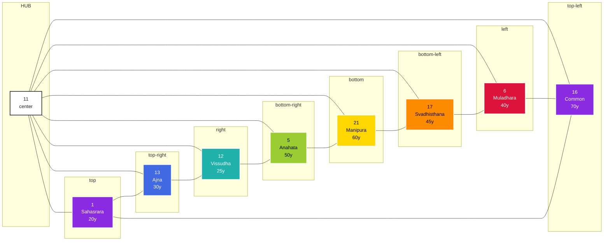
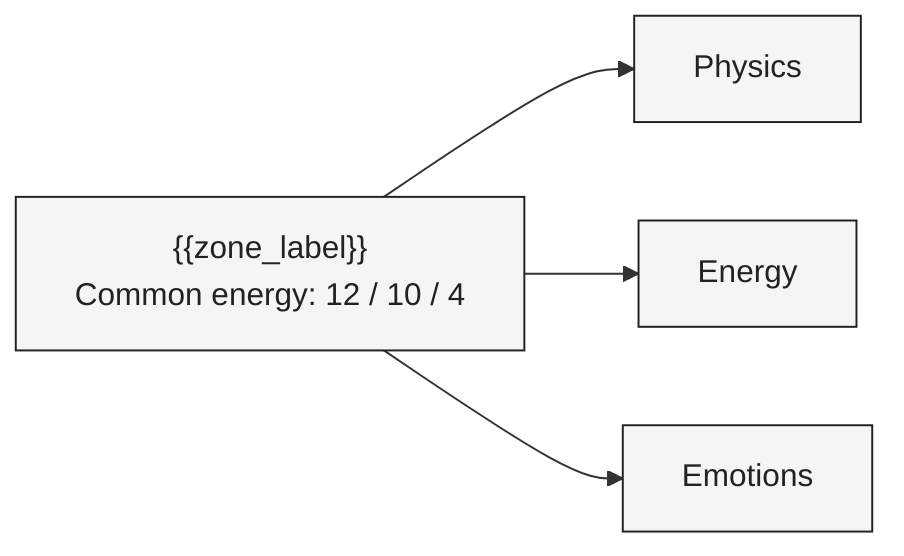
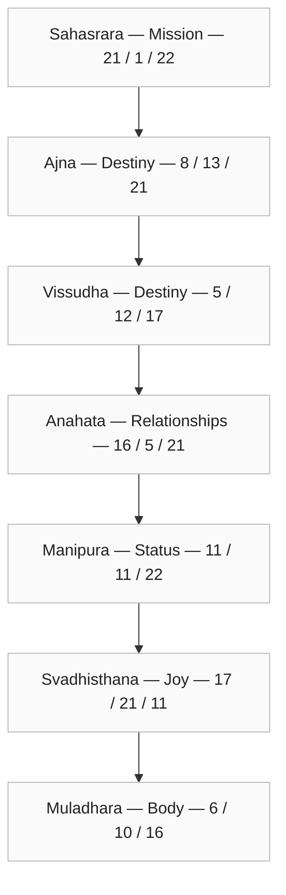

# Forecast Template — {{person_name}} ({{dob}})

> Canonical template. Structure only — meaning is filled in by downstream agents.
> Replace every `{{token}}` (and remove the token text) before rendering. Tokens are placeholders,
> never final content.

---

## Section 0 — Summary (≤ 300 words)

> Free-form 300-word summary. English or Thai; downstream copywriter decides.

- Person: `{{person_name}}`
- DOB: `{{dob}}`
- Person-year window: `{{person_year_start}}` → `{{person_year_end}}`
- Headline reading: `{{headline_reading}}`

## Section 1 — Octagram (mermaid)

> 8 chakra spokes around a central zone. See diagram above. Each spoke carries a numeric
> token (placeholder) and a person-year marker. Real values come from the personal-calculation
> tool (MET-447-B).

## Section 2 — Matrix (mermaid)

> Matrix of Destiny table — placeholder rows. Replace with computed values.

## Section 3 — Career-year list

- `{{career_year_1}}` — `{{career_year_1_label}}`
- `{{career_year_2}}` — `{{career_year_2_label}}`
- `{{career_year_3}}` — `{{career_year_3_label}}`
- `{{career_year_4}}` — `{{career_year_4_label}}`
- `{{career_year_5}}` — `{{career_year_5_label}}`

## Section 4 — Health card

| Chakra | Physics | Energy | Emotions |
|--------|---------|--------|----------|
| Sahasrara (Mission) | `{{hc_1_phys}}` | `{{hc_1_eng}}` | `{{hc_1_emo}}` |
| Ajna (Destiny) | `{{hc_2_phys}}` | `{{hc_2_eng}}` | `{{hc_2_emo}}` |
| Vissudha (Destiny) | `{{hc_3_phys}}` | `{{hc_3_eng}}` | `{{hc_3_emo}}` |
| Anahata (Relationships) | `{{hc_4_phys}}` | `{{hc_4_eng}}` | `{{hc_4_emo}}` |
| Manipura (Status) | `{{hc_5_phys}}` | `{{hc_5_eng}}` | `{{hc_5_emo}}` |
| Svadhisthana (Joy) | `{{hc_6_phys}}` | `{{hc_6_eng}}` | `{{hc_6_emo}}` |
| Muladhara (Body) | `{{hc_7_phys}}` | `{{hc_7_eng}}` | `{{hc_7_emo}}` |
| Common energy zone | `{{hc_result_phys}}` | `{{hc_result_eng}}` | `{{hc_result_emo}}` |

---

*Template version: `{{template_version}}` · Generated: `{{generated_at}}`*