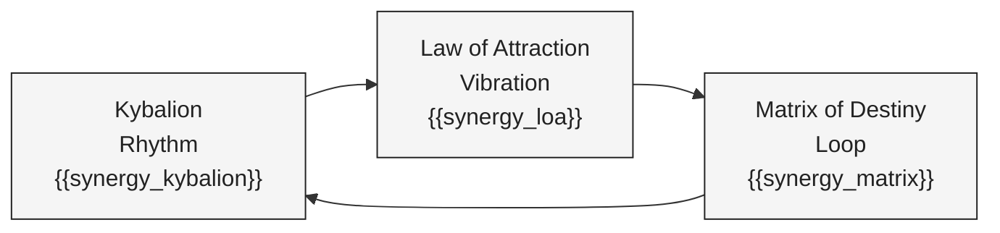
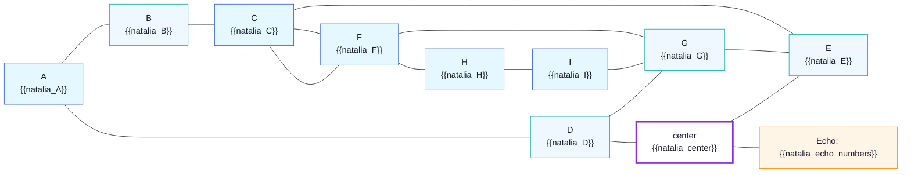
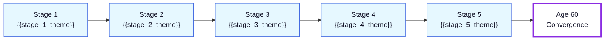

# Forecast Template — {{person_name}} ({{dob}})

> Canonical template. **Structure only** — meaning is filled in by downstream agents.
> Replace every `{{token}}` (and remove the token text) before rendering. Tokens are
> placeholders, never final content.
>
> Template covers the 10 sections of the **Project Omni-Self Forecast** output structure
> defined by MET-447 / MET-457. Sections are numbered 0–9 to match the spec; downstream
> agents must keep this numbering when filling in the body copy.

---

## Section 0 — บทสรุป 6 มุมมองเชิงลึกที่อ่านชะตาของคุณ

> Six-lens executive summary. Each lens is one short paragraph (~50 words) — the persona's
> full reading is captured by the downstream copywriter in `{{summary_paragraph}}`.

- Person: `{{person_name}}`
- DOB: `{{dob}}`
- Person-year window: `{{person_year_start}}` → `{{person_year_end}}`
- Headline reading: `{{headline_reading}}`

### Lens 1 — มุมมองจิตวิทยาเชิงลึก (Carl Jung)
`{{lens_jung_persona}}` (Persona) · `{{lens_jung_shadow}}` (Shadow)

### Lens 2 — มุมมองกฎแห่งการดึงดูด (Helena Blavatsky)
`{{lens_law_of_attraction_freq}}`

### Lens 3 — มุมมองกฎธรรมชาติ (The Kybalion)
`{{lens_kybalion_rhythm}}` · `{{lens_kybalion_cause}}`

### Lens 4 — มุมมองบุคลิกภาพ (MBTI)
`{{lens_mbti_type}}` · cognitive lead `{{lens_mbti_lead}}` · grip `{{lens_mbti_grip}}`

### Lens 5 — มุมมองจุดบรรจบแห่งวัย (Age 60 Forecast)
`{{lens_age60_role}}` · `{{lens_age60_target}}`

### Lens 6 — มุมมองดวงจีน (BaZi & Period 9)
Day Master `{{lens_bazi_day_master}}` · balance `{{lens_bazi_balance}}` · Period-9 fit `{{lens_bazi_period9_fit}}`

---

## Section 1 — จุดเชื่อมโยงแห่งปรัชญาและวัฏจักร (The Cosmic Synergy)

> Three engines (Kybalion rhythm → Law of Attraction vibration → Matrix-of-Destiny loop)
> locked into one cycle. Proof line summarizes whether the three engines point the same way.

- **Engine A — Kybalion rhythm:** `{{synergy_kybalion}}`
- **Engine B — Law of Attraction vibration:** `{{synergy_loa}}`
- **Engine C — Matrix of Destiny loop:** `{{synergy_matrix}}`
- **Proof line:** `{{synergy_proof}}`

---

## Section 2 — โปรแกรมชีวิตและแกนหลัก (Natalia Square 3×3)

> 3×3 grid with central hub. Each cell carries the canonical Natalia-square slot letter (A–I)
> and the computed value placeholder. Echo Numbers row surfaces any repeating numerals.

### 2.1 แกนบน (ความคิด / เริ่มต้น)
Day/month/year decoding → `{{natalia_top_axis_value}}` · lead token `{{natalia_top_token}}`

### 2.2 แกนกลาง (การงาน / วิถีชีวิต)
`{{natalia_mid_cycle}}` · maturity marker `{{natalia_mid_token}}`

### 2.3 แกนล่าง (ฐานราก / บุคลิก)
`{{natalia_base_drive}}` · persona surface `{{natalia_base_mask}}`

### 2.4 Echo Numbers
`{{natalia_echo_numbers}}` · influence `{{natalia_echo_influence}}`

---

## Section 3 — พรสวรรค์ ศักยภาพ และอดีตชาติ

### 3.1 พรสวรรค์หลักและศักยภาพแฝง
- Primary gift: `{{talent_primary}}`
- Latent gift: `{{talent_latent}}`

### 3.2 ชีวิตในอดีตและหางกรรม (Karmic Tail)
- Recurring pattern: `{{karmic_pattern}}`
- Lesson to unlock: `{{karmic_lesson}}`

---

## Section 4 — การเงิน ความสำเร็จ และบทบาทเชิงลึก

### 4.1 อาชีพและการเงิน
> Analyze industry fit from natal code only — do NOT reference current occupation.

- Best-fit industry: `{{career_industry}}`
- Income pattern: `{{career_income_pattern}}`
- Peak window: `{{career_peak_window}}`

### 4.2 บทบาทเชิงลึกในที่ทำงาน

| Role | Behaviour | Token |
|------|-----------|-------|
| Boss (ผู้นำ) | `{{role_boss}}` | `{{role_boss_token}}` |
| Subordinate (ผู้ตาม/ทีมเวิร์ค) | `{{role_sub}}` | `{{role_sub_token}}` |
| Active hand (มือขวา — รุก) | `{{role_active}}` | `{{role_active_token}}` |
| Receptive hand (มือซ้าย — รับ) | `{{role_receptive}}` | `{{role_receptive_token}}` |

---

## Section 5 — สายสัมพันธ์ ความรัก และครอบครัว

### 5.1 ความรักและวงใน
- Relationship pattern: `{{love_pattern}}`
- Inner-circle pull: `{{love_pull}}`
- Emotional blind spot: `{{love_blind_spot}}`

### 5.2 มรดกสายตระกูล (Generation Lines)
- Paternal line: `{{line_father}}`
- Maternal line: `{{line_mother}}`

---

## Section 6 — สุขภาพและจุดอ่อน (Health Card & Chakras)

> Seven chakras × three zones (physical / energy / emotional). Central zone value summarizes the row.

| # | Chakra | Physical (Axis A) | Energy (Axis B) | Emotional (Axis C) |
|---|--------|-------------------|-----------------|--------------------|
| 1 | Crown (Sahasrara) | `{{hc_1_phys}}` | `{{hc_1_eng}}` | `{{hc_1_emo}}` |
| 2 | Third Eye (Ajna) | `{{hc_2_phys}}` | `{{hc_2_eng}}` | `{{hc_2_emo}}` |
| 3 | Throat (Vishuddha) | `{{hc_3_phys}}` | `{{hc_3_eng}}` | `{{hc_3_emo}}` |
| 4 | Heart (Anahata) | `{{hc_4_phys}}` | `{{hc_4_eng}}` | `{{hc_4_emo}}` |
| 5 | Solar Plexus (Manipura) | `{{hc_5_phys}}` | `{{hc_5_eng}}` | `{{hc_5_emo}}` |
| 6 | Sacral (Svadhisthana) | `{{hc_6_phys}}` | `{{hc_6_eng}}` | `{{hc_6_emo}}` |
| 7 | Root (Muladhara) | `{{hc_7_phys}}` | `{{hc_7_eng}}` | `{{hc_7_emo}}` |
| **Σ** | **Zone value** | **`{{hc_result_phys}}`** | **`{{hc_result_eng}}`** | **`{{hc_result_emo}}`** |

### ข้อควรระวังและวิธีปรับสมดุล
- Watch: `{{health_watch}}`
- Balance ritual: `{{health_balance}}`

---

## Section 7 — ไทม์ไลน์ 5 ช่วงวัย และพยากรณ์อาชีพรายปี

### 7.1 5 Stages of Evolution (ก่อนจุดบรรจบอายุ 60)

| # | Stage | Age band | Theme | Marker |
|---|-------|----------|-------|--------|
| 1 | ปฐมบทและการสร้างเข็มทิศ | วัยเยาว์ – ต้น 20 | `{{stage_1_theme}}` | `{{stage_1_marker}}` |
| 2 | การสำรวจและขยายอาณาเขต | กลาง 20 – ต้น 30 | `{{stage_2_theme}}` | `{{stage_2_marker}}` |
| 3 | การปะทะและจุดวิกฤต | กลาง 30 – ต้น 40 | `{{stage_3_theme}}` | `{{stage_3_marker}}` |
| 4 | การบูรณาการและปรับขั้วพลังงาน | กลาง 40 – ต้น 50 | `{{stage_4_theme}}` | `{{stage_4_marker}}` |
| 5 | การตกผลึกและส่งมอบ | กลาง 50 – 59 | `{{stage_5_theme}}` | `{{stage_5_marker}}` |

### 7.2 Year-by-Year Career Forecast (อายุปัจจุบัน → 60)

> Computed from Personal Year (Matrix) × BaZi annual stem element. Each row gives one
> year of strategic guidance.

| Year (CE) | Age | Lead energy (Personal Year + BaZi stem) | Career situation | Strategy (Cognitive Fn) |
|-----------|-----|------------------------------------------|------------------|--------------------------|
| `{{career_year_1}}` | `{{career_year_1_age}}` | `{{career_year_1_energy}}` | `{{career_year_1_situation}}` | `{{career_year_1_strategy}}` |
| `{{career_year_2}}` | `{{career_year_2_age}}` | `{{career_year_2_energy}}` | `{{career_year_2_situation}}` | `{{career_year_2_strategy}}` |
| `{{career_year_3}}` | `{{career_year_3_age}}` | `{{career_year_3_energy}}` | `{{career_year_3_situation}}` | `{{career_year_3_strategy}}` |
| `{{career_year_4}}` | `{{career_year_4_age}}` | `{{career_year_4_energy}}` | `{{career_year_4_situation}}` | `{{career_year_4_strategy}}` |
| `{{career_year_5}}` | `{{career_year_5_age}}` | `{{career_year_5_energy}}` | `{{career_year_5_situation}}` | `{{career_year_5_strategy}}` |

---

## Section 8 — คำแนะนำและแนวทางปฏิบัติ (Actionable Protocols)

- **รายวัน (Daily):** `{{protocol_daily}}`
- **รายสัปดาห์ (Weekly):** `{{protocol_weekly}}`
- **รายเดือน (Monthly):** `{{protocol_monthly}}`
- **กลยุทธ์รับมือวิกฤต (Crisis Mastery):** `{{protocol_crisis}}`

---

## Section 9 — บทสรุปแห่งสัจธรรม (The Ultimate Synthesis)

> Melts every lens into a single map. Two closing paragraphs: how everything connects, and
> the personal truth to carry forward.

- **ความเกี่ยวข้องกันของสรรพสิ่ง (Interconnectedness):** `{{synthesis_interconnectedness}}`
- **สัจธรรมประจำตัว (Your Ultimate Truth):** `{{synthesis_ultimate_truth}}`

---

*Template version: `{{template_version}}` · Generated: `{{generated_at}}` · Sections 0–9 (Project Omni-Self)*